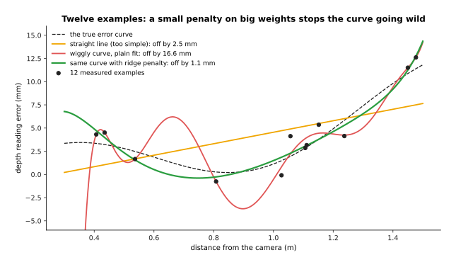
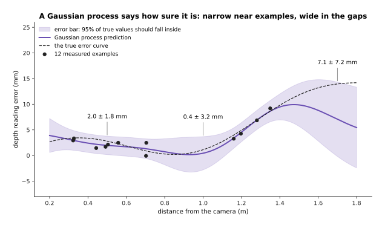
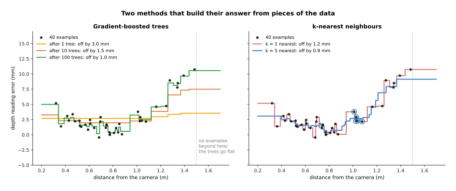

# Classical machine learning

Not every learned model on a robot is a neural network. Older learning methods,
often called **classical machine learning**, are still used every day next to
neural networks. This page answers three questions. What are the most common of
these methods? When does a small dataset make one of them a better choice than a
network? And where do they turn up on a robot arm?

It is for a beginner who has read [what a model is](01_what-a-model-is.md) and
[how a model learns](02_how-a-model-learns.md). You need to know what an example, a
label, a test set and overfitting are. Nothing else is assumed.

Every number on this page comes from a real run of the diagram script
`docs/diagrams/what_models_are_3.py`. The data is simulated, so that we know the true
answer exactly. The methods are real, written in NumPy.

> Before this page, it helps to have read [least-squares fitting](../../05_programming-techniques/04_fitting-and-estimation/02_most-used/01_least-squares-fitting.md), which linear regression in section 3 uses, and [nearest-neighbour search](../../05_programming-techniques/03_searching-and-matching/02_most-used/01_nearest-neighbour-search.md), which k-nearest neighbours in section 6 uses.

## Contents

1. [The idea in one sentence](#1-the-idea-in-one-sentence)
2. [The example used on this page](#2-the-example-used-on-this-page)
3. [Linear and ridge regression](#3-linear-and-ridge-regression)
4. [Gaussian processes: a prediction with an error bar](#4-gaussian-processes-a-prediction-with-an-error-bar)
5. [Gradient-boosted trees](#5-gradient-boosted-trees)
6. [k-nearest neighbours](#6-k-nearest-neighbours)
7. [When a small dataset makes them the better choice](#7-when-a-small-dataset-makes-them-the-better-choice)
8. [Where they are used on a robot arm](#8-where-they-are-used-on-a-robot-arm)
9. [Where they are useful, and where they are not](#9-where-they-are-useful-and-where-they-are-not)
10. [Libraries](#10-libraries)
11. [Why these rather than a network, and what they cost](#11-why-these-rather-than-a-network-and-what-they-cost)
12. [Where to read next](#12-where-to-read-next)

---

## 1. The idea in one sentence

When the input is a handful of measured numbers rather than a picture, and you have
tens or hundreds of examples rather than millions, a small classical method
usually learns as well as a neural network, with less data, less tuning and less
computing, and some of them also tell you how sure they are.

Here is an everyday example. A shop wants to guess how long a delivery will take
from the distance. It has fifty past deliveries. Nobody would build a large neural
network for this. You would draw a line or a smooth curve through the fifty points
and read the answer off it. That is what classical machine learning does. It fits a
simple shape to a small table of numbers.

A **neural network** is the opposite kind of tool. It has many adjustable weights,
and it can learn very complicated shapes, such as how pixels make up a mug. But it
needs a lot of examples to set all those weights, and a lot of computing to train.
With few examples and few input numbers, its extra power is not used, and it is
harder to train well.

---

## 2. The example used on this page

A robot arm has a **depth camera**: a camera that also measures how far away each
pixel is. Its distance readings are a little wrong, and the error changes with the
distance. To correct it, the robot measures a flat board at known distances. Each
measurement is one example. The input is the distance, from 0.3 to 1.5 metres. The
label is the error of the reading, in millimetres (mm). Once the robot has learned
the error curve, it can subtract the error from every future reading.

In this simulation, the true error curve is a made-up formula. Each measurement has
some random noise added, of about 1 millimetre. None of the methods is told the
formula. Each one sees only the examples.

To score a method, the script compares its learned curve with the true curve at 400
distances. It reports the **root mean square error (RMSE)**. That is: square each
difference, take the average, and take the square root. It is a typical size of the
difference, in millimetres. Lower is better.

---

## 3. Linear and ridge regression

**Linear regression** fits a straight line, or a flat plane when there are several
inputs. It chooses the line that makes the squared differences from the examples as
small as possible. This is **least squares fitting**, which Book 5 explains step by
step in its
[least squares fitting](../../05_programming-techniques/04_fitting-and-estimation/02_most-used/01_least-squares-fitting.md)
page.

A line can also fit a curve. You give it extra inputs made from the first one: the
distance, the distance squared, the distance cubed, and so on. These are called
**features**. The fit is still "linear", because the answer is still each feature
times a weight, added up. But the shape it draws can bend.

With more features, the curve can bend more. With too many for the number of
examples, it bends wildly to pass through every noisy point. That is
**overfitting**. The weights grow huge and cancel each other out.

**Ridge regression** fixes this with one change. It adds a penalty for big weights
to the thing it is minimising. The penalty is the sum of the squared weights, times
a small number called lambda (λ). The fit must now balance two wishes: pass close
to the examples, and keep the weights small. Small weights mean a gentle curve.

The script tried this with 12 examples and a curve with 10 weights (powers of the
distance up to the ninth).

- A straight line is too simple. Its error is 2.5 mm.
- The plain curve with 10 weights passes very close to all 12 examples. Its error on
  those examples is only 0.76 mm. But between them it swings wildly, and its error
  against the true curve is 16.6 mm. Its largest weight is 1,288.
- The same curve with a ridge penalty of λ = 0.01 fits the examples a little less
  closely, 0.99 mm. But its error against the true curve is only 1.1 mm. Its largest
  weight is 8.5.

Ridge regression is fast, has one setting to choose, and is easy to check. It is the
first thing to try on any small table of numbers.

---

## 4. Gaussian processes: a prediction with an error bar

A **Gaussian process (GP)** is a method that gives two things for every input: a
prediction, and how sure it is. It draws a smooth curve through the examples, plus
a band around the curve. The band is narrow close to examples and wide far from them.

It works from one assumption: inputs that are close together should have similar
answers. A formula called the **kernel** says how similar two answers should be,
given how far apart their inputs are. The most common kernel has three settings:

- the **length scale**: how far apart two inputs can be and still have similar
  answers;
- the **signal size**: how far the curve typically moves away from its average;
- the **noise**: how much each measurement is off.

The script picks these three settings by trying many combinations. It keeps the one
that makes the examples most likely under the model. This measure is called the
**marginal likelihood**. Here it chose a length scale of 0.25 m, a signal size of
4.0 mm and a noise of 0.8 mm. The true noise was 1 mm, so this is close.

To predict at a new distance, the GP looks at how similar that distance is to each
example, and takes a weighted average of the examples. Near examples count more. Its
error bar comes from the same numbers. If no example is nearby, the average rests on
little, and the band is wide.

The script gave it 12 examples with a gap in the middle, between 0.8 and 1.15
metres, and none beyond 1.35 metres.

The table below gives the GP's answer at four distances. The ± range covers two
standard deviations, so about 95% of true values should fall inside it. Read each
row across: the distance, what the GP predicts, and the truth.

| Distance | Where it is | GP prediction | True error |
| --- | --- | --- | --- |
| 0.50 m | among the examples | 2.0 ± 1.8 mm | 2.8 mm |
| 1.00 m | in the gap | 0.4 ± 3.2 mm | 1.1 mm |
| 1.25 m | among the examples | 6.1 ± 1.8 mm | 6.2 mm |
| 1.70 m | beyond all examples | 7.1 ± 7.2 mm | 14.0 mm |

At 1.70 metres the prediction is poor, 7.1 against a true 14.0. But the GP says so:
its range, from about 0 to 14.3, is wide and does include the truth. A robot can use
this. It can refuse to correct readings beyond 1.4 metres, or it can measure the
board again there. The
[uncertainty and confidence](../09_making-models-work-on-an-arm/03_also-used/01_uncertainty-and-confidence.md) page explains how a
robot turns such a range into a decision.

The cost is speed. A plain GP compares every new input with every example. Training
takes time that grows with the cube of the number of examples. At 1,000 examples it
is quick. At 100,000 it is too slow without special tricks, which libraries such as
GPyTorch provide.

---

## 5. Gradient-boosted trees

A **decision tree** answers a question by asking a few yes-or-no questions about the
input. For example: "Is the distance more than 1.1 metres? If yes, is it more than
1.3?" Each end of the tree holds one answer, the average label of the examples that
ended there. A small tree draws a staircase with a few steps.

One small tree is a rough answer. **Gradient boosting** builds many small trees, one
after another. Each new tree is trained to fix the mistakes that all the trees
before it still make. The steps are:

1. Start with a flat guess: the average label.
2. Work out the mistake on each example: the label minus the current guess.
3. Fit a small tree to those mistakes.
4. Add a small share of that tree to the guess. The share is called the **learning
   rate**. Here it is 0.1, so each tree fixes a tenth of what it found.
5. Go back to step 2, and repeat for as many trees as you choose.

The script used trees with two levels of questions, and 40 examples.

The left half of the picture shows the staircase after 1, 10 and 100 trees. After 1
tree the error is 3.0 mm. After 10 it is 1.5 mm. After 100 it is 1.0 mm.

Boosted trees are the strongest general method for **tabular data**: data that fits
in a table, where each column is a different measured quantity. A robot example is
predicting whether a grasp will succeed from a row of numbers: the object's weight,
its width, the gripper force, the friction of the surface and the approach angle.
Trees handle columns in very different units, and columns that matter only in some
cases, without any extra work.

Notice the right end of the left picture. Beyond the last example, the trees go
flat. A tree can only give answers it has seen, so it never predicts beyond the
highest or lowest label. This matters on a robot that meets a heavier object than
any in its data.

---

## 6. k-nearest neighbours

**k-nearest neighbours (kNN)** is the simplest learning method of all. It does no
training. It keeps every example. To predict for a new input, it finds the k
examples whose inputs are closest, and averages their labels. k is a number you
choose, such as 5.

The right half of the picture above shows it with k = 1 and k = 5:

- With k = 1, it copies the label of the single nearest example. The curve jumps at
  every example and follows every bit of noise. Its error is 1.2 mm.
- With k = 5, it averages five labels, which smooths out some noise. Its error is
  0.9 mm.

The circled points show one prediction. At 1.0 metre, the five nearest examples are
at 1.01, 1.03, 1.03, 1.04 and 1.08 metres. Their labels average 2.7 mm. The truth is
1.1 mm. Several of those five measurements happened to have noise in the same
direction, and kNN has no way to know.

Finding the nearest examples quickly is a problem of its own. Book 5 covers it in
[nearest-neighbour search](../../05_programming-techniques/03_searching-and-matching/02_most-used/01_nearest-neighbour-search.md).
On a robot, kNN is common in a simple form: "find the stored object most like this
one, and reuse the grasp that worked on it."

---

## 7. When a small dataset makes them the better choice

The script tested all four methods and a small neural network on the same problem,
with more and more examples. The network had one hidden layer of 64 neurons and was
trained by gradient descent. For each number of examples, each method was trained 8
times on fresh random examples, and the errors were averaged.

The table below gives the same results. Read each column as one number of training
examples. Each number is the average error in millimetres.

| Method | 10 | 20 | 40 | 80 | 160 | 320 | 640 |
| --- | --- | --- | --- | --- | --- | --- | --- |
| Ridge regression | 1.67 | 0.96 | 0.44 | 0.37 | 0.21 | 0.15 | 0.10 |
| Gaussian process | 1.57 | 0.56 | 0.32 | 0.29 | 0.16 | 0.13 | 0.07 |
| Boosted trees | 1.79 | 1.05 | 0.81 | 0.61 | 0.50 | 0.35 | 0.29 |
| k-nearest (k = 5) | 2.68 | 1.22 | 0.65 | 0.47 | 0.46 | 0.44 | 0.44 |
| Small neural network | 1.97 | 0.82 | 0.40 | 0.32 | 0.18 | 0.15 | 0.09 |

Four things stand out.

- With 10 examples, the network is worse than the Gaussian process, ridge
  regression and the boosted trees.
- With 20 examples, the Gaussian process is clearly the best, at 0.56 mm against the
  network's 0.82 mm.
- By about 80 examples, the network has caught up with the Gaussian process and ridge
  regression. From there on the three are close.
- On this problem the network never pulls ahead. The input is one number and the
  curve is smooth, so a network's extra power has nothing to do.

A network pulls ahead when the input is large and complicated, such as a picture or
a long recording, and there are many examples. Then no simple shape can describe the
answer, and only a network can learn one. So the rule of thumb is:

- **A few numbers in, tens to hundreds of examples:** try ridge regression, a
  Gaussian process or boosted trees first.
- **A picture, a point cloud or a sound in, thousands of examples or more:** use a
  neural network, usually one that someone else has already trained, as in
  [fine-tuning](../09_making-models-work-on-an-arm/02_most-used/01_fine-tuning.md).
- **Both:** a common mix is a network that turns a picture into a short list of
  numbers, and a classical method on top of those numbers.

---

## 8. Where they are used on a robot arm

The methods on this page turn up in many places on a robot arm:

- **Sensor correction.** Ridge regression or a Gaussian process learns the error of
  a depth camera, a force sensor or a joint encoder from a calibration run, as in
  this page's example.
- **Tuning settings from a few tries.** A Gaussian process predicts how well each
  setting will work, such as a grip force or a controller gain, and says how sure it
  is. A method called **Bayesian optimisation** uses those error bars to choose the
  next setting to try. It balances trying settings that look good with trying
  settings it knows little about. It often finds a good setting in 20 to 50 tries.
- **Predicting grasp success from a table.** Boosted trees learn from logged grasps,
  each a row of numbers, which grasps tend to fail.
- **Spotting faults in logs.** Boosted trees or kNN, trained on logged motor
  currents and temperatures, flag readings unlike normal running.
- **Reusing past grasps.** kNN finds the most similar stored object and reuses its
  grasp.
- **A small head on a big network.** A pretrained network turns each picture into a
  list of numbers. A **logistic regression**, the version of linear regression that
  gives a score for each class, learns the robot's own classes on top of those
  numbers from a few dozen labelled pictures. This is called a **linear probe**, and
  it is the simplest kind of fine-tuning.
- **Learning an arm's dynamics.** Gaussian processes and similar local methods were
  used to learn how an arm moves, before deep networks. The
  [learned arm models](../08_touch-and-body-models/03_also-used/02_learned-arm-models.md)
  page names some of this work.

Learning a correction on top of a physics formula, where the formula does most of
the work and a small model learns only what the formula gets wrong, is covered in
[learned dynamics models](../07_world-models/02_most-used/01_learned-dynamics-models.md).
The methods on this page are often the small model in that setup.

---

## 9. Where they are useful, and where they are not

Each method has a known way of failing. The table below lists them. Read each row
across: the method, what makes it fail, the sign you would see, and what people use
instead.

| Method | What makes it fail | The sign you would see | What people use instead |
| --- | --- | --- | --- |
| Linear and ridge regression | the true shape is not one the features can draw | the error stays high however much data you add | more features, a Gaussian process or boosted trees |
| Gaussian process | many examples, or many input numbers | training takes minutes or hours; the band is wide everywhere | GPyTorch's approximate methods, or a network |
| Gradient-boosted trees | a new input beyond the range of the examples | the prediction goes flat at the edge | ridge regression or a GP for smooth trends, or collect data there |
| k-nearest neighbours | many input numbers, such as raw pixels | "nearest" examples do not look alike at all | turn the input into a short list of numbers first, for example with a network |
| All of them | the input is a picture, a point cloud or a sound | poor results, however they are tuned | a neural network |

The last row is the main limit. Classical methods need the input as a short list of
numbers that already mean something, such as a distance or a weight. Turning a
picture into such numbers is exactly the job neural networks do well.

---

## 10. Libraries

The table below lists real libraries for these methods. Read each row as one
library: its language, the classes it provides, and a note on when to use it.

| Library | Language | What it provides | Note |
| --- | --- | --- | --- |
| scikit-learn | Python | `LinearRegression` and `Ridge` in `sklearn.linear_model`; `GaussianProcessRegressor` in `sklearn.gaussian_process`; `KNeighborsRegressor` in `sklearn.neighbors`; `HistGradientBoostingRegressor` in `sklearn.ensemble` | one consistent interface for all four methods; the place to start |
| XGBoost | Python, C++, R and others | gradient-boosted trees, for example `xgboost.XGBRegressor` and `xgboost.XGBClassifier` | fast, widely used, can train on a GPU |
| LightGBM | Python, C++, R and others | gradient-boosted trees, for example `lightgbm.LGBMRegressor` | very fast on large tables |
| GPyTorch | Python | Gaussian processes built on PyTorch, for example `gpytorch.models.ExactGP` | runs on a GPU and has approximations for large datasets |

All four libraries follow the same pattern: create the model, call `fit` with the
examples, then call `predict` on new inputs. GPyTorch is the exception. It is
trained with a PyTorch loop, like a neural network.

---

## 11. Why these rather than a network, and what they cost

The obvious alternative is to use a neural network for everything, since the rest of
this book does. With a few measured numbers and a small dataset, the classical
methods are the better choice for four reasons:

- They need fewer examples. Section 7 showed a Gaussian process reaching 0.56 mm
  with 20 examples, where the network needed about 40 to do as well.
- They have fewer settings to choose. Ridge regression has one. A network has a
  size, a learning rate, a number of training steps and more.
- They train in seconds on an ordinary computer, with no graphics card.
- Some are easy to inspect. You can read a ridge regression's weights. A Gaussian
  process says how sure it is at every input, without the extra work of the
  ensembles in [uncertainty and confidence](../09_making-models-work-on-an-arm/03_also-used/01_uncertainty-and-confidence.md).

What they cost:

- They cannot read pictures, point clouds or sound directly. Someone, or some
  network, must first turn the input into a short list of meaningful numbers.
- Each has a shape it cannot draw well. Trees go flat beyond their data. Ridge
  regression can only draw what its features allow. kNN gets confused by many
  inputs.
- A Gaussian process becomes slow as the number of examples grows, because every
  prediction compares against every example.
- With many examples and a complicated input, a network will eventually learn more.

---

## 12. Where to read next

- [The map of models](07_the-map-of-models.md) is the next page. It shows every kind
  of neural network model in this book.
- [Uncertainty and confidence](../09_making-models-work-on-an-arm/03_also-used/01_uncertainty-and-confidence.md) explains how a
  robot uses an error bar, like the Gaussian process's, to decide whether to act.
- [Fine-tuning](../09_making-models-work-on-an-arm/02_most-used/01_fine-tuning.md) covers adapting a pretrained network, including
  training a small head on top of it.
- [Learned dynamics models](../07_world-models/02_most-used/01_learned-dynamics-models.md)
  covers learning a correction on top of a physics formula.
- [Learned arm models](../08_touch-and-body-models/03_also-used/02_learned-arm-models.md)
  names Gaussian-process work on learning how an arm moves.
- [Least squares fitting](../../05_programming-techniques/04_fitting-and-estimation/02_most-used/01_least-squares-fitting.md)
  in Book 5 explains the maths under linear and ridge regression.
- [Nearest-neighbour search](../../05_programming-techniques/03_searching-and-matching/02_most-used/01_nearest-neighbour-search.md)
  in Book 5 explains how to find the nearest examples quickly.
