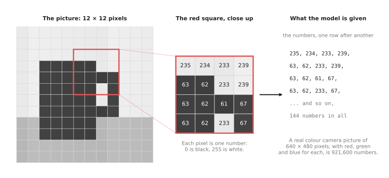
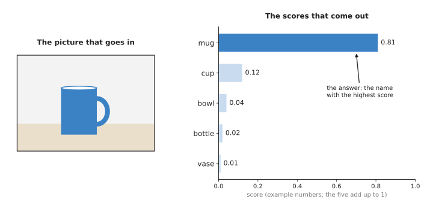
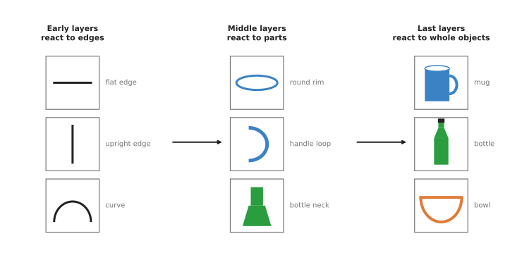

# Image classification

This page explains the simplest seeing model: one that looks at a whole picture
and gives it one name. It answers five questions. What does such a model do? What
goes in and what comes out? How does it work inside? How is it trained? And when
is it the right choice for a robot arm?

It is for a reader who has read the
[seeing models overview](../01_overview.md) and the first chapter of this book. You
do not need to know any machine learning. Every term is explained where it first
appears.

This page comes first in the chapter for a reason. Nearly every other seeing
model contains an image classifier, or most of one. So the ideas here come back on
every later page.

## Contents

1. [What it is](#1-what-it-is)
2. [What goes in and what comes out](#2-what-goes-in-and-what-comes-out)
3. [How it works inside](#3-how-it-works-inside)
4. [How it is trained](#4-how-it-is-trained)
5. [Well-known models](#5-well-known-models)
6. [Where it is used on a robot arm](#6-where-it-is-used-on-a-robot-arm)
7. [What goes wrong](#7-what-goes-wrong)
8. [Why classification, and what it costs](#8-why-classification-and-what-it-costs)
9. [Where to read next](#9-where-to-read-next)

---

## 1. What it is

An **image classifier** is a model that looks at a picture and says which one of a
fixed list of names fits it best.

The fixed list is chosen before training. Each name on the list is called a
**class**. A class can be a kind of object, such as "mug", "bowl" or "bottle". It
can also be a state, such as "gripper empty" or "gripper holding something".

Here is an everyday example. Imagine a sorting machine for fruit. A camera takes a
photo of each piece of fruit on a belt. A person could look at each photo and say
"apple", "orange" or "lemon". An image classifier does the same job. It looks at
the photo and picks one of the three names.

The classifier gives one name for the whole picture. It does not say where in the
picture the object is. It also does not say how many objects there are. If a photo
shows two apples and an orange, a classifier still gives just one name. The
[object detection](../02_most-used/01_object-detection.md) page covers models that find each
object separately.

---

## 2. What goes in and what comes out

The input is one picture. To a computer, a picture is a grid of numbers. Each small
square of the grid is a pixel. A grey picture has one number per pixel, which says
how bright it is. The number 0 means black, and the number 255 means white. A
colour picture has three numbers per pixel: one for red, one for green and one for
blue.

The picture below shows a tiny grey picture of a mug, and the numbers inside one
corner of it.

The left part is the picture, 12 pixels wide and 12 pixels high. The middle part
enlarges the red square and writes each pixel's number in it. The right part is
what the model is actually given: the same numbers, one row after another.

A real camera picture is much bigger. A picture 640 pixels wide and 480 pixels
high has 307,200 pixels. With three colour numbers each, that is 921,600 numbers.
Most classifiers first shrink the picture to a fixed size, often a square about
224 pixels wide, so that every picture gives the same number of numbers.

The output is one **score** for each class. A score is a number between 0 and 1.
A higher score means the model is more sure that the class fits. The scores for
all the classes add up to 1. The answer is the class with the highest score.

The picture below shows a picture of a mug going in, and five scores coming out.

The numbers in this picture are an example, not real output. In the example, "mug"
has the highest score, 0.81, so the answer is "mug". The second-highest score is
for "cup", which is a similar object. This is typical. A classifier that is wrong
is usually wrong in favour of a similar-looking class.

On a robot arm, the input is usually one picture from the camera, or a small part
cut out of it. The output is used as a yes-or-no check, or to choose what to do
next.

---

## 3. How it works inside

A classifier is a neural network. It is built in **layers**. Each layer takes a
grid of numbers in, does simple sums on it, and passes a new grid of numbers on to
the next layer. The page
[inside a neural network](../../01_what-models-are/03_inside-a-neural-network.md)
explains layers in general. This section explains what the layers of a
classifier do.

The most common kind of classifier is a **convolutional neural network (CNN)**. A
CNN works in these steps.

1. The first layer slides a small square, often 3 pixels by 3 pixels, across the
   whole picture. At each place, it multiplies the 9 pixel numbers by 9 fixed
   numbers and adds them up. This sliding sum is called a **convolution**. The 9
   fixed numbers are called a **filter**. The layer has many filters, and each one
   gives its own new grid.
2. Some filters give a large number where there is an edge in the picture. One
   filter reacts to flat edges. Another reacts to upright edges. Another reacts to
   curves. Nobody chooses these filters by hand. Training finds them.
3. Every few layers, the grid is made smaller. For example, each square of 2 by 2
   numbers is replaced by the largest of the four. This keeps the important
   numbers and throws away where exactly they were.
4. The next layers do the same thing again, on the smaller grids. Because they
   combine edges, their filters react to parts: a round rim, a handle loop, the
   neck of a bottle.
5. The last layers combine parts. Their numbers react to whole objects: a mug, a
   bottle, a bowl.
6. At the very end, one small layer turns those numbers into one score per class.
   A last step makes the scores positive and makes them add up to 1.

The picture below shows this build-up, from edges to parts to whole objects.

The drawings in the tiles show the kind of pattern that makes each layer give a
large number. Researchers have looked inside trained networks, and they found this
same order again and again.

A newer kind of classifier is the **vision transformer (ViT)**. It cuts the picture
into small squares, called **patches**, often 16 pixels by 16 pixels. It turns each
patch into a list of numbers. Then each patch's numbers are updated by looking at
all the other patches. This step is called **attention**. After many such layers,
the model gives the scores. A vision transformer needs more training pictures than
a CNN, but with enough pictures it is often more accurate.

The part of the network before the last layer is called the **backbone**. The last
layer, which gives the scores, is called the **head**. This split matters. A
backbone trained for classification has learned edges, parts and objects. Other
seeing models reuse that backbone and only change the head.

---

## 4. How it is trained

Training needs many pictures. Each picture needs a **label**, which is the correct
class written by a person.

The most famous collection of labelled pictures is **ImageNet**. The part of it
used in a yearly research contest has about 1.2 million training pictures, split
into 1,000 classes. The classes include many animals and everyday objects, such as
"coffee mug", "water bottle" and "screwdriver".

Training works like this.

1. The network starts with random numbers in its filters. Its answers are random.
2. It is shown a small batch of pictures, for example 32.
3. For each picture, it gives its scores. A program measures how wrong they are.
   The answer is very wrong if the correct class got a low score.
4. The program nudges every filter number a tiny amount, in the direction that
   makes the answers less wrong.
5. This repeats with the next batch, and so on, many times through all the
   pictures.

The page [how a model learns](../../01_what-models-are/02_how-a-model-learns.md)
explains this nudging in more detail.

Training from nothing on ImageNet takes many hours on many graphics cards. A robot
project almost never does that. Instead it starts from a network that someone else
already trained on ImageNet. It replaces the head with a new one for its own
classes, such as "gripper empty" and "gripper holding something". Then it trains a
little more on its own pictures. This is called **fine-tuning**.

Fine-tuning works with far fewer pictures, often a few hundred per class. It works
because the backbone already knows edges and parts, and those are the same in
every picture. Only the head has much to learn. Book 2 shows the same idea for a
detector in
[fine-tuning: why 80 pictures are enough](../../../02_perception/01_camera/02_finding-objects.md#64-fine-tuning-why-80-pictures-are-enough).

---

## 5. Well-known models

These are real classifiers that people use or build on. Each one is also used as a
backbone inside other seeing models.

- **AlexNet** was a CNN that won the ImageNet contest in 2012 by a wide margin.
  It showed that neural networks trained on graphics cards beat hand-written
  methods for pictures. Few people use it today, but it started the change.
- **ResNet** is a CNN from Microsoft Research, from 2015. It added "skip
  connections", which pass a layer's input straight on to a later layer. These
  made it possible to train much deeper networks. ResNet is still a common
  backbone.
- **MobileNet** is a family of small CNNs from Google. They are built to run fast
  on phones and small computers. They suit a robot with no graphics card.
- **EfficientNet** is a family of CNNs from Google. It comes in many sizes, from
  small and fast to large and accurate, so you can pick one that fits your
  computer.
- **ViT**, the vision transformer, came from Google in 2020. It showed that a
  transformer, first built for text, also works well on pictures.
- **ConvNeXt** is a CNN from Meta that copied design ideas from transformers. It
  showed that a CNN built in the modern way can match them.

---

## 6. Where it is used on a robot arm

A classifier is useful on an arm when the question has one answer for the whole
picture. Here is a worked example.

A robot arm picks cups from a shelf and puts them in a dish rack. Sometimes the
gripper closes but misses the cup. The arm should notice this before it moves to
the rack.

1. A small camera on the wrist points at the gripper fingers.
2. After the gripper closes, the program takes one picture.
3. A classifier with two classes looks at the picture: "holding a cup" and "empty".
4. If "empty" gets the higher score, the arm opens the gripper and tries again.
5. If "holding a cup" gets the higher score, the arm moves to the rack.

To build this, a person records a few hundred pictures of each case. They include
different cups, different light and different places on the shelf. They fine-tune
a small network, such as a MobileNet, on these pictures.

Other common uses on an arm:

- Checking whether a task worked. For example, "is the drawer open or closed?"
- Sorting parts into bins by kind, when a camera sees one part at a time.
- Checking the quality of a part: "good" or "scratched".
- Naming an object that another model has already found. A detector finds a box.
  The program cuts out that box and gives it to a classifier trained on finer
  classes, such as ten kinds of screw.

---

## 7. What goes wrong

A classifier can fail in several ways. Each one has a common fix.

It always picks a class, even when none fits. If you show a "mug or bowl"
classifier a photo of a shoe, it still says "mug" or "bowl". The fix is to add a
class such as "something else", and train it on many unrelated pictures. Another
fix is to refuse any answer whose top score is below a chosen number, such as 0.7.
This number is called a **threshold**.

It learns the background instead of the object. Suppose every "holding a cup"
picture was taken in the morning, and every "empty" picture in the afternoon. The
network might learn the light, not the cup. The fix is to vary the light,
background and place in both classes when you collect the pictures.

It fails on pictures that look different from its training pictures. A classifier
trained on clean photos may fail when the camera lens is dirty or the light is
dim. This problem is called a **domain gap**. The fix is to include such pictures
in training. People also change their training pictures on purpose: they make
copies that are darker, blurred or slightly turned. This is called **data
augmentation**.

The score is not an honest chance. A score of 0.95 does not mean the model is right
95 times out of 100. Networks are often too sure of themselves. The fix is to test
the model on pictures it did not train on, and to choose the threshold from what
you measure there.

It cannot say where or how many. If the picture holds two objects, the answer is
one name. When where or how many matters, you need
[object detection](../02_most-used/01_object-detection.md) instead.

---

## 8. Why classification, and what it costs

This section answers the four questions for a classifier: what it is, what it
does for you, why it rather than the obvious alternative, and what it costs.

It is a network that gives one name to one picture. It gives you a yes-or-no check,
or a choice among a few states, from one picture.

The obvious alternative is a hand-written rule. For example, "if more than 500
pixels in the gripper area are white, a cup is there". Rules like this are quick
to write and need no training pictures. But they break when the cup is a different
colour, or when the light changes. A classifier trained on varied pictures keeps
working in those cases. Choose a rule when the scene is controlled and simple.
Choose a classifier when it varies.

The other alternative is a detector. A detector also names objects, and it says
where they are. But a detector needs a box drawn around every object in every
training picture, which takes much longer to label. It is also bigger and slower.
If you only need one answer for the whole picture, a classifier is simpler and
cheaper.

The costs are these. You need a few hundred labelled pictures per class, taken in
the conditions the robot will meet. You need a computer that can run the network,
although a small classifier runs well without a graphics card. And you must accept
that it will sometimes be wrong, so the robot needs a safe action for a wrong
answer, such as trying again.

---

## 9. Where to read next

- The next page is [object detection](../02_most-used/01_object-detection.md). It adds boxes, so
  the robot knows where each object is.
- [Segmentation](../02_most-used/02_segmentation.md) goes one step further and marks the exact
  pixels of each object.
- [Inside a neural network](../../01_what-models-are/03_inside-a-neural-network.md)
  explains layers and sums in more detail.
- [How a model learns](../../01_what-models-are/02_how-a-model-learns.md) explains
  training.
- [The seeing models overview](../01_overview.md) compares all seven kinds of seeing
  model.
- Book 2's [models that find objects](../../../02_perception/02_object-perception/04_models-that-find.md)
  lists backbones you can download, with their licences.
