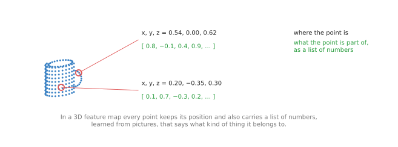
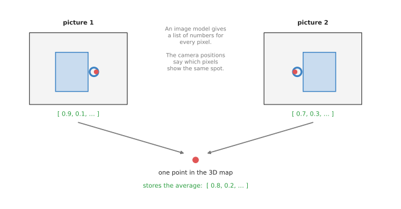
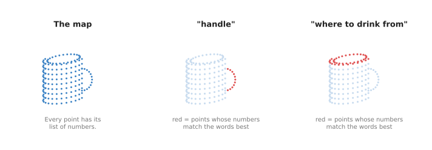

# 3D feature maps

This page is about 3D maps that carry meaning. In a plain point cloud, each point only
says where a surface is. In a 3D feature map, each point also says what kind of thing
it is part of. Then the arm can ask, in words, "where is the handle of the mug?", and
get back a place in 3D. This page answers three questions. Where does the meaning come
from? How does it get into 3D? And when is a map like this worth building, instead of
just asking an image model about the latest photo?

It is for a reader who has read the [chapter overview](../01_overview.md) and
[scene reconstruction](../02_most-used/02_scene-reconstruction.md). It helps to have read
[open-vocabulary models](../../02_seeing-models/02_most-used/03_open-vocabulary-models.md) too, because
this page uses the same image models, such as CLIP. The page explains what it needs
from them.

## Contents

1. [What it is](#1-what-it-is)
2. [What goes in and what comes out](#2-what-goes-in-and-what-comes-out)
3. [How it works inside](#3-how-it-works-inside)
   · [Step 1: a list of numbers for every pixel](#step-1-a-list-of-numbers-for-every-pixel)
   · [Step 2: lift the lists into 3D](#step-2-lift-the-lists-into-3d)
   · [Step 3: ask with words](#step-3-ask-with-words)
4. [How it is trained](#4-how-it-is-trained)
5. [Well-known models](#5-well-known-models)
6. [A worked example: "pick up the mug by its handle"](#6-a-worked-example-pick-up-the-mug-by-its-handle)
7. [What goes wrong](#7-what-goes-wrong)
8. [Why this rather than asking about each photo, and what it costs](#8-why-this-rather-than-asking-about-each-photo-and-what-it-costs)
9. [Where to read next](#9-where-to-read-next)

---

## 1. What it is

A 3D feature map is a 3D map in which every point stores a list of numbers that
describes what the point is part of, so that the map can be searched by meaning.

Here is an everyday example. A floor plan of a shop shows where the walls and shelves
are. That is like a plain point cloud. Now write a label on every shelf: "milk",
"bread", "soap". You can now find the bread by reading the labels. You do not need to
know its position in advance. A 3D feature map does the same for the space around a
robot arm. The difference is that its labels are lists of numbers, not words. That
lets it answer questions in words nobody wrote down in advance, such as "something to
drink from".

Each circled point has its `x`, `y` and `z`, and also a list of numbers that says what
kind of thing it belongs to.

A list of numbers like this is called a **feature**, which is where the page gets its
name. A real feature has a few hundred numbers. Two points on similar things, such as
two mug handles, have similar lists. Two points on different things, such as a handle
and a table, have different lists.

---

## 2. What goes in and what comes out

To **build** the map, three things go in.

- Photos of the scene from several places.
- The camera pose for each photo, and usually a depth picture too. On an arm with a
  wrist camera, the joint readings give the poses, as on the
  [scene reconstruction page](../02_most-used/02_scene-reconstruction.md#step-1-know-where-each-photo-was-taken).
- An image model that has already been trained, such as CLIP or DINO. The map borrows
  its meaning from this model.

What comes out is the map: a point cloud, or a fitted scene like a NeRF, where every
point has its feature.

To **use** the map, one thing goes in: a question, usually a few words such as "the
handle" or "the red cup". What comes out is a score for every point. The score says
how well that point matches the words. The arm takes the points with the highest
scores as its answer.

---

## 3. How it works inside

### Step 1: a list of numbers for every pixel

The meaning comes from an image model. Two kinds are common.

**CLIP**, short for contrastive language–image pretraining, is a model with two parts.
One part turns a picture into a list of numbers. The other part turns some words into
a list of numbers of the same length. It was trained so that a picture and a sentence
that describes it get similar lists. So a photo of a mug and the word "mug" end up
close together. The
[open-vocabulary models page](../../02_seeing-models/02_most-used/03_open-vocabulary-models.md)
explains this in more detail.

**DINO** is an image model that learned from photos alone, with no words. Its lists
are very good at saying "these two pixels are on the same kind of part", such as two
mug handles. But it cannot compare them with words.

CLIP gives one list for a whole picture. A map needs one list for every pixel. So the
map builder either uses a version of the model made to give a list for each small
patch of the picture, or runs the model on many small crops of the photo and gives
each pixel the lists of the crops it falls in.

### Step 2: lift the lists into 3D

Now every pixel of every photo has a list. The next step puts those lists onto points
in 3D.

The same spot on the handle shows up in both photos; the map stores one point for it,
with the average of its two lists.

There are two ways to do this.

The first way is **fusion**. It works directly on point clouds.

1. Use the depth picture to turn each pixel into a 3D point, as for any point cloud.
2. Give that point the pixel's list.
3. When the same spot shows up in another photo, average the new list with the old one.

Averaging helps because the image model makes small mistakes that differ from photo to
photo. The average over many views is steadier than any single view.

The second way is a **feature field**. It works like a NeRF from the
[scene reconstruction page](../02_most-used/02_scene-reconstruction.md). A NeRF answers "what colour
is this spot?" for any spot. A feature field also answers "what list of numbers does
this spot have?". It is fitted in the same way. The program draws the lists from a
camera pose, compares them with the image model's lists for the real photo, and
adjusts. Copying what one model knows into another model in this way is called
**distillation**.

### Step 3: ask with words

To ask a question, the software does three things.

1. Give the words, such as "handle", to the text part of CLIP. It gives back one list.
2. Compare that list with the list of every point in the map. The comparison gives
   one number per point. It is high when the two lists are alike.
3. Colour the points by that number, or just keep the points that score highest.

The same map answers "handle" with the handle and "where to drink from" with the rim,
and nobody labelled either part in advance.

The map was built once. After that, each new question is quick, because it is only
one comparison per point.

---

## 4. How it is trained

Most 3D feature maps need no new training of their own. All the learning is in the
image model that they borrow.

That image model was trained long before, on a huge collection of pictures. CLIP was
trained on about 400 million pictures with captions, collected from the internet. No
robot data was involved. The map builder simply uses what CLIP learned.

The map itself is then built for one scene, in one of the two ways in section 3.
Fusion needs no fitting at all; it only averages. A feature field is fitted like a
NeRF, which takes seconds to minutes on a graphics card.

So there are three stages, and only the first is training in the usual sense.

1. Train the image model once, on internet pictures. Someone else has usually done
   this already.
2. Build the map for this scene.
3. Ask as many questions as you like.

---

## 5. Well-known models

These are real systems that build 3D feature maps.

- **CLIP-Fields** (2022) fitted a small network that gives a CLIP-style list for any
  spot in a room, so a robot could find objects in the room by name.
- **LERF**, short for language embedded radiance fields (2023), adds CLIP lists to a
  NeRF. You can type a word and see the matching part of the scene light up in 3D.
- **F3RM**, from the paper "Distilled Feature Fields Enable Few-Shot Language-Guided
  Manipulation" (2023), used a feature field on a robot arm. After a few
  demonstrations of a grasp, the arm could make the same kind of grasp on new objects,
  and could be told in words which object to pick.
- **ConceptFusion** (2023) builds a 3D feature map by fusion as the camera moves,
  without any fitting. You can ask it with words, with a click on a picture, or with
  a sound.
- **OpenScene** (2023) gives every point of a scanned room a CLIP-style list. It can
  then find and outline objects by any name.
- **ConceptGraphs** (2023) groups the points into separate objects. It keeps one list
  for each object and notes how the objects sit relative to each other.

---

## 6. A worked example: "pick up the mug by its handle"

An arm stands at a kitchen counter with several mugs, a kettle and a sponge on it. A
person types: "pick up the green mug by its handle".

1. The arm moves its wrist camera over the counter and takes about a dozen colour and
   depth pictures. It saves its joint readings for each one.
2. The software runs the image model on each picture and builds a 3D feature map by
   fusion.
3. The software asks the map about "green mug". It keeps the points that score
   highest. These are the points of the green mug.
4. Within those points only, it asks about "handle". The highest scoring points are now
   the handle of the green mug.
5. A grasp model from the [grasp models chapter](../../04_grasp-models/01_overview.md)
   proposes many grasps on the mug. The software keeps only the grasps whose fingers
   close on the handle points.
6. The arm makes the best of those grasps.

If the person then says "now wipe the counter with the sponge", the map is still
there. The software only has to ask about "sponge". It does not need to look again,
unless something has moved.

F3RM goes one step further. Instead of the word "handle", it learns from a few
demonstrations where a person's grasp sits on a mug. It stores the lists at the points
where the fingers were. On a new mug, it looks for points with similar lists, and
grasps there.

---

## 7. What goes wrong

**Blurry edges.** The image model looks at patches of pixels, not single pixels. So the
lists near an edge are a mix of both sides. A thin handle often gets a list that is
partly "handle" and partly "table". The map finds the right area but not the exact
border. A [segmentation model](../../02_seeing-models/02_most-used/02_segmentation.md) such as SAM can
sharpen the outline afterwards.

**Words that mean the same.** The map may score "mug" and "cup" quite differently, even
when a person would use them for the same thing. People often try a few wordings and
combine the scores.

**Where things are relative to each other.** CLIP-style lists are good at "what is
this" and weak at "which one is on the left". "The mug to the left of the kettle" is
hard for a plain feature map. Systems such as ConceptGraphs keep a separate record of
objects and their positions, and a [language model](../../06_language-models/01_overview.md)
reads that record to answer such questions.

**The map goes out of date.** When the arm moves a mug, the map still shows it in the
old place. The software must update the part of the map that changed, or build it
again.

**Size.** Every point carries a list of hundreds of numbers. A map of a whole room can
take a lot of memory, far more than a plain point cloud. Many systems shrink the lists
or keep one list per object instead of one per point.

---

## 8. Why this rather than asking about each photo, and what it costs

A 3D feature map **is** a 3D map where every point carries a list of numbers borrowed
from an image model. It **does** let the arm find things and parts in 3D by name,
including names nobody planned for.

The obvious alternative is to skip the map. Take the latest photo. Ask an
[open-vocabulary model](../../02_seeing-models/02_most-used/03_open-vocabulary-models.md), such as
Grounding DINO, to draw a box around "the green mug". Then read the depth picture
inside that box to get the 3D points.

Why build a map instead?

- The map remembers what is out of view. If the green mug is behind the kettle in the
  latest photo, the map still knows where it is from an earlier photo.
- Many views are steadier than one. The average over a dozen photos is less likely to
  be wrong than any single photo.
- It gives 3D directly. A box on a photo covers some background too, so the depth
  inside the box includes points that are not the mug.
- It answers many questions from one build. Each question is fast, with no new photos.

What does it cost you?

- Time to build. The arm has to look from several places first.
- Memory and a graphics card. Hundreds of numbers per point add up.
- It goes out of date. In a scene where things move often, the latest photo is more
  honest than an old map.
- It is only as good as the image model. If CLIP does not know the name of a part, the
  map does not either.

So a 3D feature map suits a scene that stays mostly still while the arm does several
jobs in it, such as tidying a table. For one quick pick in a scene that keeps
changing, asking about the latest photo is simpler.

---

## 9. Where to read next

- [Open-vocabulary models](../../02_seeing-models/02_most-used/03_open-vocabulary-models.md) explains
  CLIP, Grounding DINO and SAM, the image models these maps borrow from.
- [Scene reconstruction](../02_most-used/02_scene-reconstruction.md) explains the NeRF fitting that
  feature fields build on.
- [Language models as planners](../../06_language-models/03_also-used/01_language-models-as-planners.md)
  shows how a language model breaks a request such as "tidy the table" into steps,
  each of which can be a question to a map like this.
- [Foundation models](../../../03_frameworks/08_frontier/02_foundation-models.md) in Book 3
  covers the large models that link words, pictures and arm movements in one network.
- Go back to the [chapter overview](../01_overview.md) to see how this page fits with the
  other three.
