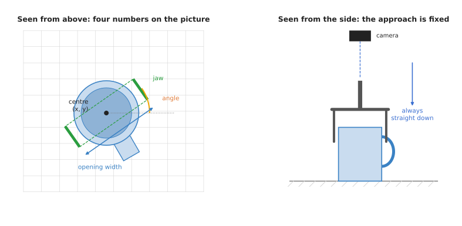
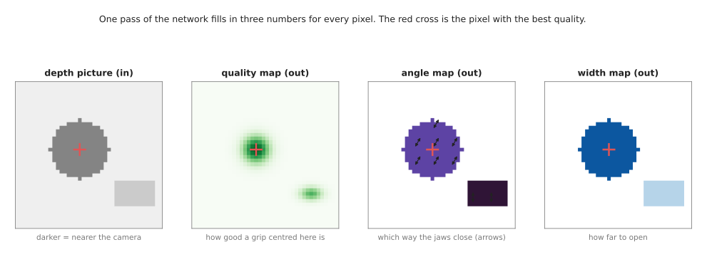
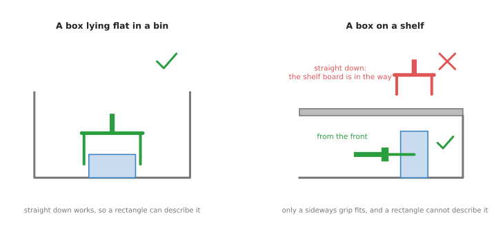

# Top-down grasp detection

This page is about the simplest kind of grasp model. It looks at one picture taken
from above, and it draws rectangles on that picture. Each rectangle says where the
two jaws of a gripper should close. The gripper then comes straight down and
closes there.

The page answers these questions. What does such a model take in, and what does it
give back? How does it work inside? What was it trained on? Which real models do
this? When is it the right choice, and when is it the wrong one?

It is for a reader who has read the [grasp models overview](../01_overview.md). You
should know what a pixel is and what a depth picture is. The
[camera basics](../../../02_perception/01_camera/01_basics.md) page in Book 2 covers
both. The page
[inside a neural network](../../01_what-models-are/03_inside-a-neural-network.md#4-convolutional-layers-small-pattern-detectors)
explains the convolutional layers this kind of model is built from.

## Contents

1. [What it is](#1-what-it-is)
2. [What goes in and what comes out](#2-what-goes-in-and-what-comes-out)
3. [How it works inside](#3-how-it-works-inside)
4. [How it is trained](#4-how-it-is-trained)
5. [Well-known models](#5-well-known-models)
6. [A worked example: a mug on a table](#6-a-worked-example-a-mug-on-a-table)
7. [What goes wrong](#7-what-goes-wrong)
8. [Why this kind, and what it costs](#8-why-this-kind-and-what-it-costs)
9. [The written alternative](#9-the-written-alternative)
10. [Where to read next](#10-where-to-read-next)

---

## 1. What it is

A top-down grasp detector draws grasp rectangles on a picture taken from above.

Imagine you look down at a table from a ladder. You see a mug from the top: a ring
with a handle sticking out. Someone asks you to show where to pinch the mug with a
pair of tongs. You could draw a short line across the mug, with a mark at each end
where the tongs touch. That drawing is all a top-down grasp detector gives. It
draws that kind of mark on the picture, many times, and gives each one a score.

The word **detection** is borrowed from
[object detection](../../02_seeing-models/02_most-used/01_object-detection.md). An object detector
finds objects in a picture and draws a box around each one. A grasp detector finds
grasps in a picture and draws a rectangle for each one.

---

## 2. What goes in and what comes out

The input is one **depth picture** taken by a camera that looks straight down.
Each pixel of a depth picture holds a distance from the camera, not a colour. A
tall object is close to the camera, so its pixels hold small numbers. The table is
further away, so its pixels hold larger numbers. Some models also take the normal
colour picture, but many use depth alone.

The output is a list of **grasp rectangles**. A grasp rectangle is a rectangle
drawn on the picture with a jaw at each short end. It carries four numbers.

- The **centre**: the pixel where the middle of the gripper should go, as an `x`
  and a `y` on the picture.
- The **angle**: how far the gripper should turn around the up-down line before
  it closes.
- The **opening width**: how far apart the jaws should be just before they close.

That is four numbers: `x`, `y`, angle and width. A fifth number, how far down the
gripper should go, is read from the depth picture at the centre pixel. The
direction the gripper comes from is not a number at all. It is always straight
down, along the line the camera looks.

On the left, the four numbers drawn on a picture of a mug. On the right, the same
grasp seen from the side: the camera looks down, and the gripper comes down along
the same line.

Most models also give a **score** for each rectangle. The score is a number
between 0 and 1. A high score means the model thinks a grasp there is likely to
hold. The robot usually tries the rectangle with the highest score.

---

## 3. How it works inside

There are two main ways to build this kind of model. The older way finds one
rectangle for the whole picture. The newer way paints an answer onto every pixel.

### One rectangle per picture

The earliest models looked at many small patches of the picture, one at a time,
and asked a network "is there a good grasp here?" This was slow, because the
picture has thousands of patches. A later model looked at the whole picture once
and gave back the four numbers of one rectangle directly. This was fast, but it
could only give one grasp per picture.

### A map for every pixel

The newer way gives an answer for every pixel at once. It works in three steps.

1. The depth picture goes into a **convolutional neural network (CNN)**. A CNN is a
   network built from small pattern detectors that slide across the picture. The
   [inside a neural network](../../01_what-models-are/03_inside-a-neural-network.md#4-convolutional-layers-small-pattern-detectors)
   page explains how.
2. The network gives back three new pictures, each the same size as the input.
   These are called **maps**.
   - The **quality map** holds, for each pixel, how good a grasp centred on that
     pixel would be.
   - The **angle map** holds, for each pixel, which way the jaws should close.
   - The **width map** holds, for each pixel, how far the jaws should open.
3. A short piece of ordinary code finds the pixel with the highest quality. It
   reads the angle and the width at that same pixel. Those three values, plus the
   pixel's position, are the grasp.

The network fills in a quality, an angle and a width for every pixel in one pass.
The red cross marks the best pixel, which is in the middle of the mug.

This design is called **generative**, because the network generates a grasp for
every pixel rather than checking grasps one at a time. Its big advantage is speed.
One pass through a small network gives every possible grasp in the picture. A model
this fast can run again while the arm is moving, so the grasp can follow an object
that is pushed or slides.

---

## 4. How it is trained

The model learns from pictures in which people or programs have already marked good
grasps.

A **grasp dataset** here is a set of depth pictures, each with a list of good grasp
rectangles drawn on it. During training, the network sees a picture, paints its
three maps, and is told how far its maps are from the marked rectangles. It changes
its weights a little to be less wrong next time. The
[how a model learns](../../01_what-models-are/02_how-a-model-learns.md) page
explains this loop.

Two datasets are used most.

- The **Cornell grasping dataset** has under a thousand pictures of about 240
  everyday objects. People drew the good and bad rectangles by hand. It is small,
  and most early models were tested on it.
- The **Jacquard dataset** has more than 50,000 pictures of about 11,000 objects.
  The pictures were made in a simulator, and the grasps were tested in the
  simulator too, so no person drew them.

These datasets are small compared with the ones that other kinds of model use. That
is possible because the task is narrow. The network only has to learn which shapes
in a depth picture two jaws can close around.

To make the data go further, the pictures are turned, shifted and cropped during
training. A mug turned by 30 degrees is still a mug, and its good grasps turn with
it. This is called **data augmentation**.

---

## 5. Well-known models

These are real models of this kind. Book 3's
[models that grasp](../../../03_frameworks/02_gripping/04_models-that-grasp.md#2-planar-models-a-grasp-is-a-rectangle)
lists their code, their licences and how old they are.

- **Lenz, Lee and Saxena's detector (2015)** was one of the first to use deep
  learning for grasp rectangles. It checked many small patches of the picture one
  by one.
- **Redmon and Angelova's detector (2015)** looked at the whole picture once and
  gave back one rectangle directly. It was much faster than checking patches.
- **GG-CNN**, the generative grasping convolutional neural network (2018), paints
  the quality, angle and width maps described above. It is very small, which lets it
  run again and again while the arm moves.
- **GR-ConvNet**, the generative residual convolutional neural network (2020), does
  the same job with a larger network. It can take a colour picture as well as depth.

All four draw rectangles for a gripper that comes straight down. The
[grasp quality models](02_grasp-quality-models.md) page covers Dex-Net, which also
works on top-down grasps but in a different way: it scores grasps one at a time.

---

## 6. A worked example: a mug on a table

Here is how a top-down detector picks up a mug, step by step.

1. A depth camera is fixed above the table, looking straight down. It takes one
   depth picture.
2. The picture is cut down to the square the model expects and passed to the
   network.
3. The network paints its three maps. The quality map is brightest in the middle
   of the mug's body, where the jaws can close across the mug.
4. Code finds the brightest pixel. It reads an angle of 60 degrees and a width
   a little wider than the mug.
5. Code turns the pixel into a point on the table, using the camera's position.
   Book 2's
   [finding objects](../../../02_perception/01_camera/02_finding-objects.md) page
   shows how a pixel becomes a point in the room.
6. The arm moves the open gripper above that point, turns its wrist to 60 degrees,
   goes straight down to the depth read from the picture, and closes.
7. The arm lifts. If the model runs fast enough, it keeps looking during step 6
   and corrects the grasp if the mug moved.

The model never saw this mug before. It works because the mug's shape from above,
a round blob of near pixels, looks like thousands of shapes it saw in training.

---

## 7. What goes wrong

The biggest limit is built into the answer. A rectangle can only describe a gripper
that comes straight down.

On the left, straight down works and a rectangle describes it. On the right, the
shelf board is in the way, and the only grasp that fits comes from the front.

The common problems are these.

- Some objects need a side grasp. A plate leaning on a wall, a box on a shelf
  or a bottle lying against the side of a bin cannot be held from above. The model
  has no way to say "from the side". People switch to a
  [six-degree-of-freedom model](../02_most-used/01_six-dof-grasps.md) for these.
- Tall objects are hard. The model sees only the top of a tall object. It cannot tell
  whether the jaws are long enough to reach down its sides.
- Shiny and see-through objects are often missed. A depth camera often gives no depth for glass
  or polished metal. The model then sees a hole where the object is. Book 2's
  [models that find](../../../02_perception/02_object-perception/04_models-that-find.md#17-transparent-and-shiny-objects)
  covers ways around this. The
  [depth from pictures](../../02_seeing-models/03_also-used/02_depth-from-pictures.md) page covers
  models that fill in missing depth.
- Your gripper may differ from the one in training. The model learned widths for the gripper in its
  training data. If your gripper opens less far, some of its grasps will be too
  wide. Code must throw those away.
- The model has no sense of the task. The model does not know that a knife should be held by
  the handle. The [suction and affordance](../02_most-used/02_suction-and-affordance.md) page
  covers models that do.

---

## 8. Why this kind, and what it costs

A top-down grasp detector takes one depth picture and gives the best place to close
two jaws, coming straight down.

What it does for you is give a fast, simple answer for objects you have never seen.
The model is small. It runs on an ordinary computer without a graphics card. Its
answer is easy to draw on the picture and check by eye.

The obvious alternative is a
[six-degree-of-freedom grasp model](../02_most-used/01_six-dof-grasps.md), which can grasp from any
direction. The reason to choose the top-down kind is that many real jobs never need
another direction. Parts on a conveyor, parcels on a table and objects spread out on
a flat surface can all be picked from above. For those jobs, the six-degree-of-freedom
model adds cost and gives nothing back. It needs a point cloud, a strong NVIDIA
graphics card and usually a licence that forbids selling what you build.

The other alternative is a rule you write yourself, such as "close across the
narrowest part of the object's outline". Book 3's
[choosing a grip](../../../03_frameworks/02_gripping/03_choosing-a-grip.md#10-why-a-rule-beats-a-network)
argues that a rule is better when the objects are known. The model is better when
they are not.

What it costs you is the straight-down limit. It also costs you the age of the code.
The best-known models were written around 2018 to 2020, and they need some work to
run on current software.

---

## 9. The written alternative

A written top-down grasp is built from Book 5's picture methods and Book 3's
rules. A depth limit from [thresholding and colour masks](../../../05_programming-techniques/05_image-and-point-cloud-processing/02_most-used/01_thresholding-and-colour-masks.md) marks what
stands above the table. [Edges and contours](../../../05_programming-techniques/05_image-and-point-cloud-processing/03_also-used/01_edges-and-contours.md) traces each object's
outline. The smallest turned rectangle round that outline gives the angle for
the wrist, and the outline's width checks that the part fits between the
fingers. Book 3's [choosing a grip](../../../03_frameworks/02_gripping/03_choosing-a-grip.md) then chooses where on the outline to
close. The written way wins for known objects spread out on a flat surface. The
model wins on objects nobody has listed.

---

## 10. Where to read next

- [Six-degree-of-freedom grasps](../02_most-used/01_six-dof-grasps.md) removes the straight-down
  limit.
- [Grasp quality models](02_grasp-quality-models.md) scores top-down grasps one at
  a time instead of painting maps.
- [Object detection](../../02_seeing-models/02_most-used/01_object-detection.md) is the seeing
  model that this kind borrows its name and its methods from.
- Book 3's
  [models that grasp](../../../03_frameworks/02_gripping/04_models-that-grasp.md)
  lists the code and the licences.
- Book 3's [grippers and hardware](../../../03_frameworks/02_gripping/02_grippers-and-hardware.md)
  explains parallel-jaw grippers and how far they open.
