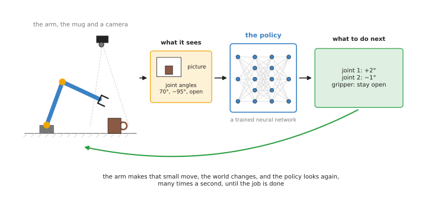
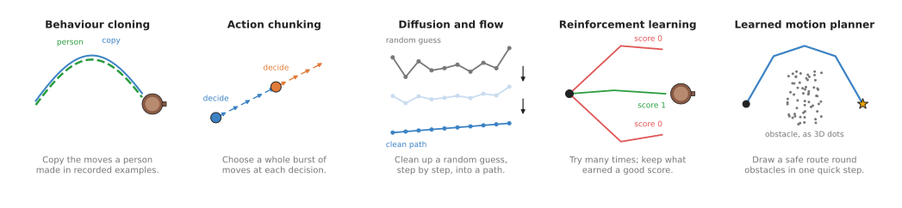

# Movement models

This chapter is about models that move a robot arm. The earlier chapters of this
book were about models that look at a picture and say what is in it, or where to
hold an object. The models in this chapter go one step further. They decide how the
arm should move, moment by moment.

This page is the overview of the chapter. It answers four questions. What is a
movement model for? Why do people call it a policy? What kinds are there, and how do
they differ? And how does this kind of model connect to the other kinds in this
book?

It is for a reader who has read
[what a model is](../01_what-models-are/01_what-a-model-is.md) and
[how a model learns](../01_what-models-are/02_how-a-model-learns.md). You do not
need anything else. Every new word is explained where it first appears.

## Contents

1. [What a movement model is for](#1-what-a-movement-model-is-for)
2. [Why a movement model is called a policy](#2-why-a-movement-model-is-called-a-policy)
3. [What a policy takes over, and what it leaves alone](#3-what-a-policy-takes-over-and-what-it-leaves-alone)
4. [The pages in this chapter](#4-the-pages-in-this-chapter)
5. [The kinds side by side](#5-the-kinds-side-by-side)
6. [How movement models connect to the other kinds](#6-how-movement-models-connect-to-the-other-kinds)
7. [Where to read next](#7-where-to-read-next)

---

## 1. What a movement model is for

Movement models decide how the arm should move, moment by moment.

Think about picking up a mug from a table. A person does not plan every tiny
movement of the hand before starting. They look, move the hand a little, look
again, and move a little more. When the hand gets close, they slow down. If the mug
slides, they follow it. The movement is made of many small decisions, and each one
uses what the person can see at that moment.

A movement model does the same job for a robot arm. The question it answers is
this:

> Given what the camera sees now, and where the joints are now, what should the arm
> do next?

The answer is a small move. It might be "turn joint 1 by 2 degrees and joint 2 by
minus 1 degree, and keep the gripper open". The arm makes that move. Then the model
looks again and chooses the next move. This repeats many times a second until the
job is done.

This is different from the other models in this book. A seeing model says "there is
a mug here". A grasp model says "hold the mug by its handle, with the gripper turned
this way". Neither of them moves the arm. A movement model is the one that actually
produces the motion.

---

## 2. Why a movement model is called a policy

People who work on robot learning usually call a movement model a **policy**. You
will see this word everywhere, so it is worth knowing where it comes from.

In everyday life, a policy is a rule that says what to do in each situation. A shop
might have a returns policy: if the item is unused and you have the receipt, you get
your money back. The rule does not care who you are. It looks at the situation and
gives an answer.

In robot learning, a policy is the same kind of thing. It is a rule that looks at
the situation and gives the action to take. The difference is that nobody writes
this rule by hand. The rule is a trained neural network. It learned what to do from
examples, or from practice.

Two more words go with it.

- An **observation** is what the policy is given about the situation. For an arm, it
  is usually one or more camera pictures plus the current joint angles. A **joint
  angle** is how far a joint is turned, read from a sensor in the joint.
- An **action** is what the policy gives back. For an arm, it is usually the joint
  angles the arm should move to next, or how far the gripper should move, plus
  whether the gripper should open or close.

So a policy turns an observation into an action. The page
[actions and observations](02_most-used/04_actions-and-observations.md) looks at
these numbers in detail. The picture below shows the loop.

The camera and the joint sensors give the observation. The policy turns it into the
next small move, the arm makes that move, and then the policy looks again.

How often does the loop run? The policies in this chapter usually choose a new
action somewhere between 10 and 50 times a second. The motors run much faster than
that, so there is always ordinary control code underneath the policy. That code
takes each target and moves the motors smoothly towards it.

---

## 3. What a policy takes over, and what it leaves alone

A policy does not replace everything that moves an arm. This matters, because it is
easy to picture a policy as one network that does the whole job.

A robot arm that does not use learning at all has several layers of ordinary code.
One layer chooses the route through free space, so that the arm does not hit the
table. This is called a **motion planner**. Another layer turns each target into
motor commands, and keeps the motors within their speed limits. This is called the
**controller**. Book 3 explains both, in
[the arm movement chapter](../../03_frameworks/03_arm-movement/01_overview.md).

Most policies take over one part of this: choosing the next small move, especially
close to the object. That is where the hard part of the task usually is. The mug
might be in a slightly different place each time. The drawer might stick. The towel
might fold in a new way. These things are hard to write rules for, and easy to show
by example.

The policy still needs a controller underneath it. And for a long move through free
space, the ordinary planner is usually still the better tool. It is fast, it checks
for collisions, and it gives the same answer every time. The Book 3 page
[learned motion](../../03_frameworks/03_arm-movement/05_learned-motion.md#1-which-part-of-the-move-a-policy-stands-in-for)
goes through this layer by layer.

---

## 4. The pages in this chapter

The chapter has eight pages, in two groups. Most of them describe one kind of
movement model. The kinds differ in how they learn, and in what they give back.

The first group, **most used**, holds the pages you need for almost any learned
policy on a robot arm today. Three of them are the copying models that most real
systems are built from. The fourth is about the numbers those models take in and
give out, which every policy depends on.

- [Behaviour cloning](02_most-used/01_behaviour-cloning.md). A person does the task many times,
  and the model learns to copy what the person did at each moment. This is the
  simplest kind and the base for most of the others. It also shows how to tell a
  policy which of several tasks to do.
- [Action chunking transformers](02_most-used/02_action-chunking-transformers.md). A copying
  model that chooses a whole burst of moves at once, instead of one move at a time.
  The best-known example is ACT, which is short for Action Chunking with
  Transformers.
- [Diffusion and flow policies](02_most-used/03_diffusion-and-flow-policies.md). A copying model
  that starts from a random guess of the next moves and cleans it up, step by step,
  into a good path. This lets it keep two different good ways of doing a task
  apart, instead of mixing them.
- [Actions and observations](02_most-used/04_actions-and-observations.md). Not a kind of
  model, but the numbers every kind uses: joint angles or gripper position, a place
  or a change, how a turn is written, and how every number is rescaled. These
  choices decide whether data from another robot can be used.

The second group, **also used**, holds kinds that are used often, but less. Each
one solves a problem that copying alone cannot: no person can show the task, the
ordinary planner is too slow, nobody can write a score, or there are too few robot
recordings.

- [Reinforcement learning policies](03_also-used/01_reinforcement-learning-policies.md). A model
  that learns by trying the task many times, usually in a computer simulation, and
  getting a score for each try.
- [Learned motion planners](03_also-used/02_learned-motion-planners.md). A model that learns to
  do one job of the ordinary planning code, such as finding a route around
  obstacles or working out joint angles, much faster than the ordinary code can.
- [Reward and progress models](03_also-used/03_reward-and-progress-models.md). A model that
  looks at the camera pictures of an attempt and judges how well it is going. It
  gives reinforcement learning a score when nobody can write one by hand, and it
  can tell a copying policy's owner which attempts failed.
- [Learning from human video](03_also-used/04_learning-from-human-video.md). Models that
  take something useful for the robot out of videos of people using their hands,
  so the robot needs fewer recordings of its own.

The picture below shows the idea behind the first five kinds in one small drawing.

The first three kinds all learn from people doing the task. The fourth learns from
its own tries. The fifth learns from the output of an ordinary planner. The two
newer kinds, judge models and learning from human video, help the others: one
supplies a score, and the other supplies cheaper data.

---

## 5. The kinds side by side

The table below compares the kinds, with one row for each page. Read each row
across to see what one kind learns from, what it gives back, what it is good at,
and what it costs. Read down a column to compare the kinds on one point. The last
row is the actions page, which is not a kind of model but applies to all of them.

| Page | Group | What it learns from | What it gives back | What it is good at | What it costs |
| --- | --- | --- | --- | --- | --- |
| Behaviour cloning | most used | recordings of a person doing the task | the next single move | simple to build and to train | small mistakes add up; it mixes different ways of doing the task |
| Action chunking transformers | most used | recordings of a person doing the task | the next burst of moves, often about 100 | fine, smooth two-handed tasks from a few dozen recordings | slower to react inside a burst; a bigger network |
| Diffusion and flow policies | most used | recordings of a person doing the task | the next burst of moves, cleaned up from a random guess | keeps two good ways of doing a task apart | slower to run, because it cleans up in several steps |
| Actions and observations | most used | nothing; it is about the numbers the others learn from | a choice of how each number is written and rescaled | making a policy train well, and data from different robots agree | careful conversion, where a mistake gives no error message |
| Reinforcement learning policies | also used | its own tries, each given a score | the next move | tasks that are hard to show by hand, such as pushing a peg into a tight hole | millions of tries, a simulator, and a score that is hard to write |
| Learned motion planners | also used | the answers of an ordinary planner or solver | a route, a collision distance, or joint angles | the same answer as the slow code, in a short fixed time | cannot promise the answer is safe, so it still has to be checked |
| Reward and progress models | also used | pictures of attempts, labelled as good or bad, or with how far along they are | a score for how well an attempt is going | a score for tasks nobody can write a rule for | it can be fooled, and a policy trained on it will find its mistakes |
| Learning from human video | also used | videos of people using their hands, plus a little robot data | hand movements, or a head start, for a robot policy | using video that is cheap and plentiful | a hand is not a gripper, so some robot data is still needed |

Two things stand out in the table. First, the three copying kinds need a person who
can do the task. Reinforcement learning does not, but it needs a score and a lot of
practice instead, and a judge model is one way to get that score. Second, only
learned motion planners are aimed at the free-space part of the move. The others
are mostly used close to the object.

---

## 6. How movement models connect to the other kinds

A movement model rarely works alone. It uses, or sits next to, most of the other
categories in [the map of models](../01_what-models-are/09_the-map-of-models.md).

The first link is to seeing. Inside almost every policy that takes a camera picture,
the first part is a seeing network. It turns the picture into a list of numbers
before the rest of the policy decides what to do. So everything in
[seeing models](../02_seeing-models/01_overview.md) about how a network reads a
picture applies here too.

The second link is to grasp models, which are the main alternative for pick-up
tasks. A [grasp model](../04_grasp-models/01_overview.md) chooses where to hold an
object, and then an ordinary planner moves the arm there. A policy does both in one
network. The grasp-model way is easier to check and is more common in factories.
The policy way copes better with soft objects and with tasks that are more than one
grasp.

The third link is to language. A plain policy does one task. If you want to tell
the arm which task to do in words, you need a model that understands language. The
[language models chapter](../06_language-models/01_overview.md) covers this. Its
page on
[vision-language-action models](../06_language-models/02_most-used/01_vision-language-action-models.md)
describes very large policies that take a sentence as part of the observation. They
are movement models too. They use the same ideas as this chapter, such as chunks of
actions and flow matching. Large vision-language models are also used as judges,
as the page on
[reward and progress models](03_also-used/03_reward-and-progress-models.md)
describes.

The fourth link is to prediction. A
[world model](../07_world-models/01_overview.md) predicts what will happen if the
arm makes a move. Some reinforcement learning methods train a policy inside such a
model, instead of on the real arm, because the tries are free there.

The last link is to touch. Most policies only look at pictures and joint angles. For
tasks with a lot of contact, such as pushing in a plug, force readings help a great
deal. [Touch and body models](../08_touch-and-body-models/01_overview.md) turn those
readings into something a policy can use.

---

## 7. Where to read next

Start with [behaviour cloning](02_most-used/01_behaviour-cloning.md). The idea of copying
recorded moves is the base for the next two pages, and its main problem, small
mistakes that add up, explains why they exist. Then read
[actions and observations](02_most-used/04_actions-and-observations.md) before you
record or train anything, because it decides how your data is written down.

If you want to know where the recordings come from, read
[where the data comes from](../01_what-models-are/04_where-the-data-comes-from.md).
If you want to know how a trained policy is run on a real arm, read
[running a model on a robot](../01_what-models-are/05_running-a-model-on-a-robot.md).

For a deeper and more critical view, Book 3 has two pages on this subject.
[Learned methods for one arm](../../03_frameworks/04_one-arm-training/03_learned-methods.md)
compares every way of learning to move an arm and says which ones are worth your
time. [Learned motion](../../03_frameworks/03_arm-movement/05_learned-motion.md)
says which part of the arm's software a policy replaces, and lists policies you can
download.
