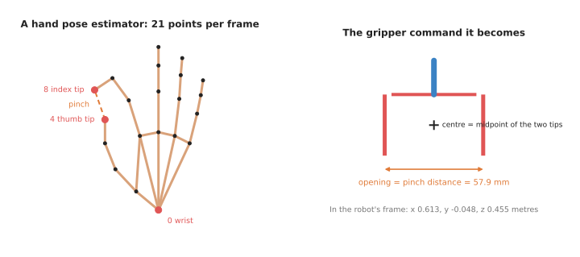
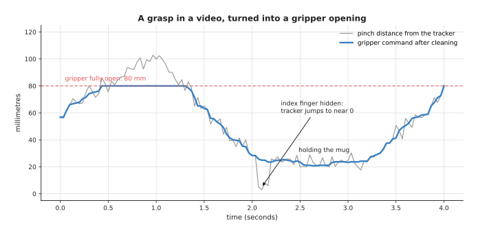
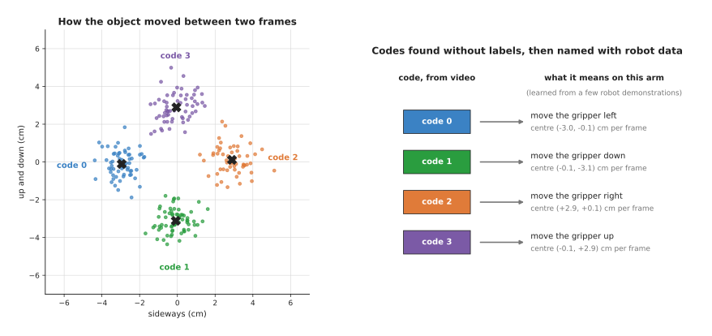
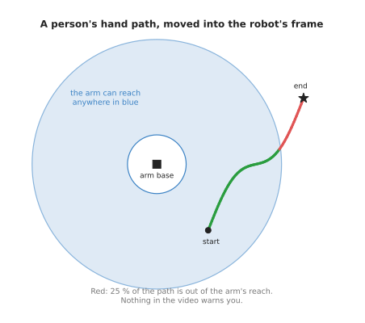

# Learning from human video

This page answers one question. Can a robot arm learn from videos of people doing a
task, instead of from recordings of the robot itself? Robot recordings are slow and
costly to make. Video of people using their hands is cheap, and there is a huge
amount of it. The catch is that a video of a person does not say what the robot
should do. This page explains the models that bridge that gap, and where the gap
stays open.

The page is for a reader who has read
[behaviour cloning](../02_most-used/01_behaviour-cloning.md). Behaviour cloning
learns from **demonstrations**: recordings of the robot doing the task while a
person steers it. Each recording pairs what the cameras saw with the movement
command at that moment. A video of a person has the pictures but not the commands.
Every new word is explained where it first appears.

## Contents

1. [What it is](#1-what-it-is)
2. [What a human video has, and what it lacks](#2-what-a-human-video-has-and-what-it-lacks)
3. [The four ways to use it](#3-the-four-ways-to-use-it)
4. [A worked example: one frame of a pinch, turned into a gripper command](#4-a-worked-example-one-frame-of-a-pinch-turned-into-a-gripper-command)
5. [Latent actions: learning actions without labels](#5-latent-actions-learning-actions-without-labels)
6. [Where it is used on a robot arm](#6-where-it-is-used-on-a-robot-arm)
7. [Well-known models and libraries](#7-well-known-models-and-libraries)
8. [The gap between a hand and a gripper](#8-the-gap-between-a-hand-and-a-gripper)
9. [Why this kind, and what it costs](#9-why-this-kind-and-what-it-costs)
10. [Where to read next](#10-where-to-read-next)

---

## 1. What it is

Here is the one-sentence idea. Models that understand hands and video pull
something useful for a robot out of videos of people, and the robot then needs only
a little of its own data to fill in the rest.

An everyday example helps. Think of learning to fold a paper plane from a video.
Nobody moves your hands for you. You watch the person's hands, see where each fold
goes, and copy it with your own hands. You do this even though your hands are a
different size, and the camera was somewhere you are not. A robot learning from a
person's video has the same job, with a harder version of each problem. Its "hand" is
a two-finger gripper. Its eyes are cameras in fixed places. And it cannot feel what
the person felt.

---

## 2. What a human video has, and what it lacks

A robot demonstration has two things in every frame: the pictures, and the action.
An **action** is the movement command the robot was given at that moment, such as
"move the gripper 2 mm left and close it a little". A video of a person has only the
first of these. The table below lists what each kind of recording contains. Read
each row as one kind of information, and the two right columns as whether each
recording has it.

| Information | Robot demonstration | Video of a person |
| --- | --- | --- |
| pictures of the scene and the objects | yes | yes |
| what the task looks like when done | yes | yes |
| the movement command at each moment | yes | no |
| a body the robot has | yes | no: a human hand and arm |
| a camera where the robot's cameras are | yes | usually no |
| how hard things were pressed | sometimes, from a force sensor | no |

So the question is always the same. How do you get the missing movement command,
or do without it? The frontier document puts it this way: turning a video into
training data "means inventing the missing action labels", and the quality of that
invention is the whole subject. The
[human video section of that document](../../../03_frameworks/08_frontier/03_data-and-demonstration.md#8-human-video-instead-of-teleoperation)
covers the research in depth. This page explains the models underneath.

---

## 3. The four ways to use it

There are four ways to get something useful out of a video of a person. They give
different amounts of help, and they need different amounts of robot data afterwards.

**Pretrain the robot's eyes.** A **camera encoder** is the part of a policy that
turns a picture into a list of numbers the rest of the network can use. You can
train the encoder on human video first, with no actions at all. It learns what
hands, objects and contact look like. Then you train the policy on a small number
of robot demonstrations, starting from that encoder. R3M and VC-1 are encoders
trained this way. This gives the least help, but it is the safest, because the
video never has to say anything about movement.

**Track the hand and map it onto the gripper.** A **hand pose estimator** is a
model that finds the position of each joint of a hand in a picture. It runs on every
frame of the video. A second step, called **retargeting**, turns the hand's motion
into a motion the robot's gripper can make. The result is a demonstration with
actions, made up from the video. Section 4 works through one frame of this.

**Learn actions from the video itself.** A **latent-action model** watches two
frames of video and learns a short code for "what changed between them". Nobody tells
it what the codes mean. Later, a little robot data links each code to a real robot
movement. Section 5 explains this.

**Edit the video.** Some 2026 work redraws the video so that the human hand becomes
a robot gripper. The frontier document calls this the video-editing route. It is new,
and this page does not cover it further.

The frontier document names three routes: visual pretraining, retargeting and
video editing. Latent actions sit between the first two. Like pretraining, they need
no hand tracking. Like retargeting, they produce something that stands in for an
action. This page gives them their own section because they are a separate kind of
model.

---

## 4. A worked example: one frame of a pinch, turned into a gripper command

This example follows one frame of a video through retargeting. A person pinches the
handle of a mug between the thumb and the first finger. The numbers are made up, but
the arithmetic was run in Python and the results below are copied from that run.

1. **Find the hand.** A hand pose estimator such as MediaPipe Hands gives 21 points
   per hand. Point 0 is the wrist. Point 4 is the tip of the thumb. Point 8 is the
   tip of the first finger, called the index finger. A 3D estimator such as HaMeR
   also gives how far each point is from the camera.
2. **Read the two fingertips, in the camera's frame.** A **frame** here means a
   set of directions to measure in. The camera measures sideways (x), downwards (y)
   and forwards from the lens (z), in metres. The thumb tip is at (0.020, 0.150,
   0.520). The index tip is at (0.075, 0.140, 0.505).
3. **Move them into the robot's frame.** The robot measures from its own base:
   forwards (x), to its left (y) and up (z). Calibration, the step that measures where
   the camera is, found that the camera sits at (0.10, 0, 0.60) in the robot's frame,
   looking forwards. So the camera's forwards is the robot's forwards, the camera's
   sideways is the robot's right, and the camera's down is the robot's down. The
   thumb tip becomes (0.620, −0.020, 0.450). The index tip becomes (0.605, −0.075,
   0.460). The
   [rigid transforms page](../../../05_programming-techniques/02_geometry-and-cameras/02_most-used/02_rigid-transforms.md)
   explains this step in full.
4. **Place the gripper between the two tips.** The gripper's centre goes to the
   midpoint of the two tips: (0.613, −0.048, 0.455) metres, rounded to the nearest
   millimetre.
5. **Turn the pinch into an opening.** The distance between the two tips is 57.9 mm.
   The gripper is told to open to 57.9 mm. This gripper opens to at most 80 mm, so
   any wider pinch is cut to 80 mm.
6. **Check that the arm can get there.** The gripper's centre is 0.764 m from the
   robot's base. The made-up arm here reaches 0.85 m, so this frame is reachable.

The left picture shows the 21 points, numbered in the order MediaPipe Hands uses.
The dashed line is the pinch. The right picture shows the gripper command that the
pinch becomes. Repeat this for every frame, and the video becomes a list of gripper
positions and openings. That list can be used like a robot demonstration.

A real video is not as clean as one frame. The tracker is noisy, and fingers get
hidden.

The grey line is the pinch distance from the tracker over a made-up four-second
grasp. It wobbles from frame to frame. It goes above 80 mm when the hand opens wider
than the gripper can. Just after 2 seconds it drops to near zero for four frames,
because the hand turned and hid the index finger. The blue line is the command after
two cleaning steps. First, each value is replaced by the middle value of the nine
frames around it, which removes short jumps. Second, the result is cut to between 0
and 80 mm. Without the first step, the gripper would squeeze hard on the mug for a
moment, for no reason.

---

## 5. Latent actions: learning actions without labels

The word **latent** means hidden: the model finds the actions itself, and nobody
ever labels them. A latent-action model learns in two parts.

1. **Learn codes from video.** The model sees two frames, one just after the other.
   It must describe what changed using only a code from a short list, such as one of
   a few dozen. A second part of the model must then redraw the later frame from the
   earlier frame and the code. If the redrawing is good, the code has captured the
   change. Over millions of frame pairs, each code comes to stand for one kind of
   change, such as "the hand moved left" or "the hand closed".
2. **Link codes to the robot.** A policy is trained to predict the code for each
   moment of human video. Then a small amount of robot data teaches it which real
   robot command each code stands for.

The example below shows the idea with numbers you can see. It is much simpler than a
real model. Each dot is how an object moved between two frames of a made-up video,
in centimetres. Nobody labelled the dots. A simple grouping method, k-means, was run
on them in the script. It puts each dot in the group whose centre is nearest, moves
each centre to the middle of its group, and repeats.

The four groups it found have centres at about (−3.0, −0.1), (−0.1, −3.1),
(+2.9, +0.1) and (−0.1, +2.9) centimetres per frame. These are the four codes. On
the right, a few robot demonstrations give each code a name on this arm: left, down,
right and up. A real latent-action model finds its codes from the pictures
themselves, not from measured motions. But the result has the same shape: a short
list of codes found without labels, then named with a little robot data.

The appeal is that it works on any video, including video with no visible hand. The
cost is that nothing makes the codes match what the robot can do. A code can stand
for a camera shake, or for something that happened with no action at all.

---

## 6. Where it is used on a robot arm

**A better start for any policy.** A policy that starts from an encoder pretrained
on human video, such as R3M or VC-1, often needs fewer robot demonstrations than one
that starts from nothing. This is the most common use, and it costs almost nothing
to try.

**Showing a task by doing it.** A person does the task in front of a camera, and
the robot copies the retargeted motion. This works best for simple pick-and-place
moves, where only the gripper's path and its opening matter. The
[learning path's fourth project](../../../03_frameworks/04_one-arm-training/04_learning-path.md#project-4-copy-it-from-video)
builds exactly this with MediaPipe, and explains why the first attempt misses.

**Pretraining large policies.** Large
[vision-language-action models](../../06_language-models/02_most-used/01_vision-language-action-models.md)
are now pretrained partly on human video. The
[foundation models document](../../../03_frameworks/08_frontier/02_foundation-models.md#6-nvidia-isaac-gr00t)
describes one released model pretrained on human video together with robot data. It
notes that this works partly because its movement commands are relative to where
the gripper is now, which means the same thing for a hand and a gripper.

**Judging progress.** The progress estimators on the
[reward and progress models page](03_reward-and-progress-models.md) are trained on
human video. They learn what "closer to done" looks like from people, and then score
the robot's attempts.

---

## 7. Well-known models and libraries

These are real models and tools, grouped by the four ways in section 3.

Hand pose estimators:

- **MediaPipe Hands** (Google). It finds 21 points on each hand in ordinary video. It
  runs in real time on a laptop and needs no graphics card. It is part of
  [MediaPipe](https://github.com/google-ai-edge/mediapipe).
- **HaMeR** (Pavlakos and colleagues, 2024). It rebuilds a full 3D model of the hand
  from one picture, including fingers that are partly hidden. It is slower and more
  accurate than MediaPipe Hands, and is often used when the video is processed
  after recording.

Retargeting:

- [dex-retargeting](https://github.com/dexsuite/dex-retargeting). A library that maps
  a tracked hand onto a robot hand or gripper, by solving for the robot joint angles
  that best match the hand's fingertip positions. The learning path points to it as
  the place to see retargeting done properly.

Camera encoders pretrained on human video:

- **R3M** (Nair and colleagues, Stanford and Meta, 2022). An encoder trained on
  Ego4D, a large collection of first-person video of people doing everyday tasks.
  It was trained so that its embeddings follow how a task unfolds over time and
  match the words that describe the video.
- **VC-1** (Majumdar and colleagues, Meta, 2023). An encoder trained on a mix of
  first-person video and ordinary pictures, and tested on many robot tasks at once.
- **MVP**, masked visual pretraining (Xiao, Radosavovic and colleagues, University of
  California, Berkeley, 2022). An encoder that learns by filling in hidden patches of
  pictures from human video.

Latent-action models:

- **Genie** (Google DeepMind, 2024). It learned a small set of latent actions from
  videos of games, with no action labels, and could then be steered with those
  actions. The
  [frontier document](../../../03_frameworks/08_frontier/04_simulation-and-evaluation.md#42-genie-the-closed-frontier)
  covers the later Genie models.
- **LAPA**, latent action pretraining (Ye and colleagues, 2024). It pretrains a robot
  policy on latent actions learned from video, and then fine-tunes it on a little
  robot data.

Systems that combine these:

- **MimicPlay** (2023) learns the plan of a task from human video, and the fine
  movement from robot data.
- **EgoMimic** (2024) records people with head-mounted cameras and trains one policy
  on human and robot data together.

For the 2026 results, such as HumanScale, HuRo and UMI-Bridge, see
[the three mechanisms people actually use](../../../03_frameworks/08_frontier/03_data-and-demonstration.md#83-the-three-mechanisms-people-actually-use).

---

## 8. The gap between a hand and a gripper

The hard part is not the models. It is that a hand is not a gripper, and a person
is not a robot. The frontier document names three things that human video still
cannot supply. This section explains each, and adds two more.

**The hand can do things the gripper cannot.** A hand has five fingers and a turning
wrist. A person rolls a pen in the fingers, holds two things at once, or pushes with
the side of the palm. A two-finger gripper can do none of this. A large part of any
human video shows movements the robot cannot make. These have to be found and thrown
away, or the policy learns them wrongly. The sign is a retargeted gripper that closes
on nothing, because the person was using three fingers.

**The path may be out of the robot's reach.** A person's arm is a different length
and moves from a different place. A path that is easy for a person can be outside
the robot's reach, and nothing in the video says so.

The picture shows a made-up hand path after it has been moved into the robot's
frame. The blue ring is where the arm can reach. The script checks every point, and
25 % of the path is outside the ring. A reach check like step 6 of the worked
example has to run on every frame. Even a reachable path can need a joint angle the
arm does not have. A check with the arm's
[inverse kinematics](../../../05_programming-techniques/06_planning-and-search/02_most-used/02_numerical-inverse-kinematics.md)
catches that.

**Force is missing.** A video shows where a hand went, not how hard it pressed. For
tasks that are about contact, such as pushing a plug into a socket, that was the part
that mattered.

**The camera is in the wrong place.** The person's video was filmed from their head
or from across the room. The robot's cameras are somewhere else. A policy that
learned from one view can fail from another. The sign is a policy that works on the
human video it trained on and does badly on the robot's own pictures.

**The hand hides the object.** In many frames the person's hand covers the thing it
is holding. The hand tracker loses fingers, as in the pinch graph in section 4. The
object tracker loses the object.

These are why every method still needs some robot data at the end. The frontier
document's
[section on what human video cannot supply](../../../03_frameworks/08_frontier/03_data-and-demonstration.md#84-what-human-video-still-cannot-supply)
makes the same point, and its
[section on the 2026 result](../../../03_frameworks/08_frontier/03_data-and-demonstration.md#82-the-result-that-changed-the-argument)
explains why the robot data may now be a small final step rather than most of the
work.

---

## 9. Why this kind, and what it costs

Learning from human video is a way to get training data for a movement model from
videos of people. What it does for you is replace some of the robot demonstrations,
which are the scarcest thing in robot learning.

The obvious alternative is to record more robot demonstrations, by steering the
robot while it does the task. That data is exactly right: the right body, the right
cameras, the real commands. Its problem is cost. Each hour needs a robot, a person,
and a set-up. Human video is worth it when you need variety that you cannot record
on a robot: many rooms, many objects, many ways of doing a task.

The second alternative is a handheld gripper: a person holds a gripper with a camera
on it and does the task, as described in
[the frontier document's section on handheld grippers](../../../03_frameworks/08_frontier/03_data-and-demonstration.md#4-handheld-grippers-collecting-without-a-robot).
This removes the hand-and-gripper gap, because the person uses the same fingers as
the robot. Human video is worth it over that when you want to use video that already
exists, or video of people who were not collecting data at all.

What it costs you is a chain of models, each of which can be wrong: the hand
tracker, the depth estimate, the camera calibration, the retargeting, the filtering.
Their errors add up, as the pinch graph showed. It also costs you robot data in the
end, because none of these methods removes the need for it. And the claims in this
area move fast. The
[frontier document](../../../03_frameworks/08_frontier/06_what-is-coming.md#73-robots-now-learn-a-new-task-from-a-single-video)
shows how a claim to learn "from a single video" can mean much less than it sounds.

The table below sums up the usual choice. Read each row as a situation, and the
right column as what people usually do.

| Situation | Usual choice |
| --- | --- |
| You will record robot demonstrations anyway | start from an encoder pretrained on human video, such as R3M or VC-1 |
| A simple pick-and-place, shown once by a person | hand tracking and retargeting, checked for reach before running |
| The task needs force, or fingers the gripper does not have | record robot demonstrations; human video will not show it |
| Lots of varied video, little robot data | latent actions or a large pretrained policy, then fine-tune on robot data |
| You want the person's motion without the hand-gripper gap | a handheld gripper instead of bare-hand video |

---

## 10. Where to read next

In this chapter:

- [Reward and progress models](03_reward-and-progress-models.md) covers judge models,
  several of which are trained on the same human video.
- [Behaviour cloning](../02_most-used/01_behaviour-cloning.md) is the learner that
  uses the demonstrations made from video.
- [The movement models overview](../01_overview.md) compares every kind in this
  chapter.

In other chapters of this book:

- [Keypoints and object pose](../../02_seeing-models/02_most-used/04_keypoints-and-object-pose.md)
  explains how models find points in a picture, which is what a hand pose estimator
  does for the joints of a hand.
- [Where the data comes from](../../01_what-models-are/04_where-the-data-comes-from.md)
  compares human video with every other source of training data.
- [Video prediction models](../../07_world-models/03_also-used/01_video-prediction-models.md)
  are close relatives of latent-action models: they learn from video what happens
  next.

Deeper documents elsewhere in this repository:

- [Human video instead of teleoperation](../../../03_frameworks/08_frontier/03_data-and-demonstration.md#8-human-video-instead-of-teleoperation)
  gives the 2026 research, its numbers and its maturity.
- [Project 4: copy it from video](../../../03_frameworks/04_one-arm-training/04_learning-path.md#project-4-copy-it-from-video)
  is a hands-on project that builds hand tracking and retargeting in simulation.
