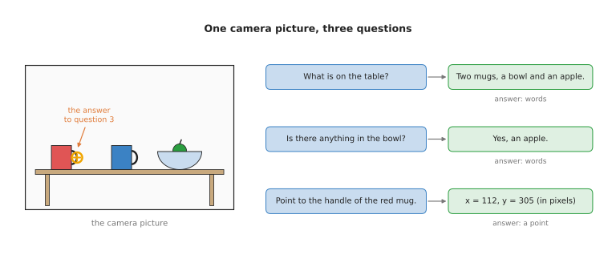
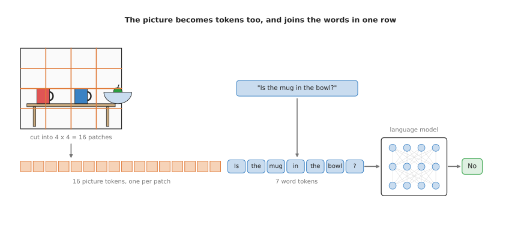
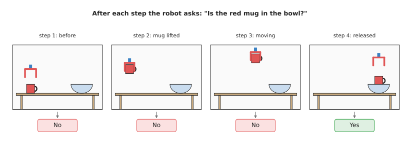

# Vision-language models

This page answers one question. How can a model look at a camera picture and answer
a question about it in words, and what can a robot arm do with those answers?

It is for a reader who has read the [chapter overview](../01_overview.md) and the page
on [language models as planners](../03_also-used/01_language-models-as-planners.md). You should know
that a language model reads and writes tokens, and that a token is turned into a
list of numbers. It also helps to have read the
[seeing models overview](../../02_seeing-models/01_overview.md), because this page
compares the two.

## Contents

1. [What it is](#1-what-it-is)
2. [What goes in and what comes out](#2-what-goes-in-and-what-comes-out)
3. [How it works inside](#3-how-it-works-inside)
4. [How it is trained](#4-how-it-is-trained)
5. [Well-known models of this kind](#5-well-known-models-of-this-kind)
6. [A worked example: fetching the right mug](#6-a-worked-example-fetching-the-right-mug)
7. [What goes wrong, and what people do about it](#7-what-goes-wrong-and-what-people-do-about-it)
8. [Why use a vision-language model, and what it costs](#8-why-use-a-vision-language-model-and-what-it-costs)
9. [Where to read next](#9-where-to-read-next)

---

## 1. What it is

Here is the idea in one sentence. A **vision-language model**, or **VLM**, is a
language model that can also read a picture, so you can ask it questions about what
the picture shows.

Think of showing a friend a photo on your phone. You ask, "Which of these mugs is
mine?" Your friend looks at the photo and says, "The red one, on the left." They
used the picture and your words together. A vision-language model does the same.

A plain language model cannot do this. It has never seen the table. A
[seeing model](../../02_seeing-models/01_overview.md), such as an object detector, can
see the table. But it can only answer one fixed question, such as "where is every
cup?", with names from a fixed list. A vision-language model can answer a question
that nobody planned for, such as "Which mug is upside down?"

---

## 2. What goes in and what comes out

Two things go in:

- one or more pictures, such as the latest frame from the robot's camera
- a question or an instruction in words

One thing comes out: text. That text can be an ordinary answer, a "yes" or "no", or
numbers written as text, such as the position of a point on the picture.

The picture shows three questions about one camera picture. The first two answers
are words. The third answer is a point, given as two pixel numbers. The orange
circle shows where that point falls on the picture. The pixel numbers in the picture
are an example. A **pixel** is one small dot of a camera picture, and a position on
a picture is given as a count of pixels across and down.

The third kind of answer matters most for a robot arm. Words alone cannot tell a
gripper where to go. A point on the picture can. Combined with a depth camera, a
point on the picture becomes a point in 3D space that the arm can reach. The
[camera basics document](../../../02_perception/01_camera/01_basics.md) explains how a
pixel and a depth reading become a 3D point.

Some models answer with a box around an object instead of a point. The box is also
written as numbers in the text.

---

## 3. How it works inside

The trick is to turn the picture into tokens, the same way a sentence is turned into
tokens. Then the language model reads the picture tokens and the word tokens
together, in one row.

The picture shows the steps. Here they are in order.

1. **Cut the picture into patches.** The picture is cut into a grid of small
   squares, called **patches**. The drawing uses a 4 by 4 grid, so there are 16
   patches. A real model uses a much finer grid. A patch is often 14 or 16 pixels
   wide, so one picture gives hundreds of patches.
2. **Turn each patch into a list of numbers.** A seeing network, called the
   **vision encoder**, reads all the patches. It turns each patch into a list of
   numbers that describes what is in it, such as "part of a red handle". The vision
   encoder is itself a transformer, the kind of network described in the
   [chapter overview](../01_overview.md#3-how-words-become-numbers).
3. **Make the lists fit.** A small extra network, often called the **projector**,
   changes each patch's list so that it has the same length as a word token's list.
   After this step, the language model can read a patch in the same way as a word.
4. **Join the row.** The patch tokens go first, then the word tokens of the
   question. The model now has one long row of tokens.
5. **Answer one token at a time.** The language model reads the whole row. Then it
   writes the answer, one token at a time, in the same way as it writes any text.
   Each word token can look at every patch token, so the word "mug" in the question
   can find the patches that contain the mug.

A point is written in the same way as any other answer. The model writes the digits
of the two pixel numbers as ordinary tokens. It learned to do this from training
examples that had points written as text.

---

## 4. How it is trained

A vision-language model is trained in stages. Each stage uses a different kind of
data. The table below lists the usual stages. Read it from top to bottom, in the
order the stages happen.

| Stage | What is trained | The data | Where the data comes from |
| --- | --- | --- | --- |
| 1 | the language model alone | text | the public internet, books and code |
| 2 | the vision encoder alone | pictures, each with a caption | the internet; hundreds of millions of pairs |
| 3 | the projector, then all parts together | pictures with captions and descriptions | the internet, and descriptions written by people or by other models |
| 4 | all parts together | pictures with questions and correct answers | people, and questions generated by other models |
| 5, for robots | all parts together | robot camera pictures with questions, points and success labels | robot recordings, labelled by people or by models |

Stages 1 and 2 are usually done by someone else. The builders of a vision-language
model start from a language model and a vision encoder that already exist. In stage
2, a common method trains the vision encoder to match each picture with its own
caption and not with the other captions. This teaches it which picture patches go
with which words. The
[open-vocabulary models page](../../02_seeing-models/02_most-used/03_open-vocabulary-models.md)
describes this matching, which is how CLIP was trained.

Stage 4 is the one that teaches the model to answer questions instead of only
writing captions. This stage is called **instruction tuning**.

Stage 5 is optional, and it is what makes a robot vision-language model. General
models are good at "what is in this picture?" They are weaker at robot questions,
such as "Where exactly is the handle?", "Did the grasp work?" and "How far through
the task is the robot?" So robot laboratories add examples of exactly these
questions. The examples come from recordings of robots at work. People or other
models write the questions and the correct answers.

---

## 5. Well-known models of this kind

Many vision-language models exist. These are the ones you will meet most often in
robot work.

- [LLaVA](https://arxiv.org/abs/2304.08485), from 2023, was an early open research
  model. It showed that a small projector between an existing vision encoder and an
  existing language model, plus some question-and-answer training, is enough to get
  a working vision-language model. Many later open models follow its recipe.
- [PaLM-E](https://arxiv.org/abs/2303.03378), from Google in 2023, was one of the
  first to feed robot camera pictures into a large language model and use the
  answers to plan robot tasks.
- [PaliGemma](https://arxiv.org/abs/2407.07726), from Google in 2024, is a small open
  vision-language model. It matters for robots because the vision-language-action
  model π0 is built on top of it.
- [Molmo](https://arxiv.org/abs/2409.17146), from the Allen Institute for AI in 2024,
  is an open model that was trained to answer by pointing at places in the picture.
  Pointing is the answer a robot arm can use most directly.
- [Qwen3-VL](https://github.com/QwenLM/Qwen3-VL), from Alibaba's Qwen team, is a
  family of open vision-language models in several sizes. The case study in the
  frameworks book uses it to read a spoken instruction and a camera picture.
- [Gemini Robotics ER 2](https://blog.google/innovation-and-ai/models-and-research/google-deepmind/gemini-robotics-er-2/),
  from Google DeepMind in July 2026, is a vision-language model trained for robot
  work. It plans, points, and watches video to check whether a step worked. Google
  reports 91.3 per cent success at finding the moment in a video when something
  happened, and 57.4 per cent at saying how far through a task a robot is. You use it
  through Google's online service; you cannot download it.

The
[frontier document](../../../03_frameworks/08_frontier/02_foundation-models.md#5-google-deepmind-gemini-robotics-2-and-er-2)
has more on Gemini Robotics ER 2, and on the other robot models built on top of
vision-language models.

---

## 6. A worked example: fetching the right mug

A single arm stands at a table with two mugs, a bowl and an apple. A camera looks at
the table from the front. A person says: "Put my red mug in the bowl."

1. **Find the target.** The robot sends the camera picture to the vision-language
   model with the question "Point to the handle of the red mug." The model answers
   with a point, in pixels.
2. **Turn the point into 3D.** The robot reads the depth camera at that pixel. With
   the camera's known position, this gives a 3D point on the handle.
3. **Choose the grasp and move.** A [grasp model](../../04_grasp-models/01_overview.md)
   chooses how to hold the mug near that point. Ordinary motion planning moves the
   arm there, closes the gripper, and carries the mug over the bowl. The
   vision-language model is not used during the movement, because it is too slow.
4. **Check after each step.** After each step, the robot asks the vision-language
   model: "Is the red mug in the bowl?" It asks the same question each time, and
   waits for "yes".

The picture shows the four checks. The answer stays "no" while the mug is on the
table, in the air, and on its way. It turns to "yes" only after the mug is in the
bowl. Checking whether a step worked is called **success detection**. It is one of
the most common uses of a vision-language model on a robot, because it replaces a
check that someone would otherwise have to program by hand for every task.

If the answer is still "no" after the last step, the robot does not simply stop. It
tells a [planner](../03_also-used/01_language-models-as-planners.md#feeding-back-what-happened)
what happened, and the planner writes the next steps.

---

## 7. What goes wrong, and what people do about it

A vision-language model is good at "what" and weaker at "exactly where" and "exactly
how much". The list below gives the common failures, and the usual fix for each one.

- **It is not precise about position.** A point from the model can be several pixels
  off. That can be enough to miss a small handle. The fix is to use the point only
  to choose the object, and then measure the object with a depth camera and a
  [seeing model](../../02_seeing-models/02_most-used/02_segmentation.md) that outlines it exactly.
- **It miscounts, and mixes up left and right.** Counting many small objects, and
  telling left from right, are known weak points. Left and right are also ambiguous:
  the camera's left may be the robot's right. The fix is to ask for points instead
  of words, and to do the counting and the left-right logic in ordinary code.
- **It says things that are not there.** Like a language model, a vision-language
  model can hallucinate, which means it describes an object that is not in the
  picture. The fix is to ask for a point, and then check with the depth camera that
  something is really there.
- **It says "yes" too easily.** For success detection, a wrong "yes" is worse than a
  wrong "no", because the robot moves on and the mistake is hidden. The fixes are to
  ask from two camera views, to ask the question in the opposite form as well ("Is
  the bowl empty?"), and to back the answer with a measurement, such as the weight
  on a scale or how far the gripper closed.
- **It misses small details.** The picture is cut into patches, and a detail smaller
  than a patch, such as a thin crack or a lid that is almost closed, can be lost.
  The fix is to crop the picture around the object and ask again.
- **It is slow.** A large model takes from a fraction of a second to a few seconds
  per answer. That is fine for "which mug?" and "did it work?". It is far too slow to
  steer the arm while it moves.

---

## 8. Why use a vision-language model, and what it costs

A vision-language model reads a picture and a question, and answers in words or
points. It lets a robot find an object from a description, and check its own work,
without anyone writing a special program for each object or each task.

The obvious alternative is an
[object detector](../../02_seeing-models/02_most-used/01_object-detection.md) trained on a fixed
list of object names. A detector is much faster: it answers in milliseconds, where a
vision-language model takes seconds. It is more precise about position. It is small enough to run on the robot's own computer.
It also always gives an answer in the same form. So if your robot only ever handles
the same five kinds of object, a detector is the better choice. The next step up is
an [open-vocabulary model](../../02_seeing-models/02_most-used/03_open-vocabulary-models.md), which
finds objects from any name, but still only answers "where is this?". The
vision-language model earns its place when the question itself changes, as in "the
mug that is upside down", "the one with the chipped rim", or "did the lid close?".

It costs you speed, hardware and certainty. A useful model needs a large graphics
card or a paid online service. It answers in seconds, not milliseconds. And its
answers are not guaranteed, so anything that matters has to be checked with a
measurement.

---

## 9. Where to read next

- [Vision-language-action models](01_vision-language-action-models.md) takes a
  vision-language model and teaches it to output arm movements as well as words.
- [Open-vocabulary models](../../02_seeing-models/02_most-used/03_open-vocabulary-models.md) in the
  seeing chapter covers the smaller models that find objects from words, such as
  CLIP, Grounding DINO and SAM.
- [Language models as planners](../03_also-used/01_language-models-as-planners.md) shows how the
  answers from this page are fed back into a plan.
- [Models that find](../../../02_perception/02_object-perception/04_models-that-find.md)
  in the perception book compares finding models in more depth, including when a
  large model is worth its cost.
- For the robot models built on vision-language models today, read
  [foundation models and generalist policies](../../../03_frameworks/08_frontier/02_foundation-models.md).
