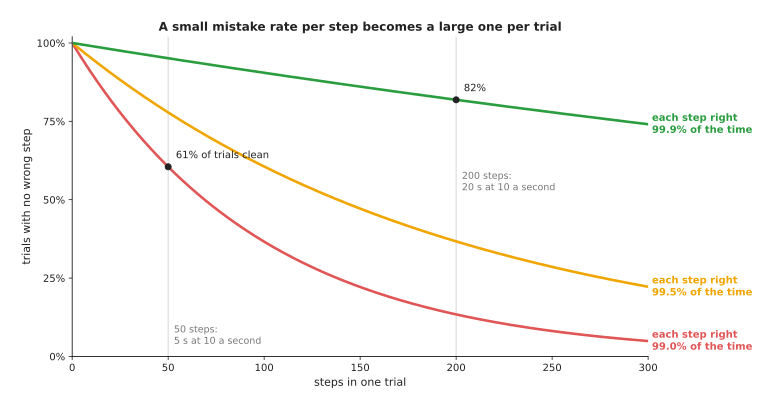
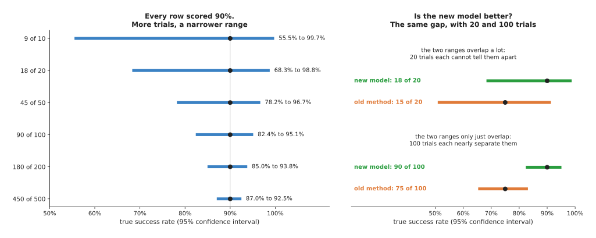
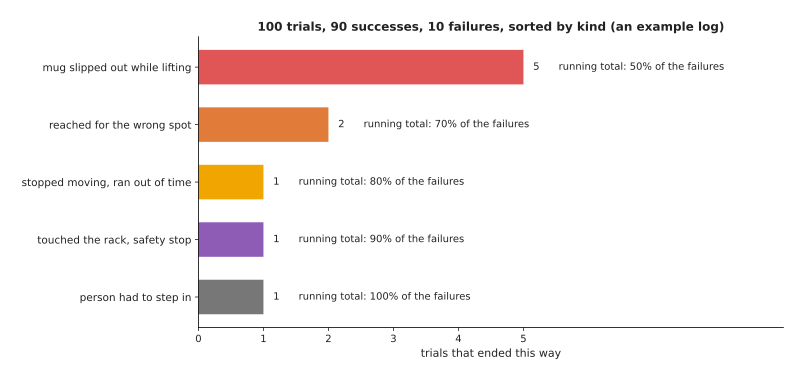
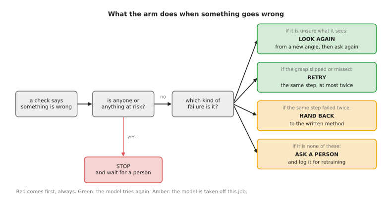

# Evaluation and failure

A learned model can look good on a computer and still fail on an arm. This page
answers one question: how do you tell whether a model is good enough to run on a
real arm, and what should the arm do on the runs where it is not?

It is for a beginner who has read the earlier pages of this chapter, especially
[running a model on a robot](02_running-a-model-on-a-robot.md) and
[fine-tuning](01_fine-tuning.md). It covers test sets and real trials, how many
trials you need, what to write down on every trial, how to sort failures, how the
arm should behave when it fails, and how to move a model from simulation to the
real arm.

Every number on this page comes from a real run of the diagram script
[`making_models_work.py`](../../../diagrams/making_models_work.py). The
confidence intervals are computed exactly from the binomial distribution. The
trial log in the worked example is a made-up example, and the page says so where
it is used.

## Contents

1. [The idea in one sentence](#1-the-idea-in-one-sentence)
2. [A test set is not a trial](#2-a-test-set-is-not-a-trial)
3. [Counting successes, and how sure the count is](#3-counting-successes-and-how-sure-the-count-is)
4. [Running fair trials](#4-running-fair-trials)
5. [What to log on every trial](#5-what-to-log-on-every-trial)
6. [Sorting failures into kinds](#6-sorting-failures-into-kinds)
7. [What the arm should do when it fails](#7-what-the-arm-should-do-when-it-fails)
8. [From simulation to the real arm](#8-from-simulation-to-the-real-arm)
9. [A worked example: a mug-picking model, from test set to 100 trials](#9-a-worked-example-a-mug-picking-model-from-test-set-to-100-trials)
10. [Where it is used on a robot arm](#10-where-it-is-used-on-a-robot-arm)
11. [What goes wrong, and what people do about it](#11-what-goes-wrong-and-what-people-do-about-it)
12. [Libraries and tools](#12-libraries-and-tools)
13. [Why this rather than the obvious alternative, and what it costs](#13-why-this-rather-than-the-obvious-alternative-and-what-it-costs)
14. [Where to read next](#14-where-to-read-next)

---

## 1. The idea in one sentence

A model is good enough for an arm when it succeeds often enough in real trials,
counted over enough trials to be sure of the number, and when the arm does
something safe on the trials where it fails.

Here is an everyday example. A new driver who passes a written test knows the
rules, but you only learn whether they can drive by watching them drive, many
times, on different roads. You also want to know what they do when something goes
wrong.

---

## 2. A test set is not a trial

A **test set** is a set of examples that the model did not train on. You run the
model on them and compare its answers with the right answers. The
[how a model learns](../../01_what-models-are/02_how-a-model-learns.md) page
explains why these examples must be kept back from training.

A **trial** is one real attempt at the whole job on the arm. For example: start
with a mug on a rack, and end with the mug on a tray. A trial either succeeds or
fails. The **success rate** is the share of trials that succeed.

A test set score is quick and cheap. It is still worth having, because it catches a
broken model before it goes near the arm. But it answers a different question.
There are three reasons it does not predict the success rate.

- **The test set checks single steps. A trial is many steps in a row.** A movement
  model decides a new action many times a second. A tiny mistake on one step moves
  the arm a little off course, and the next picture is then one the model has never
  seen. The [behaviour cloning](../../05_movement-models/02_most-used/01_behaviour-cloning.md#small-mistakes-add-up)
  page calls this compounding error.
- **The test set measures closeness to a person's answer, not success.** A grasp
  1 cm away from the one in the demonstration counts as an error on the test set.
  On the arm, it may work perfectly. And a grasp that is very close may still let
  the mug slip.
- **The test set was recorded on another day.** The light, the camera position and
  the objects in real trials are never quite the same.

The picture below shows the first reason with simple numbers. Suppose each step of a
trial is right with a fixed chance, and any one wrong step spoils the trial. Then a
trial of N steps is clean with that chance multiplied by itself N times.

Read each curve as one model. The red model is right on 99% of steps. That sounds
very good. But at 10 decisions a second, a 5-second trial has 50 steps, and only
60.5% of its trials are clean. A 20-second trial has 200 steps, and only 13.4% are
clean. Even the green model, right on 99.9% of steps, has only 81.9% clean trials
at 200 steps.

Real trials are kinder than this. A good policy often recovers from a small mistake,
and many wrong steps do no harm. So the curves are a warning, not a forecast. The
point is that a per-step score can look almost perfect while the trial success
rate is poor. The only way to know the success rate is to run trials.

---

## 3. Counting successes, and how sure the count is

Say a model succeeds in 18 of 20 trials. The success rate is 90%. But if you ran 20
more trials, you might see 16, or 20. The true success rate, the one you would see
over thousands of trials, is somewhere near 90%, but you do not know exactly where.

A **confidence interval** gives the range. A 95% confidence interval is a range
worked out so that, if you repeated the whole experiment many times, the range
would contain the true rate 95 times in 100. The standard one for a count of
successes is the **Clopper-Pearson interval**, also called the exact interval. You
do not need its formula. A library computes it in one line, as
[section 12](#12-libraries-and-tools) shows.

The left half of the picture shows what the number of trials does. Every row scored
90%. The table gives the same ranges as numbers. Read each row as one experiment.

| Successes | Success rate | 95% confidence interval |
| --- | --- | --- |
| 9 of 10 | 90% | 55.5% to 99.7% |
| 18 of 20 | 90% | 68.3% to 98.8% |
| 45 of 50 | 90% | 78.2% to 96.7% |
| 90 of 100 | 90% | 82.4% to 95.1% |
| 180 of 200 | 90% | 85.0% to 93.8% |
| 450 of 500 | 90% | 87.0% to 92.5% |

So 18 of 20 only tells you the model is somewhere between fairly poor and nearly
perfect. 90 of 100 tells you it is somewhere between 82% and 95%. To halve the width
of the range, you need about four times as many trials.

The right half shows the question people usually ask: is the new model better than
the old method? With 20 trials each, 18 against 15 looks like a clear win. But the
ranges, 68.3% to 98.8% and 50.9% to 91.3%, overlap a lot. With 100 trials each, 90
against 75, the ranges are 82.4% to 95.1% and 65.3% to 83.1%. They only just
overlap. That is when the difference starts to be real.

Two more cases come up often.

- **No failures at all.** If a model succeeds in 20 of 20 trials, the true failure
  rate could still be as high as 16.8%. A quick rule, called the **rule of three**,
  says that with no failures in N trials, the failure rate is probably below 3 / N.
  For 20 trials that is 15%, close to the exact 16.8%. For 300 trials it is 1%.
- **Two close methods.** Checking that two ranges do not overlap is a simple, rough
  test. For a close comparison, run both methods on the same list of starting
  setups and compare them setup by setup. This is called a **paired comparison**.

Book 3's
[simulation and evaluation](../../../03_frameworks/08_frontier/04_simulation-and-evaluation.md#82-the-statistical-problem-underneath)
page makes the same point about research papers. It shows that 20 of 25 and 19 of
25, as papers often report, cannot be told apart, and it describes the benchmarks
and the efforts to fix them. This page does not repeat that. It is about your own
model on your own arm.

---

## 4. Running fair trials

A success rate means something only if the trials were fair. These rules make them
fair.

1. **Write down what success means before you start.** For example: "the mug is
   upright on the tray within 30 seconds, and nothing was touched except the mug".
   Deciding afterwards lets you count a near miss as a success without noticing.
2. **Fix a list of starting setups.** Write down, or photograph, where the mug and
   the other objects start in each trial. Cover the range the arm will really meet:
   different positions, turns, mugs and lighting. Then use the same list for every
   model you compare.
3. **Mix the order.** Do not run all trials of the old method in the morning and all
   trials of the new model in the afternoon, when the light has changed. Take turns.
4. **Use the same time limit** for every trial, and count a trial that runs out of
   time as a failure.
5. **Do not stop early because the numbers look good.** Decide the number of trials
   first. Stopping as soon as the rate looks high picks a lucky moment.
6. **If you can, let the person who judges success not know which model ran.** This
   is called a **blind** trial. It stops the judge from being kinder to the model
   they hope wins.

---

## 5. What to log on every trial

A success rate tells you how often the model fails. The log tells you why. Record
these things on every trial, successes included, because a success that nearly
failed is a warning too.

| What to log | Why |
| --- | --- |
| the model's name and version, and the settings it ran with | so you know exactly which model scored the number |
| the starting setup, as a photograph and a number from your list | so you can run the same setup again |
| every camera picture, or at least a few per second | so you can see what the model saw when it went wrong |
| every action the model gave, and the time it took to answer | so you can find the step where it went wrong, and spot slow answers |
| the joint positions, and the gripper's opening and force | so you can tell a slip from a missed grasp |
| the model's confidence, if it gives one | so you can check whether low confidence came before failure |
| every safety check that fired, and every time a person stepped in | these are failures, even if the trial ended well |
| the result, the time taken, and a short note from the person watching | the note is often the fastest way to sort the failure |

This is more data than it sounds. A few minutes of pictures from two cameras can be
hundreds of megabytes. Keep it anyway. A failure you cannot replay is a failure you
can only guess about. The tools in [section 12](#12-libraries-and-tools) store it in
standard formats.

---

## 6. Sorting failures into kinds

After a batch of trials, go through every failure and give it one kind. Useful
kinds are named after the part of the system that went wrong, such as seeing,
grasping, the movement policy, safety or time. Then count them.

The counts in this picture are a made-up example. They show a pattern that is
common in practice. One kind of failure, here the mug slipping out while lifting,
causes half of all failures. The top two kinds cause 70%.

Sorting pays off in three ways.

- **It tells you what to fix first.** Fixing the slips could remove half the
  failures. Fixing the one timeout would remove a tenth.
- **It tells you whether a model is the problem at all.** A slip may be the
  gripper's force, not the model. A wrong spot may be a camera that has moved and
  needs [calibration](../../../05_programming-techniques/02_geometry-and-cameras/02_most-used/03_calibration.md)
  again.
- **It tells you what data to collect.** If most failures are slips, the next
  demonstrations should include lifts that almost slip and are caught. The
  [fine-tuning](01_fine-tuning.md) page shows how to train on them.

After a fix, run the same list of setups again and sort again. A fix often moves
failures from one kind to another rather than removing them.

---

## 7. What the arm should do when it fails

Every model fails sometimes, so the arm needs a plan for it. The plan is not part
of the model. It is written by people, usually as a
[behaviour tree](../../../05_programming-techniques/08_decisions-and-task-logic/02_most-used/02_behaviour-trees.md)
or a [finite state machine](../../../05_programming-techniques/08_decisions-and-task-logic/02_most-used/01_finite-state-machines.md)
around the model.

First, something must notice the failure. That can be a programmed check, such as
"the gripper closed fully, so it holds nothing", or a learned
[failure detector](../../08_touch-and-body-models/02_most-used/02_collision-and-failure-detection.md).
Then the arm chooses one of five responses, in this order.

- **Stop.** If anything or anyone is at risk, the arm stops and waits for a person.
  This comes before everything else, and it is done by the
  [safety monitoring](../../../05_programming-techniques/07_control-and-motion/02_most-used/04_safety-monitoring.md)
  layer, not by the model.
- **Look again.** If the model was unsure what it saw, the arm moves the camera to a
  new angle and asks the model again. The
  [uncertainty and confidence](../03_also-used/01_uncertainty-and-confidence.md)
  page shows how to tell when a model is unsure.
- **Retry.** If a grasp slipped or missed, the arm tries the same step again. It
  keeps a count, and it gives up after a set number, often two. Without a count, an
  arm can retry the same failing grasp for ever.
- **Hand back to the written method.** If the model fails the same step twice, the
  arm switches to a programmed method for this one job, if there is one. For
  example, a slow, careful top-down grasp worked out from the geometry of the mug.
  It is less clever, but it behaves the same way every time. Book 3's
  [programmed methods](../../../03_frameworks/04_one-arm-training/02_programmed-methods.md)
  page describes such methods.
- **Ask a person.** If none of these apply, the arm stops the job and asks for help.
  The trial is saved, so it can become a new training example.

Every one of these responses should also be logged, as in section 5. A model that
succeeds only after two retries is not as good as its success rate says.

---

## 8. From simulation to the real arm

Real trials are slow. A **simulator**, a program that pretends to be the real world,
can run thousands of trials overnight. So a common plan is to test in simulation
first, and to run real trials only for models that pass. The difference between how
a model does in simulation and how it does on the real arm is called the
**sim-to-real gap**.

Three methods shrink the gap. Other pages explain them in full, so this section
only says how they fit into evaluation.

- **Domain randomisation.** The simulator changes colours, light, masses and
  friction at random during training, so the real world looks like one more random
  variation. [Where the data comes from](../../01_what-models-are/05_where-the-data-comes-from.md#domain-randomisation)
  explains it.
- **System identification.** You measure your real arm, such as its delays and
  frictions, and set the simulator to match. Book 5's
  [system identification](../../../05_programming-techniques/04_fitting-and-estimation/03_also-used/01_system-identification.md)
  page shows how.
- **Test in simulation first.** Use the simulator as a filter. A model that fails in
  simulation will almost certainly fail on the arm. A model that passes has earned
  real trials, nothing more.

Book 3's
[sim-to-real section](../../../03_frameworks/08_frontier/04_simulation-and-evaluation.md#5-sim-to-real-what-actually-closed-the-gap)
separates the gap into three parts: how things look, how the arm moves, and how
things feel when touched. It explains that the first two now have good answers and the
third does not. So for any job where the grip matters, a simulated success rate says
little. Keep the two numbers apart. Report the simulated rate and the real rate
separately, and never let a simulated rate stand in for a real one.

---

## 9. A worked example: a mug-picking model, from test set to 100 trials

Here is the whole process for one job. A movement model has been
[fine-tuned](01_fine-tuning.md) to pick a mug from a rack and put it on a tray. The
old way is a written method that works out a grasp from the mug's shape.

1. **Test set.** On kept-back demonstration steps, the model's actions are very
   close to the person's. This shows the training worked. It does not show the arm
   will succeed, for the reasons in section 2.
2. **Simulation.** In a simulated copy of the rack, the model succeeds in most
   trials. This is enough to try it on the real arm, slowly, with a person at the
   emergency stop.
3. **Twenty real trials.** The model succeeds 18 times. The written method, on the
   same 20 setups, succeeds 15 times. The ranges are 68.3% to 98.8% and 50.9% to
   91.3%. They overlap too much to say the model is better.
4. **A hundred real trials each.** On a fixed list of 100 setups, in mixed order,
   the model succeeds 90 times and the written method 75 times. The ranges are 82.4%
   to 95.1% and 65.3% to 83.1%. They only just overlap. The model is probably
   better, and a paired comparison on the same setups would say how sure that is.
5. **Sort the failures.** The model's 10 failures sort as in the picture in section
   6: 5 slips while lifting, 2 reaches for the wrong spot, 1 timeout, 1 safety stop
   on the rack and 1 time a person stepped in.
6. **Fix the largest kind.** The slips all happened with the heaviest mug. The team
   adds demonstrations of lifting heavy mugs and fine-tunes again.
7. **Run the same 100 setups again.** This gives a new count and a new sorted list,
   which can be compared with the old one setup by setup.
8. **Set the failure plan.** For the job on the real line, a slip leads to one retry,
   and a second slip hands the job to the written method.

The test set says the training worked, the simulation says the model is worth
trying, and only the real count, with its range, says how good it is.

---

## 10. Where it is used on a robot arm

The ideas on this page apply to every learned model on an arm, not only to
movement models.

- **Movement policies.** Success rate over real trials is the standard measure for
  [behaviour cloning](../../05_movement-models/02_most-used/01_behaviour-cloning.md),
  [action chunking](../../05_movement-models/02_most-used/02_action-chunking-transformers.md)
  and [vision-language-action models](../../06_language-models/02_most-used/01_vision-language-action-models.md).
- **Grasp models.** Grasp success is counted over real pick attempts, usually on a
  fixed set of objects. See the [grasp models](../../04_grasp-models/01_overview.md)
  chapter.
- **Seeing models.** A detector's test-set score is only the start. What counts is
  how often the arm reaches for the right object.
- **Automatic judging.** Counting successes by hand is slow. A
  [reward and progress model](../../05_movement-models/03_also-used/03_reward-and-progress-models.md)
  can judge success from video, but it is a model too, and it must be checked
  against a person on some trials.
- **Monitoring after deployment.** Once the arm is working, the same log keeps
  running. A success rate that slowly falls means something has changed: the
  lighting, the objects, or a camera that has moved.

---

## 11. What goes wrong, and what people do about it

The table below lists the common mistakes in evaluation. Read each row across: the
mistake, the sign you would see, and what people do instead.

| Mistake | The sign you would see | What people do instead |
| --- | --- | --- |
| trusting the test set score | a near-perfect score, then poor real trials | run real trials; treat the test set as a check that training worked |
| too few trials | a model that "won" last week loses this week | report the confidence interval; run about 100 trials for a decision |
| the same easy setups every time | high success rate, then failures on the real line | a fixed list that covers the real range of positions, objects and light |
| success judged loosely afterwards | near misses counted as wins | write the success rule down before the first trial |
| only the failures logged | no way to see how close the successes came to failing | log every trial the same way |
| failures not sorted | effort spent on rare failures | sort and count, and fix the largest kind first |
| simulated and real rates mixed | a quoted rate that the arm never reaches | report them separately |
| no plan for failure | the arm retries for ever, or carries on with nothing in the gripper | a written failure plan with a retry count and a stop |

---

## 12. Libraries and tools

The table below lists real tools for each part of evaluation. Read each row as one
tool: what it is for, and a note on when to use it.

| Tool | What it does | Note |
| --- | --- | --- |
| `lerobot-eval` (LeRobot) | runs a trained LeRobot policy on simulated benchmarks through one shared harness, and reports the success rate | for testing in simulation first; Book 3's [section 9](../../../03_frameworks/08_frontier/04_simulation-and-evaluation.md#9-what-is-being-done-about-evaluation) describes it |
| LeRobot's recording tool, given a policy | runs a trained policy on a real arm and saves each run as an episode, with pictures and actions | gives you the per-trial log of section 5 for LeRobot arms |
| SciPy | `scipy.stats.binomtest(k, n).proportion_ci(method='exact')` gives the Clopper-Pearson interval | one line for any count of successes |
| statsmodels | `statsmodels.stats.proportion.proportion_confint(k, n, method='beta')` gives the same interval | handy if you already use statsmodels |
| ROS 2 bags | `ros2 bag record` saves every message on the robot, such as pictures, joint states and commands | for arms run with [ROS](../../../04_ros-and-rviz/01_ros/02_ros-basics.md) |
| Rerun, Foxglove | viewers that replay logged pictures, joint positions and actions on one timeline | the fastest way to see why a trial failed |
| a spreadsheet | one row per trial: setup, result, failure kind, note | the simplest way to sort and count failures |

---

## 13. Why this rather than the obvious alternative, and what it costs

This section answers the four questions for evaluating a model on an arm: what it
is, what it does for you, why it rather than the obvious alternative, and what it
costs.

It is a way of deciding whether a model is ready: real trials on fair setups,
counted with a confidence interval, every trial logged, every failure sorted, and a
written plan for what the arm does when it fails. It gives you a number you can
trust and a list of what to fix next.

The obvious alternative is to trust the test set score, or to run a handful of
trials and see whether it "looks good". Both are cheap. Both are misleading. The
test set score measures single steps against a person's answer, not whole trials,
as section 2 showed. A handful of trials gives a range so wide, 55.5% to 99.7% for
9 of 10, that it cannot tell a poor model from a good one. And neither says
anything about what the arm does when the model is wrong, which is what decides
whether it is safe to use.

The costs are real:

- **Time.** A hundred real trials of a 30-second job, with resetting the scene, is
  most of a day. Comparing two models is two days.
- **Storage.** Logging pictures from every trial fills disks quickly.
- **Care.** Fair setups, a written success rule and mixed order take discipline.
- **Repetition.** Every change to the model, the gripper or the room means running
  the trials again.

The time is worth it before a model runs unattended. For early experiments, 20
trials are enough to spot a model that is clearly broken, as long as you remember
how wide the range is.

---

## 14. Where to read next

- [Uncertainty and confidence](../03_also-used/01_uncertainty-and-confidence.md)
  shows how to tell when a model is unsure, which decides when the arm should look
  again or ask.
- [Running a model on a robot](02_running-a-model-on-a-robot.md) describes the loop
  and the safety checks around a model.
- [Fine-tuning](01_fine-tuning.md) shows how to train on the failures you sorted.
- Book 3's
  [simulation and evaluation](../../../03_frameworks/08_frontier/04_simulation-and-evaluation.md)
  covers simulators, sim-to-real and the public benchmarks, and why their numbers
  are hard to compare.
- [Collision and failure detection](../../08_touch-and-body-models/02_most-used/02_collision-and-failure-detection.md)
  covers the models that notice a failure while it happens.
- Book 5's
  [safety monitoring](../../../05_programming-techniques/07_control-and-motion/02_most-used/04_safety-monitoring.md)
  covers the programmed checks that stop an arm whatever the model says.
