# Why not just write the rules

This is the first page of a book about neural networks and the models built from
them, and it answers three questions from nothing. How does a neural network work
inside, down to the arithmetic one neuron does? How is a model trained, so the
numbers inside it stop being random and start being useful? And what does each
broad family of model that robots use today actually do inside?

The book is for somebody who can do arithmetic, fractions and percentages, who has
met a little school algebra, who knows what a graph with two axes shows, and who
can read a short program with variables, loops and functions. It assumes you know
**nothing** about machine learning, so if you have never met the words model,
training, gradient, token, embedding, transformer, diffusion or policy, you are
the reader it was written for, because each of those words is explained in
ordinary English on the page that first needs it.

The book has thirteen chapters that build on each other. The first five give you
the vocabulary, take a network apart one neuron at a time, show how training finds
the numbers inside it, and show how a picture or a joint angle becomes numbers at
all. The middle explains the one design almost every large model uses today, and
how such a model is trained once and then adapted. The later chapters go through
the families of model a robot arm runs, and the last is about getting one working
on a real machine.

This page answers the question that comes before all of those. Why train a model
at all, when a program is just rules and a person can write rules? The answer is
that there are two kinds of job, and for one of them nobody can write the rule
down, because the rule is not short enough to write. So this page shows three jobs
of each kind, says what separates them, and then fits a program from examples with
a calculator. Every number here was worked out by
[`docs/diagrams/what_learning_means.py`](../../diagrams/what_learning_means.py),
which also drew every picture, and everything that looks like sensor data is
simulated with a fixed random seed.

## Contents

1. [Three jobs where somebody can write the rule](#1-three-jobs-where-somebody-can-write-the-rule)
2. [Three jobs where nobody can write the rule](#2-three-jobs-where-nobody-can-write-the-rule)
3. [What the difference between the two lists really is](#3-what-the-difference-between-the-two-lists-really-is)
4. [Fitting a straight line to six measurements](#4-fitting-a-straight-line-to-six-measurements)
5. [The words for the pieces of a fitted job](#5-the-words-for-the-pieces-of-a-fitted-job)
6. [What fitting buys you and what it costs](#6-what-fitting-buys-you-and-what-it-costs)
7. [Where to read next](#7-where-to-read-next)
8. [Using it in Python](#8-using-it-in-python)

---

## 1. Three jobs where somebody can write the rule

A robot arm runs hundreds of small jobs every second, and most are handled by
rules a person sat down and wrote. Three of those are worth a close look, because
what they share is what the jobs in the next section lack.

The first is counting. A gripper has a switch that closes when the fingers meet,
and the controller wants to know how many times they have closed, so the rule is
to watch the switch and add one each time it goes from open to closed.

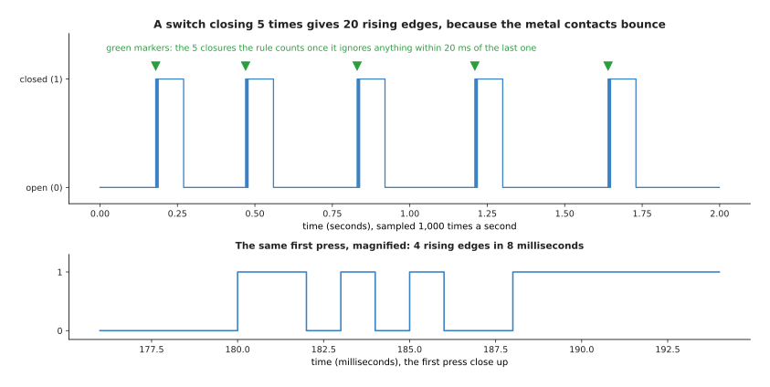

The switch closed five times, but the raw rule counts 20 rising edges, because the contacts bounce apart and back together in the first milliseconds of each press.

The lower part is the first press close up, showing four rising edges inside eight
milliseconds. So the rule needs one more line, which is to ignore any edge within
20 milliseconds of the last one counted, and with that line it counts exactly 5
closures, at 0.180, 0.470, 0.830, 1.210 and 1.640 seconds. What matters is not
that the first attempt was wrong, but that a person could see what was wrong, say
why, and fix it with one number.

The second is converting units, where a distance sensor reports millimetres and
the planner wants metres, so the rule is to divide by 1000.

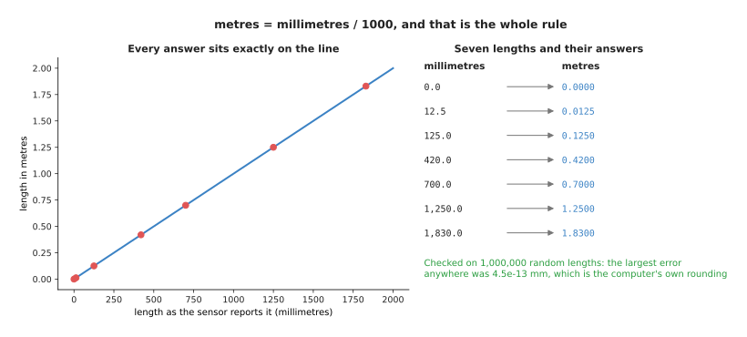

Each length in millimetres has exactly one answer in metres, and over 1,000,000 random lengths the largest error is 4.5e-13 millimetres, which is the computer's own rounding.

There is nothing left to get right, because the rule is one division, it is correct
for every input that will ever arrive, and you can prove it correct without
running it on a single real measurement.

The third is checking a limit. Each joint can only turn so far, and a command
outside that range would drive it into its hard stop, so the rule compares the
commanded angle with the two limits and refuses anything outside them.

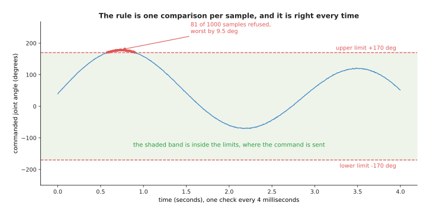

Of 1,000 commands sampled every four milliseconds, 81 are outside the band from -170 to +170 degrees, and the worst overshoots by 9.5 degrees.

Those three are the same kind of job, because in each one a person can say in a
sentence what the right answer is for every possible input, and that sentence is
short enough to type. That is the property the next three jobs lack.

---

## 2. Three jobs where nobody can write the rule

Now take three jobs from the same cell, on the same afternoon, with the same
camera. Each sounds no harder than the three above, and for each one no rule
anybody has written works.

The first is deciding which pixels of a camera picture belong to a glass. A
**pixel** is one small square of a picture, and in a grey picture each is one
number from 0 for black to 255 for white, so the obvious rule is to pick a
brightness and call everything brighter than that the glass.

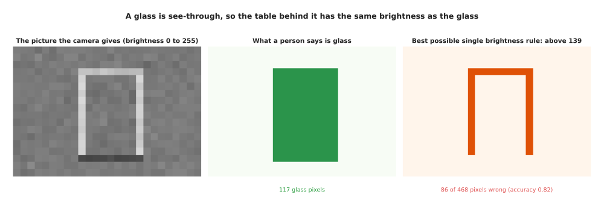

The glass is see-through, so the table behind it has nearly the same brightness as the glass in front, and the best brightness rule finds only the bright edges down the sides.

That picture is simulated, with 18 rows of 26 pixels, of which 117 are glass. The
best brightness rule gets 0.816 of the pixels right, which sounds respectable
until you notice that saying "there is no glass anywhere" already scores 0.750,
and that the rule misses 86 of the 117 glass pixels. A better threshold might be
hiding, so the script tried every one.

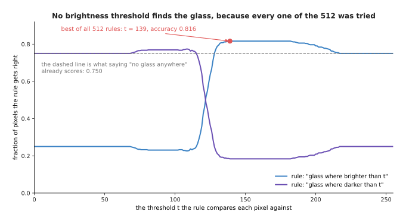

Both directions of the rule were tried at all 256 brightness levels, so all 512 rules of this shape have been checked, and the best reaches 0.816.

The second job is choosing where to put the fingers on a bent spoon. A person can
write a rule for this, and it even sounds sensible, which is to grip where the
metal is between 4 and 30 millimetres across, where the spoon slopes by less than
0.25, and at least 15 millimetres clear of the bowl.

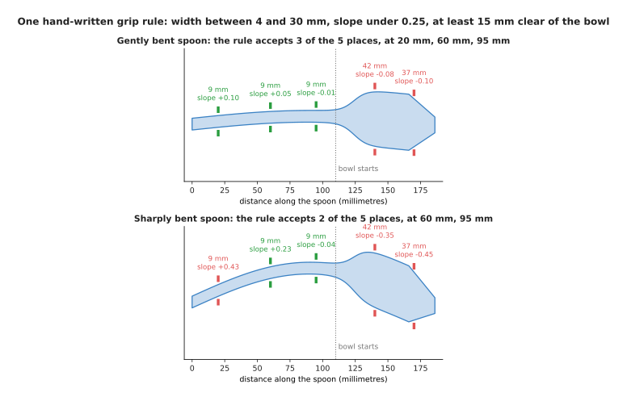

The same rule accepts three places on the gently bent spoon and only two on the sharply bent one, because 20 millimetres along the sharply bent spoon the metal slopes by 0.43 and the rule refuses it.

Both spoons are simulated. The rule works on the first, and on the second it throws
away a place a person would happily use, because the slope limit of 0.25 was a
guess. Raise it to 0.5 and the rule accepts places on other spoons where the
fingers do slide off, so no value of that number is right for every spoon, and the
rule has several more numbers just like it.

The third job is telling a full cup from an empty one. The camera looks down into
the cup, so the obvious rule is that coffee is darker than china and a full cup
is therefore darker inside the rim.

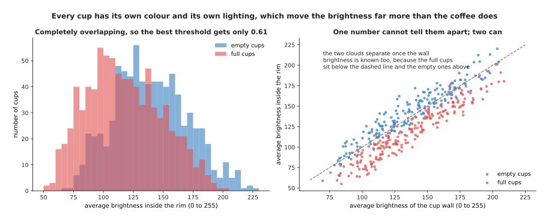

Across 1,600 simulated cups the full ones average 117.7 brightness inside the rim and the empty ones 139.6, but the full ones run from 53 to 201 and the empty ones from 68 to 226, so the ranges sit almost on top of each other.

The ranges overlap because every cup has its own colour and its own lighting, and
those move the brightness far more than the coffee does. The best threshold on
that number gets 0.659 of the cups right when chosen on them and 0.611 on cups it
has not seen, against the 0.5 a coin gets. The right-hand panel shows the answer
is in the data after all, because once the wall brightness is known the two clouds
separate, and the next section follows that clue.

---

## 3. What the difference between the two lists really is

The six jobs split into two groups, and it is worth being exact about what
separates them, because the rest of this book follows from it. The first
difference is how many different inputs there are. A switch has two states, and a
joint angle recorded to a tenth of a degree over 340 degrees has 3,401, so a
person could write a table with one line per state, while a picture cannot be
handled that way.

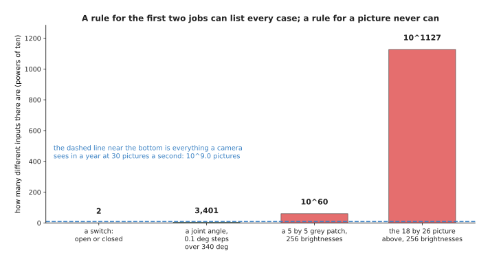

A patch of 5 pixels by 5 pixels has about 10^60 possible contents and the 18 by 26 picture from section 2 has about 10^1127, while a camera running at 30 pictures a second for a year sees only about 10^9 of them.

So a rule for a picture can never be a table of cases, because the cases outnumber
anything that could be collected, and it has to be a short formula covering inputs
nobody has seen. The second difference is that for the first three jobs such a
formula exists and somebody knows it, and for the last three it does not.

That is easier to believe when you watch a person try to build one. The cup job
gives three numbers a camera can measure, which are the average brightness inside
the rim, the spread of that brightness and the average brightness of the wall. A
person can pick a threshold on any one, and after some thought can also work out
that subtracting the wall brightness from the inside brightness cancels the cup's
own colour and lighting.

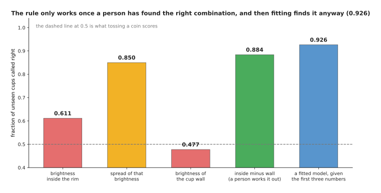

The best threshold on the brightness inside the rim gets 0.611 of unseen cups right, on the spread 0.850, on the wall 0.477 and on the inside minus the wall 0.884, while a model fitted to the first three numbers reaches 0.926 with nobody telling it about the subtraction.

Read that chart as a person getting steadily cleverer. The first threshold barely
beats a coin, the second is better by luck because a full cup's surface does vary
more, and the third is useless alone. The fourth is good only because a person
spent an afternoon working out that the cup's colour has to be cancelled. The last
bar comes of handing the first three numbers to a program that searches for the
combination itself, and it beats the person's answer.

The third difference lies underneath the other two. Where a rule works, one input
has exactly one right answer, and where no rule works, the same input happens with
both answers.

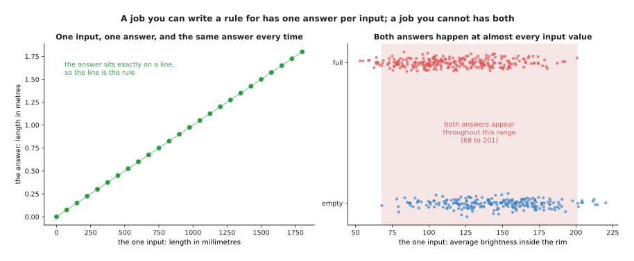

Full and empty cups share the brightness range from 68 to 201, which holds 0.963 of all 1,600 cups, so for almost any brightness you could measure both answers are possible.

Once you see that, the position is plain. Writing a rule means stating the answer
for every input, and you can only state it when you know it, which for these jobs
nobody does, because what you measure does not fix the answer on its own. What
there is instead is examples, meaning pictures somebody has looked at and written
the answer beside. The next section turns examples into a program at the smallest
size that trick comes in.

---

## 4. Fitting a straight line to six measurements

The trick is called **fitting**, which means choosing the numbers inside a formula
so its answers come as close as possible to the answers in your examples. This
section does it with six measurements, a formula holding two numbers, and nothing
you could not do on a calculator.

The job is a real one on an arm. Hang a mass on the wrist and the arm sags, so the
tool tip ends up lower than the controller thinks. Nobody has the arm's exact
stiffness, so somebody hangs six masses on it and measures with a height gauge how
far the tip drops. These are the six pairs they wrote down, chosen so the
arithmetic comes out in round numbers: 0.0 kg gives 0.7 mm, 0.5 kg gives 0.9 mm,
1.0 kg gives 1.8 mm, 1.5 kg gives 2.7 mm, 2.0 kg gives 3.6 mm and 2.5 kg gives
3.8 mm. Before fitting anything, somebody writes the obvious rule by hand, which
is one millimetre of droop per kilogram, and that is the kind of thing that ends
up in real code.

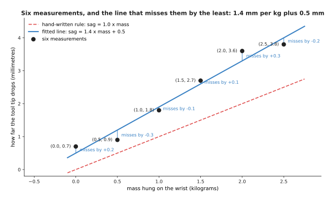

The fitted line is sag = 1.4 x mass + 0.5 and misses the six measurements by +0.2, -0.3, -0.1, +0.1, +0.3 and -0.2 millimetres, while the hand-written rule misses by +0.7, +0.4, +0.8, +1.2, +1.6 and +1.3 millimetres.

The two numbers in the fitted line are the slope, which says how many millimetres
of droop each kilogram causes, and the offset, which says how low the tip sits
with nothing hanging on it. Nobody chose 1.4 and 0.5, because they came out of the
six measurements by the arithmetic drawn below.

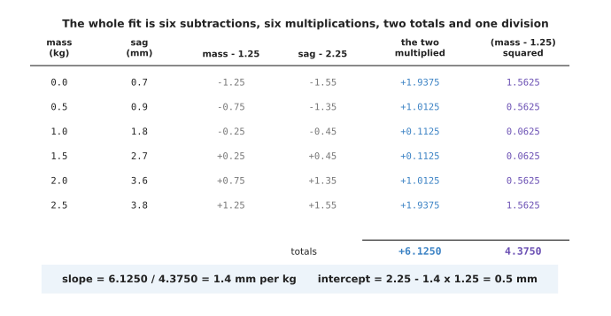

The whole fit is six subtractions, six multiplications, two totals and one division, and you can check every line of it by hand.

Follow it down. The average mass is 1.25 kg and the average sag is 2.25 mm, so each
row subtracts those averages from its own pair, the fifth column multiplies the two
differences, and the sixth squares the first of them. The totals are 6.1250 and
4.3750, and the slope is the first divided by the second, which is exactly 1.4.
The offset is the average sag minus the slope times the average mass, so
2.25 - 1.4 x 1.25 = 0.5.

That recipe gives the slope that makes the total of the squared misses as small as
it can be, and the picture below shows that by trying every slope in turn.

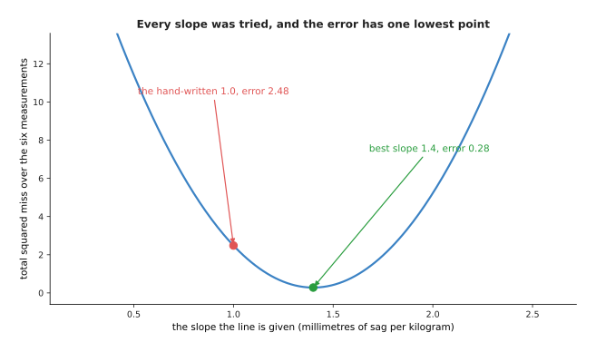

Every slope between 0.2 and 2.6 was tried with the offset held at 0.5, and the total squared miss has one lowest point, 0.28 at a slope of 1.4.

The misses are squared before adding for two reasons. Squaring makes every miss
positive, so a line 2 mm too high on one measurement and 2 mm too low on the next
cannot claim the two cancel out, and squaring makes one big miss cost more than
several small ones, which is usually what you want when the gripper has 5 mm of
clearance. So there is now a number saying how wrong an answer is, and three
answers to compare with it.

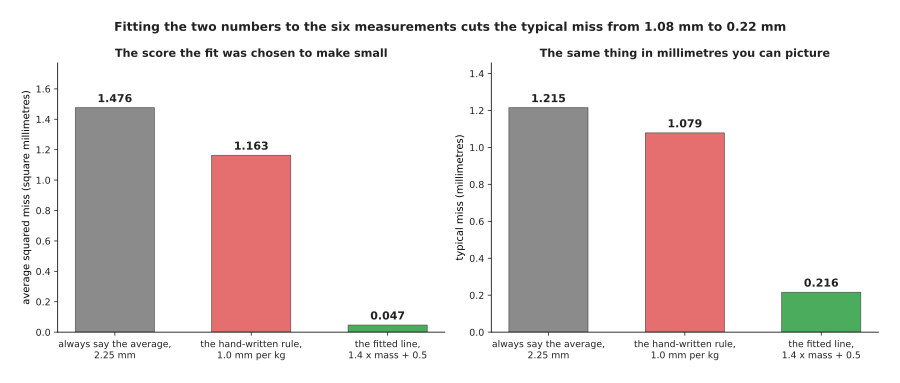

Always saying 2.25 mm has an average squared miss of 1.476, the hand-written rule 1.163 and the fitted line 0.047, which in millimetres is a typical miss of 1.215, 1.079 and 0.216.

The fitted line misses five times less than the hand-written rule, from six
measurements and a page of arithmetic, with nobody knowing the arm's stiffness or
its gearbox. That is the whole idea of this book at its smallest size.

---

## 5. The words for the pieces of a fitted job

The last section fitted a line without naming its parts, and this section names
them, because the rest of the book uses these words on every page. All of them
describe something in the same six-row table.

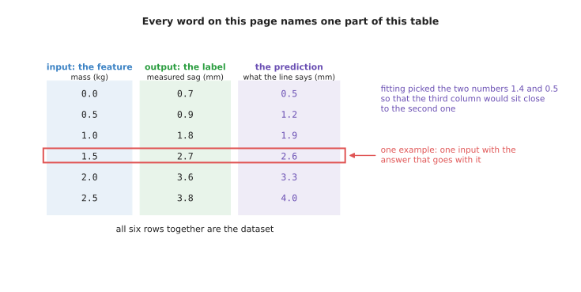

Every word in this section names one part of this table, and the ringed row at 1.5 kg is one example.

An **input** is what the program is given and an **output** is what it is asked to
produce, so here the input is the mass and the output is the drop in millimetres.
A **feature** is one number making up an input, chosen because the answer depends
on it. Here there is one feature, the mass, while the cup job had three and a
camera picture has one per pixel. A **label** is the right output for one input,
written down by whoever collected the data, so the labels here are the six
height-gauge readings.

An **example** is one input together with its label, so the ringed row, 1.5 kg
with 2.7 mm, is one example. A **dataset** is a collection of examples, so the
whole six-row table is a dataset. A **prediction** is what the model says the
output is, which is the third column, and the difference between a prediction and
a label is the miss that fitting works to make small.

That difference matters most for inputs that were never in the dataset, because
those are what the whole thing is for.

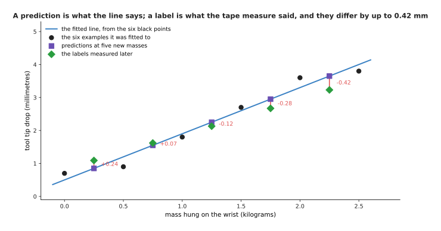

At 0.25, 0.75, 1.25, 1.75 and 2.25 kilograms the line predicts 0.850, 1.550, 2.250, 2.950 and 3.650 millimetres, while measuring later gives 1.09, 1.62, 2.13, 2.67 and 3.23, so the misses run from +0.07 to -0.42 millimetres.

Those five later measurements are simulated. The typical miss on them is 0.258 mm,
against 0.216 mm on the six the line was fitted to, which is worse and should be,
because the line was never shown them. A prediction is something the model
produces for any input you give it, while a label is what a person or an
instrument produced for one input that actually happened, and keeping the two
apart is most of what it takes to read an honest claim about a model.

A feature is not just any number you happen to have, because the answer has to
depend on it, and the only way to find out whether it does is to look.

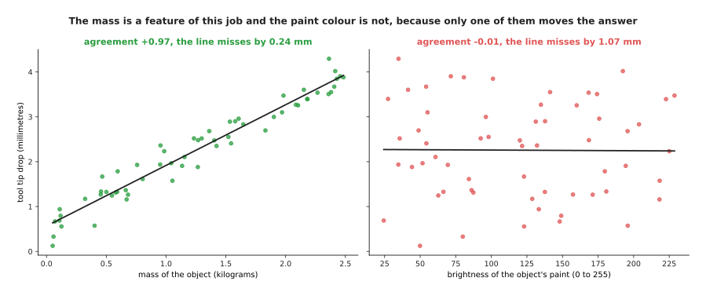

Across 60 simulated loads, drop and mass agree at +0.97 and a line through them misses by 0.24 millimetres, while drop and paint colour agree at -0.01 and the best line misses by 1.07 millimetres.

The agreement number runs from -1 to +1, where +1 means the two always rise
together, -1 means one rises as the other falls, and 0 means knowing one tells you
nothing about the other. The mass is a feature of this job and the paint colour is
not, and nothing about the two columns says which is which until you fit a line to
each and compare the misses. The last thing to say about a label is that it is a
measurement, and measurements wobble.

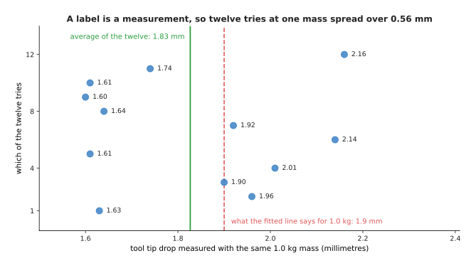

Twelve tries at the same mass give readings from 1.60 to 2.16 millimetres, averaging 1.83 with a spread of 0.213, while the fitted line says 1.9 millimetres.

So the fitted line is not failing when it misses a label by two tenths of a
millimetre, because that is inside the wobble of the instrument that produced the
label, and no cleverness takes a model below that wobble when the label itself does
not know the answer any better. Section 6 is about the rest of the costs.

---

## 6. What fitting buys you and what it costs

Fitting bought a line five times better than a hand-written rule, from six
measurements and no knowledge of the arm. This section is the three things it took
in exchange, because a method is only worth knowing when you know where it fails.

The first cost is that a fitted model is only trustworthy over the range of inputs
it was fitted on. The six measurements covered 0 to 2.5 kilograms, and nothing in
the arithmetic knows the arm behaves differently above that.

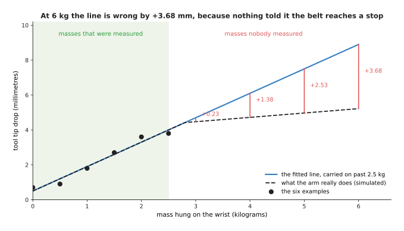

At 3 kilograms the line is out by +0.23 millimetres, at 4 by +1.38, at 5 by +2.53 and at 6 by +3.68, because a belt in the simulated arm reaches a stop at 2.8 kilograms.

A rule written by a person who understands the arm would have that stop in it, and
a fitted line never will unless somebody hangs a four kilogram mass on the wrist
and measures. That is not a fault in the fitting but a statement that a model knows
what its examples knew and nothing else, which is why so much of this book is
about where the data comes from.

The second cost is that you need examples, and more of them than feels reasonable.

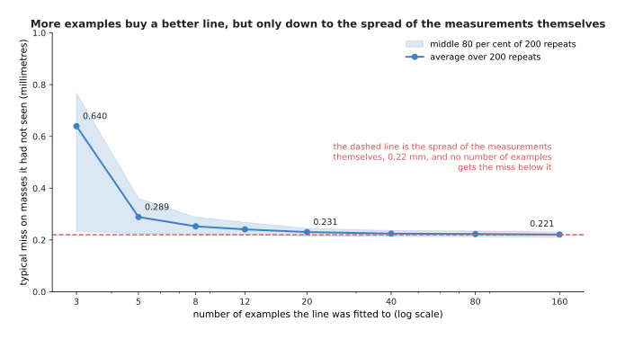

Averaged over 200 repeats with fresh simulated measurements, 3 examples give a typical miss of 0.640 millimetres, 20 give 0.231 and 160 give 0.221, which is as low as the 0.22 spread of the measurements allows.

Going from 3 examples to 20 cuts the miss by nearly three times, while going from
20 to 160 is worth almost nothing here, because the line holds two numbers and
twenty examples already pin both down. A model with millions of numbers inside it
does not flatten off so soon, which is why the models later in this book are
trained on far more data.

The third cost is that fitting believes its examples completely.

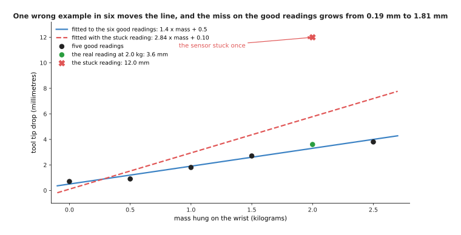

Changing one reading from 3.6 to 12.0 millimetres moves the line from 1.4 x mass + 0.5 to 2.84 x mass + 0.10, and on the five good readings the typical miss grows from 0.195 to 1.809 millimetres.

One stuck reading in six, and the line is wrong everywhere, because nothing in the
arithmetic can tell a wrong label from a right one when it only sees numbers. A
hand-written rule behaves the opposite way, since it ignores the data and is
therefore immune to bad data and to good data alike.

That is the honest trade. A written rule is exact, checkable without measurements
and correct outside the range you tested, and you can only have one when somebody
knows the rule. A fitted model needs no such knowledge and finds relationships a
person would never guess, and in exchange it is only as good as its examples, only
trustworthy over the range they covered, and quietly wrong when they are wrong. So
for the jobs in section 1 the written rule wins every time and you should write it,
while for the jobs in section 2 there is no written rule for it to lose to.

Everything else in this book is the same trade at a larger size, where the formula
holds more numbers than two, the examples are counted in millions, and the search
takes a building full of computers rather than one division. The shape of the idea
does not change.

---

## 7. Where to read next

- [The words everyone uses](02_the-words-everyone-uses.md) is the next page, and
  it names the rest of the vocabulary: model, parameter, weight, training,
  inference, generalisation and the four names people give to the whole field.
- [One neuron](../02_inside-a-network/01_one-neuron.md) replaces this page's
  straight line with the smallest piece of a neural network, worked out by hand
  in the same way.
- [The score of being wrong](../03_how-training-works/01_the-score-of-being-wrong.md)
  takes the squared miss from section 4 seriously and shows the other scores used
  when the answer is a category rather than a number.
- [Overfitting and generalisation](../04_making-training-work/01_overfitting-and-generalisation.md)
  goes much further into the costs in section 6, and explains how to get a number
  for a model's accuracy that you can believe.
- [Linear and logistic regression](../../07_learned-models/02_classical-machine-learning/02_most-used/01_linear-and-logistic-regression.md)
  is the catalogue entry for the method on this page, with the real tools that
  implement it and the jobs on an arm where it is still the right choice.
- [What a model is](../../07_learned-models/01_what-models-are/01_what-a-model-is.md)
  gives the same idea from the other direction, as part of a catalogue of the
  model families a robot arm uses.

---

## 8. Using it in Python

Section 4 worked the fit out by hand, and nobody does that twice. The code below
does the same fit with NumPy, the array library most Python numerical work is
built on, and prints the numbers this page quoted.

```python
import numpy as np

mass = np.array([0.0, 0.5, 1.0, 1.5, 2.0, 2.5])   # section 5: the feature of each example
sag = np.array([0.7, 0.9, 1.8, 2.7, 3.6, 3.8])    # section 5: the label of each example

slope, offset = np.polyfit(mass, sag, 1)          # section 4: the fitting itself
print(f"sag = {slope:.2f} * mass + {offset:.2f}") # sag = 1.40 * mass + 0.50

prediction = slope * mass + offset                # section 5: the six predictions
print(np.round(prediction, 2))                    # [0.5 1.2 1.9 2.6 3.3 4. ]
print(np.round(sag - prediction, 2))              # [ 0.2 -0.3 -0.1  0.1  0.3 -0.2]

fitted = float(np.mean((prediction - sag) ** 2))
by_hand = float(np.mean((1.0 * mass - sag) ** 2)) # section 4: the hand-written rule
print(round(by_hand, 4), round(fitted, 4))        # 1.1633 0.0467
print(round(by_hand ** 0.5, 3), round(fitted ** 0.5, 3))   # 1.079 0.216

print(round(float(slope * 1.75 + offset), 3))     # 2.95, a mass nobody measured
print(round(float(slope * 6.0 + offset), 3))      # 8.9, and section 6 says do not trust it
```

The one line doing the work is `np.polyfit(mass, sag, 1)`, where the `1` asks for
a straight line rather than a curve. That call performs the six subtractions, the
six multiplications, the two totals and the division from section 4, by a method
that stays accurate with thousands of examples and dozens of features. The library
also gives you the array arithmetic underneath, so `slope * mass + offset` works
out all six predictions at once rather than in a loop.

What the library will not do is choose the problem. You decide which numbers are
the features, which is the label and what shape of formula to fit, and those three
decisions carry far more of the result than the choice of library does. Asking for
a `1` fits a line, while asking for a `5` fits a bending curve that passes much
closer to the six points and is much worse at masses in between, which is the
subject of the generalisation section on the next page.

The library also will not tell you when you have left the range your data covered.
The last line prints 8.9 millimetres for a six kilogram load when section 6 showed
the true answer is about 5.2, and no warning appears, no exception is raised, and
the number looks as confident as the others. Checking that the input you are about
to predict on resembles the inputs you fitted on stays your job, for every model in
this book including the very large ones.
