# One neuron, worked out by hand

The page before this one, [the words everyone uses](../01_what-learning-means/02_the-words-everyone-uses.md),
gave you the vocabulary of machine learning, and it said that a model is a
function with parameters in it, that a weight is one of those parameters, and
that training is the search for good values for them. This page opens one of
those models up and shows you the smallest piece it is built from, which is
called a **neuron**, and it works that piece out in full with real numbers so
that nothing is left as a word you have to take on trust.

A neuron takes a few numbers in, multiplies each one by a weight, adds the
results together, adds one more number of its own, and then passes the total
through a simple rule that decides what comes out. That is the whole of it, and
everything else in this book is built by joining many neurons together and
finding good values for their weights.

This page is for a reader who has read the two pages of the chapter before it
and who is comfortable with multiplying, adding and reading a graph with two
axes. You do not need to know anything about training, because the weights here
were chosen by hand so that you can watch what they do. Everything is worked out
on one made-up moment of one grasp, in which a robot arm is reaching for a cup
and three sensors have just given their readings, and every number in every
picture was worked out and printed by `docs/diagrams/inside_a_network_1.py`.

## Contents

1. [What one neuron is made of](#1-what-one-neuron-is-made-of)
2. [The weighted sum, line by line](#2-the-weighted-sum-line-by-line)
3. [What changes when a weight or the bias changes](#3-what-changes-when-a-weight-or-the-bias-changes)
4. [Why multiplying and adding is not enough](#4-why-multiplying-and-adding-is-not-enough)
5. [The rectified linear unit](#5-the-rectified-linear-unit)
6. [GELU and SiLU, and why networks use them now](#6-gelu-and-silu-and-why-networks-use-them-now)
7. [Where to read next](#7-where-to-read-next)
8. [Using it in Python](#8-using-it-in-python)

---

## 1. What one neuron is made of

Since the page before this one described a model as a function with parameters
in it, the smallest function of that kind worth looking at is one neuron with
three inputs. The numbers that go into it are called its **inputs**, the one
number that comes out is called its **output**, and between the two there are
only four numbers that belong to the neuron itself.

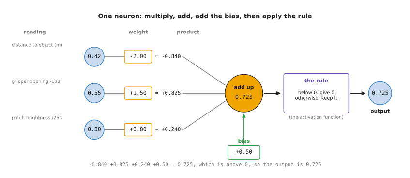

The three readings 0.42, 0.55 and 0.30 are multiplied by the weights -2.00,
+1.50 and +0.80, the three products and the bias +0.50 are added to make 0.725,
and the rule passes that through unchanged because it is above 0.

The three inputs are three readings from a robot arm that is about to close its
gripper on a cup. The first is the distance from the gripper to the cup in
metres, which a depth camera has measured as 0.42. The second is how far open
the gripper is, which it reports as 55 millimetres. The third is how bright the
patch of the camera picture is where the cup should be.

Those three readings arrive in three different sorts of unit, and a neuron
cannot do anything sensible with a 0.42 next to a 55, because the weight needed
to make the second one matter would have to be about a hundred times smaller
than the weight on the first. So each reading is first turned into a number
between 0 and 1, which is called scaling it.

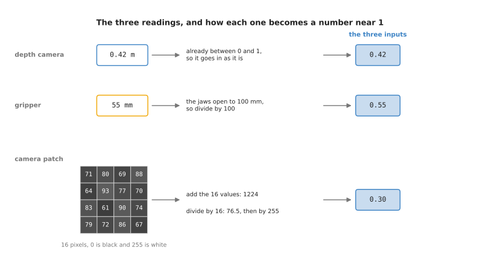

The distance is already between 0 and 1 so it goes in as it is, the opening of
55 millimetres is divided by 100 because the jaws open to 100 millimetres, and
the sixteen pixel values in the patch add up to 1,224, which is an average of
76.5 out of 255, and dividing that by 255 gives 0.300.

So the three numbers that reach the neuron are 0.42, 0.55 and 0.30, and those
three numbers describe this one moment of this one grasp. Now the neuron's own
four numbers come in. Each input has a **weight**, which is a number that says
how much that input counts and in which direction, and the whole neuron has one
more number called its **bias**, which is added to the total whatever the inputs
are.

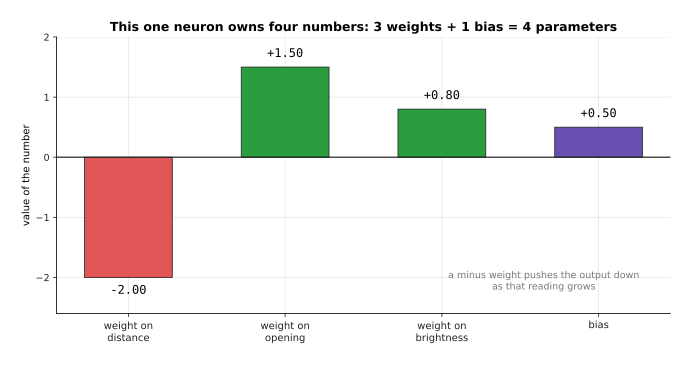

The weight on the distance is -2.00, the weight on the opening is +1.50, the
weight on the brightness is +0.80 and the bias is +0.50, which is four numbers
for a neuron with three inputs.

A weight below 0 means that the bigger that reading gets, the smaller the
neuron's answer gets, and a weight above 0 means the opposite. The weights here
were picked so that this neuron answers one question: is the arm near a bright
object with its gripper open, which is the moment when closing the gripper is
likely to work. The distance gets a minus weight because being far away counts
against that, and the other two get plus weights because they count for it. In a
real network training picks these four numbers, and the chapter [how training
works](../03_how-training-works/01_the-score-of-being-wrong.md) is where that
search is explained.

---

## 2. The weighted sum, line by line

Now that the three inputs and the four parameters are all on the table, the
neuron can do its first job, which is to work out the **weighted sum**. This
means multiplying each input by its own weight, adding those products together,
and then adding the bias. There is nothing hidden in it, and it is short enough
to write out completely.

```
distance     0.42  x  -2.00  =  -0.840      running total  -0.840
opening      0.55  x  +1.50  =  +0.825      running total  -0.015
brightness   0.30  x  +0.80  =  +0.240      running total  +0.225
bias                  +0.50  =  +0.500      running total  +0.725
```

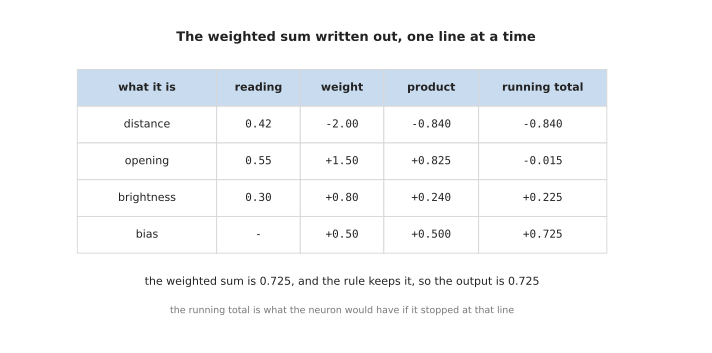

The products are -0.840, +0.825 and +0.240, the bias adds another +0.500, and
the running total after the last line is +0.725, which is the weighted sum.

The running total in the last column is worth following, because after the
distance alone the total is below 0, and only when the opening is added does it
climb back up. That is the whole point of a weighted sum, which is that it lets
several readings argue with each other and settles the argument by weight.

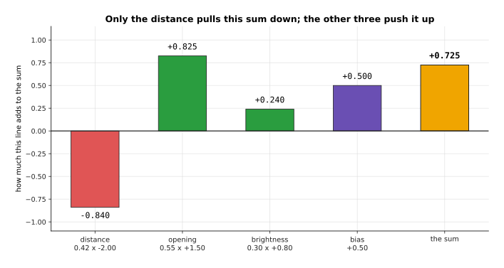

Only the distance pulls this sum down, because it is the only reading with a
minus weight, and the opening pushes it up the hardest at +0.825.

So far the arm has stood still at 0.42 metres, so the next picture holds the
opening at 0.55 and the brightness at 0.30 and sweeps the distance from 0 to 1
metre. Because the only thing changing is multiplied by one fixed weight, the
answer must be a straight line, and it falls by exactly 2.00 for every extra
metre.

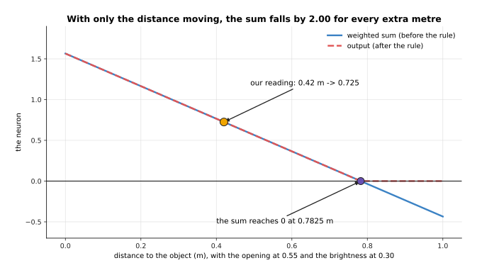

At 0 metres the sum is 1.565, at our reading of 0.42 metres it is 0.725, and it
crosses 0 at 0.7825 metres, after which the rule holds the output at 0.

That crossing point of 0.7825 metres is the distance at which this neuron falls
silent, and the next section moves it on purpose. Two readings can be swept at
once, and then the place where the sum crosses 0 is a straight line across the
picture rather than a single point.


Over the whole square the sum runs from -1.260 to +2.240, and the line where it
is exactly 0 runs from an opening of 0.84 at a distance of 1 metre down to the
bottom edge, with our reading sitting well inside the part where the sum is
above 0.

The straightness of that line is the most important limit of a single neuron,
and section 4 comes back to it. First it is worth seeing what the four numbers
the neuron owns actually control.

---

## 3. What changes when a weight or the bias changes

The weighted sum in the section before this one used one particular set of four
numbers, so the natural question is what would have happened with different
ones. The answer is easiest to see by changing one number at a time and working
the same sum out again, and the clearest single change is to flip the sign of
the weight on the distance from -2.00 to +2.00.

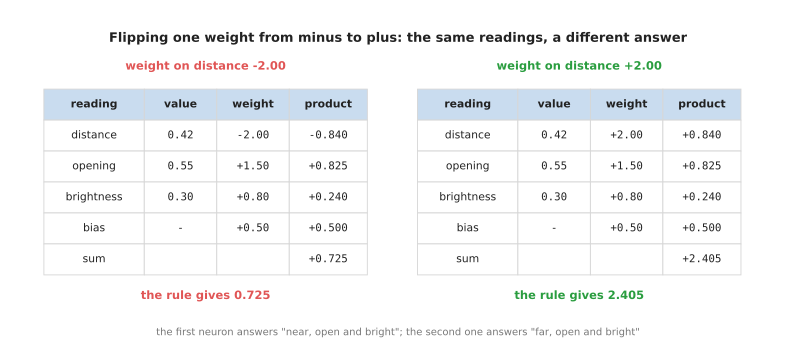

With the weight -2.00 the distance contributes -0.840 and the sum is +0.725,
and with the weight +2.00 the same reading contributes +0.840 and the sum is
+2.405, which is more than three times as large.

Nothing about the robot changed between those two tables. Only one of the
neuron's own numbers moved, and the neuron now answers a different question,
because one with a plus weight on the distance is answering "is the arm far from
a bright object with the gripper open" instead. So a weight is not a detail of
the arithmetic, since it is the thing that decides what the neuron is for.

The size of a weight matters as well as its sign, and the way to see that is to
look again at the line where the sum is exactly 0.

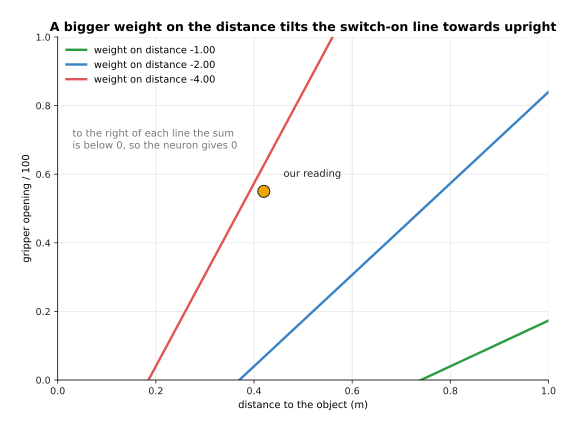

With the weight -1.00 the line only reaches an opening of 0.173 at the far right
of the square, with -2.00 it reaches 0.840, and with -4.00 it crosses the whole
square, so a bigger weight on the distance makes the line stand more upright and
leaves the neuron caring about the distance more and about the opening less.

A weight of +2.00 is missing from that picture for a good reason, which is that
with a plus weight of that size the smallest sum anywhere in the square is
+0.740, so the sum never reaches 0 and the neuron is switched on for every
reading it could ever see.

The bias does something different again. It is added whatever the readings are,
so it slides the whole line up or down without tilting it, and that moves the
point at which the neuron falls silent.

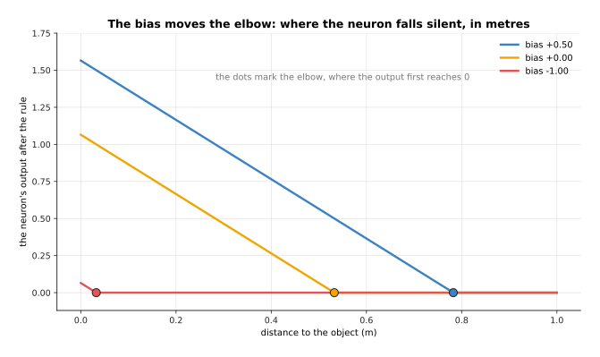

With the bias +0.50 the output reaches 0 at 0.7825 metres, with the bias 0.00 it
reaches 0 at 0.5325 metres, and with the bias -1.00 it reaches 0 at only 0.0325
metres, which leaves the neuron silent almost everywhere.

So the weights decide which way the line leans and the bias decides where it
sits, and those four numbers are the only freedom this neuron has. That freedom
is narrow, because whatever you do to them the dividing line stays straight, and
the next section shows why that cannot be fixed by adding more neurons of the
same kind.

---

## 4. Why multiplying and adding is not enough

The sections before this one kept finding straight lines, and that is not an
accident of the numbers chosen. Multiplying by a weight and adding a bias can
only ever make a straight line, and the surprising part is that doing it twice
does not help, because two of these neurons in a row are exactly equal to one
neuron with different numbers.

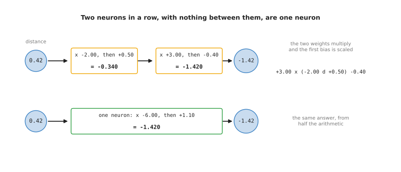

The first neuron turns 0.42 into -0.340 and the second turns -0.340 into -1.420,
and one neuron with the weight -6.00 and the bias +1.10 turns 0.42 straight into
-1.420 without the stop in the middle.

The reason is ordinary arithmetic. The second neuron multiplies what it receives
by 3.00, and what it receives is -2.00 times the distance plus 0.50, so the pair
works out 3.00 times -2.00 times the distance, which is -6.00 times the
distance, plus 3.00 times 0.50 minus 0.40, which is 1.10. The two weights
multiply together and the first bias is scaled by the second weight.

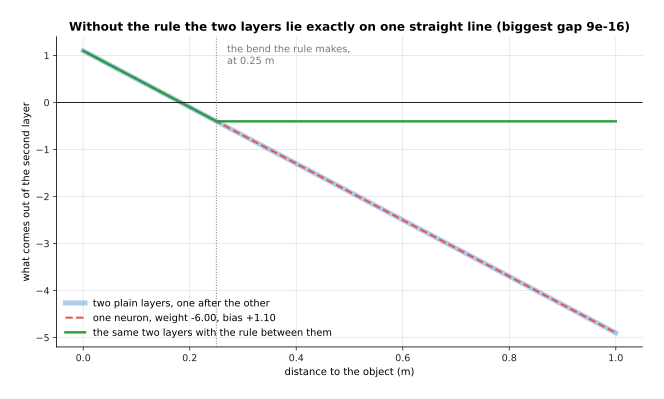

Across the whole sweep of distances the two plain layers and the single neuron
never differ by more than 0.0000000000000009, while putting the rule between
them gives a line that bends at 0.250 metres and is a different shape
altogether.

The same thing happens however many you chain together, which is worth checking
because it is easy to believe that three in a row must be able to do something
two cannot.

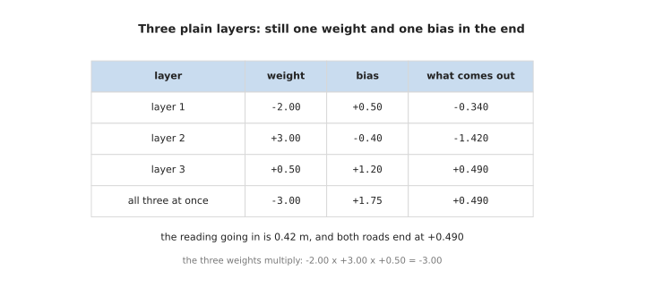

The three weights multiply to -3.00 and the biases gather into +1.75, so three
layers in a row give exactly the same +0.490 that one layer with those two
numbers gives.

This matters because plenty of useful jobs cannot be done by a straight line at
all. The brightness of the patch is one of them, because it is good in the
middle and bad at both ends, since a patch that is nearly black shows nothing
and a patch that is burnt out shows nothing either.

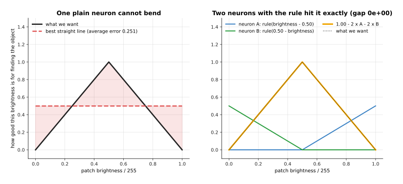

The best straight line through this target is flat at 0.499, which is wrong by
0.251 on average, while two neurons with the rule rebuild the tent exactly, with
a biggest gap of zero.

So a network made only of multiplying and adding could have a thousand layers
and would still only be able to draw one straight line, and the thing that
rescues it is the simple rule applied at the end of each neuron, which the next
section finally looks at properly.

---

## 5. The rectified linear unit

The rule that section 4 kept putting between the layers has a name. It is called
the **activation function**, which is a rule applied to the weighted sum to give
the neuron's output, and the number that comes out of it is called the neuron's
**activation**. The one used everywhere is the **rectified linear unit (ReLU)**,
and the whole of it is this: if the sum is below 0 give 0, and otherwise give
the sum unchanged.

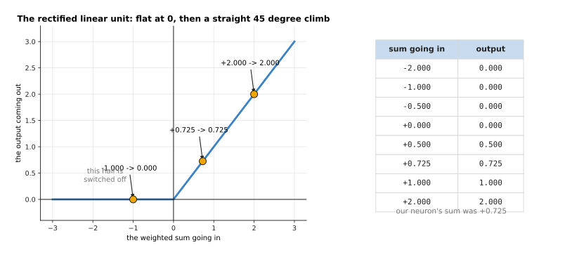

An input of -2.000 gives 0.000, an input of -1.000 gives 0.000, an input of
+0.725 gives 0.725, and an input of +2.000 gives 2.000, so every number below 0
is flattened to 0 and every number above it is passed on untouched.

This looks almost too simple to do any work, and the reason it does so much work
is the corner at 0. A neuron with this rule is two different things joined at
one point, since on one side of the corner it ignores its inputs and on the
other side it follows them exactly. The place where it changes is the elbow that
section 3 moved with the bias, and once several neurons each have an elbow in a
different place, the elbows can be added up into any shape at all.

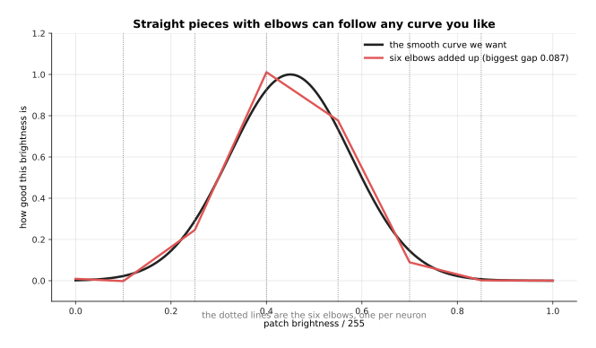

Six neurons with elbows at 0.08, 0.25, 0.42, 0.58, 0.75 and 0.92 follow the
smooth curve to within 0.107 everywhere, and twelve of them bring that gap down
to 0.030.

That is the answer to the question section 4 raised. A network can bend because
each neuron can switch off, and a network with more neurons can bend in more
places. What it costs is that half of every neuron's range gives nothing at all,
and a neuron whose sum is below 0 for every reading it ever meets never does
anything.

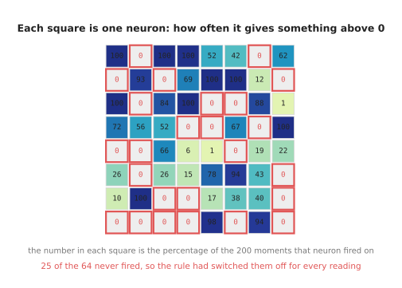

Of 64 neurons with randomly chosen weights reading 200 simulated moments, 25
never answered above 0 at all, and the average neuron answered on 36.6 per cent
of them; the readings and the weights here are simulated, drawn from a fixed
seed so that the picture can be made again.

A neuron in that state is called a dead unit, and it is dead in a strong sense,
because the training methods in the next chapter nudge each weight in the
direction that would improve the answer, and a neuron whose output is 0 for
every example gives no direction to nudge in. That shows up in the slope of the
rule.

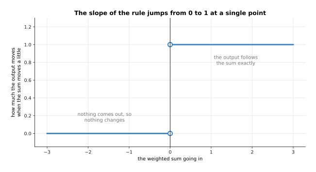

To the left of 0 the slope is 0, which means that moving the sum a little
changes nothing at all, and to the right of 0 the slope is 1, which means the
output follows the sum exactly, and at the point 0 itself there is no single
slope because the rule jumps.

That flat left half and that jump at 0 are the two things the newer rules in the
next section change.

---

## 6. GELU and SiLU, and why networks use them now

The rectified linear unit has those two awkward places, so two smoother rules
have taken over much of its work in the models built today, and both of them
keep its shape while rounding off its corner. They are the **Gaussian error
linear unit (GELU)** and the **sigmoid linear unit (SiLU)**, which is also
called swish, and both of them multiply the sum by a number between 0 and 1 that
grows as the sum grows, instead of switching flatly between 0 and 1.

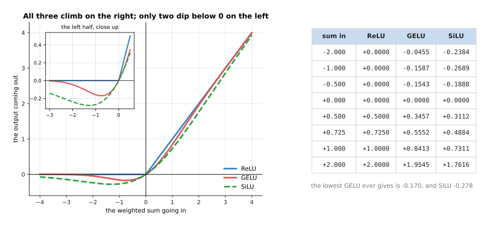

All three give almost the same answer for a sum of +2.000, which is 2.0000 for
the rectified linear unit, 1.9545 for GELU and 1.7616 for SiLU, but on the left
they differ, because at -1.000 the rectified linear unit gives 0.0000 while GELU
gives -0.1587 and SiLU gives -0.2689; the lowest GELU ever gives is -0.170 and
the lowest SiLU is -0.278.

The small dip below 0 is the first difference, and it means that a neuron whose
sum is a little below 0 still gives a small answer rather than nothing, so it is
never completely dead. The second difference is in the slope, which is what the
training methods in the next chapter actually use.

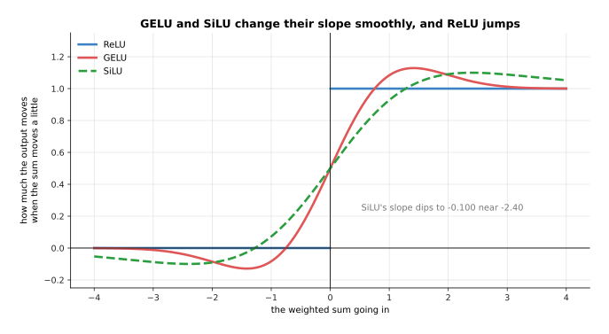

The rectified linear unit's slope is 0 at an input of -2 and 1 at +2 with a jump
between them, while GELU's slope runs from -0.0852 at -2 to +1.0852 at +2 and
SiLU's from -0.0908 to +1.0908, and both of them dip below 0 on the left, GELU
down to -0.129 near -1.42 and SiLU down to -0.100 near -2.40.

Put back on the neuron from section 1, with the distance sweeping, the three
rules give three slightly different answers, and the difference is clearest near
the elbow.

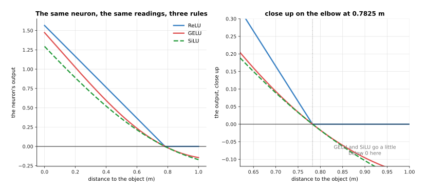

At our reading of 0.42 metres the sum of +0.725 becomes 0.7250 under the
rectified linear unit, 0.5552 under GELU and 0.4884 under SiLU, and at 0.85
metres, where the sum is -0.1350, the rectified linear unit gives exactly 0
while GELU gives -0.0603 and SiLU gives -0.0630.

So why use the smooth ones rather than the rectified linear unit, which is
simpler and older? Because the smooth change in slope gives the training methods
something to work with everywhere instead of nothing on one side and a jump in
the middle, and because the large models built today train a little more
steadily with them. Most transformer models, which the chapter [the
transformer](../06_the-transformer/02_a-transformer-block.md) explains, use GELU
or SiLU inside, while the rectified linear unit stays common in smaller vision
models and wherever speed matters most.

What they cost is arithmetic, because the rectified linear unit is a single
comparison against 0 while GELU and SiLU both need a curve that a computer works
out with an exponential, which takes several times as long per number. That
sounds expensive until you count how often each thing happens inside one layer.

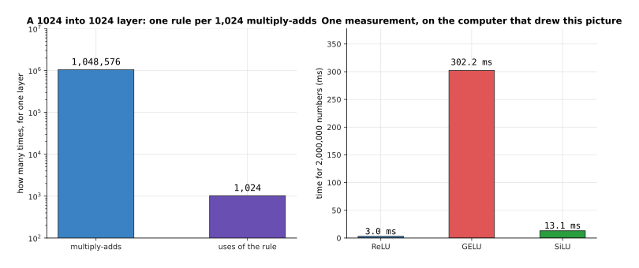

A layer with 1,024 inputs and 1,024 neurons does 1,048,576 multiply-adds and
uses the rule only 1,024 times, which is one use of the rule for every 1,024
multiply-adds, so even a rule that costs as much as 20 multiply-adds adds only
1.95 per cent to the work of that layer.

That picture quietly introduces the subject of the next page, which is that a
layer of 1,024 neurons has over a million weights in it, and that those weights
are arranged in a grid that a computer multiplies in one go.

---

## 7. Where to read next

- [Layers and depth](02_layers-and-depth.md) is the next page, and it joins many
  copies of this neuron into a layer, stacks the layers, and explains what each
  extra layer adds and what it costs.
- [The shape of the numbers](03_the-shape-of-the-numbers.md) explains how those
  weights are stored and multiplied, and why the hardware is built the way it
  is.
- [What a network can learn](04_what-a-network-can-learn.md) picks up section 4
  and shows why stacking layers with a rule between them can follow any shape.
- [The score of being wrong](../03_how-training-works/01_the-score-of-being-wrong.md)
  starts the chapter that finds the weights and biases this page chose by hand.
- [Backpropagation](../03_how-training-works/03_backpropagation.md) explains why
  the slopes drawn in sections 5 and 6 matter so much.
- [Inside a neural network](../../07_learned-models/01_what-models-are/03_inside-a-neural-network.md)
  is the short version of the same ideas in the catalogue of models, and it
  carries on into the layer types used for pictures and sentences.

---

## 8. Using it in Python

Everything on this page is one line of PyTorch, the library most of this book's
models are built with. The code below builds the same neuron as section 1, puts
the same three readings through it, and checks the arithmetic of sections 2, 5
and 6.

```python
import torch
from torch import nn

neuron = nn.Linear(in_features=3, out_features=1)   # section 1: 3 weights + 1 bias
with torch.no_grad():                               # fix them by hand, as this page did
    neuron.weight.copy_(torch.tensor([[-2.0, 1.5, 0.8]]))
    neuron.bias.copy_(torch.tensor([0.5]))

readings = torch.tensor([[0.42, 0.55, 0.30]])       # distance, opening/100, brightness/255
total = neuron(readings)                            # section 2: the weighted sum
print(f"{total.item():.4f}")                        # 0.7250
print(sum(p.numel() for p in neuron.parameters()))  # 4

print(f"{torch.relu(total).item():.4f}")                      # section 5: 0.7250
print(f"{torch.nn.functional.gelu(total).item():.4f}")        # section 6: 0.5552
print(f"{torch.nn.functional.silu(total).item():.4f}")        # section 6: 0.4884

below = torch.tensor([-0.135])                      # the sum at 0.85 m, from section 6
print(f"{torch.relu(below).item():.4f}")                      # 0.0000
print(f"{torch.nn.functional.gelu(below).item():.4f}")        # -0.0603
```

The class is called `nn.Linear` rather than `nn.Neuron` because it is written to
hold a whole layer of neurons at once, and asking for one output is how you get
a single neuron out of it. The library gives you the weights, the bias, the
multiplying and the adding, so you never write the arithmetic of section 2
yourself.

Each number is printed to four decimal places on purpose, because PyTorch works
in a number format called float32 that keeps only about seven digits, so the
full printout would end in digits that depend on the order the machine added
things up. The page [the shape of the
numbers](03_the-shape-of-the-numbers.md) explains that format and the smaller
ones models are run in.

What you have to decide is none of the arithmetic and all of the shape. You
choose how many inputs the layer takes and how many neurons it has, which the
next page is about, and you choose which rule to apply after it, which section 6
weighed up. You do not choose the weights or the bias, because training chooses
those.
