# Layers, depth and width

The page before this one, [one neuron](01_one-neuron.md), worked a single neuron
out by hand: three readings from a robot arm were each multiplied by a weight,
the products and a bias were added to make 0.725, and a rule decided what came
out. One neuron is not a model, though, because it gives one number and it can
only ever draw a straight line across its readings. This page puts many neurons
side by side into a **layer**, stacks layers one after another, and answers the
two questions that follow from doing so, which are what each extra layer gives
you and what it costs you.

Three words do most of the work here. A layer is a group of neurons that all
read the same numbers, the **width** of a layer is how many neurons it has, and
the **depth** of a network is how many layers it has one after another. Choosing
those two numbers is most of what a person actually decides when they build a
network, so this page tries to give you a feel for what each choice buys.

It is for a reader who has read [one neuron](01_one-neuron.md) and is happy with
a weighted sum, a bias and the rectified linear unit. Training is still not
explained, because the chapter [how training
works](../03_how-training-works/01_the-score-of-being-wrong.md) does that. The
same made-up moment of the same grasp runs through the page, with the same three
readings of 0.42, 0.55 and 0.30, and every number in every picture was worked
out and printed by `docs/diagrams/inside_a_network_1.py`; where many weights are
needed at once they are drawn from a fixed random seed, and the page says so.

## Contents

1. [A layer is many neurons reading the same numbers](#1-a-layer-is-many-neurons-reading-the-same-numbers)
2. [Fully connected, and what joining everything costs](#2-fully-connected-and-what-joining-everything-costs)
3. [What a second layer buys you](#3-what-a-second-layer-buys-you)
4. [Depth and width, and what each one changes](#4-depth-and-width-and-what-each-one-changes)
5. [What depth and width cost](#5-what-depth-and-width-cost)
6. [Residual connections](#6-residual-connections)
7. [Where to read next](#7-where-to-read-next)
8. [Using it in Python](#8-using-it-in-python)

---

## 1. A layer is many neurons reading the same numbers

The neuron on the page before this one answered one question about the grasp,
and a robot needs more than one answer, so the first step is to put several
neurons side by side and give all of them the same three readings. That group is
a **layer**, and the only new idea in it is that each neuron keeps its own
weights and its own bias, so the same three numbers going in come out as several
different answers.

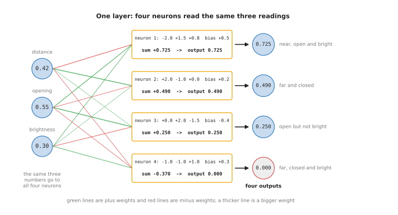

The same readings 0.42, 0.55 and 0.30 reach all four neurons, and because the
four sets of weights differ, the four sums are +0.725, +0.490, +0.250 and
-0.370, which the rule turns into the outputs 0.725, 0.490, 0.250 and 0.000.

Nothing there is new arithmetic, since it is the weighted sum of the page before
done four times over, but it is worth writing out once, because seeing twelve
products at once is what makes a layer one thing rather than four.

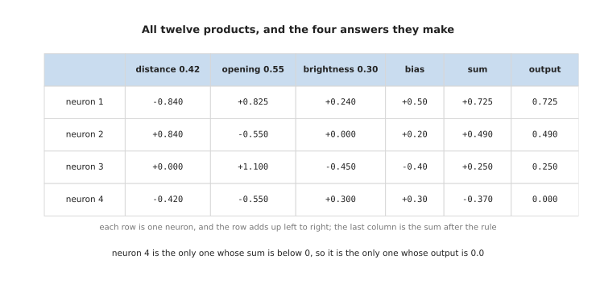

Each row is one neuron and adds up from left to right, so neuron 2 has the
products +0.840, -0.550 and +0.000 and the bias +0.20, which make +0.490, while
neuron 4 reaches -0.370 and is the only one the rule silences.

The twelve weights are usually drawn as a grid rather than as four separate
lists, with one row for each neuron and one column for each input, because that
is how a computer stores them and how the next page describes them.

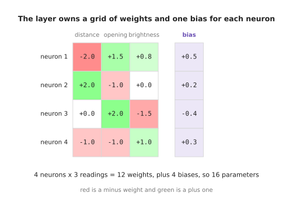

Four neurons reading three numbers need 4 times 3, which is 12 weights, plus one
bias each, so the whole layer owns 16 parameters.

The four numbers that come out are called the layer's **features**. A feature is
a number worked out from the readings that says something useful about them, and
the point of having four is that each describes the moment in a different way,
so together they say more than any one of them could.

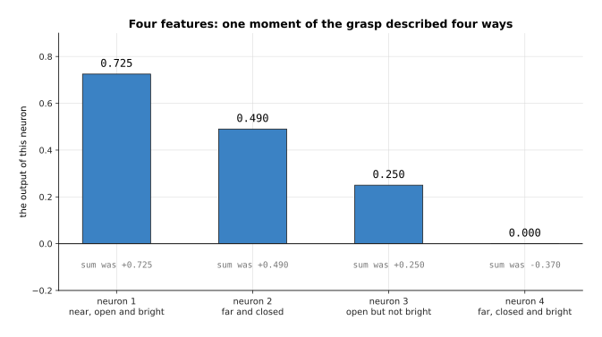

Three readings have become four features, and the fourth is 0.000 because its
sum of -0.370 was below 0, which means this neuron is saying nothing at all
about this particular moment.

In this layer the weights were chosen by hand so that each neuron has a
description you can read, and in a trained network nobody chooses them, so
nobody can say in advance what each feature will mean.

---

## 2. Fully connected, and what joining everything costs

The layer in section 1 joined every reading to every neuron, and that
arrangement has a name: it is a **fully connected** layer, also called a dense
layer or a linear layer. It is the plainest layer there is, because it assumes
nothing about what the inputs mean and lets every neuron look at every one of
them.

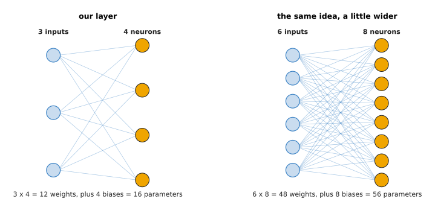

Three inputs into four neurons is 12 weights and 4 biases, which is 16
parameters, and six inputs into eight neurons is 48 weights and 8 biases, which
is 56, so the count is the inputs multiplied by the neurons, plus the neurons.

That multiplication is the whole cost story of a fully connected layer. The
layer in section 1 is small enough to draw, but the layers in real models take
hundreds or thousands of numbers in, and then the count climbs quickly.

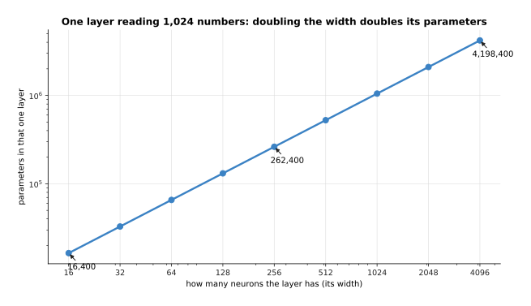

A layer reading 1,024 numbers has 16,400 parameters when it has 16 neurons,
262,400 when it has 256, and 4,198,400 when it has 4,096, so doubling the number
of neurons doubles the count.

Joining everything to everything is a poor choice when the inputs have a shape
of their own. If the inputs are the pixels of a picture, then two pixels next to
each other are related and two at opposite corners are usually not, and a fully
connected layer has no way of knowing that, so it has to learn it from the
examples.

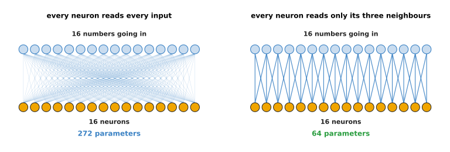

Sixteen inputs into sixteen neurons takes 272 parameters when everything is
joined and only 64 when each neuron reads its three neighbours, which is a
little over four times fewer.

That second arrangement, repeated with the same weights at every position, is
called a convolution, and it is the subject of [what a network can
learn](04_what-a-network-can-learn.md). All this page says about it is that a
fully connected layer is the general case, and the special layers are savings
made by knowing something about the input.

---

## 3. What a second layer buys you

Section 2 counted what one layer costs, which raises the question of why anybody
would use more than one. The answer is that the second layer does not read the
readings, since it reads the features the first layer made, and that is a
different thing to read. The page before this one showed that two layers with
nothing between them collapse into one, so everything here assumes the rule is
applied after each layer.

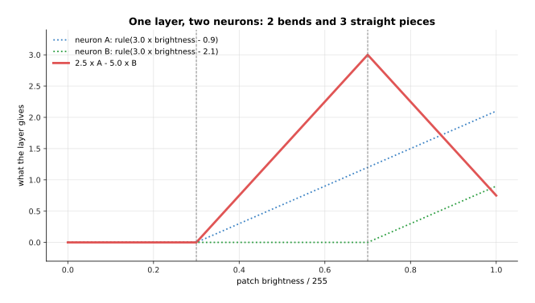

One layer of two neurons, with elbows at 0.300 and 0.700, adds up to a line with
2 bends and 3 straight pieces, and no choice of the numbers that combine them
can give it more.

Now add a second layer of two neurons that reads those two features instead of
the brightness. The second layer's neurons have their own elbows, but an elbow
in the second layer sits wherever the first layer's output crosses the second
neuron's switching point, so the new bends land in places that neither
first-layer neuron has an elbow at.

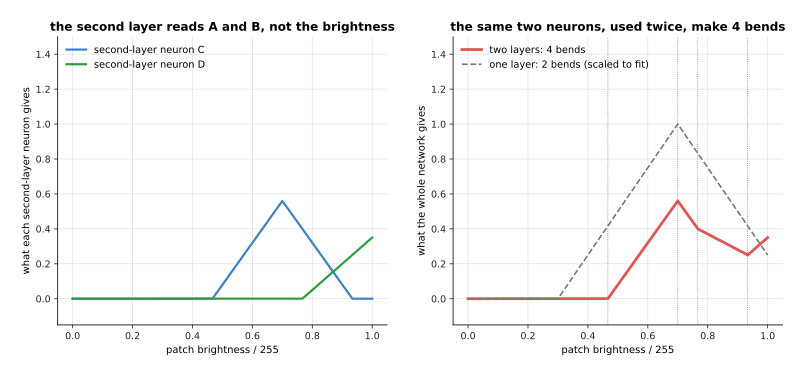

The same two first-layer neurons, read by two more, give a line with 4 bends
instead of 2, and the bends sit at 0.467, 0.700, 0.767 and 0.933, three of which
are at brightness values where the first layer had no elbow at all.

That is the mechanical answer, and the useful answer is what the layers end up
meaning. When researchers look inside a trained network for pictures, they find
the same pattern again and again: the neurons in the early layers answer
questions about edges and patches of colour, the neurons in the middle layers
answer questions about shapes made of those edges, such as corners and curves,
and the neurons in the late layers answer questions about whole parts of
objects, such as a handle or a rim. Nobody tells the network to do this, since
it comes out of training on its own.

The stages below are built by hand so that the arithmetic is visible, on a
simulated 14 by 14 picture of a cup with a handle, where 1 is bright and 0 is
dark.

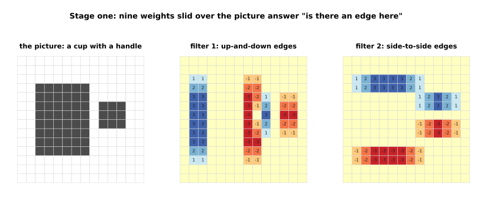

Nine weights slid over the picture give +3 where a dark column is followed by a
bright one and -3 where the opposite happens, so the up-and-down filter answers
in columns 1, 2 and 9 and again in columns 7, 8, 11 and 12, and the side-to-side
filter answers along the top and bottom of each shape.

Nothing in that first stage knows anything about cups, because each answer comes
from nine numbers at one place. The second stage reads the first stage's two
answers rather than the picture, and asks whether there is an up-and-down edge
and a side-to-side edge in the same place, which is what a corner is. The third
stage asks whether there is a bright edge with a dark edge three columns to its
right, which is what a narrow bright bar is.

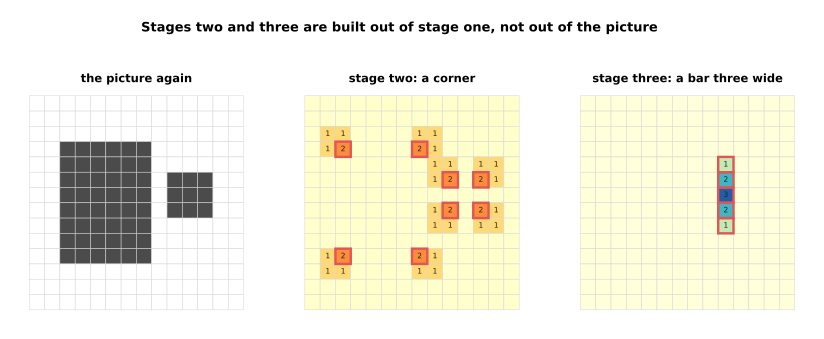

The corner answer rises above 2 at exactly 8 places, which are the four corners
of the body and the four of the handle, and the narrow-bar answer fires at 5
places, all of them in the handle and none of them on the body, because the body
is six columns wide and the bar question only accepts three.

So the third stage has found the handle, and it found it without ever looking at
the picture, because it only looked at what the first stage said. That is what
an extra layer buys: not more lines across the readings, but questions asked
about the answers to earlier questions.

---

## 4. Depth and width, and what each one changes

Section 3 showed what a second layer does, and the obvious next question is how
far that goes, which is where the two words in this page's title finally get
measured. The depth is how many layers a network has, the width is how many
neurons each layer has, and a network that is called **deep** is simply one with
many layers, which is where the name deep learning comes from. There is no exact
number where deep starts, although vision models often have dozens of layers and
the largest language models have around a hundred.

One way to measure what a network can do is to count the straight pieces its
answer is made of, since section 3 showed that bends are what a network has to
spend. In the pictures below a single reading is swept from -1 to +1, the
weights are drawn from a fixed random seed, and the pieces are counted by the
script on a sweep of 6,001 points, averaged over five networks of each shape.

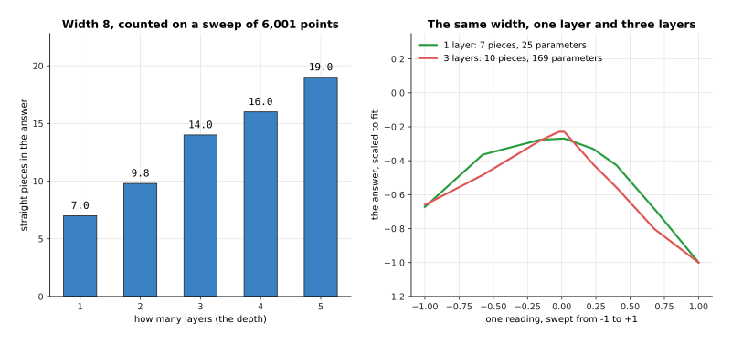

With the width held at 8 neurons, one layer gives 7.0 pieces on average, two
give 9.8, three give 14.0, four give 16.0 and five give 19.0, so every extra
layer adds more detail to the answer.

Width does the same job by a different road, because each neuron in a layer has
one elbow of its own, so adding neurons to a layer adds places where the answer
can change direction.

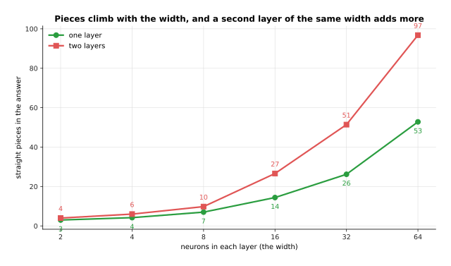

One layer of 8 neurons gives 7.0 pieces and one layer of 64 gives 52.8, while
two layers of 8 give 9.8 and two layers of 64 give 96.8, so the width lifts both
lines and the second layer lifts them again.

Putting both measurements in one picture gives an honest answer to which of the
two is worth more, and it is less exciting than it might be.

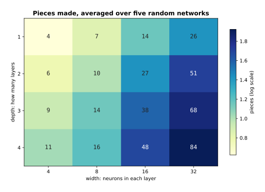

Across all sixteen shapes the number of pieces lies close to one straight line
through zero with a slope of 0.70, which means that with weights picked at
random it is the total number of neurons that decides the detail, and not how
they are arranged into layers.

That is worth saying plainly, because it is easy to be told that depth is
magical and then to believe a deep network is better at everything. Two networks
with about the same number of parameters can be arranged either way, and with
random weights the flat one is not behind.

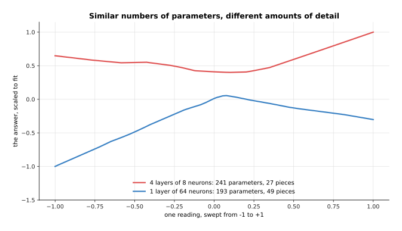

Four layers of 8 neurons have 241 parameters and make 27 pieces, while one layer
of 64 neurons has 193 parameters and makes 49, so on this measure the wide flat
network is ahead.

What the deep one has instead is what section 3 showed, which is layers that ask
questions about earlier answers, and that only pays once training has chosen the
weights. So the rule of thumb is that width gives a layer more different
features at the same stage, depth gives later stages something built to ask
about, and real models use plenty of both.

---

## 5. What depth and width cost

Since section 4 found that both depth and width add detail, the way to choose
between them is to look at what each one costs, and the cost is easy to count
exactly. Take a stack where every layer has the same width, so each layer takes
that many numbers in and gives that many out; then the parameters in one layer
are the width multiplied by itself plus one bias each, and the stack is that
multiplied by the depth.

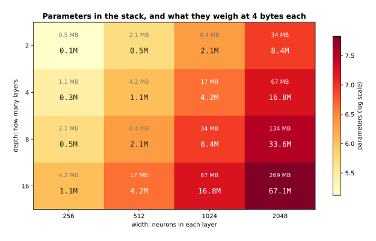

Two layers of 256 come to 131,584 parameters, which is 1 megabyte at 4 bytes for
each number, while 16 layers of 2,048 come to 67,141,632 parameters, which is
269 megabytes, so the same table covers a model that fits anywhere and one that
has to be thought about.

The other cost is the arithmetic done every time a reading goes through, which
is counted in multiply-adds, where one multiply-add is one weight multiplied by
one number and added to a running total. There is one of them for every weight,
so the count follows the parameter count closely.

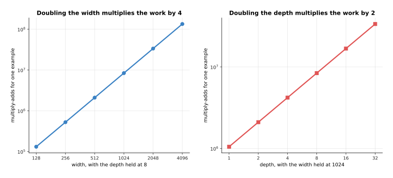

Eight layers of 1,024 do 8,388,608 multiply-adds for one reading, eight layers
of 2,048 do 33,554,432, and sixteen layers of 1,024 do 16,777,216, so the work
climbs in the same way as the parameters do.

Those rows are worth seeing side by side. Width is multiplied in twice, once
because each neuron has more inputs and once because there are more neurons,
while depth is multiplied in only once.

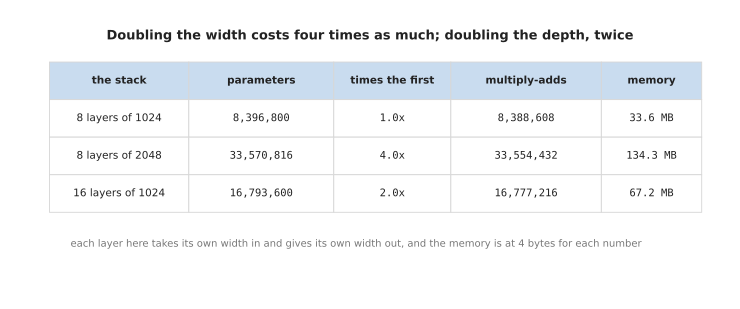

Doubling the width from 1,024 to 2,048 takes the stack from 8,396,800 to
33,570,816 parameters, which is 4.0 times as many, while doubling the depth from
8 to 16 layers takes it to 16,793,600, which is 2.0 times as many.

Time is the last cost, and it cannot be given in seconds here, because those
depend on the computer and on how many readings are handled at once. What can be said exactly is the work,
which also grows with how many readings go through.

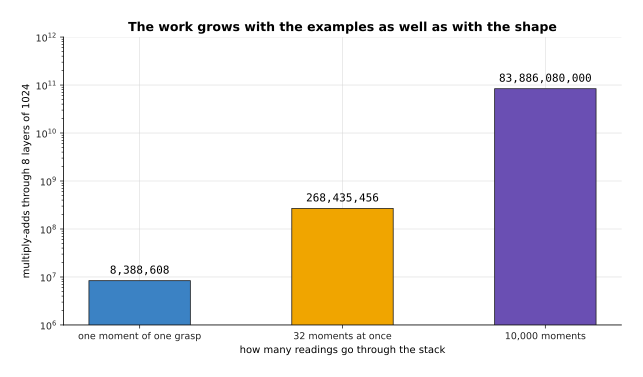

One moment of one grasp costs 8,388,608 multiply-adds through this stack, 32
moments at once cost 268,435,456, and 10,000 moments cost 83,886,080,000, and
training goes over the whole set many times rather than once.

So the honest summary is that a wider layer costs four times as much for each
doubling and a deeper stack twice as much, in memory and in work alike. That
would suggest piling on layers, which is cheaper, except that for a long time
nobody could train a very deep stack at all, and the next section is about the
change that fixed it.

---

## 6. Residual connections

Section 5 ended with a problem that is worth stating properly. When deep
networks were first built, making a plain stack deeper past a few dozen layers
made it worse rather than better, and worse even on the examples it had been
trained on, which is not the usual failure of a model that has too many
parameters. The fix is one of the smallest changes in this book: instead of
passing each layer's output on, you add it to the layer's input and pass the
total on. That is a **residual connection**, and a layer wrapped in one is
usually called a block.

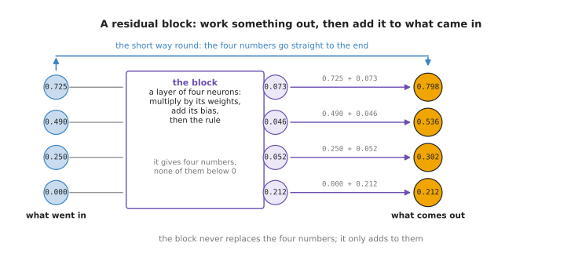

The four features from section 1, which were 0.725, 0.490, 0.250 and 0.000, go
into a small block that answers 0.073, 0.046, 0.052 and 0.212, and the output is
the two added together, which is 0.798, 0.536, 0.302 and 0.212.

The thing to notice is that the output can never be further from the input than
the block's own answer, because the block adds to what it was given instead of
replacing it. The effect builds up over a stack, which is easiest to see by
pushing one set of 64 numbers through 30 layers twice, once plainly and once
with the add, using the same randomly drawn weights both times.

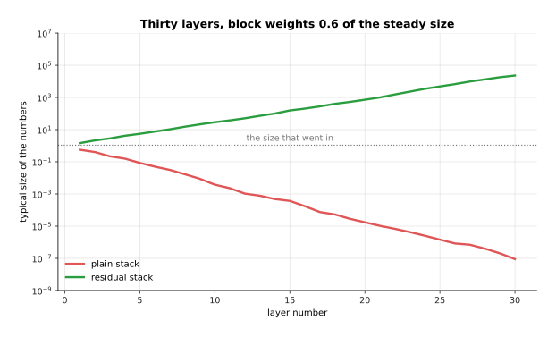

Numbers with a typical size of 1.071 go in; with block weights 0.6 of the size
that would hold them steady, 30 plain layers leave 0.0000000896 and 30 residual
layers leave 23,100, and with weights 0.9 the plain stack leaves 0.0172 and the
residual stack 2,220,000; the weights here are simulated from a fixed seed.

Those numbers deserve a slow look, so here they are at five depths.

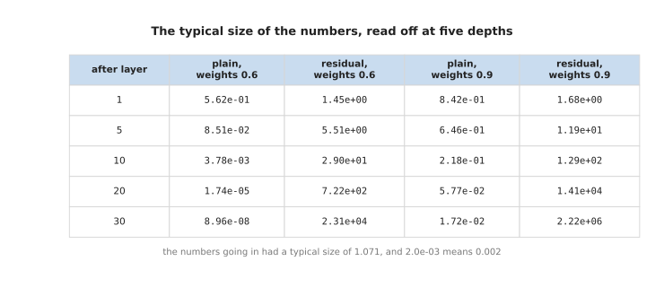

The plain stack with weights 0.6 falls from 0.562 after one layer to 0.0000000896
after thirty, which means that by the end the numbers are millions of times
smaller than what went in, while the residual stack with the same weights climbs
from 1.45 to 23,100.

Neither of those is good on its own, and that is the honest shape of the matter.
The plain stack loses everything that went in if the weights are a little too
small, and the residual stack grows instead, which is why every real network
puts a step that rescales the numbers inside each block. That step is called
normalisation, and [normalisation and
stability](../04_making-training-work/02_normalisation-and-stability.md)
explains it; with it in place a residual stack holds its numbers steady for
hundreds of layers.

What the add really buys shows in the case where the block has almost nothing to
say, which is where a plain layer does the most damage.

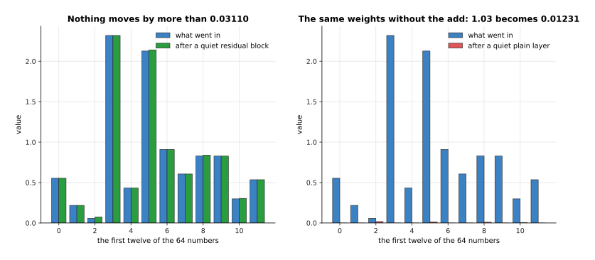

With weights a hundred times smaller than usual, the residual block moves no
number by more than 0.031, while the same weights in a plain layer shrink the
typical size from 1.033 to 0.012, which is almost nothing left.

So a residual block can do nothing, and a plain layer cannot. Adding a block to
a network that already works can leave it working, which means a deeper network
starts out at least as good as a shallower one and can only improve from there,
and that is what made stacks of fifty, a hundred and more layers trainable.
Almost every model in this book is built from blocks of this shape, including
the transformer block that the chapter [the
transformer](../06_the-transformer/02_a-transformer-block.md) takes apart.

---

## 7. Where to read next

- [The shape of the numbers](03_the-shape-of-the-numbers.md) is the next page,
  and it explains how the weight grid of section 1 is stored, what a matrix
  multiply is, and why the hardware that runs models is built around it.
- [What a network can learn](04_what-a-network-can-learn.md) explains why
  stacking these layers can follow any shape at all, and it introduces the
  convolution that section 2 compared a fully connected layer against.
- [A transformer block](../06_the-transformer/02_a-transformer-block.md) is the
  block of section 6 as it is actually built today, with attention inside it.
- [Normalisation and stability](../04_making-training-work/02_normalisation-and-stability.md)
  explains the rescaling step that keeps the numbers of section 6 from growing.
- [Backpropagation](../03_how-training-works/03_backpropagation.md) explains the
  training problem that residual connections were invented to solve.
- [Inside a neural network](../../07_learned-models/01_what-models-are/03_inside-a-neural-network.md)
  gives the same layer ideas in short, next to the catalogue of models that use
  them.

---

## 8. Using it in Python

A layer, a stack of layers and a residual block are each a few lines of PyTorch.
The code below builds the layer of section 1 with the same weights, counts its
parameters, counts a bigger stack from section 5, and wraps a block in the
residual add of section 6.

```python
import torch
from torch import nn

layer = nn.Linear(3, 4)                     # section 1: four neurons, three inputs each
with torch.no_grad():                       # the same weights this page used
    layer.weight.copy_(torch.tensor([[-2.0, 1.5, 0.8], [2.0, -1.0, 0.0],
                                     [0.0, 2.0, -1.5], [-1.0, -1.0, 1.0]]))
    layer.bias.copy_(torch.tensor([0.5, 0.2, -0.4, 0.3]))

readings = torch.tensor([[0.42, 0.55, 0.30]])
print([f"{v:.3f}" for v in layer(readings)[0]])              # ['0.725', '0.490', '0.250', '-0.370']
print([f"{v:.3f}" for v in torch.relu(layer(readings))[0]])  # ['0.725', '0.490', '0.250', '0.000']
print(sum(p.numel() for p in layer.parameters()))            # 16

stack = nn.Sequential(*[m for _ in range(8)                  # section 5: 8 layers of 1024
                        for m in (nn.Linear(1024, 1024), nn.ReLU())])
print(sum(p.numel() for p in stack.parameters()))            # 8396800

class Block(nn.Module):                     # section 6: one residual block
    def __init__(self, width):
        super().__init__()
        self.inner = nn.Sequential(nn.Linear(width, width), nn.ReLU())

    def forward(self, x):
        return x + self.inner(x)            # the add is the whole idea
```

The library gives you the weight grid, the bias, the multiplying and the adding,
and `nn.Sequential` gives you the stacking, so a network of 8 layers is one line
and its parameter count comes back as 8,396,800, the number section 5 counted.
The residual block needs a class of its own only because `nn.Sequential` passes
each output straight on and has nowhere to keep the input.

What you decide is the shape. You choose the width of each layer and how many
layers there are, which sections 4 and 5 weighed up, and you choose whether the
layers are fully connected or one of the special kinds that the next pages
describe. You also choose whether to wrap each layer in a residual add, and for
anything deeper than a few layers the answer is yes.

What you do not decide is any of the numbers inside. The weights above were
copied in by hand so that the printout matches this page, and in every real
model they start as small random values and are changed by training, which the
chapter [how training
works](../03_how-training-works/01_the-score-of-being-wrong.md) explains from
the beginning.
