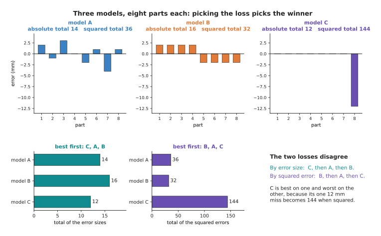
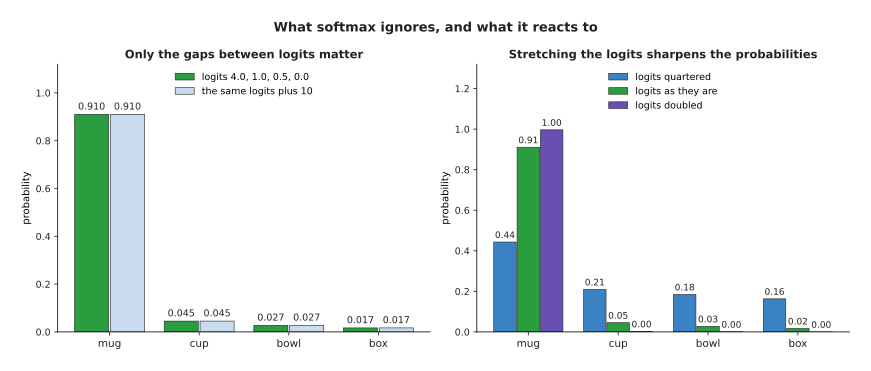

# The score of being wrong

The page before this one, [what a network can
learn](../02_inside-a-network/04_what-a-network-can-learn.md), showed that a
network with enough layers and enough weights can be shaped to fit almost any
pattern, but it did not say how anybody finds the right values for those weights.
This page begins that answer with the one thing training needs before it can take
a step, which is a way of saying how wrong the model is right now.

That measurement is called the **loss**, and it is a single number that is large
when the model is wrong and small when it is right. Training is the business of
making that number smaller, so every choice you make about the loss changes what
the model ends up doing. This page explains the two usual losses for an answer
that is a number, then how a model answers a question whose answer is a choice
between named things, and it ends by drawing the shape a loss makes when you plot
it against a weight, because that shape is the ground the next page walks down.

It assumes you know what a weight, a layer and a parameter are, and no statistics
at all. Every number in the pictures was worked out by
`docs/diagrams/how_training_works_1.py`, and the small tables were chosen
by hand so that you can redo the sums yourself.

## Contents

1. [Why training needs one number](#1-why-training-needs-one-number)
2. [Squared error and absolute error](#2-squared-error-and-absolute-error)
3. [When the answer is a choice: logits and softmax](#3-when-the-answer-is-a-choice-logits-and-softmax)
4. [Cross-entropy: the price of a wrong probability](#4-cross-entropy-the-price-of-a-wrong-probability)
5. [The loss landscape of one weight](#5-the-loss-landscape-of-one-weight)
6. [Choosing a loss, and what it costs](#6-choosing-a-loss-and-what-it-costs)
7. [Where to read next](#7-where-to-read-next)
8. [Using it in Python](#8-using-it-in-python)

---

## 1. Why training needs one number

Since the weights have to be changed until the model is right, the first thing to
build is a way of telling whether one setting of them is better than another, and
that is harder than it sounds once there is more than one example. Suppose a
robot arm picks eight parts off a tray, and before each pick a model predicts how
far the gripper must travel downwards, in millimetres, to touch the part.
Afterwards you know the travel each part really needed.


The model's eight errors, in millimetres, are +2, -1, +3, 0, -2, +1, -4 and +1.

That list is an honest account of the model, but it is useless for training,
because training has to compare one setting of the weights with another and a
list of eight numbers cannot be put in order.


Model A is wrong by a little on seven parts, while model C is right on seven and
12 mm out on the one it missed.

There is no answer to which of those is better until somebody decides what being
wrong costs. If a 12 mm miss means the gripper slams into the part and the arm
stops with a fault, model C is much the worse, but if it means one failed pick
out of eight, then model C, which is perfect seven times out of eight, may be the
one you want. Nothing in the data settles this, so you settle it, by choosing how
the eight errors are combined into one number.

That single number is the **loss**, also called the **objective**, because it is
what training sets out to make small. It gives back one number for the whole set,
so any two settings of the weights can be compared. One number is necessary but
not sufficient, because it also has to move whenever the weights move, and the
obvious score for a picking robot, the number of parts it predicted within half a
millimetre, fails that second requirement badly.


Counting the parts that came out close enough gives flat ground with jumps, while
measuring how far out each was gives a slope at every setting of the weight.

Both charts score the same five parts, introduced in
[section 5](#5-the-loss-landscape-of-one-weight), as a single weight runs from
2.0 to 4.0. Across 99.4 per cent of the 1,600 small moves in the weight that the
script tried, the count did not change at all, so it says nothing about which way
to move, while the measured score changed at every one of those moves and has a
clear lowest value of 0.0214 at about 3.008. The loss must answer both "how wrong
am I" and "which way is better", and the next section builds the two measured
losses that do.

---

## 2. Squared error and absolute error

Since the loss must measure how far out each prediction was, there are two
obvious ways to turn a list of errors into one number, and they disagree more
than you would expect.


The signed errors add to zero, the squared errors to 36 and the error sizes
to 14.

Read the table one row at a time: the part, the travel it really needed, what
the model predicted, and the difference. The last two columns
throw the sign away, and the signed total shows why that matters, because it
comes to exactly zero, so a model 2 mm too high on one part and 2 mm too low on
another would look perfect if you added the errors up.

The **squared error** of one prediction is the error multiplied by itself, and
the loss for the whole set is the average of those, here 36 divided by 8, or
4.50. The **absolute error** is the size of the error with the sign dropped, and
its average is 14 divided by 8, or 1.75.


Squaring an error of 4 mm charges 16, four times what its size alone charges.

The left chart is the heart of the difference. At an error of 1 mm both penalties
charge 1, at 2 mm the squared penalty is 4 against 2, at 4 mm it is 16 against 4,
and at 12 mm it is 144 against 12, so squared error charges a big mistake far
more than twice what it charges one half the size. On the right, part 7, the one
4 mm miss, supplies 16 of the squared total of 36 but only 4 of the absolute
total of 14, which is enough to change which model wins.



Ordered by the total error size the winner is model C, and ordered by the total
squared error the winner is model B, with model C last.

Model A is the one from section 1, model B is wrong by exactly 2 mm on every
part, and model C is exactly right on seven parts and 12 mm out on the eighth.
Their error-size totals are 14, 16 and 12, so by that measure C is best, while
their squared totals are 36, 32 and 144, so by that measure B is best and C is
worst by a factor of four. Choosing the loss is choosing what you mean by a good
model, and the rule follows from what a big mistake costs in the real cell. Use
squared error when one large mistake is much worse than several small ones,
because an arm that is 12 mm out drives the gripper into the part and no number
of perfect picks makes up for that. Use absolute error when the data contains a
few wild readings that are not the model's fault, because squared error will
chase them and absolute error will not.


One bad reading of 19 N moves the best squared-error answer from 5.00 N to 6.75 N
and leaves the absolute-error answer at 5.00 N.

The readings are the force in newtons that the gripper needed to hold one part,
chosen by hand as 4.8, 5.1, 4.9, 5.3, 5.0, 5.2 and 4.7, and then a sensor glitch
adds 19.0. The model here gives one number for every grip, so the chart scans
every number it could give. With the seven good readings both losses are lowest
at 5.00 N, which is both the average and the middle reading, and adding the
glitch moves the best squared-error answer to 6.75 N, exactly the new average,
while the best absolute-error answer stays between 5.00 and 5.10 N, where the
middle readings sit. The squared-error answer is always the average, which is
dragged by anything extreme, while the absolute-error answer is always the middle
value, which does not care how far away the extremes are. A depth camera that
returns one nonsense reading in fifty is ordinary, which is why robot code often
scores distances with absolute error.

---

## 3. When the answer is a choice: logits and softmax

Measuring the distance between a prediction and the right answer works whenever
both are numbers, but asking which of four objects is in front of the camera is
asking for a choice between named things, and the distance between "mug" and
"bowl" is not a quantity. So the model gives one raw score for each possible
answer, and those scores are then turned into probabilities.

A **logit** is one of those raw scores, whatever comes out of the last layer for
that one answer, so it can be any size and can be negative, and on its own it
means nothing except that a larger logit means the model prefers that answer
more. A **probability** is a number between 0 and 1 saying how likely something
is, and the probabilities over answers that cover everything must add up to 1. Turning logits into probabilities is the job of **softmax**.


Softmax raises e to the power of each logit, adds the results, and divides each
by that total, giving 0.9105, 0.0453, 0.0275 and 0.0167.

Softmax takes three steps. First it raises the number e, about 2.71828, to the
power of each logit, which makes every score positive and makes larger scores
grow much faster, so the logits 4.0, 1.0, 0.5 and 0.0 become 54.598, 2.718, 1.649
and 1.000. Second it adds those, giving 59.965. Third it divides each by that
total, so 54.598 divided by 59.965 is 0.9105, and the four results add up to
1.0000 because each is a share of the same total.



Adding the same number to every logit changes nothing, while stretching the gaps
between the logits makes the probabilities sharper.

Two things here come up whenever you read real model code. The first is that only
the gaps between the logits matter, because adding 10 to every one of them leaves
the four probabilities exactly where they were, the extra amount cancelling from
the top and bottom of every division. The second is that stretching the gaps
sharpens the answer, because doubling all four logits turns the probabilities
into 0.9963, 0.0025, 0.0009 and 0.0003 while dividing all four by 4 turns them
into 0.4430, 0.2093, 0.1847 and 0.1630. Nothing about which answer is in front
has changed, only how strongly the model says it, which is why models often come
out more confident than they should be. The [uncertainty and confidence
page](../../07_learned-models/10_making-models-work-on-an-arm/03_also-used/01_uncertainty-and-confidence.md)
describes how that is measured and fixed.


The right answer is mug in all three, and only the probability it gets changes,
0.9105, then 0.3349, then 0.0167.

These three cases run through the rest of the page. In the first the model gives
mug 0.9105 and is right, in the second it gives mug 0.3349 and is still right
because no other answer scores higher, and in the third it gives mug 0.0167 and
cup 0.9105, so it is confidently wrong.

---

## 4. Cross-entropy: the price of a wrong probability

Now that the model's answer is a set of probabilities, the loss looks at one of
them in particular, the one given to the answer that was really there. That loss
is **cross-entropy**, and its rule is as short as softmax, because you take that
probability, take its natural logarithm, and turn the sign round. The natural
logarithm of a number, written ln, is the power you raise e to in order to get
that number, so ln of 1 is 0 and ln of anything smaller than 1 is negative, which
makes the loss 0 when the right answer got a probability of 1 and makes it grow
as that probability falls.


The penalty is 0 when the right answer gets all the probability, and it grows
without limit as that probability goes to 0.

Read the curve from right to left. At a probability of 1 the loss is 0, at 0.5 it
is 0.6931, at 0.1 it is 2.3026, at 0.01 it is 4.6052 and at 0.001 it is 6.9078.
There is no largest value, which is the most important property of this loss,
because a model that gives the right answer almost no probability is charged
almost without limit. The dashed line is a useful check, since a model that gives
every one of four answers a probability of 0.25 scores 1.3863 every time.


The sure right answer costs 0.0938, the unsure right answer costs 1.0938 and the
sure wrong answer costs 4.0938.

Those three numbers show the loss doing its job. The unsure right answer costs
about 12 times the sure right answer, even though anybody scoring accuracy would
count both as correct, so cross-entropy pushes the model not merely to be right
but to be right confidently, and the sure wrong answer costs about 44 times the
sure right answer and three times more than guessing. In real training the loss
is averaged over a batch, which is a group of examples handled together.


Five of six pictures were named right, and the one failure supplies 56 per cent
of the average loss.

The six logit rows were chosen by hand and the right answer is mug every time.
The model names five of the six correctly, so its accuracy is 83.3 per cent,
which sounds respectable, but its average loss is 0.9440 and picture 5 alone,
which gave mug a probability of 0.041 and was charged 3.194, supplies 56.4 per
cent of that average, while the other five together average only 0.4940. That
lopsidedness is deliberate, because the examples the model gets badly wrong are
the ones it has most to learn from.

---

## 5. The loss landscape of one weight

Everything so far has scored a fixed set of predictions, but training changes
weights and lets the predictions follow, so a loss is best looked at as something
that depends on the weights, and the smallest honest example is a model with one
weight. A camera looks down at a tray, and the height of a part in the picture
tells the arm how far it must travel to reach it, so the model multiplies that
height by a single weight, w. The five parts were chosen by hand: the heights in
tens of pixels are 1, 2, 3, 4 and 5, and the travel each really needed, in
millimetres, was 3.1, 5.8, 9.2, 11.9 and 15.1.


Setting w to 2.000 gives a loss of 11.182, w = 4.000 gives 10.862, and w = 3.007
gives 0.021.

The thin vertical lines are the errors, and they shrink almost to nothing for the
middle line. The loss is 11.1820 at w = 2.0, 2.8520 at 2.5, 0.0220 at 3.0, 2.6920
at 3.5 and 10.8620 at 4.0, so it falls and then rises as w passes through 3.


The loss at 801 settings of w makes one smooth bowl, lowest at w = 3.007 where it
is 0.0214 square millimetres.

This picture is called the **loss landscape**, and it is the most useful way to
think about training, because the horizontal axis is the weight, the vertical
axis is the loss, and training is the job of finding the bottom. Here the bottom
sits at the total of height times travel divided by the total of height times
height, which is 165.4 divided by 55, or 3.0073. A real network has millions of
weights, so nobody can draw its landscape or solve for its bottom, but the idea
carries over unchanged and the next page walks down this very curve. The shape
depends on which loss you chose.


Squared error gives a smooth curve with its bottom at w = 3.007, while absolute
error gives straight pieces joined at kinks, with its bottom on the kink at
3.020.

The grey lines on the right mark the five settings of w at which the model
predicts one of the parts exactly, which are 2.900, 2.975, 3.020, 3.067 and
3.100, and each is where one penalty changes direction. In between them the
absolute loss is a straight line, so its slope is the same along a whole piece
and then jumps at the join. That matters for the next page, because the method
there works by reading the slope, and a loss whose slope jumps is harder to work
with, which is one reason squared error is the default even though absolute error
is steadier against wild readings. Cross-entropy has a landscape too.


The cross-entropy of a one-weight hold-or-drop model falls from 0.6931 at w = 0
to a lowest value of 0.3781 at w = 1.170, and then climbs again.

The seven grips were made up: the same part was gripped at 2, 3, 4, 5, 6, 7 and 8
newtons and stayed in the gripper at 4, 6, 7 and 8 while falling out at 2, 3 and
5, so the grip at 4 N that held does not fit the pattern, which is what real data
looks like. The model turns the force into a logit by multiplying the amount it
is above 5 N by the one weight. At w = 0 it gives every grip a probability of 0.5
and its loss is 0.6931, which is ln 2 and is what any model scores when it
refuses to commit on a two-way choice. Raising w makes it commit, and the loss
falls to 0.3781 at w = 1.170 before climbing again, because past that point the
model is so sure that the one grip at 4 N costs more than the confident correct
answers save. The landscape is lopsided, but it still has one bottom.

---

## 6. Choosing a loss, and what it costs

Having seen three losses in action, the question left is which to reach for, and
the choice follows from what a mistake costs rather than from the mathematics.
For an answer that is a number the default is squared error, because it gives a
smooth landscape and charges one big mistake far more than several small ones,
which is what you want on a machine that can damage itself. Its cost is that it
believes every label, so a few wrong labels drag the model towards them. The
obvious alternative, absolute error, has the opposite habits, and a third loss
tries to have both.


A 12 mm miss costs 144 under squared error, 12 under the error size and 11.5
under the Huber loss.

The **Huber loss** is squared for small errors and straight for large ones, with
a switch point you choose, set to 1 mm here. The bar chart gives what the three
charge at five error sizes: at 0.5 mm, 0.25, 0.5 and 0.125; at 1 mm, 1, 1 and
0.5; at 4 mm, 16, 4 and 3.5; and at 12 mm, 144, 12 and 11.5. So near zero Huber
keeps the smooth landscape of squared error, and far out it keeps one wild
reading from taking over. What it costs is one more number to choose, because the
switch point has to match the size of error you treat as normal. You can watch
the three disagree by replacing one of the five measured travels with a glitch.


With one glitched label out of five, squared error gives up 1.01 of the weight,
Huber 0.18 and absolute error only 0.03.

The honest best weight was 3.0073. After the fifth travel is changed from 15.1 mm
to 4.0 mm, which is what a depth camera does when it reads through a hole, the
best weight becomes 1.9980 under squared error, 2.8300 under Huber and 2.9750
under absolute error, so one bad label in five has cost the squared-error model a
third of its weight while the absolute-error model has barely noticed. That is
why a pipeline taking its labels from a sensor often uses Huber. For an answer
that is a choice the default is cross-entropy, and the obvious alternative
deserves a direct answer, because it is tempting to score the probabilities with
squared error.


At a probability of 0.010 cross-entropy pushes the logit about 51 times harder
than squared error.

The left chart shows the charge, because cross-entropy climbs without limit as
the probability of the right answer falls while squared error on the probability
can never charge more than 1, so a model that is certain and wrong is barely told
off. The right chart shows the push, which is what training uses, measured by
nudging the logit and seeing how much the loss moved. At a probability of 0.010
cross-entropy changes by 0.990 for each unit of logit while squared error changes
by only 0.0195, about 51 times less, and at 0.100 the two are 0.900 and 0.162. So
squared error gives up on exactly the examples the model most needs to learn
from. What cross-entropy costs in return is that it will chase a single
mislabelled example without limit, and the [overfitting
page](../04_making-training-work/01_overfitting-and-generalisation.md) deals with
that.

The loss, then, is what you have chosen to make small, and nothing in training
questions that choice afterwards. The next page takes the landscape this page
drew and shows how a model walks down it.

---

## 7. Where to read next

- [Gradient descent](02_gradient-descent.md) is the next page, and it walks down
  the loss landscape from section 5 one step at a time.
- [Backpropagation](03_backpropagation.md) explains how the slope of the loss is
  worked out for every weight in a real network.
- [The training loop](04_the-training-loop.md) puts the loss, the slope and the
  steps together into the code a real run executes.
- [Overfitting and
  generalisation](../04_making-training-work/01_overfitting-and-generalisation.md)
  explains why a small loss on the examples you trained on is not the same as a
  model that works.
- [Linear and logistic
  regression](../../07_learned-models/02_classical-machine-learning/02_most-used/01_linear-and-logistic-regression.md)
  is the classical method built on exactly these losses, with the software that
  fits it.
- [Uncertainty and
  confidence](../../07_learned-models/10_making-models-work-on-an-arm/03_also-used/01_uncertainty-and-confidence.md)
  describes what to do when softmax probabilities are more confident than the
  model deserves.

---

## 8. Using it in Python

Every loss on this page is one line in PyTorch, and the code below works out the
same numbers the sections above quote.

```python
import torch
from torch import nn

# section 2: the eight predictions and the eight right answers
needed = torch.tensor([24., 31., 18., 27., 35., 22., 29., 26.])
predicted = torch.tensor([26., 30., 21., 27., 33., 23., 25., 27.])
print(nn.MSELoss()(predicted, needed).item())              # 4.5    squared error
print(nn.L1Loss()(predicted, needed).item())               # 1.75   absolute error
print(nn.HuberLoss(delta=1.0)(predicted, needed).item())   # 1.3125 section 6

# section 3: four logits for one picture, turned into four probabilities
logits = torch.tensor([[4.0, 1.0, 0.5, 0.0]])
print(torch.softmax(logits, dim=1))   # tensor([[0.9105, 0.0453, 0.0275, 0.0167]])

# section 4: cross-entropy takes the LOGITS, not the probabilities,
# and the index of the right class, where 0 means mug
truth = torch.tensor([0])
print(nn.CrossEntropyLoss()(logits, truth).item())                      # 0.0938
print(nn.CrossEntropyLoss()(torch.tensor([[1.2, 1.0, 0.8, 0.5]]), truth).item())  # 1.0938
print(nn.CrossEntropyLoss()(torch.tensor([[0.0, 4.0, 0.5, 1.0]]), truth).item())  # 4.0938

# section 5: the loss landscape of the one-weight model, at three settings
height = torch.tensor([1., 2., 3., 4., 5.])
travel = torch.tensor([3.1, 5.8, 9.2, 11.9, 15.1])
for w in (2.0, 3.0073, 4.0):
    print(w, nn.MSELoss()(w * height, travel).item())   # 11.182, 0.0214, 10.862
```

The library gives you the arithmetic and, more usefully, gives it in a form that
can be walked down later. Every one of these losses returns a single number for a
whole batch, which is the requirement from section 1, and each also records how
it was worked out so that the next page's method can ask which way is downhill.
That bookkeeping is the real service, because writing the average of squared
differences takes one line while writing the slope of it through a hundred-layer
network takes a year.

One detail catches nearly everybody once, which is that `nn.CrossEntropyLoss`
expects the raw logits and does the softmax itself, so passing it probabilities
you have already softmaxed applies softmax twice and quietly gives a wrong, much
flatter loss. It is written that way because the two steps together are faster
and safer against very large logits.

What you still have to decide is everything this page has been about. You choose
which loss matches the cost of being wrong in your cell, the Huber switch point
if you use one, and whether some examples count more than others, which
`nn.CrossEntropyLoss` supports through its `weight` argument. None of those
choices is checked, and a run with the wrong loss will train perfectly happily
towards the wrong model.
