# Gradient descent

The page before this one, [the score of being
wrong](01_the-score-of-being-wrong.md), built the loss and drew it against a
single weight, which gave a smooth bowl whose lowest point sat at 3.0073, and it
left the model standing somewhere on the side of that bowl with no way down. This
page is the way down, and the method is called **gradient descent**, which is the
one idea that every trained model in this book depends on.

The method is short to state. You work out which way the loss falls, you take a
small step that way, and you do it again, thousands or millions of times. Making
it work is harder, because the size of the step decides whether the run arrives,
crawls or blows up, because real models have millions of weights, and because no
real run can read the whole dataset before every step. This page deals with all
three, and it ends with the two shapes in the landscape that people worry about
most and that turn out to matter least.

It assumes you know what a loss and a loss landscape are, and it uses the same
five measured parts, where the height of a part in a camera picture is multiplied
by one weight, w, to give the downward travel the arm needs. Nothing here needs
calculus, and the one piece of calculus vocabulary that appears is explained
where it appears. Every number came from
`docs/diagrams/how_training_works_1.py`.

## Contents

1. [What the slope of a loss curve means](#1-what-the-slope-of-a-loss-curve-means)
2. [One step downhill, and the learning rate](#2-one-step-downhill-and-the-learning-rate)
3. [Crawling, arriving and running away](#3-crawling-arriving-and-running-away)
4. [Two weights, a contour map and a real path](#4-two-weights-a-contour-map-and-a-real-path)
5. [Mini-batches, epochs and noisy steps](#5-mini-batches-epochs-and-noisy-steps)
6. [Local minima and saddle points](#6-local-minima-and-saddle-points)
7. [Where to read next](#7-where-to-read-next)
8. [Using it in Python](#8-using-it-in-python)

---

## 1. What the slope of a loss curve means

The bowl from the page before gives the loss at every setting of the weight, so
the question is which way to move from wherever you are standing, and the answer
comes from a measurement anybody can make: change the weight a tiny amount and
see how much the loss changes.

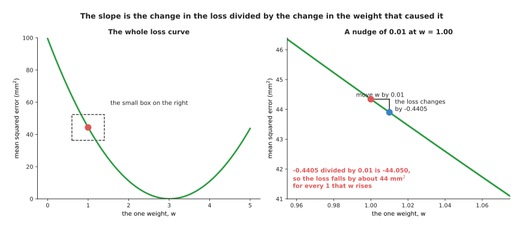

At w = 1.00 the loss is 44.3420 and at w = 1.01 it is 43.9015, so the change of
-0.4405 divided by the move of 0.01 gives -44.05.

That last number is what matters, because it says that near w = 1 the loss falls
by about 44 square millimetres for every 1 that the weight rises, so its sign
says which way is downhill and its size says how steeply.

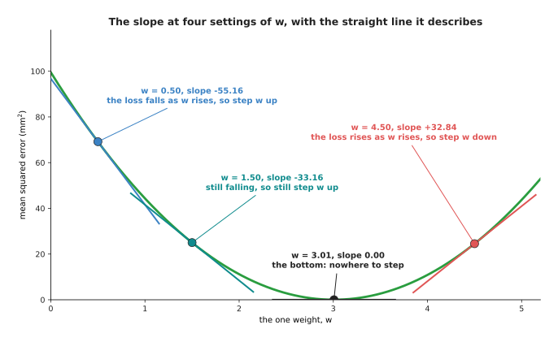

The slope is -55.16 at w = 0.50, -33.16 at 1.50, 0.00 at the bottom and +32.84
at 4.50.

Reading those four values in order gives the whole rule. At w = 0.50 the slope is
-55.16, so the loss is falling and the weight should go up. At w = 1.50 it is
still negative but smaller, -33.16, so the weight should still go up but there is
less to gain. At w = 3.01 the slope is 0.00, which is the bottom. At w = 4.50 it
is +32.84, so the loss now rises as the weight rises and the weight should come
down. The short straight lines through each point are what the slope describes,
because near the point the curve and that line are almost the same. The
measurement does depend on the size of the nudge, and too big a nudge measures
the wrong thing.

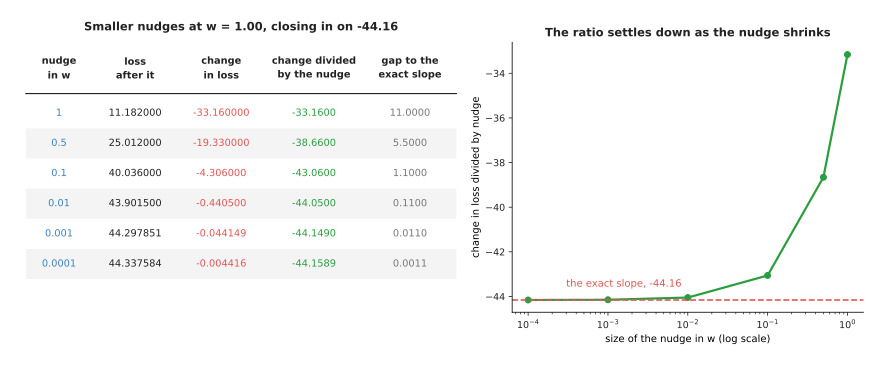

As the nudge shrinks from 1 to 0.0001 the measured ratio moves from -33.16 to
-44.1589, closing in on the exact slope of -44.16.

Read the table one row at a time: the size of the nudge, the loss after it, the
change in the loss, that change divided by the nudge, and how far the answer is
from the right one. A nudge of 1 gives -33.16, which is 11.00 out, a nudge of 0.1
gives -43.06, 1.10 out, and a nudge of 0.0001 gives -44.1589, 0.0011 out, so each
ten-fold shrink of the nudge cuts the error ten-fold.

That exact value has a name. The **derivative** of the loss with respect to a
weight is the number the measured ratio closes in on as the nudge is made smaller
and smaller, and it answers "if I move this weight a tiny bit, how much does the
loss change". The **gradient** is the collection of those derivatives, one for
each weight, so for this model it is a single number. Nobody measures these by
nudging, because a model with a million weights would need a million nudges per
step, and [backpropagation](03_backpropagation.md) explains the method that gets
all of them at once.

---

## 2. One step downhill, and the learning rate

A slope tells you which way to go and how steep it is, but not how far to walk,
and that is the one thing you have to choose. Gradient descent chooses by
multiplying: the move is the slope multiplied by a small number you pick, with
the sign turned round so the weight goes the opposite way to the slope. That
small number is the **learning rate**, and here it is 0.03.

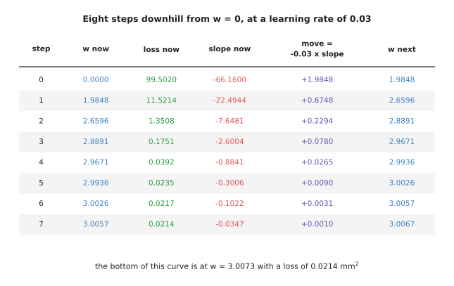

From w = 0 with a loss of 99.5020, eight steps at a learning rate of 0.03 reach
w = 3.0067 with a loss of 0.0214.

Read the table one row at a time, because each row is one step and its last
column is the next row's second column. At step 0 the weight is 0, the loss is
99.5020 and the slope is -66.1600, so the move is -0.03 multiplied by -66.1600,
which is +1.9848. At step 1 the slope has already shrunk to -22.4944, so the move
is only +0.6748, and by step 7 it is +0.0010, leaving the weight at 3.0067
against a bottom of 3.0073. The same arithmetic, run eight times, has taken the
model from useless to right.

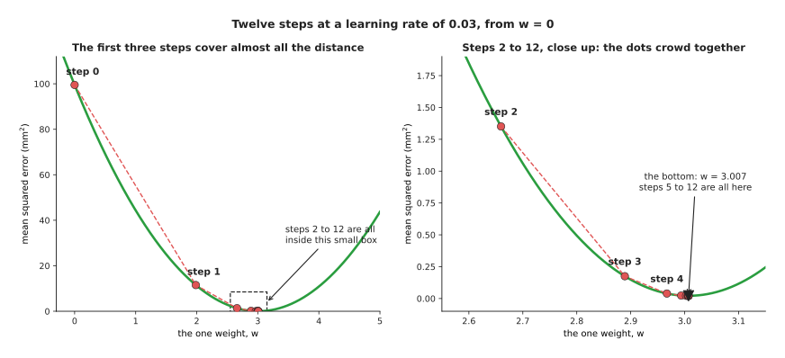

The first three steps cover almost the whole distance, and steps 2 to 12 all fall
inside a box only 0.6 wide.

Drawn on the curve, the dots start far apart, crowd together as they arrive, and
never overshoot.

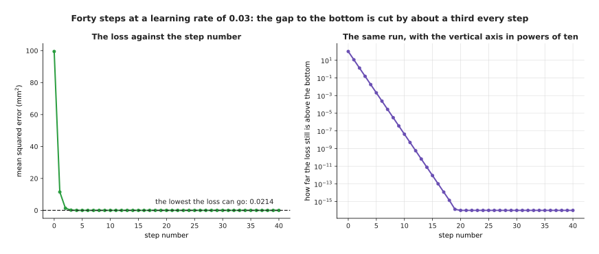

The loss falls from 99.5020 to 11.5214 after one step and 1.3508 after two, and
the gap to the bottom falls by about a third every step.

The left chart is the one a training run prints, and it has the shape every run
has: a steep fall and then a long flat stretch where nothing seems to be
happening. The right chart shows that something is still happening, because
drawing the gap above the bottom in powers of ten turns the curve into a straight
line. That gap is 99.5 at the start, 1.33 after two steps, 0.00205 after five and
0.0000000424 after ten.

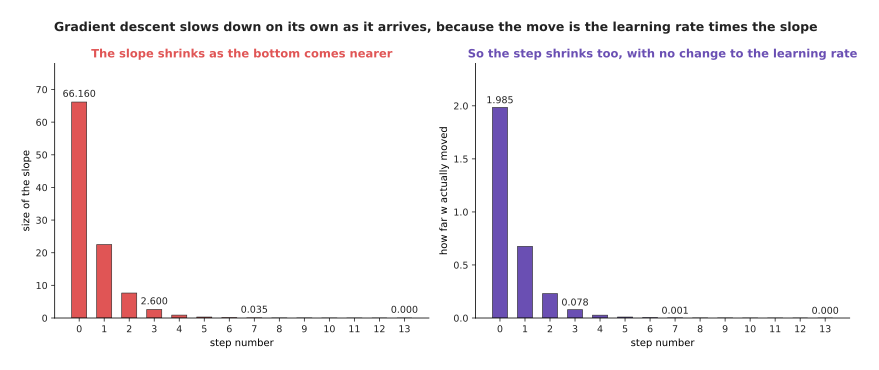

The slope shrinks from 66.160 at step 0 to 0.035 at step 7, so the move shrinks
from 1.985 to 0.001 although the learning rate never changes.

This is the quiet advantage of multiplying by the slope. The move at step 0 is
1,904 times the move at step 7 and nobody adjusted anything in between, because
the slope flattens as the bottom nears and the step flattens with it, while a
method that always moved a fixed distance would arrive and then jump straight
past, over and over.

---

## 3. Crawling, arriving and running away

The learning rate is now the only thing left to choose, and the same curve and
the same starting point give three completely different runs depending on the
number you pick.

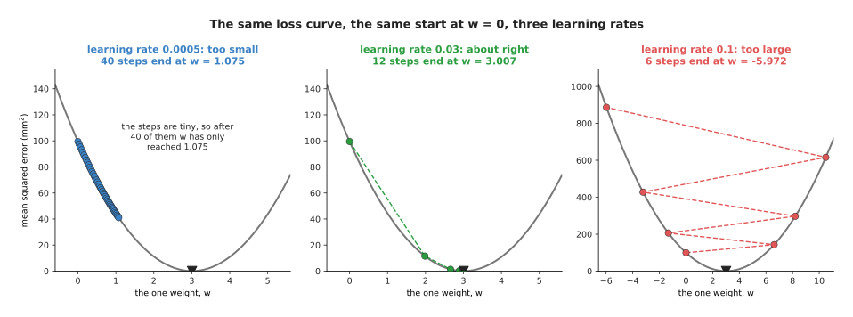

At 0.0005 forty steps reach only w = 1.075, at 0.03 twelve steps reach 3.007, and
at 0.1 six steps reach -5.972.

The left panel is a rate that is too small. The dots are packed almost on top of
each other, and after forty steps the weight has crawled from 0 to 1.075 with a
loss of 41.08, still most of the way up the side of the bowl. Nothing is wrong
with the run except that it needs hundreds more steps, and each step costs real
time on real hardware.

The right panel is a rate that is too large. Each step overshoots the bottom and
lands further up the opposite side than it started, so the next slope is steeper
and the next overshoot bigger, and after six steps the weight is at -5.972 with a
loss of 887.

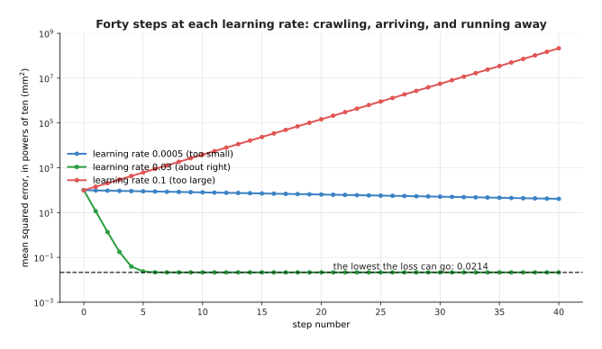

Over forty steps the loss at 0.0005 falls only from 99.5 to 41.08, at 0.03 it
reaches 0.0214 and stays, and at 0.1 it climbs to 215 million.

This chart is what you look at while a run is going, and the three shapes are
easy to recognise. A line sloping gently downwards and still far from flat means
the rate is too small, one that drops and then runs flat means it is about right,
and one that climbs means it is too large and needs stopping at once. For this
small model the point where the behaviour changes can be worked out exactly,
which is a luxury you will not have again.

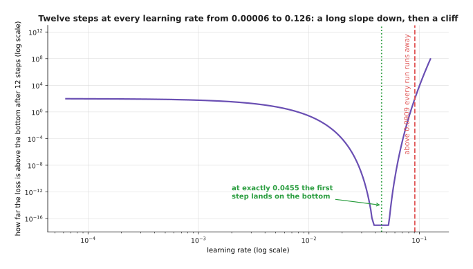

Twelve steps were run at every learning rate from 0.00006 to 0.126, and the run
is stable below 0.0909 and runs away above.

The curve has three parts. On the left it slopes gently down, because larger
rates get closer in twelve steps, and at 0.0005 the loss is still 76.31 while at
0.005 it is 6.09. In the middle a notch at 0.0455, which is 1 divided by 22,
marks the rate at which the first step from w = 0 lands on 3.0073 in one move. On
the right a cliff at 0.0909, which is 1 divided by 11, marks where every run
grows instead of shrinking, so at 0.0909 the loss after twelve steps is 99.03 and
at 0.1 it is 7,908.

The lesson is the shape rather than the numbers, because the slope down is gentle
while the cliff is sudden. Being three times too small costs time and being
slightly too large costs the run, which is why people choose a rate by trying a
few and taking one comfortably below the point where the loss starts climbing.
[The training loop](04_the-training-loop.md) describes the methods that change
the rate as the run goes on.

---

## 4. Two weights, a contour map and a real path

One weight is enough to see the method but not enough to see its main difficulty,
which appears once there is more than one weight to move at a time. So let the
model have two: it multiplies the camera height by a slope weight and adds an
offset weight. The loss now depends on two numbers, so the landscape is a surface
rather than a curve, and the usual way to draw a surface on paper is a contour
map, where each ring joins the settings that give the same loss.

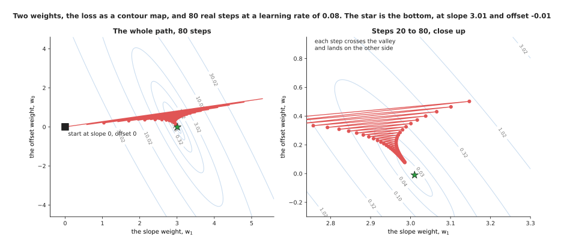

Eighty steps at a learning rate of 0.08 travel from slope 0 and offset 0 to slope
2.9855 and offset 0.0773, against a bottom at slope 3.0100 and offset -0.0100.

The rings are long thin ellipses rather than circles, which says the loss changes
quickly in one direction and slowly in another. The left panel shows the path
reaching the valley quickly and then creeping along it, and the close-up shows
what the creeping is, because each step crosses the valley and lands on the other
side. The gradient now has two numbers in it, one per weight, which together
point in the steepest downhill direction.

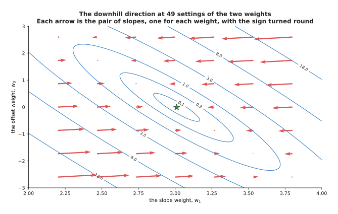

Each arrow is the pair of slopes with the sign turned round, and every arrow
crosses the contour lines at right angles.

Three of those arrows have their numbers printed by the script. At a slope of 2.4
and an offset of 2.0 the loss changes by -1.360 for each unit of slope and +0.360
for each unit of offset, so downhill is +1.360 and -0.360, while at a slope of
3.6 and an offset of -2.0 downhill is -1.040 and +0.440. At a slope of 3.0 and an
offset of 1.5 the loss changes by +8.840 and +2.960, and the arrow is much longer
because the point sits on a steep part of the surface. A step moves both weights
at once, each by its own slope multiplied by the same learning rate. The zig-zag
comes from the shape of the rings, which comes from the data.

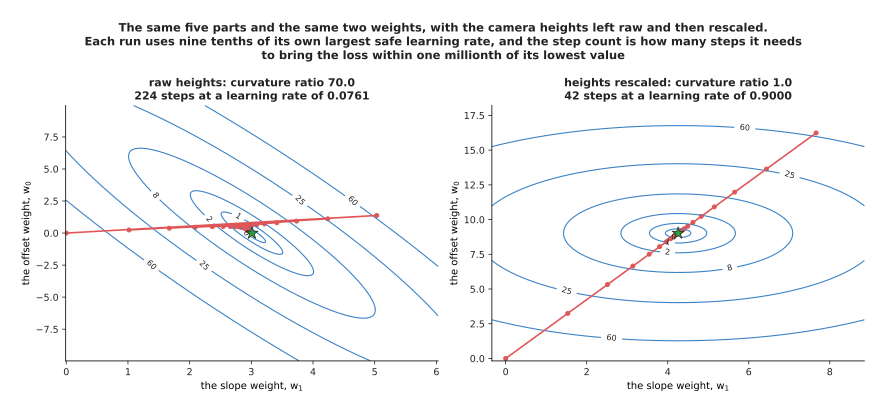

With the camera heights as they are the loss curves 70 times more steeply in one
direction than another and the run needs 224 steps, while rescaling them makes
the two directions equal and the run needs 42.

The number 70.0 is the ratio between the steepest and shallowest curvature of
this loss, 23.6619 and 0.3381, and it is what forces the zig-zag, because the
learning rate has to be small enough not to blow up in the steep direction and
the largest safe value here is 0.0845, far too small to make progress in the
shallow one. Subtracting the average height from every height and dividing by
their spread changes nothing about the problem and everything about its shape,
because both curvatures become 2.0, the largest safe learning rate becomes 1.0,
and the path runs straight at the bottom.

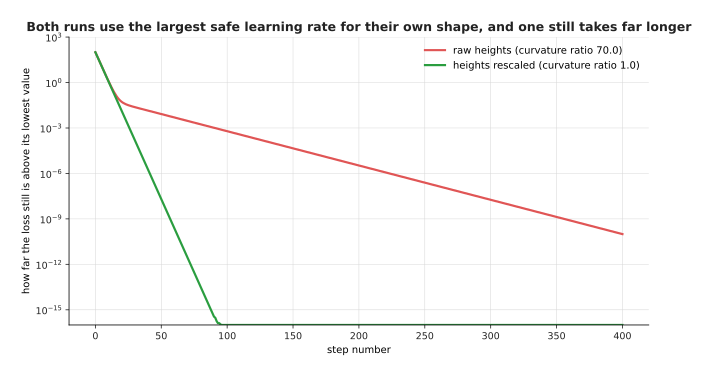

Both runs use nine tenths of their own largest safe rate, and after 50 steps the
raw run is 0.008255 above the bottom while the rescaled run is 0.00000002 above
it.

Both lines fall steadily and both would arrive in the end, but one arrives about
five times faster for the same arithmetic per step, which is why scaling the
inputs is the first thing anybody does to a dataset. [Normalisation and
stability](../04_making-training-work/02_normalisation-and-stability.md) covers
the layers that do the same thing inside a network.

---

## 5. Mini-batches, epochs and noisy steps

Everything so far has worked out the loss, and so the gradient, over every
example at once. That is fine for five parts and impossible for a real dataset,
because a step that reads a million pictures before moving the weights once means
a day of arithmetic, so the fix is to read only a handful each time.

A **mini-batch** is a small group of examples whose gradient is used for one step
as though it were the gradient of the whole dataset. Gradient descent run this
way is called **stochastic gradient descent**, where stochastic means chance is
involved, since which examples land in a batch is decided by shuffling. An
**epoch** is one pass through the whole dataset, so it holds as many steps as
there are batches in it.

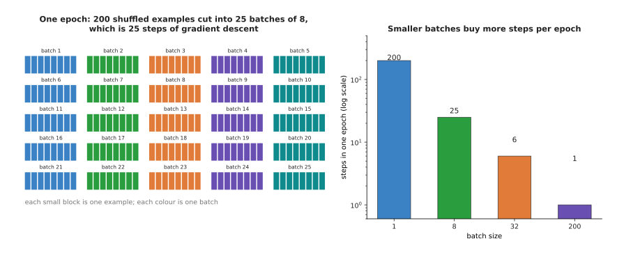

With 200 examples, one epoch gives 200 steps at a batch of 1, 25 at a batch of 8,
6 at a batch of 32 and 1 at a batch of 200.

The 200 examples used from here on are simulated, because a seeded random
generator drew the camera heights and made the travels from a straight line with
noise added. The picture makes the trade visible before any training happens,
since the same pass over the same data buys 200 steps or one depending only on
how it is cut up.

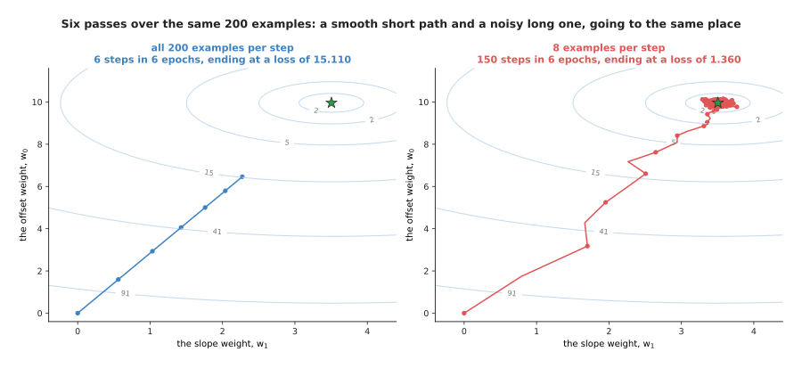

Six epochs give the full-batch run 6 steps, ending at a loss of 15.110, and the
batch-of-8 run 150 steps, ending at 1.360 against a best possible 1.350.

Both runs read the same 1,200 examples and did the same arithmetic, and the
mini-batch run arrived while the full-batch run was still on its way. Its path is
messy, because each step uses a gradient measured from only 8 examples and points
slightly the wrong way, but the errors go in different directions each time and
largely cancel over many steps, leaving a path that wanders to the bottom and
then jitters around it.

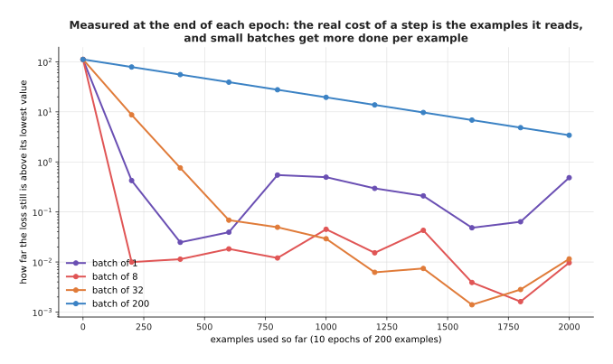

After one epoch of 200 examples the gap above the bottom is 0.4244 at a batch of
1, 0.0100 at a batch of 8, 8.7041 at a batch of 32 and 78.6749 at a batch of 200.

Measuring progress against examples read rather than steps taken is the honest
comparison, because reading an example is what costs time. The small batches win
easily early on, and the batch of 200 is still 3.41 above the bottom after ten
passes, while the batch of 1 got close fastest and then bounced, ending the tenth
epoch 0.4841 above the bottom, worse than at the end of the third. A batch of 8
or 32 is both quick and steady.

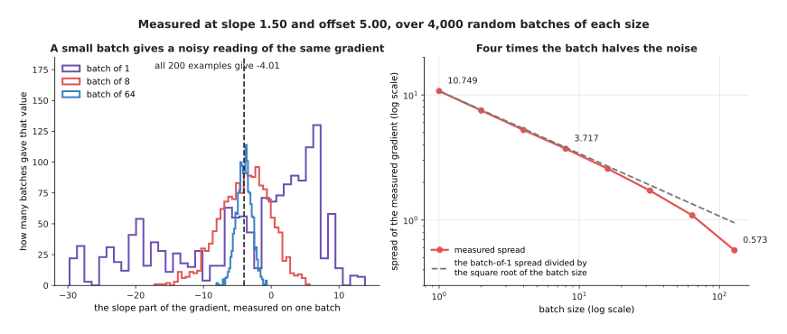

The spread falls from 10.749 at a batch of 1 to 3.717 at a batch of 8 and 0.573
at a batch of 128, while the all-200 value stays -4.01.

The histograms were made by taking 4,000 random batches of each size at one fixed
setting of the weights. Every batch size gives the right answer on average, which
is why the method works at all, but a single batch of 1 can give anything from
-30 to +14 while a batch of 64 stays close to -4. The spread roughly halves when
the batch is multiplied by four, and it falls a little faster at the right-hand
end only because a batch of 128 is most of the 200 examples.

That rule sets the trade. Making the batch four times larger costs four times the
arithmetic per step and buys only half the noise, so large batches waste work
while very small ones are cheap but wander. The usual answer is the largest batch
that fits comfortably in memory, and a little noise is not merely tolerated: it
helps, as the next section explains.

---

## 6. Local minima and saddle points

The runs so far all reached the bottom because the bowl had only one bottom, and
the worry everybody has is what happens when it does not. A **local minimum** is
a point lower than everything immediately around it but higher than the lowest
point on the whole landscape, and gradient descent, which only ever looks at the
ground under its feet, can settle in one and stay.

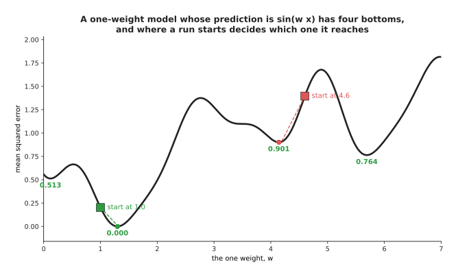

A run started at w = 1.0 lands at 1.300 with a loss of 0.0000, while a run
started at 4.6 lands at 4.142 with a loss of 0.9012.

This model is deliberately awkward, because its prediction is the sine of the
weight multiplied by the input, which makes the loss wavy rather than a bowl. It
has four bottoms in the range drawn, at w = 0.120, 1.300, 4.142 and 5.691, with
losses of 0.5127, 0.0000, 0.9012 and 0.7637. Only one is the real answer, and
which one a run finds is decided by where it started, so both runs behaved
perfectly and one is simply wrong. A second shape looks worse and behaves
better.

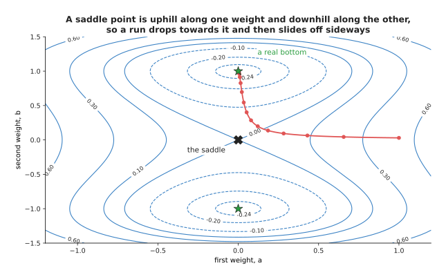

The run slows almost to a stop near the saddle at a loss of 0.0000 around step 20
and then falls away to a real bottom at -0.2500 by step 50.

A **saddle point** is a place where the slope is zero in every direction but the
loss goes up in some directions and down in others. The made-up loss here is
uphill along the first weight and downhill along the second, so the path drops
towards the middle, almost stops, and then slides off downhill. The loss is
0.0578 at step 10 and 0.0000 near step 20 before falling to -0.2494 by step 50,
and that long flat stretch is what makes people think their run has finished when
it has not. What saves real training is that a network has millions of weights
rather than two.

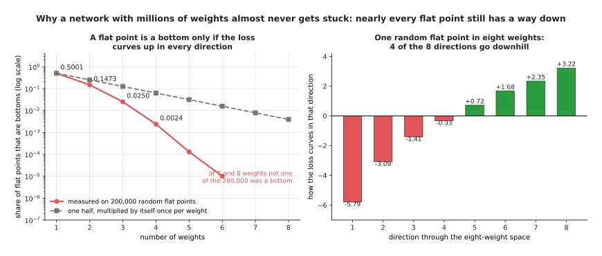

Of 200,000 random flat points, 50.0 per cent are bottoms with one weight, 2.50
per cent with three and 0.24 per cent with four, and none at all with seven.

A flat point is a real bottom only when the loss curves upwards in every single
direction, and it is a saddle if even one direction goes down. The left chart
measures that on random flat points: at one weight half are bottoms, at two
weights 14.7 per cent are, at four weights 0.24 per cent are, and at seven
weights not one of the 200,000 was. The dashed line is the rough estimate you get
by treating each direction as an even chance, and the measured share falls even
faster. The right chart shows one such point in eight weights, where four
directions curve upwards and four downwards, so it is a saddle. In a network with
a million weights a point that curves up in all million directions essentially
never happens by accident, so almost every flat place the run meets still has a
way down, and the noise from mini-batches helps it find one. That says saddles
are survivable, not that every run ends in the same place, so the last picture
asks what happens.

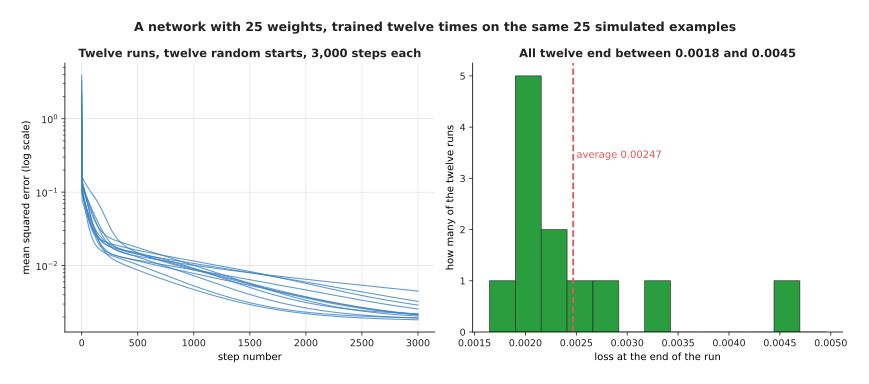

Twelve runs of the same network from twelve random starts end between 0.00183 and
0.00450, averaging 0.00247.

The network here has 25 weights, one hidden layer and 25 simulated examples, and
the twelve runs differ only in their random starting weights, which gave starting
losses from 0.2158 to 3.8985. They end within a factor of 2.46 of each other,
close enough that nobody worries about which one they got. This is what large
networks do, because there are enormous numbers of weight settings that all fit
the data about equally well. The worry about local minima turns out to be a worry
about small models, and the real problems of training a large one are in
[overfitting and
generalisation](../04_making-training-work/01_overfitting-and-generalisation.md)
instead.

---

## 7. Where to read next

- [Backpropagation](03_backpropagation.md) is the next page, and it explains how
  section 1's gradient is worked out for every weight of a real network at once.
- [The training loop](04_the-training-loop.md) replaces the plain step of section
  2 with the optimisers people actually use, and it covers changing the learning
  rate as the run goes on.
- [Normalisation and
  stability](../04_making-training-work/02_normalisation-and-stability.md) takes
  section 4's point about the shape of the valley and applies it inside the
  network.
- [Overfitting and
  generalisation](../04_making-training-work/01_overfitting-and-generalisation.md)
  explains why reaching the bottom of the training loss is not the same as having
  a model that works.
- [How a model learns](../../07_learned-models/01_what-models-are/02_how-a-model-learns.md)
  is the catalogue book's short account of the same loop, for somebody using a
  model rather than building one.
- [Fine-tuning](../../07_learned-models/10_making-models-work-on-an-arm/02_most-used/01_fine-tuning.md)
  runs gradient descent on a model somebody else trained, which is how most robot
  models are made.

---

## 8. Using it in Python

PyTorch does every part of this page for you, and the code below runs the
one-weight descent from section 2 so that you can check its numbers against the
table there.

```python
import torch

height = torch.tensor([1., 2., 3., 4., 5.])
travel = torch.tensor([3.1, 5.8, 9.2, 11.9, 15.1])

w = torch.zeros(1, requires_grad=True)     # section 2 starts at w = 0
optimiser = torch.optim.SGD([w], lr=0.03)  # section 2's learning rate

for step in range(8):
    loss = ((w * height - travel) ** 2).mean()   # the page-before loss
    optimiser.zero_grad()    # throw away last step's gradient
    loss.backward()          # section 1's slope, for every weight at once
    print(step, round(w.item(), 4), round(loss.item(), 4), round(w.grad.item(), 4))
    optimiser.step()         # w = w - 0.03 * slope

# 0 0.0 99.502 -66.16
# 1 1.9848 11.5214 -22.4944
# 2 2.6596 1.3508 -7.6481
# 3 2.8891 0.1751 -2.6004
# ... after 8 steps w is 3.0067, against a bottom at 3.0073
```

Three lines of that loop are the whole method. `loss.backward()` works out the
slope of the loss with respect to every weight and leaves it in `w.grad`, which
is section 1's measurement done properly rather than by nudging.
`optimiser.step()` subtracts the learning rate multiplied by that slope from
every weight, which is section 2's single line of arithmetic.
`optimiser.zero_grad()` clears the slopes first, and it is needed because PyTorch
adds each new gradient to whatever is already stored, so leaving it out makes the
run behave as though the learning rate were growing.

Section 5's mini-batches are not in this code because the dataset has five
examples, but they need no new ideas: you wrap the data in a `DataLoader` with a
`batch_size` and loop over it, and each time round the same three calls run on
one batch. One pass through that loader is one epoch.

What the library does not decide is the learning rate, which section 3 showed is
the difference between a run that arrives and a run that explodes, nor the batch
size, which section 5 showed trades arithmetic against noise, nor whether your
inputs are scaled, which section 4 showed can cost a factor of five for nothing.
`torch.optim.SGD` is the plain method on this page, and the optimisers most
people reach for instead are on [the training
loop](04_the-training-loop.md) page.
