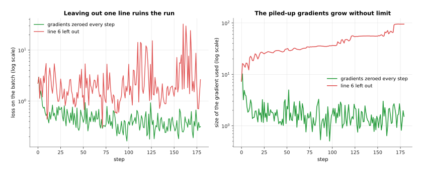
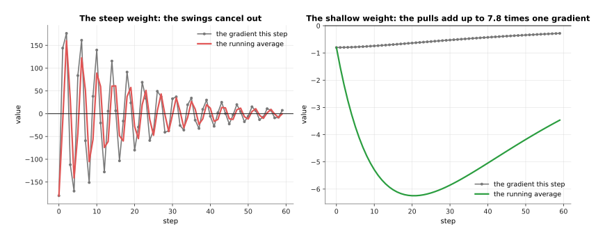
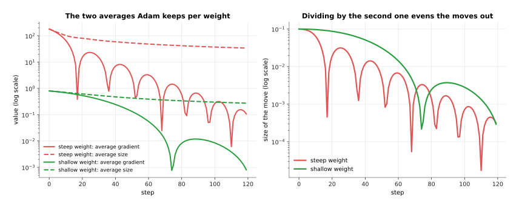
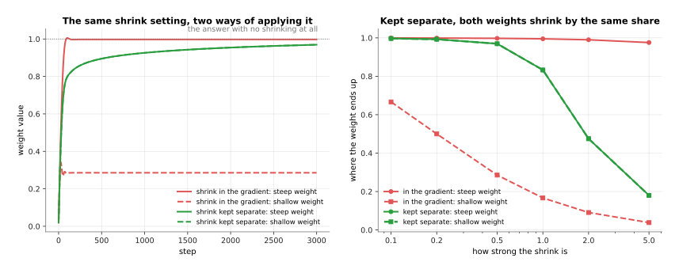
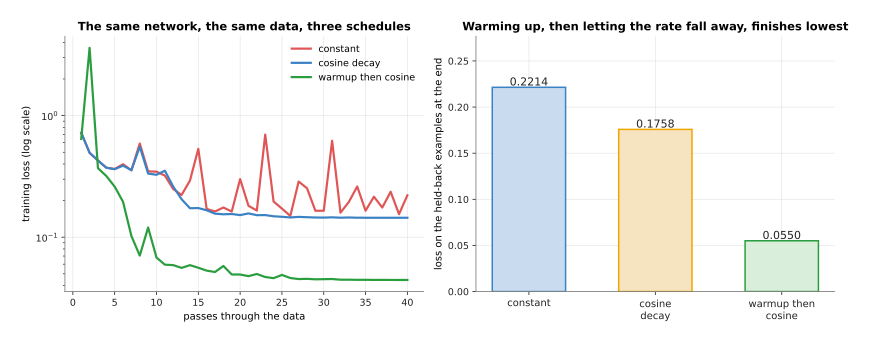
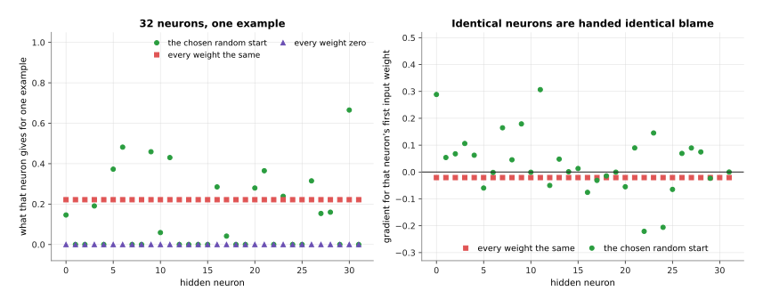
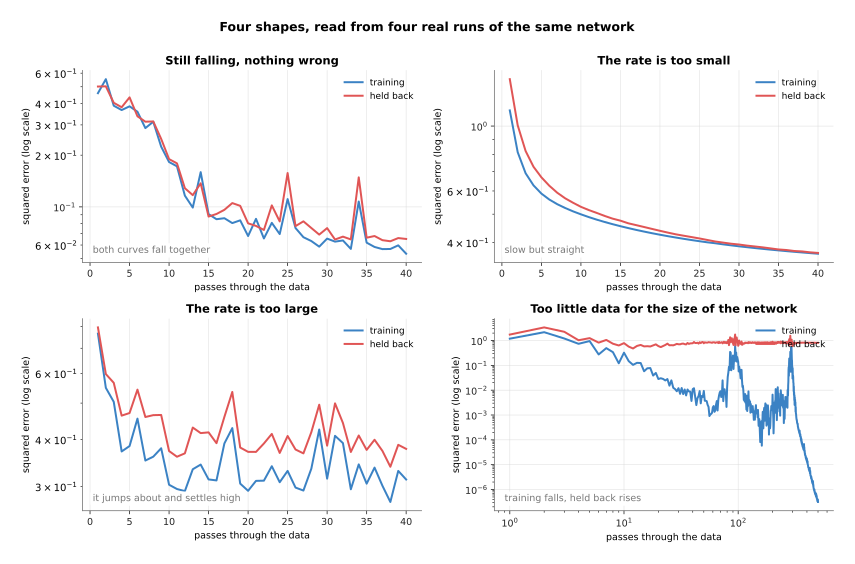
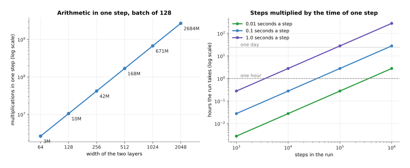

# The training loop

The page before this one, [backpropagation](03_backpropagation.md), finished
with a tiny network, a loss of 0.7396, nine gradients and one step that brought
the loss down to 0.1929. That is one step on one example, and a real training
run is that step repeated hundreds of thousands of times over a whole dataset,
inside a loop that also has to decide how big each step should be, when to make
the steps smaller, where the weights started, and what to save so that a run
which stops can be started again.

This page is that loop. It writes the loop out in the order a computer runs it
and explains each line, then replaces the simple step of the page before with
the rule almost everyone actually uses, which keeps a running average of the
gradients instead of trusting the latest one. After that it covers the three
decisions made around the loop rather than inside it, which are how the
learning rate changes over the run, what the weights are set to before the
first step, and how you read the curve that comes out.

It is for a reader who has read the three pages before it in this chapter, so
it assumes the loss from [the score of being
wrong](01_the-score-of-being-wrong.md), the gradient, the learning rate, the
mini-batch and the epoch from [gradient descent](02_gradient-descent.md), and
the forward and backward passes from [backpropagation](03_backpropagation.md).
The maths stays at multiplying, adding and keeping a running average, which is
the average of the recent values of something, weighted so that the newest
count most. Every number comes from a real run of a small network written in
NumPy on simulated data, and the script that drew the pictures prints each
one.

## Contents

1. [The loop, in the order the code runs](#1-the-loop-in-the-order-the-code-runs)
2. [Momentum, which is a running average of the gradient](#2-momentum-which-is-a-running-average-of-the-gradient)
3. [Adam, and why AdamW keeps the shrinking separate](#3-adam-and-why-adamw-keeps-the-shrinking-separate)
4. [Learning-rate schedules and warmup](#4-learning-rate-schedules-and-warmup)
5. [Where the weights start](#5-where-the-weights-start)
6. [Reading the curve, the time a run takes, and the checkpoint](#6-reading-the-curve-the-time-a-run-takes-and-the-checkpoint)
7. [Where to read next](#7-where-to-read-next)
8. [Using it in Python](#8-using-it-in-python)

---

## 1. The loop, in the order the code runs

Everything the three pages before this one explained happens inside seven
lines, and those seven lines run in the same order every time, so the first
thing to do is to write them down.


The seven lines are take the next batch, forward pass, loss, backward pass, step, set the gradients back to zero, and go back to line 1, with two more things done at the end of each pass through the data.

Line 1 takes the next batch, which is a small group of examples drawn from the
training set in a shuffled order, as explained in [gradient
descent](02_gradient-descent.md). Line 2 is the forward pass, which works out
what the network says for every example in that batch at once. Line 3 averages
those examples' losses into one number, and line 4 is the backward pass, which
gives one gradient for every weight.

Line 5 is the step, and the thing that takes it is called the **optimiser**,
which is the rule that turns gradients into changes to the weights. On the page
before, the optimiser was the simplest one there is, which subtracts the
learning rate multiplied by the gradient, and the next two sections replace it
with something better.

Line 6 sets every gradient back to zero, and it exists because frameworks add
each backward pass into the gradient that is already stored rather than
replacing it. That behaviour is useful when you want to join several small
batches into one large one, and it is a disaster when you forget it, which is
why the picture below shows what forgetting looks like.



With the gradients zeroed every step the loss after six passes is 0.3464, and with line 6 left out it is 3.162, because the gradient being used has grown from 7.361 to 94.9 instead of settling near 1.523.

Line 7 goes back to the start, and the loop runs until the training set is
used up, which is one epoch. The counting is worth doing once by hand, because
the number of steps in a run is the only thing that sets how long it takes.


A training set of 960 examples in batches of 32 gives 30 steps in one pass through the data, so 20 passes are 600 steps and the network is shown 19,200 examples in all, each of the 960 exactly 20 times.

At the end of each pass two more things happen, and both are in green in the
first picture. The loss is worked out on a set of examples that the loop never
trains on, which is the held-back set, and the weights are written to a file.
The next chapter explains the held-back set properly in [overfitting and
generalisation](../04_making-training-work/01_overfitting-and-generalisation.md),
and section 6 of this page explains the file.

One warning about the loss you see go past. The loss on line 3 is the loss of
one batch of 32 examples, not of the training set, so it jumps about from step
to step even when the run is going perfectly.


In the first pass the batch losses run from 2.242 down to 0.349 and back up again, while the average over the 30 batches of a pass falls steadily from 0.699 to 0.229.

The jumping comes from the batch, because 32 examples drawn at random are
sometimes easier than average and sometimes harder, so the average over a whole
pass is the number worth watching. That is why training curves are almost
always drawn with one point per pass rather than one per step.

---

## 2. Momentum, which is a running average of the gradient

Line 5 of that loop was the simplest possible optimiser, and this section
replaces it, because the simple rule wastes most of its steps on a problem that
every real network has. The problem is that the loss is far steeper in some
directions than in others. The picture below uses a loss with only two weights
so that the whole thing can be drawn, and the loss cares about one of them a
thousand times more than the other.


Both runs use the same learning rate of 0.009, which is the largest the plain rule survives here, and after 200 steps the plain rule has crawled from -4.0 to -2.7948 along the valley while momentum has reached -0.0560.

The plain rule is stuck because one learning rate has to serve both directions.
It must be small enough that the steep direction does not overshoot, and once
it is that small it moves the shallow direction almost not at all, so the run
spends its time crossing the valley rather than going down it.

**Momentum** fixes this by keeping a running average of the gradients instead
of using the newest one. The rule has two lines: the average is set to 0.9
times the old average plus the new gradient, and then the weights move by the
learning rate multiplied by that average. The number 0.9 is the only setting,
and it says how much of the past is kept.



In the shallow direction the gradient stays near -0.80 every step and the average grows to -6.24, which is 7.8 times one gradient, while in the steep direction the gradient swings between -180.00 and +176.40 and the average never grows past 180.00.

That is the whole trick in one picture. In a direction where the gradient keeps
pointing the same way, the average grows and the steps get longer, so the run
speeds up. In a direction where the gradient flips sign every step, the
positive and negative values land on top of each other in the average and
cancel, so the steps stay short and the zigzag is damped.


Momentum brings the loss below 0.01 in 125 steps, and the plain rule has still not reached it after 400 steps, where it sits at 0.380.

Momentum costs one extra number stored for every weight, so it needs as much
memory again as the weights themselves. The obvious alternative is to raise the
learning rate instead, but that is exactly what the steep direction forbids, so
paying for one more number per weight is the better deal.

---

## 3. Adam, and why AdamW keeps the shrinking separate

Momentum made the steps longer where the gradient was steady, but it still
multiplies every weight's gradient by the same learning rate, and the last
section's valley was built so that one gradient was 225 times larger than the
other. The next idea is to give every weight its own step size, worked out from
that weight's own gradients.

The rule that does this is called **Adam**, from adaptive moment estimation,
and it keeps two running averages for each weight rather than one. The first is
the same average of the gradient that momentum keeps. The second is an average
of the gradient multiplied by itself, which ignores the sign and so measures
how big that weight's gradients usually are. The step is then the first average
divided by the square root of the second.



At step 10 Adam divides by 107.617 for the steep weight and by 0.713 for the shallow one, so two gradients that started 225 times apart give moves of -0.0720 and -0.0973, which are within a factor of 0.74 of each other.

Dividing by the usual size of a weight's gradient is what buys the per-weight
step size. A weight whose gradients are large gets a small step, a weight whose
gradients are tiny gets a large one, and the learning rate stops meaning a
distance and starts meaning roughly how far any weight may move in one step.
That is why one learning rate often works across very different networks, and
it is the main reason Adam is the default almost everywhere.


After 200 steps on the same problem the plain rule has reached a loss of 7.811e-01, momentum 3.138e-04, and Adam 2.050e-08.

What Adam costs is two stored numbers per weight instead of one, so the
optimiser's state is twice the size of the model, which is the 0.10 gigabytes
in the memory picture of [backpropagation](03_backpropagation.md#4-automatic-differentiation-and-what-it-costs-in-memory).
It also has two settings for how long the two averages remember, usually 0.9
and 0.999, and a small number added to the square root so that nothing is
divided by zero.

There is one more piece, and it is the difference between Adam and the version
almost everyone now uses. Training often includes **weight decay**, which
shrinks every weight slightly towards zero at every step, because weights that
stay small tend to give a network that works better on examples it has not
seen. The old way of doing it was to add a term to the gradient, and with Adam
that goes wrong, because the added term is then divided by the square root of
the second average along with everything else.



With the shrinking added to the gradient, a setting of 0.5 leaves the steep weight at 0.9975 but drags the shallow weight down to 0.2857, and with the shrinking kept separate both end at 0.9695.

Read the left panel as two weights that should both settle at 1.0. Adding the
shrink to the gradient means a weight with large gradients barely feels it,
because its division is large, while a weight with small gradients is pulled
almost to nothing, so one setting does two completely different things in the
same network. **AdamW** is Adam with the shrinking taken out of the gradient
and applied directly to the weight after the step, and the right panel shows
the result: every weight keeps the same share of itself, whatever its gradients
look like, so the setting means one thing. That is the whole difference, and it
is why AdamW rather than Adam is what modern models are trained with.

---

## 4. Learning-rate schedules and warmup

The last two sections changed how the gradient becomes a step, and this one
changes the learning rate itself, which neither of them touched. Keeping it at
one value for a whole run is the obvious thing to do and it is not the best
thing to do, because what you want early and what you want late are different.
A plan for changing the learning rate as the run goes along is called a
**schedule**.


All three schedules start from a rate of 0.2, the constant one stays there, the cosine one is at 0.1000 halfway and 0.00000 at the end, and the third spends its first 60 steps climbing from 0.0033 before following the same curve down.

The falling shape is called cosine decay, after the curve it follows, and its
reason is that a large rate early covers ground quickly while a small rate late
lets the weights settle instead of bouncing around the bottom. The rising part
at the start is called **warmup**, and it exists because the first few steps
are the most dangerous in the whole run, for reasons the next section
explains.



On the same network and the same data, a constant rate of 0.2 ends with a held-back loss of 0.2214, cosine decay ends at 0.1758, and warmup followed by cosine decay ends at 0.0550.

The constant run is the spiky red line, and the spikes are the point: a rate
that is large enough to make progress early is too large to sit still at the
end, so that run never settles. Decay removes the spikes late, and warmup
removes them early, and together they give a run that is four times better than
the constant one on the same number of steps.

Warmup earns its place most clearly when the rate is too large to start with at
all.


A flat learning rate of 0.4 makes the loss stop being a number at step 8, while the same 0.4 reached through 60 warmup steps trains normally and ends at a held-back loss of 0.0770.

The obvious alternative to warmup is to use a rate that is safe from the first
step, which here would be 0.2, and that run is the blue line, which also works.
What warmup buys is that you may use rates that would otherwise be impossible,
and that matters most for large models, where a bigger rate is worth a lot and
the first steps are the ones most likely to destroy the run. What it costs is
one more setting to choose, which is how many steps the warmup lasts.

---

## 5. Where the weights start

Warmup protects the first steps, and this section is about what those first
steps start from, because a network's weights have to hold some value before
the first forward pass can run. Choosing those values is called
**initialisation**, and the rule is that they are random but not arbitrary.

The random part is not an accident of laziness, and the picture below shows
what happens without it.



With every weight set to zero all 32 hidden neurons give 0.0, and with every weight set to the same value they all give 0.2217 and are all handed exactly the same gradient of -0.02067.

Setting every weight to zero kills the network outright, because each hidden
neuron gives 0, the output never depends on any hidden weight, and every hidden
gradient is 0 for ever. Setting every weight to the same non-zero value is only
slightly better, because neurons that start identical are handed identical
gradients, take identical steps and stay identical, so a layer of 32 of them
does exactly as much as one neuron would. Random values break that tie, and
that is their entire job.

The not-arbitrary part is the size of those random values, which decides the
size of the numbers running through the network on the very first batch.


Starting weights that are much too small give hidden numbers of 0.063 and a first loss of 0.837, the chosen scale gives 0.892 and 2.93, and weights that are much too large give 3.78 and a first loss of 8491.

The chosen scale here is 0.707, and it is not a guess. It is worked out from
the number of inputs a neuron has, so that the numbers coming out of a layer
are about the same size as the numbers going in, which is the same balance that
[backpropagation](03_backpropagation.md#5-when-the-chain-of-multiplications-goes-wrong)
showed holding the blame level on the way back. Every framework has this built
in, so you get it without asking.


The all-zero start sits at 0.9607 for the whole run, which is exactly the loss you get by always guessing the average of the targets, the all-the-same start reaches only 0.8006, and the much too large start is no longer a number at all.

Two of those five lines deserve an honest word. The much too large start does
not merely train badly, because a first gradient of 2970 throws the weights far
enough that the loss stops being a number, which is the exploding gradient of
the page before happening on step one. The much too small start, on the other
hand, trains perfectly well here and ends at 0.1802 against the chosen scale's
0.1891, and that is not a mistake: this network has one hidden layer, so there
is nothing for a small scale to shrink away through. Give it fifty layers and
the small start is the red line from the page before, which arrives with
nothing left.

---

## 6. Reading the curve, the time a run takes, and the checkpoint

Everything so far was a decision made before the run starts, and this last
section is about the run itself, which produces one picture you have to be able
to read. It is the loss drawn against the passes through the data, with one
line for the training examples and one for the held-back ones.


The training loss falls all the way from 1.191 to 0.00000, while the held-back loss reaches its lowest point of 0.480 at pass 12 and then climbs back to 0.813 by pass 500.

That gap opening is the single most important shape in training, and the run
that drew it was set up to make it obvious, with a training set cut down to 24
examples and a network far too large for them. The training loss keeps falling
because the network is learning those 24 examples by heart, and the held-back
loss rises because knowing them by heart is of no use on anything else. Where
the two lines part company is where a run stops being worth continuing, which
is the subject of the next
chapter's [overfitting and
generalisation](../04_making-training-work/01_overfitting-and-generalisation.md).

Three other shapes come up often enough to be worth recognising on sight.



A good rate of 0.1 takes the training loss from 0.459 to 0.0534 with both lines together, a rate of 0.002 is still at 0.366 after 40 passes and still falling, and a rate of 0.22 spikes to 97 on single batches and settles at 0.313.

Read them in that order. Two lines falling together and flattening means
nothing is wrong and the run may simply need more passes. A slow, smooth,
straight fall means the learning rate is too small, so the run would get there
eventually, which is a waste of time rather than a failure. A line that jumps
about and settles high means the rate is too large, and that is told apart from
the fourth shape by the held-back line, which jumps about in one and climbs
steadily in the other.

How long any of this takes is the number of steps multiplied by the time of one
step, and the time of one step is set by how much arithmetic it is.



One step over a batch of 128 is 2,621,440 multiplications at width 64 and 2,684,354,560 at width 2048, because doubling the width makes one step four times as much arithmetic.

The right panel is how to answer the question for your own run, and the honest
answer is that you time one step and multiply. At a tenth of a second a step,
10,000 steps take 0.28 hours and 1,000,000 steps take 27.78 hours, and at a
whole second a step those same runs take 2.78 and 277.78 hours. Small models
finish in minutes, the fine-tuning runs most people do take hours, and the
largest models are trained for weeks on many machines at once, so a run you
cannot afford to lose is a normal thing to have.

That is what the last line of section 1 was for. A **checkpoint** is a file
holding the weights as they stood at some point in the run, and it is written
at the end of each pass so that a run which stops for any reason can be
continued rather than started again.


A two-layer network of width 1024 has 2,099,200 weights, which is 8.40 megabytes on their own and 25.19 megabytes once the optimiser's two running averages are saved beside them.

The difference between those two bars is the difference between the two jobs a
checkpoint does. If you only want to use the model the weights are all you
need, and if you want to carry the run on from where it stopped you also need
the optimiser state from section 3, which is two more numbers for every weight
and so three times the file.

---

## 7. Where to read next

- [Overfitting and generalisation](../04_making-training-work/01_overfitting-and-generalisation.md)
  is the next page, and it takes up the gap in section 6's curve: what
  memorising is, how the held-back set is built, and when to stop.
- [Normalisation and stability](../04_making-training-work/02_normalisation-and-stability.md)
  explains the loss spikes of section 4 and the layer-by-layer rescaling that
  makes large runs survive.
- [Backpropagation](03_backpropagation.md) is the page before this one, and it
  is where line 4 of the loop comes from.
- [Scale, data and compute](../07_pretraining-and-adapting/02_scale-data-and-compute.md)
  takes section 6's arithmetic up to the size of real training runs, and
  explains what a graphics processing unit does with it.
- [Fine-tuning](../../07_learned-models/10_making-models-work-on-an-arm/02_most-used/01_fine-tuning.md)
  in the catalogue book is this loop applied to a real robot model, with the
  settings people actually use.

---

## 8. Using it in Python

Section 1 wrote the loop out in seven lines, and in PyTorch those seven lines
are seven lines. This is the whole of this page in one block, with the
optimiser of section 3, the schedule of section 4 and the checkpoint of section
6 in their proper places.

```python
import torch
from torch import nn

model = nn.Sequential(nn.Linear(4, 32), nn.ReLU(), nn.Linear(32, 1))
opt = torch.optim.AdamW(model.parameters(), lr=0.01, weight_decay=0.01)  # section 3
steps_per_epoch, epochs = 30, 20                                         # section 1
warm = torch.optim.lr_scheduler.LinearLR(opt, 0.01, 1.0, total_iters=60)
cos = torch.optim.lr_scheduler.CosineAnnealingLR(opt, T_max=540)
sched = torch.optim.lr_scheduler.SequentialLR(opt, [warm, cos], [60])    # section 4

for epoch in range(epochs):
    for x, y in loader:                 # line 1: loader hands out batches of 32
        out = model(x)                  # line 2: the forward pass
        loss = ((out[:, 0] - y) ** 2).mean()   # line 3: the loss for this batch
        loss.backward()                 # line 4: the backward pass
        opt.step()                      # line 5: the optimiser moves every weight
        opt.zero_grad()                 # line 6: or the next batch adds to these
        sched.step()                    # line 7 follows: on to the next batch
    torch.save({'model': model.state_dict(),
                'opt': opt.state_dict()}, f'checkpoint-{epoch}.pt')      # section 6
```

The library gives you the optimiser, the schedule and the saving. `AdamW` holds
the two running averages of section 3 for every weight and applies the weight
decay separately, and `Adam` is the same class with the older behaviour that
section 3 advised against. The two schedulers joined by `SequentialLR` are the
warmup and the cosine decay of section 4, which is why `total_iters=60` and
`T_max=540` add up to the 600 steps of section 1, and the starting weights of
section 5 are already chosen sensibly inside `nn.Linear`.

What you still have to decide is the learning rate, which no library can pick
for you, and the batch size, which sets both the memory and how noisy each
step's gradient is. You decide how long the warmup lasts and how many steps the
whole run has, and `T_max` has to match the second of those or the rate will
reach zero at the wrong time. You also decide what goes in the checkpoint, and
the code above saves both the model and the optimiser state, which is the
larger of the two bars in the last picture and the one that lets a stopped run
carry on.

One last thing: the loop above has no evaluation in it beyond the loss it
trains on, and no real run is like that. The held-back loss of section 6
belongs at the end of each epoch, inside `with torch.no_grad():` so that no
tape is kept, and the next chapter is about what you do with the number it
gives you.
