# Overfitting and generalisation

The page before this one, [the training loop](../03_how-training-works/04_the-training-loop.md),
put the whole of training into a single loop and showed the loss falling step
after step until the curve flattened out. That falling curve is what everybody
watches while a run is going, and it is also what most often misleads them,
because the number on it is measured on the very examples the model is being
trained on, and a model with enough weights can drive it down to almost nothing
by learning those particular examples one by one, without learning anything that
holds for an example it has not seen.

So this page answers one question. How do you tell a model that has learned the
pattern from a model that has only memorised the answers? The short answer is to
keep some examples back and watch the error on those instead, and the rest of the
page is needed because keeping examples back is easy to do wrongly and because
each way of pushing a model towards learning costs you something.

The page assumes you know what a [loss](../03_how-training-works/01_the-score-of-being-wrong.md)
is, what a [gradient descent step](../03_how-training-works/02_gradient-descent.md)
does, and what the [weights and layers](../02_inside-a-network/02_layers-and-depth.md)
of a network are. It also assumes you have met the word
[generalisation](../01_what-learning-means/02_the-words-everyone-uses.md), which
means doing well on examples that were not used in training, since that is the
only thing anybody wants from a model.

Everything in the pictures was run by
`docs/diagrams/making_training_work.py`, which prints every number quoted here.
The data is simulated by a seeded generator, but the methods run on it are the
real ones.

## Contents

1. [The loss went down, but did the model learn anything](#1-the-loss-went-down-but-did-the-model-learn-anything)
2. [Three sets of examples, and what each one is for](#2-three-sets-of-examples-and-what-each-one-is-for)
3. [Leakage: when the split tells you a lie](#3-leakage-when-the-split-tells-you-a-lie)
4. [Three ways to hold a model back](#4-three-ways-to-hold-a-model-back)
5. [Augmentation: more examples from the ones you have](#5-augmentation-more-examples-from-the-ones-you-have)
6. [Where the classical picture runs out](#6-where-the-classical-picture-runs-out)
7. [Where to read next](#7-where-to-read-next)
8. [Using it in Python](#8-using-it-in-python)

---

## 1. The loss went down, but did the model learn anything

The training loop gave us a falling loss, so the first thing to do is to build
a case where we know the right answer and can watch that falling loss lie to us.
An arm slides a sensor along a curved part, and at each position the sensor gives
a reading. The true relation between the two is a smooth curve, and the sensor
adds noise with a spread of 0.35, so no model can do better than 0.35 on new
readings. We train on 12 noisy measurements and keep 50 back.

A **polynomial** is a sum of powers of the input, so degree 1 is a straight
line, degree 2 bends once, and degree 11 has twelve freely chosen numbers in it,
exactly as many as we have training points. Raising the degree is the simplest
way to make a model more flexible, which stands in for making a network wider or
deeper.

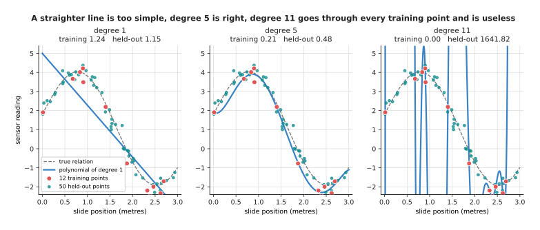

The degree 1 fit is a straight line that misses the shape of the curve, the degree 5 fit follows it closely, and the degree 11 fit passes through all 12 training points and swings far away from the true curve in between them.

The degree 1 line scores 1.24 on training and 1.15 on held-out data, so it is
bad on both, and a model too simple to capture the pattern is said to
**underfit**. The degree 11 fit scores a perfect 0.0000 on training and 1641.82
on held-out data, which is worse than guessing, and a model that does far better
on its training examples than on new ones is said to **overfit**.

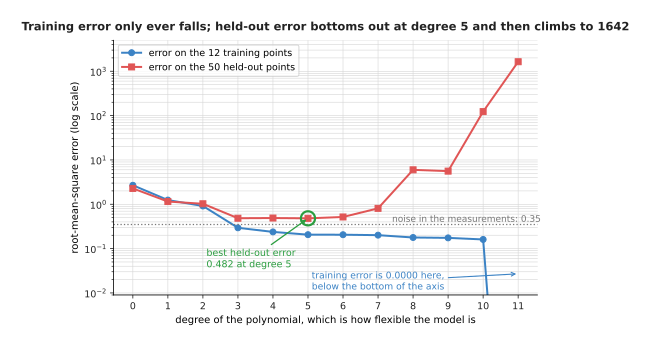

Training error falls at every single degree while held-out error reaches its lowest point of 0.482 at degree 5 and then climbs by a factor of more than three thousand.

The important part is that the training error keeps improving from degree 5
onwards while the held-out error gets worse, so it cannot be used to choose the
degree at all. The same happens with a network, and this one has one input, two
hidden layers of 96 units, and 9,601 weights and biases, which is about 800 free
numbers for each of the 12 training points.

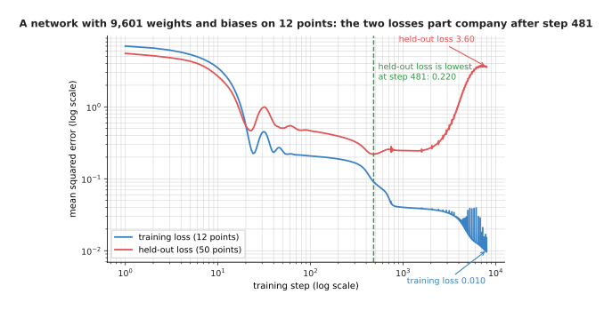

The two losses part company after a few hundred steps: training reaches 0.0096 by step 8,000 while held-out climbs from its best value of 0.2204 to 3.6261.

For the first 481 steps the network is learning the shape of the curve, so
both losses fall. After that the training loss keeps falling because the network
is bending itself to fit the noise in those 12 particular readings, and since
the held-out readings carry different noise, every bend makes the held-out loss
worse until it is 16.5 times worse than at step 481, with nothing on the
training curve to show it.

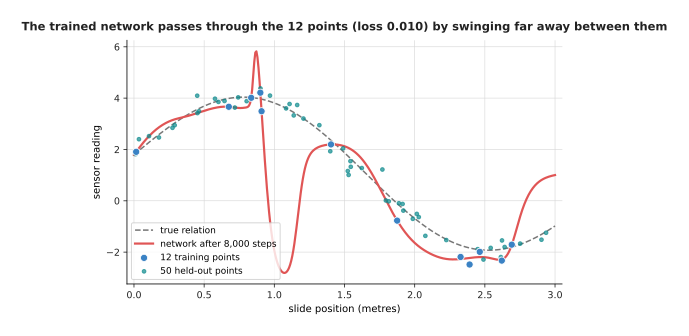

The network has bent itself into a shape that visits all 12 training points and has nothing to do with the true curve anywhere else.

The shape of that red curve is what memorising looks like, because the network
has not found a wrong pattern but no pattern at all, and has instead stored
twelve answers and joined them up with whatever shape the weights allowed. So
the first thing to get right is how the held-back examples are chosen and
used.

---

## 2. Three sets of examples, and what each one is for

Section 1 kept 50 examples back to show the problem, which is already most of
the method, but real work needs three sets rather than two, because held-back
examples get used for two jobs that spoil each other. The first job is choosing,
as when section 1 had to pick a degree by trying several and keeping the one with
the lowest held-out error. The second is reporting, which means saying how well
the finished model will do on work it has never seen. If the same examples do
both jobs then the number you report is the number you chose on, and that is
always better than the truth.

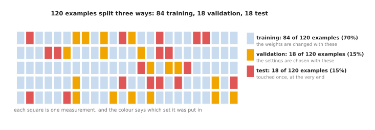

Each square is one of 120 measurements, and 84 go into the training set, 18 into the validation set and 18 into the test set.

The **training set** is the only set whose examples ever change a weight, and
it is the largest because the model learns from it. The **validation set** is
read many times, once for each choice you make: how flexible the model should
be, how long to train it, how strong to make each method in section 4. Its
examples never change a weight directly but they do change the settings, so the
model ends up shaped by them indirectly. The **test set** is read once, after
every choice is final, and its number is the one you report.

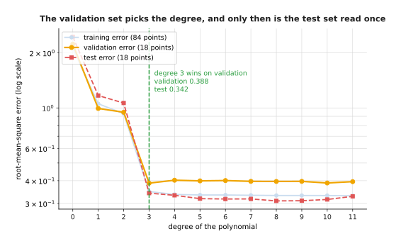

The validation set picks degree 3, whose validation error is 0.388, and the test set is then read once and gives 0.342 for that same model.

The validation set preferred degree 3 over degree 10 by only 0.0007, so a
different 18 examples would have chosen differently, and small validation sets
making noisy choices is the honest cost of keeping most of your data for
training.

Now for why reusing the test set ruins it. Suppose you have several finished
candidates, perhaps saved copies from one run, and they are all equally good,
each really succeeding on 70 attempts out of 100. You test each with 20 real
attempts on the arm and keep the winner.

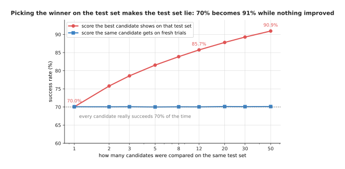

Picking the best of 50 equally good candidates on a 20-trial test set makes the winner look like a 90.9% model, while fresh trials with that same winner give 70.1%.

With one candidate the measured score averages 70.0%, with 12 it averages
85.7%, and with 50 it averages 90.9%, while the winner's true rate never moves
off 70%. Nothing improved, and the test set simply handed its own good luck to
whichever candidate caught it, which is why it is read once. Reading it once is still not enough,
though, because a split can be wrong before anybody reads it.

---

## 3. Leakage: when the split tells you a lie

Section 2 assumed that putting an example in the test set keeps the model away
from it, and on a robot that assumption is often false. **Leakage** means that
something about the held-back examples reached the model during training, so
they are not really new and the score they give is too good. It is the most
common reason a model that scored 95% in testing then fails on the arm, and its
worst form comes from how robot data is recorded.

A robot records continuously, so a teleoperated arm picking up a mug produces
video at perhaps 30 frames a second, and frames 40 and 41 of one pick are almost
the same picture. Pool the frames, split them at random, and frame 40 goes into
training while frame 41 goes into testing.

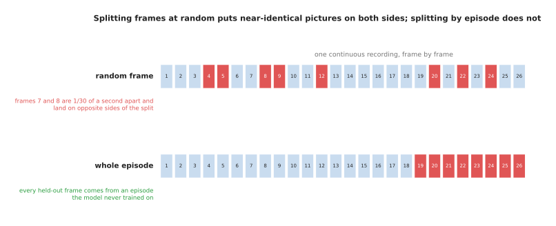

Splitting frames at random leaves nearly identical pictures on both sides of the split, while splitting whole episodes keeps them together.

In the simulated frames used here each episode is 40 frames long, and the
distance from one frame to the next inside an episode is 0.1372 against 2.6048 to
the nearest frame of any other episode, nineteen times further. So a model that answers a new frame by finding the most similar frame it
trained on will find the neighbour from the same episode, copy its answer, and be
right every time without having learned a thing.

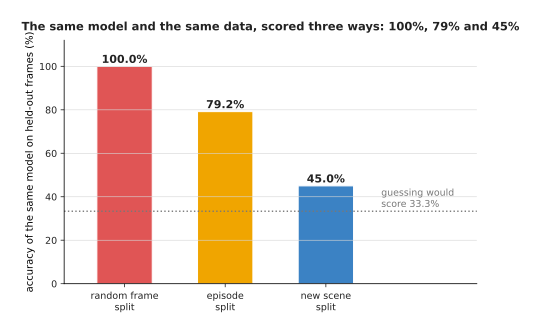

The same model on the same data scores 100.0%, 79.2% and 45.0% depending only on how the examples were divided, and guessing would score 33.3%.

Those three numbers come from one model and one set of 1,080 frames. With a
random frame split it is perfect, which is a lie. Split by whole episode it gets
79.2%, which honestly answers "how will it do on a new attempt in a room it has
seen", and with a whole scene held back it gets 45.0%, which answers "how will it
do in a room it has never seen", usually the question you care about.

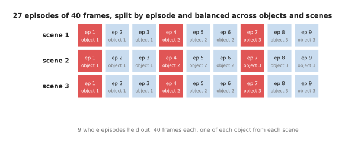

Nine whole episodes are held out, one of each object from each scene, so every held-out frame comes from an attempt the model never trained on.

The repair is to split along the seam that matters, and the seam is whatever
unit you want to generalise across: by episode to work on new attempts, by scene
to work in a new room, by object type to work with a part the model has not been
shown. In practice that means keeping a label on every example saying which
episode, scene and object it came from, and splitting on that label rather than
on the example.

Leakage has quieter forms, all from letting information cross the split, as
when you work out the average and spread of your features over the whole dataset
so that the test examples contribute to numbers the model uses. The question to
ask of any split is always what the model could read off the test examples that
it already saw in training, and once the answer is nothing the measurement can be
trusted to say whether the model is overfitting.

---

## 4. Three ways to hold a model back

Sections 2 and 3 give an honest measurement, and the next question is what to
do when it says the model is overfitting. The general name for anything that
pushes a model towards learning the pattern instead of memorising the examples
is **regularisation**, and the three cheapest kinds all work by making it harder
for the model to fit the training examples exactly, which sounds like a strange
goal until you remember that fitting them exactly is what went wrong.

The first costs nothing. **Early stopping** means watching the validation loss
while training, keeping a copy of the weights whenever it reaches a new low, and
using that copy rather than the weights you end with.

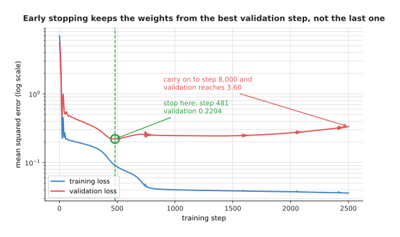

Early stopping keeps the weights from step 481, where the validation loss was 0.2204, instead of the weights from step 8,000, where it was 3.6261.

You do not stop the moment the validation loss ticks upwards, because it
wobbles, so you wait a fixed number of scores for a new low before giving up, and
that number is called the patience. The cost is the time spent pausing training
to score the validation set.

The second method changes the network during training. **Dropout** means
choosing, at every training step and at random, some fraction of the units in a
layer and setting their outputs to zero for that step. That fraction is written p
and usually runs from 0.1 to 0.5.

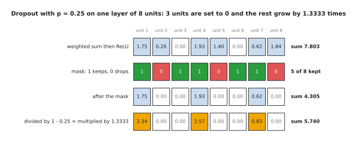

Three of the eight units are set to zero by the mask, and the five that survive are each multiplied by 1.3333, which is one divided by 1 minus 0.25.

The activations coming in are 1.75, 0.26, 0.00, 1.93, 1.40, 0.00, 0.62 and
1.84, where the two zeros were already zero because the rectified linear unit in
front of them had a negative input. This step's mask drops units 2, 5 and 8,
throwing away the 1.40 on unit 5 and the 1.84 on unit 8, so the layer sum falls
from 7.8033 to 4.3050, which is far too small, and every surviving activation is
then divided by 1 minus p to bring the sum back to 5.7400.

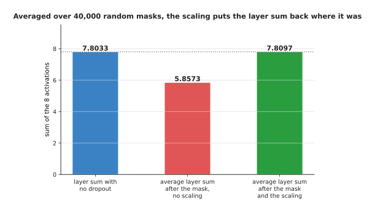

Over 40,000 random masks the masked sum averages 5.8573, which is 75% of the true 7.8033, and the 1.3333 scaling brings that average to 7.8097.

The scaling matters because the next layer has to see numbers of the usual
size, and although it cannot get that right for every mask it does on average,
which is why dropout costs nothing at prediction time, when the masks are
switched off and every unit is used. What it buys is that no single unit can be
relied on, since any unit may be absent on any step, so a layer must spread its
answer across several units rather than build one fragile chain. What it costs is
slower training, and it helps today's very large models less than the mid-sized
ones it was invented for.

The third method pulls on the weights directly. **Weight decay** subtracts a
small multiple of each weight from itself at every step, on top of the gradient
step, so every weight is dragged towards zero and stays large only if the
gradient keeps pushing it out.

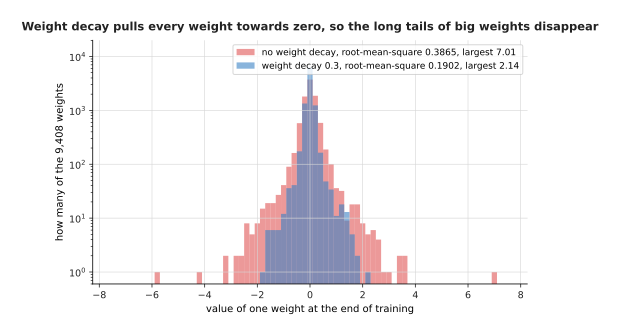

Without decay the 9,601 weights have a root-mean-square of 0.3869 and the largest reaches 7.18, while with a decay of 0.3 the root-mean-square is 0.1908 and the largest reaches 2.13.

Smaller weights make the network's output a gentler function of its input, and
a gentler function cannot swing between the training points the way section 1's
red curve did, but it can be overdone, because a network whose weights are all
forced near zero cannot represent anything.

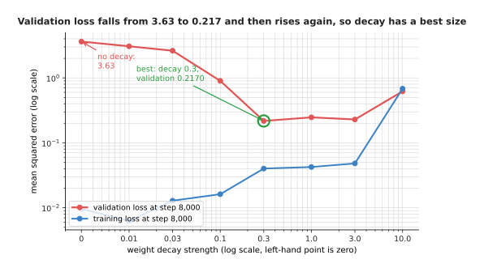

Held-out loss falls from 3.6261 to 0.2170 as the decay rises to 0.3 and then climbs back to 0.6205, so the decay strength is one more setting to choose on the validation set.

Why these three rather than the obvious alternative of using a smaller model?
A smaller model does cut overfitting, and section 1's degree 5 fit is exactly
that answer, but it also has a lower ceiling, so you give up doing better once
you collect more data and must retrain from scratch to change your mind. These
three leave the model its full size and limit only how much of it gets used,
each controlled by one number you can tune without rebuilding anything. The cost
is that each adds a setting to choose, and every setting chosen on the validation
set wears that set out a little, in the way section 2 described. All three
weaken the model, and the next section does the opposite.

---

## 5. Augmentation: more examples from the ones you have

The methods in section 4 all weaken the model, and this one works the other
way, by strengthening the data. **Augmentation** means making new training
examples out of the ones you have, by changing each example in a way that leaves
its correct answer unchanged, and a model that sees ten thousand versions of your
two hundred pictures cannot memorise them one by one.

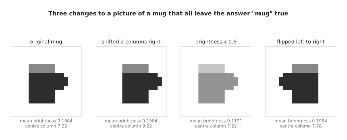

Shifting the mug moves its centre column from 7.22 to 9.22, dimming drops the mean brightness from 0.1984 to 0.1191, and flipping leaves both the brightness and the answer "mug" alone.

Each of those three is safe for a reason you can state. Shifting is safe
because the camera could have been mounted two centimetres to the left, dimming
is safe because somebody could have turned a light down, and flipping is safe for
a mug because a mug with its handle on the left is still a mug. The flip really
did change the picture, since the lean, meaning the brightness on the right minus
the brightness on the left, went from -5.60 to +5.60. That last reason is the one
that fails, and on a robot it fails often.

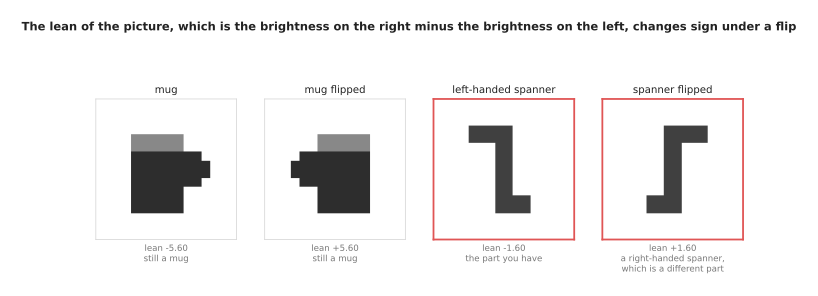

The flip changes the spanner's lean from -1.60 to +1.60 in exactly the way it changes the mug's, but for the spanner that change turns one real part into a different real part.

A left-handed spanner and a right-handed one are different items with different
part numbers, so a flipped picture of one labelled as the other is a wrong
example, and the model will learn from it that handedness does not matter. The same trap catches any job where left and right
mean something, such as a screw thread or printed text, and above all the arm's
own movements, because a flipped picture paired with unflipped joint angles is a
lie about which way the arm went.

The honest way to decide is to ask, for each change, what real thing in the
world would have produced it and whether the answer would still be the same if it
had. Changing colour is safe until colour is what tells two parts apart, and
adding noise is safe for almost everything, which is why nearly every pipeline
uses it.

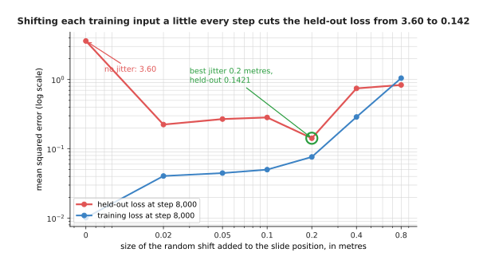

Adding a random shift of 0.2 metres to the slide position at every training step cuts the held-out loss from 3.6261 to 0.1397, which is better than any weight decay strength managed.

That result is worth dwelling on, because the crudest augmentation imaginable
beat every setting of weight decay. Augmentation tells the model something true
about the world, namely that the reading at 1.40 metres and the reading at 1.45
metres should be about the same, and no amount of weight shrinking can tell it
that. The cost is the same as everywhere else, because a
shift of 0.8 metres is a lie, readings half a metre apart really being different,
and the held-out loss rises to 0.8337 when you tell it. All of this follows one
picture of how model size and error are related, and that picture is not the
whole story.

---

## 6. Where the classical picture runs out

The shape that section 1 drew, where held-out error falls and then rises for
good, was the settled teaching of the subject for about forty years, and it is
still right for a small model on a small dataset, which is most robot work.

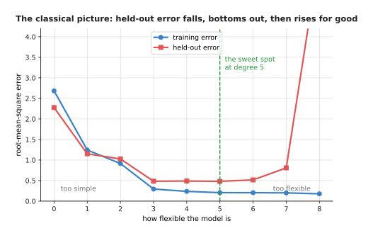

The classical picture says that held-out error falls while the model is too simple, reaches a best value at some middle flexibility, and then rises for good as the model becomes flexible enough to fit the noise.

Now watch what happens past the point where that picture says to stop. The
models below are networks whose first layer is fixed at random and whose second
layer is fitted exactly, so they can be worked out without any training loop,
and their width, meaning how many units the hidden layer has, runs from 1 to
1,200 against 60 training examples.

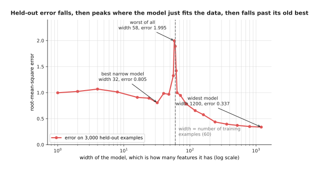

Held-out error falls to 0.806 at a width of 32, peaks at 1.995 near a width of 60, and then falls again all the way to 0.338, which is less than half the best error any narrow model reached.

The error falls, rises to a peak, and then falls again past its old best,
which is why this is called **double descent**. The peak sits exactly where the
model first becomes able to pass through every training point.

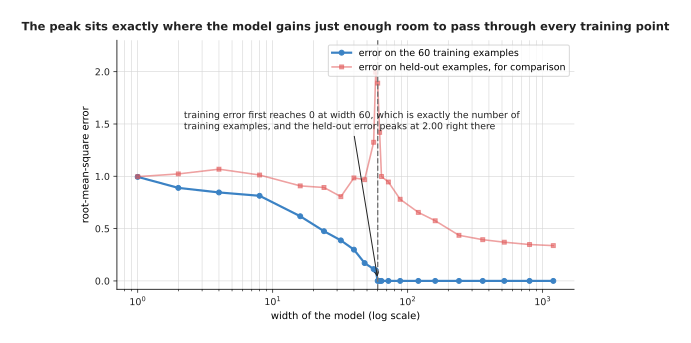

Training error first reaches zero at a width of 60, which is exactly the number of training examples, and that is the width at which the held-out error is worst.

At a width of 60 there is exactly one way to pass through all 60 points, and
that one way is forced to be a wild shape, like section 1's red curve. Past 60
there are many ways, and fitting by least squares picks the gentlest of them, so
the fit improves the more choice it has. This is the honest reason the biggest
models of today keep improving as they are made larger, where the classical
picture predicts they should be useless, and it is why large-model practice looks
odd from the textbook: training continues long past the point where the training
loss is tiny, dropout is often left out, and the run is sized by the data and
arithmetic available rather than by a validation curve turning upwards.

None of this lets you off sections 2 to 5, because double descent needs far
more model than data together with a method that quietly prefers gentle
solutions, and a few hundred demonstrations against a model of a few hundred
million weights lands you near the peak rather than past it. So "the model is
too big" is a claim to check with a measurement rather than a rule.

---

## 7. Where to read next

- [Normalisation and stability](02_normalisation-and-stability.md) is the next
  page, and it deals with the other half of making training work, which is
  keeping the numbers inside the network in a range the arithmetic can handle.
- [Running and evaluating a model](../13_using-a-model-for-real/01_running-and-evaluating-a-model.md)
  takes section 2's honest number to real trials.
- [Scale, data and compute](../07_pretraining-and-adapting/02_scale-data-and-compute.md)
  says how much data a model of a given size needs, the other side of section
  6's peak.
- [Fine-tuning and adapters](../07_pretraining-and-adapting/03_fine-tuning-and-adapters.md)
  is where overfitting bites hardest, because a fine-tune often has only a few
  dozen demonstrations.
- [Evaluation and failure](../../07_learned-models/10_making-models-work-on-an-arm/02_most-used/03_evaluation-and-failure.md)
  is the catalogue page for testing a model on a real arm.
- [Where the data comes from](../../07_learned-models/01_what-models-are/05_where-the-data-comes-from.md)
  describes how robot datasets are collected, which decides where the seams
  are.

---

## 8. Using it in Python

Sections 2, 3 and 4 are each one or two lines of real code, and the point here
is that the library gives you the mechanism while you keep every decision.

```python
import numpy as np
import torch
from torch import nn

# Section 3: the split is by episode, never by frame. 24 episodes of 40 frames,
# and 6 whole episodes are held back, which is 240 frames.
episode = np.repeat(np.arange(24), 40)
held = np.random.default_rng(0).permutation(24)[:6]
is_held = np.isin(episode, held)
print(is_held.sum(), (~is_held).sum())          # 240 720

# Section 4: dropout is a layer, and weight decay is one argument.
model = nn.Sequential(
    nn.Linear(8, 96), nn.ReLU(), nn.Dropout(p=0.25),
    nn.Linear(96, 96), nn.ReLU(), nn.Dropout(p=0.25),
    nn.Linear(96, 1),
)
opt = torch.optim.AdamW(model.parameters(), lr=2e-3, weight_decay=0.3)

# Section 4: dropout zeroes some units and scales the rest by 1/(1-p),
# and it switches itself off for prediction.
drop = nn.Dropout(p=0.25)
drop.train(); print(drop(torch.ones(1, 8)))     # zeros and 1.3333s
drop.eval();  print(drop(torch.ones(1, 8)))     # all ones

# Section 4: early stopping, four lines around the loop you already have.
best, best_weights, waited = float('inf'), None, 0
for step in range(8000):
    train_one_step(model, opt)                  # your loop from the last page
    if step % 50 == 0:
        score = validation_loss(model)
        if score < best:
            best, waited = score, 0
            best_weights = {k: v.clone() for k, v in model.state_dict().items()}
        else:
            waited += 1
            if waited == 20:                    # the patience
                break
model.load_state_dict(best_weights)
```

The library does three things for you. It applies the dropout mask and the
1.3333 scaling and turns both off when you call `model.eval()`, which is the
thing people most often forget and the reason a model can look worse in testing
than in training. It applies weight decay inside the optimiser rather than by
adding a term to the loss, which is what the W in AdamW means. And `state_dict`
and `load_state_dict` make keeping and restoring the best weights two lines.

What you still have to decide is everything that matters. The library has no
idea that your frames came from episodes, so the split is yours to get right, and
`sklearn.model_selection.GroupShuffleSplit` will do it only once you tell it what
the groups are. It has no opinion on p, on the decay strength, on the patience,
or on which layers get dropout, and section 4 showed those numbers moving the
held-out loss by factors of ten. And no library will stop you reading the test
set twice, so the discipline in section 2 is yours alone.
