# Normalisation and stability

The page before this one, [overfitting and
generalisation](01_overfitting-and-generalisation.md), was about whether the
model learned the right thing, and it took for granted that the training run
finished at all. This page is about the other half of making training work,
which is keeping the numbers inside the network in a range where the arithmetic
behaves. A run can fail because the loss never comes down even though nothing is
wrong with the model, or because it comes down for a day and then jumps and
stays up, and both failures come from the sizes of numbers rather than from the
choice of model.

So this page answers four questions. Why does a feature measured in millimetres
beside one measured in metres make training almost impossible? What do the
normalisation layers inside a modern network calculate? Why is the normalisation
placed where it is, around the running total a stack of blocks keeps? And what
goes wrong when the numbers are held in half the usual number of bits, which
every large run does today for speed?

The page assumes you know what a
[gradient](../03_how-training-works/03_backpropagation.md) is, what a
[learning rate](../03_how-training-works/02_gradient-descent.md) does, and what
a [residual connection](../02_inside-a-network/02_layers-and-depth.md) is. It
also uses the words float32, float16 and bfloat16, which
[the shape of the numbers](../02_inside-a-network/03_the-shape-of-the-numbers.md)
introduced as the formats a number can be stored in.

Everything in the pictures was worked out by
`docs/diagrams/making_training_work.py`, which prints every number quoted here,
on data simulated by a seeded generator.

## Contents

1. [Why the numbers need keeping in range](#1-why-the-numbers-need-keeping-in-range)
2. [Layer normalisation and root-mean-square normalisation](#2-layer-normalisation-and-root-mean-square-normalisation)
3. [Why batch normalisation lost ground](#3-why-batch-normalisation-lost-ground)
4. [The residual stream, and where the normalisation sits](#4-the-residual-stream-and-where-the-normalisation-sits)
5. [Mixed precision: which numbers stay large](#5-mixed-precision-which-numbers-stay-large)
6. [Loss spikes, and what people do about one](#6-loss-spikes-and-what-people-do-about-one)
7. [Where to read next](#7-where-to-read-next)
8. [Using it in Python](#8-using-it-in-python)

---

## 1. Why the numbers need keeping in range

The simplest version of the problem does not need a network at all. We want to
predict how long a reaching move takes from two numbers about it: how far the arm
reaches, written down in millimetres, and how high it lifts, written down in
metres. Both are sensible measurements, and nobody thought about units when they
were recorded.

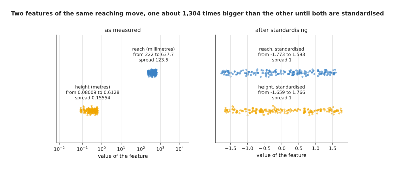

The reach runs from 222 to 637.7 with a spread of 123.5, and the height runs from 0.08009 to 0.6128 with a spread of 0.15554, so one feature is about 1,304 times bigger than the other.

Each feature gets one weight, and the loss is the usual squared error. The
gradient on a weight is proportional to the size of the feature it multiplies, so
the weight on reach gets a gradient about 794 times bigger than the one on
height, and a single learning rate has to serve both.

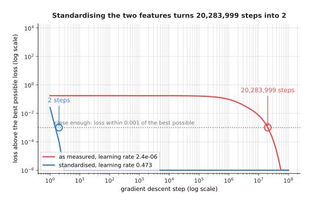

Standardising the two features gets the loss within 0.001 of the best possible in 2 steps, while leaving them in millimetres and metres takes 20,283,999 steps for the same thing.

That is a factor of about ten million, and it is not a badly chosen learning
rate, because each run uses half the largest rate that is stable for its own
problem, which is the usual safe choice. Gradient descent on a squared-error loss
can be worked out in closed form, so the script does that and checks the formula
against a real loop, and both give a loss of 0.174332 above the best possible
after 2,000 steps.

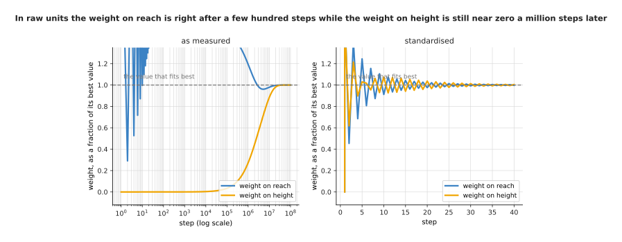

In raw units the weight on height has not moved off zero after a million steps and both weights only settle near ten million, while after standardising both arrive within five steps.

So the slowness is one weight moving at the wrong speed rather than everything
being sluggish. **Normalisation** is the general name for any step that rescales
numbers into a known range, and the simplest kind, called standardising,
subtracts a feature's average and divides by its spread, so every feature
arrives with an average near 0 and a spread near 1.

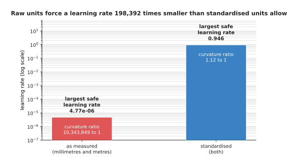

Raw units force a learning rate of at most 0.00000477 while standardised units allow 0.946, which is 198,392 times larger.

The reason is the shape of the loss. In raw units the curvature of the loss
differs by a factor of 10,343,849 between its steepest and flattest directions,
and the learning rate must be small enough for the steepest one or the run
explodes, which leaves it far too small for the flattest. After standardising
that ratio is 1.12, so one learning rate suits every direction. Two warnings go
with this. The average and spread must come from the training set alone and then
be applied to the other sets, because using all the data lets the test examples
[leak in](01_overfitting-and-generalisation.md#3-leakage-when-the-split-tells-you-a-lie).
And the outputs need the same treatment, because a robot's joint angles in
radians and gripper opening in millimetres are just as mismatched. Scaling the
inputs once is only the start, because the numbers deeper in the network drift as
the weights change.

---

## 2. Layer normalisation and root-mean-square normalisation

Section 1 scaled the inputs once, before training, and that fixes the first
layer only, because the layers after it take the activations of the layer below
and those drift as the weights change. So modern networks repeat a normalisation
step inside the network at every block, and the one almost every language model
and vision transformer uses works on one example at a time.

**Layer normalisation** takes the vector of numbers belonging to one example at
one place in the network, subtracts their average, divides by their spread, and
then multiplies by a learned scale and adds a learned shift. Here it is on a
real vector of six numbers.

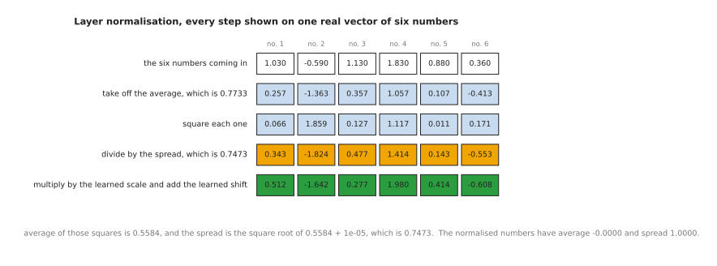

The six numbers average 0.7733, their squared deviations average 0.5584, the spread is the square root of that plus a tiny guard giving 0.7473, and dividing by it leaves numbers with average 0.0000 and spread 1.0000.

Follow one of them through. The third number is 1.13, subtracting the average
0.7733 gives 0.3567, and dividing by the spread 0.7473 gives 0.4773, after which
the learned scale for that position, 1.00, and the learned shift, -0.20, turn it
into 0.2773. The guard added before the square root, written 1e-05 and called
epsilon, keeps a vector of six identical numbers from dividing by zero. The
learned scale and shift matter because without them every vector would be forced
to average 0 with spread 1, and with them the network can undo the normalisation
wherever that helps, so normalisation changes how easy the numbers are to train
with rather than what the network can represent.

**Root-mean-square normalisation**, usually written RMS normalisation, does less
work. It leaves the average alone, divides by the root-mean-square of the
numbers instead of by their spread, and has a learned scale but no learned shift.

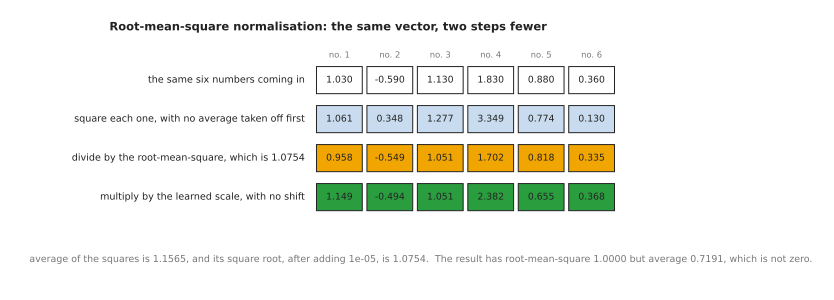

The squares of the six numbers average 1.1565, the square root of that is 1.0754, and dividing by it leaves numbers whose root-mean-square is 1.0000 but whose average is 0.7191 rather than zero.

Again follow the third number. It stays at 1.13 because there is no average to
take off, and dividing by 1.0754 gives 1.0508, which the learned scale of 1.00
leaves alone. So RMS normalisation does one pass over the vector where layer
normalisation does two, which is why it is faster.

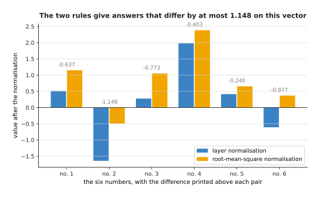

The two rules give different answers on this vector, differing by up to 1.1482, because RMS normalisation leaves the average of 0.7191 in place where layer normalisation removes it.

Why RMS normalisation rather than layer normalisation, then, when it clearly
does something different? Because measurements on real networks found that
removing the average made almost no difference to the final quality, while the
saving in time and memory is real at every block of a large model. What it costs
is that a vector whose average has drifted far from zero stays that way, and the
network has to live with it.

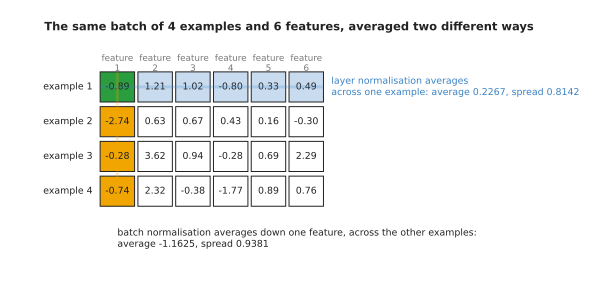

Layer normalisation averages across one example, giving 0.2267 with a spread of 0.8142 for the first example, while batch normalisation averages down one feature across the other examples, giving -1.1625 with a spread of 0.9381.

That last picture holds the whole difference between the normalisation modern
networks use and the one they replaced, and the next section is about why it
matters.

---

## 3. Why batch normalisation lost ground

Section 2 showed two ways of averaging a grid of activations, and the one that
goes down a column rather than along a row is **batch normalisation**, which was
the standard for years and is still common in convolutional networks for
pictures. It takes one feature, averages it over all the examples in the batch,
subtracts that average and divides by the spread of the same column. It trains
well and it is cheap, and it was the method that first made very deep
convolutional networks trainable at all.

Its problem follows from the picture: the answer it gives for one example
depends on which other examples happened to share its batch.

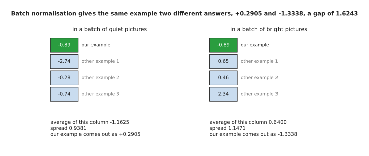

The same activation of -0.89 comes out as +0.2905 when it sits beside three quiet examples and as -1.3338 when it sits beside three bright ones, a gap of 1.6243.

That is not a bug but the definition, and it has three consequences. The first
is that the smaller the batch the noisier the answer, and large models are
trained with few examples per device because each example is enormous.

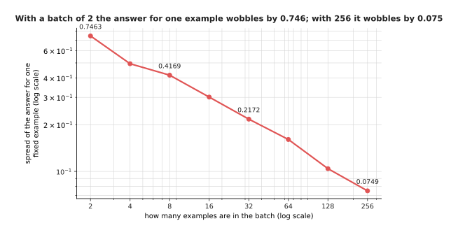

With two examples in a batch the answer for one fixed example wobbles by 0.7463 from batch to batch, and it takes 256 examples to bring that wobble down to 0.0749.

The second consequence is that it does not fit inputs of different lengths. A
batch of sentences or of robot episodes holds items of different lengths, and the
short ones are padded out with filler so the batch is a rectangle, so averaging
down a column mixes real numbers with filler and the answer for a real number
changes with how much padding its batch happens to carry.

The third consequence is the awkward one. At prediction time there is often
only one example, so there is no column to average, and batch normalisation keeps
a running average and spread during training and uses those instead, which means
the layer calculates one thing while training and another while predicting.

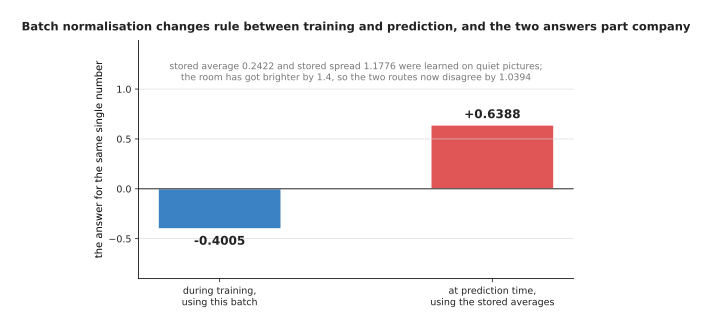

The stored average of 0.2422 and spread of 1.1776 were learned on quiet pictures, so when the room gets brighter the two routes disagree by 1.0393 for the very same number.

So why layer and RMS normalisation rather than batch normalisation, given that
batch normalisation came first and trains slightly faster on pictures? Because
both of the newer rules work on one example by itself, which removes all three
problems at once: the batch size stops mattering, padding stops mattering, and
training and prediction compute exactly the same thing. What that costs is the
small regularising effect that batch normalisation's noise provided for free,
and a little speed on the convolutional networks where batch normalisation
still holds its ground. For transformers the choice is not close, and that is
the next section's subject.

---

## 4. The residual stream, and where the normalisation sits

Section 3 settled which normalisation to use, and this section is about where to
put it. A modern network is a stack of blocks, and each block does not replace
what came before it but adds to it, which is what the
[residual connection](../02_inside-a-network/02_layers-and-depth.md) on an
earlier page described. The running total that the blocks keep adding to is
called the **residual stream**.

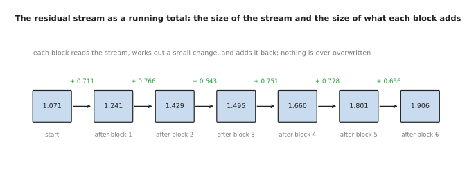

The stream starts at a size of 1.071 and each block reads it, works out a small change, and adds that change back, so nothing the earlier blocks wrote is ever overwritten.

Those sizes are root-mean-square sizes of whole vectors, so they do not add up
the way the labels suggest: a change of size 0.711 added to a stream of size
1.071 leaves a stream of size 1.241, because the change points in a different
direction from the stream. The arrangement is what lets a stack of fifty blocks
train at all, because the gradient coming backwards has a clear path along the
stream, and the question is where the normalisation goes.

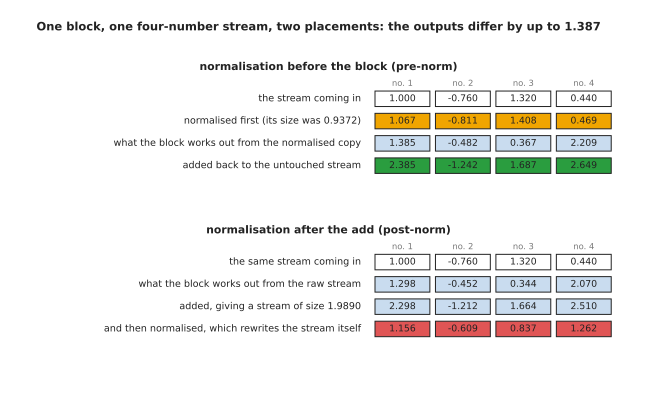

Normalising before the block leaves the stream itself untouched and adds the block's output to it, while normalising after the add rewrites the stream, and on this four-number stream the two answers differ by up to 1.387.

The first arrangement is called **pre-norm**, and the block reads a normalised
copy of the stream while the stream itself passes through unchanged. The second
is called **post-norm**, and the normalisation sits on the stream, so the stream
is rewritten at every block. Every transformer in wide use today is pre-norm, and
the reason shows up when you measure the two.

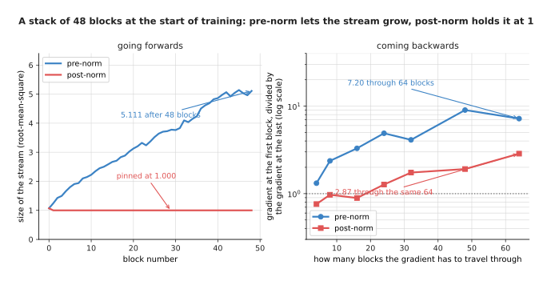

In pre-norm the stream grows as blocks keep adding to it, while in post-norm the normalisation pins it to exactly 1 at every block, and through 64 blocks the first block of a pre-norm stack is handed 7.20 times the gradient the last block gets against 2.87 times for post-norm.

Pinning the stream to 1 sounds tidier, but it means every block's output is
rescaled along with everything the earlier blocks wrote, so the gradient must
pass through a normalisation at every single block on its way back. In pre-norm
the path is an exact addition, so whatever gradient arrives at the top of the
stack also arrives at the bottom, plus a contribution from each block along the
way, and the right-hand panel shows the early blocks of a pre-norm stack getting
the stronger signal at every depth.

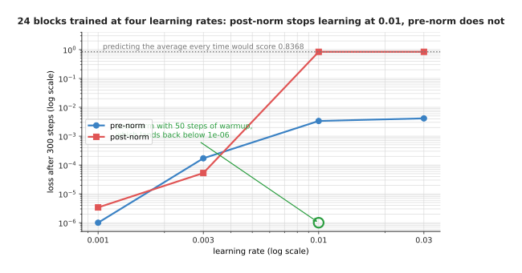

A stack of 24 blocks trains under both arrangements at learning rates of 0.001 and 0.003, but at 0.01 and above the post-norm stack collapses to a loss of 0.8368 after 220 steps, which is what predicting the average of the targets would score.

That is the honest shape of the difference. At a small learning rate post-norm
is fine and is in fact slightly better here, and at a large one it dies, while
pre-norm keeps training. The usual repair for post-norm is warmup, meaning the
learning rate starts near zero and is raised over the first few hundred steps,
and in this run 50 steps of warmup is enough to bring the post-norm stack back
to a loss of 0.000000042 at a learning rate of 0.01. So the cost of pre-norm is
that the growing stream has to be normalised once more at the very end before
the output layer, and the benefit is that the run survives a learning rate large
enough to be worth using. All of this assumes the numbers are stored accurately
enough to mean what they say, which is the next question.

---

## 5. Mixed precision: which numbers stay large

Sections 1 to 4 kept the numbers in a sensible range, and this section is about
how many bits each one is stored in, because every large run today stores most of
them in half the usual number. The reason is money and time, since half as many
bits is half the memory and roughly twice the speed on matrix multiply hardware.
**Mixed precision** means doing most of the arithmetic in a 16-bit format while
keeping a few specific things in 32 bits.

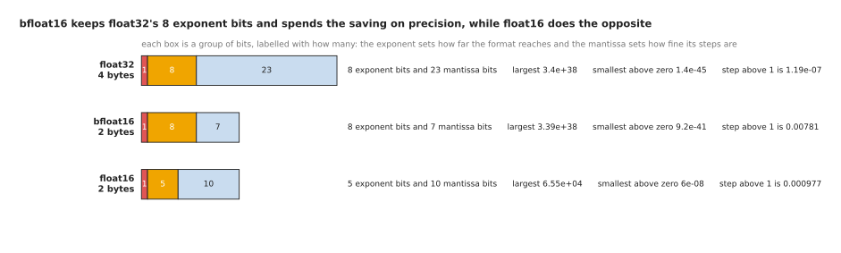

float32 has 8 exponent bits and 23 mantissa bits and reaches 3.403e+38, bfloat16 keeps the 8 exponent bits but has only 7 mantissa bits and still reaches 3.39e+38, while float16 has 5 exponent bits and 10 mantissa bits and stops at 65,504.

The exponent bits set how far the format reaches, from the smallest number above
zero to the largest, and the mantissa bits set how fine its steps are. That
split is the whole story of why bfloat16 won. It keeps exactly the reach of
float32, so any number that fits in a float32 fits in a bfloat16, and it pays
for that with coarse steps, since the smallest change it can represent near 1 is
0.0078125 against float32's 0.000000119. float16 made the opposite choice, with
finer steps but a reach that stops at 65,504 at the top and runs out of room at
about 0.00000006 at the bottom.

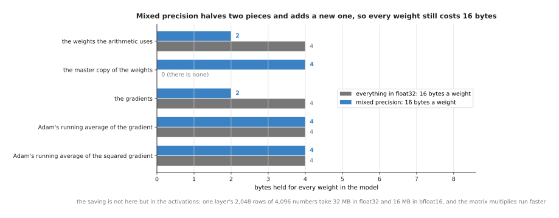

Mixed precision halves the weights used for the arithmetic and halves the gradients, but it adds a float32 master copy of the weights, so every weight still costs 16 bytes.

So mixed precision is not about saving memory on the weights, which is widely
assumed and wrong. The pieces that stay in float32 are the master copy of the
weights, the optimiser's two running averages, and the places where many numbers
are added up, meaning the loss, the averages and spreads inside the normalisation
layers, and the sum inside a softmax. The master copy is kept because a training
step often changes a weight by less than one bfloat16 step, and adding a change
that small to a bfloat16 weight does nothing, so the weight would never move. The
saving is in the activations, because one layer's output for 2,048 rows of 4,096
numbers takes 32 MB in float32 and 16 MB in bfloat16.

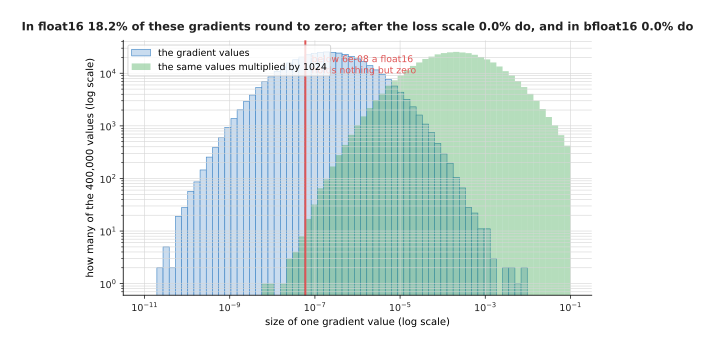

Of these 400,000 gradient values, 18.21% round to exactly zero in float16, none round to zero after being multiplied by 1,024, and none round to zero in bfloat16.

That picture explains the one piece of machinery float16 training needs and
bfloat16 training does not. Gradients are small numbers, with a median of about
0.0000002 here, and float16 cannot hold anything below about 0.00000006, so
nearly a fifth of them become exactly zero and those weights get no update at
all. The repair is a **loss scale**: multiply the loss by a large number, say
1,024, before working out the gradients, which multiplies every gradient by the
same 1,024 and lifts them into the range float16 can hold, then divide the
gradients by 1,024 again before the optimiser uses them. It works, and it is
what everybody did for years, but it needs watching, because a scale too large
makes the gradients overflow.

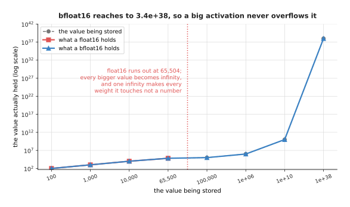

Storing 100,000 gives 65,504 at best in float16 and in fact gives infinity, while bfloat16 holds it as 99,840 and holds 1e+38 as 9.969e+37.

Overflow is what makes float16 dangerous rather than merely awkward. Once a
value passes 65,504 the format stores infinity instead, and infinity minus
infinity is not a number, so one overflowed gradient turns a weight into "not a
number", that weight poisons everything downstream of it, and the loss reads as
not a number for the rest of the run. The standard answer is a loss scale that
halves itself whenever an infinity appears and doubles slowly when none has
appeared for a while, skipping the step each time. With bfloat16 none of this is
needed, because its reach is float32's reach, which is why bfloat16 is the usual
choice wherever the hardware supports it, and why the remaining failure is one
that no number format can prevent.

---

## 6. Loss spikes, and what people do about one

Section 5 described a failure that is obvious when it happens, because the loss
becomes not a number and stays there. This section is about the quieter failure
that mixed precision cannot cause and cannot cure. A **loss spike** is a sudden
jump in the training loss, from a value it had been improving on for hours up to
a much worse one, usually within a handful of steps.

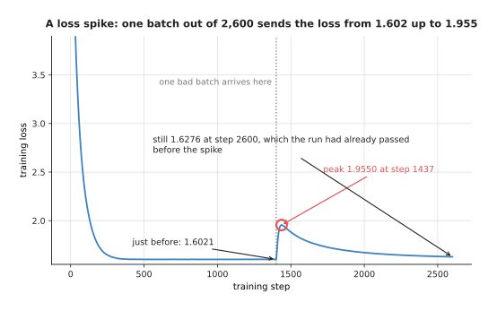

The loss was 1.6021 just before step 1,400, it reaches 1.9550 at step 1,437, and it is still at 1.6276 at step 2,600, which is a level the run had already passed long before the spike.

The spike in that run was caused on purpose, by one batch whose gradient was
far larger than usual, and the mechanism is worth following. Adam divides each
step by a running average of the recent squared gradients, and that average takes
hundreds of steps to respond, so when one huge gradient arrives the divisor is
still set for the ordinary ones. The step taken is therefore enormous, the
weights land far from where they were, and the optimiser has to walk all the way
back with the small steps it was using before.

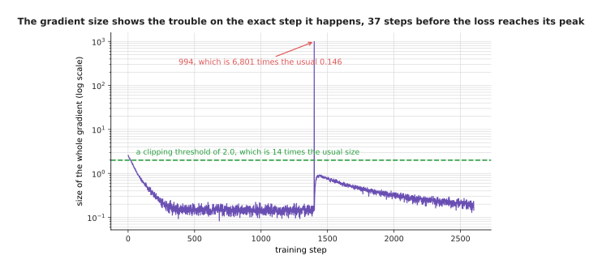

The gradient size is 0.1462 on an ordinary step and 994.1 on the bad one, which is about 6,800 times larger, and it shows the trouble on the step it happens rather than several steps later like the loss.

That is the single most useful thing to log during a training run, because the
gradient size names the step that went wrong while the loss only shows the damage
afterwards. In real runs the bad step usually turns out to be a batch holding
something odd, such as a page of repeated characters or a demonstration where
the arm was knocked.

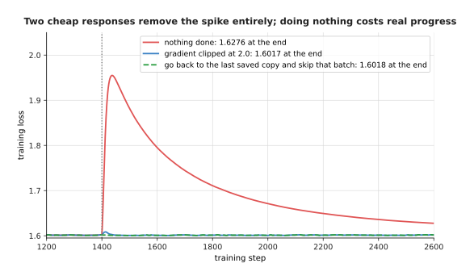

Clipping the gradient at 2.0 and rewinding to the last saved copy to skip the bad batch both remove the spike completely, ending at 1.6017 and 1.6018 against 1.6276 for doing nothing.

Two things are done in practice, and the first is cheap enough to leave on
always. Gradient clipping measures the size of the whole gradient before the step
and, if it is above a threshold, scales every part of it down so the size equals
the threshold. A threshold of 2.0 here is about fourteen times the ordinary
gradient size, so it never touches a normal step and shrinks the bad one by a
factor of nearly five hundred. Its cost is that a threshold set too low quietly
slows every step of the run, which is why it is chosen from a log of real
gradient sizes rather than guessed.

The second thing is what people do when a spike gets through anyway, which is
to go back to the last saved copy of the weights, skip the batches around the one
that caused it, and carry on, and that is one reason
[checkpoints](../03_how-training-works/04_the-training-loop.md) are written often.
If spikes keep coming back at the same place after a rewind then the cause is not
one batch, and the usual next moves are to lower the learning rate, to lengthen
the warmup, or to look again at section 4.

---

## 7. Where to read next

- [Tokens and embeddings](../05_turning-the-world-into-numbers/01_tokens-and-embeddings.md)
  is the next page, and it turns words and pictures into the vectors this page
  has been normalising.
- [A transformer block](../06_the-transformer/02_a-transformer-block.md) puts
  section 4's pre-norm arrangement together with attention and a feed-forward
  part.
- [The shape of the numbers](../02_inside-a-network/03_the-shape-of-the-numbers.md)
  covers section 5's number formats in more detail, and what a matrix multiply
  costs.
- [Making a model smaller and faster](../07_pretraining-and-adapting/04_making-a-model-smaller-and-faster.md)
  takes precision down to 8 and 4 bits, where the model runs rather than trains.
- [Running a model on a robot](../../07_learned-models/10_making-models-work-on-an-arm/02_most-used/02_running-a-model-on-a-robot.md)
  is the catalogue page for getting a trained model onto an arm's own computer.

---

## 8. Using it in Python

Every piece of machinery on this page is one or two lines in PyTorch, and the
code below works through sections 1, 2, 4, 5 and 6 in that order.

```python
import torch
from torch import nn

# Section 1: scale the inputs, using the training set's own average and spread.
train_x = torch.tensor([[520.0, 0.31], [240.0, 0.58], [610.0, 0.12]])
mean, sd = train_x.mean(0), train_x.std(0, correction=0)
scaled = (train_x - mean) / sd          # apply this same mean and sd to test data

# Section 2: the two normalisation rules, on the page's own six numbers.
h = torch.tensor([[1.03, -0.59, 1.13, 1.83, 0.88, 0.36]])
print(nn.LayerNorm(6, elementwise_affine=False)(h))
# tensor([[ 0.3435, -1.8244,  0.4773,  1.4140,  0.1427, -0.5531]])
print(nn.RMSNorm(6, elementwise_affine=False)(h))
# tensor([[ 0.9578, -0.5486,  1.0508,  1.7017,  0.8183,  0.3348]])

# Section 4: a pre-norm block. The stream is added to, never overwritten.
class Block(nn.Module):
    def __init__(self, width):
        super().__init__()
        self.norm = nn.RMSNorm(width)
        self.ff = nn.Sequential(nn.Linear(width, 4 * width), nn.GELU(),
                                nn.Linear(4 * width, width))

    def forward(self, stream):
        return stream + self.ff(self.norm(stream))

# Sections 5 and 6: bfloat16 arithmetic, then clipping before every step.
for batch, target in loader:
    with torch.autocast('cuda', dtype=torch.bfloat16):
        loss = loss_fn(model(batch), target)
    loss.backward()
    size = nn.utils.clip_grad_norm_(model.parameters(), max_norm=2.0)
    print(float(size))                  # log this: section 6's spike detector
    opt.step()
    opt.zero_grad(set_to_none=True)
```

The two printed vectors are exactly the numbers in section 2's pictures, which
shows that `nn.LayerNorm` and `nn.RMSNorm` really are the arithmetic worked out
there. `torch.autocast` is doing a great deal in those four lines, because it
keeps a list of which operations are safe in bfloat16 and which are not, so the
matrix multiplies run in bfloat16 while the normalisation statistics, the softmax
sums and the loss stay in float32, without you changing a single layer. With
float16 you would also need `torch.amp.GradScaler` for section 5's loss scale,
and it handles the halving, the doubling and the skipped steps on its own.

What you still have to decide is where the normalisation goes, which the
`Block` above answers by putting it before the feed-forward part, and which of
the two rules to use. You decide the clipping threshold, and section 6 showed it
should come from a log of real gradient sizes rather than from a guess. You
decide how often checkpoints are written, since that sets how much a rewind
costs. And you decide the scaling of your own inputs and outputs, because the
library has no idea that one of your columns is in millimetres.
