# Self-supervised pretraining

The page before this one, [why the transformer
won](../06_the-transformer/04_why-the-transformer-won.md), ended with a machine
that can read a very long piece of text or a very large picture and let every
part of it look at every other part. That machine is hungry, because it has
hundreds of millions or billions of **parameters**, which are the numbers inside
it that training adjusts, and a model with that many numbers to set needs an
enormous number of training examples before it settles on good ones. So a
question has been waiting since the start of this book, and this page answers
it: if a person has to write down the right answer for every training example,
and writing one answer takes a person twenty seconds, where could enough answers
possibly come from?

The answer is that for almost all of the training, nobody writes them. The data
is made to ask itself the question and to hold the answer at the same time, and
this is called **self-supervision**: the training signal is taken out of the
data, rather than put there by a person. Training a model this way, on a huge
pile of unlabelled data, before it is pointed at any particular job, is called
**pretraining**, and the made-up job it is trained on is called a **pretext
task**, which means a task nobody wants the answer to, chosen because learning to
do it forces the model to learn something worth having.

This page is for a reader who has met a neuron, a layer, a loss, gradient
descent and the transformer, and who has seen next-word prediction once already,
on the page about [training and running a
transformer](../06_the-transformer/03_training-and-running-a-transformer.md). It
explains four families of pretext task, works the arithmetic of one of them out
in full, and then says what you are left holding at the end of pretraining and
how it is used. Everything it needs beyond that is explained as it appears.

Every number on this page comes from a small program that really runs, in
`docs/diagrams/pretraining_and_adapting_1.py`. The sentences it trains on are
simulated, made by a tiny hand-written grammar, and the pictures are simulated
too, built from a few smooth patterns added together with a lot of pixel noise
on top. The models fitted to that data are real, and the losses and accuracies
quoted are measured on data the models were not trained on.

## Contents

1. [Where the training signal comes from when nobody writes labels](#1-where-the-training-signal-comes-from-when-nobody-writes-labels)
2. [Next-word prediction, which you have already met](#2-next-word-prediction-which-you-have-already-met)
3. [Masked prediction: hide part of it and fill it in](#3-masked-prediction-hide-part-of-it-and-fill-it-in)
4. [Contrastive learning, worked out with real numbers](#4-contrastive-learning-worked-out-with-real-numbers)
5. [Self-distillation: agreeing with a slower copy of yourself](#5-self-distillation-agreeing-with-a-slower-copy-of-yourself)
6. [What you are left holding, and what it buys](#6-what-you-are-left-holding-and-what-it-buys)
7. [Where to read next](#7-where-to-read-next)
8. [Using it in Python](#8-using-it-in-python)

---

## 1. Where the training signal comes from when nobody writes labels

The problem is one of arithmetic, so the first thing to do is to count. Suppose
you have four thousand short sentences, which in the simulated corpus used here
come to 33,320 words drawn from a vocabulary of 28 different words. If a person
labels each sentence with one answer, such as which object it is about, and if
one label takes twenty seconds of somebody's attention, then you have bought
4,000 training signals for 22.2 person-hours of work.

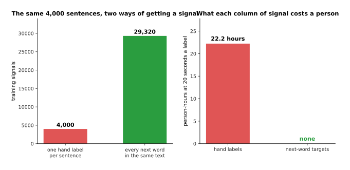

The same four thousand sentences give 4,000 answers if a person writes them and 29,320 answers if the text is asked to supply them, and the second column costs nobody any time.

Now take the same text and ask a different question of it. At every position in
every sentence, cover the next word and ask the model to guess it, then uncover
it and see whether the guess was right. There are 29,320 places where that can
be done, which is 7.3 times as many training signals as the hand labelling
bought, and the cost in human time is nothing at all, because the answer was
already sitting in the sentence.

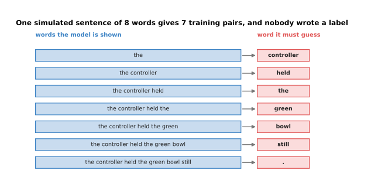

One simulated sentence of eight words, "the controller held the green bowl still .", becomes seven separate training pairs, and the answer in each pair was cut out of the sentence itself.

The same counting works for pictures, and it works even more strongly. A colour
photograph of 224 pixels by 224 pixels is 150,528 numbers. If a person labels it
with the name of the object in it, that whole picture has bought one training
signal. If instead the picture is cut into squares of 16 pixels by 16 pixels,
which gives a grid of 14 by 14, so 196 squares in all, and three quarters of
those squares are blanked out, then the model has 147 separate things to work out
about that one picture, and again nobody wrote any of them down.

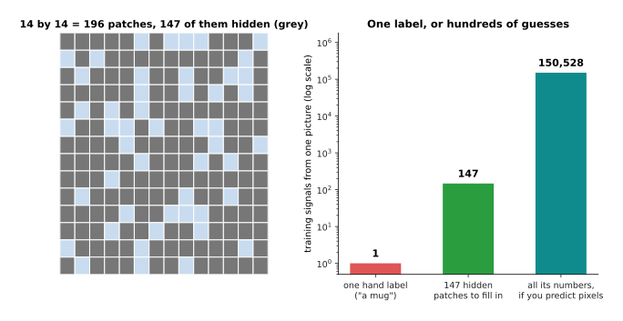

One picture is worth one hand label, or 147 blanked squares to fill in, or 150,528 pixel values to predict, depending on what you ask of it.

So the recipe is always the same, and it has two steps: hide something that the
data already contains, and make the model produce it. What changes between the
families of method is what gets hidden and how the model is asked to produce it,
and the four families that matter today are drawn together below before each one
is taken in turn.

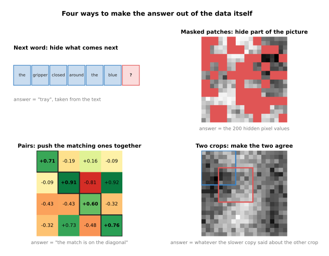

The four pretext tasks of this page, each drawn on the real data the script generated: hide the next word, hide part of the picture, hide which caption goes with which picture, and hide nothing but ask two crops of one picture to agree.

The rest of this page takes those four in order. The first is the one you have
already met, so it is the shortest.

---

## 2. Next-word prediction, which you have already met

The page on [training and running a
transformer](../06_the-transformer/03_training-and-running-a-transformer.md)
showed next-token prediction as the way a language model is trained, where a
**token** is a piece of a word. What that page did not say is that it is one
example of the general idea above, chosen because text happens to be a sequence,
so the thing to hide is obvious. Here the tokens are whole words, to keep the
arithmetic small.

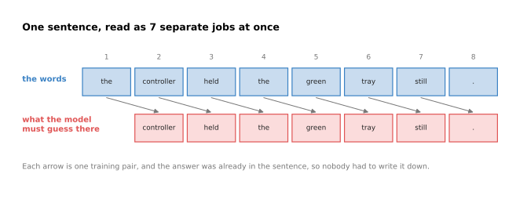

The eight words of one simulated sentence are read as seven jobs at once, because at every position except the last the model has to name the word that comes next.

To see what the model is forced to learn, the script fits four models to this
corpus by gradient descent and measures each one on sentences it was not fitted
to. The loss used is the one from [the score of being
wrong](../03_how-training-works/01_the-score-of-being-wrong.md), so a loss of 0
means the model gave the right word a chance of 1, and the number beside each
loss below is what that loss would mean if the model were simply picking at
random from that many equally likely words.

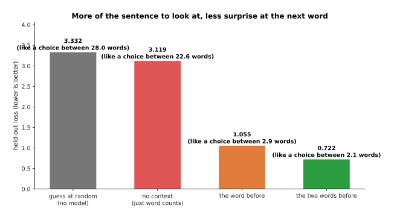

Guessing with no model at all gives a loss of 3.332, knowing only how often each word appears gives 3.119, seeing the single word before gives 1.055, and seeing the two words before gives 0.722.

The four numbers tell the whole story of why this pretext task is worth
anything. Picking a word out of the 28 in the vocabulary at random costs 3.332.
Learning only which words are common, with no context at all, saves very little
and costs 3.119. Being allowed to look at the one word before cuts the loss to
1.055, and looking at two words cuts it to 0.722. Every one of those
improvements had to be paid for with knowledge about the language, and the model
got that knowledge by being wrong 23,488 times on the training pairs and
adjusting itself each time.

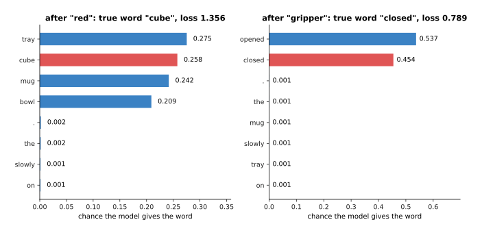

After the word "red" the model spreads its answer across the four objects, giving "tray" 0.275 and the true word "cube" 0.258, and after "gripper" it gives almost everything to the two verbs that can follow it, "opened" 0.537 and "closed" 0.454.

Look at what those two pictures say. After a colour word, the model has learned
that a colour is followed by an object, and it divides its answer between the
four objects almost evenly, because in this corpus nothing in the sentence says
which object is coming. That is not a failure, because a model that claimed to
know would be wrong three times in four, and the loss would punish it. After the
word "gripper" the model has learned that only two verbs ever follow, and it
gives them almost all of its answer. Nobody taught it either rule.

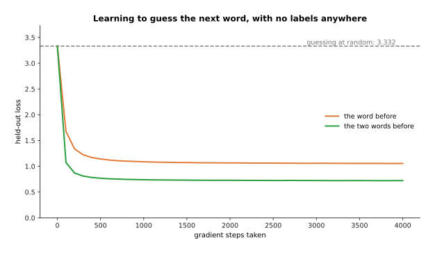

Both models start at the loss of random guessing and fall away from it quickly, the one-word model settling at 1.055 and the two-word model at 0.722.

At the scale of a real language model this same job, repeated over a very large
amount of text, is what makes a model that can hold a conversation, because
guessing the next word well enough eventually requires knowing what words mean.
The next section takes the same idea to data that is not a sequence.

---

## 3. Masked prediction: hide part of it and fill it in

A picture has no next word, because nothing in a picture comes first, so the
trick of covering what comes next does not transfer. What transfers is the idea
underneath it, which is to hide part of the input and make the model produce the
hidden part from what is left, and that is called **masked prediction**. The
**mask** is simply the list of which parts are hidden.

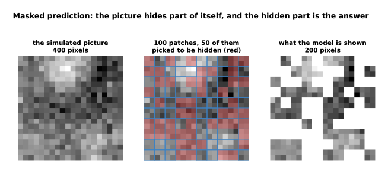

Each simulated picture is 20 pixels by 20, which is 400 pixels, cut into 100 patches of 2 pixels by 2, and half of those patches are hidden, so the model sees 200 pixels and must produce the other 200.

The model fitted here is the plainest one that can do the job, which is a set of
weights that turns the 200 visible pixels into a guess at the 200 hidden ones,
fitted on 12,000 unlabelled pictures. What it is asked for is the picture
underneath the noise, not the noisy pixels, because the noise in this simulated
data is independent of everything else and nobody can predict it. Measured that
way, the fitted model is 0.264 per pixel out, while a model that always answers
with the average picture of the training set is 2.182 per pixel out, so learning
the shape of a picture has cut the error by 88 per cent.

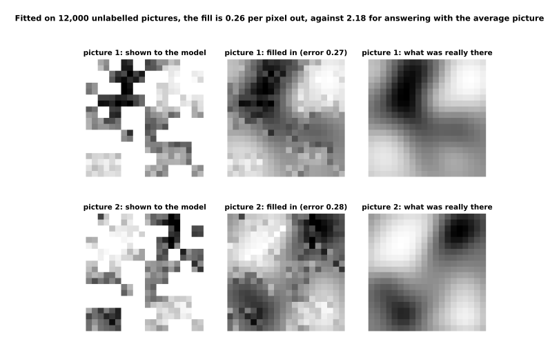

On two pictures the model has never seen, the filled-in version is smooth and lands close to what was really there, with errors of 0.268 and 0.284 per pixel.

The amount you hide is a real choice, and it decides how hard the job is. The
script refits the same kind of model at six different mask rates, and the error
rises from 0.206 per pixel when a fifth of the patches are hidden to 0.743 when
nine tenths are, while the average-picture model stays near 2.2 throughout.
Hiding very little makes the job easy in a useless way, because a patch can be
copied from its neighbours without understanding anything, and that is why real
systems for pictures hide most of the image rather than a little of it.

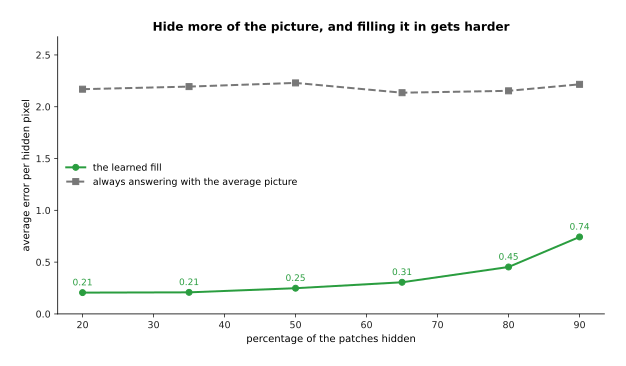

Hiding more of the picture makes filling it in harder, and the learned fill stays far below the average-picture answer at every rate.

Masked prediction works on text too, and there it differs from next-word
prediction in one way that matters, because the model fills a gap with the words
on both sides of it available. The script fits two models to the same corpus,
one that sees only the word before the gap and one that sees the words on both
sides, and the second has a held-out loss of 0.492 against the first one's
1.111.

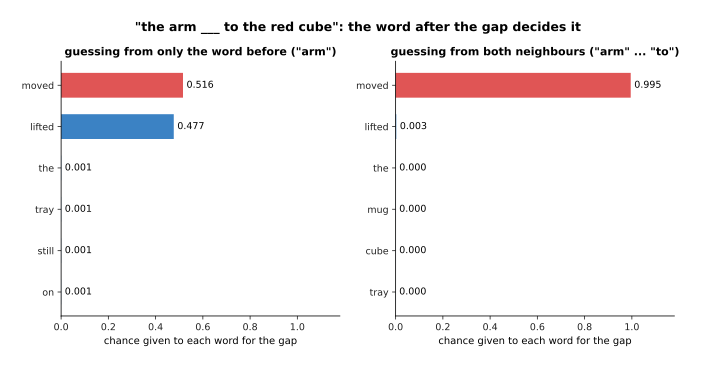

Knowing only that the word before the gap is "arm" leaves the model split between "moved" at 0.516 and "lifted" at 0.477, while knowing that "to" comes after the gap settles it at 0.995 for "moved".

That is the trade. Filling a gap from both sides is a better way to learn what a
word means in its place, which is why models built to understand text rather than
to produce it are trained this way, and it is useless for writing text one word
at a time, because when you are writing there is nothing on the right yet. The
next section leaves hidden parts behind entirely.

---

## 4. Contrastive learning, worked out with real numbers

Both methods so far hide part of one thing. **Contrastive learning** hides
something else, which is which items belong together. You take pairs that go
together, such as a photograph and the caption written under it, and you train
two models, one that turns a picture into a short list of numbers and one that
turns a caption into a short list of numbers, so that the two lists of a matching
pair point the same way while the lists of two things that do not go together
point different ways. The short list of numbers is a **vector**, and how much two
vectors point the same way is their **cosine similarity**, which runs from +1 for
exactly the same direction to -1 for exactly opposite.

The simulated data here is a set of items, each with a hidden content vector; the
picture side and the caption side are two different noisy views of that content,
so the only thing the two sides share is the content itself. After training, take
six items and work out the similarity of every picture against every caption.

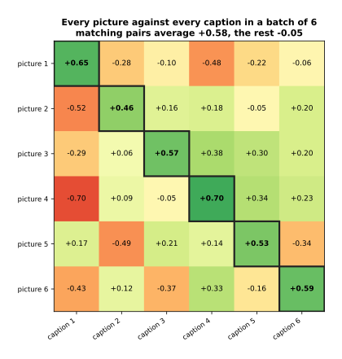

The six matching pairs on the diagonal average +0.58 and the thirty non-matching pairs average -0.05, and in every row the largest number is the matching one.

Now the important part, which is where the training signal comes from. Take one
row of that grid, the row for picture 3, whose six similarities are -0.287,
+0.056, +0.570, +0.375, +0.301 and +0.199. Divide all six by a small number
called the **temperature**, which is 0.1 here, giving -2.87, +0.56, +5.70, +3.75,
+3.01 and +1.99, and push those through softmax, which turns a list of numbers
into a list of chances that add up to 1. The result is 0.000, 0.005, 0.805,
0.115, 0.055 and 0.020, so the model gives its own caption a chance of 0.805, and
the loss for that row is the usual one, the negative logarithm of 0.805, which is
0.216. Picking at random from six would have given 1.792.

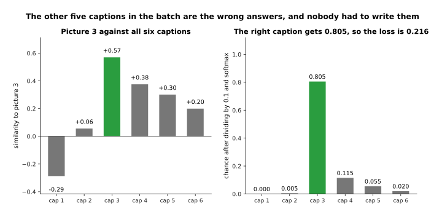

Picture 3 is asked to pick its own caption out of the six in the batch, it gives the right one 0.805, and the loss for that row is 0.216.

This is why the other examples in the batch matter so much. The five other
captions are the wrong answers that the right one has to beat, and they are
called the **negatives**, and nobody wrote them down either; they are simply
whatever else happened to be in the batch. The whole batch is scored this way,
once with each picture choosing a caption and once with each caption choosing a
picture, and the average of those losses is what gradient descent is given.

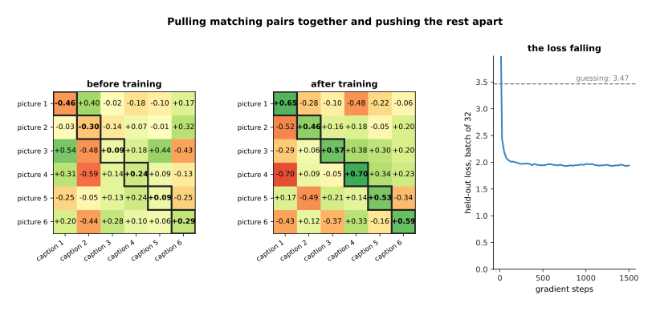

Before training the matching pairs average -0.010 and the rest +0.019, so the diagonal means nothing; after training the matching pairs average +0.582 and the rest -0.047, and the held-out loss has fallen from 5.703 to 1.940, against 3.466 for guessing.

Two choices control this method and both can be measured. The batch size decides
how many wrong answers each right one has to beat, so a bigger batch is a harder
question, and the trained model's loss rises from 0.182 with a batch of 2 to
3.234 with a batch of 128, while the loss of pure guessing rises faster still,
from 0.693 to 4.852. The temperature decides how sharply small differences in
similarity are treated, and sweeping it over the trained model gives a lowest
held-out loss of 1.967 at 0.10, rising to 5.265 at 0.02 and 3.019 at 1.00.

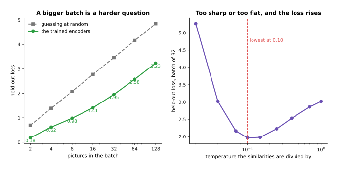

A bigger batch is a harder question that the trained encoders still answer far better than chance, and the temperature has one best value, with the loss rising on both sides of it.

This is exactly how the CLIP family of models is trained, where CLIP stands for
contrastive language-image pretraining, on a very large number of pictures with
the text that happened to be beside them on the web. What it buys is worth
stating plainly now, because a later chapter depends on it: because pictures and
words end up in the same space of vectors, you can name an object the model was
never given a label for, by writing the name as a sentence, turning that sentence
into a vector, and seeing which picture it points at. That is what [open-
vocabulary vision](../09_models-that-see/03_open-vocabulary-vision.md) is built
on, and it is why a robot can be asked for "the blue mug" without anybody having
trained a blue-mug detector.

---

## 5. Self-distillation: agreeing with a slower copy of yourself

Contrastive learning needs pairs of two different kinds of thing, and for
pictures alone there are no captions to lean on. **Self-distillation** removes
that need. It takes two crops of the same picture, pushes both through the same
network, and trains the network so that what it says about one crop matches what
a slower copy of itself says about the other. The slower copy is called the
**teacher** and the network being trained is the **student**, and the teacher's
weights are a moving average of the student's, which means they are the student's
weights smoothed over the last hundred steps or so.

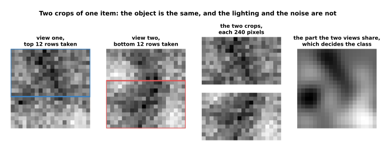

The two crops are twelve rows each of a twenty by twenty picture and share four rows, and they come from two views of one item, so the part that says what the item is has a spread of 1.46 per pixel while the lighting that differs between views has a spread of 2.41.

The model's answer is not a picture and not a word. It is a share given to each
of eight directions called **prototypes**, which start as random directions and
are learned along with everything else, so the answer is a statement of the form
"this crop belongs mostly to prototype 7". The teacher's answer is made sharper
than the student's, by dividing by a smaller temperature, and a running average
of the teacher's recent scores is taken off before the sharpening.

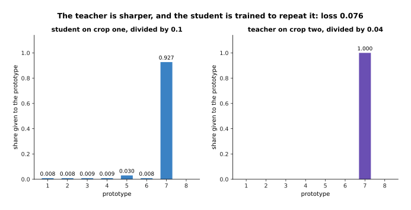

For one item the student puts 0.927 on prototype 7 and the teacher, being sharper, puts almost all of its answer there, so the loss for this item is 0.076.

That subtraction and that sharpening are not decoration. The obvious way for a
model to satisfy "agree with yourself" is to give every picture the same answer,
which is called **collapse**, and it would make the loss zero while teaching
nothing. Taking the running average off pushes the teacher away from whichever
prototype it has been favouring, and the sharpening stops the answers from
drifting into a flat, meaningless mush. In the run here the answers stayed spread
out, with a spread of 1.480 against the 2.079 that using all eight prototypes
equally would give.

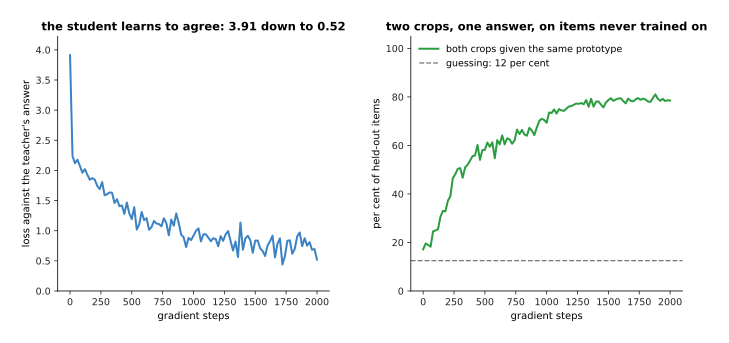

The student learns to say what the teacher said, and on items it never trained on the two crops are given the same prototype 78.5 per cent of the time, against 12.5 per cent for guessing.

The point of all this is what happens to the sixteen numbers the network produces
on the way to its answer, because those numbers are the thing worth keeping.
Before training, two crops of one item are no more alike than two crops of
different items, at +0.008 against +0.010. After training, two crops of one item
sit at +0.520 and crops of different items at -0.006.

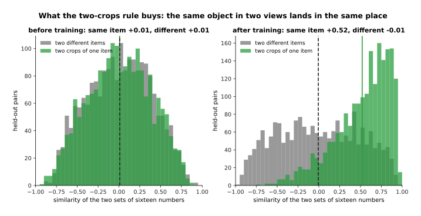

Training has separated the two histograms: the same object seen twice now lands in the same place, and two different objects do not.

This is how the DINO family of vision models is trained, and the name is short for
self-distillation with no labels. What the method gives you is a network whose
output ignores the things that differ between two views of one object and keeps
the things that do not, which is the next section's subject.

---

## 6. What you are left holding, and what it buys

Pretraining does not end with a model that does a job anybody wants. It ends
with a **representation**, which is a way of turning a raw input into a shorter
list of numbers that says what is in it, and the part of the network that does
that turning is called the **backbone**. The job you actually care about is then
done by a **head**, which is a small network that reads those numbers and gives
the answer you want, and when the backbone's weights are left exactly as
pretraining made them while only the head is trained, the backbone is said to be
**frozen**.

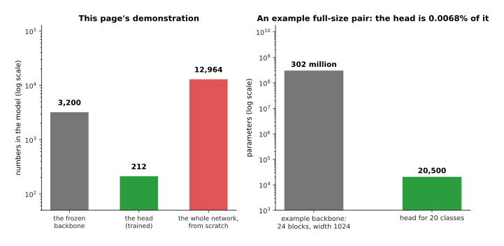

In this page's demonstration the frozen backbone holds 3,200 numbers and the head only 212, against 12,964 for training the whole thing from scratch, and for an example full-size backbone of 24 blocks and width 1024 the head is 20,500 parameters against 302 million.

The backbone used here was fitted on 20,000 unlabelled pairs of views by the
simplest method of the two-crops kind that can be worked out exactly rather than
by gradient descent: it keeps the eight directions of the picture on which two
views of one item agree most, and throws the rest away. Six of those directions
agree across views with a correlation above 0.91 and the seventh drops to 0.277,
which is the method finding, without being told, that there are six things worth
knowing about these pictures.

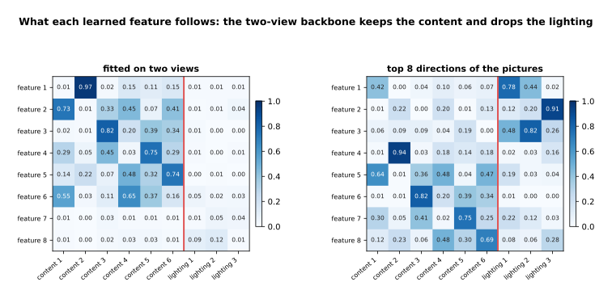

Each feature of the two-view backbone follows a content factor at 0.590 on average and a lighting factor at only 0.037, while simply taking the eight directions in which the pictures vary most follows the lighting at 0.422.

That second grid is the warning. Taking the directions of greatest variation is
also a way of using unlabelled data, and it fails here, because the lighting
varies more than the object does, so those directions are mostly about the
lighting. What makes a pretext task good is not that it uses unlabelled data but
that the thing it forces the model to keep is the thing you will later want.

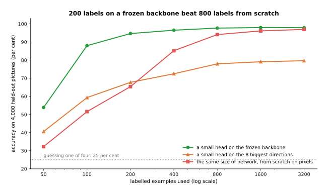

With 200 labelled examples a small head on the frozen backbone reaches 94.7 per cent, which the same network trained from scratch on raw pixels has not reached with 800, and the eight-biggest-directions backbone never gets past 79.7 per cent however many labels it is given.

Reading the same experiment the other way round makes the saving plain. To reach
90 per cent the head on the frozen backbone needs about 123 labelled examples and
the from-scratch network needs about 581, and to reach 95 per cent the numbers are
227 and 1,086. So a few hundred examples on top of a good representation are
worth a thousand or more without one, and the backbone that made that possible
cost no labels at all.

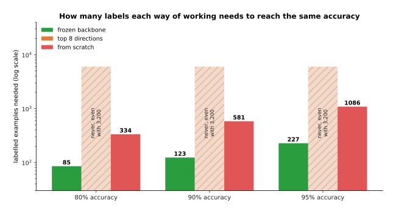

The frozen backbone needs 85, 123 and 227 labels for the three targets while training from scratch needs 334, 581 and 1,086, and the weaker representation reaches none of them.

This is why the word **foundation model** is used for a large pretrained model:
it is not finished, and it is not useful on its own, but almost everything built
afterwards starts from it. The two things that follow from here are how such a
model is made big enough to be worth starting from, which is the next page, and
how it is adjusted to a particular job, which is the page after that.

---

## 7. Where to read next

- [Scale, data and compute](02_scale-data-and-compute.md) is the next page, and
  it explains what pretraining actually costs: what a graphics processing unit
  does, what a parameter costs in memory, and how model size and data size have
  to grow together.
- [Fine-tuning and adapters](03_fine-tuning-and-adapters.md) takes the frozen
  backbone of section 6 and shows the cheaper ways of bending it to one job.
- [Vision backbones](../09_models-that-see/01_vision-backbones.md) describes the
  networks that the picture methods on this page are used to pretrain.
- [Open-vocabulary vision](../09_models-that-see/03_open-vocabulary-vision.md)
  picks up the promise at the end of section 4 and shows a robot naming an object
  nobody labelled.
- [Large language models](../10_language-and-multimodal-models/01_large-language-models.md)
  follows section 2 to its end, where next-word prediction on a very large amount
  of text becomes a model that can be talked to.
- [Open-vocabulary models](../../07_learned-models/03_seeing-models/02_most-used/03_open-vocabulary-models.md)
  is the catalogue page for the real models that this kind of pretraining
  produced, with what they cost and where they fail.

---

## 8. Using it in Python

Sections 2 to 5 fitted four pretext tasks by hand so that the arithmetic was
visible. In practice you load a backbone somebody else pretrained and put a head
on it, which is section 6 in about fifteen lines. The code below uses Hugging
Face's `transformers` package and PyTorch.

```python
import torch
from torch import nn
from transformers import AutoModel, AutoTokenizer

name = "distilbert-base-uncased"          # a model pretrained by masked prediction
tokeniser = AutoTokenizer.from_pretrained(name)
backbone = AutoModel.from_pretrained(name)      # section 6: the pretrained part

for p in backbone.parameters():           # section 6: freeze it, so only the head learns
    p.requires_grad = False

width = backbone.config.dim               # how many numbers the backbone gives per token
head = nn.Linear(width, 4)                # section 6: a small head, four classes

batch = tokeniser(["the gripper closed around the blue cube"], return_tensors="pt")
with torch.no_grad():
    hidden = backbone(**batch).last_hidden_state      # section 3's masked model, running
summary = hidden.mean(dim=1)              # one vector for the whole sentence
print(summary.shape)                      # torch.Size([1, 768])
print(head(summary).shape)                # torch.Size([1, 4])

frozen = sum(p.numel() for p in backbone.parameters())
trained = sum(p.numel() for p in head.parameters())
print(frozen, trained)                    # 66362880 3076
```

The library does three things for you here. It downloads weights that somebody
else paid for with a pretraining run of the kind this page describes, it supplies
the tokeniser that turns text into the exact numbers that model expects, and it
hides the whole backward pass. The two printed counts are the real shapes of this
model and this head, and they make section 6's point again: 66,362,880 numbers
arrived already trained, and 3,076 are left for you to fit.

What you still have to decide is which pretrained model to start from, and that
decision is about the pretext task rather than the architecture. A model
pretrained by next-word prediction is good at producing text, a model pretrained
by masked prediction is good at understanding a sentence that is already there, a
model pretrained by the contrastive method of section 4 puts pictures and words in
one space, and a model pretrained by the self-distillation of section 5 gives
picture features that ignore lighting and viewpoint. Picking the wrong one costs
you more than any amount of head design can win back.

The other decision is whether to freeze the backbone at all. Freezing is cheapest,
it needs the least data, and it cannot damage what pretraining learned, but it
also cannot fix a backbone that was pretrained on data unlike yours, and robot
cameras are often unlike the web. The next two pages are about exactly that
choice.
