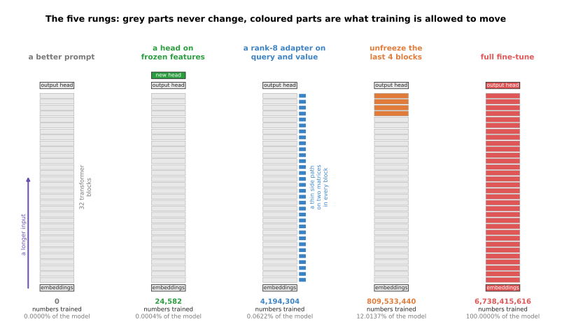
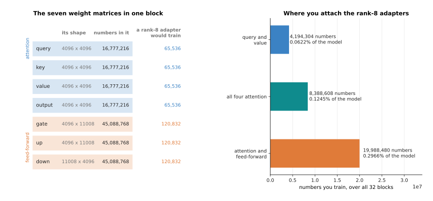
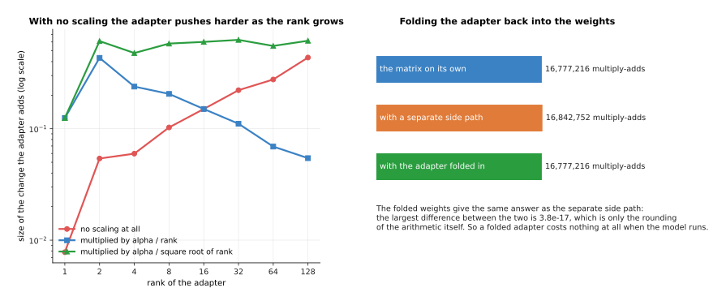
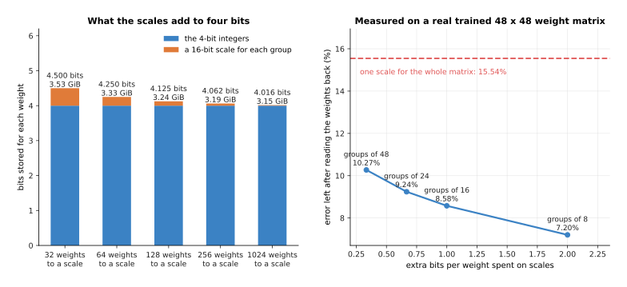
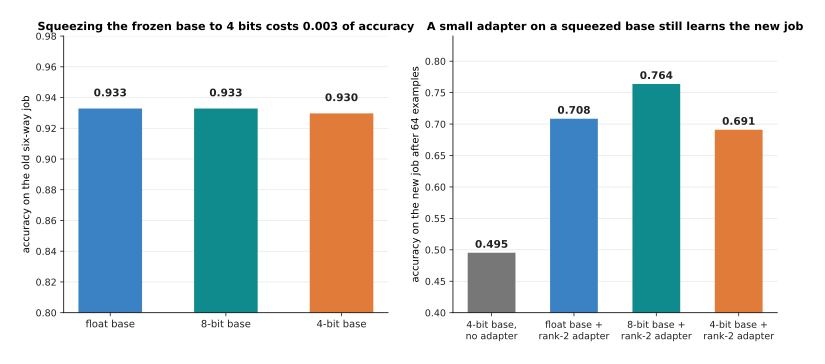

# Fine-tuning and adapters

The page before this one, [scale, data and compute](02_scale-data-and-compute.md),
worked out what it takes to train a large model from nothing, and the honest summary
was that almost nobody does it. What almost everybody does instead is take a model
somebody else has already trained and change it a little, so that it does the job in
front of them, and that step is what this page is about.

The job has a name. **Fine-tuning** means taking a model whose weights were set by
[pretraining](01_self-supervised-pretraining.md) and training it further on a smaller
set of examples of your own. There is more than one way to do it, and the ways form a
ladder from almost free to very expensive, so most of this page is about where on
that ladder to stand and what each rung costs.

It assumes you have read the two pages before it, so you know what pretraining is,
what a frozen backbone is, and what a floating-point operation (FLOP) is. It also
assumes you know what a transformer block holds, from [a transformer
block](../06_the-transformer/02_a-transformer-block.md), and what an optimiser keeps
in memory, from [the training loop](../03_how-training-works/04_the-training-loop.md).

The parameter counts and memory sizes are exact arithmetic on one stated shape, a
transformer of 32 blocks with a width of 4096, a feed-forward inner width of 11008
and a vocabulary of 32000. The learning experiments are simulated, because a small
network is trained in NumPy on made-up readings of six objects and then fine-tuned.
Every number is printed by `docs/diagrams/pretraining_and_adapting_2.py`.

## Contents

1. [The five rungs, from a better prompt to a full retrain](#1-the-five-rungs-from-a-better-prompt-to-a-full-retrain)
2. [What each rung costs in numbers and in memory](#2-what-each-rung-costs-in-numbers-and-in-memory)
3. [Low-rank adaptation, worked out with real shapes](#3-low-rank-adaptation-worked-out-with-real-shapes)
4. [QLoRA: an adapter on a squeezed base](#4-qlora-an-adapter-on-a-squeezed-base)
5. [Catastrophic forgetting, and what actually helps](#5-catastrophic-forgetting-and-what-actually-helps)
6. [How much data a fine-tune needs](#6-how-much-data-a-fine-tune-needs)
7. [Where to read next](#7-where-to-read-next)
8. [Using it in Python](#8-using-it-in-python)

---

## 1. The five rungs, from a better prompt to a full retrain

Because the model you start from was pretrained by somebody else, the question is not
whether to train it but how much of it to let training touch, and the answers form a
ladder of five rungs.



Each rung lets training move more of the model than the one before it, and the count
under each column is how many numbers that rung actually changes.

The first rung leaves the weights alone and writes a better **prompt**, which is the
text or picture you put in front of the model before the real question. It costs no
training, so you can try a new one every minute, and that speed is why it is the rung
to try first. What it cannot do is teach the model something it does not already
contain, because every behaviour a prompt can reach is one the pretrained weights
already hold.

The second rung freezes the pretrained model and trains one small new layer on top,
called a **head**, which turns the model's internal numbers into the answers your job
needs. This is cheap and it breaks nothing, because the pretrained part cannot change,
but it can only recombine what the model already measures, and section 6 shows it
running into exactly that wall.

The third rung adds an **adapter**, which is a small set of extra weights placed
beside the existing ones and trained while those stay frozen, and the most used kind
by far is low-rank adaptation, which section 3 works out in full. The fourth rung
lets the last few blocks train normally, which gives real room to move while leaving
most of the file alone. The fifth is **full fine-tuning**, where every weight is free,
and it is the most capable and by far the most expensive.


Each rung multiplies the trainable weights by roughly a hundred, so the bars need a
scale on which each gridline is a hundred times the one before.

A new six-way head on this model holds 24,582 numbers, a rank-8 adapter on the query
and value matrices holds 4,194,304, unfreezing the last four blocks puts 809,533,440
in play, and a full fine-tune puts all 6,738,415,616 in play. The three middle rungs
are what people mean by **parameter-efficient fine-tuning**, which is any method that
trains a small fraction of the weights and freezes the rest.

A prompt looks free, but it is not, because the extra words are read again on every
call. A forward pass costs about two floating-point operations per parameter per
token, which the [scale page](02_scale-data-and-compute.md) explained, so one token
of prompt costs 13.48 GFLOP here and 600 extra tokens cost 8.09 TFLOP every time.


The arithmetic a longer prompt costs grows with every call while a fine-tune is paid
once, so the two lines cross at a point that can be worked out exactly.

Training this model on 500 examples of 400 tokens for three passes costs about
24.26 PFLOP, because training costs about six operations per parameter per token
rather than two. So the longer prompt has cost as much as the fine-tune after 3,000
calls, and by 100,000 calls it has cost 808.61 PFLOP, which is 33 times the fine-tune.
A prompt is the cheap answer for something you do rarely and the expensive answer for
something a robot does all day.


The last thing each rung costs is storage, because every job you adapt the model for
leaves a file to keep.

Storing the changed weights at two bytes each, a head costs 48 KiB, a rank-8 adapter
costs 8 MiB, four unfrozen blocks cost 1.51 GiB, and a full fine-tune costs the whole
12.55 GiB again. This is why a fleet with twenty jobs keeps one base model and twenty
adapters rather than twenty models.

---

## 2. What each rung costs in numbers and in memory

The counts above came from one stated shape, so it is worth seeing where they come
from, because the same arithmetic gives the cost of any other model you meet.


The parameters are not spread evenly, and the feed-forward parts of the blocks hold
almost two thirds of them.

The embedding table is 32000 times 4096, which is 131,072,000 numbers, and the output
head is the same again. In one block the attention part holds four matrices of 4096
by 4096, which is 67,108,864, and the feed-forward part three matrices of 4096 by
11008, which is 135,266,304, so one block is 202,383,360 and 32 blocks are
6,476,267,520. With the embeddings, the head and the small normalisation scales that
is 6,738,415,616 parameters.


A frozen parameter needs its own value and nothing else, while a trainable one needs
its value, its gradient and two running averages the optimiser keeps.

Under the common recipe shown here a weight stored as bfloat16 takes 2 bytes, its
gradient 2 more, and AdamW keeps two float32 averages at 4 bytes each. So a frozen
parameter costs 2 bytes and a trainable one costs 12, and that factor of six is the
whole reason freezing saves what it saves.


Reading each bar from the bottom, it shows the frozen weights, then the gradients of
what is being trained, then the optimiser state for the same weights.

A full fine-tune needs 75.31 GiB before a single activation is stored, which does not
fit on one 24 GiB graphics card or on two. Unfreezing the last four blocks needs
20.09 GiB, which fits but leaves almost nothing for the activations. A rank-8 adapter
needs 12.60 GiB, which is the 12.55 GiB of frozen weights plus 0.05 GiB for
everything the adapter needs, and that is why so many first successful fine-tunes are
LoRA ones.


Unfreezing is not an all-or-nothing choice, so the left panel shows what each extra
unfrozen block costs and the right panel what share of the model it puts in play.

Each block costs 1.88 GiB more and is 3.00% of the model, so on a 24 GiB card you can
unfreeze 6 blocks and reach 23.86 GiB with nothing left over. That is the honest
reason people reach for adapters: not that unfreezing is wrong, but that the memory
runs out after a sixth of the model.

---

## 3. Low-rank adaptation, worked out with real shapes

Those memory figures made the third rung look attractive, so this section says
exactly what it does, because low-rank adaptation is the method you are most likely
to use and it is simpler than its name suggests.

Fine-tuning one 4096 by 4096 attention matrix normally means working out a change for
each of its 16,777,216 numbers. **Low-rank adaptation (LoRA)** says the change does
not need that much freedom, so instead of learning it directly it learns two thin
matrices whose product has the same shape, and it trains only those.


The product of a 4096 by 8 matrix and an 8 by 4096 matrix is itself 4096 by 4096, so
it can be added to the original weights although it was built from far fewer numbers.

The 8 here is the **rank**, which is how many columns the first thin matrix has and
how many rows the second has, and it is the one number you choose. At rank 8 the two
hold 65,536 numbers between them, which is 0.391% of the matrix they stand in for,
and during training the original matrix never changes.


Doubling the rank doubles the numbers you train, and even at rank 128 the adapter is a
small fraction of the matrix.

Rank 1 holds 8,192 numbers, which is 0.049% of the matrix, and rank 128 holds
1,048,576, which is still only 6.250%, so the two shapes break even only at rank 2048.
A higher rank gives more freedom and so more of the accuracy a full fine-tune would
reach, and it costs memory and a greater risk of fitting your few examples too
closely, so people start between 8 and 32.



The left side lists each matrix in a block with its shape, the numbers it holds and
what a rank-8 adapter on it would cost, and the right side totals three common
choices over all 32 blocks.

Attaching rank-8 adapters to the query and value matrices only, the usual starting
point, trains 4,194,304 numbers, or 0.0622% of the model. Covering all four attention
matrices doubles that to 8,388,608. Covering the feed-forward matrices as well brings
it to 19,988,480, which is 0.2966%, and it is more because each feed-forward matrix is
4096 by 11008 so its rank-8 adapter holds 120,832 numbers rather than 65,536. Adding
them usually helps when the new job needs new knowledge rather than a new style.



The left panel measures how big a change the adapter adds as the rank grows, and the
right panel counts the arithmetic it costs when the model is used.

The adapter's output is multiplied by a **scaling factor** before it is added, written
as alpha divided by the rank. With no scaling, raising the rank raises the size of the
change, because the product of the two thin matrices adds up more terms, and here it
grows 55.83 times between rank 1 and rank 128, so a learning rate that suited rank 4
would be far too large at rank 64. Dividing by the rank pulls the other way, and
dividing by the square root of the rank leaves the change almost unchanged from rank 2
upwards, which is why some libraries now offer that third choice. In practice alpha is
one knob for the overall strength, and once it is set the rank can change without
re-tuning everything else.

The folding is what makes LoRA cheap to deploy. Because the product has the same shape
as the original matrix, you can add it into the original weights once, before the
model is ever run. Computing it as a separate side path costs 16,842,752 multiply-adds
per token instead of 16,777,216, which is 0.39% more, while folding brings the count
back to exactly 16,777,216. The two ways agree to within 3.8e-17, which is the
rounding of the arithmetic itself, so the folded model is not an approximation of the
adapted one, it is the same model.

---

## 4. QLoRA: an adapter on a squeezed base

Section 2 showed that even a LoRA fine-tune holds 12.55 GiB of frozen weights, and
since those never change it is fair to ask why they must be stored so precisely.
**QLoRA** is the answer, because it stores the frozen base in 4 bits for each weight
instead of 16 and trains ordinary LoRA adapters on top. The next page explains
quantisation properly, so this section only says what the combination makes possible.


The bars show the frozen weights and everything training needs on top of them, for the
three ways of fine-tuning that matter most.

With the base in 4 bits and groups of 64 weights sharing a scale, the frozen part is
3.33 GiB instead of 12.55 GiB, and the adapters add 0.05 GiB, so the whole thing starts
from 3.38 GiB. On a 24 GiB card that leaves more than 20 GiB for the activations,
which decides how long a sequence you can train on, and it is the difference between
fine-tuning a seven-billion-parameter model on one ordinary desktop card and not being
able to fine-tune it at all.



The left panel shows that 4-bit storage is never exactly 4 bits a weight, and the
right shows what the extra bits buy, measured on a real trained weight matrix.

Four-bit integers cannot cover the range of a weight matrix alone, so each small group
of weights also stores a scale, which is one ordinary number that every integer in the
group is multiplied by. With groups of 64 and a 16-bit scale each, the true cost is
4.250 bits a weight, or 3.33 GiB for this model, while groups of 32 cost 4.500 bits
and 3.53 GiB. Measured on one real 48 by 48 trained matrix, the error left in the
weights falls from 15.54% with a single scale for the whole matrix to 10.27% with one
per group of 48 and 7.20% with one per group of 8.



The left panel is what squeezing the frozen base costs on the job it was already good
at, and the right is what it costs on a new job once a small adapter has been trained
on 64 examples.

Squeezing the simulated network to 4 bits moves its accuracy on the old six-way job
from 0.933 to 0.930, and at 8 bits there is no measurable loss at all. On the new job
the 4-bit base alone scores 0.495, which is no better than guessing between two
classes, and a rank-2 adapter lifts it to 0.691, against 0.708 for the same adapter on
an unsqueezed base. So the base being slightly wrong costs a little, the adapter does
nearly all the work either way, and what you buy is the ability to train at all. The
cost that is easy to forget is speed, because 4-bit weights have to be turned back into
ordinary numbers before every multiplication, which makes each step slower.

---

## 5. Catastrophic forgetting, and what actually helps

Every rung above the first changes weights that pretraining set, and those weights
were what made the model good at everything else, so teaching it the new job may
quietly destroy the old one. This is called **catastrophic forgetting**, and it is not
a rare accident but the normal result of training hard on a narrow set of examples.

The experiment behind the next four pictures is simulated and small enough to run in
full. A network of 1,670 parameters is trained on a six-way job, made of twelve
readings of six objects, and reaches 0.933 on a held-out test set. It is then
fine-tuned on a narrow new job that only ever shows two of the six, in a new part of
the reading space where the two are harder to tell apart.


The blue line is the job being taught and the red line the job nobody is teaching any
more, and the red falls much faster than the blue rises.

After ten steps the new job has reached 0.780, which is most of what it will ever
reach, and the old job has fallen from 0.933 to 0.693. After fifty steps the new job
is at 0.825 and the old at 0.257, and by three hundred steps the old job is at 0.181,
barely better than guessing one of six classes. The damage is front-loaded, so a short
fine-tune is not safe simply by being short.


Each pair of bars is one recipe, with the old six-way job on the left and the new
two-way job on the right, so a good recipe is one where both bars are tall.

Four things are usually suggested, and this experiment tests all four. Stopping after
ten steps leaves the old job at 0.709 and the new at 0.759, so it helps but gives up
some of the new job. Using a learning rate of 0.012 instead of 0.15 leaves them at
0.771 and 0.816, which is better on both counts. Mixing a quarter of the old data into
every batch leaves them at 0.874 and 0.800, the best result here. A rank-2 adapter at
the same gentle learning rate leaves the old job at 0.699, which is no better than
tuning everything gently, because an adapter still changes what every layer computes.

That last result deserves saying plainly, because adapters are often described as a
cure for forgetting and this experiment says they are not by themselves. What an
adapter does give you is the sixth pair of bars: the original weights were never
touched, so switching the adapter off restores the old job to exactly 0.933. A full
fine-tune cannot be undone that way unless you kept a second copy of the file.


The horizontal axis is how many old examples are added to each batch of new ones, as a
share of the batch, and the two lines are the two jobs.

How little old data is needed is the striking part. With none the old job ends at
0.157, and with only 5% it ends at 0.841, while the new job stays at 0.786 rather than
0.809. Going on to 25% gives 0.900 and 50% gives 0.907, so the returns fall away
quickly, which is why the usual advice is to keep some of the pretraining data and mix
a little into every batch.


Every point is one complete run, placed by how well it did on the new job and how much
of the old it kept, and each line follows one learning rate as the run gets longer.

The gentlest learning rate stays high on the old job throughout and reaches almost as
far on the new one, while the two largest end below 0.21 on the old job whatever is
done about the number of steps. So the lever that matters most is the size of the
step, and a fine-tune going badly is more often going badly because the learning rate
is too large than because it ran too long.

---

## 6. How much data a fine-tune needs

The last question everybody asks is how many examples a fine-tune needs, and the
honest answer is a range, because it depends on which rung you stand on and how far
the new job is from the old one. The same simulated setup can measure all of that.


Each line is one rung of the ladder from section 1, averaged over fifteen runs, and
the dashed line is the best accuracy anything could reach on this job, which is 0.833
because the two clouds of readings overlap.

Before tuning the model scores 0.495, which is useless. Training a new head climbs to
about 0.68 and stops, and it even wobbles downwards with more examples, because the
frozen features do not contain the distinction the new job needs and more examples
only move the compromise the head settles on. A rank-2 adapter reaches 0.748 by 32
examples. A full fine-tune starts worst, at 0.579 with four examples, because it has
the most freedom and the fewest examples to constrain it, and ends best, at 0.813 with
512. That is the trade-off in one picture: fewer trainable numbers win when examples
are scarce, more win when they are plentiful.


The three jobs differ in how far they are from what the model already knew, and the
right panel shows where each starts and how many examples it took to come within 0.03
of its own ceiling.

The first job is the same two objects one step away, where the model already scores
0.818 before any training, so 32 examples finish it. The second is the same two
objects four steps away, where it starts at 0.511 and still needs only 32, because
once it has seen a few the old distinction still applies. The third is a finer
distinction the model never had to make, where it starts at 0.496 and needs 512
examples. So distance in the obvious sense mostly costs accuracy before you start,
while what really costs examples is a distinction the pretrained model never learned.


Here the new job is held at the same distance and only its own variety changes, so the
left panel shows the curves and the right the examples each one needed.

A job whose readings scatter by 0.50 has a ceiling of 0.973 and reaches it with 64
examples, the same job scattered by 1.00 has a ceiling of 0.833 and needs 512, and
scattered by 1.60 it does not get there within 512 at all. Doubling the variety
multiplied the examples needed by eight, and that is the mechanism behind the advice to
collect examples covering every lighting condition, gripper, table and object pose you
intend to meet.

Putting the three together gives a way to reason rather than a number to quote. If the
new job is the old job in a new style, so the model already does better than chance,
then tens to a few hundred examples on a small adapter are usually enough. If it needs
a distinction the model never had to make, expect thousands, and expect a plain head to
fail however many you collect. And whatever the job, the examples have to cover its
variety, so a narrow set collected in one afternoon in one corner of one room gives you
a model that works in that corner of that room.

---

## 7. Where to read next

- [Making a model smaller and faster](04_making-a-model-smaller-and-faster.md) is the
  next page, and it explains the quantisation section 4 used here, together with
  distillation and pruning.
- [Self-supervised pretraining](01_self-supervised-pretraining.md) is where the model
  you are fine-tuning came from, and what a frozen backbone already knows.
- [Scale, data and compute](02_scale-data-and-compute.md) gives the arithmetic behind
  the FLOP counts in section 1 and the memory cost of a parameter.
- [Post-training a language
  model](../10_language-and-multimodal-models/02_post-training-a-language-model.md)
  uses these methods to turn a raw pretrained model into one that follows instructions.
- [Vision-language-action
  models](../12_models-that-act/03_vision-language-action-models.md) shows a robot
  model that is almost always reached by fine-tuning something larger.
- [Fine-tuning](../../07_learned-models/10_making-models-work-on-an-arm/02_most-used/01_fine-tuning.md)
  in the models catalogue gives the same choice from the robot's side, with the named
  scripts you would run.

---

## 8. Using it in Python

Sections 1 to 3 counted trainable parameters by hand, and this section does the same
counting with real libraries, because the counts are what you should check before
starting a run that will take hours.

```python
import torch
from torch import nn
from peft import LoraConfig, get_peft_model

# Section 2's arithmetic, as a function of the stated shape.
d, layers, d_ff, vocab = 4096, 32, 11008, 32000
block = 4 * d * d + 3 * d * d_ff + 2 * d       # attention + feed-forward + norms
total = vocab * d + layers * block + d + vocab * d
print(f'{total:,}')                            # 6,738,415,616

# Section 2's memory recipe: 2 bytes for a frozen weight, 12 for a trained one.
def gib(frozen, trainable):
    return (frozen * 2 + trainable * 12) / 2 ** 30
print(f'{gib(total, 0):.2f} GiB')              # 12.55 GiB, weights only
print(f'{gib(0, total):.2f} GiB')              # 75.31 GiB, full fine-tune

# Section 3, on one attention matrix: the adapter is two thin matrices.
rank = 8
print(f'{2 * rank * d:,} of {d * d:,}')        # 65,536 of 16,777,216

# The same thing on a real model, with peft doing the surgery.
class Block(nn.Module):                        # a stand-in for one real block
    def __init__(self):
        super().__init__()
        self.q_proj = nn.Linear(d, d, bias=False)

config = LoraConfig(r=rank, lora_alpha=16, target_modules=['q_proj'])
model = get_peft_model(Block(), config)
model.print_trainable_parameters()
# trainable params: 65,536 || all params: 16,842,752 || trainable%: 0.3891

merged = model.merge_and_unload()              # section 3's folding
print(sum(p.numel() for p in merged.parameters()))   # 16,777,216
```

The first three blocks are plain arithmetic that runs on any laptop, and they are
worth running before you rent a machine, since they say in one second whether the
fine-tune you are planning will fit in the memory you are about to pay for.

What the library does in the fourth block is the surgery. `get_peft_model` walks the
model, finds every layer whose name matches `target_modules`, puts a pair of thin
matrices beside it, marks every other parameter so training ignores it, and arranges
the forward pass so the side path is added with the alpha over rank factor from
section 3. `merge_and_unload` then folds the product back into the frozen weights and
gives you an ordinary model that runs at the original speed. For a quantised base, the
model is loaded with `bitsandbytes` in 4 bits first and the same adapter code applies
unchanged.

What you still decide is everything this page has been about: the rung, and if it is
LoRA the rank and the matrices to attach to, which set the counts in section 3; the
learning rate and the number of steps, which section 5 showed to be the main lever on
forgetting; and how many examples to collect and how widely to spread them, which
section 6 showed depends on how far your job is from the pretrained one.
