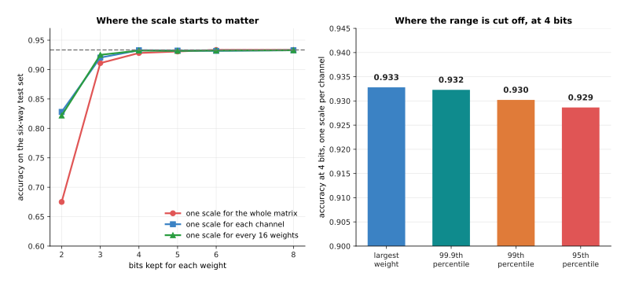
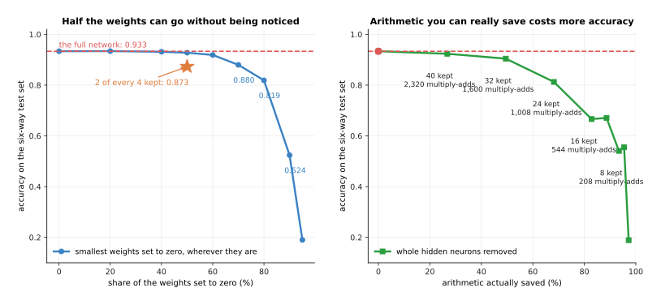

# Making a model smaller and faster

The page before this one, [fine-tuning and
adapters](03_fine-tuning-and-adapters.md), ended with a model that does your job, and
it quietly assumed the model could be run at all. On a desk with a graphics card that
assumption is safe. On a robot it is not, because a robot carries a small computer
with a few gigabytes of memory and has to answer in a few tens of milliseconds so the
arm keeps moving. So this page is about the step after fine-tuning, which is making a
trained model small enough and fast enough to live on the machine that uses it.

There are three methods, and they are not alternatives, because they work on
different things and they stack. **Quantisation** stores each weight in fewer bits.
**Distillation** trains a smaller model to copy a larger one. **Pruning** throws
weights away. Running a model on the robot's own computer rather than on a server is
called **edge inference**, and everything here is in service of that.

It assumes you have read the chapter so far, so you know what a parameter is, what a
floating-point operation (FLOP) is, and what the softmax turns a model's raw outputs
into. The one new idea is that a number does not have to be stored in 32 bits, and
section 2 builds that from nothing.

Every number in the pictures is worked out by
`docs/diagrams/pretraining_and_adapting_2.py`. The parameter counts and memory sizes
are exact arithmetic on one stated transformer shape, 32 blocks of width 4096 with a
feed-forward inner width of 11008 and a vocabulary of 32000. The memory bandwidth, the
arithmetic rate and the robot's memory are stated assumptions. The quantisation,
distillation and pruning experiments are real runs on a small network trained in NumPy
on simulated readings of six objects.

## Contents

1. [What has to fit on the robot's own computer](#1-what-has-to-fit-on-the-robots-own-computer)
2. [Quantisation from first principles](#2-quantisation-from-first-principles)
3. [Where the scale comes from, and when to choose it](#3-where-the-scale-comes-from-and-when-to-choose-it)
4. [Distillation: learning from the teacher's whole answer](#4-distillation-learning-from-the-teachers-whole-answer)
5. [Pruning, and why scattered zeros are rarely faster](#5-pruning-and-why-scattered-zeros-are-rarely-faster)
6. [What each method costs and what it buys](#6-what-each-method-costs-and-what-it-buys)
7. [Where to read next](#7-where-to-read-next)
8. [Using it in Python](#8-using-it-in-python)

---

## 1. What has to fit on the robot's own computer

Before choosing a method it is worth being exact about what is too big, because the
answer is not one thing but three: the model has to fit in memory, it has to be read
from memory fast enough, and it has to be worked through inside the time the arm
leaves it. The stated model from the last page, with 6,738,415,616 parameters, fails
all three.


The four bars are the same model stored four ways, and the two lines are a small
robot computer with 8 GiB of memory shared with everything else and a desktop
graphics card with 24 GiB.

Stored at 32 bits a weight the model needs 25.10 GiB, which fits on neither, and at 16
bits it needs 12.55 GiB, which fits on the card but not the robot. At 8 bits, plus a
small allowance for the scales that section 3 explains, it needs 6.47 GiB, which fits
inside 8 GiB with very little room for anything else, and at 4 bits it needs 3.33 GiB,
the first size that leaves the robot room for its pictures, its own program and the
model's working memory at once.

Memory is not only a question of fitting, because the model has to be read as well as
stored, and reading it usually sets the speed.


Writing one word with a transformer reads every weight in the model exactly once, so
the time that takes is simply the size of the weights divided by how fast the machine
can read memory, assumed here to be 100 GB a second.

At 16 bits a weight the model is 13.48 GB, so reading it once takes 134.8 ms and
allows at best 7.4 words a second, while at 8 bits it takes 69.5 ms and allows 14.4,
and at 4 bits it takes 35.8 ms and allows 27.9. Nothing in that calculation involves
arithmetic at all, which is the point, because a model writing one word at a time is
usually waiting for memory rather than for multiplication, and that is why fewer bits
makes it faster as well as smaller.


The left panel is how long one decision may take if the arm asks for a new command a
given number of times a second, and the right panel turns that into words of this
model, assuming the robot's accelerator does 20 TFLOP a second.

A forward pass costs about 13.5 GFLOP for each word, so a loop running 10 times a
second leaves 100 ms, which is 2,000 GFLOP or about 148 words, and a loop running 30
times a second leaves 33 ms, which is about 49 words with nothing left for the camera,
the planner or the safety checks. So a large model cannot sit inside a fast control
loop and has to be called less often with its answers reused, which is one reason the
action-chunking idea exists in [models that
act](../12_models-that-act/01_behaviour-cloning-and-action-chunks.md).

---

## 2. Quantisation from first principles

The first picture in section 1 assumed that a weight could be stored in 8 bits or 4,
so this section says exactly what that means and what it costs, using 48 real weights
taken from one output channel of a network that was actually trained.

A weight is normally stored as a float32, which is 32 bits holding a very wide range
of values to about seven decimal places. That precision is wasted, because the
weights in one channel of a trained network all sit in a narrow band, and in the
column used here the smallest is -0.47174 and the largest is +0.57539, so the largest
size of any of them is 0.57539. **Quantisation** uses that fact, because it picks a
**step size**, replaces each weight by the whole number of steps nearest to it, and
stores only that whole number.


Both lines cover the same range, from -0.57539 to +0.57539, and the only difference
is how finely it is cut.

A 4-bit signed integer holds the whole numbers from -7 to +7, which is 15 levels, so
the step is 0.57539 divided by 7, which is 0.082199, while an 8-bit integer holds -127
to +127, which is 255 levels and a step of 0.004531. The number every integer is
multiplied by to get a weight back is called the **scale**, and here it is the step
size itself.


Each blue point is a weight as it was trained, and each red square is where it ends up
once it has been turned into a 4-bit integer and back again.

Take the first weight, which is +0.1071. Dividing by the 4-bit step of 0.082199 gives
1.30, which rounds to the integer 1, so what is stored is the single number 1, and
reading it back gives 0.0822. The same weight at 8 bits divides by 0.004531 to give
23.6, which rounds to 24 and reads back as 0.1087. The first eight weights become the
integers 1, 3, 2, 2, 0, 2, 5 and 4 at four bits, and 24, 49, 42, 31, 9, 40, 100 and
73 at eight bits. The fifth is worth noticing, because +0.0387 becomes the integer 0
at four bits and so reads back as exactly nothing, which is the cost of quantisation:
the weights come back changed.


Each pair of bars is one weight, and the bar is how far the read-back value is from
the value that training left there.

At 4 bits the worst weight is out by 0.040540 and the root-mean-square error over the
48 is 0.024840, while at 8 bits the worst is out by 0.002239 and the root-mean-square
error is 0.001341, which is 19 times smaller. That ratio is no accident, because every
extra bit doubles the number of levels and so halves the step.


The vertical axis is on a log scale, so a straight line means that each extra bit
multiplies the error by a fixed factor, and here that factor is close to a half.

The error is 0.1706854 at two bits, 0.0248399 at four, 0.0013408 at eight and
0.0003551 at ten, so going from eight bits to four multiplies it by 18.5, which is
why 8-bit storage is usually described as free and 4-bit storage is not. Whether that
error matters is a separate question that section 3 answers by measuring accuracy
instead, because a network can absorb a surprising amount of noise in its weights.

---

## 3. Where the scale comes from, and when to choose it

Section 2 used one scale for one column of weights, and that was a choice rather than
a necessity, so this section shows what the choice is worth and then asks whether the
squeezing should happen after training or during it.


Each bar is one output channel of a real trained weight matrix, and its height is the
largest weight in that channel, which is what a scale for that channel would be set
by.

If the whole matrix shares one scale, that scale is set by the single largest weight
anywhere in it, which here is 0.980, and every channel whose own largest weight is
0.45 then uses less than half of the levels available to it. Giving each channel its
own scale fixes that, and it is called **per-channel quantisation**. The lower panel
shows why it matters so much, because real trained networks often have a few channels
whose weights are much larger than the rest, and here one channel has been made eight
times louder to show the effect, which drags the single shared scale up to 4.491 and
wastes most of the levels for every other channel.


The bars are the error left in the weights after quantising to 4 bits and reading
them back, as a share of the typical size of the weights themselves.

On the matrix as trained, one scale for the whole matrix leaves 15.5% error, one per
channel leaves 10.3%, and one for every group of 16 weights leaves 8.6%. On the
matrix with one loud channel the shared scale leaves 51.9%, which is a ruined matrix,
while the per-channel scale leaves 10.9% and the grouped scale 9.3%, barely different
from before. So finer scales cost a little storage, as the last page's QLoRA figures
showed, and they buy protection from exactly the unevenness trained networks have.

The second question is when the squeezing happens. **Post-training quantisation**
means training the model normally and squeezing the finished weights, which is what
everything above has done. The alternative is to let the model know during training
that its weights will be squeezed, by rounding them in the forward pass while still
updating the unrounded copies, so that training settles on weights that survive
rounding, and that is called quantisation-aware training.


The two lines are the same small network measured on the same test set, and the
dashed line is what it scored before anything was squeezed.

The network scores 0.933 in full precision. Squeezed after training with one scale
per channel it still scores 0.933 at 8 bits, 0.933 at 4 bits and 0.920 at 3 bits, and
only at 2 bits does it fall to 0.828, while trained with the squeezing switched on it
scores 0.927 at 3 bits and 0.914 at 2. So the extra work is worth nothing until the
weights get very small indeed, and then it is worth 0.086, which means post-training
quantisation is what you reach for first and quantisation-aware training is what you
reach for when 4 bits is not small enough.



The left panel repeats the choice of scale as accuracy rather than error, and the
right asks where the range should be cut off.

Measured as accuracy, the choice of scale makes no difference down to 4 bits, where a
shared scale gives 0.928 against 0.933 for a scale per channel, and an enormous
difference at 2 bits, where a shared scale gives 0.675 against 0.828. The right panel
tests the other obvious idea, which is to ignore the few largest weights and set the
scale from, say, the 99th largest out of a hundred, so the ordinary weights get finer
steps. On this network it does not help, because the largest weight gives 0.933 and
the 95th percentile gives 0.929. Cutting off the range only pays when a few extreme
values are stretching it, and per-channel scales already deal with that.

---

## 4. Distillation: learning from the teacher's whole answer

Quantisation keeps the model and shrinks its numbers, which has a floor, because
below about 3 bits a weight the accuracy goes. The other direction is to keep the
numbers and shrink the model, and the way to do that without simply training a small
model badly is **distillation**, which means training a small model to copy a large
one. The large model is the **teacher** and the small one the **student**.

The obvious way to train a small model is on the same labelled examples the teacher
saw, and distillation does something better, for a reason worth seeing on one real
example.


The left panel is what the hard label tells the student about this example, and the
right panel is what the teacher tells it about the same example.

The example's true class is 5. The hard label is a 1 in one place and a 0 in the other
five, and that is the whole message. The teacher's raw outputs are +19.76, -2.89,
-3.20, -10.16, -14.66 and +22.30, which the softmax turns into 0.927 for class 5 and
0.073 for class 0, with the other four effectively zero. So the teacher says something
the label cannot, which is that this reading is a class 5 but looks a little like a
class 0 and nothing like the rest. These probabilities are called **soft targets**,
and measured as information the teacher's answer carries 0.378 bits while the hard
label carries none beyond naming the class.


The left panel shows the same teacher answer flattened by five different
temperatures, and the right panel measures how much it then carries.

The trouble with soft targets is that a well-trained teacher is usually very sure, so
most of its answers are nearly a 1 and five nearly-zeros, and the extra information
hides in numbers too small to matter to the training. Dividing the raw outputs by a
number greater than one before the softmax flattens the answer, and that number is the
**temperature**. At temperature 1 this example gives 0.927 and 0.073 and carries 0.378
bits, at temperature 3 it gives 0.699 and 0.300 and carries 0.886 bits, and at
temperature 8 it gives 0.544 and 0.396 and carries 1.361 bits. The student is trained
on the flattened answer and then used normally, so the temperature exists only during
training.


Both lines are the same small student network, trained on the same examples, with the
only difference being what it was told to aim at, and the dashed line is the teacher
it is copying.

With 20 examples the student reaches 0.750 from hard labels and 0.812 from the
teacher's answers, with 40 it reaches 0.844 and 0.895, and with 640 the two meet at
0.920 and 0.922. That is the whole story in one picture, because the teacher's answer
carries more information per example, so it is worth most when examples are few and
worth nothing once there are enough for the hard labels to say the same thing. The
second useful consequence is that distillation examples need no labels at all, since
the teacher supplies the target, so you can distil on any pile of unlabelled
recordings you have.


The three panels are what the student saves and what it gives up, measured on the
same test set.

The teacher holds 3,270 parameters and does 3,168 multiply-adds for one decision, and
the student holds 158 and does 144, so it is 20.7 times smaller and does 22.0 times
less arithmetic, and for that it gives up 0.011 of accuracy, scoring 0.922 against
0.933. The trade is good because the student was not trained on the task from
nothing, but to copy a model that had already found a good answer, which is a much
easier thing to learn.

---

## 5. Pruning, and why scattered zeros are rarely faster

Distillation builds a smaller model from scratch, which takes a training run.
**Pruning** instead takes the model you already have and throws weights away, which
sounds cheaper, and this section explains why it usually is not. The simplest kind is
magnitude pruning, which sets the smallest weights to zero on the grounds that a
weight near zero was barely contributing, and the question is what that buys.


The three pictures show the same matrix pruned in two different ways, with the number
of multiply-adds each one actually costs written underneath.

The middle picture has half its weights set to zero, but the matrix is still 24 by 24,
so the hardware still performs 576 multiply-adds, because an ordinary matrix
multiplication has no way to skip zeros. This is **unstructured sparsity**, and it
saves nothing unless the library and the chip both know how to skip. The right-hand
picture removes twelve whole output channels, so the matrix really is 24 by 12 and
really does cost 288 multiply-adds, and that is **structured pruning**, which is what
actually makes a model faster.



The left panel prunes weights wherever they happen to be, and the right panel removes
whole hidden neurons so that the saving is real, which is why the horizontal axes are
labelled differently.

Pruning wherever you like is remarkably forgiving, because the network scores 0.933
whole, 0.928 with half its weights zeroed and 0.880 with 70% zeroed, and it collapses
only past 90%, where it reaches 0.524. Removing whole neurons costs much more for the
same saving, because keeping 32 of the 48 hidden neurons saves 49.5% of the arithmetic
and costs 0.029 of accuracy, while keeping 16 saves 82.8% and costs 0.267. So the
sparsity you can use is far more expensive than the sparsity you cannot.


The middle road is a pattern regular enough that hardware can be built to skip it,
and the usual one keeps exactly two weights out of every run of four.

In the first group the weights are +0.107, +0.221, +0.188 and +0.143, so the two
largest are kept and the other two set to zero. This is called 2:4 sparsity, it is
exactly 50% zeros, and some recent graphics hardware can skip it and run such a matrix
about twice as fast. It costs 0.873 accuracy against 0.928 for the same share dropped
freely, so forcing the zeros into a pattern cost 0.055. That is the whole choice: free
sparsity is cheap in accuracy and worthless in speed, patterned sparsity costs some
accuracy and pays back in speed, and removing whole channels costs the most and pays
back on any hardware at all.

---

## 6. What each method costs and what it buys

The three methods have now been measured one at a time on the same small network, so
this section puts them side by side and shows that they are not a choice but a
sequence.


Read each row as one thing done to the same 3,270-parameter network, whose own
accuracy is 0.933, with the last column saying whether the saving was measured here or
is an illustration of what real hardware would give.

The rows that cost nothing are the quantisation ones, because 8-bit and 4-bit weights
with a scale per channel both score 0.933, and 2-bit weights with quantisation-aware
training score 0.914 for eight times less memory. Half the weights zeroed freely
scores 0.928 and saves nothing you can use. Keeping two of every four scores 0.873 and
would save up to two times on hardware that knows the pattern, which is the one row
whose saving is an illustration rather than a measurement. Keeping 32 of 48 hidden
neurons scores 0.904 for two times less of both, and distilling into a smaller student
scores 0.922 for 20.7 times less memory.


Every point is one method, placed by how much smaller it made the model and how much
accuracy it gave up, so the best methods are low down and far to the right.

The ranking is plain. Quantising to 8 or 4 bits sits on the bottom line, giving up
nothing, free pruning sits at one times smaller because it bought nothing, and
distillation is far to the right at 20.7 times for 0.011. The point furthest to the
right is not a method at all but two methods one after the other.


The five bars are the teacher at two precisions and the student at three, with the
bytes of weights on the left on a log scale and the accuracy on the right.

The float teacher's weights take 6,540 bytes and it scores 0.933, the distilled
student's take 316 bytes for 0.931, and squeezing that student to 4 bits takes it to
79 bytes and 0.930. So the two methods together give weights 83 times smaller and 22
times less arithmetic for 0.003 of accuracy, which neither reached alone, and that is
the order people use: distil first, because it changes the shape of the model, and
quantise afterwards, because it works on whatever shape it is given.

Two cautions belong with that number. The first is that this is a small network on a
simulated job, so the shape of the result is trustworthy and the exact figures are
not, and a real model has to be measured on its real job after every one of these
steps, which is what [running and evaluating a
model](../13_using-a-model-for-real/01_running-and-evaluating-a-model.md) is about.
The second is that memory saved is not automatically time saved, because a 4-bit
weight has to be turned back into an ordinary number before it can be multiplied, and
whether that is free depends on whether the chip and the library support it. A model
four times smaller and no faster is a common and disappointing result, and the only
way to know is to time it.

---

## 7. Where to read next

- [Diffusion](../08_models-that-generate/01_diffusion.md) is the next page, and it
  starts a new chapter on models that generate something rather than name it.
- [Fine-tuning and adapters](03_fine-tuning-and-adapters.md) is the page before this
  one, and its QLoRA section uses quantisation for training rather than deployment.
- [Scale, data and compute](02_scale-data-and-compute.md) explains the FLOP counts
  behind section 1's speed arithmetic.
- [Running and evaluating a
  model](../13_using-a-model-for-real/01_running-and-evaluating-a-model.md) covers
  what happens next, which is exporting the squeezed model and measuring it honestly.
- [Vision backbones](../09_models-that-see/01_vision-backbones.md) is where the
  teacher and student of section 4 usually come from, because a small distilled vision
  backbone is the most common thing to put on an arm.
- [Running a model on a
  robot](../../07_learned-models/10_making-models-work-on-an-arm/02_most-used/02_running-a-model-on-a-robot.md)
  in the models catalogue gives the same subject from the robot's side.

---

## 8. Using it in Python

Section 2 worked out the step size and the integers by hand, and this section does the
same with PyTorch, because seeing the arithmetic written out removes most of the
mystery from the word quantisation.

```python
import torch

# Section 2: one real column of trained weights becomes 4-bit integers.
w = torch.tensor([0.1071, 0.2209, 0.1880, 0.1426, 0.0387, 0.1818, 0.4511, 0.3308])
amax = 0.57539                       # the largest size in the whole column
scale4 = amax / 7                    # a 4-bit signed integer runs from -7 to +7
q4 = torch.clamp(torch.round(w / scale4), -7, 7)
print(q4.tolist())                   # [1.0, 3.0, 2.0, 2.0, 0.0, 2.0, 5.0, 4.0]
print(f'{(q4 * scale4 - w).abs().max():.4f}')    # 0.0401, the worst of these eight

# Section 3: one scale for the whole matrix against one scale for each channel.
m = torch.randn(48, 48) * 0.3
m[:, 7] *= 8.0                                   # one loud channel
def rms(a): return a.pow(2).mean().sqrt()
def quant(x, s): return torch.clamp(torch.round(x / s), -7, 7) * s
flat = quant(m, m.abs().max() / 7)
per_channel = quant(m, m.abs().amax(dim=0, keepdim=True) / 7)
print(f'{rms(flat - m) / rms(m):.3f}  {rms(per_channel - m) / rms(m):.3f}')

# Section 4: the soft targets a teacher gives, at two temperatures.
logits = torch.tensor([19.76, -2.89, -3.20, -10.16, -14.66, 22.30])
print([f'{v:.3f}' for v in torch.softmax(logits, 0)])
# ['0.073', '0.000', '0.000', '0.000', '0.000', '0.927']
print([f'{v:.3f}' for v in torch.softmax(logits / 3, 0)])
# ['0.300', '0.000', '0.000', '0.000', '0.000', '0.700']
```

The first block is section 2 exactly, and its printed integers and worst error are the
numbers the pictures carry. The second is section 3's comparison, run on a random
matrix rather than a trained one, so the printed fractions will not match the measured
51.9% and 10.9%, although the gap between them will be of the same kind. The third is
section 4's example, and the two printed lists are the first and third rows of the
temperature picture, with the last digit differing because the raw outputs are written
here to two decimal places.

What the libraries do is all of that, written out efficiently and for a whole model at
once. In PyTorch the usual route is `torch.ao.quantization` for 8-bit work,
`bitsandbytes` for the 4-bit weights QLoRA uses, and an export to a runtime such as
ONNX Runtime or TensorRT when the model goes on a robot. Distillation needs no special
library, because the training loop is an ordinary one with a different target, and
`torch.nn.utils.prune` sets weights to zero while leaving the shapes alone, so the
actual shrinking of the matrices is something you do yourself.

What you still decide is the part no library can. You choose how many bits, and
section 3 showed that 8 is free, 4 is nearly free and 2 needs a training run. You
choose how finely the scales are shared. You choose whether to distil, which costs a
training run and a teacher but reaches savings quantisation cannot. And you decide
what accuracy you will give up, which is a question about your robot rather than your
model, because the difference between 0.933 and 0.922 means nothing until somebody
says what a failed grasp costs.
