# Diffusion: making an answer out of noise

The page before this one, [making a model smaller and
faster](../07_pretraining-and-adapting/04_making-a-model-smaller-and-faster.md),
finished the run of pages about getting a trained model ready to use, and every
one of those pages quietly assumed that the model's job was to look at an input
and give back the one right answer. This page is where that assumption breaks,
because a great many of the jobs a robot arm has to do have several right
answers at once, and a model that gives back one answer for them gives back a
wrong one.

So this page answers three questions. Why is making something up a different
job from predicting it? How does a **generative model**, which is a model that
produces a whole new example rather than a single answer, actually work? And
what does the most widely used kind, called **diffusion**, cost you in time?

It is for a reader who knows what a [neural
network](../02_inside-a-network/01_one-neuron.md) is, what a
[loss](../03_how-training-works/01_the-score-of-being-wrong.md) is and what
[training](../03_how-training-works/04_the-training-loop.md) does, and who has
met no generative model before, so every word is explained where it appears.

Everything below is worked through on one small example that you can see all of
at once: a robot arm moves its gripper past a round obstacle, and the recorded
demonstrations go either above it or below it, so each waypoint is a point in
two dimensions and every step of the method can be drawn rather than described.
The data is simulated, and every number in every picture is worked out and
printed by `docs/diagrams/models_that_generate.py`, including the timings,
which were measured on the machine that drew the pictures.

## Contents

1. [Why generating is a different job from predicting](#1-why-generating-is-a-different-job-from-predicting)
2. [Adding noise, one small step at a time](#2-adding-noise-one-small-step-at-a-time)
3. [Training one network to name the noise](#3-training-one-network-to-name-the-noise)
4. [The reverse walk, from a round blob back to the arcs](#4-the-reverse-walk-from-a-round-blob-back-to-the-arcs)
5. [Conditioning: the same denoiser told what to make](#5-conditioning-the-same-denoiser-told-what-to-make)
6. [Guidance: pushing further in the direction the condition adds](#6-guidance-pushing-further-in-the-direction-the-condition-adds)
7. [The cost: many passes through the network instead of one](#7-the-cost-many-passes-through-the-network-instead-of-one)
8. [Where to read next](#8-where-to-read-next)
9. [Using it in Python](#9-using-it-in-python)

---

## 1. Why generating is a different job from predicting

Everything in this book so far has trained a model by showing it an input,
asking for an answer and scoring how far that answer was from the right one.
That works whenever there is one right answer, but it falls apart as soon as
there are two, and the example below is the smallest honest case of that.

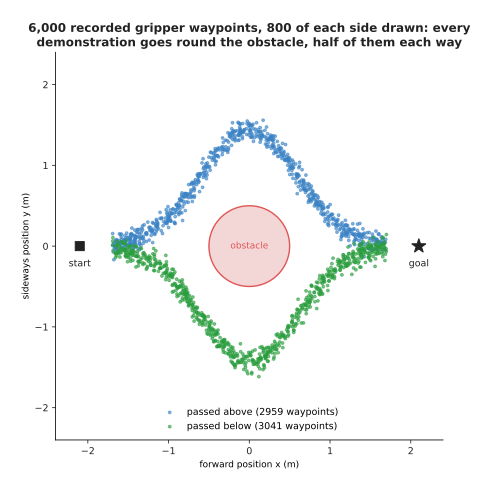

The 6,000 recorded gripper waypoints form two separate arcs, because 2,959 of the demonstrations went above the obstacle and 3,041 went below it.

The arm starts on the left, finishes on the right and must not touch the round
obstacle in the middle, which has a radius of 0.5 m. Both ways round are
correct, nobody prefers one, so the recorded demonstrations hold both, and
their spread is 0.984 m across and 0.793 m up. Now look at where the two
answers are furthest apart, which is directly above and below the obstacle.

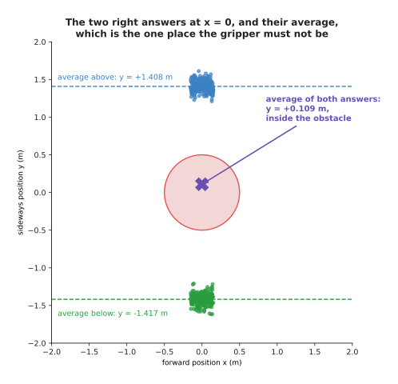

In the narrow band where x is within 0.15 m of zero, the waypoints above average y = +1.408 m and those below average y = -1.417 m, and the average of all of them together sits at y = +0.109 m, inside the obstacle.

There are 275 waypoints above in that band and 234 below, which is why their
average is not exactly zero, but it makes no difference: the average answer is
0.109 m from the centre of an obstacle of radius 0.5 m, so it is well inside
the one place the gripper must never be. The two right answers are both far
from the obstacle, and the thing halfway between them is in it. A model trained
in the ordinary way does not merely risk that answer, it is driven to it.

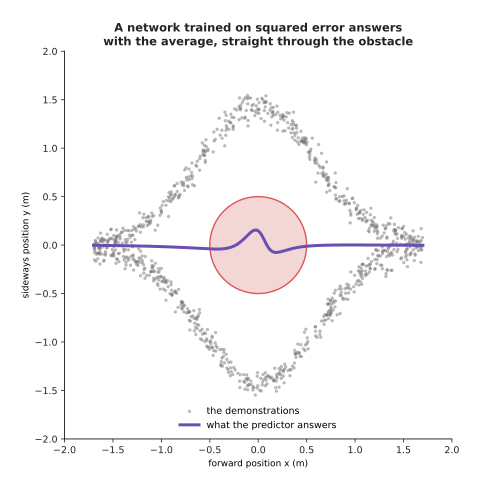

A network trained to predict the sideways position from the forward position settles on the average, which spends 29.4 per cent of its path inside the obstacle, because that answer scores 0.628 against 1.257 for always choosing the upper arc.

The curve the network learned never leaves the band between -0.076 m and
+0.155 m anywhere near the obstacle, so it is effectively the straight line
through the middle, and that is not a failure of training, because squared
error rewards being close to every example and the single number closest to all
of them at once is their average. The last picture of this section shows that
by trying every possible single answer and scoring each one.

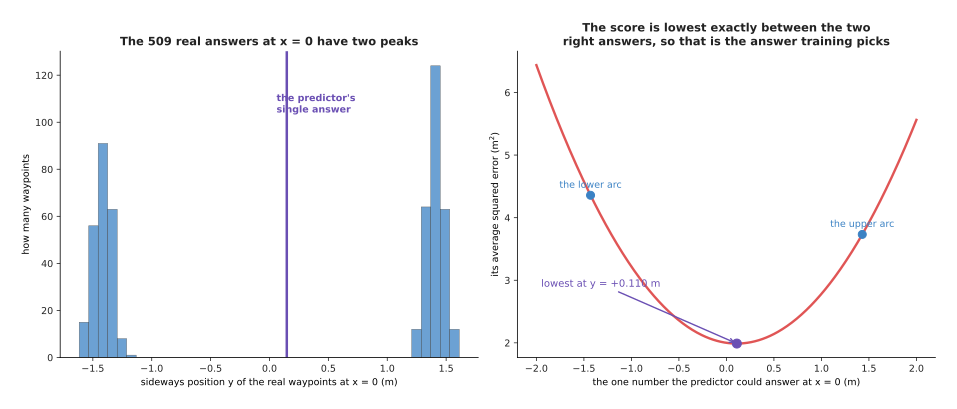

Scoring every possible single answer against the 509 real waypoints in the band gives a curve whose lowest point is y = +0.110 m with a score of 1.988, while answering the upper arc at y = +1.43 m scores 3.732.

So the answer the method prefers is nearly twice as good, by its own score, as
either of the answers a person would accept, and no amount of extra data,
extra layers or extra patience changes that, because the problem is the
question rather than the model. What is needed is a model asked to produce one
answer drawn from the whole set of right ones, and the rest of this page builds
one.

---

## 2. Adding noise, one small step at a time

A generator has to turn something easy into something hard, starting from a
shape nobody had to learn, such as plain round random noise, and finishing on
the shape the data actually has. Diffusion builds that journey backwards, by
first destroying the data in small steps and writing down exactly what it did,
and then training a network to undo one of those steps at a time. Destroying it
needs no learning, because each step just shrinks the point a little towards
zero and mixes in a little fresh noise, and after enough steps nothing of the
original is left.

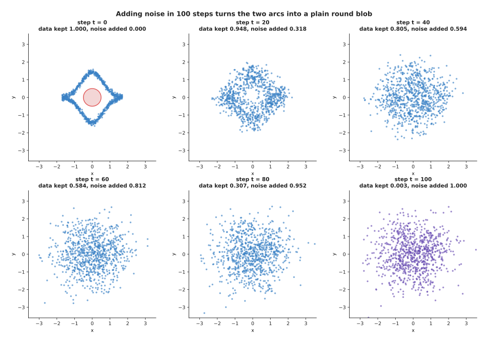

The same 900 waypoints after 0, 20, 40, 60, 80 and 100 noise steps, as the multiplier on the data falls from 1.000 to 0.003 and the one on the noise rises to 1.000.

Nothing in that picture is a network, because at step t the noisy point is just
the real waypoint multiplied by one number plus a fresh random draw multiplied
by another, and the pair of numbers is fixed in advance for every step. That
fixed pair, read off step by step, is called the **noise schedule**.

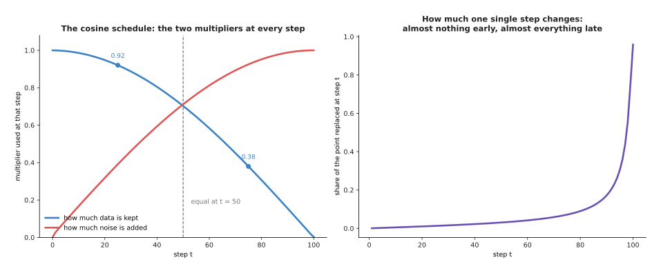

The schedule used here keeps 0.986 of the data at step 10, 0.920 at step 25, 0.703 at step 50, 0.380 at step 75 and 0.003 at step 100, and the two multipliers are equal at step 50, where each is 0.703.

The left half of that picture is the schedule as the forward process uses it,
jumping straight from the real data to step t, while the right half is the same
schedule read one step at a time, which shows that a single early step barely
changes the point while the largest single step replaces 0.959 of it at step
100. That matters later, because the network finds the late steps easy and the
early ones hard. It helps to watch one waypoint rather than the whole cloud.

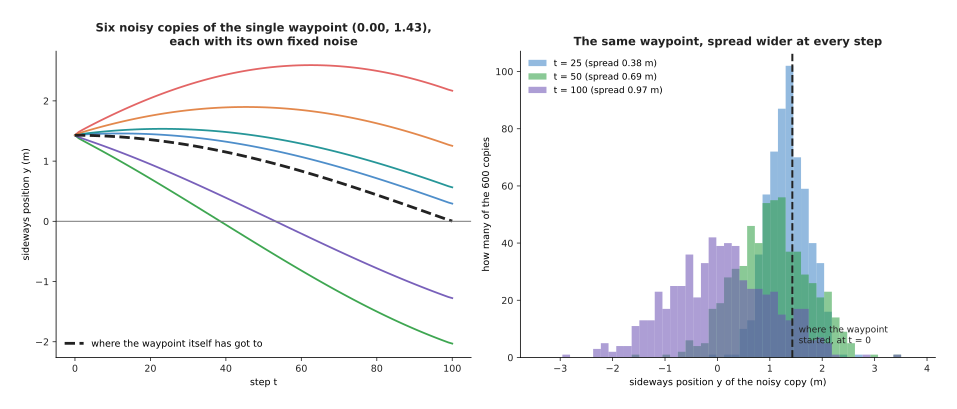

One waypoint at (0.00, 1.43) m has noisy copies that still average +1.338 m with a spread of 0.379 m at step 25, and by step 100 they average +0.061 m with a spread of 0.970 m.

Each coloured line is the same waypoint with one fixed random draw, and the
dashed line is where the waypoint itself has got to once it has been shrunk, so
the point is pulled steadily towards zero while the noise around it grows and
by the end its original position has no influence worth measuring. That end
state is where the generator will start, so it is worth checking that it really
is plain noise rather than something that still remembers the arcs.

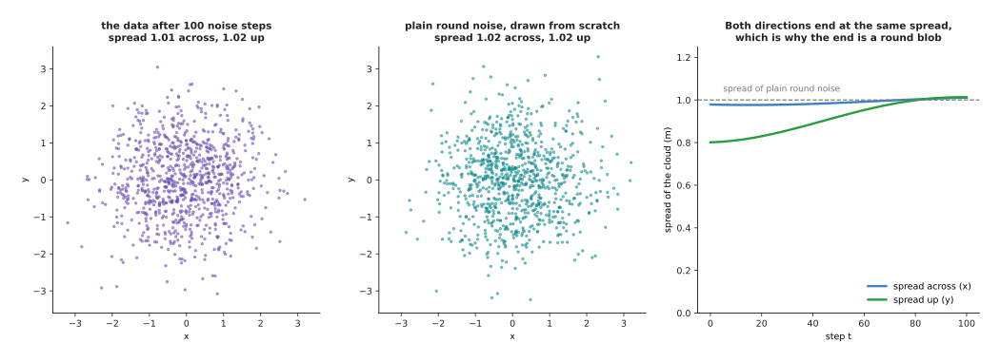

After 100 steps the noisy data has an average of (+0.000, -0.023) and spreads of 1.014 and 1.020, while freshly drawn round noise averages (+0.048, +0.008) with spreads of 1.016.

The mismatch score between those two clouds is 0.0017, against 0.0014 for two
halves of the real data compared with each other, and that second number is the
floor: it is what you get when two sets of points really do come from the same
place. The mismatch score used throughout this page is one number that is near
zero when two clouds of points look alike and grows when they do not. So after
100 steps the data is indistinguishable from noise, which means a generator can
start from noise without having cheated.

---

## 3. Training one network to name the noise

The forward process of the last section added a known amount of known noise at
every step, so for any step there is a training example nobody had to label:
the noisy point, the step number, and the exact noise mixed in. One network is
trained to look at the first two and name the third.

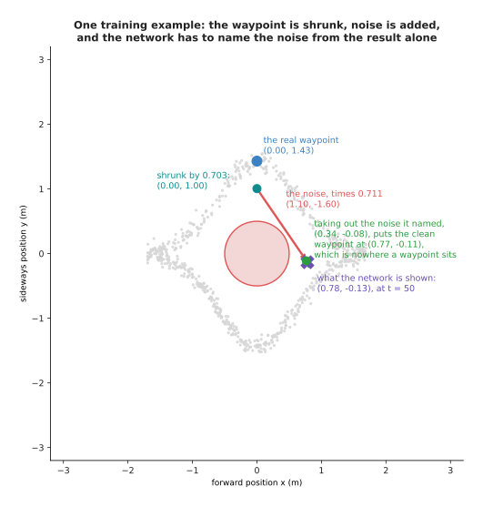

At step 50 the waypoint (0.00, 1.43) is shrunk by 0.703 and a noise draw of (1.10, -1.60) is added with multiplier 0.711, giving the point (0.78, -0.13).

The network is handed (0.78, -0.13) with the step number and answers
(0.34, -0.08), while the real noise was (1.10, -1.60), so it is a long way out,
and the dashed arrow shows the consequence: taking the named noise back out
puts the clean waypoint between the two arcs rather than on either of them.
Training is otherwise an ordinary training loop, in which each step picks a
batch of real waypoints and a random step number for each, builds the noisy
version, and scores the network on the squared difference between the noise it
named and the noise really added.

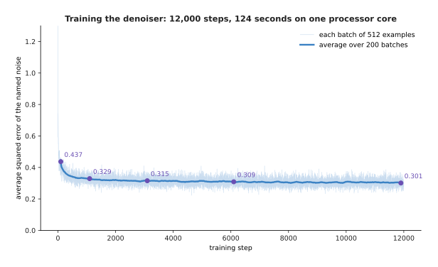

Twelve thousand training steps on batches of 512 examples take about two minutes on one processor core, and the average squared error falls from 0.437 to 0.301.

The curve flattens at 0.301 rather than at zero, and no amount of further
training brings it down, because a large part of that number is not a mistake.
The next picture shows where it comes from.

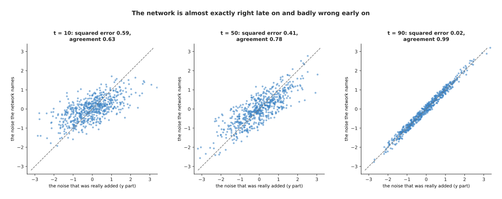

At step 10 the squared error is 0.59 and the agreement with the real noise, measured by correlation, is 0.63, while at step 90 the error is 0.02 and the agreement is 0.99.

At step 90 almost nothing of the waypoint is left, so the point the network is
shown is nearly the noise itself and it can read the answer off. At step 10 the
opposite holds, because the point is almost the original waypoint and many
different small noises could have produced it from many different nearby
waypoints, so the best the network can do is answer the average of them and the
leftover error is the spread of the possibilities rather than a failure.

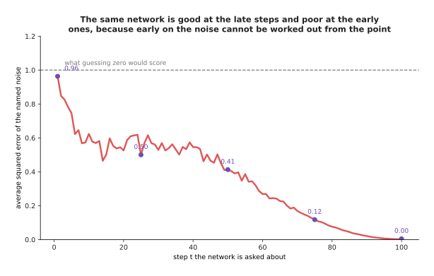

The error is 0.96 at step 1, 0.50 at step 25, 0.41 at step 50, 0.12 at step 75 and 0.005 at step 100, so the hardest step is the first one.

Guessing zero every time would score 1.0, so at step 1 the network is barely
better than useless while at step 100 it is nearly perfect, and one network
covers all of them because the step number is one of its inputs, which is what
lets a single trained model be used a hundred times in a row with a different
job each time.

---

## 4. The reverse walk, from a round blob back to the arcs

Now the pieces fit together. Start from a point of plain round noise, which
section 2 showed is what step 100 looks like, ask the network what noise is in
it, take some of that noise back out, add a smaller amount of fresh noise, and
the result looks like step 99. Repeat ninety-nine more times.

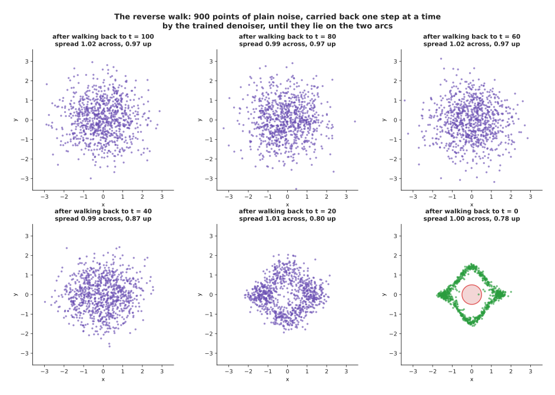

Nine hundred points of pure noise walked back one step at a time, with 11.9 per cent inside the obstacle at step 100, 9.4 per cent at step 40, 2.7 per cent at step 20 and 0.1 per cent at the end.

The shape appears late, because two thirds of the way back the cloud is still
round and only in the last twenty steps do the points pull apart into the two
arcs and clear the obstacle, which is another way of seeing that the early
steps carry most of the fine detail. Here is one step written out in full.

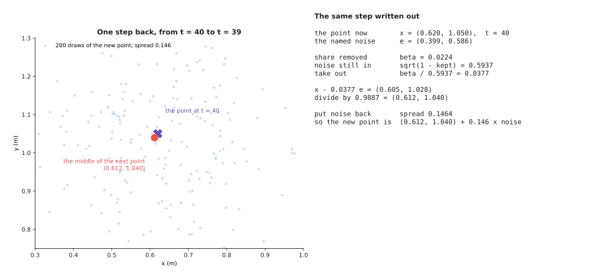

Going back from step 40 to 39 for the point (0.620, 1.050), the network names the noise (0.399, 0.586), the share removed is 0.0224, the new middle is (0.612, 1.040), and fresh noise of spread 0.146 goes on top.

The step barely moves the middle of the point, from (0.620, 1.050) to
(0.612, 1.040), and yet the fresh noise added on top has a spread of 0.146,
which is many times that movement, so a single step looks almost like pure
randomness and only the hundred steps together add up to a shape. That is also
why the path a point takes is such a wandering one.

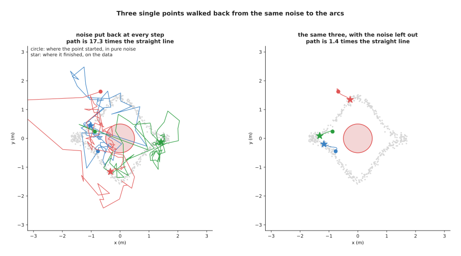

With fresh noise put back at every step, three points travel 27.9 m on average to cover 2.0 m of ground, a ratio of 17.3, while the same three with the noise left out travel 0.66 m to cover 0.48 m, a ratio of 1.38.

The right-hand panel is the same model and the same starting points with the
fresh noise left out, so that only the correction is kept, and the path becomes
short and smooth, which is the first hint that most of the hundred steps are
not buying anything. The next page follows that hint, but first the walk has to
produce the right points at all.

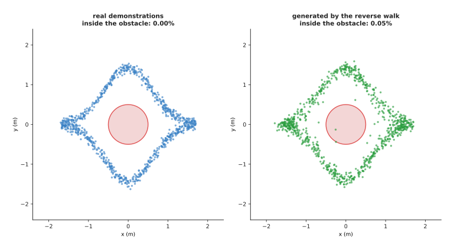

Two thousand generated waypoints score a mismatch of 0.0021 against a floor of 0.0014, sit 0.0237 m from the nearest real waypoint, split 47.3 per cent above, and put 0.05 per cent inside the obstacle.

Compare that last number with the 29.4 per cent of section 1. The predictor
spent nearly a third of its path in the obstacle because it answered the
average, while the generator keeps almost everything out of it because it
answers whole examples instead, and it keeps both ways round, roughly half and
half, which no single answer can do.

---

## 5. Conditioning: the same denoiser told what to make

A generator that produces a fair sample of everything in the data is a curious
object rather than a useful one, because a robot is not asked for a typical
waypoint but for one that suits the situation in front of it. Making that
possible is called **conditioning**, and it needs no new idea, because the
extra information is simply handed to the denoiser alongside the noisy point
every time it is asked.

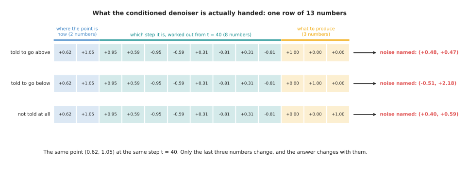

The denoiser takes one row of 13 numbers, two for the point, eight from the step number and three saying what to produce, and at step 40 it names (+0.48, +0.47) when told above, (-0.51, +2.18) when told below and (+0.40, +0.59) when not told.

Only three numbers changed between those rows, and the answer changed
completely. During training the condition is set to the true side of each
example, except on one example in five where it is set to "not told" instead,
so the same network learns both the conditioned job and the unconditioned one,
and that detail turns out to be the whole basis of section 6.

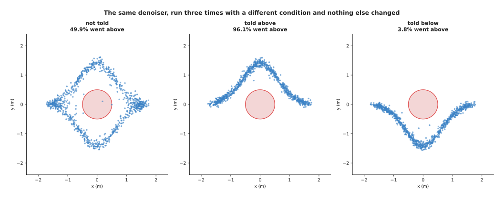

Run with no condition the model sends 49.9 per cent of its waypoints above, told to go above it sends 96.1 per cent and told to go below it sends 3.8 per cent.

The same trained weights produced all three panels, and the only difference
between the runs was three numbers in the input. This is what makes the method
useful on a robot, because the condition does not have to be a side label: it
can be the camera picture, the arm's joint angles and a sentence of
instruction, all turned into numbers and fed in the same way.

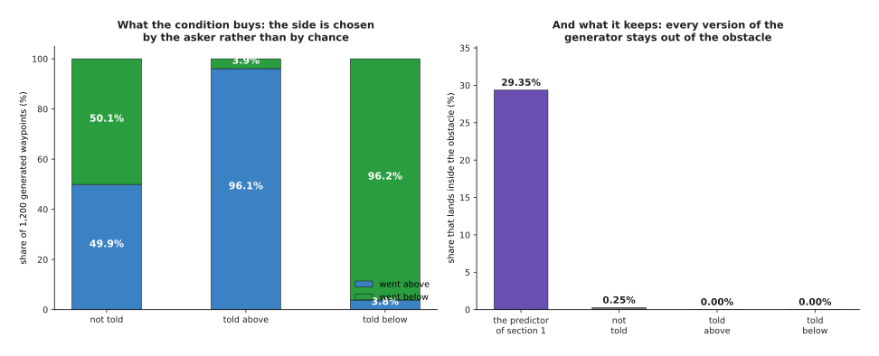

Choosing the side costs nothing in safety: the conditioned runs put 0.00 per cent of their waypoints inside the obstacle and the unconditioned run 0.25 per cent, against 29.4 per cent of the predictor's path in section 1.

So conditioning gives back the control that was lost by refusing to average,
because the asker picks which of the right answers they want while the model
still only produces answers the data supports. What it does not yet give is a
dial, since 96.1 per cent obedience is good but not certain, and the next
section is about the dial.

---

## 6. Guidance: pushing further in the direction the condition adds

Because the network was trained with the condition missing one time in five, it
can be run twice on the same point: once told what to produce and once not
told. The difference between the two answers is the part of the answer that the
condition is responsible for, and that difference can be multiplied by a number
larger than one before it is used. This is called **classifier-free guidance**,
and the number is the guidance strength.

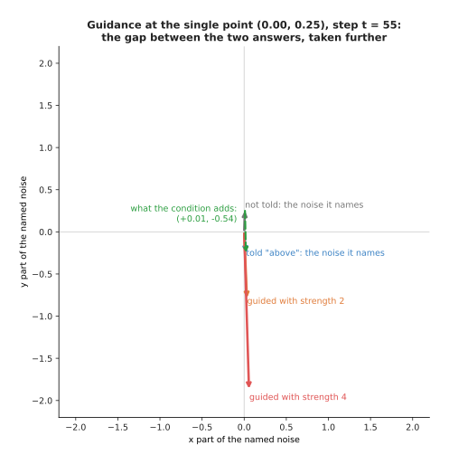

At (0.00, 0.25) and step 55 the network names (+0.01, +0.27) when not told and (+0.02, -0.27) when told above, so the condition contributes (+0.01, -0.54), and strength 2 gives (+0.03, -0.81) while strength 4 gives (+0.06, -1.88).

Strength 1 is the ordinary conditioned answer, because adding the whole
difference once to the untold answer gives the told answer back, and strength 0
is the unconditioned answer. Anything above 1 goes further than the network
itself asked to go, which is why the guided arrow at strength 4 is nearly seven
times the length of the untold one.

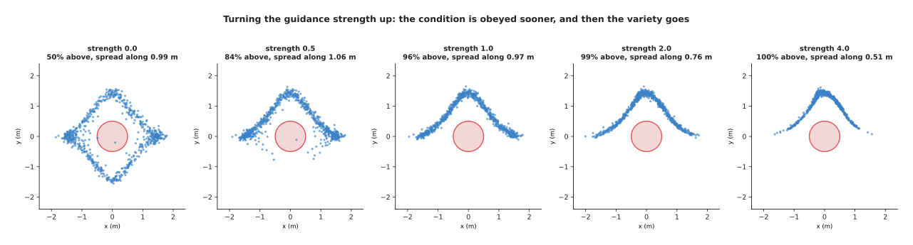

Asked for the upper arc at strengths 0, 0.5, 1, 2 and 4, the model sends 49.5, 83.6, 95.7, 99.0 and 100.0 per cent of its waypoints above, while the spread along the arc goes 0.994, 1.064, 0.966, 0.763 and 0.514 m against 0.999 m for the real upper arc.

So the dial works in both directions at once. Turning it up makes the condition
more reliably obeyed, which is what it is for, and it also squeezes the answers
towards the middle of what the condition asks for, which is not. By strength 4
every waypoint is on the right side, and they are bunched into roughly half the
stretch of path that the real demonstrations cover.

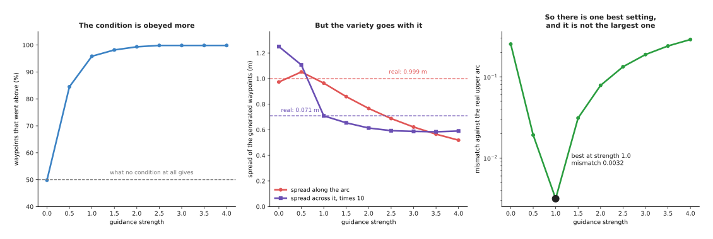

From strength 0 to 4 the obedience rises from 50 to 100 per cent while the spread along the arc falls from 0.973 m to 0.519 m, and the mismatch is lowest at strength 1 with 0.0032, against 0.2530 at strength 0 and 0.2881 at strength 4.

The last of those three charts is the one to remember, because there is a best
setting and it is neither end of the dial. On a robot the symptom of too much
guidance is a policy that always does the same thing even where the situation
calls for variety, and the symptom of too little is a policy that sometimes
ignores the instruction entirely, so most useful settings lie between about 1
and 3.

---

## 7. The cost: many passes through the network instead of one

Everything above has one price, and it is the same price throughout, because a
predictor runs the network once to produce an answer while a diffusion model
runs it once per step. The honest way to see what that buys is to generate the
same points with fewer and fewer steps and measure what happens.

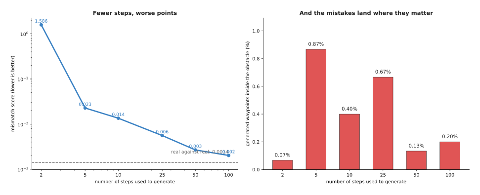

Generating with 2, 5, 10, 25, 50 and 100 steps gives mismatch scores of 1.586, 0.023, 0.014, 0.006, 0.003 and 0.002, and puts 0.07, 0.87, 0.40, 0.67, 0.13 and 0.20 per cent of the waypoints inside the obstacle.

Two steps is useless, five steps is already roughly the right shape, and after
about twenty-five the improvement is small. The obstacle figures count rare
events so they are noisier, but the five-step run is the worst at 0.87 per
cent, which on a real arm would be a collision about once in every hundred and
fifteen waypoints.

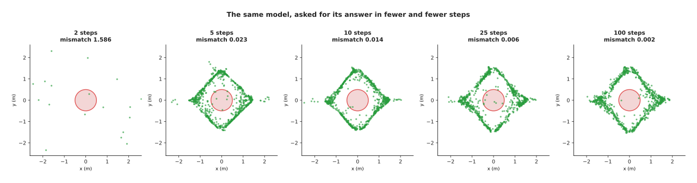

The same model asked for its answer in 2, 5, 10, 25 and 100 steps, with mismatch scores of 1.586, 0.023, 0.014, 0.006 and 0.002.

Time, unlike quality, is perfectly predictable, because every step is one pass
of the network and nothing else.

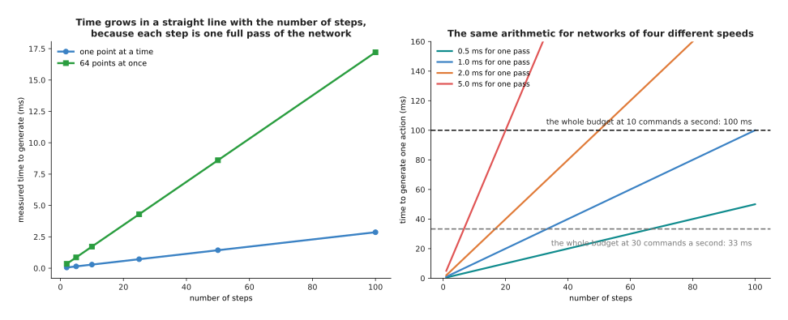

One pass over a single point was measured at 27.4 microseconds, so 2 steps take 0.055 ms, 25 take 0.684 ms and 100 take 2.736 ms, while 64 points at once cost 0.145 ms a pass, or 14.526 ms for 100 steps.

The network on this page is tiny, so its own timings are not a guide to
anything real, but the arithmetic is, and the right-hand chart does it for
networks of four plausible speeds. A robot arm taking a new command ten times a
second has 100 ms for each one, so a network needing 2 ms per pass fits fifty
steps and nothing else, while at thirty commands a second it fits sixteen and
at fifty commands a second it fits ten. Those numbers decide whether a
diffusion model can drive an arm at all, which is why
[diffusion policies](../12_models-that-act/02_diffusion-and-flow-policies.md)
care so much about the step count.

There are three ways out: use fewer steps and accept the loss, which the chart
above prices; make each pass cheaper, which is what [making a model smaller and
faster](../07_pretraining-and-adapting/04_making-a-model-smaller-and-faster.md)
is about; or change the method so that fewer steps are needed, which is where
the next page starts.

---

## 8. Where to read next

- [Flow matching and other
  generators](02_flow-matching-and-other-generators.md) is the next page, and it
  takes the hint from section 4 that most of the hundred steps were wasted.
- [Diffusion and flow
  policies](../12_models-that-act/02_diffusion-and-flow-policies.md) puts this
  page's machinery on a real arm, with camera pictures as the condition.
- [Vision backbones](../09_models-that-see/01_vision-backbones.md) explains how
  a camera picture becomes the numbers a conditioned denoiser is handed.
- [World models](../12_models-that-act/04_world-models.md) generates what the
  scene will look like after an action rather than what action to take.
- [Diffusion and flow policies in the model
  catalogue](../../07_learned-models/06_movement-models/02_most-used/03_diffusion-and-flow-policies.md)
  lists the named models of this kind that people run on arms.

---

## 9. Using it in Python

Sections 2, 3 and 4 built a noise schedule, trained a network to name the noise
and walked back one step at a time. The code below does all three on the same
problem in PyTorch, so each named idea can be seen to be a few lines rather
than a library. It is shortened to fit, so it trains for far fewer steps than
the model that drew the pictures.

```python
import torch
from torch import nn

T = 100                                              # section 2: how many steps
tt = torch.arange(T + 1) / T
f = torch.cos((tt + 0.008) / 1.008 * torch.pi / 2) ** 2
kept = (f / f[0]).clamp(1e-5, 1.0)                   # section 2: the schedule
print(f'{kept[50].sqrt():.3f}')                      # 0.703, as in section 2

net = nn.Sequential(nn.Linear(3, 128), nn.Tanh(),    # 2 for the point, 1 for t
                    nn.Linear(128, 128), nn.Tanh(),
                    nn.Linear(128, 2))               # section 3: names the noise
opt = torch.optim.Adam(net.parameters(), lr=2e-3)

for _ in range(4000):                                # section 3: the training loop
    x0 = waypoints[torch.randint(0, len(waypoints), (512,))]
    t = torch.randint(1, T + 1, (512,))
    eps = torch.randn_like(x0)
    xt = kept[t].sqrt()[:, None] * x0 + (1 - kept[t]).sqrt()[:, None] * eps
    loss = ((net(torch.cat([xt, t[:, None] / T], 1)) - eps) ** 2).mean()
    opt.zero_grad(); loss.backward(); opt.step()

x = torch.randn(1000, 2)                             # section 4: start from noise
for t in range(T, 0, -1):                            # section 4: the reverse walk
    eps = net(torch.cat([x, torch.full((1000, 1), t / T)], 1))
    beta = (1 - kept[t] / kept[t - 1]).clamp(0, 0.999)
    x = (x - beta / (1 - kept[t]).sqrt() * eps) / (1 - beta).sqrt()
    if t > 1:
        x = x + (beta * (1 - kept[t - 1]) / (1 - kept[t])).sqrt() * torch.randn_like(x)
```

The library gives you the automatic differentiation, the optimiser and the
layers, and nothing else here is hidden, because the schedule is four lines of
arithmetic, the training loop is six and the reverse walk is five. In practice
nobody writes those lines, because Hugging Face's `diffusers` package provides
the schedules as `DDPMScheduler` and `DDIMScheduler`, the reverse step as
`scheduler.step`, and ready-built denoisers such as `UNet2DModel` for pictures
and `UNet1DModel` for sequences of actions, while LeRobot ships a complete
diffusion policy for arms built on those pieces. Using them means your schedule
matches everybody else's, which matters because a sampler written for one
schedule gives wrong answers on another.

What you still have to decide is what no library chooses for you: how many
steps to train with, how many to generate with, how often to drop the condition
during training, and what guidance strength to use. Section 6 showed that the
last of those has a best value in the middle rather than at an end, and section
7 showed that the second is set by your control rate rather than your taste.
