# Vision backbones

The page before this one, [flow matching and other
generators](../08_models-that-generate/02_flow-matching-and-other-generators.md),
finished the chapter on models that make something new, by walking a cloud of
noise along a learned direction until it became a picture or a set of robot
movements. This chapter turns that round. A picture already exists, because a
camera on the robot took it, and the job is to work out what is in it, where it
is, and which pixels belong to it. The models that do this are built on one
shared part, and this page explains that part.

The page answers five questions. What is a **backbone**, and why is almost every
vision model built as one large shared piece with a small piece bolted on top?
How does a vision transformer turn a photograph into numbers, patch by patch,
with the shape of those numbers written down at every step? What do
convolutional networks still do better, now that the transformer has taken most
of the ground? Why does a model that has to find small things need features at
several sizes rather than one? And what do the numbers that come out of a
pretrained backbone actually look like, measured rather than described?

It is written for a reader who has read
[attention](../06_the-transformer/01_attention.md), because this page does not
explain again what a query, a key and a value are, and
[pictures, sound and robot
states](../05_turning-the-world-into-numbers/02_pictures-sound-and-robot-states.md),
which explains how a photograph becomes a grid of numbers and what a patch is.
It also assumes the convolution from [what a network can
learn](../02_inside-a-network/04_what-a-network-can-learn.md) and the idea of a
pretrained, frozen model from [self-supervised
pretraining](../07_pretraining-and-adapting/01_self-supervised-pretraining.md).

Every number in the pictures on this page is worked out by the script that draws
them, and the script prints the numbers so that the text can quote the same
values. The camera scene is simulated, which means it is drawn out of rectangles
and ellipses rather than photographed, and the small networks in the last two
sections are really trained, in NumPy, on simulated pictures of shapes. This page
describes the machinery, so it names very few real models; the catalogue of real
seeing models you can download and run is the chapter on [seeing
models](../../07_learned-models/03_seeing-models/01_overview.md) in the next book.

## Contents

1. [A backbone and a head](#1-a-backbone-and-a-head)
2. [The vision transformer, patch by patch](#2-the-vision-transformer-patch-by-patch)
3. [Convolutional backbones, and what they still do better](#3-convolutional-backbones-and-what-they-still-do-better)
4. [What one picture costs](#4-what-one-picture-costs)
5. [Features at several sizes](#5-features-at-several-sizes)
6. [What a pretrained backbone gives you](#6-what-a-pretrained-backbone-gives-you)
7. [Where to read next](#7-where-to-read-next)
8. [Using it in Python](#8-using-it-in-python)

---

## 1. A backbone and a head

A vision model is almost never one single stack of layers that goes from pixels
to an answer, because it is built in two pieces that are trained and reused
differently. The first piece is the **backbone**, which is the large part that
reads the picture and turns it into a set of numbers describing what is in it,
without knowing anything about the question being asked. The second piece is the
**head**, which is a small stack of layers that reads those numbers and turns
them into the particular answer the job needs, such as a class name, a box or an
outline.

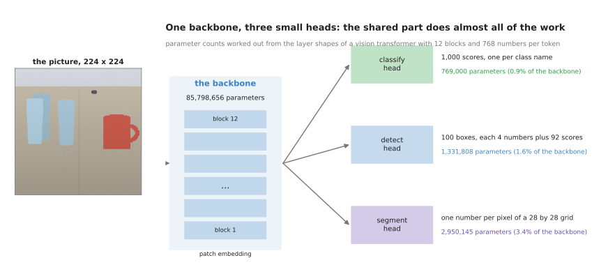

One backbone of 85,798,656 parameters feeds three heads of 769,000, 1,331,808 and 2,950,145 parameters, so each head is between one and four parts in a hundred of the shared part.

The sizes in that picture are worked out from the layer shapes of a plain vision
transformer with twelve blocks and 768 numbers per patch, which is the size most
people start from. The backbone holds 85,798,656 numbers that have to be learned,
while the head that names the picture holds 769,000, the head that draws boxes
holds 1,331,808 and the head that marks pixels holds 2,950,145. So the head is
between nine parts in a thousand and three and a half parts in a hundred of the
backbone, and that lopsidedness is the whole reason for the split.

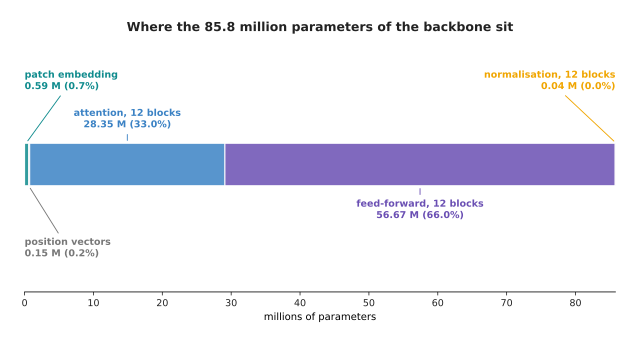

Inside the backbone, the feed-forward part of the blocks holds 56.67 million parameters and the attention part holds 28.35 million, while the patch embedding and the position vectors together hold less than a million.

It is worth knowing where those numbers sit, because people often assume that a
vision model is mostly attention. It is not. Two thirds of the parameters,
56,669,184 of them, are in the feed-forward part of the twelve blocks, which is
the ordinary stack of fully connected layers inside each block, and only a third,
28,348,416, are in the attention part. The patch embedding that turns pixels into
vectors holds 590,592, and the position vectors hold 152,064, so those two
together are less than one part in a hundred.

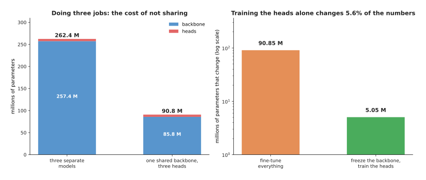

Doing three jobs with three separate models costs 262,446,921 parameters, while one shared backbone with three heads costs 90,849,609, and if the backbone is frozen only 5,050,953 of those numbers ever change.

So the practical consequence is that one pretrained backbone serves several
different jobs at once. If a robot has to name what is on the table, draw a box
round each object and mark the pixels of the one it is about to pick up, then
three separate models would cost 262,446,921 parameters, while one backbone with
three heads costs 90,849,609, which is a saving of 65 in every hundred. If you
also freeze the backbone, which means you keep its learned numbers exactly as
they came and train only the heads, then just 5,050,953 numbers change during
training, and that is 5.6 parts in a hundred of the model.

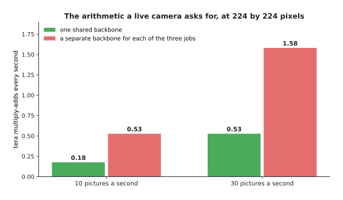

At thirty pictures a second, running the backbone once costs 0.53 tera multiply-adds every second, and running a separate backbone for each of the three jobs costs 1.58.

The saving in running cost matters more on a robot than the saving in memory,
because the camera keeps producing pictures. At thirty pictures a second one
shared backbone asks the computer for 0.53 tera multiply-adds every second, which
means 530 thousand million of them, while three separate backbones ask for 1.58
tera, and that is usually the difference between a robot that keeps up with its
camera and one that falls behind. The cost of the split is that the backbone has
to be good for every job at once rather than perfect for one, and that a frozen
backbone cannot be mended by the head, so if it throws away the detail the job
needs, no small head can put the detail back.

---

## 2. The vision transformer, patch by patch

Now that the backbone has a name, the next question is what goes on inside it,
and the most common answer today is a **vision transformer**, which is a
transformer whose tokens are square patches of a picture instead of pieces of
words. The whole of this section follows one picture of a stated size, 224 pixels
across and 224 pixels down, through that backbone, and every count below is
printed by the script.

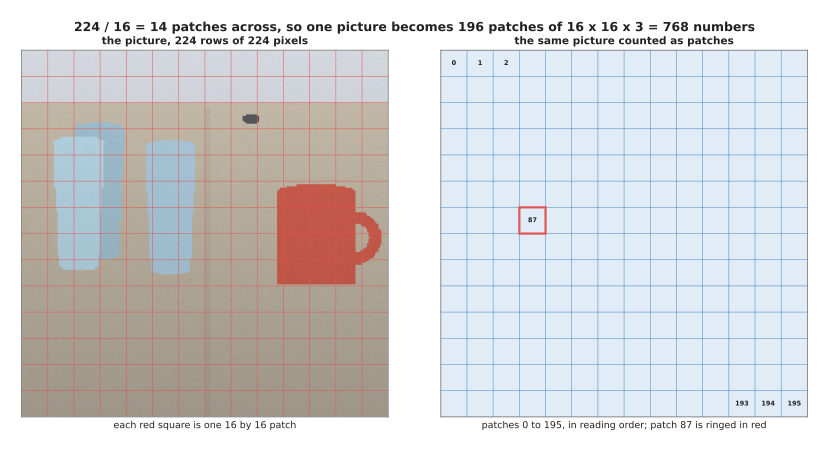

Dividing 224 by 16 gives 14, so the picture is cut into a 14 by 14 grid of 196 square patches, and each patch holds 16 times 16 times 3, which is 768 pixel numbers.

The first thing the model does is cut the picture into squares. With a patch size
of 16 pixels, 224 divided by 16 is 14, so there are 14 patches across and 14
down, which makes 196 patches in all. Each patch covers 16 rows of 16 pixels in
three colours, so it holds 16 times 16 times 3, which is 768 numbers, and the 196
patches together hold exactly the 150,528 numbers the picture started with,
because nothing has been thrown away yet.

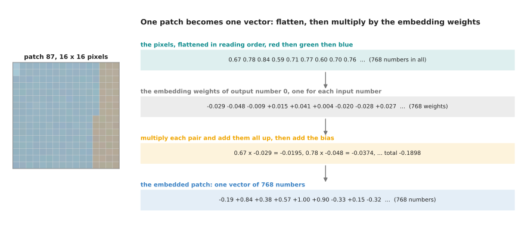

Patch 87 is flattened into 768 pixel numbers, and each output number is the sum of 768 products, so the first output number comes out as -0.0195 plus -0.0374 plus -0.0075 and so on, which totals -0.1898.

The second thing the model does is turn each patch into one vector, and this step
is called the **patch embedding**. The 768 pixel numbers of a patch are laid out
in one long row, in reading order, and that row is multiplied by a learned grid
of weights to give 768 new numbers. The picture above follows patch number 87,
which covers the rim of the front glass. Its first few pixel numbers are 0.674,
0.784 and 0.842, the first few weights of the first output number are -0.029,
-0.048 and -0.009, and multiplying each pair and adding all 768 of the results
gives -0.1898 as the first number of the embedded patch. The weights used to draw
that picture are seeded random numbers, because this script trains no vision
transformer, but the arithmetic is exactly the arithmetic a trained one does.

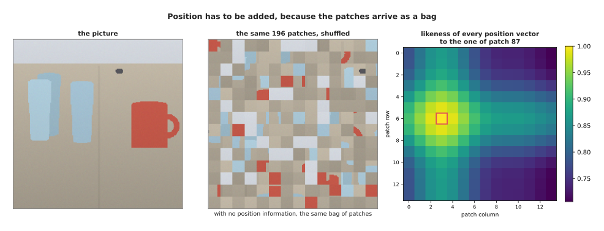

Shuffling the patches leaves the model with exactly the same bag of vectors, so a position vector is added to each one, and those vectors are most alike for patches that sit near each other, 0.986 for the next patch along and 0.706 for the far corner.

The third thing the model does is add position. Attention treats its input as a
bag, which means that if you shuffled the 196 patches into a random order the
model would get exactly the same set of vectors and could not tell the shuffled
picture from the real one. So a **position vector** is added to each patch
vector, one for each of the 196 places, and the ones drawn here are built out of
sines and cosines of the row and column numbers. The heat map shows how alike
those vectors are: the vector for patch 87 is 0.986 alike to its right-hand
neighbour, 0.952 alike to the patch two rows down, and only 0.706 alike to the
patch in the far corner, which is how the model gets a sense of what is near
what.

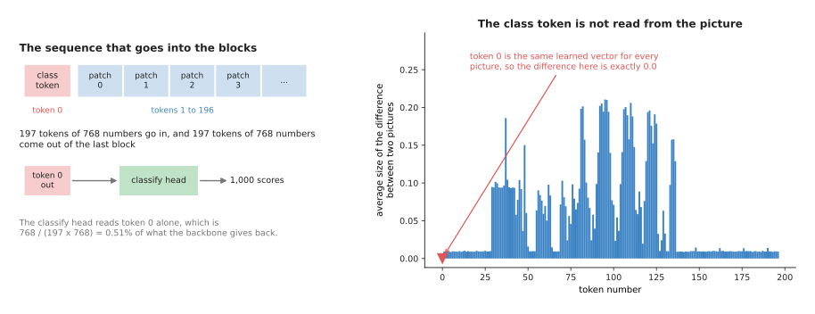

The class token is a learned vector that is the same for every picture, so between two different pictures it changes by exactly 0.0 while the patch tokens change by 0.057 on average.

The fourth thing the model does is put one extra token in front, called the
**class token**, which is a vector of 768 numbers that is learned during training
and is the same for every picture that the model ever sees. The bar chart proves
that by taking two different pictures and measuring how much each token differs
between them: every patch token changes, by 0.057 on average and by as much as
0.211, while token 0 changes by exactly 0.0. The class token starts as a blank
slot, and as the blocks run it gathers information from the patches through
attention, so that at the end it holds a summary of the whole picture in one
vector.

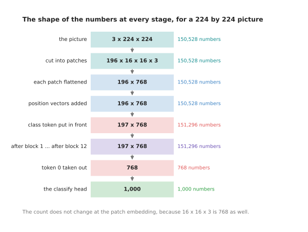

The picture holds 150,528 numbers, the 197 tokens hold 151,296, every one of the twelve blocks gives back the same 197 by 768, and the classify head reads only the 768 numbers of token 0.

With the tokens built, the rest is the stack of blocks described in
[attention](../06_the-transformer/01_attention.md), and the important thing about
that stack is that it does not change the shape of anything. There are 197 tokens
of 768 numbers going into block 1, and there are 197 tokens of 768 numbers coming
out of block 12, so the only thing that has changed is what the numbers mean. At
the end the classify head takes token 0 and nothing else, which is 768 numbers
out of the 151,296 the backbone gives back, or 0.51 in every hundred, and turns
them into one score for each of 1,000 class names. A head that has to say where
things are ignores token 0 and reads the other 196 instead, because those are the
ones that still know which part of the picture they came from.

---

## 3. Convolutional backbones, and what they still do better

The vision transformer described above took over most of the ground from about
2021 onwards, but it did not take all of it, and a page that left the reader
thinking convolutions are finished would be giving bad advice. So this section
says plainly what each one is given and what each one has to learn.

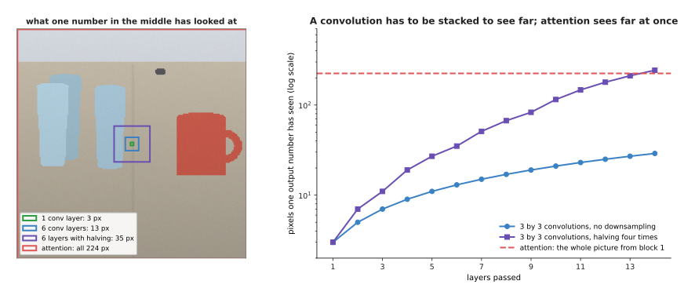

One number from a 3 by 3 convolution has looked at 3 pixels across after one layer and 13 after six layers, or 35 after six layers if the grid is halved along the way, while one number from attention has looked at all 224 pixels after the very first block.

The first difference is how far one output number can see, which is called its
receptive field. A convolution looks through a small window, so after one layer
of 3 by 3 filters an output number has seen 3 pixels across, after six layers it
has seen 13, and after fourteen layers it has seen 29. Real convolutional
backbones halve the grid every so often, which makes the window grow much faster,
reaching 35 pixels after six layers and 243 after fourteen. Attention has no
window at all, so after the first block every output number has looked at all 224
pixels. That is the transformer's advantage: it can relate the handle at one side
of the picture to the cup at the other without waiting for a dozen layers.

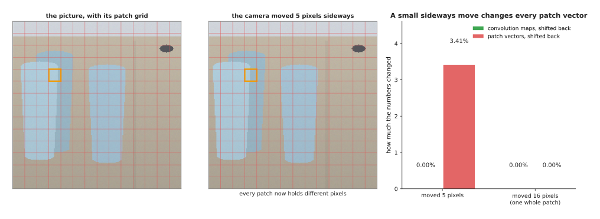

Moving the camera five pixels sideways leaves the convolution maps exactly unchanged once they are shifted back, by 0.00 per cent, and changes the patch vectors by 3.41 per cent, while a move of a whole patch of 16 pixels leaves both unchanged.

The second difference is what happens when the thing moves. This test takes the
same scene twice, once with the camera five pixels further to the right, runs
both through a small set of fixed 3 by 3 filters, shifts the answer back by five
pixels and compares. The convolution maps come out 0.00 per cent different,
because a sliding window slides, and the only places that differ are the edges,
which this comparison leaves out. The patch vectors come out 3.41 per cent
different, because the patch grid did not move with the camera, so every patch
now holds different pixels. Move the camera by a whole patch of 16 pixels and the
patch vectors are 0.00 per cent different too, since the grid lines up again. A
convolution is given this behaviour by its design, and a transformer has to learn
it from examples.

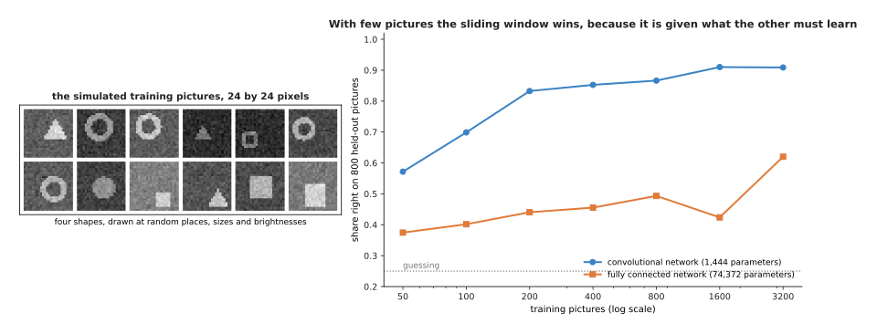

Trained on the same simulated pictures, the small convolutional network of 1,444 parameters reaches CONVSMALL right with 100 training pictures and CONVBIG with 3,200, while the fully connected network of 74,244 parameters reaches FCSMALL and FCBIG.

Being given something rather than having to learn it is worth the most when
examples are scarce, and that is the third difference. The curve above comes from
two small networks really trained here on simulated pictures of four shapes drawn
at random places, sizes and brightnesses. The convolutional one has 1,444
parameters and slides the same filters over every position; the fully connected
one has 74,244 parameters and treats every pixel position as its own input, which
is much closer to what a vision transformer does, since a transformer is also not
told that the picture has neighbours. With 100 training pictures the convolutional
network is right CONVSMALL of the time and the fully connected one CONVVSFC, and the
gap only closes as the pictures run into the thousands. This is why a vision
transformer trained from scratch on a small dataset usually disappoints, and why
people reach for a pretrained one instead.

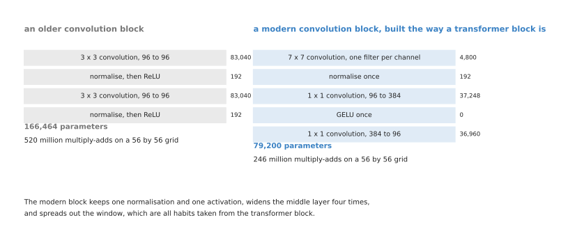

The older block uses two 3 by 3 convolutions with a normalisation and an activation after each, while the modern one uses one wide 7 by 7 window per channel, one normalisation, one activation, and a middle layer four times as wide, which costs 79,200 parameters against 166,464.

What really happened after 2021 is less dramatic than the headlines suggested,
because the convolution did not lose to attention so much as copy it. A modern
convolutional block, of the kind people build now, normalises once instead of
twice, uses one smooth activation rule rather than one after every convolution,
widens its middle layer to four times the number of channels, and uses a single
wide window of 7 by 7 pixels applied to each channel separately. Those are all
habits taken straight from the transformer block described in
[attention](../06_the-transformer/01_attention.md), and the smooth rule is the
Gaussian error linear unit (GELU) from [one
neuron](../02_inside-a-network/01_one-neuron.md). The result costs 79,200
parameters and 246 million multiply-adds on a 56 by 56 grid, against 166,464
parameters and 520 million for the older design, and it performs about as well as
a transformer of the same size on ordinary picture work. So the honest summary is
that the training recipe and the block layout mattered at least as much as
attention itself.

---

## 4. What one picture costs

The last section compared the two designs by what they are given. This one
compares them by what they cost, because on a robot the cost is usually what
decides, and every count here is worked out from the layer shapes rather than
measured on a particular computer.

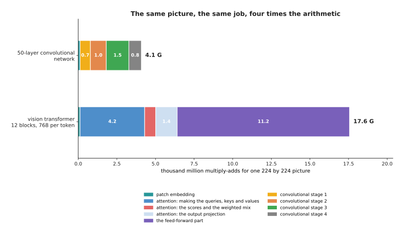

One 224 by 224 picture costs the vision transformer 17.6 thousand million multiply-adds and the 50-layer convolutional network 4.1 thousand million, which is 4.3 times less.

A multiply-add is one multiplication and one addition, which is the unit of work
that every layer in this book is made of. For one 224 by 224 picture the vision
transformer does 17.56 thousand million of them and the 50-layer convolutional
network does 4.09 thousand million, so the transformer costs 4.3 times as much
for the same size of picture. The split inside the transformer is worth noticing,
because 11.15 thousand million of that total, or 63.5 in every hundred, is the
feed-forward part, 4.18 thousand million is making the queries, keys and values,
and only 0.72 thousand million, 4.1 in every hundred, is the part that compares
every patch with every patch.

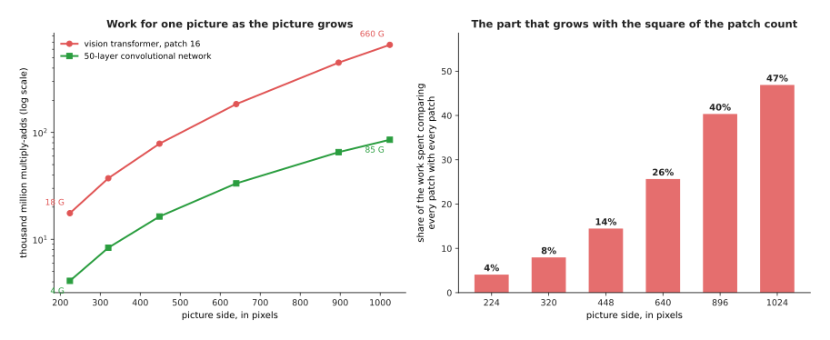

As the picture grows from 224 to 1,024 pixels across, the transformer goes from 17.6 to 659.8 thousand million multiply-adds while the convolutional network goes from 4.1 to 85.4, and the share spent comparing every patch with every patch rises from 4.1 to 46.9 in every hundred.

That small share of 4.1 in every hundred is the reason people are often surprised
by what happens next. Comparing every patch with every patch costs the square of
the number of patches, and everything else costs only as much as the number of
patches, so as the picture grows the square term takes over. At 448 pixels across
it is 14.5 in every hundred of the work, at 640 it is 25.7, and at 1,024 pixels it
is 46.9, which is almost half. The totals grow accordingly, from 17.6 thousand
million multiply-adds at 224 pixels to 659.8 thousand million at 1,024, while the
convolutional network grows only from 4.1 to 85.4 because it has no such term.
This is exactly why a convolutional backbone is still a reasonable choice when
the pictures are large.

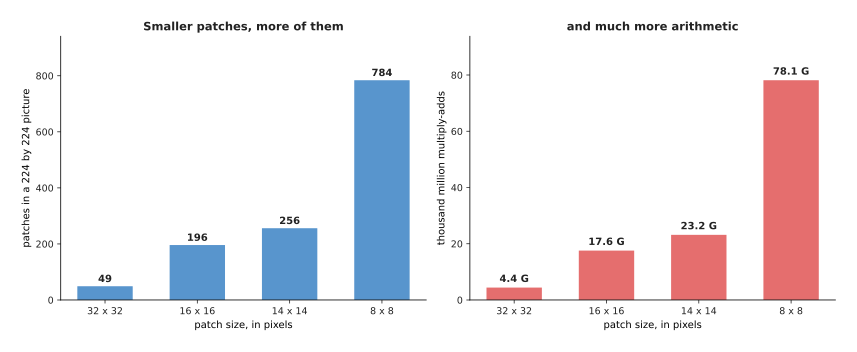

Halving the patch size at a fixed picture size multiplies the number of patches by four, and the work grows faster still, from 4.41 thousand million multiply-adds with 32 pixel patches to 78.15 with 8 pixel patches.

The patch size is the other knob, and it trades detail against cost in the same
unforgiving way. At a fixed picture of 224 pixels, patches of 32 pixels give 49
patches and cost 4.41 thousand million multiply-adds, patches of 16 give 196 and
cost 17.56, patches of 14 give 256 and cost 23.16, and patches of 8 give 784 and
cost 78.15. Smaller patches let the model see finer things, because the smallest
thing it can describe is roughly one patch, but you pay for every one of them at
every block.

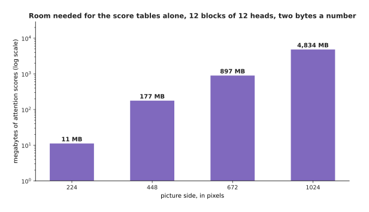

The score tables alone, for twelve blocks of twelve heads at two bytes a number, take 11 megabytes for a 224 pixel picture and 4,834 megabytes for a 1,024 pixel one.

The cost that catches people out is not the arithmetic but the memory, because
the scores have to be held while they are being used. At 224 pixels there are 197
tokens, so one score table holds 197 times 197, which is 38,809 numbers, and
twelve blocks of twelve heads at two bytes a number come to 11 megabytes. At
1,024 pixels there are 4,097 tokens, one table holds 16,785,409 numbers, and the
same count comes to 4,834 megabytes for a single picture. That is why the work on
cheaper attention described in [why the transformer
won](../06_the-transformer/04_why-the-transformer-won.md) matters so much for
vision, where the token counts are large by nature.

---

## 5. Features at several sizes

The costs in the last section all assumed one grid of patches, and for naming a
picture one grid is enough. For finding things it is not, and this section
explains why, using the camera arithmetic that decides the matter.

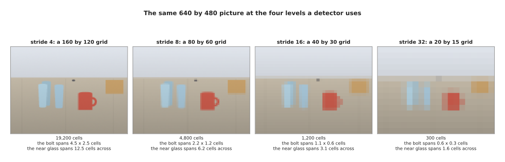

The same scene at the four levels a detector uses holds 19,200, 4,800, 1,200 and 300 cells, and the small bolt that spans 4.5 by 2.5 cells at the finest level spans 0.56 by 0.31 of a cell at the coarsest.

A backbone does not give back only one grid of numbers. A convolutional backbone
halves its grid several times as it goes, so the grid it hands over after the
first stage is a quarter of the picture's size in each direction, then an eighth,
then a sixteenth, then a thirty-second. The amount by which the grid is coarser
than the picture is called the **stride**, so those four grids are the stride-4,
stride-8, stride-16 and stride-32 levels, and a set of levels like this is called
a **feature pyramid**. For a 640 by 480 picture they hold 19,200, 4,800, 1,200
and 300 cells, and the pictures above show what survives at each one.

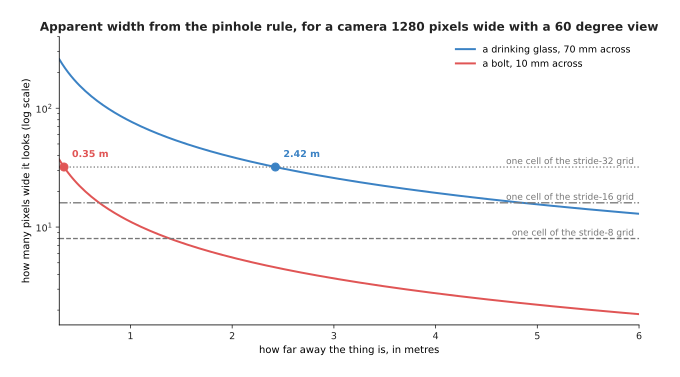

For a camera 1,280 pixels wide with a 60 degree view, a glass 70 millimetres across looks 77.6 pixels wide at one metre and 19.4 pixels wide at four metres, so beyond 2.42 metres it is narrower than one cell of the stride-32 grid.

The reason this matters follows from the camera rather than from the network. A
camera 1,280 pixels wide with a 60 degree view has a focal length of 1,109
pixels, and the width of a thing in pixels is its real width times that focal
length divided by its distance. So a drinking glass 70 millimetres across looks
155.2 pixels wide at half a metre, 77.6 pixels at one metre, 38.8 pixels at two
metres and 19.4 pixels at four metres, and a bolt 10 millimetres across looks
11.1 pixels wide at one metre and 5.5 pixels at two. Beyond 2.42 metres the glass
is narrower than a single cell of the stride-32 grid, and the bolt is narrower
than one of those cells at any distance past 0.35 metres.

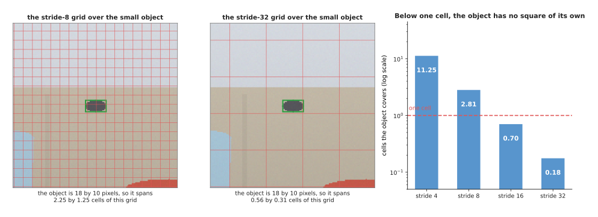

The small object in the scene is 18 by 10 pixels, so it covers 11.25 cells of the stride-4 grid, 2.81 of the stride-8 grid, 0.70 of the stride-16 grid and 0.18 of the stride-32 grid.

When a thing is smaller than one cell, it has no square of the grid to call its
own, and whatever that cell says has to describe the table as well as the object.
The small object in the simulated scene is 18 pixels by 10, so it covers 11.25
cells of the stride-4 grid, 2.81 cells of the stride-8 grid, 0.70 of a cell at
stride 16 and 0.18 of a cell at stride 32. A detector working only from the
coarsest grid would have to find it inside a cell where it is less than a fifth of
what the cell saw, which is why detectors look at several levels and let the
small things be found on the fine ones.

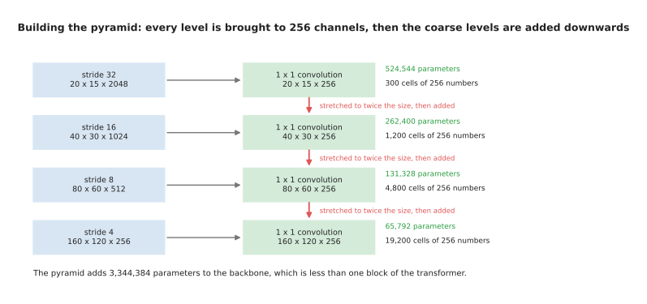

Each level is brought to 256 channels by a 1 by 1 convolution costing between 65,792 and 524,544 parameters, and the coarse levels are stretched to twice the size and added downwards, which costs 3,344,384 parameters in all.

The fine levels have a problem of their own, which is that they come from early
layers that have not looked at much of the picture yet, so they know where the
edges are but not what the object is. The fix is to carry the coarse levels back
down. Every level is first brought to the same width, 256 numbers per cell, by a
1 by 1 convolution, which costs 65,792 parameters at the finest level and 524,544
at the coarsest. Then the coarsest level is stretched to twice its size and added
to the next finer one, that sum is stretched and added again, and so on, so that
every level ends up holding both the fine positions and the coarse meaning. The
whole arrangement costs 3,344,384 parameters, which is less than one block of the
transformer in section 2, and it is the cheapest useful thing you can bolt on to
a backbone.

---

## 6. What a pretrained backbone gives you

Sections 2 to 5 described the machinery. This section asks what comes out of it,
because the claim that one frozen backbone serves classifying, detecting and
segmenting is only worth making if the numbers it produces really do group things
sensibly. The demonstration below uses a small convolutional backbone trained
here, in NumPy, on simulated pictures of four shapes, and then asks it about
three shapes it has never been shown.

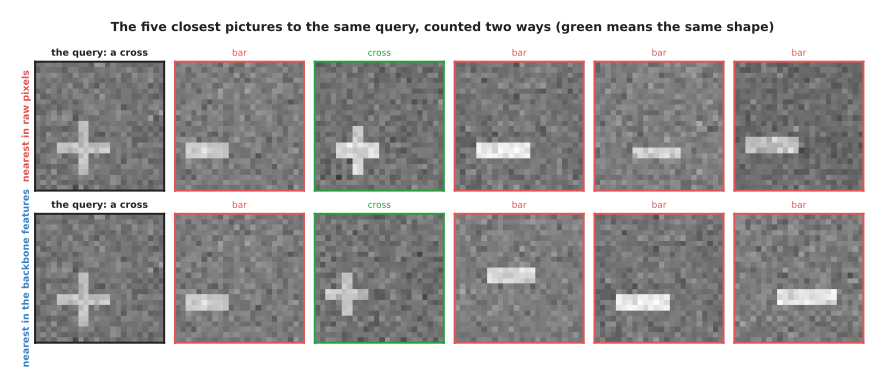

NEIGHBOURCAPTION

NEIGHBOURBODY

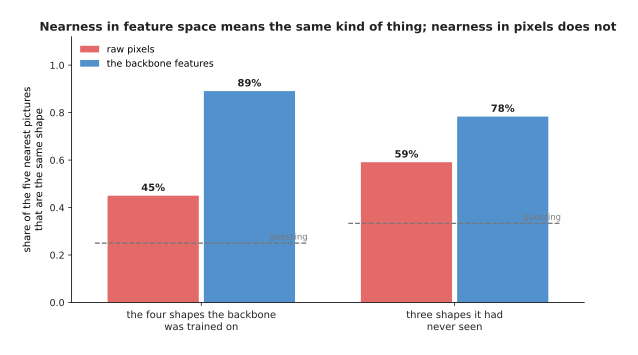

AGREECAPTION

AGREEBODY

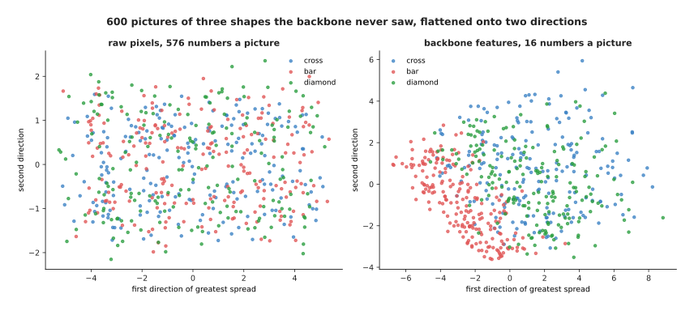

MAPCAPTION

MAPBODY

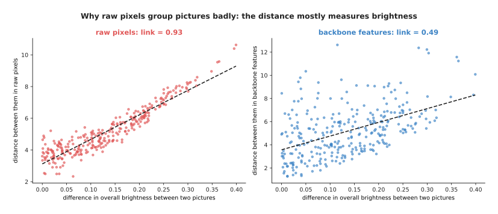

WHYCAPTION

WHYBODY

---

## 7. Where to read next

- [Detection and segmentation](02_detection-and-segmentation.md) is the next
  page, and it puts heads on this backbone: boxes, outlines, the measurements
  that say whether a guess was right, and the way modern detectors avoid
  guessing twice.
- [Open-vocabulary vision](03_open-vocabulary-vision.md) then explains how a
  backbone can name a thing nobody listed when it was trained, by learning
  picture and word vectors in the same space.
- [Depth and 3D](04_depth-and-3d.md) covers what else a backbone can give back,
  such as a distance for every pixel, which is what turns a box on a screen into
  a place an arm can reach.
- [Vision-language
  models](../10_language-and-multimodal-models/03_vision-language-models.md)
  shows the other common use of the backbone in this page, which is to feed a
  language model with picture tokens.
- [Self-supervised
  pretraining](../07_pretraining-and-adapting/01_self-supervised-pretraining.md)
  explains how these backbones are trained without anybody labelling the
  pictures, which is where a frozen backbone's quality comes from.
- [Image
  classification](../../07_learned-models/03_seeing-models/03_also-used/01_image-classification.md)
  is the catalogue page for the simplest head of all, with the real models you
  can download and what each costs to run.

---

## 8. Using it in Python

This section builds the two backbones of this page in PyTorch, with `torchvision`
supplying the published arrangements, and prints the counts that sections 1, 2
and 5 worked out by hand.

```python
import torch
from torchvision.models import resnet50, vit_b_16
from torchvision.models.feature_extraction import create_feature_extractor

vit = vit_b_16(weights=None)                     # section 2's vision transformer
print(sum(p.numel() for p in vit.parameters()))  # 86567656 = 85,798,656 + 769,000

picture = torch.zeros(1, 3, 224, 224)            # one 224 by 224 colour picture
patches = vit.conv_proj(picture)                 # section 2's patch embedding
print(patches.shape)                             # torch.Size([1, 768, 14, 14])
tokens = patches.flatten(2).transpose(1, 2)      # 196 patches of 768 numbers
print(tokens.shape)                              # torch.Size([1, 196, 768])

cnn = resnet50(weights=None)                     # section 3's convolutional backbone
print(sum(p.numel() for p in cnn.parameters()))  # 25557032 = 23,508,032 + 2,049,000

levels = create_feature_extractor(cnn, {'layer1': 's4', 'layer2': 's8',
                                        'layer3': 's16', 'layer4': 's32'})
scene = torch.zeros(1, 3, 480, 640)              # section 5's 640 by 480 picture
for name, grid in levels(scene).items():         # the four levels of the pyramid
    print(name, tuple(grid.shape))               # s4 (1, 256, 120, 160) ... s32 (1, 2048, 15, 20)
```

The library gives you the arrangement, the arithmetic and a set of trained
weights, and the counts it prints are the ones this page worked out from the
layer shapes: 86,567,656 for the vision transformer with its classify head, and
25,557,032 for the 50-layer convolutional network with its own. Passing
`weights='DEFAULT'` instead of `weights=None` downloads a backbone that somebody
has already trained on millions of pictures, which is what section 6 measured,
and `requires_grad_(False)` on the backbone's parameters is what freezing means
in code.

What you still have to decide is the shape of the problem rather than the shape
of the layers. You choose how large a picture to feed in, knowing from section 4
what each extra pixel costs and from section 5 what a smaller picture does to
small objects. You choose whether to freeze the backbone, which makes training
cheap and quick but limits how far the model can move from what it already knows,
or to fine-tune it, which is the subject of [fine-tuning and
adapters](../07_pretraining-and-adapting/03_fine-tuning-and-adapters.md). You
choose which levels to take from the backbone, because `create_feature_extractor`
will hand you any of them and a head that only names things needs only the last.

The one thing the library will not decide for you is which backbone suits the
robot, and the honest way to settle that is to measure both on your own pictures
at the resolution you will really use, since the counts above tell you what the
arithmetic costs but not what your camera, your objects and your computer will do
with it.
