# Naming a thing the model was never trained on

The page before this one, [detection and
segmentation](02_detection-and-segmentation.md), built a model that draws a box
round every object it can see and then draws the exact outline inside that box.
That model has one hard limit, and the limit is not in its eyes but in its
mouth, because the last layer of a detector has one output for each name it was
trained on, so it can only ever report one of those names. A robot arm working
in a real room meets hex keys, cable ties, calibration boards and tubes of
thermal paste, and a model trained on a fixed list of household names has no
output for any of them.

This page is about how a model names something it was never given a label for.
The idea it rests on is that pictures and words can be turned into lists of
numbers in the same space, so that the list for a photograph of a mug lands near
the list for the words "a mug", and once that is true you can name a region by
writing down any name you like and seeing which one lands closest. That is what
**open vocabulary** means: the set of names is not fixed when the model is
trained, and you choose it when you ask the question.

It is written for a reader who has read [vision
backbones](01_vision-backbones.md) and [detection and
segmentation](02_detection-and-segmentation.md), so you should already know what
a backbone is, what a bounding box and a mask are, and what a region proposal
is. You should also have read [self-supervised
pretraining](../07_pretraining-and-adapting/01_self-supervised-pretraining.md),
because that page explains contrastive learning and the shared picture-and-text
space this page uses, and [tokens and
embeddings](../05_turning-the-world-into-numbers/01_tokens-and-embeddings.md),
because that page explains what a vector is and how cosine similarity measures
how close two of them are.

Every number on this page is worked out by
`docs/diagrams/models_that_see_2.py` and printed when the script runs. The
shared space the arithmetic runs in is made up, with thirteen directions that
each have a plain English name, so that you can follow every multiplication by
hand, whereas a real model has hundreds of directions and nobody has named any
of them. What is real is the arithmetic and the behaviour that falls out of it,
because every failure shown at the end of this page follows from the shape of
the calculation rather than from the particular numbers chosen.

## Contents

1. [Why a fixed list of names runs out on a robot](#1-why-a-fixed-list-of-names-runs-out-on-a-robot)
2. [One space for pictures and for words](#2-one-space-for-pictures-and-for-words)
3. [Finding and naming without a list](#3-finding-and-naming-without-a-list)
4. [Grounding a phrase to a region](#4-grounding-a-phrase-to-a-region)
5. [What goes wrong, and why it costs more on an arm](#5-what-goes-wrong-and-why-it-costs-more-on-an-arm)
6. [Where to read next](#6-where-to-read-next)
7. [Using it in Python](#7-using-it-in-python)

---

## 1. Why a fixed list of names runs out on a robot

The detector on the page before this one was trained on a list of names, and
every picture in its training set was labelled with boxes drawn round things
whose names were on that list, so the list is baked into the last layer of the
network and cannot be changed without training the network again. To see how
much that costs, take one tray from a robot workshop and check each thing on it
against a list of twenty common names.

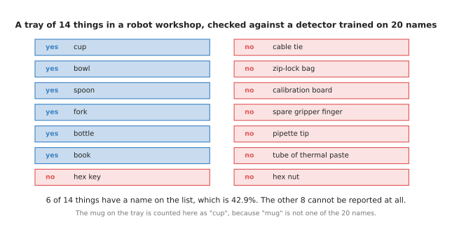

Six of the fourteen things on the tray have a name the detector can report, which is 42.9 per cent of them, and the other eight cannot be reported at all.

The six that work are the kitchen things, and they work because somebody once
decided that those words belonged on a list of common household objects, while
the eight that fail are the workshop things, and they fail because nobody put
them on the list. Worse than failing outright, the mug on the tray gets reported
as a cup, because "mug" is not one of the twenty names and "cup" is the nearest
thing the model is allowed to say.

The obvious answer is to make the list longer, and the picture below shows what
that costs. If one new name needs 150 boxes drawn by hand, and one box takes
eighteen seconds of somebody's time, then each name costs 45 minutes of
labelling before anything else happens.

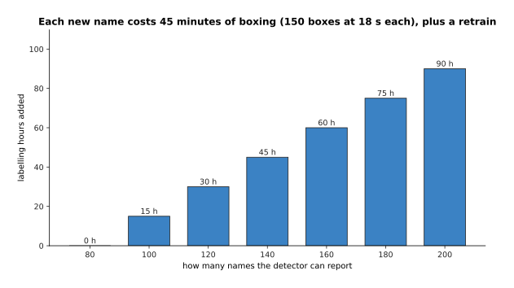

Growing the list from 80 names to 200 adds 90 hours of labelling, and that is before the model is trained again.

Those 90 hours buy 120 extra names, which is nothing like the number of
different things that turn up on a workbench, and the labelling is only the
start, because the model then has to be trained again and tested again, and
every robot running the old model has to be updated. So the cost grows with the
number of names while the benefit does not, and a list long enough for a real
room is not reachable this way.

That is why it is worth looking at what a model can do with no examples at all.
Working with no labelled examples of a thing is called **zero-shot**, and working
with a handful of them, usually somewhere between one and about twenty, is
called **few-shot**. The simulated curve below compares the two.

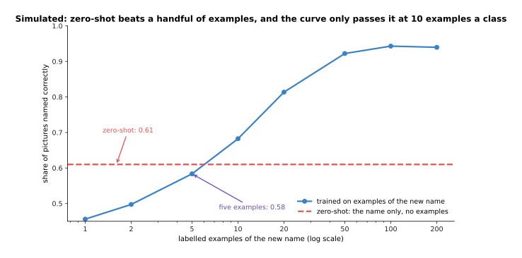

In this simulated comparison a zero-shot model scores 0.61 with no examples at all, one example scores 0.456, five examples score 0.584, and the curve only passes the zero-shot line at ten examples a class.

The data behind that curve is made up, so the exact heights mean nothing, but the
shape is the point and it is the shape that is reported again and again in
practice. Training on one or two examples of a new thing is worse than not
training at all, because so few examples teach the model the background and the
lighting of those two photographs rather than the object. Zero-shot costs
nothing and is available immediately, which is exactly what a robot needs when
somebody puts a new object on the table, and the next section explains how a
model can name a thing with no examples of it.

---

## 2. One space for pictures and for words

The zero-shot line in the last picture has to come from somewhere, and it comes
from training a model so that pictures and words end up in the same space. A
picture goes through a vision backbone of the kind described on [vision
backbones](01_vision-backbones.md) and comes out as one list of numbers, a piece
of text goes through a text network and comes out as another list of numbers of
the same length, and training pushes the two lists together when the words
describe the picture and pulls them apart when they do not. That training is
contrastive learning, and
[self-supervised pretraining](../07_pretraining-and-adapting/01_self-supervised-pretraining.md)
explains how it works and what it is trained on.

To follow the arithmetic you need a space small enough to read, so the rest of
this page uses a made-up one with thirteen directions, each of which has a name
in plain English. The first eight of those directions describe how a thing
looks and what it is for, and the table below gives the value of six words and
two picture regions along each of them.

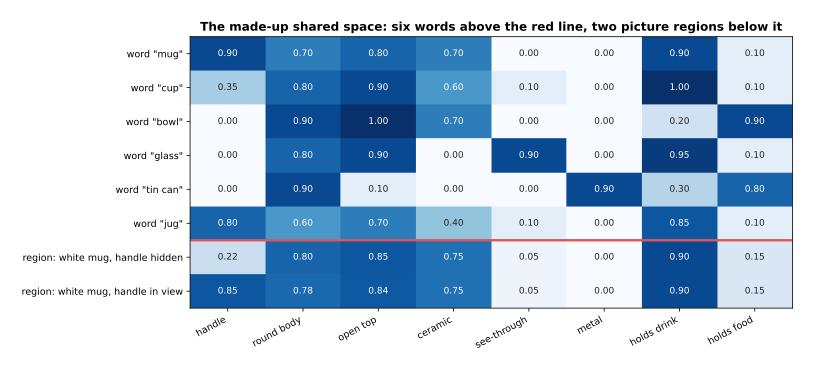

The word "mug" has 0.90 on the handle direction while the word "cup" has only 0.35, and the two picture regions below the red line are the same white mug photographed twice, once with its handle hidden behind its body at 0.22 and once with the handle in view at 0.85.

Everything that follows is worked out from that table. To compare a picture
region with a name you multiply the two lists together one direction at a time,
add up the results, and divide by the lengths of the two lists, which gives the
cosine similarity explained in [tokens and
embeddings](../05_turning-the-world-into-numbers/01_tokens-and-embeddings.md). It
is 1 when the two lists point the same way and 0 when they have nothing in
common. Here is the whole sum, for the mug whose handle is hidden, against the
two words that could describe it.

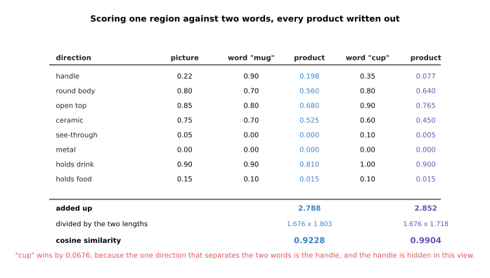

The products add up to 2.788 for "mug" and 2.852 for "cup", and after dividing by the lengths the cosine similarities are 0.9228 for "mug" and 0.9904 for "cup".

So the model picks the wrong name, and it picks it for an instructive reason.
The handle is the one direction that separates the two words, since "mug" has
0.90 there and "cup" has 0.35, and in this photograph the handle is behind the
body, so the picture has only 0.22 on that direction. Every other direction
agrees with both words, which means the handle decides the answer, and the
handle is not visible. The model is not being stupid, because a cup is a fair
description of what is in front of the lens, but a robot that was told to fetch
a mug now has a region labelled "cup" and will reject it.

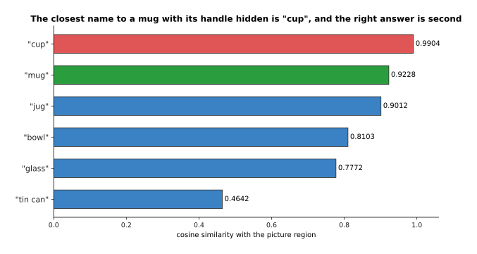

Ranked against the region, "cup" comes first at 0.9904 and the right answer, "mug", comes second at 0.9228, with "jug" close behind at 0.9012.

The fix for this particular failure is not a better model but a better
viewpoint, and the picture below shows that. Turning the mug ninety degrees so
that the handle faces the camera changes the picture region's value on the
handle direction from 0.22 to 0.85 and nothing else, and that one change moves
"mug" from 0.9228 to 0.9977 while it moves "cup" down from 0.9904 to 0.9571.

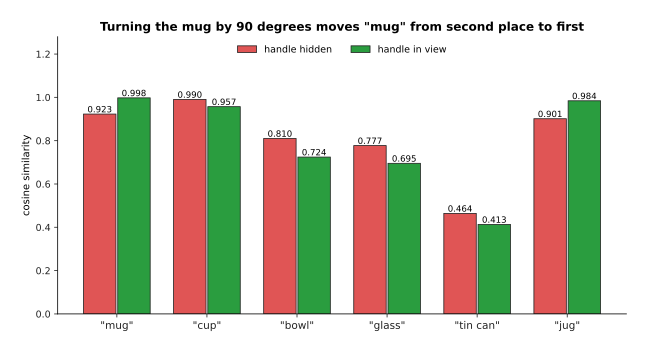

With the handle in view "mug" scores 0.9977 and wins, and with it hidden "cup" scores 0.9904 and wins, from the same object and the same model.

There is one more thing to know before these scores are used for anything, and
it is about how they are reported. All six scores for the hidden-handle mug sit
between 0.4642 and 0.9904, and the gap between the top two is only 0.0676,
because every vector in a shared space of this kind points broadly the same way.
A model that has to give a percentage multiplies the scores by a fixed number,
usually about 100, before turning them into percentages, and that stretches
small gaps enormously.

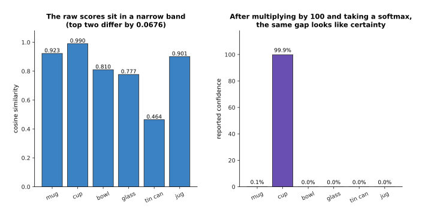

A gap of 0.0676 in cosine similarity becomes 99.9 per cent against 0.1 per cent once the scores are multiplied by 100, so a confident-looking answer can rest on almost nothing.

That stretching is not a mistake, because the model was trained with the same
multiplication and the percentages are useful for ranking, but it means you must
never read 99 per cent as 99 per cent. The honest reading is that "cup" beat
"mug" by seven hundredths of a cosine, which a change of viewpoint would have
reversed. Keeping that in mind matters most when these scores are used to decide
what a gripper does, and the next section puts them to work on a whole picture.

---

## 3. Finding and naming without a list

Section 2 scored one region against one name, and a real picture has no regions
marked on it, so something has to produce the regions first. That is the same
region proposer the detector used on [detection and
segmentation](02_detection-and-segmentation.md), and it is doing an easier job
here, because it only has to say "there is some object here" rather than "there
is a mug here". The naming is then a separate step, and the two steps together
are called **open-vocabulary detection**: the proposer finds the boxes, the
shared space names them, and the names come from a list you write at the moment
you ask. That list of names is the **text prompt for vision**, and it is the
part a robot program controls.

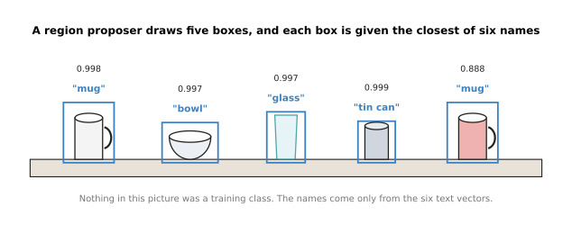

Five proposed boxes each take the closest of six names, and none of the five objects was a training class, because the names come only from the six text vectors.

The arithmetic behind those five labels is a table of thirty numbers, one for
every region and every name, and it is worth looking at the whole table rather
than just the winners.

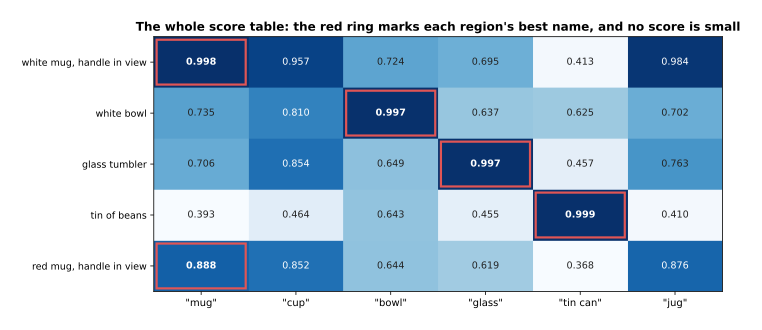

The red ring marks each region's best name, and the smallest number anywhere in the table is 0.368, which is the score of the word "tin can" against a mug.

Two things stand out. The first is that the right name wins in every row, which
is what the method is for. The second is that no score is small, because even
"tin can" against a mug reaches 0.368, and that matters because a program has to
choose a number above which it believes an answer. Picking that number is harder
than it looks, and the picture below shows why, using a simulated set of forty
pictures that contain the named thing and one hundred and twenty that do not.

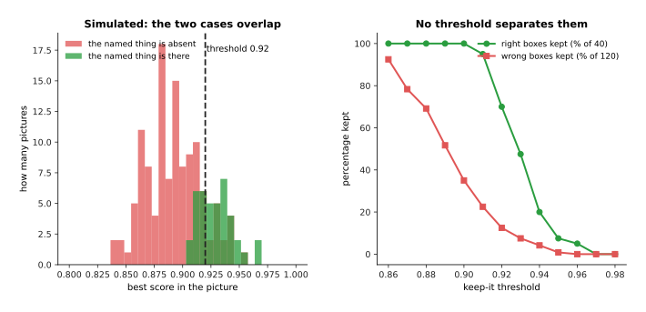

In this simulated set a threshold of 0.90 keeps all forty right boxes but also keeps 42 of the 120 wrong ones, while raising it to 0.93 cuts the wrong ones to 9 and throws away 21 of the right ones as well.

No threshold in that sweep separates the two cases, and that is a property of the
method rather than of the numbers chosen, because the scores all live in a narrow
band for the reason section 2 gave. A robot program therefore cannot ask "is this
a mug" and get a yes or a no, and the useful question is always a comparison:
given these six names, which fits this region best.

Once a box has a name, the last step for a gripper is to turn the box into a
shape, and that is the promptable segmentation described on [detection and
segmentation](02_detection-and-segmentation.md), which takes a box and returns
the outline of the thing inside it. The difference between the two matters more
than it sounds.

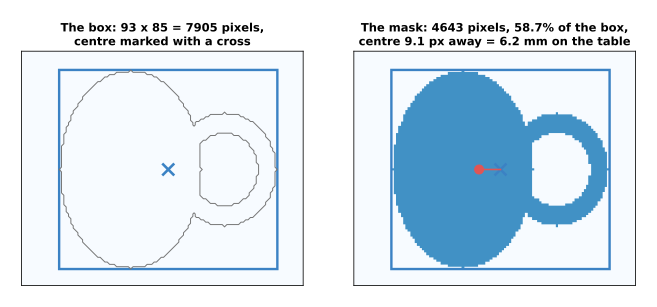

The tight box round this mug is 93 by 85 pixels, which is 7,905 pixels, while the mask inside it is 4,643 pixels, so 41.3 per cent of the box is not the mug at all, and the centre of the box sits 9.1 pixels from the centre of the mask.

At a distance of 0.42 metres, with a camera whose focal length is 615 pixels, one
pixel covers 0.683 millimetres, so that 9.1 pixel difference is 6.2 millimetres
on the table. A gripper aimed at the middle of the box is therefore aimed 6.2
millimetres away from the middle of the mug, which is enough to matter, and it
is the handle sticking out to one side that causes it. So the box says where to
look and the mask says where to close the fingers, and a robot needs both.

---

## 4. Grounding a phrase to a region

Section 3 named each region with a single word, and that is not how anybody
talks to a robot. A real instruction says "the mug behind the bowl", and turning
a phrase like that into one particular region of one particular picture is
called **grounding**. The scene below has two mugs in it, and the phrase has to
pick one of them.

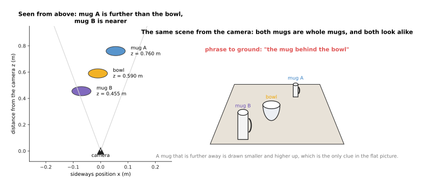

Mug A sits 0.760 metres from the camera, the bowl sits at 0.590 metres and mug B sits at 0.455 metres, so mug A is the one behind the bowl.

The two mugs are the same object photographed from different distances, so their
picture vectors are identical, and that is enough to show the problem. To score a
phrase the simplest model averages the vectors of its words, which gives one
vector for "the mug behind the bowl" and one for "the mug in front of the bowl",
and those are then compared with each region in the usual way.

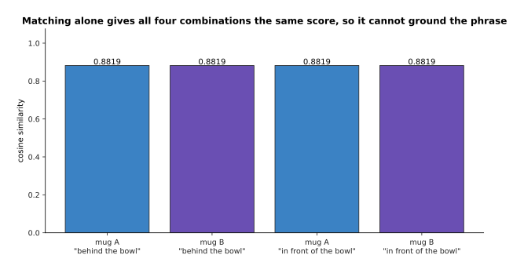

All four combinations score exactly 0.8819, so matching the phrase against the picture cannot choose between the two mugs and cannot tell the two phrases apart either.

That is not a flaw in the averaging, and using a bigger text network would not
repair it, because the picture of a mug carries no information about what is
behind what. The relation lives between objects rather than inside one of them,
so it has to be worked out from where the objects are, and the honest way to
ground such a phrase is to find the candidate regions by matching, measure where
each one is, and then test the relation on those measurements.

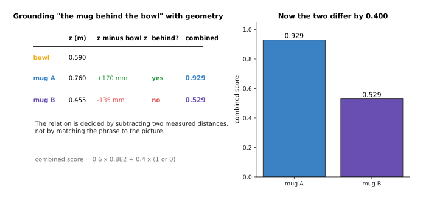

Subtracting the bowl's distance from each mug's distance puts mug A 170 millimetres further away and mug B 135 millimetres nearer, so only mug A satisfies "behind", and combining 0.6 times the match score with 0.4 times the relation gives 0.929 against 0.529.

The combining weights are a choice rather than a law, and the useful part is that
the relation contributes a clean yes or no that comes from measured distances.
Those distances come from a depth camera or from one of the methods on the next
page, which is one reason that page follows this one.

It is worth seeing exactly why the matching failed, because the same reason
explains most of section 5. The phrase "the mug behind the bowl" and the phrase
"the mug in front of the bowl" put the same values on every direction a picture
can have, and differ only on the direction that records which way round the
depth order goes.

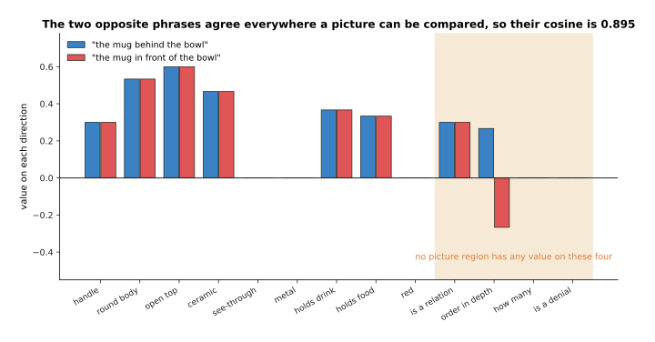

The two phrases that mean opposite things have a cosine similarity of 0.8953, because 17.9 per cent of each phrase vector sits on four directions that no picture region has any value on at all.

A picture region has a value for handle, for roundness, for being see-through and
for the other directions you can see, and it has nothing at all on the four
directions that carry the relation, the count and the denial, because those are
things words do and pictures do not. Multiplying a picture value of zero by a
word value of 0.267 gives zero, so those four directions cannot change a score,
which means that whatever the phrase says with them is thrown away at the moment
of comparison. That single fact is behind the four failures in the next section.

---

## 5. What goes wrong, and why it costs more on an arm

Section 4 showed that a relation word cannot change a matching score, and the
same argument applies to counting and to the word "not", because those also live
on directions that no picture has a value on. The picture below shows both.

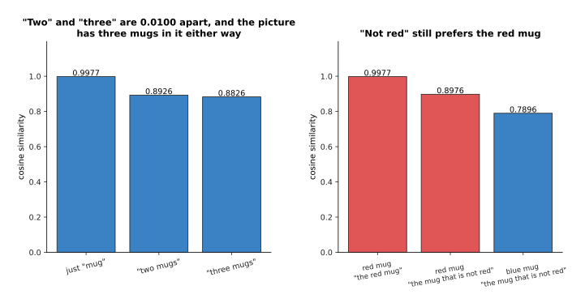

The phrases "two mugs" and "three mugs" differ by 0.0100 against the same picture, while the phrase "the mug that is not red" scores 0.8976 on the red mug and only 0.7896 on the blue one.

Look at what drives that 0.0100. The word "two" sits at 0.90 on the counting
direction and "three" sits at 0.95, and since the picture has nothing on that
direction, neither value reaches the sum at the top of the cosine. All they
change is the length of the phrase vector, which is the number underneath the
division, so the whole difference between asking for two mugs and asking for
three is a rounding-level change in a divisor. The denial is worse than useless
rather than merely useless, because "not red" contains the word "red", the word
"red" does have a direction that pictures use, and so the phrase is pulled
towards exactly the object it was meant to exclude.

The third failure is about names that are close together, and it needs no
special word to explain it, only the table from section 2.

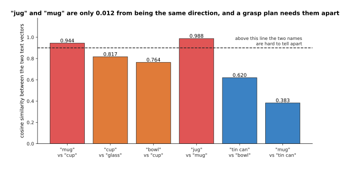

The words "jug" and "mug" sit 0.988 apart, which is 0.012 from being the same direction, and "mug" and "cup" sit 0.944 apart, while "mug" and "tin can" are a comfortable 0.383.

Telling a mug from a tin can is easy and telling a mug from a jug is close to
impossible, and that is the wrong way round for a robot, because the two objects
a person is most likely to confuse in words are also the two whose grasps differ
most. Pouring from a jug and drinking from a mug need different grips, so the
distinction the model is worst at is the distinction the arm most needs.

The fourth failure is the one that causes real damage, and it follows from there
being no way to answer "nothing here". Every region gets a score, one of them is
always the highest, and the model returns it.

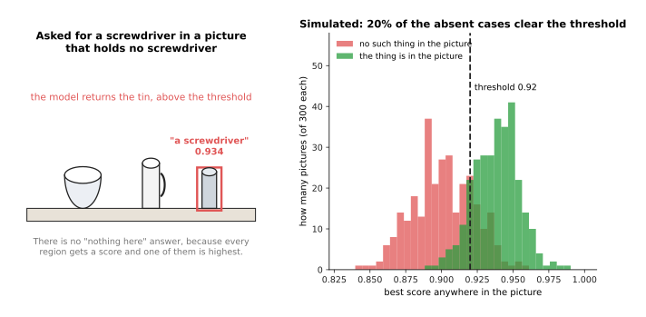

Asked for a screwdriver in a picture that holds no screwdriver, the model returns the tin at 0.934, and in the simulated set 20.3 per cent of pictures without the named thing still produce a box above a threshold of 0.92.

On a benchmark that result costs a fraction of a point, because a benchmark
counts a wrong box as a wrong box and moves on to the next picture. On an arm the
same result starts a movement. The arm takes the returned box, works out a grasp
from it and drives the gripper to that place, and the picture below shows what
that means when the returned region is the wrong one of the two mugs from
section 4.

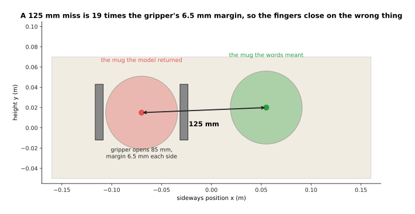

The returned box sits 125 millimetres from the mug the words meant, and a gripper that opens to 85 millimetres round a 72 millimetre mug has only 6.5 millimetres of margin on each side, so the miss is 19 times the margin.

That is the real asymmetry between a benchmark and a robot. A benchmark score is
an average over thousands of pictures, so a confident wrong answer is diluted by
all the right ones, whereas an arm acts on one answer at a time and a confident
wrong answer is indistinguishable from a right one until the fingers close. The
practical answers are to ask for several names at once and require the winner to
beat the runner-up by a margin you have measured, to check the returned region
against the depth measurement before moving, and to let the program answer "I
cannot see one". None of those make the model better, and all of them make the
robot safer.

---

## 6. Where to read next

- [Depth and 3D](04_depth-and-3d.md) is the next page, and it explains where the
  measured distances in section 4 come from and why a flat picture cannot
  provide them.
- [Vision backbones](01_vision-backbones.md) explains the picture half of the
  shared space, which is the part that turns a region into a vector.
- [Self-supervised
  pretraining](../07_pretraining-and-adapting/01_self-supervised-pretraining.md)
  explains how a shared picture-and-text space is trained in the first place,
  and what data it needs.
- [Vision-language
  models](../10_language-and-multimodal-models/03_vision-language-models.md)
  takes the same idea further, by joining a vision backbone to a language model
  so that the answer can be a sentence rather than a score.
- [Open-vocabulary
  models](../../07_learned-models/03_seeing-models/02_most-used/03_open-vocabulary-models.md)
  is the catalogue of the real models of this kind, with their licences, their
  costs and what each one is good for.

---

## 7. Using it in Python

Section 2 worked one comparison out by hand, and the first half of the code below
repeats that arithmetic in NumPy so you can check the two numbers, while the
second half shows the real library call that does the same job with a trained
model. The made-up vectors are the ones from the table in section 2.

```python
import numpy as np

# Section 2: eight directions, in this order:
# handle, round body, open top, ceramic, see-through, metal, holds drink, holds food
region = np.array([0.22, 0.80, 0.85, 0.75, 0.05, 0.00, 0.90, 0.15])  # handle hidden
words = {'mug': np.array([0.90, 0.70, 0.80, 0.70, 0.00, 0.00, 0.90, 0.10]),
         'cup': np.array([0.35, 0.80, 0.90, 0.60, 0.10, 0.00, 1.00, 0.10])}

def cosine(a, b):                       # section 2's measure of closeness
    return float(a @ b / (np.linalg.norm(a) * np.linalg.norm(b)))

for name, vec in words.items():
    print(name, round(cosine(region, vec), 4))   # mug 0.9228 / cup 0.9904

# Section 2 again: the same gap after the usual multiplication by 100
scores = np.array([cosine(region, v) for v in words.values()]) * 100
percent = np.exp(scores - scores.max())
print((percent / percent.sum()).round(3))        # [0.001 0.999]
```

Running that prints `mug 0.9228` and `cup 0.9904`, which are the two numbers in
section 2, and then `[0.001 0.999]`, which is section 2's point about how a gap
of 0.0676 is reported. Everything hard is in the two networks that produced the
vectors, and a trained model gives you those instead. The Hugging Face
`transformers` package loads a picture-and-text model and both of its networks
in three lines, and the call below returns one vector for the picture and one
for each name you asked about.

```python
from transformers import CLIPModel, CLIPProcessor
from PIL import Image

model = CLIPModel.from_pretrained('openai/clip-vit-base-patch32')
processor = CLIPProcessor.from_pretrained('openai/clip-vit-base-patch32')

names = ['a photo of a mug', 'a photo of a cup', 'a photo of a bowl']
inputs = processor(text=names, images=Image.open('region.png'),
                   return_tensors='pt', padding=True)
out = model(**inputs)
print(out.image_embeds.shape)            # torch.Size([1, 512])
print(out.text_embeds.shape)             # torch.Size([3, 512])
print(out.logits_per_image.shape)        # torch.Size([1, 3]), one score per name
```

The library does three things for you. It turns a photograph into the right size
and shape of tensor, it runs both networks, and it multiplies the result by the
model's own scaling number so that `logits_per_image` is already on the scale a
softmax expects. The shapes printed above are fixed by this model, which uses 512
directions, and the actual scores depend on which trained model you load, so the
page does not quote them.

What you still have to decide is everything that matters. You choose the list of
names, which section 1 showed is now the thing that limits what the robot can
report, and you choose the wording, since "a photo of a mug" and "mug" give
different vectors. You choose where the regions come from, because this model
scores whole pictures and section 3 needed a region proposer in front of it. And
you choose what to do with the scores, which section 5 argued should be a
comparison against the runner-up rather than a fixed threshold, because the
model will always return something.
