# Depth and the third dimension

The page before this one, [open-vocabulary
vision](03_open-vocabulary-vision.md), ended by grounding the phrase "the mug
behind the bowl", and it could only do that by subtracting one measured distance
from another. Those distances had to come from somewhere, because the pictures
on that page were flat and a flat picture holds no distances at all. This page
is about where they come from.

The gap matters more for an arm than for anything else a camera is pointed at,
because a program that sorts photographs needs to know what is in them while a
program that drives a gripper needs to know where things are, in millimetres,
since the fingers have to close around an object rather than in front of it or
behind it.

The page covers three ways of measuring distance and three ways of holding the
result. It explains what a depth picture is, how a network guesses distance from
a single photograph and why that guess has no true scale, what stereo cameras
measure and how accurate they are, why a depth camera that throws a pattern of
dots fails on glass, how a depth picture becomes a cloud of points, and what a
learned description of a whole scene buys a robot.

It is for a reader who has read [open-vocabulary
vision](03_open-vocabulary-vision.md) and [vision
backbones](01_vision-backbones.md), and who has met point clouds on [pictures,
sound and robot
states](../05_turning-the-world-into-numbers/02_pictures-sound-and-robot-states.md).
The only maths used is multiplying, dividing and subtracting, and every number
in every picture is worked out by `docs/diagrams/models_that_see_2.py` and
printed when that script runs. The camera arithmetic is real, and where a scene
had to be invented the script makes it with a fixed random seed and the page
says so.

## Contents

1. [A flat picture has no distances in it](#1-a-flat-picture-has-no-distances-in-it)
2. [Guessing depth from one picture](#2-guessing-depth-from-one-picture)
3. [Relative depth and metric depth](#3-relative-depth-and-metric-depth)
4. [Two cameras, and the arithmetic of the shift](#4-two-cameras-and-the-arithmetic-of-the-shift)
5. [Cameras that throw a pattern, and the surfaces that defeat them](#5-cameras-that-throw-a-pattern-and-the-surfaces-that-defeat-them)
6. [From a depth picture to a shape the arm can use](#6-from-a-depth-picture-to-a-shape-the-arm-can-use)
7. [Learned scenes: radiance fields and splatting](#7-learned-scenes-radiance-fields-and-splatting)
8. [Where to read next](#8-where-to-read-next)
9. [Using it in Python](#9-using-it-in-python)

---

## 1. A flat picture has no distances in it

The last page treated a picture as a grid of brightness values, which is what it
is, and the first thing to see is what that grid leaves out. A camera lens
turns each direction it gathers light from into one pixel, so a pixel records
which direction the light came from and says nothing about how far along that
direction the surface was.

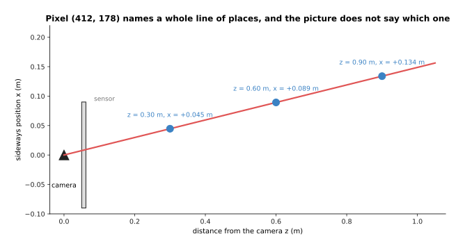

With a lens of focal length 615 pixels, pixel 412, 178 means the point 0.045 metres sideways at a distance of 0.30 metres, 0.089 metres sideways at 0.60 metres, and 0.134 metres sideways at 0.90 metres.

Every one of those places would make exactly the same pixel, which is true of
every pixel in every photograph ever taken, so what a robot needs is one more
number for each pixel saying how far along its direction the nearest surface
sits. A grid holding one such distance for every pixel is called a **depth
map**, and the small one below stands for a sloping table with a mug on it.

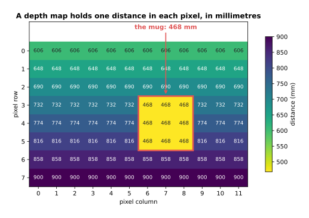

The table's distance grows from 606 millimetres at the top row to 900 at the bottom, while the nine cells of the mug all read 468 because the mug stands closer than the table behind it.

A depth map is stored exactly like a grey photograph, as one number per pixel, so
most of the tools built for pictures work on it, and the only difference is that
the number is a distance rather than a brightness. That changes what the picture
is useful for.

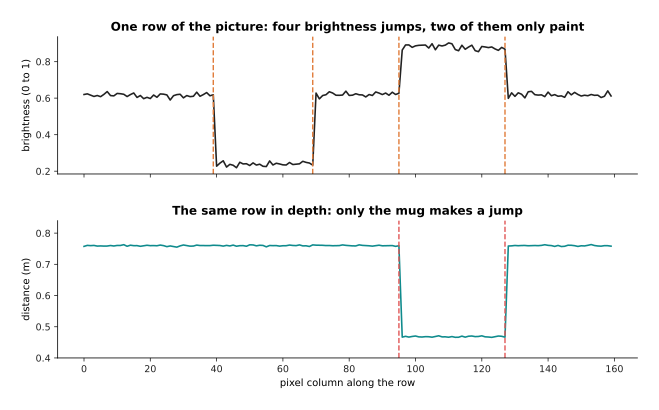

Along one row of this simulated scene the brightness jumps at columns 39, 69, 95 and 127 while the distance jumps only at 95 and 127, because the first two are a stripe painted on a flat table.

That picture is the reason a depth map is worth having at all. A painted line, a
shadow and a printed label all make brightness jump where nothing changes
physically, so a program looking for object edges in a photograph finds edges
that are not there, while in the depth map only the mug makes a jump because
only the mug sticks up. The two kinds of picture make different mistakes, which
is why a robot wants both, and the rest of this page is about how the second one
is produced.

---

## 2. Guessing depth from one picture

The cheapest way to get the depth map that section 1 asked for is to guess it
from the photograph you already have, using a network trained on pairs of
photographs and measured depth maps. Such a network works surprisingly well, and
it has one limit that no amount of training removes.

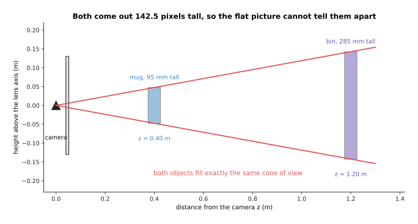

Through a lens of focal length 600 pixels, a mug 95 millimetres tall at 0.40 metres and a bin 285 millimetres tall at 1.20 metres both come out 142.5 pixels tall, because three times the size at three times the distance fills the same cone.

The arithmetic is one line, because the height of a thing in the picture is the
focal length times its real height divided by its distance, so 600 times 0.095
divided by 0.40 is 142.5 and 600 times 0.285 divided by 1.20 is also 142.5.
Nothing in the photograph tells the two apart, so a single picture can never give
a true distance on its own, and any model that returns one is leaning on an
assumption about how big things usually are.

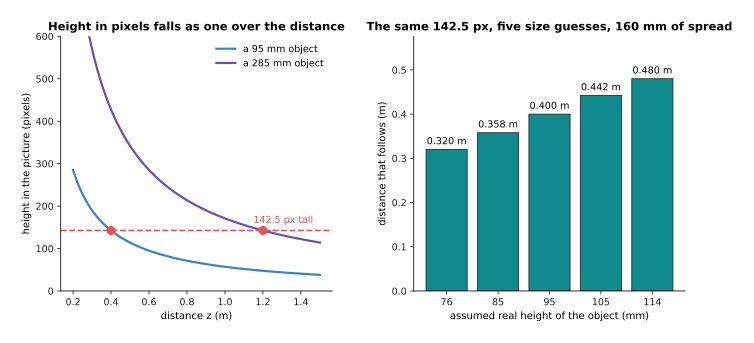

For a thing 142.5 pixels tall, assuming 76 millimetres puts it at 0.320 metres and assuming 114 puts it at 0.480, so a twenty per cent spread in the assumed size moves the answer by 160 millimetres.

That assumption is not written anywhere in the model but learned from the
training pictures, which is why these models work well on kitchens and offices
full of ordinary objects and badly on a bench covered in parts that have no usual
size, and why a doll's house breaks them completely. What the network does get
right is the shape of the scene, which is how the surfaces in it are arranged
relative to each other.

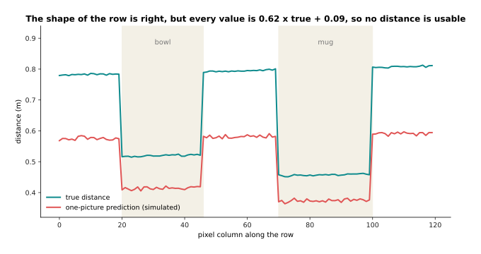

In this simulated row the prediction is 0.62 times the true distance plus 0.09, putting the mug 83 millimetres too near and the far table 216 millimetres too near, while keeping the near-to-far order exactly right.

A model whose output is right up to one multiplication and one addition like that
is still useful, because order is preserved, and the next section is about what
you can and cannot do with it.

---

## 3. Relative depth and metric depth

Section 2 produced a depth map that had the right shape and the wrong numbers,
and this section gives the two kinds of answer their names. A depth map that
tells you which surfaces are nearer than which, without being in any unit, is
called **relative depth**, and a depth map whose numbers are real distances in
metres or millimetres is called **metric depth**. The difference is not a matter
of accuracy, because a relative map is not a slightly wrong metric map. It is a
map that has no scale at all.

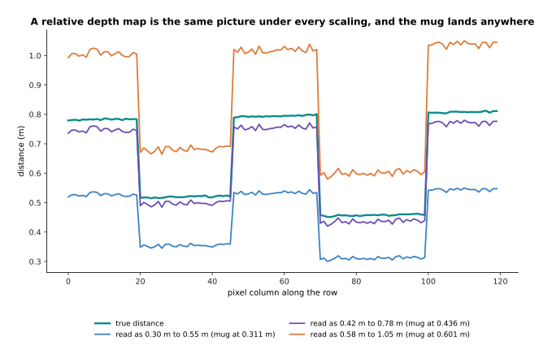

The same relative map read as 0.30 to 0.55 metres puts the mug at 0.311 metres, read as 0.42 to 0.78 it puts the mug at 0.436, and read as 0.58 to 1.05 it puts the mug at 0.601, and nothing in the map says which is right.

To turn a relative map into a metric one you need at least two real distances to
pin it to, which can come from a laser rangefinder, a stereo camera, or knowing
where the table surface is. You then find the one multiplication and the one
addition that carry the predicted values onto those two known distances, and
apply them everywhere else. The picture below shows how well and how badly that
works.

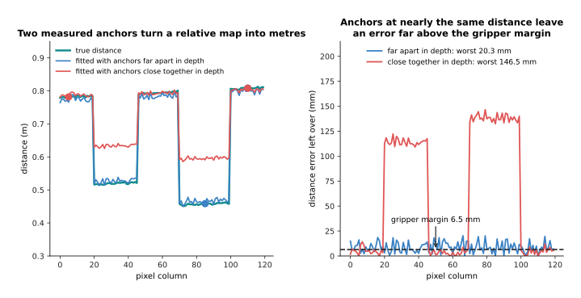

Two anchors 350 millimetres apart in depth leave a mean error of 8.7 millimetres and a worst of 20.3, while two anchors only 26 millimetres apart leave a mean of 61.6 and a worst of 146.5.

The reason the second fit is so much worse is that the two numbers being solved
for are a scale and an offset, and solving for a scale from two points at almost
the same distance divides by something close to zero, so the sensor noise at
those two pixels is multiplied up into the answer. Anchors have to straddle the
depth range you care about, which means one point on the near object and one on
the far background. Even the good fit leaves 20.3 millimetres in the worst place,
and the picture below says what that means for an arm.

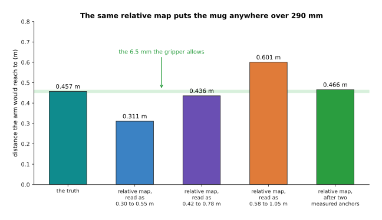

The mug really sits at 0.457 metres, the three readings of the relative map put it at 0.311, 0.436 and 0.601 metres, a spread of 290 millimetres, and the two-anchor fit puts it at 0.466 metres, 8.5 millimetres out against a gripper margin of 6.5.

So relative depth answers every question about order, including avoiding the
nearest obstacle and resolving "behind" in a phrase, and no question in
millimetres, while metric depth answers both. That is why a robot that has to
reach needs either a model that returns metres or a second sensor to pin a
relative one to, and the next two sections are about the sensors that measure
distance directly.

---

## 4. Two cameras, and the arithmetic of the shift

Section 3 needed real distances to pin a relative map to, and the oldest way of
measuring one is to use two cameras instead of one. Two cameras a fixed distance
apart, looking at the same scene, are called a **stereo** pair, the distance
between them is the baseline, and the difference between where a point lands in
the two pictures is called the disparity. The whole method is one division.

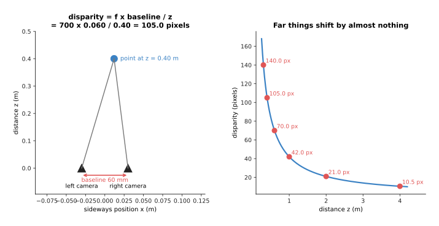

With a focal length of 700 pixels and a baseline of 60 millimetres the disparity is 42 divided by the distance, so a point at 0.40 metres shifts by 105 pixels, one at 1 metre by 42 and one at 4 metres by only 10.5.

Because the disparity falls as one over the distance, the error does not stay
the same across the room, and the same quarter of a pixel of matching
uncertainty turns into a distance error that grows with the square of the
distance.

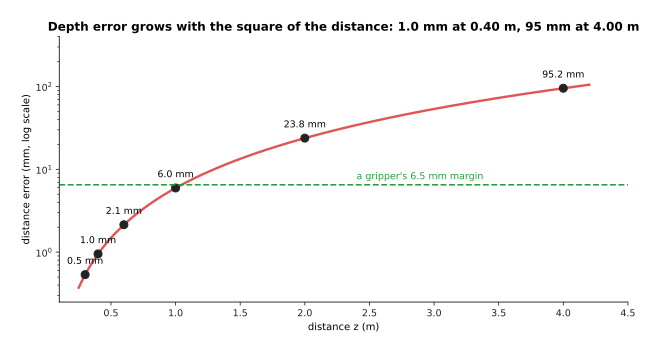

A quarter of a pixel of matching error costs 1.0 millimetres at 0.40 metres, 6.0 at 1 metre and 95.2 at 4 metres, so ten times the distance brings a hundred times the error.

That curve explains why stereo is a good choice for a table in front of an arm
and a poor one for the far end of a room, and it also says what to do when
accuracy is short, which is to move the cameras further apart or to use a longer
lens, since both the baseline and the focal length sit underneath the division.
Widening the baseline costs you the near range, because two cameras far apart
stop seeing the same close object at all. The hard part, though, is not the
arithmetic but working out which pixel in the right picture is the same surface
as a given pixel in the left one, and that is only possible where the surface has
something to match.

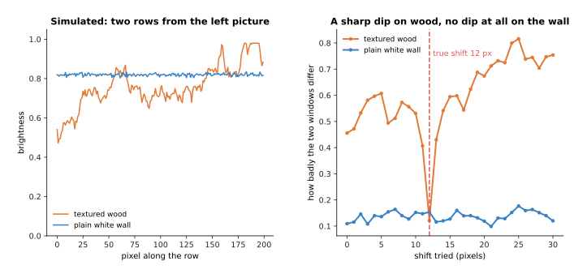

On the simulated wood the best shift is the true 12 pixels and the next-best away from it scores 0.335 worse, while on the plain white wall the whole curve spans only 0.078 and the best shift lands at a wrong 21 pixels.

So a stereo camera gives nothing on a blank wall or a plain white table, and the
common fix is to throw texture onto the scene instead of waiting for it, which is
what the next section is about.

---

## 5. Cameras that throw a pattern, and the surfaces that defeat them

Section 4 ended with stereo failing for want of texture, and the fix is to add
some. A depth camera of this kind shines a pattern of infrared dots onto the
scene and measures where each dot lands, either with a second camera or by
comparing against the pattern it sent, which gives every surface something to
match and makes a blank table stop being a problem. Such cameras are what most
robot arms have bolted above them. The method has one requirement, which is that
the dots must come back, and three common kinds of surface do not return them.

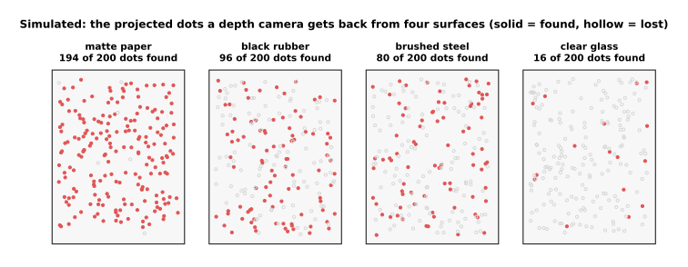

In this simulation, matte paper returns 194 of 200 dots, black rubber returns 96, brushed steel returns 80 and clear glass returns only 16.

The three failures have three different causes, because a dark surface absorbs
the infrared light instead of scattering it, a shiny surface sends it off in one
direction that is usually not back towards the camera, and a clear surface lets
it through almost unchanged. The fractions above are made up, but the ordering is
what happens in a workshop.

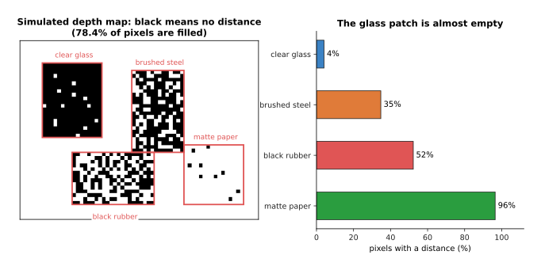

Over the simulated map 78.4 per cent of all pixels carry a distance, but only 4.1 per cent of the clear glass patch does, against 34.7 for brushed steel, 52.3 for black rubber and 96.5 for matte paper.

A hole in a depth map is not the worst outcome, because a program can see that a
pixel has no distance and refuse to act on it. The dangerous case is a wrong
distance that looks exactly like a right one, and clear glass produces it every
time.

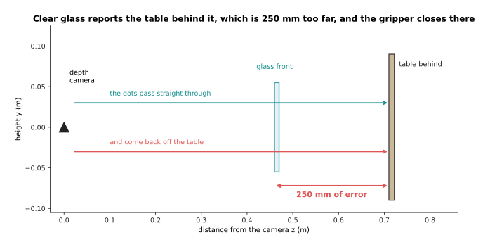

The glass stands at 0.460 metres and the table behind it at 0.710, so the dots pass through the glass and come back off the table, and the camera reports the glass as 250 millimetres further away than it is.

A gripper sent to 0.710 metres travels 250 millimetres past the front of the
glass before the fingers close, so it drives into the glass and knocks it over,
and nothing in the depth map warned it. The usual answers are to find the
transparent object in the colour picture and fill its depth in from a model
trained for that job, or to feel for the surface with a force sensor instead of
trusting the camera, and the catalogue page on [depth from
pictures](../../07_learned-models/03_seeing-models/03_also-used/02_depth-from-pictures.md)
names the models built for transparent objects.

---

## 6. From a depth picture to a shape the arm can use

Sections 2 to 5 all produced a depth map, and a depth map is still laid out as a
picture, while an arm does not move in picture coordinates. Turning the map into
positions is three lines of arithmetic using four numbers measured once when the
camera was calibrated.

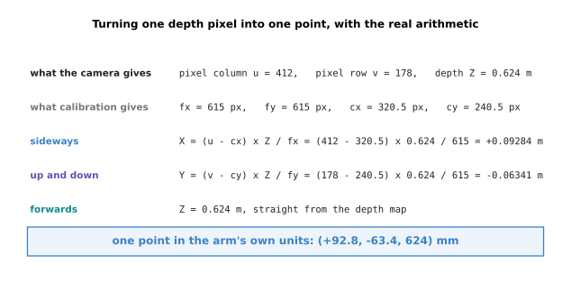

Pixel 412, 178 at a depth of 0.624 metres gives a sideways position of 0.09284 metres and an up-and-down position of -0.06341 metres, which is the point 92.8, -63.4, 624 in millimetres.

The sideways position is the pixel's column minus the column the lens looks
straight through, multiplied by the depth and divided by the focal length, and
the up-and-down position is the same with rows. Doing that for every pixel with a
distance turns the map into the point cloud described on [pictures, sound and
robot
states](../05_turning-the-world-into-numbers/02_pictures-sound-and-robot-states.md).


A 640 by 480 depth map has 307,200 pixels, and at the 78.4 per cent fill of section 5's simulated map that is 240,800 points, or 2.9 megabytes a frame and 87 megabytes a second at thirty frames a second.

That list has one awkward property, which is that the order of its entries means
nothing, since the same tabletop can arrive as the same points in any order. A
network that reads points must therefore give the same answer whatever order they
come in, and an ordinary fully connected layer does not.

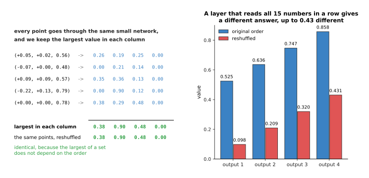

Keeping the largest value in each column gives 0.38, 0.905, 0.48 and 0.00 whatever order the five points arrive in, while a layer that reads all fifteen numbers in one row changes its answers by up to 0.43 when they are reshuffled.

That is the whole trick behind networks that read points directly. Each point is
treated on its own by a small network, the results are combined by an operation
that does not care about order, and later layers look at each point with its
nearest neighbours, which is how such a network learns shape. The alternative is
to chop the space into equal cubes and record what falls in each.

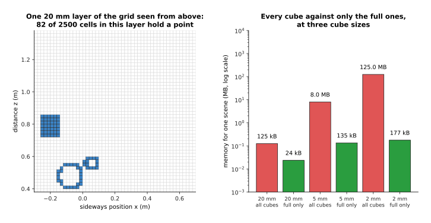

One 20 millimetre layer holds points in 82 of its 2,500 cells, and over a one metre cube the 5 millimetre grid has 8,000,000 cells of which 11,242 are touched, which is 0.141 per cent.

Each of those cubes is a **voxel**, the three-dimensional version of a pixel,
and recording which ones contain surface is called **occupancy**. The appeal is
that a voxel grid is regular, so the convolutions that work on pictures work on
it unchanged, and the cost is in that 0.141 per cent, because storing every cube
of a one metre box at 5 millimetres takes 8 megabytes and at 2 millimetres takes
125, while a list of only the full ones takes 135 and 177 kilobytes. Almost all
of a room is air, which is why real systems store only the occupied cells and
why point-based networks are more common now.

---

## 7. Learned scenes: radiance fields and splatting

Sections 1 to 6 all described one camera position at one moment, and a point
cloud built that way has holes wherever the camera could not see. The last idea
on this page is different in kind, because instead of measuring one view it fits
a description of the whole scene to many photographs at once, and then draws the
scene again from any viewpoint you ask for.

The first way of doing this is a **neural radiance field**, which is a small
network that answers one question: given a place in the room and a direction you
are looking from, what colour is there and how solid is it. To draw one pixel
you follow the ray out from the camera, ask the network at a series of points
along it, and mix the answers in order so that a solid surface blocks what is
behind it, and the network is trained by drawing the photographs again and
comparing them with the real ones. That is a clean idea with an expensive
consequence.

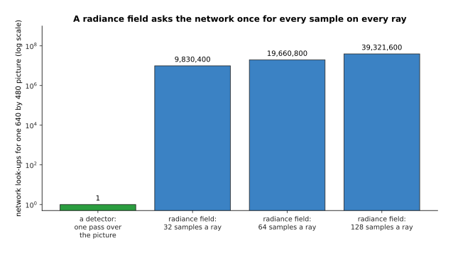

Drawing one 640 by 480 picture from a radiance field at 64 samples a ray takes 19,660,800 network calls, while a detector runs its network once over the whole picture.

Twenty million small network calls for one frame is why early radiance fields
took many seconds to draw a single picture, which is far too slow for a robot
that has to decide something now. **Gaussian splatting** solves the same problem
by replacing the network with a pile of soft coloured blobs, each with a place, a
width in each direction, a turn, a solidity and a colour that varies with the
direction you look from, so that drawing the scene means sorting the blobs by
distance and painting them one over another with no network call at all.

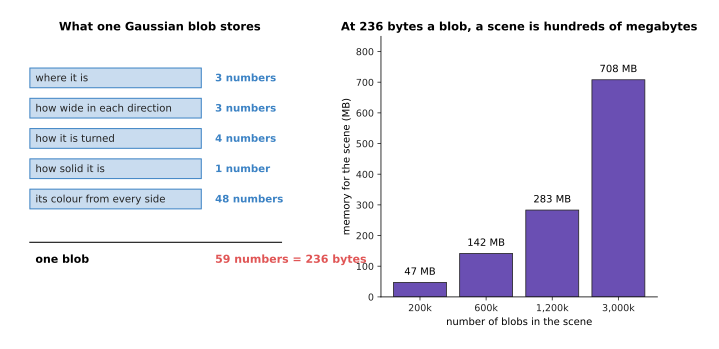

If each blob keeps 3 numbers for where it is, 3 for its widths, 4 for its turn, 1 for its solidity and 48 for its colour, that is 59 numbers or 236 bytes, so 1.2 million blobs take 283 megabytes.

That is the honest trade. Splatting is fast enough to draw many times a second on
an ordinary graphics card, which is what made this family usable at all, and it
pays for that speed in memory, because a scene is hundreds of megabytes rather
than the few megabytes a small network takes. Both methods are also fitted to one
scene rather than trained once and used everywhere, so moving the robot to a new
room means fitting a new scene from new photographs, which takes minutes.
Methods that predict the blobs in one pass from a handful of photographs exist
and are improving quickly, but a per-scene fit is still what most working systems
do. What a robot gets for that cost is a view it never took.

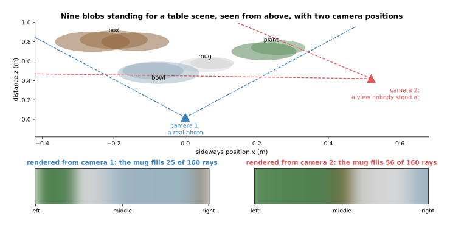

From the photographed position three of the nine blobs are visible and the mug fills 25 of the 160 rays, while from a position nobody stood at six are visible and the mug fills 56 rays, and drawing that strip took 7,680 samples.

Asking what the shelf looks like from above, without moving the camera there, is
worth a great deal to a grasp planner, because a grasp is chosen from a shape and
a shape built from one viewpoint is missing its back. The catalogue page on
[scene
reconstruction](../../07_learned-models/04_3d-models/02_most-used/02_scene-reconstruction.md)
lists the real systems of both kinds. At the start of 2027 a depth camera is
still what measures the table in front of the arm, while a fitted scene is what
you build when you need the whole object or a view from somewhere the camera
cannot go.

---

## 8. Where to read next

- [Large language
  models](../10_language-and-multimodal-models/01_large-language-models.md) is
  the next page, and it starts the chapter on models that read and write words
  rather than look at pictures.
- [Pictures, sound and robot
  states](../05_turning-the-world-into-numbers/02_pictures-sound-and-robot-states.md)
  explains how a point cloud is fed to a network as numbers, which is the step
  before section 6's layers.
- [World models](../12_models-that-act/04_world-models.md) uses learned scene
  descriptions of the kind in section 7 to predict what happens next.
- [Depth from
  pictures](../../07_learned-models/03_seeing-models/03_also-used/02_depth-from-pictures.md)
  is the catalogue of the real single-picture and stereo depth models, including
  those built for transparent objects.
- [Point cloud
  models](../../07_learned-models/04_3d-models/02_most-used/01_point-cloud-models.md)
  is the catalogue for section 6's networks that read points directly, inside the
  wider [3D models](../../07_learned-models/04_3d-models/01_overview.md)
  chapter.

---

## 9. Using it in Python

Section 6 turned one pixel into one point, and the code below does that for a
whole depth map in NumPy, which is how it is done in practice because NumPy does
every pixel at once. The four lens numbers are the ones from section 6.

```python
import numpy as np

fx, fy, cx, cy = 615.0, 615.0, 320.5, 240.5     # section 6's calibrated lens
depth = np.full((480, 640), 0.624)              # a depth map, in metres
depth[0, 0] = 0.0                               # a pixel with no distance

rows, cols = np.mgrid[0:depth.shape[0], 0:depth.shape[1]]
x = (cols - cx) * depth / fx                    # section 6: sideways
y = (rows - cy) * depth / fy                    # section 6: up and down
cloud = np.stack([x, y, depth], axis=-1)[depth > 0]   # drop the empty pixels

print(cloud.shape)                              # (307199, 3)
print(np.round(cloud[178 * 640 + 412 - 1], 5))  # [ 0.09284 -0.06341  0.624  ]

f, baseline, pixel_error = 700.0, 0.060, 0.25   # section 4's stereo pair
for z in (0.40, 1.00, 4.00):
    print(z, round(f * baseline / z, 1),        # disparity in pixels
          round(z ** 2 / (f * baseline) * pixel_error * 1000, 1))   # error in mm
```

The point printed for pixel 412, 178 is `[0.09284 -0.06341 0.624]`, which is
section 6's worked example, and the stereo loop prints section 4's numbers: 105.0
pixels and 1.0 millimetres at 0.40 metres, 42.0 pixels and 6.0 millimetres at 1
metre, and 10.5 pixels and 95.2 millimetres at 4 metres. One pixel is dropped by
the `depth > 0` test, which is why 307,200 pixels give 307,199 points.

The libraries take over above that line. A depth camera's own driver gives you
the depth map and the four lens numbers already measured, the Open3D package
holds point clouds and does the filtering and plane-finding that section 6
implies, and Hugging Face `transformers` loads a single-picture depth model with
`pipeline('depth-estimation')` so that section 2's guess is one call. None of
them removes the arithmetic above, because every one of them expects you to know
whether your numbers are in metres.

What you still have to decide is which source of depth to use, and sections 2 to
5 are the list of trades. A single-picture model is free and gives relative
depth, which section 3 showed is useless for reaching unless you pin it with
measured anchors. A stereo pair measures real distances, and section 4 showed
that its error grows with the square of the distance and that matching fails
without texture. A pattern-throwing camera fixes the texture problem and section
5 showed it fails on glass in the worst possible way, by returning a confident
wrong number. Most working arms use a pattern-throwing camera for the table and
reach for one of the others only where it is known to fail.
