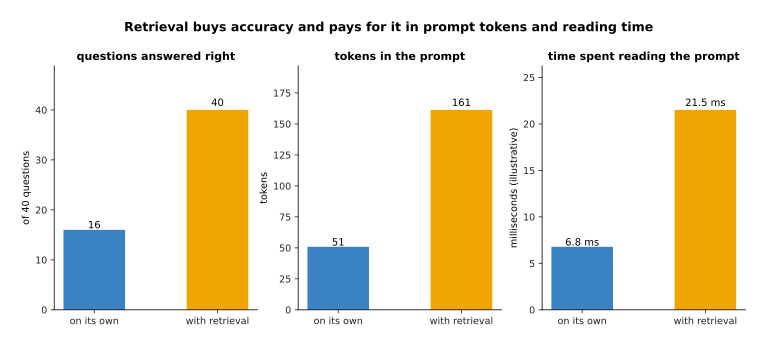

# Large language models

The page before this one, [Depth and the third
dimension](../09_models-that-see/04_depth-and-3d.md), closed the chapter on models
that see by turning a flat picture into a shape with distance in it. This page
opens a new chapter and changes the input from pictures to words, because the
machinery that reads a picture patch by patch is the same machinery that reads a
sentence token by token, and it is now time to see what that machinery does when
it is trained on an enormous amount of written text.

The chapter on [the transformer](../06_the-transformer/01_attention.md) already
built the parts. [Training and running a
transformer](../06_the-transformer/03_training-and-running-a-transformer.md)
showed that such a model is trained to guess the next token, that a mask stops it
from reading ahead, that the stored keys and values let it carry on without
redoing its work, and that sampling turns its numbers into text. So this page does
not build anything new. It answers a different question: what do you actually get
when that same machinery is trained on more text than a person could read in a
thousand lifetimes, and what does the thing you get fail at?

This page is for a reader who has read the transformer chapter and who knows what
a **token** is, which is one piece of text, usually a short run of letters rather
than a whole word, as [Tokens and
embeddings](../05_turning-the-world-into-numbers/01_tokens-and-embeddings.md)
explained. You do not need any other background, because every new word here is
explained where it first appears.

Every picture here comes from a small model built inside the diagram script rather
than from a real large language model, and it matters to say so plainly. That small
model counts: it was given a made-up corpus of 29,137 short robot sentences holding
313,504 words and only 144 different words in all, and it works out what comes next
by counting how often each word followed the last few words, falling back on
shorter stretches of context when it has never seen the longer one. What it shares
with a real model is the thing this page is about, which is that it puts a
probability on every word it knows and answers by picking one word at a time, so
the numbers show the real shape of the behaviour even though they come from a
toy.

## Contents

1. [What the model actually predicts](#1-what-the-model-actually-predicts)
2. [What a very large amount of text teaches it](#2-what-a-very-large-amount-of-text-teaches-it)
3. [How a conversation becomes one stream of tokens](#3-how-a-conversation-becomes-one-stream-of-tokens)
4. [Why a wrong answer arrives in the same tone as a fact](#4-why-a-wrong-answer-arrives-in-the-same-tone-as-a-fact)
5. [Retrieval: keeping the knowledge outside the weights](#5-retrieval-keeping-the-knowledge-outside-the-weights)
6. [The real shape of the cost of an answer](#6-the-real-shape-of-the-cost-of-an-answer)
7. [What these models cannot do](#7-what-these-models-cannot-do)
8. [Where to read next](#8-where-to-read-next)
9. [Using it in Python](#9-using-it-in-python)

---

## 1. What the model actually predicts

A **large language model** is a transformer with a very large number of weights
that has been trained on a very large amount of written text to do one job, and
the job is narrower than it looks from the outside. Given the text so far, the
model gives a number to every single token in its vocabulary, and those numbers
are the probabilities that each token is the next one. There is no list of facts
inside it, no index, and nothing that could be called looking something up. There
is a guess about the next piece of text, and then another guess, and then another.


After the four words "pick up the red" the small model gives block 0.375, cup
0.180, bowl 0.117, mug 0.085, jar 0.063, plate 0.061, bottle 0.045 and box 0.036,
and all 135 remaining words share the last 0.023 between them.

Read that as one complete answer to one question. The question is "what comes
next", and the answer is not a word but a whole set of numbers, one for every word
the model knows. The eight objects at the front really followed "pick up the red"
in the corpus, so they take almost all of the probability, and their shares follow
how often each object was mentioned. The grey bar matters just as much, because
every other word in the vocabulary still has a share, even words that would make no
sense there.


Sorting the same 147 numbers from largest to smallest shows that the top eight
words hold 0.962 of the probability between them, while the least likely word of
all still gets 0.0000027.

That floor is not a quirk of the small model, because a real transformer ends with
the same rule. [The score of being
wrong](../03_how-training-works/01_the-score-of-being-wrong.md) explained that a
network turns its raw output numbers into probabilities with softmax, and softmax
divides one positive number by the sum of all of them, so no token can ever come
out at exactly zero. That is why a language model will always produce something.
It is never in a position where it has nothing to say, because something always
has the largest number.


Taking the most likely word each time and adding it to the text gives "pick up the
red block and place it on the tray .", and the nine choices that built it had
probabilities of 0.375, 0.486, 0.960, 0.960, 0.961, 0.967, 0.330 and 0.962.

This is the whole of what the model does, and it is worth sitting with how little
it is. The model worked out a set of numbers, something picked one word, that word
was glued on to the end of the text, and the model worked out a whole new set of
numbers for the longer text. Nothing was planned, and the sentence was not chosen
as a sentence, because the model has no way to represent a sentence it has not
written yet. The probability of all nine words together is 0.0497, which is the
eight numbers multiplied, and the row of 0.96 values shows that once the model is
inside a phrase it has seen many times it becomes almost certain, while at the two
choice points, the object and the place, it is not.

---

## 2. What a very large amount of text teaches it

Those probabilities had to come from somewhere, and they came from training on
text. The **pretraining corpus** is the collection of text a model is trained on
before anybody tries to make it useful, and for a real model it is gathered from
web pages, books, code, forum posts and much else, cleaned, and cut down to remove
repeats. The training job itself is the one the transformer chapter described:
show the model some real text, ask it to guess each next token, and change the
weights so the token that really came next is given more probability. That is all
the supervision there is, and it needs no labels, because the text labels itself.


Trained on 250 sentences the small model needs 2.34 bits to express each word of
text it has never seen, and by 30,000 sentences it needs 1.32 bits, with most of
the gain arriving early and the curve flattening out.

That single number is what training drives down. It is the surprise, in bits, of
text the model did not train on, and it is the cross-entropy loss of chapter three
written in a unit that is easier to feel, since 2.34 bits means behaving as though
about 5 words were plausible at each point and 1.32 bits means about 2.5. Driving
it down is the entire goal of pretraining, and everything a large language model
appears to know is a side effect of doing that well, because text stating a true
fact is easier to continue if you have stored the fact.


The simulated corpus is 36.9 per cent instructions, 32.8 per cent runs of questions
with no answers, 26.1 per cent descriptions, 3.4 per cent small sums and 0.8 per
cent sentences that say which drawer a tool lives in.

The mixture is the part of pretraining people argue about most, because a model can
only learn what the text contains and it learns common things far better than rare
ones. The drawer facts here are 2,359 words out of 313,504, which is why section 4
can show the model failing on exactly those, and the questions are a third of
everything, which is why page two can show it answering a question with another
question. A real corpus has the same property on a different scale, so a model
trained where some subject barely appears will be bad at it and will not say so.


On held-out text the same model guesses joining words such as "the" and "on"
correctly 90.6 per cent of the time, object names 39.2 per cent of the time, and
tool names only 2.9 per cent of the time.

So one model is confident about the shape of the language and almost helpless about
which particular thing is being named, and that gap follows directly from the
training job, because joining words are nearly forced by the words around them
while the tool a sentence happens to mention is close to arbitrary. Compare this
with the obvious alternative, which is to write the rules of the language by hand
or to hand-label a dataset of facts. Hand rules were tried for decades and break on
the first sentence their author did not imagine, and hand labels cost human time
for every example, whereas next-token prediction turns any text at all into
training data at no labelling cost. What it costs is control, because you cannot
tell the model which parts of the corpus to believe, and that cost is paid in full
in section 4.

---

## 3. How a conversation becomes one stream of tokens

Pretraining gives a model that continues text, and yet what people use is a
conversation with turns in it, so something has to join the two. The join is
simpler than it looks. A conversation is written out as one single run of tokens,
exactly like any other text, and who is speaking is marked by special tokens that
were added to the vocabulary for the purpose. The model never sees a conversation.
It sees one long piece of text in which some tokens happen to mean "the person
speaks here" and others mean "the answer starts here".


A short conversation with a system prompt and five turns is one stream of 98
tokens, made of 37 for the system prompt, then 9, 22, 10, 12 and 8 for the turns in
the order they happened.

The first part of that stream is the **system prompt**, a piece of text placed
before everything else to say what the model is for and how it should answer. It
has no special power and no separate channel, because it is tokens in the same
stream as the rest, and it works only because the model was trained on text where
instructions at the start were followed by text that obeyed them. That is also why
a later turn can argue with it, since nothing in the machinery gives the earlier
tokens authority over the later ones.


Over twelve simulated turns the stream grows to 1,638 tokens, and because the whole
stream is read again on every turn, the model has read 9,471 prompt tokens by the
end rather than 1,638.

That second line is the cost that surprises people, and it follows from the
mechanism rather than from any choice, because the model has no memory between
calls, so the conversation so far is the input to every call and twelve turns are
read twelve times over. The key-value cache of the transformer chapter makes this
much cheaper, since the work done on earlier tokens can be kept rather than redone,
but keeping it costs memory instead, which section 6 measures.


With a window of 1,024 tokens the oldest turn has to be dropped from turn 8
onwards, and by turn 16 the conversation is 2,102 tokens long and nine of its turns
have fallen out.

The window here is the context window the transformer chapter introduced, which is
the longest stream the model can be given at once. Real windows are far larger than
1,024 tokens and are still finite, so every long conversation reaches this picture
eventually and something has to decide what to throw away, usually by dropping the
oldest turns, replacing them with a summary the model writes itself, or storing
them elsewhere and fetching the relevant parts back, which is section 5. Whichever
is chosen, the model does not know anything was dropped, and it answers as
confidently about the part it can no longer see as about the part it can.

---

## 4. Why a wrong answer arrives in the same tone as a fact

The last section ended with a model answering confidently about something it could
not see, and that is the everyday failure of these models. A **hallucination** is
an answer that is false but written exactly like a true one, with no hedge and no
sign of doubt. It is tempting to describe this as the model lying or making things
up, but that language hides the mechanism, and the mechanism is simple enough to
show with real numbers.


The corpus states the spanner's drawer 80 times and the model answers 3 with
probability 0.945, which is right; the corpus never states the scalpel's drawer at
all and the model answers 3 with probability 0.533, which is wrong, because the
true drawer is 8.

Look at what the model did in the second case. It had never seen "the scalpel is in
drawer", so it fell back on the shorter stretch "is in drawer" that it had seen,
and answered with the drawer that usually follows those words. That is not a lie
and it is not a guess the model knows to be a guess; it is the most probable
continuation given what the model has, and it comes out in the same calm form as
the true answer because nothing in the machinery separates the two cases. A real
transformer does this through attention rather than by backing off to shorter
counts, and the outcome is the same, because when the particular fact is missing
the general pattern fills the gap, and the general pattern here is that tools live
in drawer 3.


Across 40 tools the top answer is right for every tool whose drawer was stated more
than five times and right for none of the twenty never stated, while the
probability the model puts on its own answer only falls from 94 per cent to 53 per
cent.

That is the dangerous part. The accuracy falls off a cliff and the confidence
drifts gently down, so confidence is nearly useless as a warning. The gap between
the green bars and the orange bars in that picture is the whole problem, and it is
why a sensible system never treats a stated fact from a language model as checked.


Writing the right drawer costs the model 3.75 bits of surprise, writing the
plausible wrong drawer costs 0.96 bits, and writing "i do not know" costs 53.85
bits.

Now the reason is mechanical rather than moral. Training rewarded the model for
making real text cheap, and the corpus is full of sentences naming a drawer and
holds none that admits ignorance, so under the only measure training ever applied
the confident wrong answer is the best of the three and the honest one is by far
the worst. The model was never once rewarded for abstaining, so it never learned
to, and pretraining alone cannot produce a model that says it does not know,
because saying so does not fit the text and fitting the text is the whole
objective.


On the same 40 drawer questions the plain model is right 16 times and wrong 24
times, putting the text into the prompt makes it right 40 times, and refusing to
answer below a confidence of 0.60 removes every wrong answer at the price of 26
questions left unanswered.

Four things reduce hallucination and none removes it. Putting the relevant text in
the prompt works best and is the next section. Giving the model a tool that can
check something, such as a database or a calculator, moves the answer out of the
weights. Asking for the source of a claim helps a little, because a model that
cannot produce one has often invented the claim, though it can invent a source too.
Training that rewards abstaining, one subject of [the next
page](02_post-training-a-language-model.md), is the only one of the four that
changes the model itself. Be careful about the clean split in that last picture,
because the toy model's confidence happens to separate the two groups neatly and a
real model's does not, so a refusal threshold always throws away some right
answers.

---

## 5. Retrieval: keeping the knowledge outside the weights

Section 4 showed the prompt fixing what the weights got wrong, and that observation
is the whole of the method this section describes. **Retrieval-augmented
generation** means using the question to find relevant text, putting that text into
the prompt, and letting the model read it there, so that the knowledge the answer
depends on lives in a store you control rather than inside the weights. The model
is not changed at all, and no training happens.


The question "which drawer holds the scalpel ?" is compared with all 48 stored
notes, and the note about the scalpel scores 0.549 while every note about a
different tool scores about 0.076.

That comparison is the simplest one that works: count the words shared between the
question and each piece of text, weight each word by how rare it is across the
store, and measure the angle between the two counts. The rare word "scalpel" does
nearly all the work, which is why its own note stands out and why the tray note
comes second, since it shares "holds" and "the tray". Real systems usually compare
embeddings instead of words, using the vectors that [Tokens and
embeddings](../05_turning-the-world-into-numbers/01_tokens-and-embeddings.md)
described, so a question about a scalpel can find a note about a blade.


With nothing but the question the model gives the right drawer a probability of
0.077, and with the three best-matching notes in the prompt the right drawer rises
to 0.797 and becomes the answer.

Nothing about the model changed between those two pictures, and that is the point
to hold on to, because the same weights asked the same question gave a different
answer once the evidence was in front of them. A real transformer does this through
attention, which lets a later token look back at the retrieved text and copy from
it, and the small model imitates that by mixing its counts with what the prompt
says comes next. Either way the knowledge lives in the prompt, so correcting a
wrong fact means editing a document rather than retraining anything, and the model
can be asked about something invented after it was trained.



Retrieval turns 16 right answers out of 40 into 40 out of 40, and pays for it with
a prompt that grows from 51 tokens to 190 and a reading time that grows from 6.8
milliseconds to 25.3.

So the honest comparison with the obvious alternative, which is to train the facts
into the model, runs like this. Training them in makes the prompt short and the
answer fast, and it costs a training run every time a fact changes, with no way to
tell afterwards which fact the model used. Retrieval costs tokens and time on every
single question, and in exchange the facts can be edited in a file, the model can
name the document it used, and a fact that is missing from the store is visibly
missing rather than quietly invented. For anything that changes, such as which
drawer a tool is in or what a robot cell looks like today, retrieval is the right
side of that trade, and the cost it adds is the subject of the next section.

---

## 6. The real shape of the cost of an answer

Section 5 added tokens to the prompt and called it cheap, and whether that is true
rests on a split anyone putting these models on a robot has to understand.
Answering happens in two stages with very different speeds. Reading the prompt is
called prefill, and the whole prompt goes through the network in one pass, so a
graphics processing unit can work on all of its tokens at once. Writing the answer
is called decode, and it cannot work that way, because each token must exist before
the next can be worked out, so the answer comes out one token per pass. The numbers
below use an illustrative reading rate of 7,500 prompt tokens a second and an
illustrative writing rate of 55 answer tokens a second, which are in the right
region for a mid-sized model on one modern accelerator but measure no particular
system.


Reading 900 prompt tokens takes 120 milliseconds while writing 400 answer tokens
takes 7,273 milliseconds, so the shape of the bill is set almost entirely by how
long the answer is.

The practical lesson sits in that picture and it is not the one people expect. A
prompt five times longer barely moves the total, while an answer five times longer
multiplies it, so if you want a faster system you should shorten the answer before
you shorten the prompt. Asking for one sentence rather than a paragraph is worth
more than trimming the instructions, and asking for a single word, such as a
decision rather than an explanation of it, is worth more still.


With a 900-token prompt the first token takes 138 milliseconds and each token after
it takes 18.2 milliseconds, and with a 32,000-token prompt the first token alone
takes 4,285 milliseconds.

The first token is slower because the whole prompt must be read before anything can
be written, so the reading cost is paid in full before that token appears and never
again, which is why a long conversation feels slow to start and then runs at a
steady speed, and why systems that must feel responsive send tokens out as they are
produced.


With illustrative shapes of 32 layers, 8 key-value heads, a head size of 128 and
two bytes a number, the stored keys and values take 128 kilobytes per token, so
8,000 tokens need 1.0 gigabyte, 32,000 need 3.9 and 128,000 need 15.6.

That memory is the price of not redoing the work, and it is paid per conversation,
which is what makes it awkward, because a board with 16 gigabytes has to hold the
weights as well, so a robot keeping one very long conversation open spends on
memory what it saved on time and a robot serving several at once multiplies the
problem. The usual answers are to keep the conversation short, to summarise the old
turns, or to store the keys and values in a smaller number format.


An arm running its control loop at 20 hertz has 50 milliseconds to decide, while
the four answers measured above take 11, 24, 148 and 94 control cycles.

This is the number that settles how a language model can be used on a robot at all.
It cannot sit inside the control loop, because it is between one and two orders of
magnitude too slow, and no amount of tuning closes a gap that large. What it can do
is sit above the loop and be asked rarely: once when a new instruction arrives, to
turn a sentence into a plan; once when something unexpected happens, to decide what
to try next; and never while the arm is moving. The fast loop is run by something
else, and the models that can run inside it are the subject of the chapter on
models that act.

---

## 7. What these models cannot do

The timing in section 6 is a limit you can plan around, and this section is about
limits of a different kind, which are jobs the machinery is simply the wrong shape
for. The clearest is arithmetic that the model has not been given a tool for, and
the reason is a counting argument rather than an opinion.


There are 81 different one-digit multiplications, 8,100 two-digit ones, 810,000
three-digit ones and 81,000,000 four-digit ones.

A model can remember the small cases, because any corpus that mentions arithmetic
contains most of the 81 one-digit products many times over. It cannot remember the
four-digit cases, because 81 million examples of something rarely written down are
in no corpus, so the only way to get those right is to carry out the procedure
rather than recall the answer. Models can be trained to do the procedure in
writing, which is part of what page two's section on reasoning training covers, and
they remain slower and less reliable at it than the calculator any program can
call, which is why giving the model a tool is the usual answer.


The corpus states 48 of the 81 one-digit sums and the model gets every one of them
right, while for the 33 it never states, such as three plus three, it gets none
right, answering 4 with probability 0.22 and giving the true total 6 less than
0.001.

That is the arithmetic version of the drawer picture, and the failure has the same
shape, because where the answer was in the corpus the model repeats it and where it
was not the model falls back on what usually follows those words, producing a
number that looks exactly as much like an answer as the right one did. It has not
learned addition, it has learned which totals follow which phrases, and nothing in
the training would tell the two apart.


The small tokeniser built in the same script turns "screwdriver" into 8 pieces,
"conveyor" into 5, "multimeter" into 7 and "gripper" into 2, and the model only
ever sees the pieces.

Anything that needs a count runs into this. Asking how many times a letter appears
in a word asks about something the model cannot see, since the word reached it as a
handful of pieces and the letters inside a piece are not separate things to it, and
the same holds for counting words in a passage, items in a list or steps already
taken, because none of those is a quantity the machinery works out. Models answer
such questions anyway, and the answers are often close and sometimes right, which
makes this a worse failure than a refusal would be, so if a count matters you
should count it in your own code.

---

## 8. Where to read next

- [Post-training a language model](02_post-training-a-language-model.md) is the
  next page, and it explains how a model that only continues text is turned into
  one that answers, follows instructions and sometimes declines.
- [Vision-language models](03_vision-language-models.md) joins a vision backbone to
  the model on this page, so that the same stream of tokens can hold pictures as
  well as words.
- [Reasoning and tool use](04_reasoning-and-tool-use.md) picks up the arithmetic and
  counting failures from section 7 and shows what writing out the working and
  calling a tool actually fix.
- [Training and running a
  transformer](../06_the-transformer/03_training-and-running-a-transformer.md) is
  worth rereading after this page, because the key-value cache and the sampling
  rules it describes are what section 6 was measuring.
- [Language models](../../07_learned-models/07_language-models/01_overview.md) in
  the catalogue of learned models describes what this family is used for on a robot
  arm and which kinds of model exist.
- [Language models as
  planners](../../07_learned-models/07_language-models/03_also-used/01_language-models-as-planners.md)
  shows the pattern section 6 pointed at, where the model is asked once for a plan
  and something faster carries it out.

---

## 9. Using it in Python

Section 1 said that a model's answer at one position is a probability for every
token, and section 4 measured what a continuation costs in bits. Both of those are
a few lines of NumPy, and they are worth writing out because they are the two
calculations this whole page rests on. The numbers in the comments are what the
code prints.

```python
import numpy as np

# section 1: a model gives one raw number, a logit, per token in its vocabulary,
# and softmax turns the whole row into probabilities that add up to 1
logits = np.array([6.1, 5.4, 4.9, 4.6, 4.2, 4.1, 3.9, 3.6])
names = ['block', 'cup', 'bowl', 'mug', 'jar', 'plate', 'bottle', 'box']
p = np.exp(logits - logits.max())          # subtracting the largest avoids overflow
p = p / p.sum()
print([f'{n} {v:.3f}' for n, v in zip(names, p)])
# ['block 0.400', 'cup 0.199', 'bowl 0.121', 'mug 0.089',
#  'jar 0.060', 'plate 0.054', 'bottle 0.044', 'box 0.033']
print(round(float(p.sum()), 6))            # 1.0

# section 4: the training cost of writing a token, in bits of surprise
print(round(float(-np.log2(p[0])), 2))     # 1.32  for the likely word
print(round(float(-np.log2(p[-1])), 2))    # 4.93  for the unlikely one

# section 6: the two stages of answering, at the page's illustrative rates
prefill = 900 / 7500                       # reading 900 prompt tokens
decode = 400 / 55                          # writing 400 answer tokens
print(round(prefill, 3), round(decode, 3)) # 0.12 7.273
```

Doing the same thing with a real model is the job of Hugging Face's `transformers`
package, which holds the tokeniser, the weights and the loop. The call below is the
shape of it, and the values it prints depend on which model you load, so unlike the
block above it is written without claimed numbers.

```python
from transformers import AutoModelForCausalLM, AutoTokenizer

tok = AutoTokenizer.from_pretrained(model_name)
model = AutoModelForCausalLM.from_pretrained(model_name)

# section 3: the chat template writes the roles into one stream of tokens
text = tok.apply_chat_template(
    [{"role": "system", "content": "you are the controller of a robot arm"},
     {"role": "user", "content": "how do i stop the arm?"}],
    tokenize=False, add_generation_prompt=True)
ids = tok(text, return_tensors="pt")
print(ids["input_ids"].shape[1])        # the prompt length section 6 charges for

out = model(**ids)                      # one forward pass: section 6's prefill
probs = out.logits[0, -1].softmax(-1)   # section 1's distribution, one row
print(probs.shape)                      # one number per token in the vocabulary
print(tok.decode(probs.argmax()))       # the single most likely next token
```

The library does three things for you. It carries the tokeniser that turns text
into the pieces section 7 drew, it holds the chat template that writes section 3's
role tokens in the exact form that model was trained on, and it runs the stored
keys and values behind `model.generate` so each new token costs one pass rather
than a pass over the whole conversation.

What you still decide is everything this page measured. You choose the system
prompt, which is read again on every call, so a long one taxes every question. You
choose how long an answer to ask for, which section 6 showed sets how long you
wait. You choose whether to retrieve text into the prompt and how much of it, which
section 5 showed buys accuracy with tokens. You choose what happens when the
conversation outgrows the window, because the library will not decide that for you.
Above all you decide what to do with the answer, since nothing in the library tells
you whether the fact in it is true, and section 4 is why that matters.
