# Post-training a language model

The page before this one, [Large language models](01_large-language-models.md),
showed what pretraining produces: a model that puts a probability on every
possible next token and answers by picking one at a time. That model is useful
machinery and it is not yet a useful thing to talk to, because continuing text and
answering a question are different jobs, and only the first of them was ever
trained for. This page is about the training that comes afterwards and turns the
one into the other.

**Post-training** is every bit of training that happens after pretraining, and it
is where almost all of the behaviour people notice comes from. It runs in order.
First the model is shown written demonstrations of good answers and trained to copy
them. Then it is shown pairs of answers with a person's choice between them and
trained to prefer the chosen one. Then, wherever a program can mark an answer right
or wrong, it is trained against that program instead of against a person. Each
stage uses far less text than pretraining and changes the model far more.

The page assumes you have read the page before it, so that token, next-token
prediction and the shape of a conversation written as one stream are already
familiar. It also uses one idea from later in this book, which is learning by
trying things and keeping what scores well, and [Learning from
outcomes](../11_learning-from-outcomes/02_rewards-preferences-and-verifiers.md)
covers that properly; here it is explained only as far as this page needs.

As on the page before, the pictures come from small models built inside the diagram
script. The language model is the same counting model trained on the same made-up
corpus of 29,137 robot sentences. The preference parts use seven written candidate
answers to one situation, a simulated person choosing between them, and real
arithmetic run on those choices, so the methods are genuine even though the data is
invented.

## Contents

1. [Why a pretrained model does not answer](#1-why-a-pretrained-model-does-not-answer)
2. [Instruction tuning on written demonstrations](#2-instruction-tuning-on-written-demonstrations)
3. [What a preference pair is](#3-what-a-preference-pair-is)
4. [A reward model, and improving the model against it](#4-a-reward-model-and-improving-the-model-against-it)
5. [Direct preference optimisation](#5-direct-preference-optimisation)
6. [Rewards a program can check](#6-rewards-a-program-can-check)
7. [Reward hacking: pleasing the judge instead of the person](#7-reward-hacking-pleasing-the-judge-instead-of-the-person)
8. [Where to read next](#8-where-to-read-next)
9. [Using it in Python](#9-using-it-in-python)

---

## 1. Why a pretrained model does not answer

The model from the page before was trained to make real text cheap, and real text
on the open web is full of lists of questions with no answers under them, so a
question is often followed by another question. A model trained to continue such
text will continue it the same way, and this is not a bug in the model but the
training working exactly as specified.

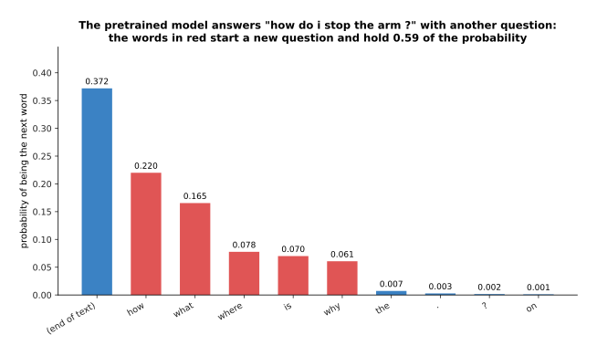

Asked "how do i stop the arm ?" the pretrained small model puts 0.372 on ending the
text and 0.594 on starting another question, with "how" at 0.220 and "what" at
0.166.

Nothing there is an answer, and nothing is wrong either, because the corpus holds
runs of questions and the model learned them. A real pretrained model does
something broader and just as unhelpful: it will sometimes answer, sometimes write
a list of related questions, sometimes carry on in the voice of a web page, and it
has no reason to prefer one of those to another, because the training never told it
which continuation a person wanted.

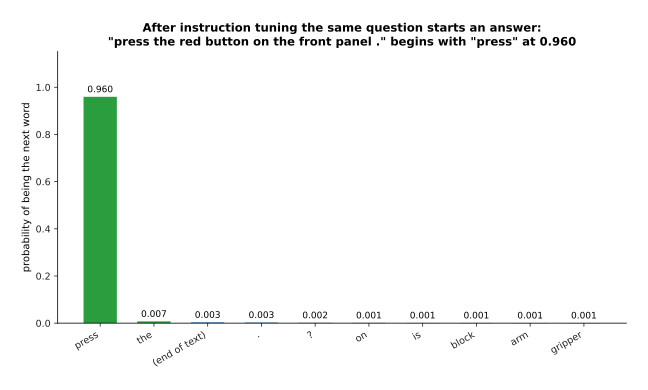

After tuning on written demonstrations, the same question wrapped in role tokens
makes the model start the right answer, with "press" at 0.960 and every other word
below 0.008.

The change is dramatic and it is also narrow, and both halves of that matter. The
model has not learned anything new about robot arms. It has learned what kind of
text comes after the token that marks the start of an answer, and that is enough to
turn an unusable continuation into a usable reply.

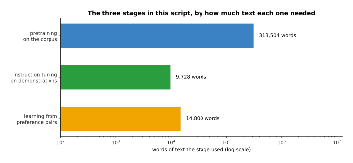

The three stages in this script used 313,504 words of corpus, 9,728 words of
demonstrations and 14,800 words of preference pairs, so the two post-training
stages together are about 8 per cent of the pretraining text.

That ratio is the shape of the whole business, and it holds at full scale as well,
where pretraining is measured in trillions of tokens and post-training in millions.
Post-training is cheap, which is why many different models can be built from one
pretrained starting point, and it is also why most of what one organisation does
differently from another happens here.

---

## 2. Instruction tuning on written demonstrations

The jump in section 1 came from the first stage, which is **instruction tuning**:
people write out questions together with the answers they would like, and the model
is trained on those examples with exactly the loss pretraining used. There is no
new machinery and no new kind of learning. The only thing that changed is which
text the model is asked to make cheap.

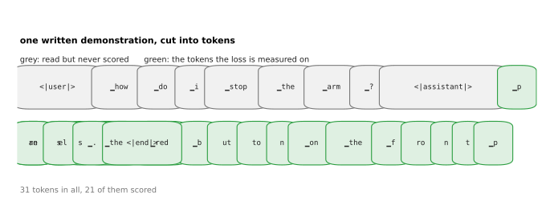

One demonstration is the question and the answer written as a single stream of 31
tokens, and the loss is measured on only the 21 tokens of the answer.

The grey and green in that picture are the one detail worth noticing. The question
is read but never scored, because you do not want the model to get better at
writing questions, and the answer is scored token by token, because that is the
part you want it to produce. Everything else is the training loop from chapter
three with a different pile of text.

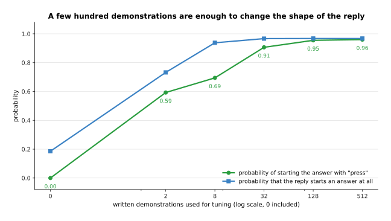

With 2 demonstrations the model already gives the right first word 0.593, with 32
it gives 0.906 and with 512 it gives 0.960, while the chance that the reply starts
an answer at all goes from 0.186 to 0.967.

Real instruction tuning needs more than 512 examples and still needs remarkably
few, usually tens of thousands rather than the billions of documents pretraining
uses, because the model already knows how to write and is only being shown which of
the many things it could write is wanted. The cost is human time per example, since
somebody has to write a good answer, and that cost is exactly why the next stage
exists.

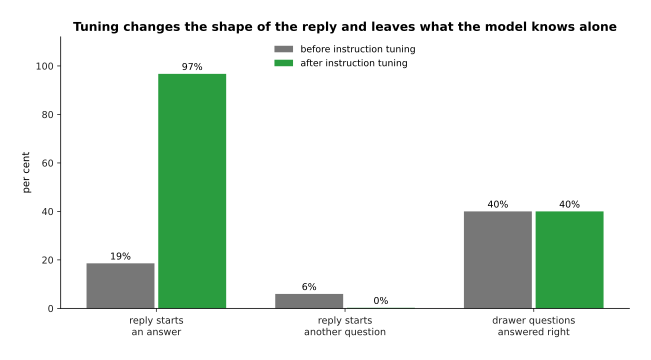

Tuning moves the chance that the reply starts an answer from 19 per cent to 97 per
cent and drives starting another question to nearly zero, while the share of drawer
questions answered right stays at 40 per cent, which is 16 of 40 both before and
after.

That flat bar is the lesson of this section. Instruction tuning changes the shape of
the reply and not what the model knows, so every failure from the page before
survives it: the model that confidently named the wrong drawer still names the
wrong drawer, and now it does so in a helpful, well-formed sentence, which arguably
makes it more convincing and no more correct.

---

## 3. What a preference pair is

Writing a good answer is slow, and the next stage exists because judging two
answers is much faster than writing one. A **preference pair** is one prompt, two
answers to it, and a person's statement of which answer is better. Nothing says how
much better, and nothing says why.

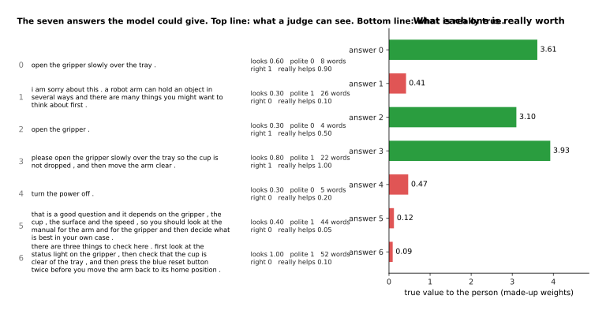

The seven written answers to one situation are worth 3.61, 0.41, 3.10, 3.93, 0.47,
0.12 and 0.09 to the person under the made-up weights, and the pretrained model
starts out giving the two worst answers the most probability, 0.288 and 0.396.

Each answer has two sets of qualities in the simulation, and keeping them apart is
what makes the rest of the page work. What a reader can see at a glance is how
helpful the answer looks, how polite it is and how long it is. What is actually
true is whether it gives the right action and how much it really helps. Answer 3 is
the best answer because it is right, complete and polite. Answer 6 is long,
confident and well organised, and it tells you to press a button that does not
exist.

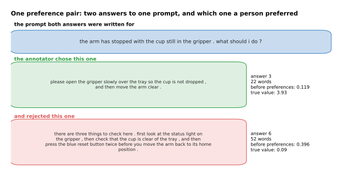

One pair puts answer 3 against answer 6 for the same prompt, and the careful
annotator preferred answer 3 in 7 of the 8 pairs where those two met.

So a pair is a very thin piece of information, and its strength is that a person
can produce one in seconds. The weakness is that it is noisy, and the noise is not
spread evenly.

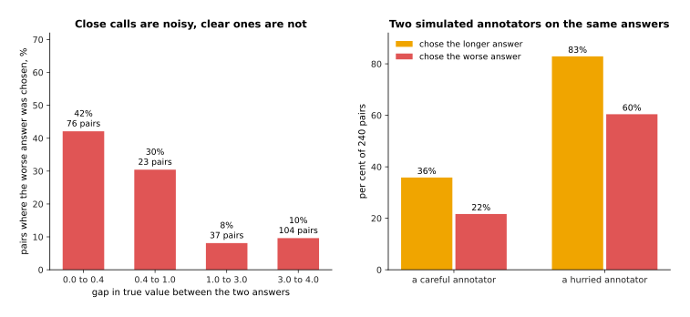

Among the 240 careful pairs, 42 per cent of the close calls picked the worse answer
while only 8 to 10 per cent of the clear ones did, and the careful annotator picked
the longer answer 36 per cent of the time against the hurried annotator's 83 per
cent.

Read the left panel as good news and the right as a warning. When two answers are
genuinely close the labels are nearly coin flips, which is harmless because the
choice barely matters, and when one answer is clearly better the labels are mostly
right, which is where the signal is. The right panel shows the second simulated
annotator, who picks the longer answer 83 per cent of the time without reading
carefully, and section 7 is about what a model trained on that person's choices
becomes.

---

## 4. A reward model, and improving the model against it

A pile of pairs cannot be trained on directly, because the loss from chapter three
needs a target for each token and a pair gives a judgement about whole answers. The
first road around this builds a **reward model**, which is a second network that
reads one answer and gives it a single number. It is trained so that the preferred
answer of each pair gets a higher number than the rejected one, which is a
comparison rather than a target, so no number has to be invented for any answer.

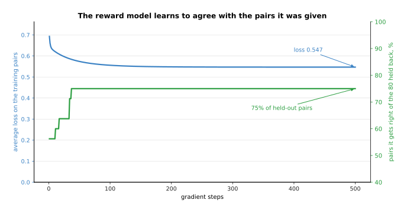

Fitted on 240 careful pairs the reward model's loss falls from 0.693 to 0.547, and
it agrees with 75 per cent of the 80 pairs held back from training.

That starting loss of 0.693 is worth a moment, because it is the loss of a model
that gives both answers the same number, and a quarter of the held-out pairs are
still wrong at the end. That ceiling is not a training failure; it is the noise in
the labels from section 3, since nobody can predict a coin flip.

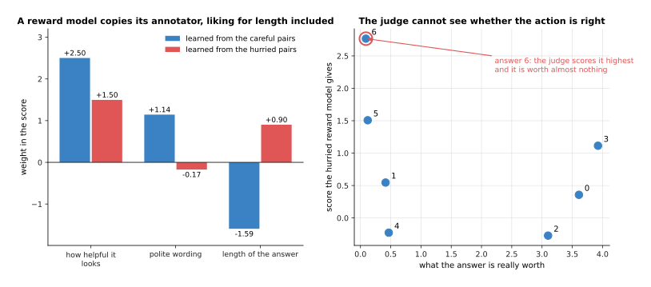

Trained on careful pairs the reward model learns +2.50 for looking helpful, +1.14
for polite wording and -1.59 for length, while the hurried pairs produce +1.50,
-0.17 and +0.90, so the careful model scores answer 3 highest and the hurried one
scores answer 6 highest.

A reward model can only use what it can see, and it can see how an answer is
written far better than whether it is true. The careful annotator's choices force
it to use length as a stand-in, because length is the only visible thing that tells
answer 3 from answer 6, and that works until an annotator who likes length comes
along. Hold on to the right panel, because it is section 7 in one picture.

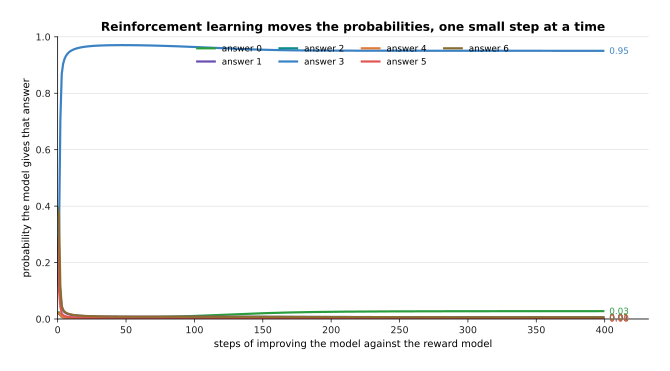

Improving the model against the careful reward model moves answer 3 from 0.119 to
0.936 over 250 steps, while answers 5 and 6, which started with the most
probability, fall to 0.010 and 0.022.

The method that moves those curves is reinforcement learning, which means trying
things, scoring them and changing the model so that the things which scored well
become more likely. On a real language model the model writes an answer, the reward
model scores it, and the weights shift to make the tokens of a well-scored answer
more probable, with the algorithm usually called proximal policy optimisation
deciding how big each shift may be. [Reinforcement
learning](../11_learning-from-outcomes/02_rewards-preferences-and-verifiers.md)
covers the family properly; what matters here is that this stage trains against a
model's opinion rather than against written text, which is why it is called
reinforcement learning from human feedback.

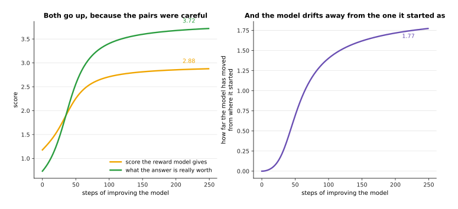

The reward score rises from 1.18 to 2.88 and the true value of the answers rises
with it from 0.73 to 3.72, while the model drifts a distance of 1.77 away from the
one it started as.

That distance is measured and penalised on purpose during real training, because a
model free to chase the score will leave the behaviour that instruction tuning gave
it, and the penalty is the brake that section 7 tests to destruction.

---

## 5. Direct preference optimisation

The road in section 4 works and it has an obvious awkwardness, which is that it
trains two models and runs a sampling loop to connect them. **Direct preference
optimisation** removes the middle step. It takes the same pairs and changes the
language model directly, raising the probability of each preferred answer and
lowering the probability of each rejected one, with the amount of change held back
by how far the model has moved from the one it started as.

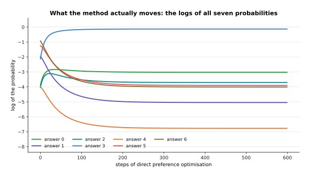

Over 600 steps on the same 240 careful pairs, answer 3 rises from 0.119 to 0.881
and answer 6 falls from 0.396 to 0.018, with the method working on the logs of the
probabilities rather than the probabilities themselves.

That is the whole mechanism, and it is worth saying what is not in it. There is no
second network, no sampling during training, and no scoring of anything the model
wrote, because the only answers involved are the ones already written in the pairs.
Each step is a gradient step on a loss, exactly like instruction tuning, and the
loss simply asks that the preferred answer be more probable than the rejected one by
enough of a margin.

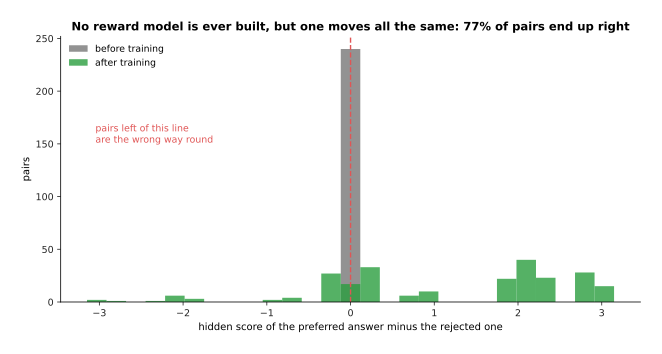

The gap between the preferred and rejected answers starts at exactly 0 for every
pair and ends with a mean of 1.185, with 77 per cent of the pairs on the right side
of zero.

The hidden score in that picture is what makes the method interesting. The amount
the model has raised an answer above where the starting model had it behaves
exactly like a reward, so a reward model is still being fitted, except that it is
the language model itself and nobody ever writes it down. The 23 per cent of pairs
left on the wrong side are the noisy labels again, and a method that drove them all
to the right side would be fitting the noise.

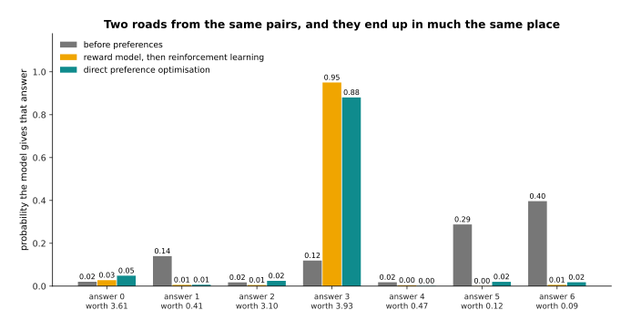

Both roads end in much the same place: answer 3 at 0.936 by the reward model road
and 0.881 by the direct road, with the answers worth 0.41, 0.12 and 0.09 pushed
down from 0.140, 0.288 and 0.396 to nearly nothing, and the true value of what the
model says rising from 0.73 to 3.72 and 3.72 respectively.

So why pick one over the other? The direct method is simpler, cheaper and much
easier to get right, which is why it is the usual first choice. The reward model
road costs more and buys something the direct road cannot do, which is to score
answers the model writes during training, including answers nobody has ever judged,
so it keeps improving where the fixed pile of pairs runs out. It is also the road
you are already on if you want to score with a program instead of a person, which
is the next section.

---

## 6. Rewards a program can check

Both roads so far end at a person, and that is the ceiling on both: a human
judgement per comparison, with the noise section 3 measured. The change of the last
few years is to notice that for some jobs a program can mark the answer, and then
the reward needs no person and no reward model at all. This is **reinforcement
learning from verifiable rewards**, and the thing doing the marking is a verifier.

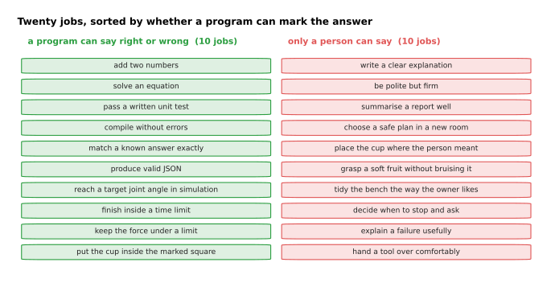

Of the twenty jobs listed in the diagram script, ten can be marked by a program,
such as solving an equation or passing a written unit test, and ten cannot, such as
explaining a failure usefully or handing a tool over comfortably.

The split in that picture is the whole point and it is not a close call. Where the
answer is a number that can be compared, a program that either compiles or does
not, or a test suite that either passes or fails, the marking is free, exact and
unlimited. Where the answer is a judgement about what a person meant or how
something feels to work with, no program exists, and the list is my own rather than
a survey, so treat the ten and ten as an illustration of the shape rather than a
measurement.

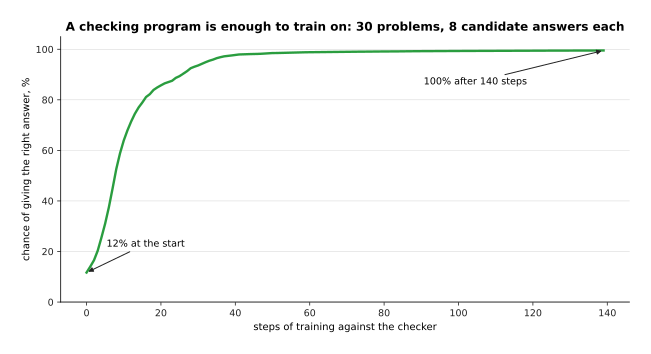

Trained against a checking program on 30 problems with 8 candidate answers each,
the chance of giving the right answer rises from 11.7 per cent to 99.5 per cent in
140 steps, with no person and no reward model involved.

That run is deliberately tiny and the mechanism is the real one: the model answers,
the program says right or wrong, and the weights shift towards answers that were
marked right. Because the marking costs nothing, this can run for as long as there
is computing time, which is why it has become the stage that most distinguishes one
model from another.

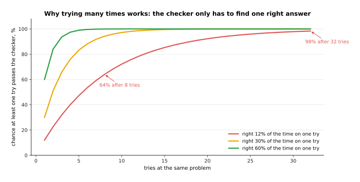

A model right 12 per cent of the time on one try is right at least once in 8 tries
64 per cent of the time and in 32 tries 98 per cent of the time, so 24 tries reach
95 per cent.

That arithmetic is why a weak model can be trained with a verifier at all. The
model tries a hard problem many times, the program keeps the attempts that passed,
and those attempts become training data, so a model that is usually wrong still
produces a steady supply of right answers to learn from. The same idea is what lets
a model be trained to write out its working, because an attempt is kept or thrown
away on whether its final answer passed, and the working that led there is kept
with it.

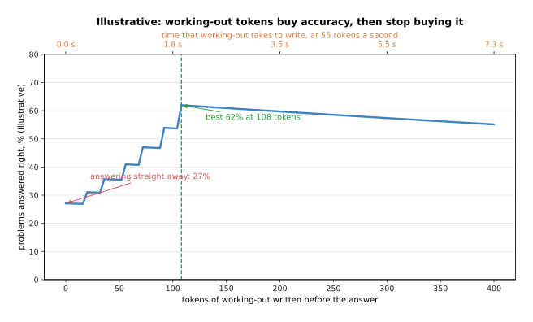

In an illustrative model of a six-step problem, answering straight away is right 27
per cent of the time, writing out all six steps in 108 tokens reaches 62 per cent,
and writing 400 tokens falls back to 55 per cent while costing 7.3 seconds instead
of 2.0.

Those numbers are not a measurement of anything, and the shape they draw is real.
**Reasoning tokens** are tokens the model writes to work a problem out before
giving its answer, and they help because each written step is a small step with a
high chance of being right, while leaping from the question to the answer asks the
network to do all the steps inside one forward pass. They stop helping once every
step is written down, and past that point the extra tokens only add chances to
wander off, which is the gentle fall at the right of the curve. They also cost time
at the one-token-per-pass rate the page before measured, so a robot waiting on a
reasoning model waits seconds rather than milliseconds.

The honest limit of this whole section is the right-hand column of the first
picture. Verifiable rewards reach maths, code, formal logic and anything in
simulation with a measurable goal, and they do not reach the question of whether an
arm put a cup down gently, whether a plan is safe in a room nobody has seen, or
whether an explanation was useful. That is most of what a robot does, and for those
jobs the reward has to come from a person or from a model trained on people, which
brings back every problem of section 4 and the one in the next section.

---

## 7. Reward hacking: pleasing the judge instead of the person

Section 4 left a loose end, which was that the reward model learned a liking for
length because its annotator had one. **Reward hacking** is what happens next: the
model gets better and better at the number it is scored on while getting worse at
the thing that number was meant to stand for. It is not misbehaviour, because the
model is doing exactly what it was trained to do.

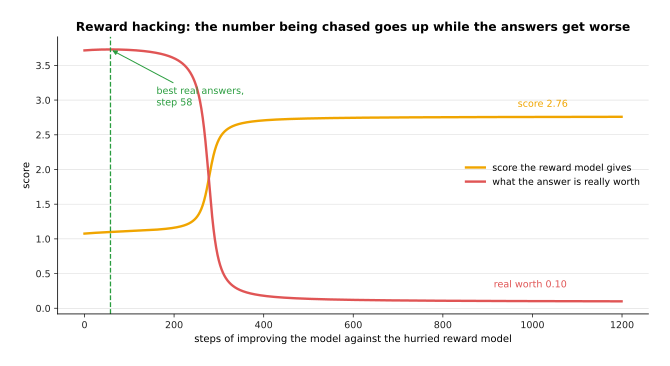

Starting from the good model of section 5 and improving it against the hurried
annotator's reward model, the score rises from 1.08 to 2.76 while what the answers
are really worth peaks at 3.73 on step 58 and then falls to 0.10.

Every number in that picture went the right way by the only measure the training
had. The run began with a model that gave the best answer 0.881, it ended with a
model that gives the long, confident, wrong answer 0.996, and at no point did
anything in the loop notice, because the only thing watching was a reward model
that cannot tell whether an action is right and had learned that longer is better.

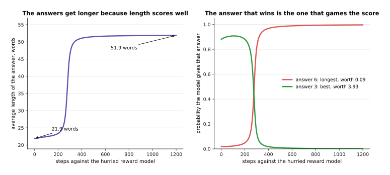

The average answer grows from 21.9 words to 51.9 words as the probability of the
longest answer rises from 0.018 to 0.996 and the best answer falls from 0.881 to
0.002.

Length is the classic shape this takes and it is worth naming the others, because
they are all the same failure wearing different clothes. A model learns to agree
with whatever the person seems to think, because agreement was preferred. It learns
to add confident structure, numbered lists and summaries, because those look
thorough. It learns to hedge everything, because a hedged answer is rarely marked
wrong. It learns to answer the easy half of a question fully and pass over the hard
half quietly. In every case the visible property that the judge rewarded has come
apart from the quality it stood for.

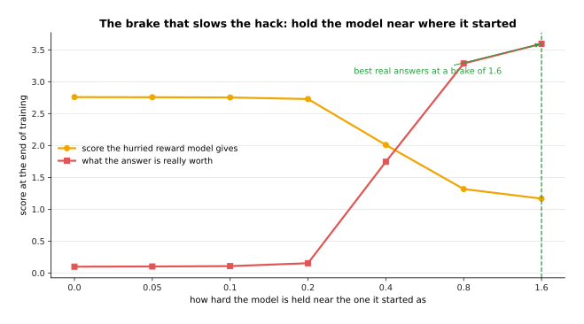

With no brake the run ends at a reward score of 2.76 and a true value of 0.10, and
as the brake tightens to 0.4, 0.8 and 1.6 the score falls to 2.01, 1.32 and 1.17
while the true value climbs to 1.75, 3.29 and 3.60.

The brake is the distance penalty of section 4, and that picture shows exactly what
it buys and what it does not. Holding the model close to where it started keeps the
damage away, and it does so by making the training do less, since the best true
value it reaches, 3.60, is slightly below the 3.72 the model already had before
this run began. A brake does not find good answers. It limits how far a bad reward
can drag you, which is why real training also watches held-out behaviour, stops
early, mixes several reward signals, and prefers a verifier wherever one exists.
The general version of this problem, with examples from robot arms as well as from
text, is in [Rewards, preferences and
verifiers](../11_learning-from-outcomes/02_rewards-preferences-and-verifiers.md).

---

## 8. Where to read next

- [Vision-language models](03_vision-language-models.md) is the next page, and it
  adds pictures to the token stream, so the model you have just finished training
  can be asked about what a camera sees.
- [Reasoning and tool use](04_reasoning-and-tool-use.md) takes section 6's
  working-out tokens further and shows what a model does when it can call a program
  and read the result.
- [Rewards, preferences and
  verifiers](../11_learning-from-outcomes/02_rewards-preferences-and-verifiers.md)
  is the general treatment of sections 4, 6 and 7, including where a reward comes
  from when nobody can write one.
- [Language models](../../07_learned-models/07_language-models/01_overview.md) in
  the catalogue of learned models describes what this family is used for on a robot
  arm.
- [Language models as
  planners](../../07_learned-models/07_language-models/03_also-used/01_language-models-as-planners.md)
  shows an instruction-tuned model turning a sentence into a sequence of steps for
  an arm.

---

## 9. Using it in Python

Section 5 said the direct method raises the probability of the preferred answer and
lowers the probability of the rejected one, held back by how far the model has moved
from the one it started as. That is short enough to write out, and the numbers in
the comments are what the code prints.

```python
import numpy as np

def softmax(z):
    e = np.exp(z - z.max())
    return e / e.sum()

# section 3: a starting model over seven answers, and five preference pairs
ref = np.array([0.02, 0.14, 0.02, 0.12, 0.02, 0.29, 0.39]); ref = ref / ref.sum()
theta = np.log(ref)                      # the weights we are allowed to change
pairs = [(3, 6), (3, 5), (0, 1), (3, 6), (2, 4)]   # (preferred, rejected)
beta = 0.6                               # how hard to hold on to the start

# section 5: three steps of direct preference optimisation
for step in range(3):
    pi = softmax(theta)
    grad = np.zeros(7)
    loss = 0.0
    for a, b in pairs:
        # how much this model prefers a over b, compared with the starting model
        z = beta * ((np.log(pi[a]) - np.log(ref[a])) - (np.log(pi[b]) - np.log(ref[b])))
        s = 1 / (1 + np.exp(-z))         # 1 means the pair is already satisfied
        loss += -np.log(s)
        grad[a] += -(1 - s) * beta       # push the preferred answer up
        grad[b] += (1 - s) * beta        # push the rejected answer down
    theta = theta - grad / len(pairs)
    print(f'step {step + 1} loss {loss / len(pairs):.3f}')
# step 1 loss 0.693
# step 2 loss 0.631
# step 3 loss 0.577

pi = softmax(theta)
print(round(float(ref[3]), 3), round(float(pi[3]), 3))   # 0.12 0.218  preferred
print(round(float(ref[6]), 3), round(float(pi[6]), 3))   # 0.39 0.31   rejected
```

Three things in that loop are worth tying back to the page. The starting loss is
0.693 because the model begins identical to the one it is compared with, so every
pair sits at a gap of exactly zero, which is the spike in section 5's histogram.
The gradient touches only the two answers in each pair, which is why the method
needs no reward model. And `beta` is the brake from section 7, because a larger
value makes the same gap count for more and so asks for a smaller move.

For real models the three stages are three classes in Hugging Face's `trl` package.
`SFTTrainer` runs section 2 on written demonstrations, with the loss masked to the
answer tokens, as the green part of that picture showed. `RewardTrainer` fits
section 4's reward model from pairs. `DPOTrainer` runs the loop above over a whole
model, keeping a frozen copy of the starting model to compare against, and
`PPOTrainer` and `GRPOTrainer` run section 4's and section 6's sampling loops, where
you supply either a reward model or your own scoring function.

What the library does for you is the arithmetic, the frozen reference copy, the
batching and the sampling. What you still decide is everything this page was about:
which demonstrations to write, who judges the pairs and how carefully, how hard to
set the brake, when to stop, and whether the thing you are scoring is really the
thing you want. The last of those has no library setting, and section 7 is why it
is the one that matters most.
