# Reinforcement learning: learning by trying

The page before this one, [reasoning and tool use](../10_language-and-multimodal-models/04_reasoning-and-tool-use.md),
closed a long run of pages about models trained by being shown the right answer.
Every one of those methods needed somebody to write the answer down first,
because training compared what the model said with what it should have said.
This page is about what to do when nobody knows the right answer in advance, but
anybody can look at what happened afterwards and say whether it went well.

That situation is common on a robot arm, because nobody can write down the joint
angles that pick up a particular mug, when the right angles depend on where the
mug is, which way its handle points and how the fingers land on it. But it is
easy to say afterwards whether the mug is in the gripper, and that is enough to
learn from. **Reinforcement learning** is the name for learning from that kind
of after-the-fact judgement: the learner tries something, a number comes back
saying how good the result was, and over many tries it changes what it does so
that the number gets bigger.

This page explains the pieces of that idea on one small example worked all the
way through, and then explains the three things that make it hard: that the
learner has to try what it does not yet believe in, that each improvement has to
be small enough not to wreck what already works, and that the number of tries
needed is far more than a real arm can survive. It assumes you have read
[gradient descent](../03_how-training-works/02_gradient-descent.md), so that
nudging numbers to improve a score is familiar, and
[the words everyone uses](../01_what-learning-means/02_the-words-everyone-uses.md).

The world in every picture is made up rather than measured from a real arm, and
the script that draws them, `docs/diagrams/learning_from_outcomes.py`, works out
every number shown. The learning is real: the policies are learned from nothing
by tabular Q-learning and by a clipped policy-gradient step, both written in
NumPy, and checked against exact answers from value iteration.

## Contents

1. [The pieces: state, action, reward, episode and return](#1-the-pieces-state-action-reward-episode-and-return)
2. [The policy and the value function](#2-the-policy-and-the-value-function)
3. [Learning the whole thing from nothing](#3-learning-the-whole-thing-from-nothing)
4. [Exploring against taking the best answer you know](#4-exploring-against-taking-the-best-answer-you-know)
5. [Whose attempts you learn from, and how big a step to take](#5-whose-attempts-you-learn-from-and-how-big-a-step-to-take)
6. [Why this happens in a simulator, and what the crossing costs](#6-why-this-happens-in-a-simulator-and-what-the-crossing-costs)
7. [Where to read next](#7-where-to-read-next)
8. [Using it in Python](#8-using-it-in-python)

---

## 1. The pieces: state, action, reward, episode and return

Because reinforcement learning has no right answers to copy, it needs a
different set of words from the rest of this book, and this section introduces
all of them on one example small enough to draw in full. The example is a table
top of five squares by five, with a gripper that moves one square at a time, one
block, a bin in the far corner where the block is supposed to end up, and a
small tray near the block that somebody also counts as a place to put things.

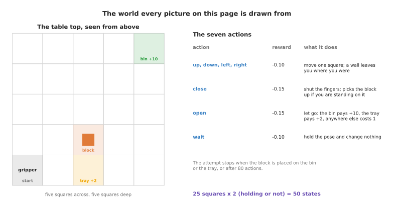

Every action costs a little, and only putting the block down pays anything: 10 in the bin and 2 on the near tray.

The first word is the state. The **state** is everything the learner can see at
one moment, and it is what its decision is based on. Here it is the square the
gripper stands on together with whether it holds the block, which makes 50
states. On a real arm the state is the joint angles, the gripper opening and a
camera picture, which is far bigger but plays the same part. The second word is
the action. An **action** is one of the things the learner can choose to do, and
here there are seven: four moves, closing the gripper, opening it, and waiting.

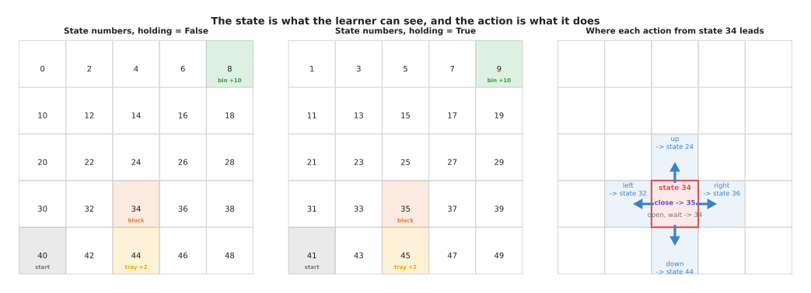

Closing the gripper on the block moves the learner from state 34 to state 35, and moving up from state 34 leads to state 24.

The third word is the reward. A **reward** is a single number arriving after each
action that says how good the result was. It is not advice, and it never says
what should have been done instead, which is what makes this different from the
training in earlier chapters. Here every action costs 0.10 because time matters,
a gripper command costs another 0.05, and putting the block in the bin pays 10,
so the action that finishes the job returns 9.85.

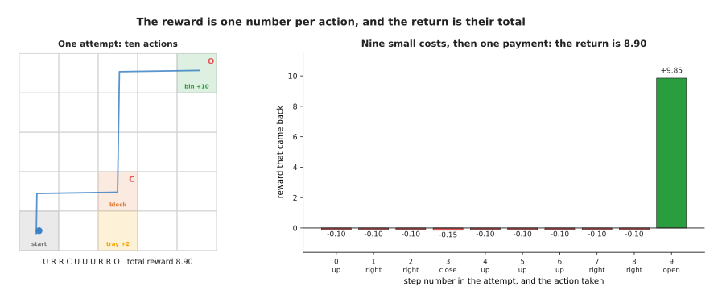

The best attempt takes ten actions, nine of which cost a little and one of which pays 9.85, so the whole attempt collects 8.90.

The fourth word is the episode. An **episode** is one whole attempt, which is
over here when the block is put down or when 80 actions have been used. The
fifth follows from it, because the **return** of an episode is the total of the
rewards collected during it.

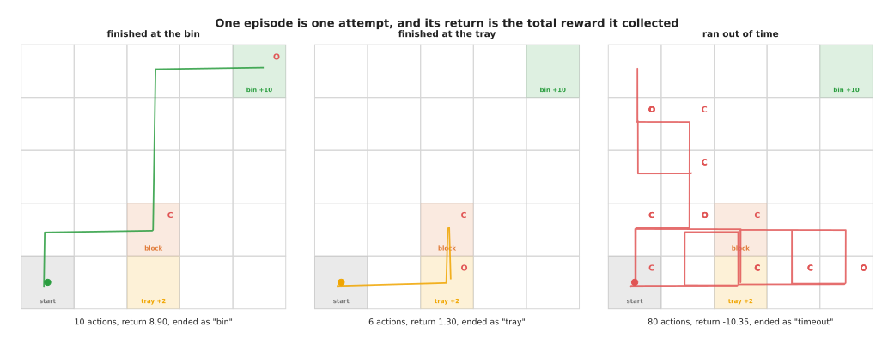

Three real attempts drawn as the path the gripper took, with the return each one collected.

One piece is less obvious. Rewards arriving later usually count for less than
rewards arriving now, and how much less is set by the **discount factor**,
written gamma. A reward one step away is multiplied by gamma, a reward two steps
away by gamma twice, and the total worked out that way is the discounted return.
This is partly because a robot that finishes sooner is worth more, and partly
because without it the sums in section 2 run away to infinity in a task that
never ends.

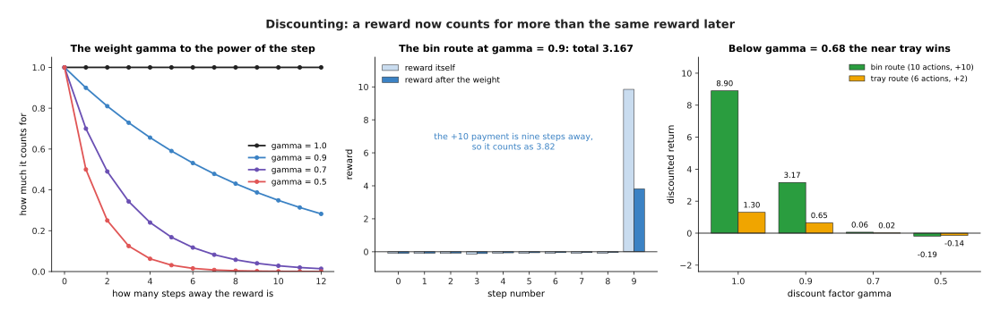

At gamma 0.9 the bin route is worth 3.17 against the tray's 0.65, but at gamma 0.5 the bin is worth minus 0.19 and the tray minus 0.14.

That last panel matters, because the bin pays five times what the tray pays but
is four actions further away, and below a gamma of about 0.68 those four actions
cost more than the extra payment is worth, so the best behaviour flips to
dumping the block on the nearest tray. Choosing gamma is part of saying what you
want, and 0.95 to 0.99 is usual because it keeps rewards a few dozen steps away
worth having. Everything below uses 0.95.

---

## 2. The policy and the value function

The five words above describe the problem, and the two in this section describe
what a reinforcement learner actually builds and stores.

The first is the policy. A **policy** chooses the action, by taking a state and
giving back a chance for each action. On a real robot it is a neural network
whose input is the camera picture and the joint angles and whose output is the
next movement. Here it is a table of 50 rows and seven columns, which is why it
can be drawn.

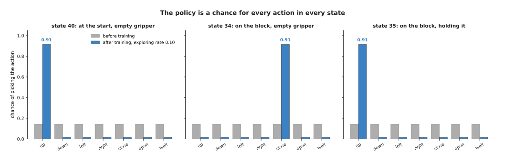

Before training all seven actions have the same chance of about 0.14, and after training one action holds 0.91 and the rest share what is left over for exploring.

The second is the value function. A **value function** takes a state and gives
one number, the discounted return the learner expects to collect from that state
onwards while following its policy. It is a prediction rather than a payment: a
reward says what just happened, and a value says what the future is worth from
here.

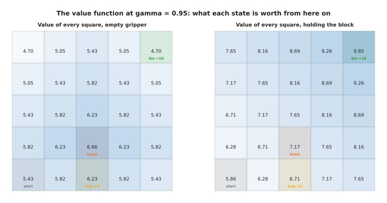

The start square is worth 5.43 with an empty gripper, the block's own square 6.66, and the bin's square 9.85 once the block is held.

The two are tied together, because once you know what every state is worth,
choosing an action is easy: look at the state each action leads to and take the
action that leads to the best one. That is why the arrows below run uphill
through the numbers.


With an empty gripper every arrow leads to the block and the block's square holds a C for closing, and while holding it every arrow leads to the bin and the bin's square holds an O for opening.

The difference between them is worth stating plainly. The policy answers "what
do I do now", and it is the thing that runs on the robot. The value function
answers "how well will this go from here", and it exists to make the policy
better, because the gap between what it predicted and what happened is the
signal training uses. Some methods learn both, some only a policy, and some only
a value function with the policy read off it, which is what section 3 does.

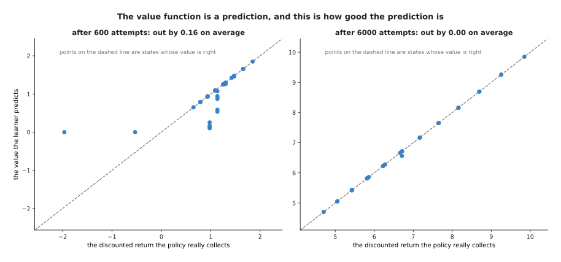

Early on the prediction is out by 0.16 on average over the 50 states, and by the end it is out by 0.00.

---

## 3. Learning the whole thing from nothing

Sections 1 and 2 said what gets learned, and this section shows it being
learned, starting from a table of zeros and using nothing but the rewards that
come back.

The method is Q-learning, which keeps one number for every state and action
pair, meaning the value of taking that action there and behaving well
afterwards. All 350 numbers start at zero, and after every action the learner
moves the number for the action it took a little way towards the reward it got
plus the value of the best action in the state it landed in. That one rule,
applied over and over, is enough.

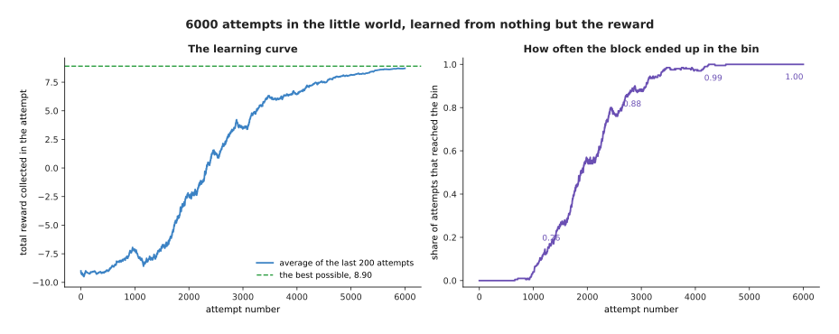

The average reward rises from minus 9.09 in the first hundred attempts to 8.78 in the last hundred, and the share reaching the bin rises from zero to 1.00.

That curve has the shape nearly every reinforcement learning run has. Nothing
happens for a long time, and here the first attempt that reached the bin was
number 658, so 657 attempts were paid for and taught almost nothing. Then it
climbs quickly once a few successes exist, because each success tells the
learner that a whole chain of earlier states was worth more than it thought.
Then it flattens as the remaining improvements get smaller.

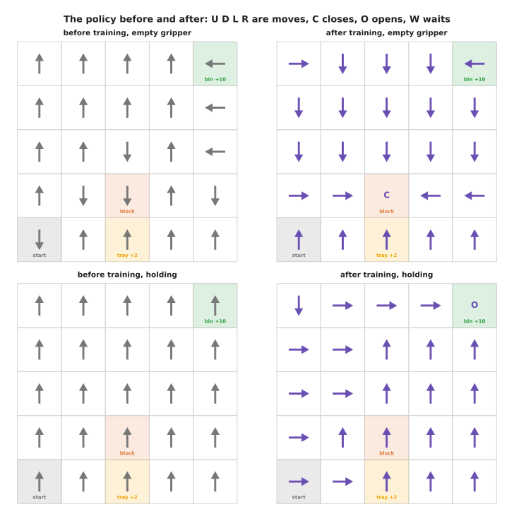

Before training every value is zero, so the policy takes whichever action comes first in the list.

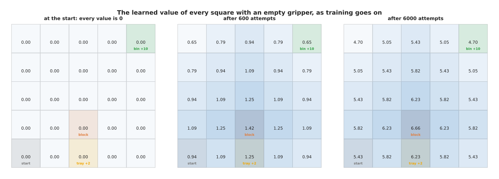

The learned value of the start square goes from 0 to 0.94 after 600 attempts and to 5.43 at the end, which is exactly what working the answer out directly gives.

What happens underneath is that value spreads backwards from the bin. The square
beside the bin learns its value first, because the reward lands there in one
step, then the square beside that one learns from it, and so on until the start
square knows what it is worth. That is why the middle grid has small numbers
everywhere rather than large ones near the bin and nothing elsewhere.

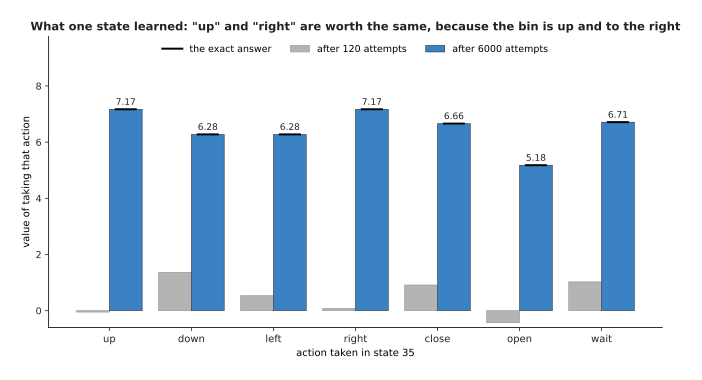

Holding the block on its own square, the learner ends up valuing "up" and "right" at 7.17, "wait" at 6.71 and "open" at 5.18, each agreeing with the exact answer to two decimal places.

That last picture shows the learner has really learned rather than got lucky. Up
and right are worth exactly the same, which is right, because the bin is three
squares up and two right, so either starts the journey equally well. Opening the
gripper is worth least, which is also right, because the block would land on an
ordinary square, cost 1 and have to be picked up again. Nobody told it either
thing.

---

## 4. Exploring against taking the best answer you know

Section 3 passed over one setting, and this section is about it, because it
decides whether the whole thing works at all.

A learner that always takes the action it believes is best never finds out about
anything better, because it never tries anything else, while a learner that
always acts at random finds out about everything and collects nothing meanwhile.
Choosing between the two is the trade-off between **exploring**, which means
taking an action to find out what it does, and **exploiting**, which means
taking the action you already believe is best. The usual way to settle it is to
take a random action with some small chance and the best one the rest of the
time.

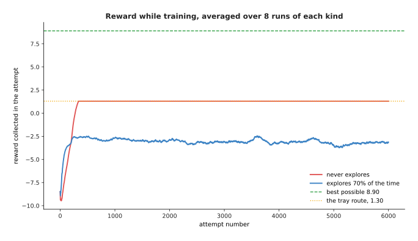

The learner that never explores collects more while training, 1.15 against minus 3.07, and finishes with a policy worth 1.30 against 8.90.

Those two bars measure different things, which is the whole point. The grey bars
are the reward collected during training, which is what you actually get while
the learning goes on, and the learner that never explores wins there. The purple
bars are what the finished policy collects, and the exploring learner wins there
by nearly seven times. Exploring costs reward now and buys a better answer
later.

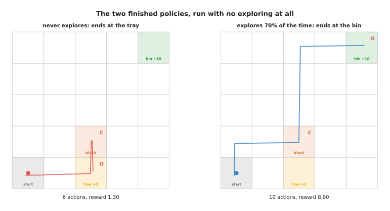

The learner that never explores finds the tray one square below the block, settles on it, and never discovers that the bin pays five times as much.

The failure there is not bad learning, because its policy is the best possible
route to the tray. The failure is that it never saw the bin, so the bin was
never part of the problem it was solving. This is the most common way a
reinforcement learning run fails on a real task, and it is why so much work goes
into making learners try unlikely things.

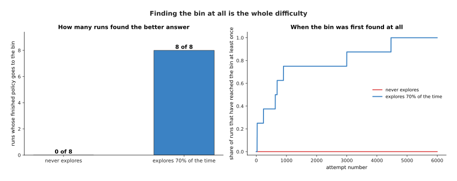

Across eight runs of each kind, the exploring runs found the bin as early as attempt 26 and as late as attempt 4,468, and the others never found it at all.

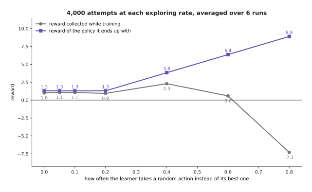

Raising the exploring rate from 0.00 to 0.80 raises the finished policy's reward from 1.30 to 8.90 and drops the reward collected while training from 1.01 to minus 7.30.

In this world more exploring is always better for the finished policy, because
random wandering eventually stumbles on the bin. That is not generally true,
since in a world with a thousand states random wandering finds nothing, and the
answer is then to explore more cleverly than at random or to start from a few
demonstrations. What is generally true is the shape of the grey line, because
every unit of exploring is paid for out of the reward collected while training,
which on a real arm means broken parts and operator time.

---

## 5. Whose attempts you learn from, and how big a step to take

Section 4 was about which attempts get made, and this section is about two
questions that follow: whether a learner may use attempts some other policy
made, and how far it may change itself after reading them.

A method is **off-policy** when it can learn from attempts made by any policy at
all, including old versions of itself and a person driving the arm by hand.
Q-learning is off-policy, because its rule asks what the best action in the next
state is worth rather than what the collecting policy actually did, so every
attempt ever made can be stored and learned from again.

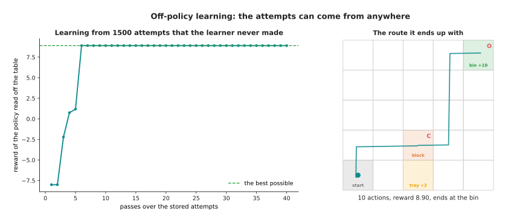

From 1,500 attempts made completely at random, only two of which reached the bin, Q-learning finds the best route after about five passes through the stored data without ever acting itself.

A method is **on-policy** when it can only learn from attempts made by the policy
it is improving. Policy-gradient methods, which change the policy's numbers
directly to make good actions more likely, are on-policy, because the size of
the change they ask for depends on how likely the policy was to take that action
at the time. Once the policy has moved, stored attempts describe a policy that
no longer exists.

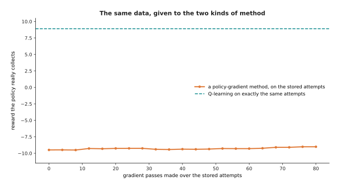

Reusing one batch helps for the first few passes and then makes the policy worse, because the batch no longer describes what the policy does.

Why use an on-policy method at all, given that cost? Because it works directly on
the thing you want, so it handles actions that are real numbers rather than a
short list, which is what an arm needs, and it needs no table with one entry per
action. The price is that every improvement needs fresh attempts, which on a
robot means fresh time, and that price is what **proximal policy optimisation
(PPO)** is built to reduce. It is the most widely used policy-gradient method,
and its idea is to collect a batch, improve the policy on it several times over
rather than once, but refuse to let any action's chance move more than a fixed
fraction from what it was when the batch was collected. The refusal works by
paying the update nothing for a change beyond that band.

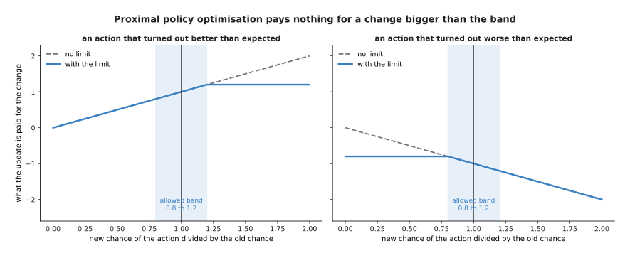

Raising a good action's chance beyond 1.2 times what it was earns nothing extra, so the update has no reason to push further.

Take the limit away and the result is not a slow decline but a collapse, because
one large step can push an action's chance all the way to certainty, and a
policy that only ever takes one action collects no information about any other
and cannot recover.

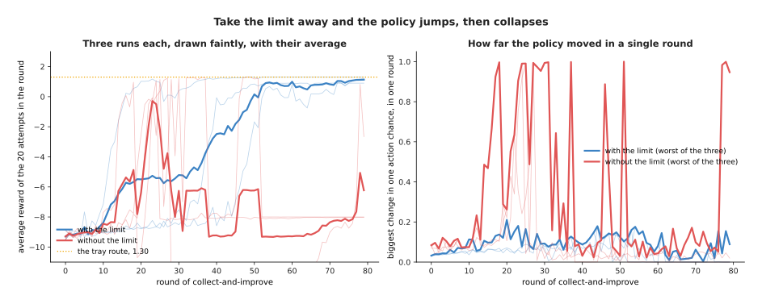

With the limit the policy holds at 1.01 and never moves an action's chance by more than 0.21 in a round; without it one chance moves by the full 1.00 and the reward ends at minus 7.66.

The learner there settles on the near tray rather than the bin, for the reason
section 4 gave, so the comparison worth making is between the two lines rather
than against the best possible 8.90. The right-hand panel shows the mechanism
that causes the collapse on the left.

---

## 6. Why this happens in a simulator, and what the crossing costs

Every number so far came from a world that costs nothing to run, and this
section is about what happens when the world is a real arm on a real bench.

The worked example used 6,000 attempts and 239,361 separate actions in a world
with 50 states. A real pick-and-place task has a state made of a camera picture
and a dozen joint angles and a continuous set of actions, so it needs far more
attempts, not fewer. Even taking these figures as they stand, and allowing three
seconds for a real arm to carry out one action and be reset when it drops
something, the same learning would take just under 200 hours of running.

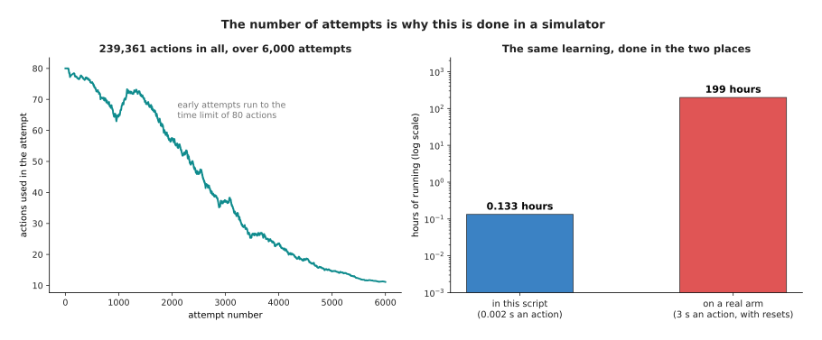

The same 239,361 actions take about eight minutes in this script and 199 hours, or 8.3 days of continuous running, on an arm needing three seconds an action.

That is why reinforcement learning for arms almost always happens in a
simulator, a program that pretends to be the robot and the table and the
objects, which can run many copies at once and faster than real time. Moving the
finished policy onto the real arm is called **sim-to-real** transfer, and the
trouble is that the simulator is never right. The friction is wrong, the camera
sits slightly elsewhere, the object is heavier than the model says, and the
bench has a fixture bolted to it that nobody put in the simulator. That
difference, and the drop in performance it causes, is the **reality gap**.

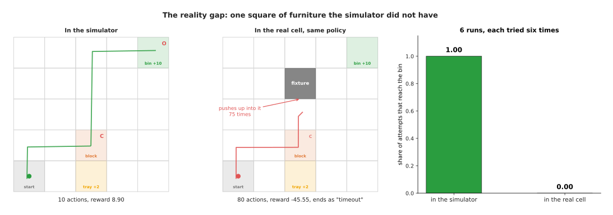

All six policies trained in the perfect simulator learn the same route, and with a fixture standing on one square of it they push against it 75 times in one attempt and never reach the bin.

That failure has the shape real ones have. The policy is not confused and does
not wander: it carries out confidently a plan that was correct in the simulator
and is impossible in the cell, and because its state never changes it repeats
the same impossible action. A policy that has only ever seen one version of the
world has no reason to be careful about anything the simulator got right by
accident.

The usual answer is **domain randomisation**, which means changing the
simulator's settings at random for every attempt so that the policy has to work
across a range of worlds rather than one. If the friction, the lighting, the
object's weight and the fixture's position are all drawn fresh each time, the
policy cannot lean on any particular value of them, and the real cell has a good
chance of being one more member of a range it already handles.

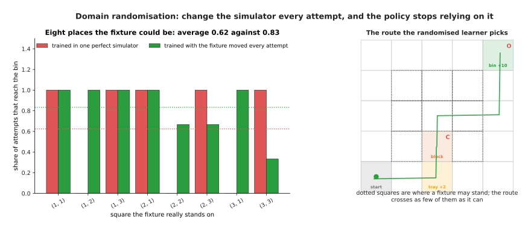

Averaged over the eight squares the fixture could stand on, policies trained in one perfect simulator reach the bin on 0.62 of attempts and randomised ones on 0.83, because the randomised ones hug the edge of the table where no fixture ever stands.

What it costs is worth saying, because domain randomisation is often described
as free and it is not. The randomised learner is solving a harder problem, so it
needs more attempts, and if the range of worlds is drawn too wide then no single
policy does well on any of them and the learning stops working.

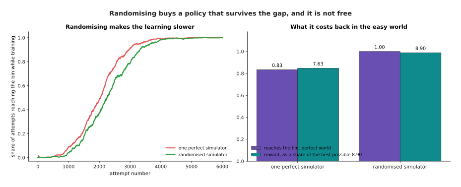

Randomising reaches the bin on 0.649 of training attempts against 0.679, and here it costs nothing at all in the easy case.

In this small world the randomised policy loses nothing when there is no
fixture, because several routes are exactly the same length and it simply picks
a safer one. In a harder world there is usually a real price, and the policy that
handles every friction setting is a little worse at the one the bench turns out
to have. How wide to draw the range is therefore a judgement, and the honest way
to settle it is to measure on the real arm.

---

## 7. Where to read next

- [Rewards, preferences and verifiers](02_rewards-preferences-and-verifiers.md)
  is the next page, and it answers the question this page left open: where the
  reward number comes from when nobody can write one.
- [Behaviour cloning and action chunks](../12_models-that-act/01_behaviour-cloning-and-action-chunks.md)
  shows the other way to get a policy for an arm, by copying demonstrations
  rather than trying things, and why that is the usual first choice.
- [World models](../12_models-that-act/04_world-models.md) explains how a learned
  model of what happens next can stand in for the simulator this page relied on.
- [Post-training a language model](../10_language-and-multimodal-models/02_post-training-a-language-model.md)
  shows the same machinery used on text, where an episode is one answer and the
  reward comes from a judge.
- [Reinforcement learning policies](../../07_learned-models/06_movement-models/03_also-used/01_reinforcement-learning-policies.md)
  is the catalogue page for arms, and it says which jobs are really done this way
  today and which are not.
- [Learned dynamics models](../../07_learned-models/08_world-models/02_most-used/01_learned-dynamics-models.md)
  lists the real models that predict what the world does next.

---

## 8. Using it in Python

Sections 1 to 3 built a state, an action, a reward and a value table by hand.
This section shows the same loop in NumPy on exactly the little world the
pictures use. Nobody writes this rule themselves for a real robot, but a table
this small makes it visible.

```python
import numpy as np

n_states, n_actions, gamma, alpha = 50, 7, 0.95, 0.3   # section 1's world
Q = np.zeros((n_states, n_actions))                    # section 2's value table
rng = np.random.default_rng(7)

for attempt in range(6000):
    eps = 1.0 - 0.95 * attempt / 5999     # section 4: explore a lot, then less
    state, done = 40, False               # state 40 is the start square
    while not done:
        if rng.random() < eps:
            action = int(rng.integers(n_actions))      # explore
        else:
            action = int(np.argmax(Q[state]))          # exploit
        nxt, reward, done = step(state, action)        # the world answers
        target = reward if done else reward + gamma * Q[nxt].max()
        Q[state, action] += alpha * (target - Q[state, action])   # section 3's rule
        state = nxt

print(Q[40].max())        # 5.43, the value of the start square
print(np.argmax(Q[40]))   # 0, which is "up"
```

Both printed numbers are ones sections 2 and 3 quoted. You can check the first
by hand, because the best attempt pays 9.85 ten steps away and costs about 0.1 a
step before that, which at a gamma of 0.95 comes to 5.43.

A library does everything except that update rule. For a real arm the value
table becomes a neural network, so `Q[state]` becomes a forward pass and the
update becomes a loss and a gradient step, and the attempts run in many copies
of the simulator at once. Stable-Baselines3 and CleanRL both ship proximal
policy optimisation ready built, Gymnasium provides the `step` function above as
the interface simulators implement, and physics simulators such as MuJoCo and
Isaac Lab provide the arm and the table.

What you still decide is everything this page argued about. You choose the
discount factor, and section 1 showed it changes which behaviour counts as best.
You choose how much exploring to do, and section 4 showed too little means never
finding the good answer. You choose how far the policy may move in one step, and
section 5 showed what happens without that limit. Above all you choose the
reward, and the next page is about how often that choice is the thing that goes
wrong.
