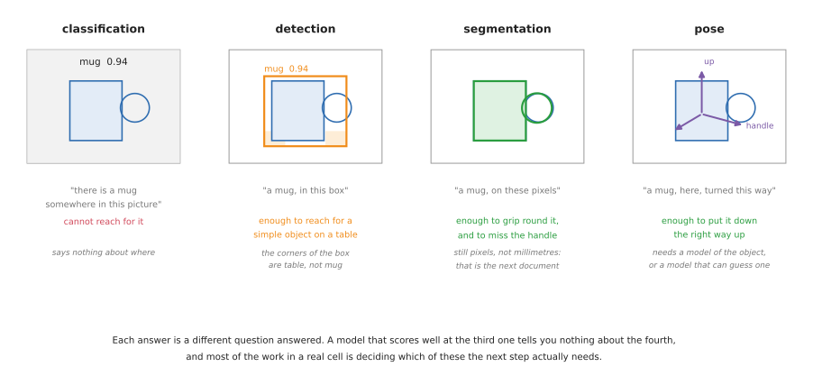
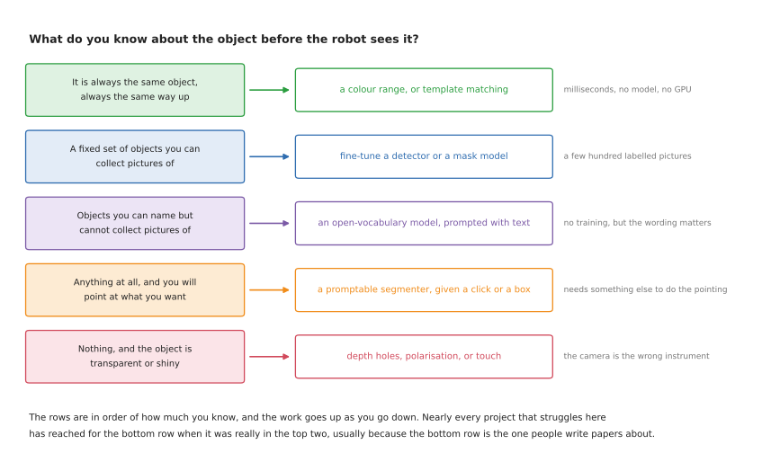
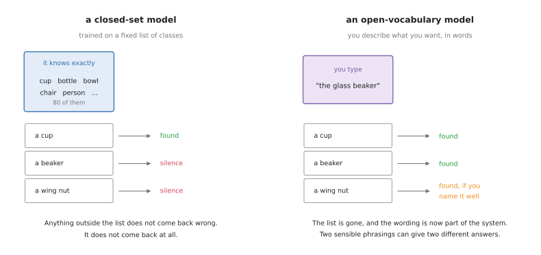
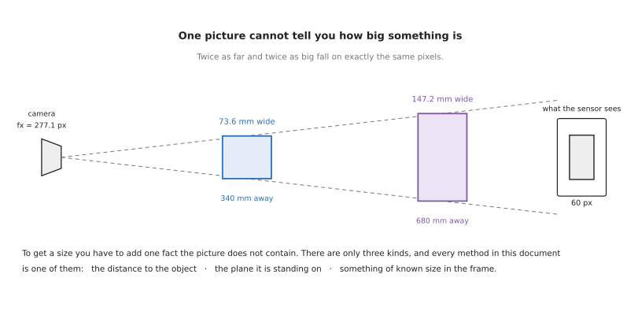
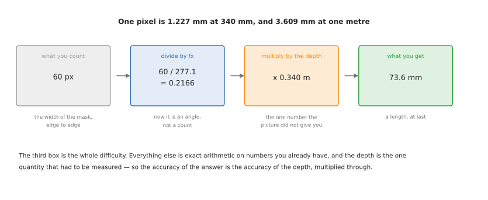
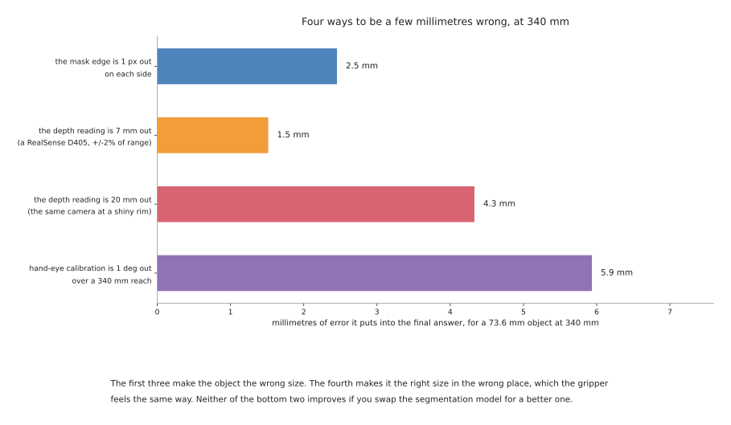

# Object perception: finding things and measuring them

A robot that is going to pick something up has to answer two questions about it.
**What is this, and which part of the picture is it on.** Then, before it can
close its fingers, **how big is it and which way is it turned.**

This area covers both, in seven documents. This one is the map: the four shapes an
answer can take, which of them your task actually needs, and the two facts that
decide everything downstream — that a model only knows the classes it was trained
on, and that a picture contains no sizes.

## Who this is for, and what it is for

This is written for someone who can picture a robot arm and a camera, has read
the [camera area](../05_camera/01_basics.md) or knows the equivalent, and now has
to choose a perception approach for a real project. You do not need to have
trained a model. Every term is explained where it first appears.

It is written to be *used for choosing*, which shapes it in three ways.

Every technique carries five jobs it suits and five it does not. That is more
useful than a score, because almost every technique in this field works well on
the demonstration its authors chose, and the interesting question is always which
job it quietly fails at.

Every licence is named, because licences here are not a formality. The most
popular object detector in the world is published under a licence that makes it
unusable in a commercial product without paying, and a great many tutorials do not
mention this. [Section 1 of licences and
platforms](06_licences-and-platforms.md#1-licences-and-the-one-that-will-catch-you-out)
is the short version.

Everything says whether it runs on a Mac. A large part of this field assumes an
NVIDIA graphics card, and finding that out after two days of setup is a common and
avoidable waste.

## Contents

1. [Four answers, and which one you need](#1-four-answers-and-which-one-you-need)
2. [What your task actually needs](#2-what-your-task-actually-needs)
3. [What you know before the robot looks](#3-what-you-know-before-the-robot-looks)
4. [Closed set, open vocabulary, and promptable](#4-closed-set-open-vocabulary-and-promptable)
5. [Why one picture has no size](#5-why-one-picture-has-no-size)
6. [The one calculation underneath everything](#6-the-one-calculation-underneath-everything)
7. [The three ways to supply the missing fact](#7-the-three-ways-to-supply-the-missing-fact)
8. [Where the millimetres go](#8-where-the-millimetres-go)
9. [The six documents that follow](#9-the-six-documents-that-follow)

---

## 1. Four answers, and which one you need

People say "the robot sees the object" as though seeing were one thing. It is
four, and they are different jobs with different costs. The picture below shows
all four applied to the same mug, with what each one is worth to a gripper.



**Classification** says what is in the picture and nothing about where. It is the
oldest of the four and the least useful on its own, because a robot cannot reach
for "somewhere".

**Detection** gives a rectangle around the object, usually with a confidence
score. The rectangle is axis-aligned, which means that for anything long and
turned at an angle, a large part of what is inside the rectangle is not the
object. For a mug standing alone on a table that hardly matters. For a screwdriver
lying diagonally it matters a great deal.

**Segmentation** gives the pixels themselves. There are three kinds of it, and
mixing them up is the most common confusion in this whole area:

- **Semantic segmentation** labels every pixel with a class. Every mug pixel is
  labelled "mug". If two mugs touch, they come back as one region, because
  nothing in the answer distinguishes them.
- **Instance segmentation** labels every pixel with a class *and* which object it
  belongs to. Two touching mugs come back as two regions. This is nearly always
  what a robot needs, because a robot picks up one thing at a time.
- **Panoptic segmentation** is both at once: every pixel gets a class, and
  every countable thing also gets an instance. It matters for scene
  understanding and rarely for a table-top arm.

**Pose** gives position and orientation — six numbers, usually called 6-DoF, for
six degrees of freedom: three for where the object is and three for which way it
is turned. This is the only one of the four that tells you which way up something
is, and it is the only one that generally needs a model of the object in advance.
It belongs to the [dimension document](05_models-that-measure.md),
where it is covered properly.

The practical rule is that you should pick the cheapest of the four that answers
the question your next step actually asks. A great deal of effort goes into
producing masks for robots that would have been perfectly happy with a box.

| The answer | What it gives you | Enough to... | Not enough to... |
| --- | --- | --- | --- |
| classification | a label | sort pictures | reach for anything |
| detection | a box and a label | reach for one object on a clear table | grip round an odd shape, or measure it |
| instance segmentation | the pixels of each object | measure the outline, avoid a handle, tell touching objects apart | know which way up it is |
| 6-DoF pose | position and orientation | put it down the right way up, fit it into something | measure an object you have no model of |

## 2. What your task actually needs

People reach for all four of those answers because a pipeline diagram suggests
they follow one another. They do not. They are four different questions, and most
real arm tasks ask one or two of them.

The table is real task types against what they genuinely use. Read the last
column carefully — it is where the effort usually goes that need not have.

| Task | What it uses | What it skips, and why |
| --- | --- | --- |
| **bin picking** | geometry only: point cloud to grasp pose | no classification, no detection. You do not care what it is, only where you can get fingers round it |
| **machine tending** | a presence check, sometimes nothing at all | the part is in a fixture, so its position is known by construction |
| **assembly** | 6-DoF pose | classification is trivial — you know what is in the feeder. The whole difficulty is orientation |
| **warehouse picking** | detection and instance segmentation | rarely pose. You grab it and drop it in a tote; which way up it was never mattered |
| **sorting and kitting** | detection, with the class | no pose, no masks. "Which bin does this go in" is the entire question |
| **fruit picking** | detection and segmentation | no classification — you know it is a strawberry. Segmentation earns its place by finding the stem |
| **[the glass case study](../10_one-arm-training/07_case-study/01_place-glass.md)** | segmentation and measurement | no trained detector, no pose, no classifier. The kind is read off the measured profile |

Three things follow from that table, and each of them saves work.

**Classification almost never exists on its own.** A detector already returns a
class with every box, so a standalone classifier is a benchmark artefact rather
than a robot component. If an architecture diagram has a separate classification
stage, ask what consumes it.

**When a system does use several of the four, they are usually scaffolding.** Pose
estimation needs a detection first, to know where to look; a promptable segmenter
needs a box from somewhere. Those upstream stages exist to feed the last one, not
because three separate answers were wanted. If you find yourself genuinely acting
on all four, check whether you have built three systems where one would do.

**The cheapest perception is a fixture.** A great deal of working industrial
robotics uses none of the four: a jig, a feeder bowl, a conveyor with a hard stop.
Put the part somewhere known and the question disappears. Perception is what you
reach for when fixturing has lost the argument, usually because the part mix is
too varied or the customer will not change their process.

One last thing worth saying, because it cuts against the instinct. **Task
difficulty does not track perception breadth.** The genuinely hard arm tasks —
seating a connector, folding cloth, balancing a stone — are hard in force control,
contact reasoning and error recovery, and several of them need almost no vision
once contact is made. A task that needs all four vision answers is usually broad
and shallow, not deep.
### 2.1 When a model makes things worse

The instinct, when a task has to cope with objects nobody has listed, is to reach
for a bigger model. Three times out of four in robotics that is the wrong move,
and it is worth knowing which three.

**A model can make you *less* extensible, not more.** This is the one people get
backwards. A rule — *hold the narrowest part below the widest* — is true of every
stemmed glass ever made, and extending it to a new kind means writing another
sentence and checking it against a few dozen generated examples. A trained
classifier extends by collecting and labelling pictures of the new kind, and then
retraining. If your objects vary in *proportion* rather than in *appearance*,
measuring and applying a rule generalises further than recognising does, and it
generalises immediately.

**A model cannot refuse.** A detector always returns its best boxes; a policy
always emits an action. Neither has a way to say *I do not know what that is, so I
am leaving it alone.* Where the cost of being wrong is higher than the cost of
doing nothing — glassware, anything fragile, anything near a person — you need a
step that can decline, and that means a check with a threshold you chose, not a
confidence score the model chose for itself.

**A model can cost you the thing that made the project cheap to change.** If the
deciding layer is plain arrays, its tests run in a second with no simulator, no
weights and no graphics card, so trying a new rule is free. Put a model in that
layer and the test loop needs downloads, a device, and a minute. The ability to
iterate quickly is not separate from the architecture — it is caused by it.

None of this says models are wrong here. It says they are wrong *in the deciding
layer*. A model belongs where the alternative is genuinely worse:

- the object set is open-ended and shares no structure you can write down
- the distinguishing feature is appearance, not geometry — a label, a marking, a
  brand
- the object is transparent or mirrored, where geometry gets no signal at all and
  [a learned segmenter](04_models-that-find.md#17-transparent-and-shiny-objects)
  is the only route
- you need a text prompt, because the class list changes weekly
- you are labelling data for a small fast model, which is the best use of a large
  slow one

## 3. What you know before the robot looks

The single best predictor of which technique you should use is not how hard the
scene looks. It is how much you know about the object before the robot ever sees
it. The table below reads from the top down, from knowing the most to knowing the
least, and the work goes up as you go down.



Most projects that get into trouble here have reached for the bottom row when
they were really in the top two. The bottom row is what papers are written
about, so it is what people read about first.

## 4. Closed set, open vocabulary, and promptable

Trained models split into three kinds by what you are allowed to ask them for,
and the difference is not accuracy. It is what happens to an object nobody
thought of in advance.



A **closed-set** model was trained on a fixed list of classes and can only ever
return one of them. Trained on the eighty classes of COCO, it knows "cup" but has
never heard of a beaker, a wing nut, or a brake caliper. Ask it about one and it
does not come back wrong — it comes back empty, which in a robot cell reads as
"there is nothing there".

An **open-vocabulary** model takes a description in words and finds whatever
matches. You type "the glass beaker" and it looks for one. Nothing was trained on
beakers; the model has learned a shared space of pictures and words, so a phrase
it has never seen still lands somewhere sensible. The cost is that the wording is
now part of your system. "Bottle", "water bottle" and "the clear plastic bottle"
can give three different answers, and nothing warns you.

A **promptable** model does not name anything at all. You give it a point, a box
or a rough scribble, and it returns the exact region containing that. Segment
Anything is the famous one. It is extraordinarily good at the boundary and
completely silent on the label, so on its own it cannot start a robot pipeline —
something has to decide where to click. In practice it is paired with a detector
that produces boxes, and the pair does what neither does alone.

| | What you give it | What comes back | Fails when |
| --- | --- | --- | --- |
| closed-set | a picture | one of N fixed classes | the object is not one of the N |
| open-vocabulary | a picture and a phrase | whatever matches the phrase | the phrase is ambiguous, or your object has no common name |
| promptable | a picture and a point or box | the region around that point | nothing tells it where to point |

## 5. Why one picture has no size

A camera turns directions into pixels. Two objects lying along the same direction
land on the same pixels, whatever their size, as long as the bigger one is
proportionally further away. The picture below is that statement drawn out, using
the repo's own camera.



An object 73.6 mm wide at 340 mm and an object 147.2 mm wide at 680 mm both fill
exactly sixty pixels. No amount of image processing separates them, because there
is nothing in the image to separate. The information was lost by the lens, not by
the software.

This has a consequence worth stating plainly, because it is the root of a lot of
wasted effort. **Any method that gives you a size from one ordinary photograph has
assumed something.** Sometimes the assumption is reasonable and stated. Sometimes
it is buried in a trained model that learned, from its training set, that things
which look like mugs are about the size of mugs. That is a useful prior and it is
not a measurement, and the difference shows up the first time you point it at a
doll's-house mug.

## 6. The one calculation underneath everything

Every camera measurement in this document reduces to the same two steps. Divide by
the focal length to turn a pixel count into an angle. Multiply by the distance to
turn an angle into a length.



In code that is two lines, and the [camera
area](../05_camera/04_one-box-code.md) runs them on a real picture:

```python
size_across = depth / fx          # how many metres one pixel covers, at that depth
width = pixels_across * size_across
```

With the repo's camera, where `fx` is 277.1 pixels, one pixel covers 1.227 mm at
340 mm and 3.609 mm at one metre. Both numbers are worth remembering, because they
set the floor on what you can measure. If your object is 40 mm across at a metre,
it is eleven pixels wide, and a one-pixel error at each edge is an eighteen per
cent error in the answer.

The first step is exact. The second step is where every error in this document
enters, because the distance is itself a measurement.

## 7. The three ways to supply the missing fact

There are only three, and everything else is a variation on one of them.

**Measure the distance.** Use a sensor that reports how far away each pixel is: a
stereo pair, a structured-light projector, a time-of-flight sensor, or a laser
scanner. This is the most direct route and the one most robot cells take. Section
5 is about these sensors and what they actually achieve.

**Know the surface the object sits on.** If the object is standing on a table, and
you know where the table is, then you know the distance to the bottom of the
object without measuring it. This is how the [glass-picking case
study](../10_one-arm-training/07_case-study/01_place-glass.md) measures a glass
that a depth camera cannot see at all. It costs nothing, it needs no extra
hardware, and it fails the moment the object is not on the plane you assumed.

**Put something of known size in the picture.** A printed marker — ArUco, AprilTag,
ChArUco — of known dimensions gives the scale directly, because you know how big
it really is and you can see how big it appears. This is what photogrammetry does
with a scale bar, and it is the only way to get a true size out of a single
ordinary camera moved around an object.

The three are not exclusive and good systems use two of them, so that one can
check the other.

| The fact you add | How you get it | Costs | Breaks when |
| --- | --- | --- | --- |
| the distance to each pixel | a depth sensor | the sensor, and its failure modes on shiny and clear things | the surface returns no reading |
| the plane it stands on | measure the table once | nothing | the object is tilted, stacked or held |
| something of known size in view | a printed marker | putting the marker there | the marker is hidden, or not coplanar with the object |

## 8. Where the millimetres go

Before reaching for a better model it is worth knowing what the error actually
consists of. The chart below works it out for a 73.6 mm object at 340 mm, on the
repo's camera, with each cause acting on its own.



Two things in it are worth pulling out.

A hand-eye calibration that is one degree out costs 5.9 mm at a 340 mm reach — more
than twice what a one-pixel segmentation error costs. Calibration is the least
glamorous item in this whole area and it is usually the largest term in the
budget. [Sensors, section 4](02_sensors.md#4-calibration-which-decides-all-of-it)
is about it.

A depth reading that is 20 mm out — which is what a consumer depth camera does at
the rim of a shiny object — costs 4.3 mm in the width. Notice that this is a
*width* error caused by a *depth* error: the depth multiplies through the whole
measurement, so a sensor that is reliable in the middle of a flat face and poor at
the edges gives you an object of the wrong size, not merely the wrong distance.

Neither of these improves if you swap the segmentation model for a better one,
which is the most common wrong response to a measurement that is off.

## 9. The six documents that follow

| | What it answers |
| --- | --- |
| [Sensors](02_sensors.md) | which instrument, how each one fails, what accuracy to expect, and the driver and calibration for each |
| [Methods you write yourself](03_programmed-methods.md) | everything you can do with no model at all: colour, contours, clustering, markers, silhouettes, touch |
| [Models that find](04_models-that-find.md) | detectors, mask models, the Segment Anything family, open-vocabulary models, and training your own |
| [Models that measure](05_models-that-measure.md) | learned depth, stereo, 6-DoF pose, and reconstruction |
| [Licences and platforms](06_licences-and-platforms.md) | what you may ship, what runs on a Mac, ROS 2, and every method side by side |
| [Making it work](07_making-it-work.md) | how to tell whether it is working, how fast it must be, and what to do when it is wrong |
| [Choosing where to look](09_choosing-where-to-look.md) | picking viewpoints, and ruling them out geometrically before a planner is asked |
| [Tracking and association](10_tracking-and-association.md) | deciding that this object is the same one you saw before |

If you are starting a project rather than reading it through, the order that
wastes least time is: this document, then
[methods you write yourself](03_programmed-methods.md), then
[sensors](02_sensors.md) once you know what you are asking of one. Reach for the
model documents when the first two have run out — which for a table-top arm is
later than most people expect.
