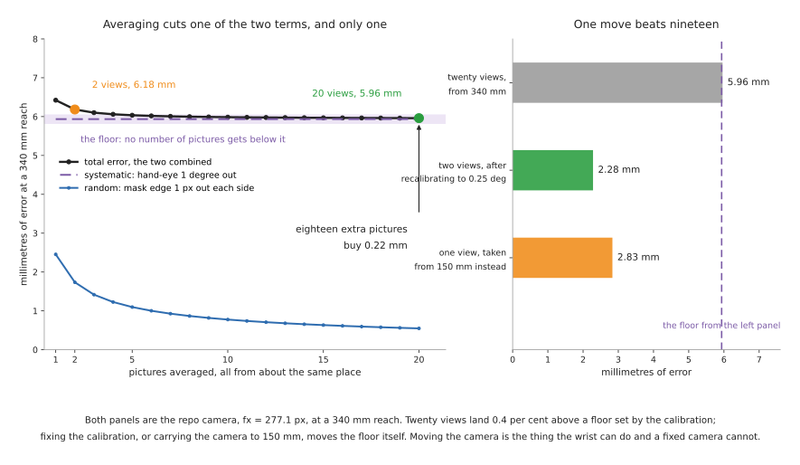
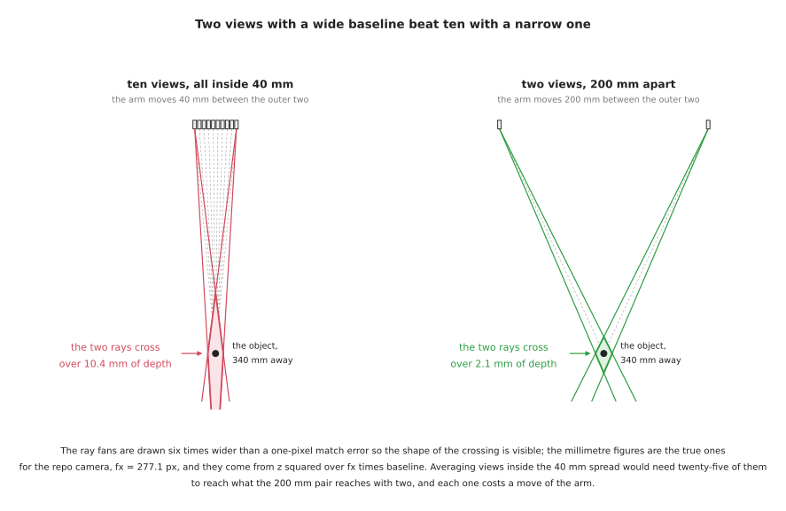

# The wrist camera, end to end

A camera bolted to the end of a robot arm is called an **eye-in-hand** camera,
because the eye travels with the hand. A camera on a tripod or a gantry above the
table is called **eye-to-hand**, because the eye watches the hand from outside.
The seven documents before this one cover perception in general.
[Sensors, section 1.4](02_sensors.md#14-where-to-put-the-camera) decides between
those two placements at the level of a trade table. This document takes the
eye-in-hand case and works it through properly, with the arithmetic done on the
repository's own camera, in the same way that
[the two-finger gripper](../07_gripping/06_two-finger-gripper.md) works the
gripping area through on one gripper.

It exists because the question people actually ask about a wrist camera is "how
many pictures should I take", and the usual answer — take several and average them
— is wrong in a way that costs real money. Averaging removes one kind of error and
leaves the other kind completely untouched, and on a normal arm the untouched kind
is the larger of the two. Section 3 shows the numbers.

The worked camera throughout is the repository's simulated one, with a focal
length `fx` = `fy` = 277.1 pixels, a principal point at `cx` = 160 and `cy` = 120,
and a 320 by 240 sensor. Those are the four numbers the
[camera area](../05_camera/01_basics.md#6-the-lens-as-four-numbers) uses, so every
millimetre below can be checked by hand. The real hardware in section 7 is quoted
from the manufacturers' own pages and data sheets, with the measurement conditions
given, because two cameras that both claim two per cent accuracy turn out to have
measured it on opposite kinds of target.

## Who this is for

Someone who has an arm, is about to put a camera on it or has just done so, and
wants to know how many pictures to take, from where, and with what. You do not
need to have calibrated anything. Every term is explained where it first appears.

## Contents

1. [What changes when the camera is on the arm](#1-what-changes-when-the-camera-is-on-the-arm)
2. [How many pictures each task needs](#2-how-many-pictures-each-task-needs)
3. [Why not twenty](#3-why-not-twenty)
4. [What a view actually costs](#4-what-a-view-actually-costs)
5. [Baseline, not count](#5-baseline-not-count)
6. [When you also need a fixed camera](#6-when-you-also-need-a-fixed-camera)
7. [The two cameras, and why they are not one camera in two places](#7-the-two-cameras-and-why-they-are-not-one-camera-in-two-places)
8. [The libraries that make identification easier](#8-the-libraries-that-make-identification-easier)
9. [The look, as pseudo code](#9-the-look-as-pseudo-code)
10. [What is specific to the wrist camera](#10-what-is-specific-to-the-wrist-camera)

---

## 1. What changes when the camera is on the arm

One thing, and everything in this document follows from it. **The distance
between the camera and the object stops being a property of the cell and becomes
a number you choose.** A fixed camera is wherever you bolted it. A wrist camera
can be anywhere the arm can reach.

That matters because the two things that decide how accurate a camera measurement
is both scale with that distance, and they scale with it in the same direction.

The first is how much of the world one pixel covers. A pixel covers `depth / fx`
metres, so on the repository's camera at a 340 mm reach one pixel is
`0.340 / 277.1` = **1.227 mm**, and at 150 mm it is `0.150 / 277.1` =
**0.541 mm**. If the boundary of the object's mask is one pixel out on each side,
the measured width is wrong by twice that: 2.454 mm at 340 mm, and 1.083 mm at
150 mm.

The second is the hand-eye calibration. **Hand-eye calibration** is the rigid
transform that says where the camera sits relative to the arm's wrist flange, and
it is what turns a point measured in the camera's frame into a point in the
robot's frame. If its rotation is one degree out, a point at distance `d` lands
`d × tan(1°)` away from where it really is. [The error
budget](01_overview.md#8-where-the-millimetres-go) puts that at 5.935 mm over a
340 mm reach. At 150 mm it is 2.618 mm.

Read the table below as the same object measured from two distances, with nothing
else changed. Every figure in it is one of the two calculations just given.

| From 340 mm | From 150 mm | |
| --- | --- | --- |
| 1.227 mm | 0.541 mm | what one pixel covers |
| 2.454 mm | 1.083 mm | a mask edge one pixel out on each side |
| 5.935 mm | 2.618 mm | a hand-eye calibration one degree out |
| 392.6 mm | 173.2 mm | how much of the table is in the frame |

The last row is the price. Going closer improves both error terms by the same
factor and shrinks the field of view by that same factor, so you can no longer see
the rest of the table. That is the whole trade, and it is the trade a fixed camera
is not allowed to make.

Two terms are worth naming now, because sections 3 and 4 turn on the difference.
A **random error** is one that takes a different value in each picture, so the
average of many pictures is closer to the truth than any one of them. A
**systematic error** is one that takes the same value in every picture, so the
average of many pictures is exactly as wrong as one of them. Sensor noise and
the exact pixel a mask boundary lands on are random. A calibration that is one
degree out is systematic.

## 2. How many pictures each task needs

Before the count, one distinction that settles most of the confusion. There are
two different things people mean by "another picture".

**Another frame from the same place** costs almost nothing. The arm has already
stopped. On a camera that streams at 90 frames a second, a tenth frame arrives
11 milliseconds after the ninth. Averaging frames from one pose removes the
sensor's own temporal noise and nothing else, because nothing else changed.

**Another view from a different place** costs a move of the arm. It is worth
paying for only when the new position sees something the old one could not — a
face that was turned away, a boundary that was edge-on, a parallax shift that did
not exist before.

The rule that follows is the most useful sentence in this document. **More
pictures help when each one sees something new, and barely help when each one is
another sample of the same thing.** Almost every "take more views" recommendation
you will read fails to say which of the two it means.

With that settled, here is the count per task. Read the table as: the job, the
smallest number of viewpoints that can answer it, and what a further viewpoint
would have to contribute before it earns its move.

| The job | Viewpoints needed | What another viewpoint would have to add |
| --- | --- | --- |
| **finding** — is the object there, and roughly where | 1 | nothing, unless the object can hide behind something, in which case the second viewpoint is looking round the obstruction |
| **identifying** — what kind of thing is it | 1, sometimes 2 | one view per hypothesis you cannot rule out. A label on the far side, or a handle facing away, is a reason for a second view. "More confidence" is not |
| **measuring** — how big is it | 1 with a depth reading, 2 without | a third view samples the same random error again. It does not measure anything the first two did not |
| **pose** — which way is it turned | 1 with a model of the object, 2 or 3 without | exactly enough views to break the symmetries a single silhouette leaves. A cylinder needs a second view at 90 degrees; a box usually does not |
| **reconstruction** — build a shape you have no model of | tens | genuine new surface. This is the one task where twenty views is the right answer, because view twenty sees material views one to nineteen never saw |

Three of those rows deserve a sentence more.

**Finding needs one picture because detection is a single-frame operation.** A
box detector takes an image and returns boxes; it has no mechanism for combining
two. If you want a second opinion, the cheap version is a second *frame* from the
same pose, which costs 11 ms and catches a flickering detection.

**Measuring needs two viewpoints only when you have no depth.** With a depth
camera, one picture plus one depth reading gives a size through the arithmetic in
[the overview](01_overview.md#6-the-one-calculation-underneath-everything). With
a plain colour camera you have to make your own depth, and
[two photos from one moving camera](03_programmed-methods.md#23-two-photos-from-one-moving-camera)
is how — which is a two-viewpoint method by construction, not by preference.

**Reconstruction is the exception that proves the rule.** It wants many views
because a mesh is made of surface, and surface is what a new viewpoint supplies.
It is covered in [models that
measure](05_models-that-measure.md#4-reconstruction-when-you-do-not), along with
the warning that a reconstruction has no scale of its own.

So the short answer to "how many pictures should the arm take" is: **one
viewpoint for finding and identifying, two for measuring or posing something you
have no model of, and several frames at each of those viewpoints because frames
are nearly free.** Anything beyond that has to justify itself against section 3.

## 3. Why not twenty

Because averaging twenty pictures removes one of the two errors in section 1 and
leaves the other exactly where it was.

Averaging `N` independent measurements of the same quantity reduces the random
part of the error by a factor of the square root of `N`. That is the standard
result and it is true here. It is also the whole of what averaging does.

Take the two figures from [the error
budget](01_overview.md#8-where-the-millimetres-go), applied to the repository's
camera at a 340 mm reach. The random part is a mask edge that lands one pixel out
on each side, which is 2.454 mm. The systematic part is a hand-eye calibration one
degree out, which is 5.935 mm. Combining two independent errors means taking the
square root of the sum of their squares, so the total after `N` views is

```
total(N) = sqrt( (2.454 / sqrt(N))^2  +  5.935^2 )
```



The left panel of the picture is that formula plotted out. The numbers it gives
are these. Read the table as one row per number of views, with the two terms
separated so you can see which of them is moving.

| Views | Random part | Systematic part | Total |
| --- | --- | --- | --- |
| 1 | 2.454 mm | 5.935 mm | 6.422 mm |
| 2 | 1.735 mm | 5.935 mm | 6.183 mm |
| 5 | 1.097 mm | 5.935 mm | 6.035 mm |
| 10 | 0.776 mm | 5.935 mm | 5.985 mm |
| 20 | 0.549 mm | 5.935 mm | 5.960 mm |
| infinitely many | 0 | 5.935 mm | 5.935 mm |

Going from two views to twenty improves the answer by 6.183 − 5.960 =
**0.223 millimetres**, which is 3.6 per cent. Twenty views sit 0.43 per cent above
a floor that no number of pictures ever reaches. Meanwhile the random term, taken
on its own, fell from 1.735 mm to 0.549 mm, a reduction of 68 per cent — of a
quantity that was never the problem.

This is worth stating as plainly as possible. **The eighteen extra pictures did
their job perfectly. Their job was not worth doing.**

Now compare that against two things that are not more pictures, which is the right
panel of the picture above.

Recalibrating is the first. Published results for careful hand-eye calibration
land at about a quarter of a degree of rotation error, a figure quoted in
[sensors, section 4](02_sensors.md#4-calibration-which-decides-all-of-it). A
quarter of a degree over 340 mm is `tan(0.25°) × 340` = 1.484 mm. With only two
views, the total becomes `sqrt(1.735² + 1.484²)` = **2.283 mm**. An afternoon
with a calibration board did what twenty views could not do at all.

Carrying the camera closer is the second, and it is the one only a wrist camera
can do. From 150 mm instead of 340 mm, and with the calibration still a whole
degree out, a *single* view gives `sqrt(1.083² + 2.618²)` = **2.833 mm**. One
move beat nineteen, by better than two to one, because moving closer shrinks both
terms and averaging shrinks one.

The general principle behind all of this is old and keeps being rediscovered.
**Precision and accuracy are different quantities, and averaging buys precision.**
A measurement that is repeatable to a tenth of a millimetre and six millimetres
away from the truth is precise and inaccurate, and every additional picture makes
it more precise and no more accurate. Before taking another picture, ask which of
the two you are short of, and answer it by measuring against something you know
the size of rather than by looking at how much your own readings agree.

Five jobs that averaging many views does suit:

- beating down sensor noise on a surface where the depth reading flickers, when
  the frames come from one pose and cost milliseconds
- reconstruction and mapping, where each view contributes new surface rather than
  a repeat measurement
- rejecting a transient — a reflection, a passing shadow, a single bad frame —
  where the median of several frames is more robust than the mean
- any measurement where you have already established that the systematic error is
  smaller than the random one, which you establish by measuring, not by assuming
- estimating how noisy your own pipeline is, which is a useful thing to know and
  needs a spread of repeats to compute

Five jobs it does not:

- fixing a calibration error, which is the usual reason the answer is wrong
- fixing a biased segmentation, such as a mask that always includes a shadow,
  because the bias is in every frame
- fixing a depth sensor that reads short on a shiny rim, which it does every time
  in the same direction
- measuring an object that might move, where more time means more chance it did
- anything on a cycle-time budget, since every view after the first costs a move
  and returns a diminishing fraction of a term that is already small

## 4. What a view actually costs

Section 3 valued the extra views at 0.223 mm. This section prices them.

**The arm has to travel and stop.** The published data does not let you compute
how long. The official Universal Robots description caps every UR5e joint at 180
degrees per second, and the same file says in its own comments that
**"acceleration limits are not publicly available"** — you can read both in
[config/ur5e/joint_limits.yaml](https://github.com/UniversalRobots/Universal_Robots_ROS2_Description/blob/ros2/config/ur5e/joint_limits.yaml).
A 40 mm sideways step at a 340 mm radius is `40 / 340` radians, or 6.74 degrees,
which at the top joint speed takes 37 milliseconds. Nobody achieves that, because
a step that short is all acceleration and deceleration, and because the arm has
to stop vibrating before the picture is worth taking. The honest position is that
the floor is tens of milliseconds, the real figure is somewhere between a few
hundred milliseconds and a couple of seconds, and it is a number you must measure
on your own arm rather than look up.

**The exposure itself is cheap.** A camera streaming at 90 frames a second
delivers one in 11 milliseconds. So the cost of a view is almost entirely the
cost of getting there, which is exactly why extra frames at one pose are a
bargain and extra viewpoints are not.

**Every viewpoint carries its own pose error, and the second view introduces an
error the first one did not have.** This is the part that is usually missed. A
width measured from one picture is a measurement in the camera's own frame; the
arm does not enter into it. A width measured by combining two pictures needs the
transform between the two camera positions, which comes from the arm. If the
commanded 40 mm move actually lands 0.1 mm out, the baseline is 0.25 per cent
wrong, and a triangulated distance is wrong by the same fraction: 0.25 per cent
of 340 mm is 0.85 mm. That 0.1 mm is an assumption and you should measure your
own; the point that survives any value you put in is that the error is a
*fraction of the baseline*, so a 200 mm baseline dilutes the same 0.1 mm to 0.05
per cent, or 0.17 mm. Section 5 returns to this.

**The object may move.** Every second the arm spends collecting views is a second
in which a conveyor advances, a part settles, a stack slumps or a person reaches
in. A set of views fused under the assumption that the scene was static is
silently wrong when it was not, and the failure looks like a perception error
rather than a timing one.
[Making it work, section 3](07_making-it-work.md#3-when-it-does-not-work-a-diagnosis-ladder)
has the diagnosis ladder for exactly this class of confusion.

**The cycle time is finite.** [Making it work, section
2](07_making-it-work.md#2-how-fast-does-it-actually-have-to-be) works through a
pick that takes ten seconds with 500 milliseconds of perception in it, and
concludes that perception speed is usually not your problem. Eighteen extra views
change that conclusion. At a conservative one second each they add eighteen
seconds to a ten-second cycle, nearly tripling it, and they buy 0.223 mm. That is
81 seconds of cycle time per millimetre of accuracy, against an afternoon of
recalibration that bought 3.9 mm once and for all.

## 5. Baseline, not count

When two views are used to work out a distance, the accuracy is decided by the
angle between them and not by how many of them there are. This is the geometric
half of section 3 and it is the more useful half in practice.

**Triangulation** means finding a point by intersecting the lines of sight from
two known positions. The separation between those two positions is the
**baseline**. For a baseline `b`, a focal length `fx` and an object at distance
`z`, a matching error of `e` pixels moves the intersection along the line of sight
by

```
depth error = z^2 * e / (fx * b)
```

The baseline is in the denominator. Doubling it halves the error; the number of
views does not appear at all.



The picture shows what that means as a shape. Two rays that leave from nearly the
same place cross at a very shallow angle, so the region where they might both be
right is a long thin sliver stretched along the line of sight. Two rays that leave
from far apart cross at a wide angle and the region is compact. Uncertainty in
depth *is* the length of that sliver.

On the repository's camera, with the object at 340 mm and a one-pixel matching
error, the arithmetic gives these numbers. Read the table as: the separation the
arm puts between two viewpoints, and how uncertain the resulting distance is.

| Baseline | Depth uncertainty from a one-pixel match |
| --- | --- |
| 18 mm | 23.2 mm |
| 40 mm | 10.4 mm |
| 80 mm | 5.2 mm |
| 200 mm | 2.1 mm |
| 300 mm | 1.4 mm |

Averaging views that are all packed inside a 40 mm spread reduces the 10.4 mm as
the square root of the count, at best. To reach the 2.1 mm that a single pair
200 mm apart reaches, you would need `(10.4 / 2.1)²` = **twenty-five** of them —
and only if all twenty-five errors were genuinely independent, which they are not,
because they share a lighting, a segmentation and a calibration. Two views and
one wide move beat twenty-five views and twenty-four narrow ones.

The first row of that table is not a hypothetical. The stereo baseline built into
a RealSense D405, the camera section 7 recommends for the wrist, is **18 mm**,
published in table 3-49 of the [RealSense D400 series data
sheet](https://www.realsenseai.com/product-datasheets/). That is the hardware
baseline you own. The arm can synthesise a 200 mm one by moving, which is eleven
times better, for the price of a single move. **The wrist camera's most valuable
property is not that it can take many pictures. It is that it can put the second
picture somewhere useful.**

Two cautions before you reach for the widest baseline available. A wide baseline
makes matching harder, because the two views look less alike, and past some angle
the feature you matched in one view is occluded or foreshortened in the other.
And the arithmetic above assumes the baseline itself is known; section 4 explains
why a longer baseline is also more forgiving about that, which is a second reason
to prefer it.

The parallax arithmetic for the specific case of an object standing on a known
plane — where a measured shift converts directly into a height and a corrected
width — is derived in [two photos from one moving
camera](03_programmed-methods.md#23-two-photos-from-one-moving-camera), and is
not repeated here. What this section adds is the reason that method is indifferent
to how many photos you take and sensitive to how far apart they are.

## 6. When you also need a fixed camera

The honest answer is that many cells want both, and
[sensors, section 1.4](02_sensors.md#14-where-to-put-the-camera) says so. What
that section does not give is a test. Below is one. Each item is a condition about
the cell rather than a preference about cameras, and **any single one of them
being true means you need a fixed camera**; none of them being true means you do
not.

**The object can move while the arm is looking away.** A wrist camera stops
observing the moment the arm moves on. If anything in the scene changes state
without the robot causing it — a conveyor, a person, a part that can topple — you
need an eye that never leaves.

**The arm cannot reach a pose from which it can see what it needs to see.** Some
viewing poses are unreachable, some are inside an obstacle, and some are reachable
only through a singularity. [Reaching and
reachability](../08_arm-movement/02_reaching-and-reachability.md#2-the-workspace-and-its-holes)
covers why a pose that looks fine can be unavailable. If the viewing pose is not
in the workspace, the view has to come from outside the arm.

**Nothing can be commanded until something has been found, and the arm's starting
pose does not cover the search area.** This is the bootstrapping condition. A
wrist camera at its home pose may or may not see the whole table; if it does not,
the first look must come from somewhere else.

**The method you are using needs a still background.** [Background
subtraction](03_programmed-methods.md#12-background-subtraction) compares the
current picture against a picture of the empty scene. On a wrist camera the
background changes with every move, so the method does not merely degrade, it
becomes undefined.

**An outcome has to be confirmed after the arm has retreated.** Checking that a
part is standing where you put it, or that the gripper left with nothing in it,
happens after the wrist camera has gone somewhere else. The [glass case
study](../10_one-arm-training/07_case-study/01_place-glass.md) uses a fixed
camera for precisely this and nothing else.

**Something must be watched continuously rather than sampled.** Safety
monitoring, detecting a dropped object, or noticing that a bin has been refilled
are all continuous jobs, and a camera attached to the thing being monitored cannot
do them.

**The cycle time cannot absorb a look-and-move.** A fixed camera costs no arm
motion at all. If the budget has no room for a move purely to see, the view has to
come from a camera that is already pointing the right way.

If none of those is true, a wrist camera alone is enough, and the reason to prefer
it is section 1: it can get close, and getting close improves both error terms at
once.

One thing is worth saying about the argument for a second camera that people
usually give, which is that two views are better than one. A second camera is a
second intrinsic calibration, a second extrinsic calibration, a second driver, a
second failure mode and a second thing to be knocked out of alignment by a
cleaner. It should be added because one of the conditions above holds, not
because redundancy sounds prudent.

## 7. The two cameras, and why they are not one camera in two places

The camera that ends up on an arm and the camera that ends up over a table are
almost never the same model, and it is not habit. They are being asked for
opposite things along the one specification you cannot have twice.

### 7.1 The camera on the arm

The usual choice for a wrist is the
[RealSense D405](https://www.realsenseai.com/products/stereo-depth-camera-d405/),
and it is worth seeing why rather than taking it on trust. Its published figures,
from RealSense's own product page and from table 3-49 and tables 4-11 and 4-14 of
the [D400 series data sheet](https://www.realsenseai.com/product-datasheets/),
are these. Read the right-hand column as what each figure buys you specifically on
a wrist.

| Specification | D405 | Why it matters on an arm |
| --- | --- | --- |
| ideal range | 7 cm to 50 cm | the whole of section 1: you get close, and both error terms fall with distance |
| minimum depth distance | 100 mm at 1280 × 720, 70 mm at 848 × 480, 40 mm at 424 × 240 | the closest you may go before depth stops coming back at all |
| depth accuracy | ±2% at ≤ 0.5 m, over the middle 80% of the field | the usable spec, with its conditions attached |
| spatial and temporal noise | RMS ≤ 1%, temporal ≤ 0.5%, same conditions | this is the part averaging frames can remove |
| size and weight | 42 × 42 × 23 mm, 60 g | it is carried on every move, and it adds to the payload |
| shutter | global, on both the depth imagers and the colour output | the camera is attached to something that accelerates |
| frame rate | up to 90 fps, depth and colour | a tenth frame costs 11 ms |
| stereo baseline | 18 mm | small — which section 5 explains is fine, because the arm makes its own |
| inertial measurement unit | none | the arm already knows where it is |
| mounting | one 1/4-20 UNC and two M3 threads | it bolts to a bracket |

Three of those rows carry more than the number suggests.

**The minimum range is the reason this camera exists on wrists.** RealSense's own
product page says the D405 is "designed for an ideal range from 7cm to 50cm", and
the company describes the D405 series as "built for precision Physical AI at the
point of interaction". A general-purpose depth camera cannot see anything that
close, which section 7.2 shows numerically.

**The ±2% figure was measured on a different kind of target from everyone
else's.** Note 4 under table 4-14 of the data sheet says, in RealSense's own
words, that the figures for "D405, a passive camera, are measured using a textured
target and typical ambient room light (~250 Lux)", while "all other models are
active and measured using a texture-less (white) target with default laser power
(150mW)". Table 3-49 confirms it: the D405's depth module has no infrared
projector and carries an infrared-cut filter. So the D405 is a **passive** stereo
camera, and passive stereo has one characteristic failure, described in
[sensors, section 1.1](02_sensors.md#11-how-the-four-sensing-principles-fail):
it returns nothing on a surface with no texture. A blank white part 100 mm from
the lens, which is a completely ordinary thing to find on a wrist camera, is the
case this camera is weakest at, and its headline accuracy figure was not measured
on it.

**Its close-range blind spot is being worked on, and the fix needs an NVIDIA
board.** RealSense published [Extending Stereo Depth to 2 cm with
Min-Z](https://www.realsenseai.com/news-insights/extending-stereo-depth-to-2-cm-with-min-z/)
on 15 September 2026, describing processing that pushes usable depth to about
2 cm on the D401 and D405 and about 12 cm on the D43x and D45x families. The
article names the case directly: "objects frequently enter the native minimum
range as a robot arm or gripper approaches them". The cost is in the same article.
On D400-series cameras the processing "runs as part of the host processing
pipeline on an NVIDIA Jetson platform", so **it does not run on an Apple Silicon
Mac**, and on a Mac the D405's minimum range is the data sheet's.

Other cameras do get mounted on arms, and the interesting one is at the opposite
end of the price range. Zivid markets the
[Zivid 2+](https://www.zivid.com/zivid-2-plus) for exactly this, saying the
cameras "can be mounted on the end-effector of fast-moving robots" and quoting
169 × 124 × 56 mm and 1000 grams, resilience to 15G shock and 5G vibration, and
captures of "100 ms to 1 sec". So mass is a constraint on a wrist camera rather
than a rule: a kilogram is acceptable if the arm's payload allows it. What the
capture time tells you is different and more interesting. A structured-light
camera builds its point cloud from a sequence of projected patterns, so the arm
must be completely still for up to a second per view — which makes each extra
view even more expensive than section 4 costed it.

### 7.2 The camera above the table

Over a table, the same manufacturer sells you a different camera. The comparison
below is between three RealSense models and one Orbbec, all quoted from the
manufacturers' own pages and data sheets. Read it as one row per specification,
with the arm camera in the first column.

| | [D405](https://www.realsenseai.com/products/stereo-depth-camera-d405/) (arm) | [D435i](https://www.realsenseai.com/products/depth-camera-d435i/) (table) | [D456](https://www.realsenseai.com/products/depth-camera-d456/) (table, outdoors) | [Orbbec Gemini 335Lg](https://www.orbbec.com/products/stereo-vision-camera/gemini-335lg/) (table or arm) |
| --- | --- | --- | --- | --- |
| ideal range | 7 cm – 50 cm | 0.3 m – 3 m | 0.6 m – 6 m | 0.25 m – 6 m |
| minimum depth distance | 100 mm at HD | ~280 mm at HD | ~520 mm at HD | 0.17 m claimed range floor |
| accuracy | ±2% at ≤ 0.5 m | < 2% at 2 m | < 2% at 4 m | ≤ 0.8% at 2 m, ≤ 1.6% at 4 m |
| stereo baseline | 18 mm | 50 mm | 95 mm | 95 mm |
| colour shutter | global | rolling, 1920 × 1080 at 30 fps | global | global |
| size | 42 × 42 × 23 mm | 90 × 25 × 25 mm | 124 × 29 × 26 mm | 124 × 29 × 36 mm, 164 g |
| connection | USB | USB-C | USB | GMSL2 with a FAKRA connector, or USB |

The rows that decide the choice are the first two and the last two.

**Minimum range and covered area pull in opposite directions, and the baseline is
why.** A wide stereo baseline gives better depth at long range, which is the
200 mm column of section 5's table applied to hardware. It also raises the
minimum distance, because at close range the two imagers stop overlapping. The
D405's 18 mm baseline is what lets it work at 70 mm, and the D456's 95 mm
baseline is what makes it useless nearer than half a metre. **You cannot buy one
camera that does both, because the same number sets both.** This is why the two
roles have two cameras rather than one model bought twice.

**The shutter distinguishes a camera that moves from a camera that does not.** A
rolling shutter reads the sensor row by row, so a picture taken while the camera
is moving is sheared. The D435i's colour sensor is a rolling shutter, which is
perfectly acceptable on a bracket above a table and is a real source of error on
a wrist. Every camera in the table intended for motion has a global shutter.

**The connector is a maintenance problem, not a bandwidth one.** Orbbec sells the
Gemini 335Lg — mechanically identical to the Gemini 335L apart from the
connector — specifically because "USB: max. 3 meters" and a USB plug works loose
under vibration, while GMSL2 with a FAKRA connector reaches 15 metres and locks.
Orbbec's own page names the reason as robots "requiring flexible cabling", and
the camera is rated to 3.8 Grms of random vibration from 5 to 2000 Hz. A cable
that fails intermittently on a moving arm presents as a perception fault and is
not one.

There is one more distinction that does not fit in a table. A fixed camera can be
anything, because it has no mass budget, no cable-flex budget and no settling
time. That is why the accurate end of
[the sensor table](02_sensors.md#1-what-each-sensor-gives-you) — Zivid, Photoneo,
Keyence — is dominated by devices that weigh a kilogram or more and take a second
per capture. The wrist gets a compromise; the tripod does not have to.

## 8. The libraries that make identification easier

"Identification" here covers the whole range: saying what something is,
finding where it is, cutting out its pixels, measuring it, and working out which
way it is turned. [Models that find](04_models-that-find.md) is the full treatment
of the models themselves and is not repeated. What follows is the *selection* for
the eye-in-hand case, and the reasoning is what makes it different from the
general one.

### 8.1 What the wrist changes about the choice

**The background changes with every move, so nothing that assumes a constant
background survives.** That rules out background subtraction outright and makes
a fixed colour threshold fragile, because the ambient light on the object changes
as the arm shadows it.

**There is usually exactly one object in the frame, and it fills most of it.**
This is the consequence of getting close, and it inverts the usual model choice. A
box detector earns its keep by separating many objects in a wide scene, which is
the problem you no longer have. What you have instead is a single object whose
*boundary* you need precisely, because the boundary is what section 1's
one-pixel-per-side error is about. That is exactly the strength of a promptable
segmenter, described in [models that
find](04_models-that-find.md#13-promptable-segmenters-the-segment-anything-family),
and exactly the weakness of a detector. The usual wrist pipeline is therefore: a
detector or a fixed camera decides *which* object, the arm goes there, and a
promptable segmenter given a point at the image centre decides *which pixels*.

**Every picture has to be stamped with the arm pose it was taken from, and this
is the part that is usually got wrong.** A wrist image without its pose is
unusable, because nothing can convert its measurements into the robot's frame. The
pose must be the one at the instant of the exposure, not the one at the instant
you asked; [making it work, section
3](07_making-it-work.md#3-when-it-does-not-work-a-diagnosis-ladder) describes
what a few milliseconds of staleness looks like from outside. That makes tf2 and
the message synchronisation libraries part of the perception stack here, in a way
they are not for a fixed camera.

### 8.2 The selection

Every licence below was read from the project's own `LICENSE` file in September
2026. Read the table as: what the package is for in a wrist pipeline, its licence,
and whether it runs on an Apple Silicon Mac with no NVIDIA card.

| Package | What it does here | Licence | On Apple Silicon |
| --- | --- | --- | --- |
| [OpenCV](https://github.com/opencv/opencv) | the boundary work, `minAreaRect`, `solvePnP`, and `calibrateHandEye` in [calib3d](https://github.com/opencv/opencv/blob/4.x/modules/calib3d/src/calibration_handeye.cpp) | Apache-2.0 | yes |
| [Open3D](https://github.com/isl-org/Open3D) | fusing several views into one cloud, plane removal, clustering, oriented boxes | MIT | yes, native `arm64` wheels |
| [transformers](https://github.com/huggingface/transformers) | the route to SAM, SAM 2 and SAM 3 with no compiled kernels | Apache-2.0 | yes |
| [SAM 2](https://github.com/facebookresearch/sam2) | the reference implementation of the promptable segmenter | Apache-2.0 | yes, through `transformers` |
| [RF-DETR](https://github.com/roboflow/rf-detr) | the detector that cues the approach, without the AGPL | Apache-2.0 | yes |
| [FastSAM](https://github.com/CASIA-IVA-Lab/FastSAM) | a fast promptable segmenter — note the licence before you ship it | **AGPL-3.0** | yes |
| [EdgeSAM](https://github.com/chongzhou96/EdgeSAM) | the CoreML build, and the one licence trap in this table | **S-Lab License 1.0, non-commercial** | yes, and you may not sell it |
| [vision_msgs](https://github.com/ros-perception/vision_msgs) | the message types your node should publish | Apache-2.0 | yes |
| [vision_opencv](https://github.com/ros-perception/vision_opencv) | `cv_bridge`, and `image_geometry`'s pixel-to-metre model | Apache-2.0 | yes |
| [image_pipeline](https://github.com/ros-perception/image_pipeline) | rectification, and `depth_image_proc` for clouds | BSD | yes |
| [image_common](https://github.com/ros-perception/image_common) | `image_transport`, and the camera-info plumbing | BSD | yes |
| [geometry2](https://github.com/ros2/geometry2) | tf2, which answers "where was the camera when this frame was taken" | BSD-3-Clause | yes |
| [message_filters](https://github.com/ros2/message_filters) | pairing an image with the pose of the same instant | BSD-3-Clause | yes |
| [easy_handeye2](https://github.com/marcoesposito1988/easy_handeye2) | the hand-eye calibration itself, in ROS 2 | **LGPL-3.0** | yes |
| [mrcal](https://github.com/dkogan/mrcal) | calibration that reports its own uncertainty rather than a point estimate | Apache-2.0 | yes |
| [MoveIt 2](https://github.com/moveit/moveit2) | planning the moves between viewpoints | BSD-3-Clause | yes, through RoboStack |
| [librealsense](https://github.com/realsenseai/librealsense) and [realsense-ros](https://github.com/realsenseai/realsense-ros) | the driver for the camera in section 7 | Apache-2.0 | yes, with some friction |
| [AprilTag](https://github.com/AprilRobotics/apriltag) | the board the calibration is done against | BSD 2-Clause | yes |

Three notes that matter more than the rest of the table.

**Two entries are licence traps and both are easy to reach for by accident.**
FastSAM is AGPL-3.0, which is the same licence that catches people out with
Ultralytics YOLO and is discussed in [licences and
platforms](06_licences-and-platforms.md#1-licences-and-the-one-that-will-catch-you-out).
EdgeSAM is under the S-Lab License 1.0, whose text permits "use for
non-commercial purpose" only — which is not obvious from anywhere except the
`LICENSE` file, and is worth knowing because EdgeSAM is otherwise one of the very
few segmenters with a real CoreML build.

**Everything in the table runs on an Apple Silicon Mac with no NVIDIA card.** The
reason is the pattern set out in [what runs on an Apple Silicon
Mac](06_licences-and-platforms.md#3-what-runs-on-an-apple-silicon-mac): the
segmenters reach the Mac through `transformers` rather than through their original
repositories. The one thing in this whole document that does not is the
close-range depth processing in section 7.1, which needs a Jetson.

**`mrcal` deserves a second look in this particular case.** Section 3 showed that
the calibration error is the term that decides the answer. A calibration tool that
tells you how uncertain its own result is lets you put a real number in the place
where section 3 assumed one degree, instead of guessing.

## 9. The look, as pseudo code

The sequence a wrist camera actually runs, with every decision from the sections
above in it. In pseudo code first.

```
# one viewpoint, several frames, and a pose for each frame

go to the viewing pose, as close as the camera's minimum range allows
wait until the arm reports it has stopped, then wait for the settle time
                                          (a number you measured, not one you read)

frames = capture 5 to 10 consecutive frames          # 11 ms each, essentially free
depth  = per-pixel median of the depth frames        # median, not mean: rejects dropouts
colour = the last colour frame                       # nothing moved, so one is enough

pose = the arm's transform at the timestamp on the frame, not now

mask   = segment(colour, prompt = the centre of the image)
width  = measure(mask, depth, fx)                    # pixels x depth / fx
point  = pixel_to_point(mask centre, depth, fx, cx, cy)
in_base = pose * hand_eye * point                    # the hand-eye transform enters here

if the task is find, identify, or measure-with-depth:
    stop. You have the answer.

if the task needs a second viewpoint:
    choose the baseline first, and make it as wide as the object stays visible over
    move sideways by that baseline
    repeat everything above
    combine the two, and check they agree

    if they disagree by more than the random error predicts:
        this is not noise. It is the calibration, and averaging will not help.
```

The last block is the one to keep. Two views taken from genuinely different places
are the cheapest calibration check you will ever run, because a systematic error
that is common to both views cancels out of their *difference* and shows up as a
disagreement you can measure.

The same thing in Python, with only the parts that carry a decision:

```python
# 1. Frames from one pose are nearly free. Take several, and take the median.
frames = [cam.wait_for_frames() for _ in range(8)]          # 8 x 11 ms at 90 fps
depth_m = np.median(np.stack([np.asanyarray(f.get_depth_frame().get_data())
                              for f in frames]), axis=0) * depth_scale

# 2. The pose must belong to the frame, not to now.
stamp = rclpy.time.Time(nanoseconds=int(frames[-1].get_timestamp() * 1e6))
flange = tf_buffer.lookup_transform('base_link', 'tool0', stamp)

# 3. The measurement is pixels x depth / fx, and nothing else.
u0, u1 = mask_column_extent(mask)          # the two edges, in pixels
z = float(np.median(depth_m[mask]))        # metres
width_m = (u1 - u0) * z / FX               # FX = 277.1 for this camera

# 4. Say how sure you are, from the numbers in section 1, not from a model score.
random_mm = 2.0 * z / FX * 1000.0                   # one pixel out on each edge
systematic_mm = math.tan(math.radians(HAND_EYE_DEG)) * (z * 1000.0)
total_mm = math.hypot(random_mm, systematic_mm)
```

Two details in that code are the reason for writing it out.

**The median, not the mean, over the stack of frames.** A depth camera's bad
pixels are not noisy, they are missing or wildly wrong, and one zero in eight
frames pulls a mean a long way. A median ignores it entirely.

**The uncertainty is computed, not asserted.** Step 4 is four lines and it turns
every measurement into a number with an honest error bar attached, worked out from
the depth you actually measured and the calibration figure you actually have. A
segmentation model's confidence score is not this, and substituting one for the
other is how a cell ends up trusting a six-millimetre answer to a millimetre.

## 10. What is specific to the wrist camera

Worth separating, because a good deal of general perception advice was written for
a camera that does not move, and it is not always obvious which parts.

**The distance is a parameter, and it is the strongest one you have.** Everything
in section 1 follows from this. No amount of model choice, averaging or filtering
competes with halving the distance, because halving the distance halves both error
terms at once.

**Every picture is two measurements, not one.** A fixed camera gives you a picture.
A wrist camera gives you a picture and an arm pose, and the answer is only as good
as the worse of the two. This is why the hand-eye term dominates section 3's
budget and why the diagnosis ladder in [making it
work](07_making-it-work.md#3-when-it-does-not-work-a-diagnosis-ladder) puts
calibration above model quality.

**The baseline is free and unlimited, and the on-board one is not.** Section 5's
whole argument. A stereo rig's baseline is fixed at manufacture and has to be
calibrated and maintained; the arm's is whatever you commanded, read off the
encoders, and changeable per shot.

**Occlusion is a solvable problem rather than a permanent one.** For a fixed
camera, whatever is hidden stays hidden, which is the framing [occlusion and
clutter](07_making-it-work.md#4-occlusion-and-clutter) has to work within. For a
wrist camera, an occlusion is a reason to move, and the move is often shorter than
the one you would have made anyway.

**The last view before the fingers close is worth more than all the others.** It
is the closest, so it is the most accurate; it is the most recent, so the object
has had the least chance to move; and the remaining motion between looking and
gripping is a short straight line rather than a whole approach. If you are going
to take exactly one picture, take it there.

Five jobs that going closer instead of taking more pictures suits:

- measuring a single object to a tolerance the far view cannot reach
- final alignment before a grasp, where one short move replaces a whole fusion step
- reading a small feature — a marking, a hole, a rim — that was under a pixel wide
  from the approach distance
- any object that is one colour and one texture, where a closer look gives the
  segmenter more boundary pixels to be right about
- checking a measurement made from far away, which is a genuinely different
  measurement rather than a repeat

Five jobs it does not:

- anything that needs the rest of the scene in frame, which the narrower field of
  view has just removed
- objects closer than the camera's minimum depth distance, where getting closer
  returns no depth at all
- scenes where the arm's own shadow falls on the object as it approaches, which a
  passive stereo camera feels immediately
- work on a cycle time that cannot afford the approach move
- reconstruction, which genuinely wants many viewpoints, and wants them spread out
  rather than close in
