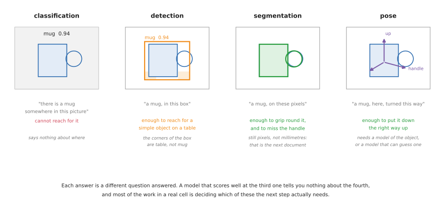
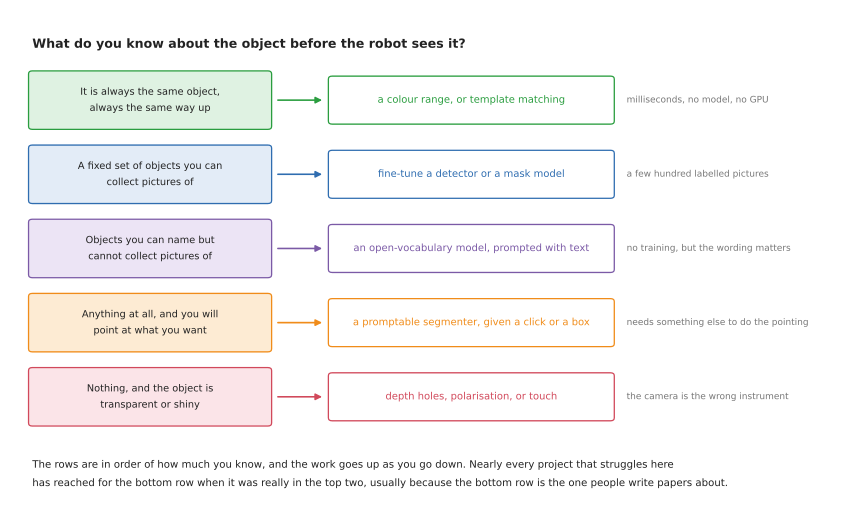
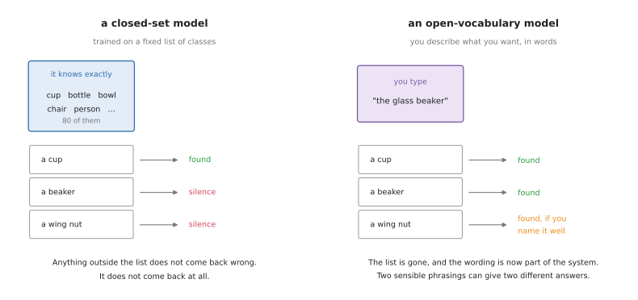

# Finding the object: detection and segmentation

A robot that is going to pick something up has to answer two questions before it
moves. **What is this thing**, and **which part of the picture is it on**. This
document is about answering both. It covers every family of technique that is in
real use, the frameworks that implement them, the models you can download today,
the models you would train yourself, and — for each one — where it fits and
where it does not.

Its companion, [object dimension detection](../07_object-dimension-detection/01_overview.md),
takes the answer this document produces and turns it into millimetres. The split
between the two is deliberate and it matters: everything here works in pixels,
and pixels are not a size. A mask that is perfect to the pixel still does not
tell you how wide the object is.

## Who this is for, and what it is for

This is written for someone who can picture a robot arm and a camera, has read
the [camera area](../05_camera/01_basics.md) or knows the equivalent, and now has
to choose a perception approach for a real project. You do not need to have
trained a model. Every term is explained where it first appears.

It is written to be *used for choosing*, which shapes it in three ways.

Every technique carries five jobs it suits and five it does not. That is more
useful than a score, because almost every technique in this field works well on
the demonstration its authors chose, and the interesting question is always
which job is the one it quietly fails at.

Every licence is named, because licences here are not a formality. The most
popular object detector in the world is published under a licence that makes it
unusable in a commercial product without paying, and a great many tutorials do
not mention this.

Everything says whether it runs on a Mac. A large part of this field assumes an
NVIDIA graphics card, and finding that out after two days of setup is a common
and avoidable waste.

## Contents

1. [Four answers, and which one you need](#1-four-answers-and-which-one-you-need)
2. [What you know before the robot looks](#2-what-you-know-before-the-robot-looks)
3. [Closed set, open vocabulary, and promptable](#3-closed-set-open-vocabulary-and-promptable)
4. [The sensors, and the software that comes with each](#4-the-sensors-and-the-software-that-comes-with-each)
5. [Techniques that do not learn anything](#5-techniques-that-do-not-learn-anything)
6. [Models you can download](#6-models-you-can-download)
7. [Models you would train yourself](#7-models-you-would-train-yourself)
8. [Frameworks and libraries](#8-frameworks-and-libraries)
9. [Datasets](#9-datasets)
10. [Labelling tools](#10-labelling-tools)
11. [Licences, and the one that will catch you out](#11-licences-and-the-one-that-will-catch-you-out)
12. [What runs on an Apple Silicon Mac](#12-what-runs-on-an-apple-silicon-mac)
13. [Putting it in ROS 2](#13-putting-it-in-ros-2)
14. [The comparison grid](#14-the-comparison-grid)
15. [What to actually reach for](#15-what-to-actually-reach-for)
16. [Where to read more](#16-where-to-read-more)

---

## 1. Four answers, and which one you need

People say "the robot sees the object" as though seeing were one thing. It is
four, and they are different jobs with different costs. The picture below shows
all four applied to the same mug, with what each one is worth to a gripper.

**Classification** says what is in the picture and nothing about where. It is the
oldest of the four and the least useful on its own, because a robot cannot reach
for "somewhere".

**Detection** gives a rectangle around the object, usually with a confidence
score. The rectangle is axis-aligned, which means that for anything long and
turned at an angle, a large part of what is inside the rectangle is not the
object. For a mug standing alone on a table that hardly matters. For a screwdriver
lying diagonally it matters a great deal.

**Segmentation** gives the pixels themselves. There are three kinds of it, and
mixing them up is the most common confusion in this whole area:

- **Semantic segmentation** labels every pixel with a class. Every mug pixel is
  labelled "mug". If two mugs touch, they come back as one region, because
  nothing in the answer distinguishes them.
- **Instance segmentation** labels every pixel with a class *and* which object it
  belongs to. Two touching mugs come back as two regions. This is nearly always
  what a robot needs, because a robot picks up one thing at a time.
- **Panoptic segmentation** is both at once: every pixel gets a class, and
  every countable thing also gets an instance. It matters for scene
  understanding and rarely for a table-top arm.

**Pose** gives position and orientation — six numbers, usually called 6-DoF, for
six degrees of freedom: three for where the object is and three for which way it
is turned. This is the only one of the four that tells you which way up something
is, and it is the only one that generally needs a model of the object in advance.
It belongs to the [dimension document](../07_object-dimension-detection/01_overview.md),
where it is covered properly.

The practical rule is that you should pick the cheapest of the four that answers
the question your next step actually asks. A great deal of effort goes into
producing masks for robots that would have been perfectly happy with a box.

| The answer | What it gives you | Enough to... | Not enough to... |
| --- | --- | --- | --- |
| classification | a label | sort pictures | reach for anything |
| detection | a box and a label | reach for one object on a clear table | grip round an odd shape, or measure it |
| instance segmentation | the pixels of each object | measure the outline, avoid a handle, tell touching objects apart | know which way up it is |
| 6-DoF pose | position and orientation | put it down the right way up, fit it into something | measure an object you have no model of |

## 2. What you know before the robot looks

The single best predictor of which technique you should use is not how hard the
scene looks. It is how much you know about the object before the robot ever sees
it. The table below reads from the top down, from knowing the most to knowing the
least, and the work goes up as you go down.

Most projects that get into trouble here have reached for the bottom row when
they were really in the top two. The bottom row is what papers are written
about, so it is what people read about first.

## 3. Closed set, open vocabulary, and promptable

Trained models split into three kinds by what you are allowed to ask them for,
and the difference is not accuracy. It is what happens to an object nobody
thought of in advance.

A **closed-set** model was trained on a fixed list of classes and can only ever
return one of them. Trained on the eighty classes of COCO, it knows "cup" but has
never heard of a beaker, a wing nut, or a brake caliper. Ask it about one and it
does not come back wrong — it comes back empty, which in a robot cell reads as
"there is nothing there".

An **open-vocabulary** model takes a description in words and finds whatever
matches. You type "the glass beaker" and it looks for one. Nothing was trained on
beakers; the model has learned a shared space of pictures and words, so a phrase
it has never seen still lands somewhere sensible. The cost is that the wording is
now part of your system. "Bottle", "water bottle" and "the clear plastic bottle"
can give three different answers, and nothing warns you.

A **promptable** model does not name anything at all. You give it a point, a box
or a rough scribble, and it returns the exact region containing that. Segment
Anything is the famous one. It is extraordinarily good at the boundary and
completely silent on the label, so on its own it cannot start a robot pipeline —
something has to decide where to click. In practice it is paired with a detector
that produces boxes, and the pair does what neither does alone.

| | What you give it | What comes back | Fails when |
| --- | --- | --- | --- |
| closed-set | a picture | one of N fixed classes | the object is not one of the N |
| open-vocabulary | a picture and a phrase | whatever matches the phrase | the phrase is ambiguous, or your object has no common name |
| promptable | a picture and a point or box | the region around that point | nothing tells it where to point |

## 4. The sensors, and the software that comes with each

Before the techniques, the instruments. What you can identify depends first on
what the sensor can see, and each kind of sensor comes with its own driver, its
own ROS 2 package and its own set of models that expect its output.

The table is the summary. Each row is expanded below it.

| Sensor | What it adds to identifying an object | Driver / SDK | ROS 2 driver |
| --- | --- | --- | --- |
| machine-vision colour camera | resolution and control of exposure, which is most of image quality | [Aravis](https://github.com/AravisProject/aravis) (LGPL) or the vendor's, e.g. [Basler pylon](https://github.com/basler/pylon-ros-camera) | [usb_cam](https://github.com/ros-drivers/usb_cam) for simple ones |
| RGB-D camera | a distance for every pixel, which separates objects from their background | [librealsense](https://github.com/realsenseai/librealsense), [OrbbecSDK v2](https://github.com/orbbec/OrbbecSDK_v2) | [realsense-ros](https://github.com/realsenseai/realsense-ros), [OrbbecSDK_ROS2](https://github.com/orbbec/OrbbecSDK_ROS2) |
| structured-light 3D scanner | sub-millimetre geometry, at a price | proprietary SDK | [zivid-ros](https://github.com/zivid/zivid-ros), [PhoXi-ROS-API](https://github.com/photoneo/PhoXi-ROS-API) |
| event camera | microsecond response to change, and no motion blur | [OpenEB](https://github.com/prophesee-ai/openeb), [dv-processing](https://gitlab.com/inivation/dv/dv-processing) | [libcaer_driver](https://github.com/ros-event-camera/libcaer_driver) |
| thermal camera | temperature, which identifies things colour cannot | vendor SDK | vendor-specific |
| polarisation camera | the angle of reflected light, which is what glass changes | vendor SDK | vendor-specific |

### 4.1 A plain colour camera

Everything in sections 5 and 6 works on an ordinary colour image, and the
quality of that image decides more than the choice of model does. The two things
worth spending on are a lens that resolves the detail you care about, and control
over exposure so the picture looks the same at nine in the morning and four in
the afternoon.

Industrial cameras speak **GenICam** over **GigE Vision** or **USB3 Vision**,
which are standards rather than products, so one library can drive cameras from
any vendor. The open one is [Aravis](https://github.com/AravisProject/aravis),
under the LGPL. Vendors also ship their own — Basler's pylon has a
[ROS 2 package](https://github.com/basler/pylon-ros-camera).

For a webcam or a simple USB camera, [usb_cam](https://github.com/ros-drivers/usb_cam)
is the ROS 2 driver, and everything it publishes is consumed by
[cv_bridge](https://github.com/ros-perception/vision_opencv) (Apache-2.0).

**The models that go with it:** all of them. Every detector and mask model in
section 6 takes a colour image and nothing else.

### 4.2 An RGB-D camera

An RGB-D camera adds a distance for every pixel. For identification that is worth
more than it sounds, because it lets you delete the background geometrically
before you ever run a model, which is the
[plane-removal recipe](#56-point-clouds-remove-the-plane-then-cluster) in the
next section.

The mainstream choices are the RealSense and Orbbec Gemini families. Both are
covered in detail, with accuracy figures, in the
[dimension document](../07_object-dimension-detection/01_overview.md#5-sensors-that-measure-distance);
here what matters is the software. [librealsense](https://github.com/realsenseai/librealsense)
and [OrbbecSDK v2](https://github.com/orbbec/OrbbecSDK_v2) are Apache-2.0 and MIT
respectively, and both have maintained ROS 2 drivers.

**The models that go with it:** everything in section 6 for the colour half, plus
the point-cloud work in [Open3D](https://www.open3d.org/) and
[PCL](https://pointclouds.org/) for the depth half. Note that on a Mac, PCL's
Python bindings are dead — `python-pcl` last shipped in 2019 and `pclpy` is
Windows-only — so in Python the answer is Open3D, which ships native
Apple Silicon wheels.

### 4.3 A structured-light 3D scanner

Zivid and Photoneo sell scanners that are one to two orders of magnitude more
accurate than a RealSense, and cost that much more. For identification they
matter when the difference between two parts is geometric and small.

Both have ROS 2 wrappers — [zivid-ros](https://github.com/zivid/zivid-ros) is
BSD-3 and [PhoXi-ROS-API](https://github.com/photoneo/PhoXi-ROS-API) is MIT —
but both wrap a **proprietary binary runtime**, and neither vendor supports
macOS at all.

### 4.4 An event camera

An event camera has no frames. Each pixel reports independently, in microseconds,
whenever the brightness it sees changes. That gives no motion blur, a dynamic
range far beyond a normal sensor, and very little data when nothing is moving.

For a robot arm it is a specialist tool — good for catching fast motion and for
scenes with extreme lighting contrast, and awkward everywhere else, because
almost every model in this document expects frames.

The open software is Prophesee's [OpenEB](https://github.com/prophesee-ai/openeb)
and iniVation's [dv-processing](https://gitlab.com/inivation/dv/dv-processing),
with [libcaer_driver](https://github.com/ros-event-camera/libcaer_driver) for
ROS 2. The research literature is collected in
[this list](https://github.com/uzh-rpg/event-based_vision_resources).

### 4.5 Thermal, polarisation and the rest

**Thermal** cameras identify by temperature, which is sometimes exactly the
distinguishing feature — a hot casting, an occupied seat, a person in a safety
zone. They have low resolution and they are not what you segment a mug with.

**Polarisation** cameras measure the angle of polarisation of the light, which is
strongly changed by glass and by specular surfaces. It is frequently suggested as
the answer for transparent objects, so it is worth saying plainly what a search
of the open-source landscape in September 2026 turns up: **essentially nothing**.
There are no maintained open repositories doing transparent-object grasping from
polarisation. The published work on transparent objects has gone in a different
direction — see [section 6.6](#67-transparent-and-shiny-objects).

Five jobs where the sensor choice is the deciding factor:

- glass and clear plastic, where an ordinary RGB-D camera returns nothing useful
- parts that differ only in a fraction of a millimetre, which needs a real scanner
- scenes with extreme contrast, where an event camera's dynamic range wins
- anything moving fast enough to blur a normal frame
- distinguishing objects by temperature rather than appearance

Five where it is not:

- ordinary opaque objects on a table, where a cheap camera and a good model win
- anything where the limit is the model's class list rather than the picture
- jobs where the object is large and the tolerance is loose
- prototypes, where the wrong lesson is to buy hardware before trying software
- any problem the lighting would have fixed more cheaply

## 5. Techniques that do not learn anything

These are the methods that have no model behind them. You write the rule, the
computer applies it. They are unfashionable and they are still the right answer
surprisingly often, for three reasons that no learned method matches: they run in
about a millisecond, they need no training data, and when they fail you can work
out exactly why by looking at one number.

All of them are in [OpenCV](https://github.com/opencv/opencv), which is the standard computer
vision library, published under the [Apache 2.0
licence](https://github.com/opencv/opencv/blob/4.x/LICENSE) and free to use in a
commercial product. The point-cloud ones are in
[Open3D](https://www.open3d.org/) ([MIT
licence](https://github.com/isl-org/Open3D/blob/main/LICENSE)) or the [Point
Cloud Library](https://pointclouds.org/) ([BSD-3
licence](https://github.com/PointCloudLibrary/pcl/blob/master/LICENSE.txt)).

### 5.1 A colour range

**What it is.** You state which colours count as the object, and every pixel in
that range is kept. Almost always done in HSV — hue, saturation and value —
rather than in red, green and blue, because in HSV the *colour* is one number and
the *brightness* is a separate one, so a shadow across a red block changes the
value and leaves the hue alone. In RGB a shadow changes all three.

**What it costs.** Nothing to install beyond OpenCV, nothing to train, about a
millisecond a frame, and roughly six numbers to tune. It is the fastest route
from no perception to some perception that exists.

**Why this rather than a model.** If the object is genuinely one strong colour
against a background that is not, a model is a great deal of machinery to arrive
at the same answer more slowly and less predictably.

The camera area works a real example end to end in
[finding an object by colour](../05_camera/02_finding-objects.md#3-finding-it-by-colour).

Five jobs it suits:

- a coloured part on a conveyor, under factory lighting that does not change
- fiducial markers and coloured tape used deliberately as targets
- a simulator, where colours are exactly what you set them to
- separating one known object from a background you control, such as a light box
- a first version, built in an afternoon, to find out whether the rest of the
  pipeline works at all

Five jobs it cannot do:

- anything the same colour as its surroundings — a white mug on a white table
- anything whose colour is not the point, such as "find the screws", where screws
  come in every finish
- scenes under daylight, where the colour of everything moves through the day
- telling two objects of the same colour apart when they touch, since they merge
  into one region
- transparent or mirrored objects, which have no colour of their own at all

### 5.2 Background subtraction

**What it is.** You learn what the empty scene looks like, then call anything
that differs from it an object. The usual implementations model each pixel's
history as a mixture of Gaussians — `MOG2` in OpenCV — or by nearest neighbours,
`KNN`, both documented in the [background subtraction
tutorial](https://github.com/opencv/opencv/blob/4.x/doc/py_tutorials/py_video/py_bg_subtraction/py_bg_subtraction.markdown).

**What it costs.** A fixed camera, and a period at the start where the scene is
empty. Both are usually free in a robot cell and both are fatal if you do not
have them.

**Why this rather than a colour range.** It does not care what colour the object
is. It only cares that the object was not there before, which for a cell where
parts arrive is exactly the right question.

Five jobs it suits:

- a fixed overhead camera watching a workspace where parts arrive and leave
- detecting that a human has entered a cell, as a safety trigger
- finding items on a conveyor against a belt that is always the same
- counting things that pass through a frame
- picking out the one thing on a table that moved since the last picture

Five jobs it cannot do:

- anything with a camera on the robot's wrist, because the background moves with it
- a scene that is never empty, so there is nothing to learn as background
- distinguishing the object from its own shadow, which also differs from the
  background
- lighting that changes, which the model slowly accepts as the new background
- an object that arrives and then stays still for a long time, which is gradually
  absorbed into the background and disappears

### 5.3 Edges, contours and connected components

**What it is.** Three related steps. Edge detection, usually
[Canny](https://github.com/opencv/opencv/blob/4.x/doc/py_tutorials/py_imgproc/py_canny/py_canny.markdown), marks where
brightness changes sharply. [Contour
finding](https://github.com/opencv/opencv/blob/4.x/doc/py_tutorials/py_imgproc/py_contours/py_contours_begin/py_contours_begin.markdown)
traces those edges into closed outlines. [Connected
components](https://github.com/opencv/opencv/blob/4.x/samples/cpp/connected_components.cpp)
numbers the separate blobs in a mask so you can treat each as an object.

Connected components in particular is the step that turns "these pixels are
object" into "these are object number one and those are object number two", and
it is needed after almost every other method in this section.

**What it costs.** Very little, but edge methods have thresholds that are
sensitive to contrast, and contours only close properly when the outline is
unbroken. A single gap in an edge lets the contour leak out into the background.

Five jobs it suits:

- separating a mask into one region per object, after colour or depth found the
  pixels
- flat parts on a plain background, such as gaskets or sheet-metal blanks
- printed markers, labels and anything with a strong printed boundary
- measuring an outline once you already know which blob is the object
- checking whether two things are touching, by seeing whether they are one blob

Five jobs it cannot do:

- textured objects, which are full of internal edges that look just like the
  outline
- low-contrast scenes, where the object's edge is not the strongest edge present
- objects that overlap, where the outline of one runs into the other
- anything where you need a *label* — edges tell you where something is and never
  what it is
- cluttered scenes, where the number of contours explodes and none of them is
  clearly the object

### 5.4 Template matching

**What it is.** You keep a small picture of the object and slide it over the
scene, scoring how well it matches at every position. The best-scoring position
is where the object is. OpenCV's [template matching
tutorial](https://github.com/opencv/opencv/blob/4.x/doc/py_tutorials/py_imgproc/py_template_matching/py_template_matching.markdown)
covers the basic form, and the shape-based industrial version is what commercial
libraries such as [MVTec HALCON](https://www.mvtec.com/products/halcon) sell.

**What it costs.** Speed, as soon as the object might be rotated or at a different
distance: you have to search over rotations and scales as well as positions, and
the cost multiplies. It is also brittle in exactly one way that surprises people —
it matches appearance, so a change of lighting can break it even when nothing
moved.

**Why this rather than a trained detector.** For a single rigid part, always the
same way up, on a production line, template matching is more accurate, needs no
training data at all, and its failures are predictable. This is what a great deal
of real factory vision still is.

Five jobs it suits:

- one rigid part, always presented the same way up, on a machine that repeats
- printed-circuit inspection, finding a known component at a known place
- locating a fiducial or a logo for alignment
- finding a tool in a tool holder, where the holder fixes the orientation
- any job where you have exactly one example of the object and no ability to
  collect more

Five jobs it cannot do:

- objects that vary in shape between instances, such as fruit, or mine, or a
  hand-made part
- objects at unknown rotation and scale, unless you can afford to search all of
  them
- deformable things: cable, fabric, bags, anything that drapes
- scenes where lighting changes, since the template encodes the lighting it was
  captured under
- partially hidden objects, where most of the template has nothing to match against

### 5.5 Watershed and GrabCut

**What it is.** Two classical algorithms for splitting a region properly once you
roughly know where it is.
[Watershed](https://github.com/opencv/opencv/blob/4.x/doc/py_tutorials/py_imgproc/py_watershed/py_watershed.markdown) treats
the image as a landscape and floods it from markers you supply, which is the
standard way to split a clump of touching objects into individual ones.
[GrabCut](https://github.com/opencv/opencv/blob/4.x/doc/py_tutorials/py_imgproc/py_grabcut/py_grabcut.markdown) takes a
rough box around the object and refines it into an accurate outline by modelling
the colours inside and outside.

**Why this rather than a promptable neural model.** These are the ancestors of
Segment Anything, and they do the same job: turn a rough hint into a precise
boundary. They are worse at it and they are a thousand times cheaper, need no
model file, and run anywhere.

Five jobs they suit:

- splitting touching objects of the same colour, which watershed was designed for
- cleaning up a rough box into a usable mask, on a machine with no GPU
- counting objects in a clump — grains, pills, coins
- a preprocessing step before measurement, where the boundary has to be tight
- offline labelling, where a human supplies the hints

Five jobs they cannot do:

- running unattended, since both need markers or a box from somewhere
- objects whose colour statistics match the background, which defeats GrabCut
- scenes with soft or blurred boundaries, where the flood spills over
- giving any kind of label or identity
- reflective and transparent objects, whose apparent colour comes from elsewhere
  in the room

### 5.6 Point clouds: remove the plane, then cluster

**What it is.** The classic recipe for a table-top robot, and still the most
reliable thing in this document. Take the depth picture as a cloud of 3D points.
Find the biggest flat surface in it and delete it — that is the table. Group what
is left into clumps of nearby points. Each clump is an object.

The plane is found by [RANSAC](https://pointclouds.org/documentation/tutorials/planar_segmentation.html),
which means random sample consensus: pick three points at random, make the plane
through them, count how many other points lie on it, keep the best after a few
hundred tries. Clustering is usually [Euclidean cluster
extraction](https://pointclouds.org/documentation/tutorials/cluster_extraction.html)
in PCL or [DBSCAN](https://www.open3d.org/docs/release/tutorial/geometry/pointcloud.html)
in Open3D.

The [tools and libraries doc](../08_tools-and-libraries.md#9-perception-camera-drivers-opencv-and-open3d)
shows this recipe as real code.

**Why this rather than anything learned.** It works on objects it has never seen,
which no closed-set model does. It gives you 3D positions directly, in metres,
which is what the arm needs. It has no training data and no licence problem. For
"pick up whatever is on this table", it is still the default in industry.

**What it costs.** A depth camera. And it tells you nothing whatever about what
the objects *are*.

Five jobs it suits:

- bin picking and table clearing, where identity does not matter and geometry does
- any object the robot has never seen, including objects that do not exist yet
- finding the work surface itself, which almost every other step then needs
- checking whether two objects are touching, in 3D rather than in the picture
- producing a first estimate of an object's size and position, ready for the
  [dimension document](../07_object-dimension-detection/01_overview.md)

Five jobs it cannot do:

- naming anything, which is the whole of the "what is it" question
- objects lying flat against the surface, which get deleted along with the plane
- objects that touch each other, which cluster into one
- transparent and shiny objects, which produce no depth points to cluster
- scenes with no dominant plane, such as a cluttered shelf or a pile

### 5.7 The depth hole, for glass and chrome

**What it is.** Not so much a technique as a fact worth exploiting. A depth camera
returns nothing where a transparent object is, because the light goes through it
or is bent aside by the curved surface. So the depth picture has a hole in the
shape of the glass, while the colour picture shows it perfectly well. A hole in
the depth, with something visible through it in colour, is a transparent object.

This sounds like a trick and it is not. It is the same signal a real depth camera
gives, and a pipeline built on it meets the same difficulty a real one does. The
[glass-picking case study](../09_one-arm-training/07_case-study/01_place-glass.md)
is built on exactly this.

**What it costs.** It finds transparency, not identity, and it needs the object to
be in front of something the camera can see.

Five jobs it suits:

- glassware handling: bars, laboratories, dishwashers, bottling
- detecting that a transparent object is present at all, which most methods miss
- flagging regions the depth data cannot be trusted on, before something else
  uses them
- separating glass from opaque clutter, which colour cannot
- a cheap check on a specular metal part, which produces the same missing readings

Five jobs it cannot do:

- work against a background the camera also cannot see, such as a glass on a
  mirror
- distinguish a glass from a hole, a dark absorbing surface, or the edge of the
  camera's range
- tell one glass from another
- give the size of the glass, which needs a side view and a measurement
- work with a sensor that fills in missing depth automatically, which many
  cameras now do by default and which quietly destroys the signal

## 6. Models you can download

Everything in this section has weights you can fetch today and run without
training anything. That is what makes it different from section 6, which is about
models you would train on your own objects.

Every licence below was read from the project's own `LICENSE` file or model card
in September 2026, not from a blog post. Where the code and the weights carry
different licences, both are given, because that catches people out regularly.

### 6.1 Box detectors

**What they are.** Models that return a rectangle and a class for each object they
recognise. They are the cheapest useful answer, they run fastest, and for a robot
working with well-separated objects on a table they are often all you need.

The table lists the ones worth knowing. Read it as: the first column is the model,
the second is what it is good at, and the third is the licence you would be
agreeing to.

| Model | What it is good at | Licence (code / weights) | Where |
| --- | --- | --- | --- |
| Ultralytics YOLO | the easiest to use, by a distance; fast; huge community | **AGPL-3.0** — see [section 10](#10-licences-and-the-one-that-will-catch-you-out) | [ultralytics/ultralytics](https://github.com/ultralytics/ultralytics) |
| RT-DETR | transformer detector with no need for non-maximum suppression; accurate at similar speed | Apache-2.0 / Apache-2.0 | [lyuwenyu/RT-DETR](https://github.com/lyuwenyu/RT-DETR), [weights](https://huggingface.co/PekingU/rtdetr_r50vd) |
| D-FINE | a refinement of RT-DETR, currently among the strongest real-time detectors | Apache-2.0 | [Peterande/D-FINE](https://github.com/Peterande/D-FINE) |
| DEIM | a training scheme that improves DETR-style detectors | Apache | [Intellindust-AI-Lab/DEIM](https://github.com/Intellindust-AI-Lab/DEIM) |
| RF-DETR | Ultralytics-like ergonomics without the AGPL; actively developed | Apache-2.0 | [roboflow/rf-detr](https://github.com/roboflow/rf-detr) |
| YOLOX | anchor-free YOLO with a genuinely permissive licence | Apache-2.0 | [Megvii-BaseDetection/YOLOX](https://github.com/Megvii-BaseDetection/YOLOX) |
| Faster R-CNN, RetinaNet | the classics, in torchvision, trivially available | BSD-3 | [pytorch/vision](https://github.com/pytorch/vision) |

Five jobs a box detector suits:

- picking well-separated objects off a table or a conveyor
- counting things, where the box is only needed to say "one here"
- cueing a promptable segmenter, which needs a box to start from
- tracking objects between frames, where a box is enough to follow
- any job where the object is roughly as wide as it is long, so the box fits it

Five jobs it cannot do:

- gripping an odd shape, where the box's corners are not the object
- measuring, since the box of a tilted object belongs to no real dimension
- separating objects that overlap, where boxes overlap too
- anything needing the outline: avoiding a handle, finding a rim, fitting a
  profile
- finding an object whose class is not in the model's list

### 6.2 Mask models

**What they are.** Models that return the pixels of each object rather than a box.
This is the answer a robot usually wants, because it supports measuring and
gripping round a shape.

| Model | What it is good at | Licence | Where |
| --- | --- | --- | --- |
| Mask R-CNN | the workhorse; well understood; easy to fine-tune | torchvision BSD-3 throughout; Detectron2 code Apache-2.0 but its **weights are CC BY-SA 3.0** | [pytorch/vision](https://github.com/pytorch/vision), [detectron2](https://github.com/facebookresearch/detectron2) |
| Mask2Former | stronger masks; one architecture for all three kinds of segmentation | MIT, but the repository is **archived** | [facebookresearch/Mask2Former](https://github.com/facebookresearch/Mask2Former) |
| OneFormer | one model trained once, doing semantic, instance and panoptic | MIT | [SHI-Labs/OneFormer](https://github.com/SHI-Labs/OneFormer) |
| SegFormer | efficient semantic segmentation | **NVIDIA Source Code License — non-commercial** | [NVlabs/SegFormer](https://github.com/NVlabs/SegFormer) |
| mmdetection / mmsegmentation | a large library of implementations to train from | Apache-2.0 | [mmdetection](https://github.com/open-mmlab/mmdetection), [mmsegmentation](https://github.com/open-mmlab/mmsegmentation) |

Two notes that matter more than the accuracy numbers. Mask2Former's repository is
archived, which means no fixes and no new dependencies supported; its weights
still work and the code will rot. And mmdetection has not had a push since August
2024, so while it is still the widest collection of implementations, it is drifting
away from current PyTorch.

Five jobs a mask model suits:

- gripping round a shape, where the outline decides where the fingers go
- measuring an object's silhouette, which is the input to the
  [dimension document](../07_object-dimension-detection/01_overview.md)
- separating touching objects of the same class, which instance segmentation does
  by design
- excluding a handle, a spout or a label from a grasp
- any job where you need the area of something rather than a box around it

Five jobs it cannot do:

- run at high frame rate on a small computer, which is where a box detector wins
- recognise objects outside its training classes
- produce reliable boundaries on transparent or reflective objects
- give orientation, which a mask does not contain
- tell you anything in millimetres

### 6.3 Promptable segmenters: the Segment Anything family

**What it is.** You give the model a point, a box, or a rough region; it returns
the exact mask containing it. It does not name anything. Its strength is the
boundary, which is markedly better than anything trained per-class, and its
weakness is that something else must decide where to point.

**Why this rather than a mask model.** Because it works on objects it has never
seen, which a closed-set mask model cannot. In a robot cell this is the difference
between handling your five known parts and handling whatever a customer puts on
the table.

| Model | What it is | Licence (code / weights) | Where |
| --- | --- | --- | --- |
| SAM | the original; excellent boundaries; slow | Apache-2.0 / Apache-2.0 | [segment-anything](https://github.com/facebookresearch/segment-anything) |
| SAM 2 | adds video and is faster; the safe default | Apache-2.0 / Apache-2.0 | [sam2](https://github.com/facebookresearch/sam2) |
| SAM 3 | the newest; segments *every* instance matching a phrase | **bespoke "SAM License"**, weights gated | [sam3](https://github.com/facebookresearch/sam3) |
| SAM 3.1 | a drop-in update to SAM 3, March 2026 | same as SAM 3 | [weights](https://huggingface.co/facebook/sam3.1) |
| EdgeSAM, EdgeTAM | the two that run properly on Apple hardware | EdgeSAM **non-commercial**; EdgeTAM Apache-2.0 | [EdgeSAM](https://github.com/chongzhou96/EdgeSAM), [EdgeTAM](https://github.com/facebookresearch/EdgeTAM) |
| MobileSAM | a much smaller SAM for embedded use | Apache-2.0 | [MobileSAM](https://github.com/ChaoningZhang/MobileSAM) |
| FastSAM | a fast approximation, built on Ultralytics | **AGPL-3.0** | [FastSAM](https://github.com/CASIA-LMC-Lab/FastSAM) |

If the licence matters to you, SAM 2 is the one to reach for: it is the most
recent of the family that is plainly Apache-2.0 in both code and weights. SAM 3's
licence is a Meta community licence that does permit commercial use, but it is a
bespoke agreement with its own acceptable-use terms rather than a standard open
licence, so it needs reading rather than assuming. FastSAM is AGPL because it is
built on Ultralytics, which is the most commonly missed licence inheritance in
this whole field — and note that FastSAM's own README claims Apache-2.0 while its
`LICENSE` file is AGPL-3.0. When a repository contradicts itself, the licence file
is the one that counts.

SAM 3 is also more than a faster SAM. It does *promptable concept segmentation*:
given a short phrase it returns **every** instance matching it, which is the job
that previously needed Grounding DINO and SAM chained together. That makes it a
replacement for the pairing described in section 6.4, at the cost of a licence
that is not a standard open one.

Five jobs the SAM family suits:

- objects the robot has never seen and you cannot enumerate
- turning a detector's rough box into an accurate outline, which is the standard
  pairing
- labelling data: a human clicks, SAM produces the mask, which is how most
  labelling tools now work
- cluttered scenes where per-class models fall apart
- anything where boundary quality is what limits you

Five jobs it cannot do:

- start a pipeline, since nothing in it decides what to point at
- name the object, which is the entire "what is it" question
- run fast on a small computer, unless you use MobileSAM and accept the drop
- give consistent object identity across frames, without the video variant
- handle transparent objects, whose boundary is genuinely ambiguous in the image

### 6.4 Open-vocabulary models

**What they are.** Models you prompt with words. They were trained on pictures
paired with text, so they can find things that were never a class in any list.

| Model | What it does | Licence (code / weights) | Where |
| --- | --- | --- | --- |
| Grounding DINO | text in, boxes out; the standard choice | Apache-2.0 / Apache-2.0 | [GroundingDINO](https://github.com/IDEA-Research/GroundingDINO), [weights](https://huggingface.co/IDEA-Research/grounding-dino-base) |
| Grounded-SAM | Grounding DINO for the box, SAM for the mask: text in, masks out | Apache-2.0 | [Grounded-Segment-Anything](https://github.com/IDEA-Research/Grounded-Segment-Anything) |
| OWLv2 | open-vocabulary detection from Google; strong and simple to run | Apache-2.0 | [weights](https://huggingface.co/google/owlv2-base-patch16-ensemble) |
| YOLO-World | real-time open-vocabulary detection | **GPL-3.0** | [YOLO-World](https://github.com/AILab-CVC/YOLO-World) |
| Florence-2 | one small model doing captioning, detection and grounding | MIT | [weights](https://huggingface.co/microsoft/Florence-2-large) |

The pairing worth knowing is **Grounding DINO plus SAM**, usually packaged as
Grounded-SAM. Between them they take a phrase and return a mask, with no training
and no class list, and both halves are Apache-2.0. For a robot that has to handle
objects you cannot enumerate in advance, this is the current default.

Five jobs open-vocabulary models suit:

- objects you can describe but not collect pictures of
- a long tail of rare items, as in a warehouse or a laboratory
- prototypes, where the class list is still changing every week
- taking an instruction in words — "pick up the blue mug" — and acting on it
- generating training labels for a smaller, faster model you then train yourself

Five jobs they cannot do:

- run in a few milliseconds on a small computer, which they are far from
- give repeatable answers to two phrasings of the same request
- distinguish things whose difference has no ordinary name — two similar valve
  bodies
- work where the object has no common-language description at all, which is most
  of manufacturing
- offer any guarantee, which is why safety-relevant decisions are not made this
  way

### 6.5 Backbones and features

**What they are.** Not object finders, but the feature extractors other things are
built on. They matter here because a strong backbone with a small trained head is
often the cheapest route to a good custom model.

[DINOv2](https://github.com/facebookresearch/dinov2) is Apache-2.0 and produces
features good enough that a simple classifier on top of them matches models
trained end to end. [DINOv3](https://github.com/facebookresearch/dinov3) is newer
and stronger, but is published under a bespoke DINOv3 licence rather than Apache,
so it needs reading before commercial use.

### 6.6 Open-vocabulary models that are not downloadable

One correction that catches people regularly. **Grounding DINO 1.5, 1.6, 1.6 Pro
and DINO-X have no open weights.** The repositories with those names contain
client code for a paid hosted service, and the Apache-2.0 licence on them covers
the client, not the model. Only the original Grounding DINO has downloadable
weights. A great many blog posts present the later versions as though you could
`pip install` them.

Similarly, Ultralytics **YOLO27 is announced and not released**, and Depth
Anything V2's Giant checkpoint has said "coming soon" for a long time.

### 6.7 Transparent and shiny objects

This deserves its own entry because it is the case that defeats everything above,
and because the honest state of it is not what people expect.

The classical approach is the depth hole from [section 5.7](#57-the-depth-hole-for-glass-and-chrome).
The reference work is [Lysenkov, Eruhimov and Bradski, RSS
2012](https://roboticsproceedings.org/rss08/p35.html), which deliberately used the
depth sensor's *failure* as the segmentation cue. The code from that lineage
([wg-perception/transparent_objects](https://github.com/wg-perception/transparent_objects))
is long unmaintained.

Since then the field has moved to learned depth completion, and the licensing is
awkward:

| Project | Licence | State |
| --- | --- | --- |
| [ClearGrasp](https://github.com/Shreeyak/cleargrasp) | Apache-2.0 | abandoned in 2021; still the standard citation for the problem |
| TransCG | **CC BY-NC-SA 4.0** | abandoned in 2022; the largest real dataset, and non-commercial |
| [ReMake](https://github.com/ChengYaofeng/ReMake) | **MIT** | 2026, and the most usable recent option: a monocular depth model plus an instance mask, completing the depth |
| [FoundationStereo](https://github.com/NVlabs/FoundationStereo) | **NVIDIA, non-commercial** | excellent, and not shippable |

Polarisation imaging is frequently suggested for this and, as
[section 4.5](#45-thermal-polarisation-and-the-rest) says, there is essentially no
open-source work behind the suggestion.

## 7. Models you would train yourself

Everything so far assumes somebody else's classes. The moment your objects are
specific — your parts, your products — you train.

**You almost never train from scratch.** You fine-tune: take a model that already
knows what edges, textures and objects look like in general, and teach it your
classes with a few hundred labelled pictures. The camera area
[works through this](../05_camera/02_finding-objects.md#6-training-a-model-of-your-own)
with eighty pictures of one object, which is enough to see it work.

The choices, in the order most people should consider them:

| Route | When it is right | Licence |
| --- | --- | --- |
| [RF-DETR](https://github.com/roboflow/rf-detr) | a permissive detector with good ergonomics; the sensible default in 2026 | Apache-2.0 |
| [torchvision references](https://github.com/pytorch/vision/tree/main/references) | you want no framework at all, just PyTorch | BSD-3 |
| [segmentation_models_pytorch](https://github.com/qubvel-org/segmentation_models.pytorch) | semantic segmentation with a wide choice of backbones | MIT |
| [Hugging Face transformers](https://github.com/huggingface/transformers) | fine-tuning DETR, Mask2Former, OneFormer and friends | Apache-2.0 |
| [Detectron2](https://github.com/facebookresearch/detectron2) | you specifically need its Mask R-CNN recipes | Apache-2.0 code, **CC BY-SA 3.0 weights** |
| [Ultralytics](https://github.com/ultralytics/ultralytics) | the fastest path to a working model, if AGPL is acceptable | **AGPL-3.0** |
| [mmdetection](https://github.com/open-mmlab/mmdetection) | you need an implementation that exists nowhere else | Apache-2.0, **last updated August 2024** |

A newer route is worth knowing because it changes the economics. Use an
open-vocabulary model to *label* your data — Grounding DINO or SAM 3 generating
boxes and masks from a text prompt — then train a small, fast, permissively
licensed model on those labels. You get a model that runs in milliseconds on a
cheap computer, trained on data nobody had to draw by hand.

Five jobs training your own model suits:

- a fixed set of objects that a general model does not know
- anything that has to run fast on a small computer
- distinguishing objects that differ in ways with no common name
- a task where you need to control and version the model's behaviour
- meeting a licence constraint, by training your own weights on permissive code

Five jobs it does not:

- objects that change every week, where you would retrain every week
- a long tail of thousands of rare items
- projects with no way to collect and label a few hundred pictures
- proving anything before the mechanical and lighting side is settled
- one-off jobs, where an open-vocabulary model costs nothing and works today

## 8. Frameworks and libraries

Read this as: what state each one is in, verified by its last commit in September
2026, because a stale framework is a slow problem rather than an obvious one.

| Framework | Licence | State |
| --- | --- | --- |
| [OpenCV](https://github.com/opencv/opencv) | Apache-2.0 since 4.5; BSD-3 at 4.4 and earlier | very active. **5.0.0 shipped June 2026** and restructured the modules, so 4.x code does not port straight across; 4.x is still maintained in parallel |
| [PyTorch](https://github.com/pytorch/pytorch) / [torchvision](https://github.com/pytorch/vision) | BSD-3 | the foundation of nearly everything here |
| [Hugging Face transformers](https://github.com/huggingface/transformers) | Apache-2.0 | very active; version 5 landed January 2026 |
| [Open3D](https://github.com/isl-org/Open3D) | MIT | active; v0.20.0 in September 2026, with native Apple Silicon wheels |
| [PCL](https://github.com/PointCloudLibrary/pcl) | BSD-3 | active in C++; its **Python bindings are dead** |
| [Detectron2](https://github.com/facebookresearch/detectron2) | Apache-2.0 | frozen — no tagged release since 2021 |
| [mmdetection](https://github.com/open-mmlab/mmdetection) / [mmsegmentation](https://github.com/open-mmlab/mmsegmentation) | Apache-2.0 | **two years stale**, both last pushed August 2024 |
| [supervision](https://github.com/roboflow/supervision) | MIT | active; the glue between detectors, trackers and annotations |
| [ONNX Runtime](https://github.com/microsoft/onnxruntime) | MIT | the portable way to deploy, including on Apple hardware |
| [coremltools](https://github.com/apple/coremltools) | BSD-3 | the route to Apple's Neural Engine |
| [MLX](https://github.com/ml-explore/mlx) | MIT | Apple Silicon machine learning; the realistic way to run large vision-language models on a Mac |

## 9. Datasets

If you are training, you need data, and the licences here are stricter than the
code licences. Read this table as: what the annotations allow, then separately
what the images allow, because they are usually different and the images are
where the restriction bites.

| Dataset | Annotations | Images | Commercial use |
| --- | --- | --- | --- |
| [Open Images V7](https://storage.googleapis.com/openimages/web/index.html) | CC BY 4.0 | CC BY 2.0 | **yes — the only large one that is cleanly clear** |
| [COCO](https://cocodataset.org/) | CC BY 4.0 | Flickr terms, copyright per image | annotations yes, images are your own risk |
| [LVIS](https://www.lvisdataset.org/) | BSD | inherits COCO's | as COCO |
| [ADE20K](https://groups.csail.mit.edu/vision/datasets/ADE20K/) | BSD-3 | **non-commercial research and education only** | **no** |
| [Cityscapes](https://www.cityscapes-dataset.com/) | — | **non-commercial** | **no** |
| [Objects365](https://www.objects365.org/) | CC BY 4.0 | **academic purposes only**, registration required | **no** |
| [SA-1B](https://ai.meta.com/datasets/segment-anything/) | research licence | same | **no** |
| [GraspNet-1Billion](https://graspnet.net/) | CC BY-NC-SA 4.0 | same | **no** |

The short version for anyone building a product: **Open Images V7 is the one you
can use without thinking about it.** COCO's annotations are fine and its images
are a judgement call. The rest forbid commercial use, and a model trained on them
inherits the problem.

## 10. Labelling tools

| Tool | Licence | Self-hosted | Notes |
| --- | --- | --- | --- |
| [CVAT](https://github.com/cvat-ai/cvat) | MIT | yes | the standard; has SAM-assisted labelling built in |
| [Label Studio](https://github.com/HumanSignal/label-studio) | Apache-2.0 | yes | broader than vision; model-assisted via a backend |
| [FiftyOne](https://github.com/voxel51/fiftyone) | Apache-2.0 | yes | for looking at and curating a dataset rather than drawing on it |
| [X-AnyLabeling](https://github.com/CVHub520/X-AnyLabeling) | **GPL-3.0** | yes | a wide model zoo for assisted labelling |
| [labelme](https://github.com/wkentaro/labelme) | **GPL-3.0** | yes | widely assumed to be MIT; it is not |
| [Roboflow](https://roboflow.com/) | hosted service | no | see the note below |

One thing about Roboflow's free tier that is easy to miss and matters
commercially: on the free plan your **data and models are public** on Roboflow
Universe. Keeping a dataset private requires a paid plan.

## 11. Licences, and the one that will catch you out

If you read one section of this document, read this one.

**Ultralytics YOLO is AGPL-3.0.** It is the most popular object detector in the
world, it is what almost every tutorial uses, and its licence obliges you to
publish the source of anything you combine it with — including, because of the
AGPL's network clause, software you never distribute but merely run as a service.
Ultralytics' own documentation states that the pretrained weights carry the same
terms regardless of how you obtained them. A commercial licence is available and
is priced by negotiation.

That is not a criticism of the licence, which is a legitimate choice. It is a
warning that a great many projects have adopted it without noticing, and the
noticing usually happens late.

The same inheritance catches anything built on Ultralytics, including FastSAM,
YOLOE, and the popular `yolo_ros` wrapper.

**The permissive alternatives exist and are good.** RF-DETR, RT-DETR, D-FINE,
DEIM and YOLOX are all Apache-2.0, all competitive, and none of them will make a
lawyer unhappy.

Beyond that, five patterns are worth recognising:

- **Code permissive, weights not.** Depth Anything V2's small weights are
  Apache-2.0 and its large ones are CC BY-NC. YOLO-NAS has Apache-2.0 code and
  non-commercial weights. Detectron2's code is Apache-2.0 and its weights are
  CC BY-SA. Always check the model card, not the repository badge.
- **NVIDIA research licences are non-commercial** and asymmetric: they permit
  NVIDIA to use the same work commercially. SegFormer, FoundationPose,
  FoundationStereo, DOPE and CenterPose are all in this group.
- **Open weights are not open source.** SAM 3, DINOv3 and the Gemma family ship
  bespoke agreements that permit commercial use with conditions attached. They
  need reading, not assuming.
- **No licence is worse than a restrictive one.** SAM-6D has no licence file at
  all, which means default copyright and no permission to use it for anything.
- **The dataset licence flows into your model.** Training on ADE20K or
  GraspNet-1Billion gives you weights with a provenance problem.

## 12. What runs on an Apple Silicon Mac

The general answer is better than its reputation, because of one pattern worth
knowing.

**A great many models whose original repository requires CUDA have a pure-PyTorch
reimplementation in Hugging Face `transformers` that does not.** Deformable DETR's
port falls back to `grid_sample` when the CUDA kernel is missing; Mask2Former's
and OneFormer's ports never had one; Grounding DINO's port is pure PyTorch; and —
the useful one — **SAM 3 is in `transformers` from version 5.0.0, with no compiled
kernels at all**, including its tracker and video heads. So "the repository needs
CUDA" and "it will not run on your Mac" are different statements, and the second
is often false.

| Works on Apple Silicon | Does not |
| --- | --- |
| OpenCV, Open3D (native wheels), PCL in C++ | NVIDIA Isaac ROS, entirely — it needs a Jetson or an Ampere-or-newer NVIDIA card |
| torchvision detectors and Mask R-CNN, on MPS | Deformable DETR, DINO-DETR, Mask2Former and OneFormer **from their original repositories** |
| RT-DETR, D-FINE, DEIM, RF-DETR, YOLOX — no compilation needed | Grounded-SAM's local install |
| Ultralytics, with `device="mps"` | YOLACT++ and SOLOv2's deformable-convolution variants |
| SAM, SAM 2 and SAM 3 via `transformers` | mmcv's CUDA operators |
| EdgeSAM and EdgeTAM, which have real CoreML builds | NVIDIA TAO Toolkit |
| ONNX Runtime, CoreML, MLX | TensorRT |

Two measured figures worth quoting, because most Apple Silicon claims in this
field are guesses: Depth Anything V2 Small runs in **24.6 ms on an M3 Max** through
CoreML and the Neural Engine, and EdgeSAM runs at **38.7 frames per second on an
iPhone 14**. Against that, MobileSAM — which is *designed* to be small — measures
around 24 seconds per image on an M4 Air's CPU, far slower than FastSAM's 58
milliseconds on the same machine. Small does not automatically mean fast on
Apple hardware; what matters is whether anyone has done the CoreML work.

## 13. Putting it in ROS 2

ROS 2's current long-term release is **Lyrical Luth**, from May 2026. Jazzy
Jalisco remains supported to 2029 and is the safer choice today.

Perception results travel as
[vision_msgs](https://github.com/ros-perception/vision_msgs) (Apache-2.0), which
defines `Detection2DArray`, `Detection3DArray` and the classification types.
Anything you write should publish those rather than invent its own.

| Package | Licence | What it is for |
| --- | --- | --- |
| [vision_msgs](https://github.com/ros-perception/vision_msgs) | Apache-2.0 | the standard message types for detections |
| [vision_opencv](https://github.com/ros-perception/vision_opencv) | Apache-2.0 | `cv_bridge`, between ROS images and OpenCV |
| [image_pipeline](https://github.com/ros-perception/image_pipeline) | BSD | rectification, calibration, stereo |
| [perception_pcl](https://github.com/ros-perception/perception_pcl) | BSD-3 | PCL inside ROS |
| [yolo_ros](https://github.com/mgonzs13/yolo_ros) | **GPL-3.0** | the de facto Ultralytics wrapper — note the licence, twice over |
| [Isaac ROS](https://github.com/NVIDIA-ISAAC-ROS) | mixed | see below |

**A warning about Isaac ROS that is easy to miss.** Its perception packages are
Apache-2.0, which looks reassuring. But `isaac_ros_nitros`, the zero-copy
transport every one of those nodes depends on, is under NVIDIA's own proprietary
Isaac ROS Software License. An Apache-2.0 badge on `isaac_ros_yolov8` does not
make your deployment Apache-2.0. It also runs only on a Jetson or an
Ampere-or-newer NVIDIA card — there is no CPU-only path and no Apple Silicon path.

## 14. The comparison grid

Everything in one table. Speed is an order of magnitude on ordinary hardware
rather than a benchmark figure, because the benchmark figure depends on a card
you probably do not have.

| Approach | Gives you | Speed | Needs training | Unknown objects | Licence risk |
| --- | --- | --- | --- | --- | --- |
| colour range | mask | ~1 ms | no | no | none |
| background subtraction | mask | ~1 ms | no | yes | none |
| contours, connected components | regions | ~1 ms | no | yes | none |
| template matching | position | ms to s | no | no | none |
| watershed, GrabCut | mask | tens of ms | no | yes | none |
| plane removal and clustering | 3D clumps | ~10 ms | no | **yes** | none |
| depth hole | transparent regions | ~1 ms | no | yes | none |
| box detector, trained | boxes and classes | ~10 ms | yes | no | **AGPL if Ultralytics** |
| mask model, trained | masks and classes | tens of ms | yes | no | check the weights |
| SAM family | masks, no labels | 0.1 to 1 s | no | **yes** | SAM 2 safest |
| open-vocabulary | boxes or masks from text | 0.1 to 1 s | no | **yes** | mixed |
| SAM 3 | every instance matching a phrase | ~30 ms on a large GPU | no | **yes** | bespoke licence |

## 15. What to actually reach for

Four recommendations, in the order you should consider them.

**If the object is one strong colour on a background you control, use a colour
range.** It takes an afternoon, runs in a millisecond and never surprises you. A
surprising number of working cells are this.

**If you need geometry and not identity, remove the plane and cluster.** For
"pick up whatever is on this table" this is still the best answer in the
document. It works on objects that did not exist when you wrote it, it needs no
training data, and it hands you 3D positions directly.

**If you need a trained detector, start with RF-DETR or RT-DETR, not
Ultralytics.** They are permissively licensed, competitive, and they need no
compilation, so they run on a Mac. Reach for Ultralytics when you have decided
the AGPL is acceptable, not by default.

**If you cannot enumerate the objects, use SAM 2 with a detector, or SAM 3
alone.** SAM 2 with Grounding DINO is the fully Apache-2.0 route. SAM 3 does the
same job in one model and better, under a licence you should read first.

And one thing to do before any of it: fix the lighting. More perception problems
are solved by a diffuser and a fixed exposure than by changing the model.

## 16. Where to read more

- [The camera area](../05_camera/01_basics.md) — how a camera works, and a
  worked example of finding an object by colour, with depth, and with a trained
  model.
- [Object dimension detection](../07_object-dimension-detection/01_overview.md) —
  the companion to this document, which turns these pixels into millimetres.
- [Tools and libraries](../08_tools-and-libraries.md#9-perception-camera-drivers-opencv-and-open3d) —
  where perception sits in the wider stack of a table-mounted arm.
- [The glass case study](../09_one-arm-training/07_case-study/01_place-glass.md) —
  one project that uses the depth hole, silhouettes and a measured profile
  instead of any trained model at all.
