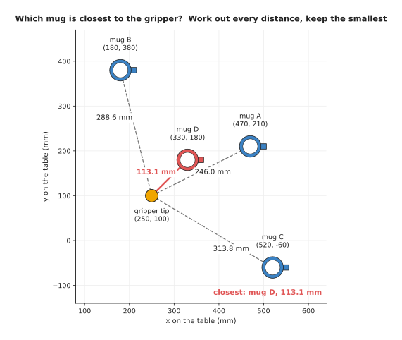
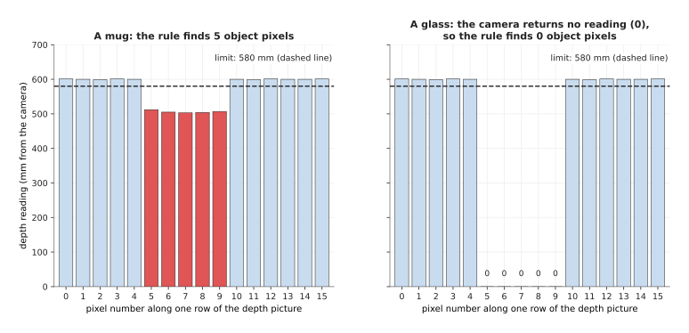

# Programmed, not learned

This is the first page of Programming Techniques, which explains the methods that
robot arm software is built from. A technique here means a fixed method that a
person wrote down step by step, rather than something a computer worked out for
itself. Examples are the pinhole camera model, the Kalman filter, A* search and
proportional-integral-derivative (PID) control, and each of them has its own
page later in the book.

This page answers three questions: what a technique is, how it is different from
a learned model, and how this book is laid out.

It is for a reader who has never taken a course on algorithms, so it starts from
the beginning. However, you should already know what a robot arm, a frame, a
camera, a pixel and a point cloud are, because Books 1 and 2 explain them.
Beyond that, you do not need to know any programming language well, and you do
not need any maths past adding, multiplying and square roots.

This book has a partner in
[Learned Models](../../07_learned-models/01_what-models-are/01_what-a-model-is.md),
which covers the other way of building robot software: models that are learned
from examples. This book covers the methods that people write by hand instead. A
real robot arm uses both, so this page also says how they fit together.

## Contents

1. [What a technique is](#1-what-a-technique-is)
2. [A first technique: the closest mug](#2-a-first-technique-the-closest-mug)
3. [The same steps in any language](#3-the-same-steps-in-any-language)
4. [Written rules or a trained model](#4-written-rules-or-a-trained-model)
5. [Why learn techniques when models exist](#5-why-learn-techniques-when-models-exist)
6. [What this book covers](#6-what-this-book-covers)
7. [How to read this book](#7-how-to-read-this-book)
8. [Where to read next](#8-where-to-read-next)
9. [Using it in Python](#9-using-it-in-python)

---

## 1. What a technique is

The introduction promised to say what a technique is, so this section starts
there. A robot arm program has many small jobs to do. For example, it must turn
a pixel into a position, and it must pick which object to grab first. It must
also find a path that does not hit the table, and then tell each motor how hard
to push. Each of these jobs is a question with an answer, so something in the
program has to work that answer out.

A **technique**, in this book, is a written method that finds the answer to one
such question, and it takes the form of a list of steps. A person worked out
those steps, wrote them down, and checked that they give the right answer. The
computer then follows the steps exactly, in order, every time it runs.

Computer scientists call such a list of steps an **algorithm**, and this book
uses "technique" and "algorithm" to mean nearly the same thing. "Technique" is a
little wider, because it also covers a way of setting up a problem. For example,
the pinhole camera model is a formula more than a list of steps.

Every technique has three parts:

- The **input** is what you give it. For example, the positions of four mugs.
- The **steps** are what it does with the input. For example, "work out the
  distance to each mug, and keep the smallest".
- The **output** is what it gives back. For example, "mug D".

A technique gives the same output every time you give it the same input. This is
because nothing inside it changes from one day to the next unless a person
changes it. So that fixed behaviour is the main thing that makes it different
from a learned model, as section 4 explains.

Many techniques also have **parameters**, which are numbers that you choose
before you run the technique and that stay fixed while it runs. For example, a
rule that says "anything closer than 580 millimetres is an object" has one
parameter, the 580. Choosing parameters well is a large part of using a
technique, so [choosing a technique](03_choosing-a-technique.md) comes back to
it.

---

## 2. A first technique: the closest mug

Section 1 named the three parts of a technique, so this section walks through
one small technique from start to finish to make those parts concrete.

A robot arm stands at a table with four mugs on it, and a camera has already
found where each mug is. The arm should pick up the mug closest to its gripper
first, because that is the shortest move. So the question this technique has to
answer is which of the four mugs is closest.

All the positions are measured in millimetres on the table, as seen from above,
and the gripper tip sits at x = 250, y = 100. The four mugs are called A, B, C
and D.



The picture shows the gripper tip in yellow and the four mugs, with a line from
the tip to each mug; the shortest line, 113.1 mm to mug D, is drawn in red.

The technique works through the mugs one at a time, and its steps are these:

1. Start with no answer yet, and a "smallest distance so far" that is larger than
   any real distance.
2. Take the first mug. Work out its straight-line distance from the gripper tip.
3. If that distance is smaller than the smallest so far, remember this mug and
   this distance.
4. Repeat steps 2 and 3 for every other mug.
5. The mug you remember at the end is the answer.

The distance in step 2 comes from Pythagoras' rule, which says to take the
difference in x and the difference in y, square each one, add them, and take the
square root. For mug D, at x = 330 and y = 180, both differences are 80, so the
two squares are 6,400 and 6,400 and they add up to 12,800. The square root of
12,800 is about 113.1, which means mug D is 113.1 mm from the gripper tip.

The table below follows the steps one mug at a time, so read it from top to
bottom. Then look at the last column, which shows what the technique remembers
after each mug, because whatever it remembers after the last row is the output.

| Mug | Position (x, y) in mm | Distance in mm | Smaller than the smallest so far? | Remembered after this mug |
| --- | --- | --- | --- | --- |
| A | (470, 210) | 246.0 | yes, it is the first | A, 246.0 |
| B | (180, 380) | 288.6 | no | A, 246.0 |
| C | (520, -60) | 313.8 | no | A, 246.0 |
| D | (330, 180) | 113.1 | yes | D, 113.1 |

The output is mug D, and the picture agrees, because the line to mug D is the
shortest of the four.

Here are the same steps written as **pseudocode**, which is a way of writing
steps that looks a little like a program but belongs to no programming language.
This is meant for people to read rather than for a computer to run, and every
technique page in this book gives its steps this way.

```
input:  tip, the gripper position (x, y)
        mugs, a list of mug positions (x, y)
output: the mug closest to tip

best     = none
smallest = infinity
for each mug in mugs:
    d = square root of ((mug.x - tip.x)^2 + (mug.y - tip.y)^2)
    if d < smallest:
        smallest = d
        best     = mug
return best
```

A few words in this pseudocode need explaining before you read it. The `=` sign
means "store this value under this name", and it does not mean "is equal to".
`infinity` stands for a number larger than any real distance, so the first mug
is always smaller than it. `for each mug in mugs` means "do the indented lines
once for every mug", `^2` means "squared", and `return` means "this is the
output".

This technique has a name of its own, because it is the simplest form of
**nearest-neighbour search**, which means finding the item closest to a given
point. It works the same way for 4 mugs or for 40,000 points in a point cloud.
With 40,000 points, however, it becomes slow, so the
[nearest-neighbour search](../03_searching-and-matching/02_most-used/01_nearest-neighbour-search.md)
page shows faster ways to do it.

---

## 3. The same steps in any language

The last section wrote the closest-mug technique as pseudocode rather than as
code, and that was deliberate, because the techniques in this book are
**language independent**. That means the steps do not depend on which
programming language you use. The same steps therefore work in Python, in C++,
in Rust, or on paper with a calculator, and only the spelling changes.

Here are the same steps in Python, where `math.hypot` is the built-in name for
"the square root of the sum of the squares".

```python
import math

def closest_mug(tip, mugs):
    best, smallest = None, math.inf
    for name, (x, y) in mugs.items():
        d = math.hypot(x - tip[0], y - tip[1])
        if d < smallest:
            best, smallest = name, d
    return best
```

Here they are in C++, the other language that robot software is most often
written in.

```cpp
std::string closest_mug(Point tip, const std::map<std::string, Point>& mugs) {
    std::string best;
    double smallest = std::numeric_limits<double>::infinity();
    for (const auto& [name, p] : mugs) {
        double d = std::hypot(p.x - tip.x, p.y - tip.y);
        if (d < smallest) { smallest = d; best = name; }
    }
    return best;
}
```

Both programs have a starting value, a loop over the mugs, a distance, a
comparison and a result. So they are the same pseudocode spelled two ways, and,
called with the four mugs from the picture, the Python version returns `'D'`,
which is the answer the table worked out by hand.

This is why the book teaches techniques as steps and not as code. Once you
understand the steps, you can read them in any language, and you can also
recognise them inside a library. Most of the time you will not write a technique
yourself, since you will call a library that already has it, such as OpenCV for
pictures or Open3D for point clouds. Each technique page therefore ends with a
table of the libraries that provide it, and the name of the function to call.

---

## 4. Written rules or a trained model

Sections 1 to 3 described techniques on their own, so this section puts them
beside the alternative. There are two ways to build the software that answers a
question for a robot, and this section compares them.

The first way is to write the steps yourself, which is a technique and is what
this book is about, and people call software built this way **programmed**.

The second way is to let a computer find the steps for you. You collect many
examples of inputs, each with the right output written next to it. A program
then adjusts millions of numbers inside a **model** until the model gives the
right outputs for those examples. This adjusting is called **training**, and
software built this way is called **learned**, which Book 6 explains, starting
with
[what a model is](../../07_learned-models/01_what-models-are/01_what-a-model-is.md).

Here is one job done by a written rule, which shows where a rule is strong and
where it is weak. A depth camera looks straight down at a table and, for each
pixel, reports how far away the surface is in millimetres. The table is 600 mm
from the camera, so anything standing on the table reads closer than that. A
simple written rule for finding objects is therefore: "a pixel is part of an
object if its depth reading is more than 0 and less than 580 mm". The 580 is the
rule's one parameter, and it leaves 20 mm of room for the camera's small errors.
The "more than 0" part is there because the camera writes 0 when it gets no
reading at all.



On the left, five pixels on a mug read between 503 and 512 mm, below the dashed
580 mm line, so the rule marks them in red; on the right, the camera gets no
reading through a glass and writes 0, so the rule finds nothing.

On the mug, the rule works well. It is fast, because it costs one comparison per
pixel, and it is exact, because you can point at any pixel and say why it was
chosen. It also needed no examples at all, since a person worked the 580 out
from the table's known distance.

On the glass, the rule fails. Light passes through glass instead of bouncing
back, so the depth camera gets no reading there, and the rule was never told
what to do about that. Book 2 describes this problem in
[the depth hole, for glass and chrome](../../02_perception/02_object-perception/03_programmed-methods.md#17-the-depth-hole-for-glass-and-chrome).
You could write a second rule for holes in the depth picture, but then a shadow
also makes holes, so you need a third rule. Each new rule fixes some cases and
breaks others.

A learned model would handle this differently, because you would show it many
colour pictures of glasses, each with the glass outlined by a person. It would
then learn what glasses look like, including their edges and reflections,
without anyone writing a rule about light.

The table below compares the two ways, so read each row across to see how they
differ on one point.

| | Programmed technique | Learned model |
| --- | --- | --- |
| Who writes the steps | a person | a program, from examples |
| What you need to start | an understanding of the problem | many examples with the right answers |
| How fast it runs | often under a millisecond | often tens of milliseconds, usually on a graphics card |
| Can you see why it gave an answer | yes, step by step | mostly no |
| Works on things you did not plan for | usually not | often, if they look like the examples |
| How you fix a mistake | change a step or a parameter | add examples and train again |

Most real robot arms use both ways together, and the common pattern is this one.
A learned model finds the mugs in the colour picture. After that, programmed
techniques do everything else: they turn pixels into positions, fit the table
plane, plan the path and drive the motors. Books 2 and 3 show this pattern many
times, for example in
[methods you write yourself](../../02_perception/02_object-perception/03_programmed-methods.md)
and
[programmed methods for one arm](../../03_frameworks/04_one-arm-training/02_programmed-methods.md).

---

## 5. Why learn techniques when models exist

Section 4 showed that a learned model can do things a written rule cannot, which
raises the question a beginner often asks in 2026. Learned models can do so
much, so why spend time on hand-written techniques?

The first reason is that a robot arm cannot run without them. Even a robot built
around a large learned model still needs a camera model to turn pixels into
positions, and transforms to move between the camera's frame and the arm's
frame. It also needs a controller to turn joint targets into motor currents, a
thousand times a second. None of these three parts is usually learned, so they
have to be written by hand.

The second reason is that techniques are exact where exactness matters. A
transform from the camera to the base is plain arithmetic, so it is either right
or wrong, and you can check it with a ruler. A learned model instead gives
answers that are usually close. For a gripper with 5 mm of room on each side of
a mug, "usually close" is not always good enough.

The third reason is cost, because a technique needs no training data and no
graphics card, and it often runs in well under a millisecond on an ordinary
processor. It is also easier to test, since you can reason about every step.

The fourth reason is understanding, because a learned model is often described
as "replacing" a technique. A movement model replaces a planner and a
controller, and a grasp model replaces a hand-written grasp search. You cannot
judge whether the replacement is better unless you know what it replaced.

Techniques cost you something too, because they need a person who understands
the problem well enough to write the steps. They also break when the world does
something the person did not plan for, as the glass did in section 4. And each
parameter, such as the 580 mm limit, has to be chosen and then checked again
whenever the scene changes.

So the advice in this book is the same as in Books 2, 3 and 6. If a written
technique does the job reliably, use it, and switch to a learned model only
where the world is too varied for rules.
[Choosing a technique](03_choosing-a-technique.md) explains how to tell which
case you are in.

---

## 6. What this book covers

Now that the difference between a technique and a learned model is clear, this
section says what the rest of the book contains. The book sorts the techniques
used on robot arms into seven categories, and each category answers a different
question for the arm. Each category has its own chapter, and every chapter
starts with an overview page.

Inside each chapter, the technique pages are split into two groups, because some
of them matter more than others. The **most used** group holds the techniques
that nearly every arm program needs, or that matter most. The **also used**
group, in contrast, holds techniques that are used often, but only for some
tasks or some kinds of arm. So if you are short of time, read the most used
group of each chapter first.

The table below lists the seven categories and all 34 technique pages. Read each
row as one category: its name, the question it answers, the link to its
overview, and its technique pages in the two groups.

| Category | What it does | Start here | Most used | Also used |
| --- | --- | --- | --- | --- |
| Geometry and cameras | turns pixels, frames and joint angles into positions you can trust | [overview](../02_geometry-and-cameras/01_overview.md) | [pinhole camera model](../02_geometry-and-cameras/02_most-used/01_pinhole-camera-model.md), [rigid transforms](../02_geometry-and-cameras/02_most-used/02_rigid-transforms.md), [calibration](../02_geometry-and-cameras/02_most-used/03_calibration.md), [pose from points](../02_geometry-and-cameras/02_most-used/04_pose-from-points.md) | [multi-view geometry](../02_geometry-and-cameras/03_also-used/01_multi-view-geometry.md) |
| Searching and matching | finds the closest thing, and decides which thing is which | [overview](../03_searching-and-matching/01_overview.md) | [nearest-neighbour search](../03_searching-and-matching/02_most-used/01_nearest-neighbour-search.md), [iterative closest point](../03_searching-and-matching/02_most-used/02_iterative-closest-point.md), [assignment and matching](../03_searching-and-matching/02_most-used/03_assignment-and-matching.md) | [image features and matching](../03_searching-and-matching/03_also-used/01_image-features-and-matching.md) |
| Fitting and estimation | gets a clean shape or a steady number out of noisy measurements | [overview](../04_fitting-and-estimation/01_overview.md) | [least-squares fitting](../04_fitting-and-estimation/02_most-used/01_least-squares-fitting.md), [RANSAC](../04_fitting-and-estimation/02_most-used/02_ransac.md), [Kalman filter](../04_fitting-and-estimation/02_most-used/03_kalman-filter.md), [sensor streams](../04_fitting-and-estimation/02_most-used/04_sensor-streams.md) | [system identification](../04_fitting-and-estimation/03_also-used/01_system-identification.md) |
| Image and point cloud processing | cleans up and cuts up pictures and point clouds so objects stand out | [overview](../05_image-and-point-cloud-processing/01_overview.md) | [thresholding and colour masks](../05_image-and-point-cloud-processing/02_most-used/01_thresholding-and-colour-masks.md), [morphology and distance transform](../05_image-and-point-cloud-processing/02_most-used/02_morphology-and-distance-transform.md), [clustering](../05_image-and-point-cloud-processing/02_most-used/03_clustering.md) | [edges and contours](../05_image-and-point-cloud-processing/03_also-used/01_edges-and-contours.md), [volumetric maps](../05_image-and-point-cloud-processing/03_also-used/02_volumetric-maps.md) |
| Planning and search | finds a way for the arm to get from here to there without hitting anything | [overview](../06_planning-and-search/01_overview.md) | [sampling-based planning](../06_planning-and-search/02_most-used/01_sampling-based-planning.md), [numerical inverse kinematics](../06_planning-and-search/02_most-used/02_numerical-inverse-kinematics.md), [trajectory optimisation](../06_planning-and-search/02_most-used/03_trajectory-optimisation.md) | [graph search](../06_planning-and-search/03_also-used/01_graph-search.md), [sampling-based optimisation and MPC](../06_planning-and-search/03_also-used/02_sampling-based-optimisation-and-mpc.md), [visibility and next best view](../06_planning-and-search/03_also-used/03_visibility-and-next-best-view.md) |
| Control and motion | turns a planned path into smooth, safe motor commands | [overview](../07_control-and-motion/01_overview.md) | [PID control](../07_control-and-motion/02_most-used/01_pid-control.md), [trajectory generation](../07_control-and-motion/02_most-used/02_trajectory-generation.md), [arm dynamics](../07_control-and-motion/02_most-used/03_arm-dynamics.md), [safety monitoring](../07_control-and-motion/02_most-used/04_safety-monitoring.md) | [impedance and force control](../07_control-and-motion/03_also-used/01_impedance-and-force-control.md) |
| Decisions and task logic | decides what the robot does next, and in what order | [overview](../08_decisions-and-task-logic/01_overview.md) | [finite state machines](../08_decisions-and-task-logic/02_most-used/01_finite-state-machines.md), [behaviour trees](../08_decisions-and-task-logic/02_most-used/02_behaviour-trees.md) | [greedy algorithms and set cover](../08_decisions-and-task-logic/03_also-used/01_greedy-algorithms-and-set-cover.md), [optimisation solvers](../08_decisions-and-task-logic/03_also-used/02_optimisation-solvers.md) |

In the table, RANSAC stands for random sample consensus, which is a way to fit a
shape while ignoring readings that are plainly wrong. PID stands for
proportional-integral-derivative, and MPC stands for model predictive control,
which means planning a short way ahead, taking the first step, and then planning
again.

Before those seven chapters comes this first chapter, which explains the ideas
that every later page uses, and it has four pages:

1. Programmed, not learned. This page.
2. [The building blocks](02_the-building-blocks.md). The six ingredients that
   almost every technique is made from: frames and transforms, arrays and grids,
   graphs, noise, cost functions, and loops that run at a fixed rate.
3. [Choosing a technique](03_choosing-a-technique.md). How to judge a technique
   by its speed, its accuracy, how well it copes with bad readings and how much
   tuning it needs, and when to use a learned model instead.
4. [The map of techniques](04_the-map-of-techniques.md). All seven categories
   and all 34 technique pages on one page, placed on one arm task.

---

## 7. How to read this book

Section 6 listed the chapters, so this section says what order to read them in.
Read this first chapter straight through, because each page uses words that the
page before it explained.

After that, the seven category chapters can be read in any order. Each one
starts with an overview page that says what the category is for and lists its
techniques. Each later page in a chapter covers one technique, and those pages
sit in the two groups described above, with the most used group first. Every
technique page follows the same order:

1. what question the technique answers, in one sentence, with an everyday example;
2. how it works, step by step, with a small example worked out with real numbers,
   and the steps as pseudocode;
3. where it is used on a robot arm;
4. where it works well, where it fails, and what people use instead when it fails;
5. which libraries already provide it, and the name of the function to call;
6. why you would choose it over the obvious alternative, and what it costs you;
7. where to read next.

If you want the whole picture first, read
[the map of techniques](04_the-map-of-techniques.md) next, and then come back to
[the building blocks](02_the-building-blocks.md).

The pseudocode in this book follows the same few rules as the closest-mug
example in section 2 of this page. The `=` sign stores a value under a name, and
indented lines belong to the line above them. `for each` repeats, `if` decides, and `return` gives the
output. Words in plain English stand in for anything that would take many lines
of code, such as "square root of".

A real worked example of many of these techniques on one arm is the
[pick-glasses project](https://github.com/RobinNagpal/robot-arm-projects/tree/main/v5-pick-glasses)
in the robot-arm-projects repository. It uses nearest-neighbour search, the
distance transform, clustering and a greedy choice of camera views to find and
pick up drinking glasses, and the technique pages mention it where it helps.

---

## 8. Where to read next

- [The building blocks](02_the-building-blocks.md) is the next page. It explains
  the ingredients that almost every technique uses.
- [What a model is](../../07_learned-models/01_what-models-are/01_what-a-model-is.md)
  is the first page of Book 6. It explains learned models, the other half of
  robot arm software.
- [Methods you write yourself](../../02_perception/02_object-perception/03_programmed-methods.md)
  in Book 2 shows many programmed perception techniques at work, with code.
- [Programmed methods for one arm](../../03_frameworks/04_one-arm-training/02_programmed-methods.md)
  in Book 3 shows how written methods drive a whole arm task.

---

## 9. Using it in Python

Section 3 wrote the closest-mug technique in Python and in C++, and section 4
described a written rule that marks the object pixels in a depth picture. Both
were plain loops and comparisons, because that is what a technique looks like
when you spell out every step yourself. However, a real program does not loop
over 76,800 pixels one at a time in Python, since that is far too slow for a
camera sending 30 pictures a second. So this section shows the same depth rule
written the way a real program writes it, with a library doing the repetition,
and then says which part of it is still yours.

The library is NumPy, which holds a whole grid of numbers in one object and
applies an arithmetic step to every number in the grid at once.

```python
import numpy as np

# One depth picture from Book 2's camera: 240 rows by 320 columns, each number a
# distance in millimetres. The camera writes 0 where it got no reading at all.
depth = np.load("depth_mm.npy")

TABLE_MM = 600.0     # measured from the camera to the empty table
MARGIN_MM = 20.0     # room for the camera's own error

is_object = (depth > 0) & (depth < TABLE_MM - MARGIN_MM)

print(is_object.sum(), "object pixels out of", depth.size)
```

NumPy does the repeating for you. That is because `depth > 0` compares all 76,800
numbers and gives back a grid of true and false values of the same shape, and `&`
combines two such grids into one. The three lines of arithmetic are therefore the
whole loop, and they run inside compiled code rather than in Python, which is why
they finish in well under a millisecond.

What you still write yourself is the rule and everything after it. NumPy has no
idea what an object is, so you decide that an object pixel is one nearer than the
table, and you write the steps that turn the grid of true and false values into
something the arm can use. Those steps are grouping the true pixels into separate
objects, back-projecting each group into points, and throwing away groups too
small to be real. Later chapters of this book cover each of them, starting with
[clustering](../05_image-and-point-cloud-processing/02_most-used/03_clustering.md).

What you have to decide or measure is the two capital-letter numbers, and neither
of them can be guessed. `TABLE_MM` has to be measured with the camera in the
place it will actually sit, because a number taken from a drawing is wrong as
soon as the bracket bends. `MARGIN_MM` has to come from looking at the readings
on an empty table, since a margin smaller than the camera's noise marks table
pixels as objects, while a margin larger than your shortest object hides that
object completely. The units matter just as much, because a camera that reports
metres instead of millimetres makes both numbers wrong by a factor of a thousand,
and nothing in the code will complain.

So this is the shape of most techniques in this book: a library call or two,
wrapped in your own code, with a small number of numbers that you must measure
rather than invent. The closest-mug loop from section 3 is the same story, because
it is also one library call,
[`scipy.spatial.KDTree`](../03_searching-and-matching/02_most-used/01_nearest-neighbour-search.md),
once the list of mugs grows past a few dozen.
