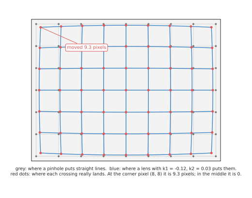
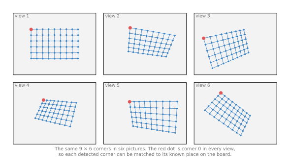
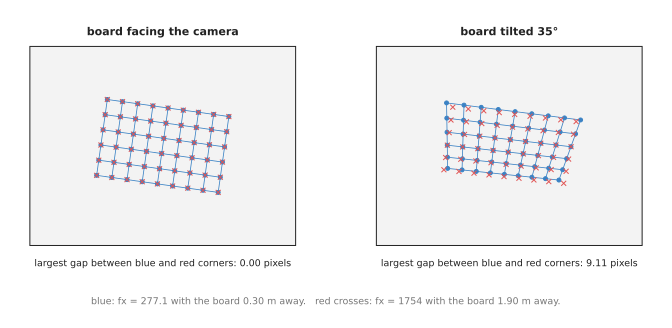
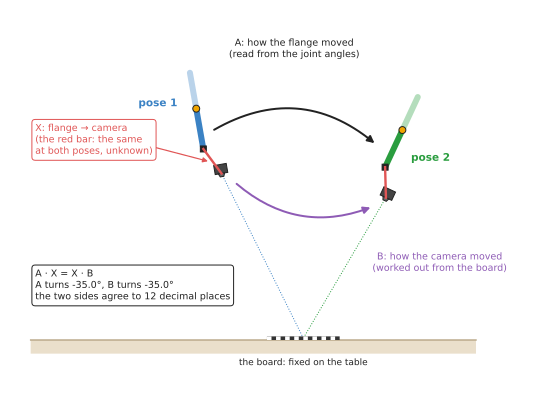

# Calibration

This page explains calibration as a technique you can use in any program, and it
covers the two calibrations that every arm with a camera needs. **Intrinsic
calibration** measures the camera's lens numbers from pictures of a printed
checkerboard, while **hand-eye calibration** measures where the camera sits
relative to the arm. The page then answers four questions about both of them.
What exactly is being measured? How does the method find it? How many pictures
are enough, and which ones? And how do you know the answer is right?

It is for a reader who has read the two pages before this one:
[the pinhole camera model](01_pinhole-camera-model.md), which uses the lens
numbers, and [rigid transforms](02_rigid-transforms.md), which uses the camera's
pose. Book 2 explains why calibration matters so much in
[calibration, which decides all of it](../../../02_perception/02_object-perception/02_sensors.md#4-calibration-which-decides-all-of-it),
while this page explains how it works inside.

## Contents

1. [The idea in one sentence](#1-the-idea-in-one-sentence)
2. [Intrinsic calibration: the lens numbers](#2-intrinsic-calibration-the-lens-numbers)
   · [What is measured](#what-is-measured)
   · [The known pattern](#the-known-pattern)
   · [Reprojection error: the number the method makes small](#reprojection-error-the-number-the-method-makes-small)
   · [How the numbers are found](#how-the-numbers-are-found)
   · [A worked run: the lens numbers](#a-worked-run-the-lens-numbers)
   · [The trap: flat-on pictures](#the-trap-flat-on-pictures)
3. [Hand-eye calibration: where the camera is on the arm](#3-hand-eye-calibration-where-the-camera-is-on-the-arm)
   · [Two set-ups](#two-set-ups)
   · [A X = X B, in plain words](#a-x--x-b-in-plain-words)
   · [A worked run: the camera on the flange](#a-worked-run-the-camera-on-the-flange)
4. [Checking the result](#4-checking-the-result)
5. [Pseudocode](#5-pseudocode)
6. [Where it is used on a robot arm](#6-where-it-is-used-on-a-robot-arm)
7. [Where it works, and where it does not](#7-where-it-works-and-where-it-does-not)
8. [Libraries that provide it](#8-libraries-that-provide-it)
9. [Why calibrate, and what it costs](#9-why-calibrate-and-what-it-costs)
10. [The learned alternative](#10-the-learned-alternative)
11. [Where to read next](#11-where-to-read-next)
12. [Using it in Python](#12-using-it-in-python)

---

## 1. The idea in one sentence

**Photograph something whose shape you know exactly, then choose the unknown
numbers so that the model predicts the pictures you really took.**

Here is an everyday example. To check a kitchen scale, you put a bag of sugar on
it that you know weighs exactly 1 kg, so if the scale reads 1.03 kg you now know
how far off it is. Calibration does the same with a camera, where the "bag of
sugar" is a printed board whose corners are at known places, and the "reading"
is where those corners land in the picture.

Both calibrations on this page follow that idea, and they differ only in what is
known and what is unknown. Intrinsic calibration knows the board and finds the
lens, while hand-eye calibration knows the lens and the arm's movements, and
finds the fixed transform between the arm's flange and the camera.

---

## 2. Intrinsic calibration: the lens numbers

### What is measured

Section 1 said that calibration photographs something known, and the first of
the two calibrations photographs a board to learn about the camera. Intrinsic
calibration finds the numbers that belong to the camera itself and do not change
when the camera moves. They are the four lens numbers from the
[pinhole camera model](01_pinhole-camera-model.md), `fx`, `fy`, `cx` and `cy`,
plus the lens's **distortion**, which is how much it bends straight lines.

The usual distortion model has five numbers, and they fall into two kinds. Three
of them, `k1`, `k2` and `k3`, describe **radial** distortion, which moves each
point towards or away from the middle of the picture by an amount that grows
with the distance from the middle. The other two, `p1` and `p2`, describe
**tangential** distortion, which comes from a lens that is slightly tilted
relative to the sensor, and which is usually tiny. Book 2 shows the five numbers
arriving in ROS's `CameraInfo` message, as the field `d`, in
[the ROS camera page](../../../04_ros-and-rviz/01_ros/03_ros-camera.md).

The picture below shows radial distortion with `k1` = -0.12 and `k2` = 0.03, on
a camera with Book 2's lens numbers. These values are made up for the example,
but they are typical of a small wide lens.



The grey grid is where a perfect pinhole would put the points, and the blue grid
is where this lens puts them. In the middle of the picture nothing moves, but
near the corner pixel (8, 8) the point moves 9.3 pixels towards the middle,
which at 0.34 m is about 11 mm. So a program that ignored this would be accurate
in the middle of the picture and badly wrong at the edges.

### The known pattern

The known object is usually a printed **checkerboard**, whose inner corners,
where four squares meet, lie on a perfect grid. So if the squares are 20 mm, the
corners are at (0, 0, 0), (20, 0, 0), (40, 0, 0) and so on, in millimetres, in
the board's own frame. The board is flat, which means every corner has `z` = 0.

Then the program finds the corners in each picture to a fraction of a pixel.
OpenCV's `findChessboardCorners` finds them, and `cornerSubPix` refines each one
by looking at the brightness pattern around it. A good detector places a corner
to about 0.1 to 0.3 pixels.

So you take many pictures, with the board in a different place and at a
different tilt each time. The picture below shows six such views of a board with
9 × 6 inner corners, as the camera sees them.



Every picture shows the same 54 corners, and the program knows which corner is
which, because the board's pattern tells it where corner 0 is and which way the
rows run. That matching of "this pixel is that corner" is what the method feeds
on.

A newer kind of board, the **ChArUco board**, puts a small printed code in the
white squares. Each code names its own corners, so the board still works when
part of it is hidden or out of the picture, which is why Book 2 recommends it.

### Reprojection error: the number the method makes small

Suppose you guess all the unknown numbers: the lens numbers, the distortion, and
the board's pose in each picture. With those guesses, you can work out where
every corner **should** land, using the pinhole model and the distortion
formula, and that step is called **reprojection**.

The **reprojection error** of one corner is the distance, in pixels, between
where it should land and where the detector found it. The method combines all of
them into one number, the **root mean square (RMS)** error: square each
distance, take the mean, and take the square root. A good intrinsic calibration
has an RMS below one pixel, and a very good one is 0.1 to 0.3 pixels.

So calibration is the search for the guesses that make the RMS as small as
possible. That makes it a **least-squares** problem, the same kind of problem as
[least-squares fitting](../../04_fitting-and-estimation/02_most-used/01_least-squares-fitting.md)
a line to points, only with many more unknowns.

### How the numbers are found

The formulas are not linear, because of the division by depth and the distortion
terms, so the method cannot solve them in one step. Instead it works in two
stages, and the whole method is known as **Zhang's method**, after the paper
that described it in 2000.

1. **A first guess, ignoring distortion.** For a flat board, the mapping from board
   points to pixels in one picture is a simple formula called a **homography**: a
   3 × 3 matrix that maps one flat plane to another. The program fits one homography
   per picture from its corners. Each homography constrains the lens numbers a
   little. With three or more pictures at different tilts, the lens numbers can be
   solved directly, and each picture's board pose follows.
2. **Refining everything together.** Starting from that guess, the program adjusts
   all the unknowns at once to shrink the RMS. It uses the
   **Levenberg–Marquardt** method: a repeated step that asks "which small change to
   all the numbers reduces the error most?", makes that change, and repeats
   until the error stops falling, and this stage also adds the distortion
   numbers.

With 15 pictures, there are 4 lens numbers, 5 distortion numbers and 6 pose
numbers per picture: 99 unknowns. The pictures give 15 × 54 corners, each with
two coordinates, which is 1,620 measurements. So having many more measurements
than unknowns is what lets the noise average out.

### A worked run: the lens numbers

For this page, we ran OpenCV's `calibrateCamera` on a simulated camera, so that
the true answer is known. The camera had Book 2's lens numbers and the
distortion from the picture above. Then we placed a 9 × 6 board with 20 mm
squares at 15 random poses, 0.30 to 0.45 m away and tilted up to 35°. After
that, we projected the corners and added random noise of 0.2 pixels to each,
which is what a good corner detector achieves. The table below compares the
answer with the truth, so read each row as one number.

| Number | True value | Calibration found |
| --- | --- | --- |
| `fx` | 277.1 | 276.99 |
| `fy` | 277.1 | 276.70 |
| `cx` | 160.0 | 160.01 |
| `cy` | 120.0 | 118.70 |
| `k1` | -0.12 | -0.100 |
| `k2` | 0.03 | -0.139 |
| RMS reprojection error | | 0.269 pixels |

The four lens numbers are close, and `cy` is off by 1.3 pixels, which is the
largest error among them. The RMS of 0.269 pixels is about what the 0.2 pixels
of noise predicts, so the model fits the pictures well.

`k2` looks badly wrong, because it is 0.03 in truth and came back as -0.139.
That is not a bug, because `k2` controls the bending far from the middle, and in
these 15 pictures no corner came further than 110 pixels from the middle. So the
pictures never tested the corners of the picture, and many different `k2` values
fit them equally well. Inside the area the board covered, the found lens and the
true lens send each pixel along almost the same ray, within 1.6 pixels. However,
in the picture's far corners, which the board never reached, they differ by 21
pixels. **A calibration is only good where the board has been.** So move the
board into every corner of the picture.

The number of pictures also matters, so we measured that too. We repeated the
run 30 times for each count of pictures, and took the middle result. The table
below shows how far `fx` landed from the truth.

| Pictures | Typical `fx` error (median of 30 runs) | Worst tenth of runs |
| --- | --- | --- |
| 3 | 2.36 pixels | 4.70 or more |
| 5 | 1.09 pixels | 3.38 or more |
| 8 | 0.83 pixels | 2.17 or more |
| 12 | 0.82 pixels | 2.03 or more |
| 20 | 0.56 pixels | 1.19 or more |
| 30 | 0.58 pixels | 1.06 or more |

The error falls quickly up to about 8 pictures and slowly after 20. So 15 to 25
well spread pictures is a sensible target, because more pictures of the same
kind add little.

### The trap: flat-on pictures

We also ran the same calibration on 15 pictures where the board always faced the
camera squarely, with no tilt. The RMS came out at 0.272 pixels, which is as
good as before. However, `fx` came out as 1,754 instead of 277.1, which is more
than six times too large.

The picture below shows why that happens. A board 0.30 m from a camera with `fx`
= 277.1, and the same board 1.90 m from a camera with `fx` = 1,754, give exactly
the same picture when the board faces the camera. So the camera cannot tell
"near and wide" from "far and zoomed in".



On the left, the blue and red corners sit exactly on top of each other, because
the largest gap is 0.00 pixels. On the right, the board is tilted 35°, so the
near edge of the board is now closer than the far edge, and the amount of
perspective depends on the distance. The two answers then differ by up to 9.11
pixels, so the method can tell which one is right.

The lesson is that a low RMS does not prove a calibration is right, because it
proves only that the numbers explain the pictures you took. **So tilt the board
in every picture, in different directions.**

---

## 3. Hand-eye calibration: where the camera is on the arm

### Two set-ups

Section 2 measured the camera on its own, and this section measures where that
camera sits on the robot. Hand-eye calibration finds a rigid transform between
the arm and the camera, and there are two common set-ups, which find different
transforms.

- **Eye in hand.** The camera is fixed to the arm's wrist. The unknown is
  `T_flange_camera`, the camera's pose relative to the flange, and a board lies
  still on the table.
- **Eye to hand.** The camera is fixed in the room, looking at the arm. The unknown
  is `T_base_camera`, the camera's pose relative to the arm's base, while a
  board is fixed to the gripper.

The two use the same equation and the same solvers, so this page describes only
eye in hand, because it is the harder one to picture.

So why not just measure the transform with a ruler? Because the numbers that
matter are the camera's optical centre and the direction of its optical axis,
and both sit somewhere inside the camera body, where no ruler can reach. And a
small error costs a lot: Book 2's
[error budget](../../../02_perception/02_object-perception/01_overview.md#8-where-the-millimetres-go)
shows that 1° of error in this transform costs 5.9 mm at 340 mm.

### A X = X B, in plain words

The arm moves the camera to several poses, and at each one two things are
recorded.

1. The flange's pose in the base frame. The arm's controller reports it, from the
   joint angles and forward kinematics.
2. The board's pose in the camera's frame. The program finds it from the board's
   corners and the lens numbers found by intrinsic calibration. Finding an object's
   pose from known points and their pixels is called **perspective-n-point (PnP)**,
   and OpenCV's `solvePnP` does it.

Then take any two of those poses, 1 and 2. Write `A` for how the flange moved
from pose 1 to pose 2, measured in the flange's own frame at pose 1. Write `B`
for how the camera moved between the same two poses, measured in the camera's
own frame. `A` comes from the arm's readings, while `B` comes from the board,
because the board did not move, so any change in how the camera sees it is the
camera's own movement.

The camera is bolted to the flange, so the two movements are linked by the
unknown bolt, `X` = `T_flange_camera`. Going "flange at pose 1, then move A,
then bolt X" must reach the same place as "flange at pose 1, then bolt X, then
move B". Written as transforms:

```
A · X = X · B
```

The picture below shows the two poses, drawn from the side.



The red bar is `X`, which is the same at both poses, while the black arrow is
`A`, known from the joint angles, and the purple arrow is `B`, found from the
board. In this drawing both movements turn by -35.0°, and the two sides of the
equation agree to 12 decimal places, because the numbers were computed from a
true `X`.

That also gives a useful check on real data. `A` and `B` must always turn by the
same angle, because they are the same physical movement seen from two points on
one rigid body. If a pair of poses shows `A` turning 14.4° and `B` turning
12.1°, one of the two measurements is wrong: a blurred picture, or an arm pose
recorded at the wrong moment.

One pair of poses is not enough to find `X`, because each pair constrains `X`
only partly. With three or more poses, and movements that turn about at least
two different axes, `X` is fixed. Movements that only slide, with no turn, tell
the method nothing about `X`'s rotation, so the poses must tilt the camera in
different directions, not just move it around.

So several published methods solve `A X = X B` from many pairs. Tsai and Lenz's
method (1989) and Park and Martin's method (1994) find the rotation first and
then the shift. However, Horaud and Dornaika's method and Daniilidis's method
(1999) find both together. Andreff's method treats the problem as one set of
linear equations, and OpenCV's `calibrateHandEye` offers all five.

### A worked run: the camera on the flange

We simulated an eye-in-hand calibration with OpenCV, so that the true `X` is
known. The true camera sat 60 mm along the flange's `x`, 20 mm back along its
`z`, and turned 2° about its `y`. At each pose, the board's corners were
projected into the camera, given 0.2 pixels of noise, and passed to `solvePnP`.
Each flange position was given 0.2 mm of noise, which is what a good arm repeats
to. The camera was 0.30 to 0.40 m from the board and tilted up to 25° each way.

The first table shows the five methods, each run 20 times on 15 poses, so read
each row as one method and its typical error.

| Method | Shift error (median of 20 runs) | Rotation error (median of 20 runs) |
| --- | --- | --- |
| Tsai | 0.90 mm | 0.128° |
| Park | 0.84 mm | 0.121° |
| Horaud | 0.62 mm | 0.100° |
| Andreff | 17.54 mm | 0.125° |
| Daniilidis | 0.68 mm | 0.109° |

So four methods land under 1 mm and near a tenth of a degree. Andreff's method
found the rotation as well as the others, but its shift was 17.5 mm out in this
simulation, and we did not investigate why. So the practical lesson is to run
two methods on the same data and compare them, and if they disagree by more than
a millimetre or two, find out why before trusting either.

Then the second table shows Park's method with different numbers of poses, each
run 30 times.

| Poses | Shift error | Rotation error |
| --- | --- | --- |
| 3 | 3.28 mm | 0.50° |
| 5 | 1.51 mm | 0.28° |
| 10 | 1.04 mm | 0.19° |
| 15 | 0.82 mm | 0.13° |
| 25 | 0.72 mm | 0.11° |

As with intrinsic calibration, the error falls fast up to about 10 poses and
slowly after. Book 2 reports that careful real calibrations reach about 0.9 mm
and a quarter of a degree, which is close to these simulated numbers. However, a
real calibration also carries errors this simulation left out, such as an
imperfect intrinsic calibration and a board that is not perfectly flat.

---

## 4. Checking the result

Section 3 gave numbers from a simulation where the true answer was known, but on
a real robot you never have that. A calibration tool always returns an answer,
so checking it is a separate job, and the reprojection error alone is not
enough, as the flat-on pictures showed.

- **The touch test.** Put a small, sharp object on the table. Find it with the
  camera, move it into the base frame, send the tool tip to it, and measure the
  miss with a ruler. This tests the whole chain at once: lens numbers, the
  hand-eye transform, arm kinematics and the tool transform. Book 3 describes it
  as
  [the known object in a known place](../../../03_frameworks/03_arm-movement/08_frames-and-conventions.md#52-the-known-object-in-a-known-place).
- **The straight edge.** Photograph a straight edge near the corner of the picture,
  undistort it, and check that it comes out straight.
- **Two methods, one data set.** Run two hand-eye methods and compare.
- **Held-out pictures.** Keep a few pictures out of the calibration, and then
  compute their reprojection error with the result, which should be about as
  small as the RMS of the pictures that were used.
- **Several views of one point.** With a wrist camera, look at one fixed point from
  several arm poses. After moving each measurement into the base frame, all of them
  should land on the same spot. A spread of several millimetres points at the
  hand-eye transform.

---

## 5. Pseudocode

Sections 2 and 3 described both calibrations, and here is the whole technique in
plain steps. The inner solvers are what the libraries provide, so they are named
rather than written out.

```
# Intrinsic calibration
board_corners = the known corner positions in the board frame (z = 0)
views = empty list
for each picture:                          # aim for 15 to 25, tilted, covering the corners
    found, pixels = find_board_corners(picture)
    if not found: skip this picture
    pixels = refine_to_subpixel(picture, pixels)
    add (board_corners, pixels) to views

guess K and one board pose per view from homographies    # Zhang's first stage
refine K, distortion, all board poses to minimise
    sum over views and corners of |project(corner, pose, K, distortion) - pixel|²
report the RMS error, and check it with held-out pictures

# Hand-eye calibration, eye in hand
flange_poses = empty list; board_poses = empty list
for each arm pose:                         # at least 10, tilting about different axes
    move the arm there and wait until it is still
    record T_base_flange from the arm controller
    take a picture; find the board corners
    T_camera_board = solve_pnp(board_corners, pixels, K, distortion)
    add them to the two lists

for each pair (i, j):                      # a sanity check before solving
    A = inverse(T_base_flange[i]) * T_base_flange[j]
    B = T_camera_board[i] * inverse(T_camera_board[j])
    if turn_angle(A) and turn_angle(B) differ by more than 0.5 degrees:
        flag the pair

X = solve_AX_equals_XB(flange_poses, board_poses)   # for example Park's method
check X with a second method and with the touch test
```

---

## 6. Where it is used on a robot arm

Calibration runs rarely, but everything the camera measures depends on it, and
here are the concrete places where it is needed.

- **Setting up a new camera.** Intrinsic calibration runs once per camera, per
  resolution. Many depth cameras ship with their own factory calibration, which is
  usually good enough for the depth camera itself, while a plain colour camera
  almost never does.
- **Mounting a camera on the wrist.** Hand-eye calibration runs once after the
  camera is bolted on, and again after anything touches the mount. Book 2's
  [wrist camera](../../../02_perception/02_object-perception/08_the-wrist-camera.md)
  page shows this transform in the middle of every measurement.
- **Fixing a camera above the table.** Eye-to-hand calibration finds the camera's
  pose relative to the base. Without it, the fixed camera's points cannot be sent
  to the arm.
- **Adding a second camera.** Two cameras looking at the same scene each need
  their own calibration, and their points only line up if both are right.
- **Correcting the arm itself.** The same least-squares idea can measure the arm's
  own small errors, such as a link that is 0.3 mm longer than its drawing. This is
  called **kinematic calibration**, and it uses a camera or a tracker to watch the
  flange at many poses.
- **Undistorting every picture.** After intrinsic calibration, every picture, or
  every pixel the program uses, is corrected before the
  [pinhole camera model](01_pinhole-camera-model.md) is applied.

---

## 7. Where it works, and where it does not

The uses in section 6 all assume the calibration itself was good, and that
depends on the data you gave it. Calibration works well when the pictures and
poses give it enough to go on, so most failures come from poor data rather than
poor solvers. The table below lists the common ones, so read each row as what
goes wrong, what you see, and what to do.

| What goes wrong | The sign you see | What to do instead |
| --- | --- | --- |
| the board always faces the camera | a low RMS, but `fx` and the board distance are both far off | tilt the board 20° to 45° in different directions |
| the board never reaches the picture's corners | points near the edges of the picture are several millimetres off; `k2` and `k3` look strange | fill the whole picture, including every corner, across the set of pictures |
| a blurred or partly hidden board | corners detected in the wrong place; a few pictures with a much larger error than the rest | drop the worst pictures; use a ChArUco board |
| the printed board is not flat, or its squares are not the size you typed | a consistent size error in every measurement | mount the print on glass or aluminium; measure the squares with calipers |
| hand-eye poses that only slide, or turn about one axis | a hand-eye shift error of several millimetres or more | turn the wrist about at least two different axes between poses |
| the arm pose read while the arm was still moving | `A` and `B` turn by different angles for some pairs | wait until the arm stops; check the angle pairs |
| the camera was bumped, or its focus or zoom changed | the touch test misses by more than it used to | recalibrate; lock the focus; add a periodic check |
| a different resolution than was calibrated | every point is scaled towards or away from the picture's middle | calibrate at the resolution you use, or scale the numbers exactly |

Calibration also does not fix things that are not in its model. For example, it
cannot correct a depth camera's depth errors on shiny objects, and it cannot
correct an arm whose links bend under load. And it describes the camera only as
it was on the day it was measured.

---

## 8. Libraries that provide it

Because the solvers are long and the details matter, calibration is almost
always done with a library. The table below lists well-known tools, so read each
row as where to find it, which languages it covers, and what to call.

| Library or tool | Languages | What to call | Note |
| --- | --- | --- | --- |
| OpenCV | C++, Python | `findChessboardCorners`, `cornerSubPix`, `calibrateCamera`, `solvePnP`, `calibrateHandEye` in the `calib3d` module | the reference implementation of both; `calibrateHandEye` offers the Tsai, Park, Horaud, Andreff and Daniilidis methods |
| OpenCV `aruco` module | C++, Python | ChArUco board detection | for boards that may be partly hidden |
| ROS `camera_calibration` | Python | the `cameracalibrator` node | a window that guides you to move the board, then writes the camera's calibration file |
| easy_handeye2 | Python, ROS 2 | its calibration nodes | the usual ROS 2 tool for hand-eye calibration; it collects the poses and calls OpenCV's solvers |
| MoveIt Calibration | C++, ROS | its RViz plugin | hand-eye calibration inside MoveIt; Book 2 notes its ROS 2 state as partly maintained |
| Kalibr | C++, Python | its command-line tools | for rigs of several cameras, and for cameras with a motion sensor |
| mrcal | C, Python | its command-line tools | reports how uncertain each calibrated number is, not just its value |
| Ceres Solver | C++ | its least-squares problem classes | for writing your own calibration, such as kinematic calibration |

Book 2 lists the licences of these tools in
[calibration, which decides all of it](../../../02_perception/02_object-perception/02_sensors.md#4-calibration-which-decides-all-of-it).

---

## 9. Why calibrate, and what it costs

This section answers the four questions for calibration: what it is, what it
does for you, why it rather than the obvious alternative, and what it costs.

It is the method of photographing a known object and choosing the camera's
numbers so that the model predicts the pictures. So it gives you the lens
numbers, the distortion, and the camera's place on the arm, each with a measured
error.

The obvious alternative is to use numbers from somewhere else: the lens numbers
from the camera's datasheet, and the camera's position from the mount's drawing.
That costs nothing and needs no board, and for the lens numbers it is often
close. Book 2 works out the Raspberry Pi camera's `fx` from its datasheet in
[two separate ways](../../../02_perception/01_camera/01_basics.md#where-277-comes-from),
and they agree within 0.2 per cent. However, a datasheet does not know your
particular lens's distortion or where its sensor really sits, and a drawing does
not know where the optical centre is inside the camera body. On a wrist camera,
an error of 1° from the drawing costs about 6 mm at a normal working distance,
so calibration measures the actual camera on the actual arm.

So the cost is this. You need a flat, accurately printed board, along with 15 to
25 careful pictures and 10 to 20 careful arm poses. You also need to check the
result separately, because the tools always return an answer. And you need to do
it again whenever the camera is bumped, refocused, or moved to a different
resolution.

---

## 10. The learned alternative

No model in Book 6 measures a camera's lens numbers or its place on the arm. So
the learned alternative is to skip calibration altogether. A **policy**, a
network from Book 7's
[movement models](../../../07_learned-models/06_movement-models/01_overview.md),
turns pictures straight into arm movements, so no lens numbers or hand-eye
transform appear anywhere in the plan. But the policy then learns one camera in
one place. Book 7's
[diffusion and flow policies](../../../07_learned-models/06_movement-models/02_most-used/03_diffusion-and-flow-policies.md)
notes that a camera moved by a few centimetres can confuse it, and the fix is
more demonstrations, while a calibrated camera can be moved and recalibrated in
half an hour. For the arm's own geometry, Book 7's
[learned arm models](../../../07_learned-models/09_touch-and-body-models/03_also-used/02_learned-arm-models.md#34-calibration)
describes a small network that learns what kinematic calibration leaves out,
such as links that bend under their own weight. It then adds that on top of the
calibrated numbers rather than replacing them.

---

## 11. Where to read next

- The previous pages, [the pinhole camera model](01_pinhole-camera-model.md) and
  [rigid transforms](02_rigid-transforms.md), use every number this page measures.
- The [overview](../01_overview.md) shows how calibration errors compare with the other
  errors in a measurement.
- [Least-squares fitting](../../04_fitting-and-estimation/02_most-used/01_least-squares-fitting.md)
  explains the kind of problem that calibration solves, on simpler examples.
- [RANSAC](../../04_fitting-and-estimation/02_most-used/02_ransac.md) is how some tools reject bad
  pictures or bad corners before fitting.
- Book 2 goes deeper into why calibration matters in
  [calibration, which decides all of it](../../../02_perception/02_object-perception/02_sensors.md#4-calibration-which-decides-all-of-it)
  and [the wrist camera, end to end](../../../02_perception/02_object-perception/08_the-wrist-camera.md).

---

## 12. Using it in Python

Sections 2 and 3 described the two calibrations and section 5 gave both as
pseudocode, while section 8 named OpenCV as the library that implements them. This
section shows the OpenCV calls themselves, because the pseudocode hides how little
code the two solvers need once the pictures and the poses have been collected.
After reading it you should see that the solver is three lines and the collecting
is everything else.

Intrinsic calibration comes first, and it is two calls per picture followed by one
call over all of them. The board below has 9 by 6 inner corners and 20 mm squares.

```python
import glob

import cv2
import numpy as np

pattern = (9, 6)
square_m = 0.020

# The board's own corners, in the board's frame: z is 0 because the board is flat.
board_points = np.zeros((pattern[0] * pattern[1], 3), np.float32)
board_points[:, :2] = np.mgrid[0:pattern[0], 0:pattern[1]].T.reshape(-1, 2) * square_m

object_points, image_points = [], []
for path in sorted(glob.glob("board/*.png")):
    grey = cv2.imread(path, cv2.IMREAD_GRAYSCALE)
    found, corners = cv2.findChessboardCorners(grey, pattern)
    if not found:
        continue                       # this picture is unusable, and that is normal
    corners = cv2.cornerSubPix(
        grey, corners, (11, 11), (-1, -1),
        (cv2.TERM_CRITERIA_EPS + cv2.TERM_CRITERIA_MAX_ITER, 30, 0.001))
    object_points.append(board_points)
    image_points.append(corners)

rms, K, dist, rvecs, tvecs = cv2.calibrateCamera(
    object_points, image_points, grey.shape[::-1], None, None)
print(rms, "pixels RMS reprojection error")
```

Hand-eye calibration then reuses the `rvecs` and `tvecs` that came back, because
each of them is already the board's pose in the camera for one picture. What you
add is the arm's own pose for the same picture, read from tf2 at the moment the
picture was taken.

```python
R_target2cam = [cv2.Rodrigues(r)[0] for r in rvecs]   # rotation vector to matrix
t_target2cam = tvecs

R_cam2gripper, t_cam2gripper = cv2.calibrateHandEye(
    R_gripper2base, t_gripper2base,       # the arm's flange pose, one per picture
    R_target2cam, t_target2cam,       # the board's pose in the camera, one per picture
    method=cv2.CALIB_HAND_EYE_TSAI)
```

What the library does for you is the whole of both solvers. `findChessboardCorners`
finds the corners and puts them in a known order, `cornerSubPix` refines each one to
a fraction of a pixel, and `calibrateCamera` runs the first guess and the
least-squares refinement of section 2 over every picture at once, returning the four
lens numbers, the five distortion numbers and the board's pose in each picture.
`calibrateHandEye` solves the equation of section 3, and it offers the Tsai, Park,
Horaud, Andreff and Daniilidis methods behind that one `method` argument.

What you still write yourself is the collecting, and it is the larger half. You
write the loop over the pictures, you skip the pictures where the board was not
found, and you have to pair each picture with the arm pose at the moment it was
taken rather than the pose a moment later, which means either stopping the arm or
recording both with timestamps. Nothing checks that the pairing is right, and a
single mismatched pair moves the answer by centimetres.

What you have to decide or measure is the board and the poses. You measure the
square size with calipers, on the printed board rather than from the file you sent
to the printer, because printers scale. You decide how many pictures to take and
how varied they are, which section 2 covers, and for hand-eye you decide the
rotations, because `calibrateHandEye` fails outright when the flange poses are not
turned enough relative to each other. Finally, the RMS reprojection error that
`calibrateCamera` returns is not a verdict: section 4 shows how a low number can
come from poor pictures, so check the answer against a measured distance instead.
