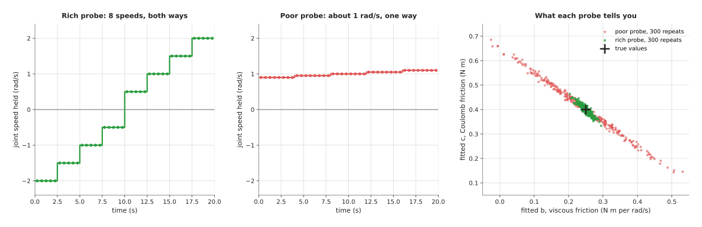
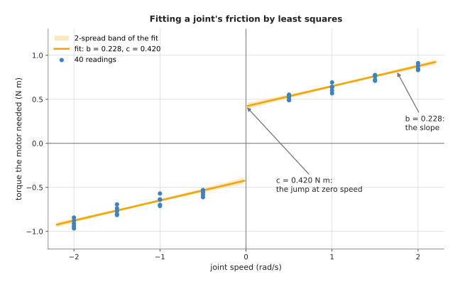
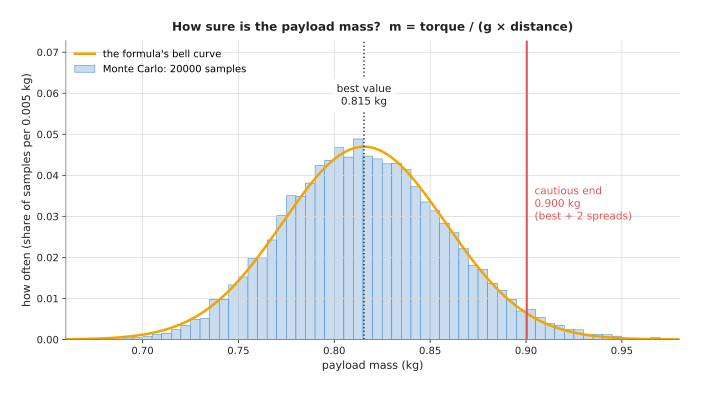
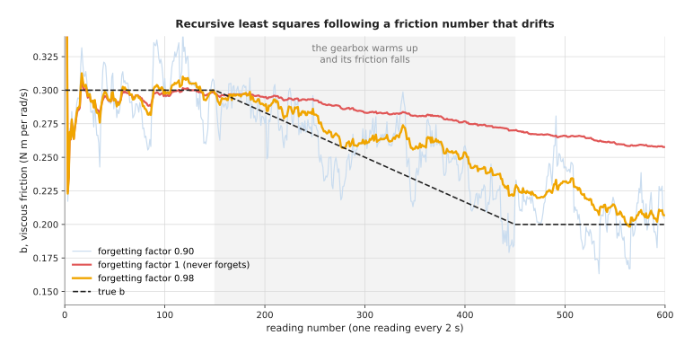

# System identification: measuring the numbers a model needs

This page explains system identification: finding the numbers inside a physical
model of the arm from measurements of the arm itself. Examples are a joint's
friction, the mass of the part in the gripper, and the stiffness of a springy
finger, and the page answers five questions about numbers like these. How do you
move the arm so that the data can tell the numbers apart? How do you fit them?
How do you follow a number that
drifts over time? How sure can you be of each number? And which end of that
range should the arm act on?

It is for a reader who has read the page on
[least-squares fitting](../02_most-used/01_least-squares-fitting.md), because
that page explains parameters, residuals and the least-squares solve, and this
page uses all three. The part on drifting numbers also uses one idea from the
[Kalman filter](../02_most-used/03_kalman-filter.md) page. Every number on this
page comes from a real run of the diagram script,
`docs/diagrams/fitting_and_estimation_2.py`.

## Contents

1. [What this page answers](#1-what-this-page-answers)
2. [The idea in one sentence](#2-the-idea-in-one-sentence)
3. [How it works, step by step](#3-how-it-works-step-by-step)
   · [Write the model so the numbers sit on their own](#write-the-model-so-the-numbers-sit-on-their-own)
   · [Design the probe move](#design-the-probe-move)
   · [Fit by least squares](#fit-by-least-squares)
   · [How sure you are: error bars](#how-sure-you-are-error-bars)
   · [Carrying error bars through a formula, and a Monte Carlo check](#carrying-error-bars-through-a-formula-and-a-monte-carlo-check)
   · [Act on the cautious end](#act-on-the-cautious-end)
   · [Numbers that drift: recursive least squares with forgetting](#numbers-that-drift-recursive-least-squares-with-forgetting)
   · [The steps as pseudocode](#the-steps-as-pseudocode)
4. [Where it is used on a robot arm](#4-where-it-is-used-on-a-robot-arm)
5. [Where it is useful, and where it is not](#5-where-it-is-useful-and-where-it-is-not)
6. [Libraries that provide it](#6-libraries-that-provide-it)
7. [Why system identification, and what it costs](#7-why-system-identification-and-what-it-costs)
8. [The learned alternative](#8-the-learned-alternative)
9. [Where to read next](#9-where-to-read-next)
10. [Using it in Python](#10-using-it-in-python)

---

## 1. What this page answers

Each of those five questions matters because a controller, a planner or a
simulator uses a model of the arm. A **model** here means a set of equations,
such as "the torque a joint needs is its friction plus the weight it lifts".
Those equations have numbers in them: a friction value, a mass, a distance, a
stiffness. The equations themselves come from physics and are usually right, but
the numbers in them are usually not known well.

A datasheet gives a typical value, not the value for your arm, because friction
changes from one gearbox to the next and falls as the gearbox warms up. The mass
of the part in the gripper changes with every pick, and a rubber finger pad gets
softer with wear.

So system identification measures these numbers on the real arm rather than
trusting the datasheet. You move the arm in a planned way, record what happens,
and fit the numbers so that the model's equations match the recording. The
result is a model that describes your arm today, plus an error bar that says how
far each number might be off.

---

## 2. The idea in one sentence

**Move the arm so that each unknown number has a visible effect, record the
result, fit the numbers by least squares, and state how sure you are of each
one.**

That one sentence covers the whole method, and an everyday example shows why
each part of it is needed. You want to know how much a suitcase weighs and how
much the wheels drag, but you have only a luggage scale that measures how hard
you pull. If you pull it at one steady walking speed, you learn only the total
pull. This means you cannot say how much of it is drag that grows with speed,
and how much is a fixed amount of rubbing. That is why you pull it slowly, then
quickly, then slowly the other way, and now the two effects show up differently.
Because they show up differently you can separate them: choosing those different
speeds is the probe move, and working out the two numbers from the pulls is the
fit.

---

## 3. How it works, step by step

Since the probe and the fit are easier to follow on a real example, the worked
example uses one joint of a small arm. That joint needs torque to overcome
friction, where torque is the turning force a motor gives, measured in
newton-metres (N m). Most arm motors report their torque, or a current that is
proportional to it.

### Write the model so the numbers sit on their own

A common model of joint friction has two parts, and each part has its own
number.

- **Viscous friction** grows in step with speed, like stirring honey. Its
  number is `b`, in newton-metres per radian per second.
- **Coulomb friction** is a fixed amount of rubbing that always opposes the
  motion, whatever the speed. Its number is `c`, in newton-metres. It is named
  after Charles-Augustin de Coulomb, who studied rubbing surfaces.

Written out, the torque at a steady speed `w` (in radians per second) is:

```
torque = b × w + c × sign(w)
```

Here `sign(w)` is +1 when the joint turns one way and −1 when it turns the
other way.

The important point is that the unknowns `b` and `c` are each multiplied by
something you know. So each reading gives one row of a **linear** equation: a
known row `[w, sign(w)]` times the unknown pair `[b, c]` gives the measured
torque. Least squares solves exactly this kind of equation, and many physical
models can be written this way, even when the physics is bent. For example, a
payload's weight enters an arm's torque as the mass times a known function of
the joint angles. The page on
[arm dynamics](../../07_control-and-motion/02_most-used/03_arm-dynamics.md)
shows the full equations for a whole arm, where the rows that multiply the
unknowns are often called the **regressor**.

### Design the probe move

Once the model is written that way, the next choice is the probe move, which is
the motion you run to collect the data. People call the quality of a probe move
its **excitation**: how strongly it makes each unknown number show up in the
data.

The simulated joint has true values `b = 0.25` and `c = 0.40`, and its torque
readings scatter by 0.05 N m, which is the sensor noise. The picture below
compares two probe moves of 40 readings each.



The rich probe (left) holds eight speeds, from −2 to +2 rad/s, five readings at
each. The poor probe (middle), however, holds speeds between 0.9 and 1.1 rad/s,
all in one direction. On the right, each probe was repeated 300 times with fresh
noise, and each repeat gave one fitted pair `(b, c)`.

The rich probe's answers sit in a small cloud around the true values, and its
fitted `b` ranged from 0.204 to 0.294 over the 300 repeats. However, the poor
probe's answers lie along a long thin line. Its fitted `b` ranged from −0.025 to
0.589, and one answer even had negative friction, which is not possible.

The reason is simple, because at a speed of about 1 rad/s the torque is about `b +
c`. As a result, the poor probe measures that sum very well, but it cannot
tell how the sum splits between `b` and `c`. Every point along the line gives
nearly the same sum. The rich probe, however, includes slow and fast speeds, so
a change in `b` and a change in `c` change the torques in different ways.

A number called the **condition number** measures this, and it compares how well
the best-measured and the worst-measured combination of the unknowns are pinned
down. A value near 1 is ideal, so the rich probe's rows, with a condition number
of 4.9, are much better than the poor probe's 28.3. If the poor probe held
exactly one speed, the condition number would be infinite and the fit would have
no single answer.

So the rules for a good probe follow from all of this.

- Make each unknown change the readings in its own way. For friction, use slow
  and fast speeds, in both directions.
- Cover the range the arm will use. A number fitted from slow moves may be wrong
  for fast ones.
- Keep the probe safe: stay inside the joint limits, the speed limits and the
  workspace, and start gently.
- Check the condition number of the rows before running the probe on the arm.
  It needs only the planned speeds, not the readings.

### Fit by least squares

Once the probe has been run, the rows and the readings are in hand, so the fit
is one least-squares solve, as the
[least-squares page](../02_most-used/01_least-squares-fitting.md) explains.
One real run of the rich probe gave readings such as −0.940 N m at −2 rad/s,
0.489 N m at 0.5 rad/s and 0.880 N m at 2 rad/s. The fit gave:

- `b = 0.2285` N m per rad/s (true value 0.25)
- `c = 0.4205` N m (true value 0.40)

The residuals, the gaps between each reading and the fitted curve, have a spread
of 0.043 N m, which is close to the sensor's true noise of 0.05 N m. That is a
sign that the model has the right shape, because nothing is left over except
noise.

The picture below shows the 40 readings and the fitted curve.



The slope of each half of the curve is `b`, and the jump where the speed crosses
zero is `2 × c`, because the rubbing changes direction. The pale band around the
curve shows two spreads of the fit's uncertainty, and the next part explains
where that band comes from.

### How sure you are: error bars

That band comes from an error bar on each fitted number. An **error bar** is the
spread of a fitted number: how far it would move if you ran the same probe again
with fresh noise. That is why it comes almost free with a least-squares fit, in
three steps.

1. Estimate the sensor's noise from the residuals. Square them, add them up, and
   divide by the number of readings minus the number of unknowns. Here that is
   40 − 2 = 38. The square root is the 0.043 N m above.
2. Multiply that squared noise by the inverse of `AᵀA`, where `A` is the table
   of rows. The result is the **covariance** of the fitted numbers: a small table
   that gives each number's squared spread and how the numbers' errors are
   linked.
3. The square root of each number on the diagonal of the covariance is that
   number's error bar.

For the run above this gives `b = 0.229 ± 0.012` and `c = 0.421 ± 0.017`, and
both true values lie within two error bars of the fit. That is what an error bar
of one spread should do most of the time.

You can check the formula against the repeats in the probe picture. There, the
300 fitted values of `b` had a spread of 0.0148, and the formula predicts
0.0141. For the poor probe the repeats gave 0.1100 and the formula 0.1118. So the
formula is trustworthy, and it also tells you in advance that the poor probe is
eight times less sure.

The covariance also shows a link between the two numbers, because the errors of
`b` and `c` have a correlation of −0.91. In other words, when `b` comes out too
high, `c` usually comes out too low, and this matters when you use both numbers
together. For example, the torque the joint needs at 1.5 rad/s is
`1.5 × b + c` = 0.763 N m. Its error bar, worked out with the link, is only
0.0075 N m. However, if you ignore the link and treat the two errors as
separate, you get 0.025 N m, more than three times too cautious. This is because
the fit knows the total torque at the speeds it measured far better than it
knows either number alone.

### Carrying error bars through a formula, and a Monte Carlo check

However, the number you need is often not the fitted number itself, but
something worked out from it. Carrying an error bar through a formula is called
**error propagation**.

For example, the arm holds a part still with its forearm level, and the elbow
motor reports an extra torque of 1.20 N m, with a spread of 0.04 N m. The part's
centre sits 0.150 m from the elbow axis, with a spread of 0.006 m, because the
grasp is never in exactly the same place. The part's mass is:

```
mass = torque / (g × distance) = 1.20 / (9.81 × 0.150) = 0.815 kg
```

For a formula made only of multiplying and dividing, there is a simple rule: the
**relative** spreads (spread divided by value) add in squares.

```
torque:   0.04 / 1.20  = 0.033
distance: 0.006 / 0.150 = 0.040
mass:     square root of (0.033² + 0.040²) = 0.052
```

As a result, the mass is 0.815 kg with a spread of 5.2%, which is 0.043 kg.
Notice that the distance, not the torque, is the larger source of doubt, so to
improve the answer you should measure the grasp position better rather than the
torque.

The rule is exact only for a straight-line formula, and a division is not
straight. A **Monte Carlo check** therefore tests it by brute force. You draw
many random torques and distances, each from its own bell curve, work out the
mass for every pair, and look at the spread of the results. The name comes from
the casino in Monaco, because the method runs on random numbers.



The picture above shows 20 000 such samples, which have an average of 0.817 kg
and a spread of 0.0427 kg, against 0.815 kg and 0.0425 kg from the rule. The
bell curve from the rule sits on top of the histogram, so the rule is good
enough here. If the two had disagreed, for example because a spread was large
compared with its value, you would trust the Monte Carlo result.

### Act on the cautious end

Whether the error bar comes from the formula or from Monte Carlo, a fitted
number with an error bar is a range, not a point. The arm still has to make one
decision, so the safe habit is to act on the end of the range that fails gently
if you are wrong. That end of the range is called the **cautious end**.

For the payload, a heavier part is the dangerous case, because it needs more
torque to stop, takes longer to brake and puts more load on the gripper. So the
planner should use the upper end, which with two spreads is
0.815 + 2 × 0.043 = 0.900 kg. In the Monte Carlo run, only 3.1% of the samples
lay above 0.900 kg.

Which end is cautious depends on the decision, not on the number.

- **Payload mass for a speed limit or a lift check:** use the upper end.
- **Friction for feed-forward.** Feed-forward means adding the torque the
  model says friction will take, so the controller does not have to wait for an
  error to build up. Too much added torque makes the joint push itself when it
  should stop, or shake around the target. So use the lower end of `c`.
- **Stiffness of a springy finger, to limit squeezing force:** the force is the
  stiffness times the squeeze distance. To stay under a force limit, work out
  the distance from the upper end of the stiffness.

When the cautious end is too costly, for example when the upper-end payload is
over the arm's limit but the best value is not, the answer is to measure better.
That is why you should run a longer probe or measure the grasp position, rather
than hoping.

### Numbers that drift: recursive least squares with forgetting

The cautious end handles a number you have measured once, but some numbers
change while the arm works. For example, a gearbox's friction falls as it warms
up over the first twenty minutes. Running the probe again and again stops the
arm's real work. Instead, the arm can refine the numbers from its normal moves,
one reading at a time.

**Recursive least squares (RLS)** does this, because it keeps the current fitted
numbers and a covariance table `P`, like a Kalman filter. Each new reading
nudges the numbers towards it, by an amount that depends on `P`. With no
forgetting, the answer after all the readings is the same as a batch
least-squares fit over all of them. The
[Kalman filter](../02_most-used/03_kalman-filter.md) page explains the same
predict-and-correct idea; RLS is that filter for numbers that are meant to
stay constant.

However, a number that stays constant is the wrong assumption for friction that
drifts, because plain RLS weighs a reading from twenty minutes ago as much as
the latest one. A **forgetting factor**, written `λ` (the Greek letter lambda),
fixes this, and it is a number just below 1. At each step, all older readings
count `λ` times as much as before, so the filter then remembers roughly the last
`1 / (1 − λ)` readings. For example, a factor of 0.98 remembers about 50
readings.

The picture below runs RLS on 600 readings, one every 2 seconds, taken during
normal moves at speeds between 0.3 and 2 rad/s in both directions. The true `b`
is 0.30 for the first 150 readings, falls steadily to 0.20 by reading 450, and
then stays there.



Three settings behave very differently.

- **Factor 1, never forgets (red).** It is smooth, but it trails far behind. At
  reading 600 it says 0.258, while the true value is 0.200. Over the last 150
  readings it is 0.063 too high on average.
- **Factor 0.98 (orange).** It follows the fall with a short lag. At reading 600
  it says 0.207. Over the last 150 readings it is 0.017 too high on average, with
  a shake of 0.010.
- **Factor 0.90 (pale blue).** It remembers only about 10 readings. It follows
  fastest, but it shakes: a spread of 0.022 over the last 150 readings, more than
  twice that of 0.98.

This is the same trade as the process noise `q` in a Kalman filter, because
forgetting fast follows changes but passes on more noise. So choose `λ` from how
quickly the real number can change compared with how often readings arrive.

### The steps as pseudocode

The steps above fit into a few short functions. The first is the batch fit with
error bars, and the second is one step of recursive least squares. Here `row` is
the known row for one reading, such as `[w, sign(w)]`, and `·` is a dot product
or matrix product.

```
function fit_with_error_bars(rows A, readings y):
    numbers   = solve (transpose(A) · A) · numbers = transpose(A) · y
    residuals = y − A · numbers
    noise²    = sum(residuals²) / (count(y) − count(numbers))
    covariance = noise² · inverse(transpose(A) · A)
    error_bars = square root of each diagonal entry of covariance
    return numbers, covariance, error_bars

function rls_step(numbers, P, row, reading, lam):
    predicted = row · numbers
    gain      = P · row / (lam + row · P · row)
    numbers   = numbers + gain × (reading − predicted)
    P         = (P − gain · transpose(row) · P) / lam
    return numbers, P

function monte_carlo_spread(formula, inputs with spreads, count):
    results = empty list
    repeat count times:
        draw each input from its own bell curve
        add formula(drawn inputs) to results
    return average(results), spread(results)
```

Start RLS with `numbers` at a rough guess and `P` large, such as 100 times the
identity table, which says "I know almost nothing yet".

---

## 4. Where it is used on a robot arm

Once the steps are clear, it is easier to see that system identification appears
wherever a model's numbers decide how the arm moves or what it believes.

- **Joint friction for feed-forward.** Friction numbers let a
  [PID controller](../../07_control-and-motion/02_most-used/01_pid-control.md)
  add the torque friction will take, so a slow move does not stick and then jump.
- **Payload identification after a grasp.** The arm holds the part still in two
  or three poses and fits its mass and the position of its centre from the joint
  torques. A mass that is far from the expected one means the wrong part, or two
  parts, or a slipping grasp.
- **The full arm's masses for a model-based controller.** Each link's mass,
  centre and inertia enter the equations of
  [arm dynamics](../../07_control-and-motion/02_most-used/03_arm-dynamics.md)
  linearly, so a rich probe that moves all joints together can fit them all at
  once.
- **Collision detection.** A monitor compares the torque the model expects with
  the torque the motors report, and stops the arm when the gap is too large. A
  poorly identified model needs a wide margin, which makes the monitor slow to
  notice a real collision. The page on
  [safety monitoring](../../07_control-and-motion/02_most-used/04_safety-monitoring.md)
  covers the monitor.
- **Stiffness of a springy finger or a force-controlled contact.** Pressing a
  finger or a tool on a known surface at a few depths and fitting force against
  depth gives the stiffness that
  [impedance and force control](../../07_control-and-motion/03_also-used/01_impedance-and-force-control.md)
  needs.
- **Contact and friction with the table.** A robot that pushes objects can fit
  the table's friction from push after push. The sibling repo's
  [contact-parameters page](https://github.com/RobinNagpal/robot-arm-projects/blob/main/v5-pick-glasses/docs/problem-3/solutions/09-identify-the-contact-parameters.md)
  does this, and moves on to recursive least squares.
- **Making a simulator match the real arm.** Fitting a simulator's masses,
  friction and motor delays to recordings from the real arm narrows the gap
  between simulation and reality. Book 3's page on
  [simulation and evaluation](../../../03_frameworks/08_frontier/04_simulation-and-evaluation.md)
  describes MuJoCo's system identification toolbox for this.
- **Camera placement.** Finding where a camera sits on the arm is also
  identification: a geometric model with unknown numbers, fitted from a probe of
  many arm poses. The [calibration](../../02_geometry-and-cameras/02_most-used/03_calibration.md)
  page covers it, and the same rule applies: vary the poses so every unknown
  shows up.

---

## 5. Where it is useful, and where it is not

In all of those places, system identification works best when the physics is
known and only the numbers are not, when the numbers can be written so they
multiply known quantities, and when the arm can be moved safely through a probe.

However, the table below lists the ways it goes wrong, and each row gives the
cause, the sign you would see, and what people use instead.

| What goes wrong | The sign you would see | What to use instead |
| --- | --- | --- |
| The probe does not excite every number | huge error bars; numbers that change a lot between runs; impossible values such as negative friction | a richer probe; check the condition number before running it |
| The model is missing an effect (sticking at very low speed, gear play, a cable that pulls) | the residuals show a pattern, not random scatter; their spread is larger than the sensor's noise | add the missing term; or fit only the speed range the model describes; or add a learned correction |
| Speed and torque readings are out of step in time | the fit changes when the probe changes speed quickly; hysteresis loops in a torque-speed plot | line the readings up in time first; see [sensor streams](../02_most-used/04_sensor-streams.md) |
| Forgetting while the arm stands still | the covariance `P` grows every step; the numbers jump on the first move after a pause | update only while the arm moves enough; put a ceiling on `P` |
| Forgetting factor too small | the numbers shake from reading to reading | raise `λ`; or run a slower filter on the numbers |
| Rare large readings (a bump, a missed sample) | one reading moves the fit a long way | throw away readings with a large residual, as [RANSAC](../02_most-used/02_ransac.md) does for points |
| The number depends on something you did not vary (temperature, load, pose) | a model that fits the probe well and the real task badly | probe under the task's conditions; or track the number with RLS |
| Physics too complex to write down (cloth, a soft object, a tangled cable) | no small set of numbers fits | a learned model; see [learned arm models](../../../07_learned-models/09_touch-and-body-models/03_also-used/02_learned-arm-models.md) |

---

## 6. Libraries that provide it

Since those failures are easier to avoid with tested code, it helps that for a
model written as rows times unknowns the fit is one call to a least-squares
routine. The libraries below cover the fit, the full-arm rows, the error bars
and the drift. Each row gives the library, the languages it is used from, the
function, class or feature, and a note.

| Library | Languages | Function, class or feature | Note |
| --- | --- | --- | --- |
| NumPy | Python | `numpy.linalg.lstsq`, `numpy.linalg.inv`, `numpy.linalg.cond` | the fit, the covariance and the condition number, as in this page's script |
| SciPy | Python | `scipy.optimize.curve_fit`, `scipy.optimize.least_squares` | `curve_fit` returns the covariance with the fit; both handle models that are not rows times unknowns |
| Pinocchio | C++, Python | `computeJointTorqueRegressor` | builds the rows for a whole arm's masses and inertias from its description file |
| MuJoCo | Python | system identification toolbox (from version 3.5.0) | fits a simulator's parameters to recorded trajectories; see Book 3's [simulation page](../../../03_frameworks/08_frontier/04_simulation-and-evaluation.md) |
| MATLAB System Identification Toolbox | MATLAB | a whole toolbox | a long-standing commercial tool, strong on probe design and model checking |
| uncertainties | Python | `ufloat` | carries error bars through a formula automatically, using the straight-line rule |
| padasip | Python | `FilterRLS` | recursive least squares with a forgetting factor |

Recursive least squares itself is about ten lines, and many projects write it
themselves, as in the pseudocode above.

---

## 7. Why system identification, and what it costs

So system identification measures the numbers in a physical model of the arm by
running a planned probe, fitting the numbers by least squares, and stating an
error bar for each. It gives the arm a model that matches this arm today, and a
range that says how far to trust it.

The obvious alternative is to **use the datasheet or the design files**, which
costs nothing and needs no arm time. However, a datasheet gives a typical value,
and friction in particular varies from unit to unit and with temperature by tens
of percent. A payload's mass and grasp position are not in any datasheet at all,
and a datasheet value comes with no error bar, so the arm cannot tell whether it
is safe to act on.

A second alternative, used for simulators, is **domain randomisation**: training
across many random guesses of the numbers so that the real arm falls somewhere
inside. It avoids measuring, but wide random ranges make the result more
cautious than it needs to be. As a result, identifying the numbers first lets you
randomise only over the real error bars.

The costs are these: you need a model with the right terms, and the fit cannot
find an effect the model leaves out. The probe takes time on the real arm, and
it must be designed to be safe as well as rich. The numbers go stale as the arm
wears, warms or picks up a new tool, so you must re-run the probe or track the
numbers with RLS. And a tracker with forgetting must be guarded, because it can
drift or jump when the arm stands still.

---

## 8. The learned alternative

Those costs point to an alternative, because Book 7's
[learned arm models](../../../07_learned-models/09_touch-and-body-models/03_also-used/02_learned-arm-models.md)
covers networks that learn how the arm's body behaves from its own recordings. A
network can learn the whole model and capture effects no textbook equation has.
However, it needs far more data, its internal numbers have no physical meaning
you can check, and it can behave oddly in movements it has not seen. The usual choice is
**residual learning**: keep the identified physics model and train a small network
only on what it gets wrong, such as friction that changes with speed and
temperature, or a cable that pulls differently in each pose. Book 6 calls system
identification the right first step, and often enough on its own, so add the
learned correction only when the residuals still show a pattern after the missing
terms are in the model. When the leftover error depends on only a few numbers,
such as a joint's speed and temperature, Book 7's
[Gaussian processes](../../../07_learned-models/02_classical-machine-learning/02_most-used/03_gaussian-processes-and-bayesian-optimisation.md)
learn that correction from tens to hundreds of samples and say how sure they are,
and [linear regression](../../../07_learned-models/02_classical-machine-learning/02_most-used/01_linear-and-logistic-regression.md)
fits it with the same least squares this page uses.
[Learned dynamics models](../../../07_learned-models/08_world-models/02_most-used/01_learned-dynamics-models.md#5-learning-only-the-part-physics-gets-wrong-residual-models)
uses the same idea for objects the arm pushes.

---

## 9. Where to read next

The pages below cover the pieces this page depends on, and the places where its
results are used.

- [Least-squares fitting](../02_most-used/01_least-squares-fitting.md) explains
  the solve that every fit on this page uses.
- The [Kalman filter](../02_most-used/03_kalman-filter.md) is the same
  predict-and-correct loop as recursive least squares, for quantities that move.
- [Sensor streams](../02_most-used/04_sensor-streams.md) covers lining readings
  up in time and filtering them, which a fit needs before it starts.
- [Arm dynamics](../../07_control-and-motion/02_most-used/03_arm-dynamics.md)
  gives the full equations whose masses and friction this page measures.
- [Impedance and force control](../../07_control-and-motion/03_also-used/01_impedance-and-force-control.md)
  uses identified stiffness and payload values.
- [Uncertainty and confidence](../../../07_learned-models/10_making-models-work-on-an-arm/03_also-used/01_uncertainty-and-confidence.md)
  in Book 6 covers error bars for learned models.
- The [chapter overview](../01_overview.md) shows how this page fits with the
  others in the chapter.

---

## 10. Using it in Python

Section 3 said that once the model is written as rows times unknowns, the fit is
one call to a least-squares routine, and that the error bars come from the same
call. Section 6 named the libraries. This section is that call, on a single
joint, with the error bars worked out beside it. After it you will be able to
measure a joint's inertia and friction from a recorded probe move, and to say
how sure the answer is.

The program below fits the three numbers of a single joint from a recorded
trace. The model is the one from section 3: the torque the motor applied is the
joint's inertia times its acceleration, plus a viscous friction that grows with
speed, plus a Coulomb friction that only depends on which way the joint is
turning. NumPy does the fit, and the three lines after it turn the leftover
error into error bars.

```python
import numpy as np

log = np.loadtxt("probe_move.txt")            # columns: time, speed, torque
speed, torque = log[:, 1], log[:, 2]
accel = np.gradient(speed, 0.002)             # the log is 500 readings a second

# One row per reading: one column for each unknown.
rows = np.column_stack([accel, speed, np.sign(speed)])
theta, residuals, rank, singular = np.linalg.lstsq(rows, torque, rcond=None)
inertia, viscous, coulomb = theta

n, p = rows.shape
variance = residuals[0] / (n - p)             # the leftover error per reading
covariance = variance * np.linalg.inv(rows.T @ rows)
error_bars = 2.0 * np.sqrt(np.diag(covariance))   # about 95 per cent confidence
print(np.linalg.cond(rows))                   # how well the probe move separated them
```

On a made-up four-second probe move with a true inertia of 0.045, a viscous
friction of 0.30 and a Coulomb friction of 0.12, with 0.02 N m of measurement
noise, the fit returns 0.0451 ± 0.0001, 0.2994 ± 0.0014 and 0.1204 ± 0.0016. The
condition number is 18.6, which is small, and that is what tells you the probe
move really did separate the three effects rather than confusing them.

NumPy does the solve, the matrix inverse and the condition number, and that is
the whole of what a library contributes here. `lstsq` returns the parameters and
the sum of the squared misses, and `cond` returns the ratio between the largest
and smallest singular value of the rows. There is no system identification
function being called: the fit is the same `lstsq` as the
[least-squares fitting](../02_most-used/01_least-squares-fitting.md) page, and
the identification is entirely in how you built `rows`.

What you have to write is that matrix of rows, and writing it is the same act as
choosing the model. The three columns above say that you believe the joint's
torque is inertia plus viscous friction plus Coulomb friction, and nothing else.
If the joint also has a gravity term because the link is not vertical, that is a
fourth column, and if it has stiction that behaves differently below a threshold
speed then no set of columns describes it and the fit will quietly absorb the
error. For a whole arm rather than one joint, Pinocchio's
`computeJointTorqueRegressor(model, data, q, v, a)` builds the rows for you from
the arm's description file, and on a six-joint arm it returns a matrix with six
rows and sixty columns, ten per body. You still have to choose which of those
sixty columns your probe move actually excited, because the rest are not
measurable and will make the solve fragile.

What you have to decide or measure is the probe move and what you do with the
error bars. The probe move is yours to design, and section 3 explains why it has
to change speed and acceleration independently: if you only ever accelerate
while speeding up, then inertia and viscous friction rise together and no fit
can tell them apart. The condition number is how you check the design, and a
value in the tens is comfortable while a value in the thousands means the move
needs changing rather than the fit. You also decide the sample rate that goes
into `np.gradient`, and you have to smooth the speed before differentiating it,
because differentiating a noisy signal amplifies the noise, which is the problem
the [sensor streams](../02_most-used/04_sensor-streams.md) page solves. Finally
you decide which end of the error bar to act on, and section 3 is firm about
this: for a payload or a torque limit, use the cautious end rather than the
middle.
