# Sampling-based planning

This page explains sampling-based planning, which means finding a route for the
arm by trying random joint angles, keeping the ones that hit nothing, and
joining them up. It covers the three methods you will meet most, which are the
rapidly-exploring random tree (RRT), RRT-Connect and the probabilistic roadmap
(PRM). It also explains the two ideas those three rest on, which are the
configuration space and collision checking. Two further sections then open up
the collision checker, and show how to plan when a rule, such as "keep the cup
upright", must hold all along the path.

It is for a reader who has already read the [chapter overview](../01_overview.md)
and [graph search](../03_also-used/01_graph-search.md). This is because the page
uses graph search's words, such as node, edge and path, without explaining them
again.

Sampling-based planning is what most arm software uses to find a route. So
MoveIt 2 calls the Open Motion Planning Library (OMPL), and when no other planner
is set it uses RRT-Connect. Book 3's
[planning a path](../../../03_frameworks/03_arm-movement/03_planning-a-path.md#2-sampling-based-planners)
covers that in practice, whereas this page explains how the methods work inside.
Every number and picture on this page comes from a real run of the planners in
[`planning_and_search_1.py`](../../../diagrams/planning_and_search_1.py) on the
book's two-joint arm, and sections 4 and 6 come from
[`planning_and_search_4.py`](../../../diagrams/planning_and_search_4.py).

## Contents

1. [The idea in one sentence](#1-the-idea-in-one-sentence)
2. [Configuration space, drawn for a real arm](#2-configuration-space-drawn-for-a-real-arm)
3. [Collision checking: the only question a sampler asks](#3-collision-checking-the-only-question-a-sampler-asks)
4. [How a collision checker answers](#4-how-a-collision-checker-answers)
   · [Wrap each shape in something simple](#wrap-each-shape-in-something-simple)
   · [A tree of boxes for a detailed shape](#a-tree-of-boxes-for-a-detailed-shape)
   · [How far apart: GJK in plain words](#how-far-apart-gjk-in-plain-words)
   · [Checking a whole motion, not just its ends](#checking-a-whole-motion-not-just-its-ends)
   · [Where it goes wrong, and the libraries](#where-it-goes-wrong-and-the-libraries)
5. [How it works](#5-how-it-works)
   · [RRT: grow a tree from the start](#rrt-grow-a-tree-from-the-start)
   · [A worked example: the first three tries](#a-worked-example-the-first-three-tries)
   · [RRT-Connect: grow two trees and join them](#rrt-connect-grow-two-trees-and-join-them)
   · [PRM: build a map once, then ask it many times](#prm-build-a-map-once-then-ask-it-many-times)
   · [The pseudocode](#the-pseudocode)
   · [Random means different every run](#random-means-different-every-run)
   · [Cleaning up the path](#cleaning-up-the-path)
6. [Planning with rules on the way: constrained planning](#6-planning-with-rules-on-the-way-constrained-planning)
   · [The cup example](#the-cup-example)
   · [Why random samples cannot follow the rule](#why-random-samples-cannot-follow-the-rule)
   · [Projection: pull each sample onto the rule](#projection-pull-each-sample-onto-the-rule)
   · [Where it is used, where it fails, and the libraries](#where-it-is-used-where-it-fails-and-the-libraries)
7. [Where it is used on a robot arm](#7-where-it-is-used-on-a-robot-arm)
8. [Where it is useful, and where it is not](#8-where-it-is-useful-and-where-it-is-not)
9. [Libraries that provide it](#9-libraries-that-provide-it)
10. [Why sampling, and what it costs](#10-why-sampling-and-what-it-costs)
11. [The learned alternative](#11-the-learned-alternative)
12. [Where to read next](#12-where-to-read-next)
13. [Using it in Python](#13-using-it-in-python)

---

## 1. The idea in one sentence

A sampling-based planner picks random sets of joint angles, throws away the ones
where the arm would hit something, and joins the rest into a tree or a network
until one of its routes links the start to the goal.

Here is an everyday example of that idea: you are in a dark, cluttered garage with
a torch that only lights a small spot, and you want to reach the door on the far
side. Because you cannot see the whole garage, you point the torch at a random
spot, and if it shows clear floor you step a little way towards it. Then you pick
another random spot and step towards it from whichever point on your trail is
closest. So your trail spreads out across the clear floor, until sooner or later
a step lands next to the door. So a sampling planner does the same thing, with
joint angles in place of floor and a collision checker in place of the torch.

---

## 2. Configuration space, drawn for a real arm

The random spots in section 1 were places on a floor, but a planner does not
search the room at all. Instead it searches the space of joint angles, which is
called the **configuration space**. One set of joint angles is one point
in that space, and such a point is called a **configuration**. The
[overview](../01_overview.md#2-where-the-search-happens-the-space-of-joint-angles)
introduced this idea, so here it is drawn for a real arm.

The arm is the book's two-joint arm from
[Book 1](../../../01_robotics-intro/02_maths/01_angles-and-trigonometry.md#1-the-arm-used-in-this-doc),
whose link 1 is 3 m long and whose link 2 is 2 m long. Joint 1, the shoulder, can
turn from −180° to 180°, and joint 2, the elbow, can turn from −160° to 160°.
Three objects stand on the table, a box, a post and a jar. All three of them are
more than 3 m from the base, so only link 2 and the gripper can touch them.

The start is (10°, 20°), which puts the gripper at (4.686, 1.521) m, and the goal
is (130°, 20°), which puts it at (−3.660, 3.298) m.

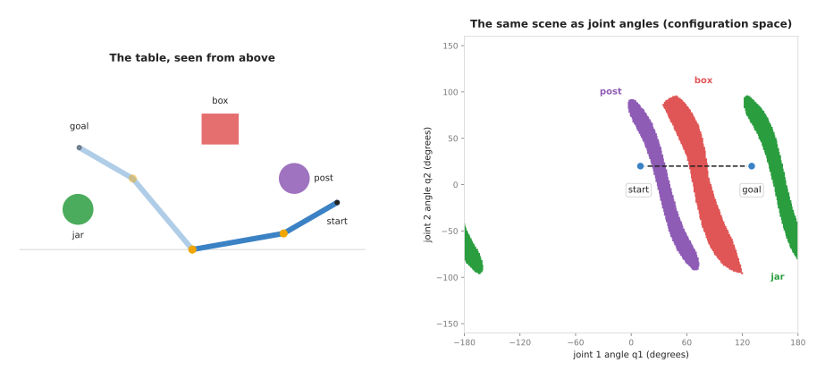

The left panel is the table, and the right panel is the configuration space. Its
horizontal axis is joint 1's angle, and its vertical axis is joint 2's angle. Each
coloured band is then the set of configurations where the arm touches the object
of the same colour.

The script made that right panel by checking every configuration at 1° steps,
which comes to 361 × 321 = 115,881 checks. The bands cover 9.2% of the space, made
up of 3.8% for the box, 2.6% for the post and 2.8% for the jar.

Three things in the picture are worth noticing, because each one explains why a
planner has to work the way it does.

- A square box on the table becomes a curved band, and there is no simple formula
  for that band's shape. Book 3 makes the same point, which is that planners do
  not describe the free space, they probe it.
- The dashed straight line from start to goal crosses two bands, so turning both
  joints at a steady rate would hit the post between q1 = 23° and 38°, and then
  the box between q1 = 63° and 83°.
- The bands stop at about q2 = 95° and q2 = −95°, because with the elbow bent
  more than that, link 2 folds back towards the base and passes inside the
  objects. So a free route does exist, and it is to bend the elbow sharply, swing
  round, and straighten it again.

For a six-joint arm the configuration space has six axes, so nobody can draw it,
and checking every cell would take billions of checks. So a sampler checks only
a few thousand of them instead.

---

## 3. Collision checking: the only question a sampler asks

Section 2 drew the bands where the arm touches something, but a planner never sees
those bands, because it only ever asks about one configuration at a time. A
**collision checker** is the program that answers that question, since it takes
one configuration and replies "yes, the arm hits something" or "no, it is clear".
It does that by placing the arm's shapes where the joint angles put them, and then
testing those shapes against the shapes of the obstacles. In this script the test
is a simple one, because it takes points every 5 cm along each link and tests each
point against the box and two circles. Real checkers, such as the Flexible
Collision Library (FCL), test meshes and simple shapes for overlap instead, and
they are much faster than the planner around them, as
[section 4](#4-how-a-collision-checker-answers) explains.

A sampler asks the checker two kinds of question, and the second kind is where
most of the checking work goes.

1. Is this one configuration clear? This question is asked once for each random
   sample.
2. Is this whole straight move between two configurations clear? This question is
   asked for each new edge, and because the checker cannot test every point on a
   line, it tests points along the line at a fixed spacing.

The spacing in that second question is a real risk, because anything thinner than
the spacing can slip between two checks unseen. The picture below checks one move
of the arm, in which joint 1 turns from 0° to 60° with joint 2 held at 30°. For
that move, a rod 12 cm across stands on the gripper's path.

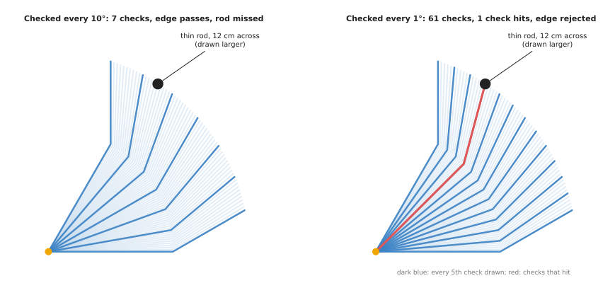

On the left the move is checked every 10°, which is 7 checks in all. Because the
gripper is 4.84 m from the base, it moves 0.84 m between one check and the next.
Because the rod sits between the 40° check and the 50° check, no check touches
it, the edge passes, and the arm would hit the rod. Instead, on the right, the
move is checked every 1°, which is 61 checks, and the one at 45° hits the rod,
so the edge is correctly rejected.

This is the problem Book 3 describes in [collisions are checked at sampled
points](../../../03_frameworks/03_arm-movement/03_planning-a-path.md#72-collisions-are-checked-at-sampled-points-not-continuously).
OMPL sets the spacing as a fraction of the size of the whole joint space. So on
an arm with wide joint limits the default comes to the order of ten degrees.
The planners on this page check every 1° instead, which is safe here but costs
time, because most of the checks counted below are edge checks. However, a
continuous check, described in [section
4](#checking-a-whole-motion-not-just-its-ends), removes the risk altogether.

---

## 4. How a collision checker answers

Section 3 treated the collision checker as a box that says yes or no, and this
section opens that box. A planner may ask it tens of thousands of questions for
one move. So the checker is built to answer most of them without ever doing the
hard sum. It works in three stages, which are a cheap test with simple wrappers, a
tree of wrappers for detailed shapes, and an exact test only where the cheap ones
cannot decide. It can also answer two harder questions, namely how far apart two
shapes are and whether a whole motion is clear, and the pictures come from
[`planning_and_search_4.py`](../../../diagrams/planning_and_search_4.py).

### Wrap each shape in something simple

The first of those three stages uses a **bounding volume**, which is a simple
shape that completely contains a detailed one. If two bounding volumes do not
touch, then the shapes inside them cannot touch either. Because testing two
simple shapes takes only a few comparisons, this rules out most pairs almost for
free.

Three kinds of bounding volume are common, and they trade how tightly they fit
against how much the test costs.

- An **axis-aligned bounding box** is a box whose sides run along the x, y and z
  axes, and two such boxes overlap only if their ranges overlap on every axis,
  which is six comparisons in 3D.
- An **oriented bounding box** is a box turned to fit the shape, so it fits much
  more tightly, although the test is a little more work.
- A set of **spheres**, where two spheres touch when the distance between their
  centres is less than the sum of their radii, which is why many arm planners
  describe each link as a row of spheres.

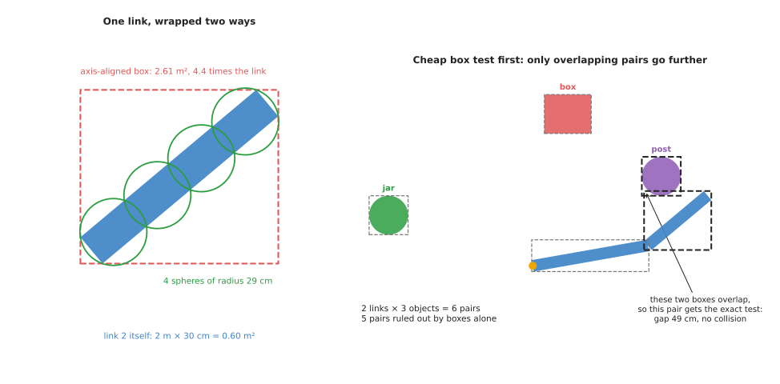

The left panel wraps link 2 of the book's arm, a bar 2 m long and 30 cm wide, in
the pose (10°, 30°). That link's own area is 0.60 m², but the axis-aligned box
around it is 2.61 m², which is 4.4 times bigger, because the link lies at a
slant. Four spheres
of radius 29 cm cover it more tightly, and an oriented box would fit it exactly,
because the link is itself a box.

The right panel shows this first stage on the whole scene, where there are 2
links and 3 objects and therefore 6 pairs to test. Because the boxes do not even
overlap in 5 of those pairs, those pairs are clear, and only link 2 and the post
have overlapping boxes. Then that one pair goes on to the exact test, which
finds a gap of 49 cm, so the pose is clear and only one exact test was needed.
So this first stage is called the **broad phase**, and the exact test that
follows it is the **narrow phase**.

### A tree of boxes for a detailed shape

The broad phase puts one wrapper around a whole object, but a real object is often
a **mesh**, which is a surface made of thousands of small flat triangles. Because
testing a fingertip against every triangle would be slow, the checker builds a
**bounding-volume tree** once, at the moment the object is loaded.

1. Put one box around the whole mesh, and that box is the top of the tree.
2. Split the triangles into two halves along the longest side of the box, and put
   a box around each half, so that those two boxes become its children.
3. Repeat for each half until each box holds only one or two triangles.

To test something against the mesh you start at the top, and if it misses a box
you can skip everything inside that box. If it touches a box instead, you look at
that box's two children, and only at the bottom of the tree does the checker test
real triangles.

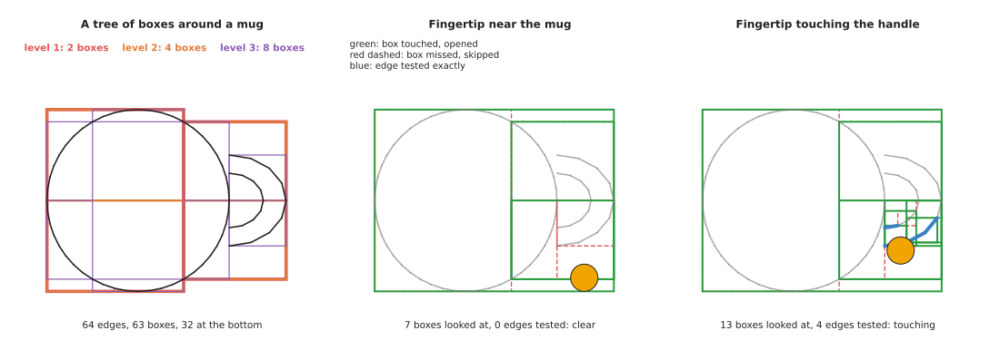

The picture uses a mug seen from above, drawn with 64 straight edges in place of
triangles. Its tree has 63 boxes in six levels, with 32 boxes at the bottom that
hold two edges each. A fingertip 1.2 cm across, held 1 cm from the mug, needed 7
box tests and no edge tests at all to prove it was clear. However, a fingertip
touching the handle needed 13 box tests and 4 edge tests to find the contact.
However, testing every edge would have taken 64 tests each time, and the saving
grows with the size of the mesh. For a mesh of a million triangles, for example,
the tree is only about 20 levels deep.

### How far apart: GJK in plain words

The two stages so far answer yes or no, but a planner often wants more than
that. A [trajectory optimiser](03_trajectory-optimisation.md) needs the
**distance** between the arm and each object, so that it can push the path away.
In the same way, a safety check wants to know how close the arm came. A
**convex** shape is a shape with no dents or holes, such as a box, a sphere or a
cylinder. For shapes like those, the standard method for the distance is
**GJK**, named after its inventors Gilbert, Johnson and Keerthi.

GJK rests on one idea, which is to take every point of shape A and subtract
every point of shape B. Then the result is a new shape, called the **difference
shape**. If A and B overlap, then some point of A equals some point of B, so the
difference shape contains the zero point, which is called the **origin**. If
they do not overlap, then the distance between A and B is exactly the distance
from the origin to the difference shape.

GJK never builds the whole difference shape, because it only asks each shape one
question, namely which of that shape's points is furthest in a given direction.
From the answers it keeps up to three corners of the difference shape. Then it
finds the point among them nearest the origin, and asks again in the direction of
the origin. It stops once a new answer gets no closer, and for shapes like these
it takes only a handful of rounds.

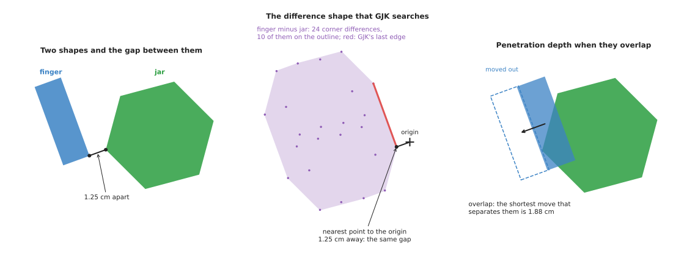

The left panel is a gripper finger, a bar 2 cm by 6 cm, next to a jar with six
flat sides, and the middle panel is their difference shape. The script built that
shape here only in order to draw it, from 24 differences between corners, of
which 10 lie on its outline. GJK found the nearest point to the origin in 2
rounds, at a distance of 1.251 cm. A brute-force check of every corner against
every edge gives the same 1.251 cm.

When the shapes overlap the distance is zero, so a different number becomes
useful. That number is the **penetration depth**, which is the shortest move that
would separate the shapes. It is the distance from the origin, now inside the
difference shape, to the nearest edge of that shape. A second method, the
**expanding polytope algorithm** (EPA), finds it by growing GJK's last triangle
outwards until it reaches that edge. In the right panel the finger overlaps the
jar, and the shortest separating move is 1.88 cm. Physics simulators use this
number to push objects apart, and some optimisers use it to push a path out of a
collision.

A shape with dents, such as a mug with a handle, is split into convex pieces
first. Then the tree of boxes finds the pieces that might touch, and GJK runs on
only those pieces.

### Checking a whole motion, not just its ends

Section 3 showed the weak point of checking a move at a fixed spacing, which is
that a thin rod fits between two checks. **Continuous collision checking** gets
round that by answering a different question: does the arm touch anything at any
moment during the move? One way to answer it is called **conservative
advancement**, and it uses the distance that GJK gives.

1. Measure the distance d from the arm to the nearest object.
2. Work out how far any point of the arm can travel for a small turn of the joints.
   Here only joint 1 turns, and no point of the arm is further than 4.84 m from the
   base, so a turn of θ radians moves no point more than 4.84 × θ metres.
3. Turn the joint by d ÷ 4.84 radians, because no point of the arm can have
   reached the object yet.
4. Repeat until the distance is almost zero, which is a contact, or the move ends,
   which proves it clear.

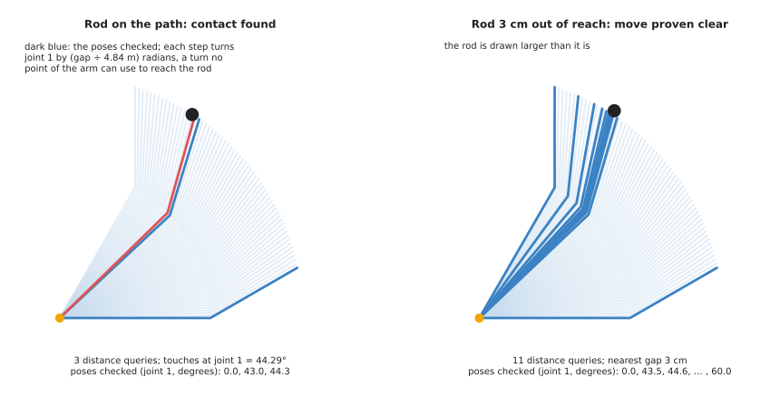

The left panel is the same move and the same 12 cm rod as in section 3. The first
query, at 0°, finds the arm 3.63 m from the rod, which allows a turn of 43.0° in
one step. The second query finds 10.8 cm, which allows 1.3° more. Then the third
finds contact at 44.29°, which is the same angle a fine search over the whole move
gives. So 3 queries found the contact that 7 fixed checks missed and that 61 fixed
checks caught. The right panel moves the rod 9 cm further out, so the gripper
passes it by 3 cm. The steps shrink as the arm nears the rod, down to 0.36°, then
grow again once it is past, and eleven queries prove the whole move clear. Unlike
fixed spacing, this cannot miss the rod, because every step is proved safe before
it is taken.

Other checkers sweep each link's shape along the move and test the swept shape, as
TrajOpt does. Either way, a continuous check costs more per edge than a single
point check, and it is worth that cost for thin objects and fast moves.

### Where it goes wrong, and the libraries

Because a planner believes whatever the checker tells it, the problems of a
collision checker are the ones the planner inherits.

- A mesh with holes or flipped triangles gives wrong answers, and the sign is a
  collision reported in empty space, or none where two parts clearly overlap, so
  people repair the mesh or replace it with a few simple shapes.
- A shape with dents, treated as convex, fills its own dents, and the sign is a
  gripper that cannot reach into a cup, so people split the shape into convex
  pieces.
- A very detailed mesh makes every check slow, and the sign is planning time that
  grows when a new part is added, so people use a simplified mesh for checking and
  the detailed one for drawing.
- A point check at a fixed spacing misses thin objects, as section 3 showed, so
  people use a finer spacing, padding or a continuous check.

The table below lists the libraries that do this work, and you read each row as
one library, the languages it serves, the names to look for, and a note.

| Library | Languages | Function or class | Note |
| --- | --- | --- | --- |
| FCL | C++ (python-fcl for Python) | `fcl::collide`, `fcl::distance`, `fcl::continuousCollide`, `fcl::BVHModel` | the Flexible Collision Library; bounding-volume trees, GJK and continuous checks; MoveIt's default checker |
| Coal (formerly HPP-FCL) | C++, Python | `coal::collide`, `coal::distance` | a faster fork of FCL, with an improved GJK and EPA; used by Pinocchio |
| Bullet | C++ (PyBullet for Python) | `btGjkPairDetector`, `btGjkEpaPenetrationDepthSolver`; in PyBullet `getClosestPoints` | a physics engine whose collision code is also used on its own; MoveIt can use it as its checker |

---

## 5. How it works

Sections 3 and 4 covered the one question a sampler asks, so this section turns to
the planners that ask it and to what they do with the answers. All three use the
same pieces, which are a sampler, a nearest-neighbour search, a step and the two
collision questions. But they differ mainly in how they grow their structure.

### RRT: grow a tree from the start

The **rapidly-exploring random tree**, or RRT, grows a tree of free configurations
out from the start. A **tree** here is a graph in which each node has exactly one
parent, except for the very first node. So from any node you can follow parents
back to the start.

1. Put the start in the tree.
2. Pick a random configuration inside the joint limits, but now and then pick the
   goal itself instead, which this script does 5% of the time. This is called
   **goal bias**, and it pulls the tree towards the goal.
3. Find the node in the tree that is closest to the random configuration. This is a
   [nearest-neighbour search](../../03_searching-and-matching/02_most-used/01_nearest-neighbour-search.md).
4. Take one short step from that node towards the random configuration, and this
   script uses steps of 8°.
5. Ask the checker whether the new configuration is clear, and whether the move to
   it is clear. If both are, add it to the tree, with the nearest node as its parent.
   If not, throw it away.
6. If the new node is within one step of the goal, and the move to the goal is
   clear, add the goal and stop, then follow parents back from the goal, because
   that chain of parents is the path.
7. Otherwise go back to step 2.

Step 3 is where the name comes from, because a random configuration in a large
empty region is most likely to be closest to a node on the edge of the tree. So
the tree grows fastest into the space it has not yet covered.

The picture below shows a real run, and RRT-Connect's run on the same problem.

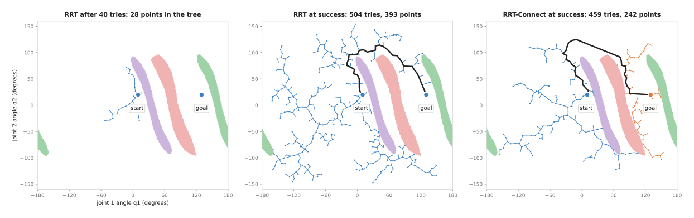

The left panel is RRT after 40 tries, and its tree has 28 points, the start and
27 new ones. That is because the other 13 tries landed in a band or crossed one.
The middle panel is the same run at the moment it found the goal, after 504
tries, 393 points in the tree and 3,505 collision checks. Its path, drawn in
black, goes over the top of the bands, and it is 305° long in total joint
movement, with 40 waypoints. The right panel is RRT-Connect, which the next
section explains.

### A worked example: the first three tries

Here are the first three tries of that RRT run, written out with the real numbers.

1. The random number is 0.625, which is not below 0.05, so the planner picks a random
   configuration: (143.0°, 88.2°). The tree only holds the start, (10°, 20°), at a
   distance of 149.5°. One 8° step towards the random point reaches
   (17.12°, 23.65°). It is clear, and so is the move, so it joins the tree.
2. The random configuration is (−71.9°, 119.5°). The closest node is still the
   start, 128.9° away. One step reaches (4.92°, 26.18°). It is clear, so it joins
   the tree.
3. The random number is 0.005, which is below 0.05, so the planner aims at the goal,
   (130°, 20°). The closest node is (17.12°, 23.65°), 112.9° away. One step reaches
   (25.1°, 23.4°). That configuration lies in the post's band, where link 2 touches
   the post, so the checker says no and the point is thrown away.

The third try shows why a planner that only heads for the goal gets stuck, because
from here, heading straight for the goal runs into the post's band. So the random
tries are what carry the tree up and over the bands.

### RRT-Connect: grow two trees and join them

**RRT-Connect** grows two trees instead of one, with the first from the start and
the second from the goal, and it takes turns between them.

1. Grow one tree by one step towards a random configuration, as in RRT.
2. If that worked, take the new node and try to reach it from the other tree. Keep
   stepping from the other tree's nearest node towards it until you reach it or
   hit something. This greedy stepping is the "connect" in the name.
3. If the other tree reached the new node, then the two trees are joined, and the
   path is the start tree's branch followed by the goal tree's branch.
4. Otherwise swap the roles of the two trees and go back to step 1.

In the right panel of the picture, blue is the start tree and orange is the goal
tree. On this run the planner needed 459 tries, 242 points and 2,612 collision
checks.

Over 100 runs, RRT-Connect needed a median of 1,922 collision checks against 2,805
for RRT, which is about a third fewer. This is only a small, open problem with two
joints. In larger spaces with more joints the gap is usually much wider, which is
why MoveIt uses RRT-Connect by default, as Book 3 also says.

### PRM: build a map once, then ask it many times

The **probabilistic roadmap**, or PRM, splits the work in two, so that the
expensive half of it is done only once.

The first part builds a roadmap, and it runs only once for a given scene.

1. Pick many random configurations. Throw away the ones in collision.
2. For each one that is left, find its nearest few neighbours, and add an edge to
   each neighbour where the straight move is clear.

The second part answers a query, and it can run as many times as you like.

1. Join the start and the goal to their nearest roadmap nodes, the same way.
2. Run [Dijkstra's algorithm or A\*](../03_also-used/01_graph-search.md#dijkstras-algorithm-lowest-total-cost)
   on the roadmap from the start to the goal.

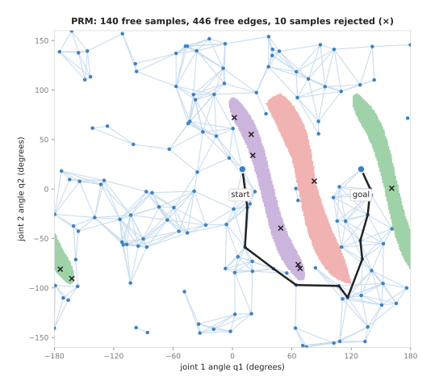

This run picked 150 random configurations, of which ten fell inside a band and
were rejected, and those ten are the crosses. The other 140 each tried to join
their 10 nearest neighbours within 45°, and 446 of those edges were clear.
Building the roadmap took 15,151 collision checks, whereas answering the query
took only 369 more, to join the start and the goal. The path, in black, goes under
the bands this time, with the elbow bent the other way, and it is 337° long.

The build cost is high, but it is paid only once, so when the scene does not
change every later query is cheap. When the scene does change, however, edges that
pass through the new object are wrong, and the whole roadmap must be checked
again. That is why RRT-Connect, which builds nothing in advance, is the usual
choice for an arm whose scene changes every time.

### The pseudocode

Here is RRT written out, and RRT-Connect and PRM use the same pieces: a sampler, a
nearest-neighbour search, a step, and the two collision questions.

```
function rrt(start, goal, step, goal_bias, max_tries):
    tree = a tree holding start, with no parent
    repeat max_tries times:
        if random number < goal_bias:
            target = goal
        else:
            target = a random configuration inside the joint limits

        near = the node in tree closest to target
        new  = move from near towards target, at most step far

        if configuration_is_clear(new) and move_is_clear(near, new):
            add new to tree, with parent near
            if distance(new, goal) <= step and move_is_clear(new, goal):
                add goal to tree, with parent new
                return follow parents back from goal

    return "no path found in time"

function move_is_clear(a, b):
    for each point from a to b, spaced at the check spacing:
        if not configuration_is_clear(point):
            return false
    return true
```

Notice the last line of `rrt`, because it does not say "no path exists", it says
that none was found in the time allowed. A sampler cannot tell those two cases
apart.

### Random means different every run

The planners are random on purpose, so the same problem gives a different answer
each run. The script ran RRT and RRT-Connect 100 times each on the problem above,
with 100 different random seeds. A **seed** is the number that starts a random
number generator, so the same seed always gives the same run.

The table below shows how wide that spread is, and you read each row as one
planner. The "tries" columns count trips round the loop, and the "path" columns
give the total joint movement along the path that was found.

| Planner | Tries, fewest | Tries, median | Tries, 90th percentile | Tries, most | Checks, median | Checks, most | Path, shortest | Path, median | Path, longest |
| --- | --- | --- | --- | --- | --- | --- | --- | --- | --- |
| RRT | 170 | 408 | 617 | 964 | 2,805 | 5,385 | 277° | 347° | 479° |
| RRT-Connect | 168 | 306.5 | 421 | 578 | 1,922 | 3,130 | 295° | 393° | 692° |

The 90th percentile means that 90 runs out of 100 needed that many tries or fewer.
So RRT's slowest run took nearly six times as many tries as its fastest. The
paths vary just as much, because the longest RRT-Connect path, at 692°, is more
than twice the shortest. Book 3 lists this spread as the main reason samplers do
not suit a cell that must do the same thing every time.

RRT-Connect found paths with fewer checks, but its paths were longer on the
median, because joining two trees greedily finds a path fast rather than a short
one. That is the reason for the step described next.

### Cleaning up the path

A sampler's path has detours, because each step went towards a random point, and
two fixes for that are common.

The first is **shortcutting**, in which you pick two points on the path at random.
If the straight move between them is clear, you cut out everything between them,
and you repeat that a few hundred times. The
[overview](../01_overview.md#5-how-they-work-together-on-one-move) shows this on
an RRT-Connect path, where it drops from 384° to 250°. On the seed-7 run above,
the same step took the RRT-Connect path from 353° to 290°, with 4 waypoints
left.

The second is to hand the path to a
[trajectory optimiser](03_trajectory-optimisation.md), which makes it smooth and
pushes it away from obstacles as well as shortening it.

There are also planners that keep improving their own path, because **RRT\*** and
**PRM\*** reconnect nodes whenever a shorter route through them appears. Given
more and more time their paths approach the shortest possible, a property that is
called **asymptotic optimality**. But the cost of that is more time per try.

---

## 6. Planning with rules on the way: constrained planning

In every section so far a path only had to avoid collisions, but many tasks add a
rule that must hold at every moment of the move, and not just at its two ends. For
example, an arm carrying a cup of water must keep the cup upright, and a camera on
the wrist must keep pointing at a shelf. In the same way, a cloth must stay flat
on the table while the arm wipes it. A rule like this is called a **path
constraint**, and planning with one is called **constrained planning**.

This section shows why an ordinary sampler cannot follow such a rule, and how the
usual fix, called **projection**, works. The pictures come from
[`planning_and_search_4.py`](../../../diagrams/planning_and_search_4.py).

### The cup example

The arm for this example has three joints and is seen from the side. Its shoulder
sits on a post 40 cm above the table, and its links are 40 cm, 30 cm and 10 cm
long. The last link is the hand, a cup 9 cm tall stands on its end, and a
box 18 cm tall stands on the table. The arm must move the cup from 62 cm out, on
one side of the box, to 22 cm out, on the other side.

The cup's **tilt** is the angle of the hand to the horizontal, and for this arm it
is simply the sum of the three joint angles. The rule is "tilt = 0" within a small
tolerance, and both the start and the goal already satisfy it.

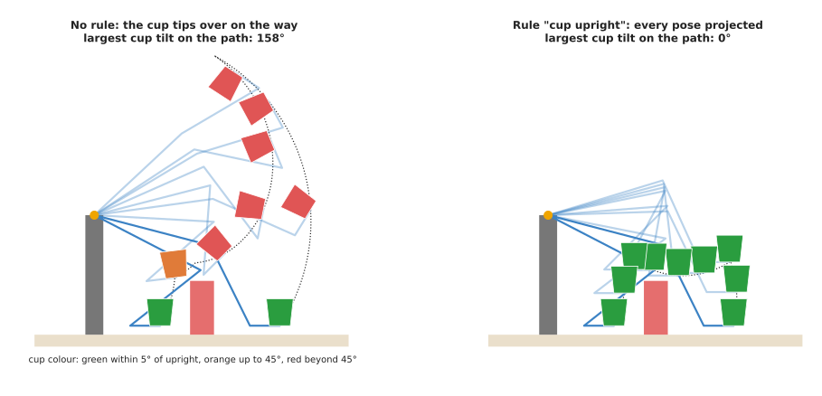

The left panel is RRT-Connect with no rule, after shortcutting. Its path lifts the
cup over the box, tilting the cup by up to 158° on the way, which is nearly upside
down. Over 20 runs with different seeds, the largest tilt on each path,
before shortcutting, had a median of 139°, and only one run stayed under 45°.
Nothing in the planner cares about the cup, so nothing keeps it level.

### Why random samples cannot follow the rule

The obvious fix is to throw away every sample that breaks the rule, which is
called **rejection sampling**, but it fails because almost every sample breaks the
rule.

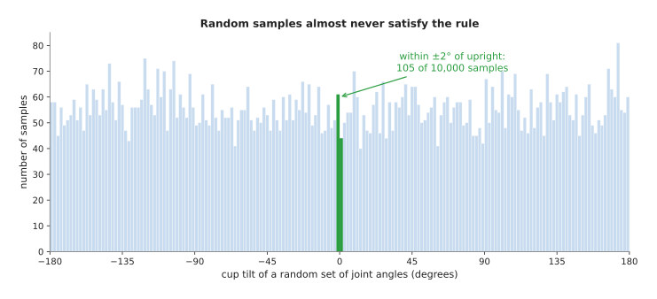

The script picked 10,000 random sets of joint angles for the cup arm, and their
tilts spread almost evenly over the whole circle. Only 105 of them were within 2°
of upright, which is about 1 in 100. A real six-joint arm has two tilt angles to
hold, forward and sideways, so roughly 1 in 100 × 100, or 1 in 10,000, samples
would pass. A rule that must hold exactly, such as "the gripper stays on this
line", is passed by no random sample at all.

The reason is geometric, because the poses that satisfy the rule form a thin
surface inside the configuration space, in the same way a line is thin inside a
page. So a random point almost never lands on a line.

### Projection: pull each sample onto the rule

**Projection** is the fix that does work, because it takes a random sample and
moves it, by the smallest change it can find, until the sample satisfies the rule.
It uses the same idea as
[numerical inverse kinematics](02_numerical-inverse-kinematics.md).

1. Measure how badly the sample breaks the rule, which for the cup is simply the
   tilt, and call that number the error.
2. Work out how the error changes when each joint moves a little. This is the
   rule's **gradient**. For the cup it is simple: every joint changes the tilt by
   the same amount, so the gradient is (1, 1, 1).
3. Move the joints against the gradient by exactly enough to make the error zero,
   as it would be if the rule were a straight line, and that is one **Newton step**.
4. Repeat until the error is below the tolerance. Throw the sample away if it takes
   too many steps or leaves the joint limits.

For the cup rule one step is exact, because it subtracts a third of the tilt from
each joint, but most rules are curved and so need a few steps. The picture below
shows a curved rule on the book's two-joint arm, seen from above. That rule is
"the gripper stays on a rail at y = 2.5 m", as when sliding something along the
edge of a table.

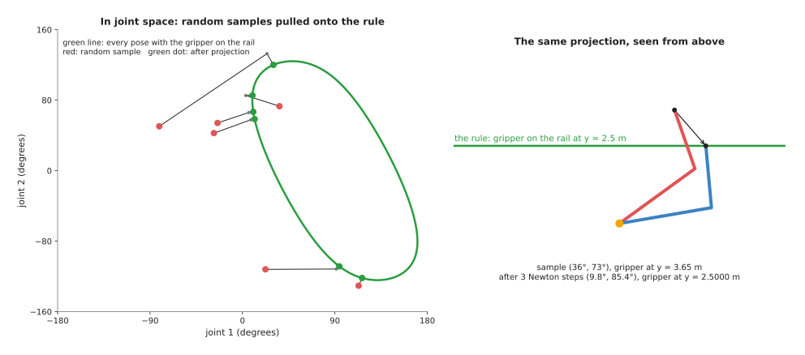

The green curve in the left panel is every pose that puts the gripper on the rail.
Poses within 1 cm of that rail cover only 0.2% of the joint space. Each red dot is
a random sample, and each line shows its Newton steps. Every one of them reached
the rail in 2 or 3 steps, to within 0.1 mm. The script drew 8 samples to
get these 6, because the other 2 left the joint limits during projection and were
thrown away. In the right panel the sample (36°, 73°) puts the gripper at
y = 3.65 m. After that, 3 steps give the pose (9.8°, 85.4°), which puts it at
y = 2.5000 m.

A constrained sampler uses projection in three separate places, and the third of
them is the one people forget.

- Each random sample is projected before the planner uses it.
- Each short step towards a sample is projected, so the tree grows along the rule.
- Each point checked along an edge is projected, because the straight joint move
  between two poses on a curved rule leaves the rule in the middle.

The right panel of the cup picture is RRT-Connect with these three changes, and
the cup now stays upright the whole way. Over 20 runs the median number of tries
was 1,453, against 1,463 with no rule at all. For this arm the rule is flat in
joint space, which is the easy case. On a six-joint arm with a curved rule,
however, each projection costs a few Newton steps, so constrained planning is
slower than free planning.

OMPL, the planning library behind MoveIt, has two further methods for the same
job. An **atlas** covers the rule's surface with small flat patches and then
samples on those patches. A **tangent bundle** does the same, but it builds the
patches only when it needs them. Both give more even coverage of the surface than
projection does.

### Where it is used, where it fails, and the libraries

Here are the places where an arm has to plan with a rule on the way.

- **Carrying liquid or an open container.** The cup, a tray of parts or a bowl of
  powder must stay level.
- **Pointing a tool or a camera.** A wrist camera keeps a shelf in view, and a
  glue nozzle stays at right angles to a surface.
- **Staying in contact.** Wiping a table, sanding a board or sliding a part along a
  fence keeps the tool on a surface or a line.
- **Two hands on one object.** When two arms hold one box, the distance between the
  two grippers is a rule that must hold all the way.
- **Opening a door or a drawer.** The handle moves on an arc or a line, so the
  gripper must move on that arc or line too.

Constrained planning brings problems of its own, and these are the ones you will
meet.

- **Projection cannot find the rule.** Near a pose where the rule's gradient is
  close to zero the Newton step becomes huge, so the sign is samples that are
  thrown away, or that jump to far-off poses, and people limit the step size or
  use the atlas methods.
- **The rule is too tight with obstacles.** The surface of allowed poses may be
  split by an obstacle into parts that do not connect, so the sign is a planner
  that always times out, and people loosen the tolerance, which gives a band
  instead of a surface.
- **Rejection only.** If the planner only rejects samples, and does not project
  them, it times out for any narrow tolerance, as the histogram above shows.
- **The rule checked only at waypoints.** The move between two good waypoints can
  break the rule in the middle, so people project the points along each edge, or
  check the rule along the edge.
- **A straight line for the tool.** If the rule is "follow this exact line", a
  sampler is the wrong tool, and Book 3's
  [Cartesian paths](../../../03_frameworks/03_arm-movement/03_planning-a-path.md#5-cartesian-paths-and-what-they-are-not)
  explain the direct way.

The table below lists where to find constrained planning, and you read each row as
one tool, the languages it serves, the names to look for, and a note.

| Library | Languages | Function or class | Note |
| --- | --- | --- | --- |
| MoveIt 2 | C++, Python | `moveit_msgs/msg/Constraints` with an `OrientationConstraint`, set as the request's path constraints | the tolerances say how far each axis may tilt; the `enforce_constrained_state_space` setting switches OMPL to its projection-based planning |
| OMPL | C++, Python | `ompl::base::Constraint`, `ProjectedStateSpace`, `AtlasStateSpace`, `TangentBundleStateSpace` | you write the rule and its gradient; OMPL projects and plans |
| TrajOpt | C++ | constraints on the pose of a link | treats the rule as a hard constraint during trajectory optimisation, as the [trajectory optimisation](03_trajectory-optimisation.md#3-chomp-stomp-and-trajopt) page explains |

Without the constrained state space, MoveIt handles an orientation constraint by
sampling poses that already satisfy it and rejecting states that break it, which
works well enough for loose tolerances. For tight ones, however, the
projection-based setting is the one to try.

---

## 7. Where it is used on a robot arm

The sections above explained how these planners work, so this one lists where an
arm actually uses them. Sampling-based planners are the default way to move an arm
through free space when the scene is not fixed, and here are the concrete places.

- **Moving from the camera pose to above a detected object.** The goal comes from
  perception, so it is different every time, and the planner finds a route that
  clears the other objects on the table.
- **Reaching into a bin or shelf.** The arm has to pass the bin's rim or the
  shelf's edge, so the free space is awkward, and a sampler will find its way in
  where a simple straight move would hit.
- **Carrying a held object.** Once the gripper holds something, that object is part
  of the arm, so the planner checks it too, and Book 3's
  [the object in the gripper is part of the arm](../../../03_frameworks/03_arm-movement/03_planning-a-path.md#73-the-object-in-the-gripper-is-part-of-the-arm)
  explains what happens if nobody tells the planner.
- **Recovering after a fault.** When the arm has stopped somewhere unexpected, any
  valid path back to a safe pose is the whole requirement.
- **Planning many queries in a fixed cell.** A PRM built once for the cell answers
  every later query cheaply, as long as nothing in the cell moves.
- **Feeding an optimiser.** A sampler finds a route through the awkward part of the
  space, and a [trajectory optimiser](03_trajectory-optimisation.md) then makes it
  smooth, so this pairing uses each method for what it is good at.
- **Checking whether a grasp is usable at all.** Before the arm commits to a grasp,
  a program can ask a planner for the whole chain of reach, grasp, lift and place,
  and Book 3's
  [planning the whole task as one thing](../../../03_frameworks/03_arm-movement/03_planning-a-path.md#9-planning-the-whole-task-as-one-thing)
  explains why.

---

## 8. Where it is useful, and where it is not

Section 7 listed the jobs a sampler does well, so this section sets out its
limits. A sampling planner is **probabilistically complete**. This means that if
a free path exists, the chance that the planner finds one grows towards certainty
as it runs longer. It does not mean that the planner will find one in the time you
give it.

The table below lists the common problems, and you read each row as a problem, the
sign you would see, and what people use instead.

| Problem | The sign you would see | What people do instead |
| --- | --- | --- |
| A narrow gap: few random samples land inside it | planning times out, or takes much longer, in one part of the cell | samplers that aim near obstacles, a learned sampler, or a longer time limit |
| The same move must be identical every run | the arm takes a different route each cycle | [graph search](../03_also-used/01_graph-search.md) on a roadmap of taught poses, an optimiser, or computed industrial motion |
| A straight-line tool motion is needed | the tool wanders instead of going straight | a Cartesian path, as Book 3 explains |
| A rule must hold all the way, such as a level cup | the held object tilts or swings on the way | constrained planning with projection, as in [section 6](#6-planning-with-rules-on-the-way-constrained-planning) |
| The planning time must have a hard limit | usually 50 ms, sometimes a second | an optimiser warm-started from the last answer, or a planner on a graphics card |
| Collision checks too far apart | a path through a thin rod or plate | a smaller check spacing, padding around thin objects, or a [continuous check](#checking-a-whole-motion-not-just-its-ends) |
| The goal cannot be reached at all | a timeout, which looks like any other failure | check reachability first, before planning |
| The path is ugly | long detours, sharp corners | shortcutting, then a [trajectory optimiser](03_trajectory-optimisation.md) |
| The scene changes after the roadmap is built | a PRM path through a newly placed object | rebuild or re-check the roadmap, or use RRT-Connect |

The narrow gap problem deserves a sentence more, because the chance that a random
sample lands in a gap is simply the gap's share of the whole space. A gap that is
1% as wide as the space, in each of six joints, therefore holds a tiny fraction of
the samples. This is the case where a learned sampler helps, as
[section 11](#11-the-learned-alternative) explains.

---

## 9. Libraries that provide it

Because the problems in section 8 are so well known, almost nobody writes a
production sampler from scratch. The table below lists the well-known libraries,
and you read each row as one library, the languages it serves, the names to look
for, and a note.

| Library | Languages | Function or class | Note |
| --- | --- | --- | --- |
| OMPL | C++, Python bindings | `ompl::geometric::RRT`, `RRTConnect`, `PRM`, `RRTstar`, `PRMstar`, `LazyPRM` | the reference collection of samplers; brings no collision checker of its own |
| MoveIt 2 | C++, Python (MoveItPy) | the OMPL planning plugin, with planner settings such as `RRTConnectkConfigDefault` | connects OMPL to the arm model, the planning scene and the collision checker |
| FCL | C++ (python-fcl for Python) | `fcl::collide`, `fcl::distance` | the Flexible Collision Library; MoveIt's usual collision checker |
| Coal (formerly HPP-FCL) | C++, Python | collision and distance queries | used by Pinocchio |
| Pinocchio | C++, Python | `computeCollisions` | arm kinematics plus collision checks in one library |
| PyBullet | Python | `getContactPoints`, `getClosestPoints` | a simulator whose collision queries are handy for quick experiments |

To try the ideas in Python, OMPL's Python bindings are the most direct route. You
give it the joint limits and a function that says whether a configuration is
clear, and it gives you back a path.

---

## 10. Why sampling, and what it costs

With the methods and the libraries covered, this section answers the four
questions for sampling-based planning: what it is, what it does for you, why it
rather than the obvious alternative, and what it costs.

It is a family of planners that probe the configuration space with random samples
and join the clear ones into a tree or a roadmap. What it does for you is find a
collision-free route for an arm with any number of joints, without anyone having
to describe the free space first.

The obvious alternative is [graph search](../03_also-used/01_graph-search.md) on a
grid of the joint space, which gives the shortest path and the same answer every
time. But the number of cells grows 36 times with every joint at 10° steps, so a
six-joint arm would need over two billion cells. A sampler, by contrast, needs
only a few thousand collision checks on this page's problem, and still a
manageable number for six joints. So choose a sampler when the arm has more than
about three joints and the scene changes. Choose graph search instead when the
space is small, or when you already have a fixed roadmap.

The second alternative is a [trajectory optimiser](03_trajectory-optimisation.md),
which gives a smooth path and the same answer every time. But it starts from a
guess and improves it locally, so it can get stuck on the wrong side of an
obstacle. A sampler does not get stuck that way, because it keeps exploring. That
is why the two are so often used together.

Against all of that, sampling brings costs of its own, and the first is that the
answer differs every run and so cannot be certified as always the same. The path
also has detours and needs cleaning, and the time to find a path has no fixed
limit. A failure then tells you nothing about why it failed. And the planner is
only as good as its collision checker and its planning scene, because it cannot
avoid what it was not told about, and, unless it checks continuously, it can miss
what falls between two checks.

---

## 11. The learned alternative

Section 10 weighed sampling against the two written alternatives, and Book 7's
[learned motion planners](../../../07_learned-models/06_movement-models/03_also-used/02_learned-motion-planners.md)
page covers a third one, which is networks that either help this planner or stand
in for it. A
[learned sampler](../../../07_learned-models/06_movement-models/03_also-used/02_learned-motion-planners.md#3-how-a-learned-route-planner-works)
picks its samples where routes usually pass, such as the front of a gap between
shelves, which is exactly the fix for the narrow gap in section 8. A learned route
planner, such as Motion Policy Networks, gives a whole route from a point cloud in
about the same short time every run. A learned collision checker also gives a
quick guess for the thousands of checks a search makes. These win when planning is
usually fast but sometimes far too slow, in a cell with a strict cycle time. In
open space the ordinary planner still wins, because it is fast enough, free, and
checks every move. Even beside a learned helper it stays in the system,
because a network gives no guarantee and the exact checker must test the final
route.

---

## 12. Where to read next

- [Trajectory optimisation](03_trajectory-optimisation.md) takes a sampler's path
  and makes it smooth and clear of obstacles.
- [Numerical inverse kinematics](02_numerical-inverse-kinematics.md) turns a target
  pose into the goal configuration a sampler plans to.
- [Graph search](../03_also-used/01_graph-search.md) explains the search a PRM runs on its roadmap.
- [Sampling-based optimisation and MPC](../03_also-used/02_sampling-based-optimisation-and-mpc.md)
  uses random samples in a different way, which is to choose the best plan when a
  score has no gradient.
- [Nearest-neighbour search](../../03_searching-and-matching/02_most-used/01_nearest-neighbour-search.md)
  is the step that every RRT try uses to find the closest node.
- Book 3's [planning a path](../../../03_frameworks/03_arm-movement/03_planning-a-path.md)
  covers MoveIt's defaults, the planning scene, and when planning is the wrong tool.

---

## 13. Using it in Python

Section 5 gave the sampler as pseudocode, section 4 explained how a collision
checker answers, and section 9 said that OMPL's Python bindings are the most
direct route to trying the ideas. This section is that route. After it you will
know what a sampler asks you for, and you will see that the interesting code is
not the planner but the function you hand it.

The program below plans for a six-joint arm with OMPL. The shape of the calls is
taken from OMPL's own Python demos, which ship in the library's `demos`
directory, and the bindings have to be built with OMPL rather than installed
with `pip`. The collision check uses Pinocchio, which reads your arm's URDF
description file and answers the one question a sampler asks.

```python
import numpy as np
import pinocchio as pin
from ompl import base as ob
from ompl import geometric as og

# The arm, and the shapes that must not touch each other.
model = pin.buildModelFromUrdf("arm.urdf")
geometry = pin.buildGeomFromUrdf(model, "arm.urdf", pin.GeometryType.COLLISION)
geometry.addAllCollisionPairs()
data, geometry_data = model.createData(), geometry.createData()

def is_clear(state):
    """The only question the sampler asks: is this configuration free?"""
    q = np.array([state[i] for i in range(model.nq)])
    return not pin.computeCollisions(model, data, geometry, geometry_data, q, True)

# One dimension per joint, bounded by that joint's limits.
space = ob.RealVectorStateSpace(model.nq)
bounds = ob.RealVectorBounds(model.nq)
for i in range(model.nq):
    bounds.setLow(i, float(model.lowerPositionLimit[i]))
    bounds.setHigh(i, float(model.upperPositionLimit[i]))
space.setBounds(bounds)

setup = og.SimpleSetup(space)
setup.setStateValidityChecker(is_clear)
setup.setPlanner(og.RRTConnect(setup.getSpaceInformation()))

start, goal = space.allocState(), space.allocState()
for i in range(model.nq):                 # start_angles and goal_angles are yours
    start[i] = start_angles[i]
    goal[i] = goal_angles[i]
setup.setStartAndGoalStates(start, goal)

if setup.solve(5.0):                  # five seconds to find something
    setup.simplifySolution()          # the shortcutting from section 5
    path = setup.getSolutionPath()
    path.interpolate()                # fill in points between the waypoints
```

OMPL does the sampling, the tree growing, the nearest-neighbour search inside
the tree, and the shortcutting afterwards. `RRTConnect` is the two-tree version
from section 5, and swapping it for `og.PRM` or `og.RRTstar` is a one-line
change, which is the reason a library is worth using here. Pinocchio does the
forward kinematics and the shape-against-shape tests from section 4, using the
boxes and meshes named in your own URDF file.

What you still have to write is the bridge between them, and section 3 explains
why that bridge is the whole job. OMPL brings no collision checker of its own,
so `is_clear` is yours, and everything about the difficulty of planning lives in
that function: how fast it is, whether it includes the table and the objects on
the table as well as the arm's own links, and whether it checks the gripper's
payload. The function above checks only the arm against itself and against
whatever is in the URDF, so a real workcell needs the obstacles added to the
geometry model too. You also write the conversion between OMPL's state and your
own array of joint angles, which is the `state[i]` loop, and it is worth writing
carefully because it runs thousands of times per plan.

What you have to decide or measure is the description of your robot and three
numbers. The joint limits come from the URDF, so they are only as right as that
file is. The five seconds in `solve` is your patience, and section 8 explains
that a sampler that fails in five seconds may succeed in thirty, so the number
is a policy rather than a fact. The state validity checking resolution, set with
`setup.getSpaceInformation().setStateValidityCheckingResolution(0.01)`, decides
how finely a motion between two samples is checked, and section 4 explains that
too coarse a value lets the arm pass through a thin obstacle between two checked
points. Finally you decide what clearance you want, because `computeCollisions`
answers touching or not touching, and an arm that plans to within a millimetre
of a real table will hit it, so you either inflate the shapes in the URDF or use
`pin.computeDistances` and insist on a margin.
