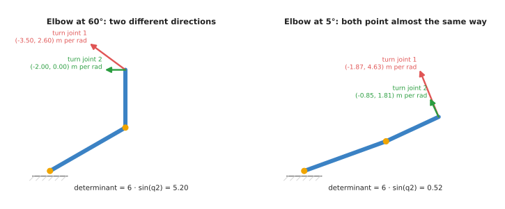
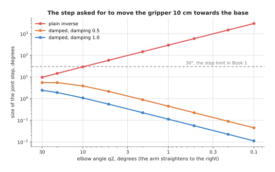
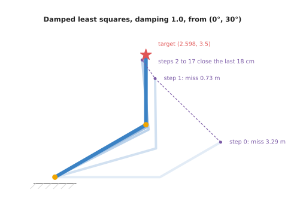
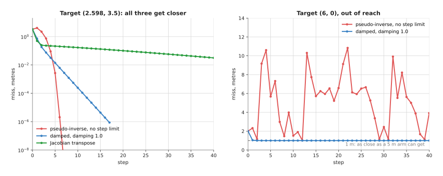

# Numerical inverse kinematics

This page explains how a program finds the joint angles that put a gripper at a
chosen place, when there is no neat formula to do it. It does that with a
guess-and-correct loop, so the page answers five questions about it. How does the
guess-and-correct loop work? What is the Jacobian, and why does the loop need it?
Why does the plain loop go wild when the arm is nearly straight? How does **damped
least squares**, the method most solvers use, fix that? And what happens when the
target cannot be reached at all?

It is for a reader who has read [inverse kinematics](../../../01_robotics-intro/04_kinematics/02_inverse-kinematics.md)
in Book 1. That page solves the same small arm with a triangle formula, and then
introduces the guess-and-correct loop in [its section 6](../../../01_robotics-intro/04_kinematics/02_inverse-kinematics.md#6-numerical-inverse-kinematics-guess-and-correct).
This page picks up where that one stops. So it uses the same arm, the same target
and the same first guess, and you can compare the numbers directly.

The arm has two links lying flat, and link 1 is 3 m while link 2 is 2 m. The
target is `(2.598, 3.5)`, which is where the gripper sits when `q1 = 30°` and `q2
= 60°`. Every number on this page is printed by the diagram script
`docs/diagrams/planning_and_search_2.py`.

## Contents

1. [The idea in one sentence](#1-the-idea-in-one-sentence)
2. [How it works](#2-how-it-works)
   · [Step 1: measure the miss](#step-1-measure-the-miss)
   · [Step 2: the Jacobian](#step-2-the-jacobian)
   · [Step 3: turning the Jacobian round](#step-3-turning-the-jacobian-round)
   · [Step 4: why the plain answer goes wild near a straight arm](#step-4-why-the-plain-answer-goes-wild-near-a-straight-arm)
   · [Step 5: damped least squares](#step-5-damped-least-squares)
   · [Step 6: a worked run](#step-6-a-worked-run)
   · [Step 7: a target out of reach, and choosing the damping](#step-7-a-target-out-of-reach-and-choosing-the-damping)
   · [Step 8: more joints than the task needs](#step-8-more-joints-than-the-task-needs)
   · [Pseudocode](#pseudocode)
3. [Where it is used on a robot arm](#3-where-it-is-used-on-a-robot-arm)
4. [Where it works, and where it does not](#4-where-it-works-and-where-it-does-not)
5. [Libraries that provide it](#5-libraries-that-provide-it)
6. [Why numerical inverse kinematics, and what it costs](#6-why-numerical-inverse-kinematics-and-what-it-costs)
7. [The learned alternative](#7-the-learned-alternative)
8. [Where to read next](#8-where-to-read-next)
9. [Using it in Python](#9-using-it-in-python)

---

## 1. The idea in one sentence

Guess the joint angles, see how far the gripper misses the target, work out which
small turn of each joint shrinks that miss, make the turn, and repeat until the
miss is tiny.

Here is an everyday example of that loop: think of parking a car close to a kerb
with the help of a mirror. You do not work out the steering angle in advance.
Instead you look in the mirror, see that you are 40 cm out, turn the wheel a
little, roll back, and look again. Each look tells you the miss, and you know from
experience which way to turn the wheel to shrink it. In other words, you keep
going until you are close enough.

A program does the same thing, and forward kinematics is its mirror, because
forward kinematics says where the gripper is for any set of joint angles. The
**Jacobian** is its experience, because the Jacobian says which way the gripper
moves when each joint turns. Inverse kinematics is often shortened to **IK**, and
this page uses that short form from here on.

---

## 2. How it works

Section 1 gave the whole loop in one sentence, so the steps below take it apart,
in the order the program runs them.

### Step 1: measure the miss

The program starts from a guess for the joint angles, and on a real robot that
guess is usually the arm's current angles. Here it is `q1 = 0°`, `q2 = 30°`, which
is the same guess Book 1 uses.

It runs forward kinematics on the guess to find where the gripper is, and then it
subtracts that position from the target. The result is the **miss**, which is an
arrow from the gripper to the target, with an `x` part and a `y` part. Its length
is how far off the gripper is, and for the first guess that length is 3.287 m.

### Step 2: the Jacobian

Step 1 measured the miss, so the next question is which joint turn will shrink it,
and the Jacobian is what answers that. It is a small table with one column per
joint. Each column says how far the gripper moves, in `x` and in `y`, when that
joint turns by one radian. It only holds for small turns, and it changes as the
arm moves, so the program works it out again at every step.

Book 1 finds each column by turning one joint a millionth of a radian and seeing
where the gripper goes. However, for this arm there is also a short formula. At
`(30°, 60°)` the table is:

```
                 joint 1    joint 2
gripper x:       -3.500     -2.000
gripper y:        2.598      0.000
```

Read the first column like this: turning joint 1 by a small amount `a` radians
moves the gripper `-3.5 a` in `x` and `2.598 a` in `y`. Joint 1 swings the whole
arm, so the gripper moves at right angles to the line from the base. Joint 2,
however, only swings the last link, so the gripper moves at right angles to that
link.



On the left, with the elbow at 60°, the two columns point in clearly different
directions, so together they can move the gripper any way. But on the right, with
the elbow at 5°, both point almost the same way, and neither moves the gripper
along the arm.

### Step 3: turning the Jacobian round

The Jacobian from step 2 answers one question: if I turn the joints this much,
where does the gripper go? However, IK needs the opposite question, which is how
much I should turn the joints to move the gripper along the miss. So the program
solves this for the joint step `dq`:

```
J · dq = miss
```

With two joints and two numbers in the miss, this is two equations with two
unknowns, so it has one answer as long as the columns point different ways. Book 1
does this with `np.linalg.pinv`, the **pseudo-inverse**, which also works when the
table is not square, and the [NumPy page](../../../01_robotics-intro/01_python-and-numpy/02_numpy-intro.md#66-moving-an-arm-a-little-the-jacobian-and-pinv)
explains it.

One number tells you how easy the table is to turn round, and that number is its
**determinant**. For this arm it is `L1 · L2 · sin(q2) = 6 · sin(q2)`, as
[the arm movement overview](../../../03_frameworks/03_arm-movement/01_overview.md#5-the-one-calculation-underneath-everything)
shows, and at `(30°, 60°)` it is 5.196. It falls to zero when the elbow is
straight or folded back. That pose is a **singularity**, which is a pose where the
arm cannot move its gripper in some direction, however fast the joints turn.

### Step 4: why the plain answer goes wild near a straight arm

Step 3 named the singularity, but the trouble starts well before the arm reaches
one. As the elbow straightens, both columns of the Jacobian point almost the same
way, as the right-hand picture above shows. This means neither of them moves the
gripper along the arm, towards or away from the base. Asked to move that way, the
plain answer therefore asks for a huge turn.

The program tests this directly. So it puts joint 1 at 0° and asks each method for
the step that moves the gripper 10 cm towards the base, for smaller and smaller
elbow angles.



The red line is the plain inverse: its step grows as the elbow straightens, to
29.4° at an elbow of 10° and to 2946° at 0.1°, while the two damped lines shrink.

The table below gives some of the same numbers. Read each row as one elbow angle
and the size of the joint step, in degrees, that each method asks for.

| Elbow angle | Plain inverse | Damped, 0.5 | Damped, 1.0 |
| --- | --- | --- | --- |
| 30° | 9.6° | 5.50° | 2.42° |
| 10° | 29.4° | 3.85° | 1.07° |
| 2° | 147.3° | 0.89° | 0.22° |
| 0.1° | 2946.4° | 0.04° | 0.01° |

To pull the gripper in by 10 cm from a nearly straight arm, the true answer bends
the elbow to 23.44°. But the plain inverse asks for eight full turns of the joints
in one step. Book 1 avoids this by capping every step at 30° per joint. A cap does
work, but it is a blunt tool. This is because it cuts the step to the same size
whether the arm is near a singularity or far from it.

### Step 5: damped least squares

Because a cap is so blunt, damped least squares asks a slightly different
question. Instead of asking "which step removes the whole miss?", it asks this:

> Which step makes (the miss left over)² + λ² × (the size of the step)² as small
as possible?

The first part of that sum wants the miss gone, while the second part charges a
price for every bit of joint turn. The number `λ` (lambda) is the **damping**, and
it sets that price. Here it is measured in metres, because the miss is in metres.

When the arm is well bent, a small turn removes a lot of miss. This means the
price hardly matters, and the step is close to the plain answer. When the arm is
nearly straight, removing the miss along the arm would need a huge turn. So the
price wins, and the step stays small. The method gives up, for now, on the
direction the arm cannot move in, and moves in the directions it can.

The answer to that question has a short formula, in which `Jᵀ` is the Jacobian
with rows and columns swapped, and `I` is the table with 1 on the diagonal and 0
elsewhere:

```
dq = Jᵀ · (J · Jᵀ + λ² · I)⁻¹ · miss
```

With `λ = 0` this is the plain answer again. But with a large `λ` it becomes a
small step along `Jᵀ · miss`, which is plain gradient descent on the squared miss,
called the **Jacobian transpose** method. Damped least squares therefore sits
between those two. The same idea, a least-squares fit with a price on large
answers, appears in [least-squares fitting](../../04_fitting-and-estimation/02_most-used/01_least-squares-fitting.md).
The name **Levenberg–Marquardt** is used when the program also changes `λ` as it
goes, which step 7 shows.

### Step 6: a worked run

Here is damped least squares with `λ = 1.0`, run from the guess `(0°, 30°)`, and
this time the program has no step cap at all.

```
step  0: q1 =    0.00, q2 =   30.00, miss = 3.286921 m
step  1: q1 =   15.90, q2 =   74.83, miss = 0.727079 m
step  2: q1 =   26.98, q2 =   68.29, miss = 0.182858 m
step  3: q1 =   28.62, q2 =   63.47, miss = 0.074530 m
step  4: q1 =   29.40, q2 =   61.51, miss = 0.031999 m
step  5: q1 =   29.74, q2 =   60.67, miss = 0.014036 m
  ...
step 10: q1 =   30.00, q2 =   60.01, miss = 0.000245 m
  ...
step 17: q1 =   30.00, q2 =   60.00, miss = 0.000001 m
```



The palest arm is the first guess, each darker arm is one step later, and the
purple dots trace the gripper; the first two steps do most of the work.

It finds `(30°, 60°)`, the elbow-down answer, in 17 steps. From the guess `(90°,
-30°)` it would find the elbow-up answer instead, as Book 1 shows, because the
loop always finds the answer nearest its guess.

For comparison, here is the plain pseudo-inverse from the same guess, with no step
cap:

```
step  0: q1 =    0.00, q2 =   30.00, miss = 3.286921 m
step  1: q1 =  -22.84, q2 =  175.11, miss = 4.063828 m
step  2: q1 =   48.47, q2 =   94.32, miss = 2.202467 m
step  3: q1 =   15.40, q2 =   84.49, miss = 0.734723 m
step  4: q1 =   29.09, q2 =   63.83, miss = 0.089897 m
step  5: q1 =   29.94, q2 =   60.11, miss = 0.002675 m
step  6: q1 =   30.00, q2 =   60.00, miss = 0.000002 m
```

Its first step folds the elbow to 175°, almost flat against link 1, so the miss
gets *bigger*. But it recovers, and it finishes sooner, in 7 steps. Near the
answer the plain method is the fastest there is, because it removes the whole miss
at every step. So damped least squares gives up some of that speed in order to
keep every step safe.



On the left, the pseudo-inverse and damped least squares both reach a miss below a
micrometre, while the Jacobian transpose is still 3.2 cm off after 40 steps; on
the right, the target is out of reach, the damped method settles at the best pose,
and the pseudo-inverse jumps about.

### Step 7: a target out of reach, and choosing the damping

The target `(6, 0)` is 6 m from the base while the arm is only 5 m long, so no
answer exists at all. The best the arm can do is point straight at it, with a miss
of 1 m.

From the guess `(10°, 20°)`, damped least squares with `λ = 1.0` gets there in a
few steps and stays there. The arm is straight, and the miss is 1.000 m. The plain
pseudo-inverse, however, never settles, because after 100 steps its miss is 7.171
m and its joint angles have wound up to hundreds of degrees.

The right damping is therefore a trade, and the table below shows what five values
do. Read each row as one value of `λ`, with how many steps it takes to reach
`(2.598, 3.5)` from `(0°, 30°)`. Then the last column says what it does when asked
for the out-of-reach `(6, 0)`.

| Damping λ | Steps to reach the target | Out of reach, after 100 steps |
| --- | --- | --- |
| 0.05 | 7 | jumps about, miss near 7 m |
| 0.2 | 7 | jumps about, miss between 1.0 and 3.6 m |
| 0.5 | 10 | flips between two mirror poses, miss 1.175 m |
| 1.0 | 17 | settles straight, miss 1.000 m |
| 2.0 | 44 | settles straight, miss 1.000 m |

So small damping is fast when the target is easy and wild when it is not, while
large damping is safe and slow. The `λ = 0.5` row is worth a second look, because
it swaps every step between `(11.56°, -30.9°)` and `(-11.56°, 30.9°)`, which are
two poses with the same miss. A program that only checks whether the miss is small
would see a steady 1.175 m. This means it would not notice that the arm is being
told to swing back and forth.

The usual answer is to change the damping as the loop runs, which is the
**Levenberg–Marquardt** method. After a step that makes the miss smaller, the
program keeps the step and halves `λ`. But after a step that makes the miss
larger, it throws the step away, doubles `λ` and tries again. Starting from `λ =
1.0`, it reaches `(2.598, 3.5)` in 5 kept steps, and settles on the straight pose
for `(6, 0)` in 9.

The nearly-straight case shows the difference most clearly. So start the arm at
`(0°, 0.1°)`, almost straight, and ask for `(4.9, 0)`, which is 10 cm towards the
base. The answer is `(-9.34°, 23.44°)`, and the methods below reach it in very
different ways.

- The plain pseudo-inverse gets there in 16 steps, but one step turns a joint by
  8634.9°. It ends at `(3230.66°, -5376.56°)`, which is the right pose after many
  full turns, so a real joint with limits would have hit them on the first step.
- Damped least squares with `λ = 1.0` never turns a joint more than 0.9° in one
  step, but it needs 119 steps, because near the singularity it moves very
  cautiously.
- With `λ = 0.5` it needs 36 steps, and no step is over 3.0°.
- Levenberg–Marquardt needs only 8 kept steps.

### Step 8: more joints than the task needs

Now add a third link, 1 m long, and ask only for the gripper's position and not
for its angle. Then three joints meet two numbers, so the arm is **redundant**,
which means it has endless answers, as [Book 1's section 5](../../../01_robotics-intro/04_kinematics/02_inverse-kinematics.md#5-three-joints-endless-answers-and-how-to-pick-one)
explains. The Jacobian is now 2 rows by 3 columns, and the same formula still
works, because `J · Jᵀ` is still a 2 by 2 table.

Damped least squares with `λ = 0.5`, asked for `(3.464, 4)`:

```
from (0, 30, 0):   (21.01, 54.98,  3.66) in 9 steps, gripper angle 79.65
from (90, -30, 0): (77.16, -54.31, -5.51) in 8 steps, gripper angle 17.35
```

Both reach the point, but they choose very different poses and gripper angles.
This is because the loop does not pick "the best" answer, since it picks one near
the guess, with small joint turns. So when the gripper angle matters, you must add
it to the miss as a third number, and then the arm is no longer redundant.

A real six-joint arm works the same way, only with bigger tables. Its miss has six
numbers, three for position and three for rotation, and its Jacobian has six rows
and one column per joint. The page on [rigid transforms](../../02_geometry-and-cameras/02_most-used/02_rigid-transforms.md)
explains how a rotation miss is written as three numbers.

### Pseudocode

The pseudocode below is the full loop, with Levenberg–Marquardt damping and joint
limits, written without any particular language.

```
function solve_ik(target, guess, damping, tolerance, max_steps, time_limit):
    q = guess
    miss = target - forward_kinematics(q)
    repeat until length(miss) < tolerance
                 or max_steps are used or time_limit has passed:
        J = jacobian(q)                                  # one column per joint
        step = J^T * inverse(J * J^T + damping^2 * I) * miss
        q_new = clamp(q + step, lower_limits, upper_limits)
        miss_new = target - forward_kinematics(q_new)
        if length(miss_new) < length(miss):
            q = q_new
            miss = miss_new
            damping = damping / 2                        # things are going well
        else:
            damping = damping * 2                        # too bold: be more careful
            if damping is very large: stop               # no step helps any more
    if length(miss) < tolerance: return q
    else: return "not found", q, length(miss)
```

Two things in the last lines matter, and the first is that the loop must say when
it failed and how far off it was. The second is that "not found" is not the same
as "no answer exists", which section 4 comes back to.

---

## 3. Where it is used on a robot arm

Section 2 built the loop up step by step, so this section lists the jobs a real
arm calls it for.

**Turning a grasp into joint angles.** A grasp model or a detector gives a gripper
pose in the camera frame. Then the program moves that pose into the arm's frame
and calls IK. The result is the goal a planner then plans to, and this is the most
common IK call in a pick-and-place program.

**Checking many grasps before moving.** A grasp model may offer 50 candidate
grasps. So the program runs IK on each one, throws away the ones with no answer,
and scores the rest by how far the answer is from joint limits and from a
singularity. Book 3 describes this check in [reaching and reachability](../../../03_frameworks/03_arm-movement/02_reaching-and-reachability.md#8-finding-out-before-you-commit).

**Straight-line moves.** To move the gripper straight down onto a part, the
program splits the line into small steps and calls IK at each one, seeded with the
answer from the step before. This is how MoveIt's Cartesian path function works.
However, near a singularity the IK step fails, and the line stops short, as
[planning a path](../../../03_frameworks/03_arm-movement/03_planning-a-path.md#5-cartesian-paths-and-what-they-are-not)
warns.

**Jogging and following.** An operator may jog the gripper with a joystick, or the
arm may follow a moving target seen by the wrist camera. In either case the
program runs one step of this loop every control cycle, for example 500 times a
second. The miss is replaced by the wanted gripper velocity, and damped least
squares keeps the joints from spinning up when the arm passes near a singularity.
In ROS 2, MoveIt Servo does this job, and it slows the motion down as the arm
nears a singularity.

**Pointing a camera.** To look at a point on the table with a wrist camera, the
miss is "how far the camera's centre line is from the point". That is only two
numbers, so a six-joint arm has spare joints, and the loop picks a pose near the
current one.

**Finishing a learned guess.** A learned IK model gives an answer that is close
but not exact. So the numerical loop, seeded with that answer, finishes the job in
a step or two. Book 6 describes this in [learned motion planners](../../../07_learned-models/06_movement-models/03_also-used/02_learned-motion-planners.md#5-learned-inverse-kinematics).

**Inside other planners.** Trajectory optimisation turns an obstacle push on a
point of the arm into joint turns with the same Jacobian, as
[trajectory optimisation](03_trajectory-optimisation.md#step-6-the-same-thing-for-a-real-arm)
explains.

---

## 4. Where it works, and where it does not

Section 3 listed the jobs this loop does well, so this section lists the ways it
fails. Read each row of the table below as one failure, with what causes it, the
sign you would see, and what people do about it.

| Failure | The sign you would see | What people do |
| --- | --- | --- |
| Near a singularity, with no damping | a joint jumps hundreds of degrees in one step, or the arm lurches | damped least squares, or Levenberg–Marquardt |
| Target out of reach | the loop uses all its steps and the miss stays the same | check reach first; report the final miss, not just "failed" |
| Damping too low for a hard target | the miss jumps up and down, or two poses swap every step | raise the damping, or change it as you go |
| Damping too high | many steps, and the solver times out on targets it should reach | lower the damping, or change it as you go |
| A joint limit in the way | the answer is clamped at a limit and the miss stops shrinking | restart from other guesses |
| The guess is on the wrong side | an answer is found, but with the elbow or wrist the other way | seed with the current angles; try several seeds and pick the nearest |
| A time limit that is too short | "no solution" for a pose that does have one | raise the limit when surveying; try several seeds |
| Only one answer returned | the planner fails later, because that pose leads nowhere | an analytic solver, or several seeds, to list the choices |

The time limit row deserves a sentence of its own, because MoveIt's default
solver, KDL, stops after 0.05 seconds. As [reaching and reachability](../../../03_frameworks/03_arm-movement/02_reaching-and-reachability.md#81-the-solvers-answer-is-weaker-than-it-looks)
explains, "unreachable" from such a solver means only "not found in 50 ms from
these guesses". That is why TRAC-IK runs two solvers at once and takes whichever
answers first, and why many programs try several random guesses.

---

## 5. Libraries that provide it

Because the failures above are well known, the libraries have already dealt with
them, so the table below lists the well-known ones. Read each row as one library,
with the languages you can call it from, the function or class, and a note.

| Library | Languages | Function or class | Note |
| --- | --- | --- | --- |
| KDL (Orocos Kinematics and Dynamics Library) | C++, Python | `ChainIkSolverPos_NR`, `ChainIkSolverPos_LMA`, `ChainIkSolverVel_pinv`, `ChainIkSolverVel_wdls` | Newton steps, Levenberg–Marquardt, pseudo-inverse and weighted damped least squares |
| MoveIt 2 | C++, Python | `kdl_kinematics_plugin/KDLKinematicsPlugin` | the default IK plugin, set in `kinematics.yaml` |
| TRAC-IK | C++ | `TRAC_IK::TRAC_IK` | runs a Newton solver and an optimisation solver together; a drop-in MoveIt plugin |
| pick_ik | C++ | a MoveIt kinematics plugin | the maintained modern alternative inside MoveIt |
| Pinocchio | C++, Python | `computeFrameJacobian`, `integrate` | gives you the pieces; you write the damped loop, as in the pseudocode |
| Drake | C++, Python | `InverseKinematics` | IK as an optimisation, with extra constraints such as collision distance |
| Robotics Toolbox for Python | Python | `ik_LM` on a robot model | Levenberg–Marquardt; good for learning and teaching |
| ikpy | Python | `Chain.inverse_kinematics` | reads a URDF; small and easy to try |
| cuRobo | Python | `IKSolver` | thousands of IK problems at once on an NVIDIA graphics card |
| NumPy, Eigen | Python, C++ | `np.linalg.solve`, `np.linalg.pinv`; Eigen's matrix decompositions | enough to write the loop yourself, as the diagram script does |

For a ROS 2 arm, start with the solver MoveIt already uses, and switch to TRAC-IK
or pick_ik if it fails on poses you know are reachable. Write your own loop only
when you need it inside a control cycle, or when the miss is not a pose at all, as
in the camera-pointing example.

---

## 6. Why numerical inverse kinematics, and what it costs

With the libraries named, this section answers the four questions: what it is,
what it does for you, why it rather than the obvious alternative, and what it
costs.

It is a loop that finds joint angles for a target by repeatedly measuring the miss
and correcting it with the Jacobian. Damped least squares is the version that
stays calm near singularities and when the target is out of reach. It gives you
joint angles for any arm that has forward kinematics, whatever its shape, and for
any kind of target you can write as a miss.

The obvious alternative is an analytic solver, which is a formula worked out for
one arm design, like the triangle formula in Book 1. Tools such as IKFast generate
such formulas automatically for many six-joint arms. A formula is faster, it lists
every answer, and it says for certain when there is none. Book 1 measured it at
about 332 times faster on this arm. So why use a loop? Because many arms have no
formula: arms with seven joints, arms whose wrist axes do not meet at one point,
and any arm whose task is not a plain pose. The loop needs only forward
kinematics, so the same code serves every arm.

Against all of that, the costs are these. The loop finds one answer, the one
nearest its guess, and it does not tell you that others exist. This means it needs
a sensible guess to start from. It is slower than a formula, and its time is not
fixed, because easy targets take a few steps while hard ones may run out of time.
It cannot tell "no answer exists" from "not found yet". It also has settings, the
damping and the time limit, whose right values depend on the arm and the task. In
short, damped least squares removes the worst failure, which is the wild jump near
a singularity, at the price of slower progress near one.

---

## 7. The learned alternative

Section 6 weighed this loop against an analytic formula, but there is a third
option as well. A learned IK solver, described in Book 7's
[learned motion planners](../../../07_learned-models/06_movement-models/03_also-used/02_learned-motion-planners.md#5-learned-inverse-kinematics),
is a network trained on many pairs of joint angles and the gripper poses forward
kinematics gives for them. It answers in one pass, and some, such as IKFlow, give
many different answers at once, which helps when a seven-joint arm needs a choice
of poses. But its answer is close, not exact, so it is used as the starting guess
for this loop, which finishes the job in a step or two, as section 3 showed. For
one target at a time, the loop alone is still the usual choice, because it is
exact, needs no training, and works on a new arm without retraining. A
[learned arm model](../../../07_learned-models/09_touch-and-body-models/03_also-used/02_learned-arm-models.md#34-calibration)
does a different job. It learns the small bends and gear play that make the real
tool miss the pose that forward kinematics predicts.

---

## 8. Where to read next

- [Trajectory optimisation](03_trajectory-optimisation.md) uses the same
  step-by-step lowering of a cost, but for a whole path instead of one pose.
- The [planning and search overview](../01_overview.md) places this technique
  among the others in the chapter.
- [Least-squares fitting](../../04_fitting-and-estimation/02_most-used/01_least-squares-fitting.md)
  explains the least-squares idea that damped least squares is built on.
- [Rigid transforms](../../02_geometry-and-cameras/02_most-used/02_rigid-transforms.md)
  explains the poses and rotations that a full six-number miss is made from.
- [PID control](../../07_control-and-motion/02_most-used/01_pid-control.md) is
  what turns the joint angles this page finds into motor commands.
- Book 1 has the formula method and the first version of this loop in
  [inverse kinematics](../../../01_robotics-intro/04_kinematics/02_inverse-kinematics.md).
- Book 3 covers singularities in [reaching and reachability](../../../03_frameworks/03_arm-movement/02_reaching-and-reachability.md#3-singularities-and-what-the-controller-does-at-one),
  and the libraries in [tools and libraries](../../../03_frameworks/01_tools-and-libraries.md#8-kinematics-and-maths-kdl-pinocchio-and-scipy).

---

## 9. Using it in Python

Section 2 built the damped least-squares loop step by step, and section 5 said
that Pinocchio gives you the pieces while you write the loop. This section is
that loop, in code that runs. After it you will be able to solve inverse
kinematics for your own arm from a Python script, and you will know which two
numbers in the loop you have to choose.

Pinocchio is a C++ library with Python bindings that reads a URDF robot
description file and computes kinematics from it. The program below is the whole
of section 2: it measures the miss as a six-number twist, asks Pinocchio for the
Jacobian, solves the damped system, and takes one step.

```python
import numpy as np
import pinocchio as pin

model = pin.buildModelFromUrdf("arm.urdf")
data = model.createData()
tip = model.getFrameId("tool0")            # the frame you want to place

target = pin.SE3(np.eye(3), np.array([0.2, 0.1, 0.3]))   # rotation, then position
q = pin.neutral(model)                     # the starting guess
damping = 1e-2

for step in range(100):
    pin.forwardKinematics(model, data, q)
    pin.updateFramePlacements(model, data)

    # The miss, as three distances and three rotations in one vector of six.
    error = pin.log6(data.oMf[tip].actInv(target)).vector
    if np.linalg.norm(error) < 1e-6:
        break

    J = pin.computeFrameJacobian(model, data, q, tip, pin.LOCAL)
    # Damped least squares: J.T @ inv(J @ J.T + damping^2 * I) @ error
    dq = J.T @ np.linalg.solve(J @ J.T + damping ** 2 * np.eye(6), error)
    q = pin.integrate(model, q, dq)        # add dq to q, respecting joint types
```

On Pinocchio's own six-joint sample arm, aiming at a pose the arm can reach,
that loop converges in 7 steps to a miss of 4 times ten to the power of minus 8,
which is far below any real sensor's accuracy. Raising `damping` makes it take
more steps but survive a target close to a straight arm, and section 7 shows the
trade in detail.

Pinocchio does the two hard pieces. `computeFrameJacobian` builds the Jacobian
from section 2 for your arm's real geometry, which is a matrix of derivatives
nobody wants to write by hand for six joints. `log6` turns the difference
between two poses into the six-number twist that the Jacobian expects, which
handles the rotation part correctly in a way that subtracting angles does not.
`integrate` adds a step to a configuration while respecting what each joint is,
so a revolute joint wraps and a free-floating base stays a valid rotation.

What you still have to write is the loop itself, and section 5 said so plainly:
with Pinocchio you get the pieces and you write the damped step. That is not a
criticism, because writing the loop is what lets you change the miss. The
camera-pointing example in section 3 replaces the six-number pose error with a
two-number image error, and that change is three lines in this loop and
impossible through a library's IK function. You also have to write the stopping
test, the limit on how many steps you allow, and the clamp that keeps `q` inside
the joint limits, because `integrate` will happily step past them.

What you have to decide or measure is the damping and the stopping tolerance.
The damping of 1e-2 is a compromise, and section 5 explains it: too little and
the step explodes when the arm is near a pose where a small hand motion needs a
huge joint motion, too much and the loop crawls. A common improvement is to
start small and raise it only when a step makes the error worse. The tolerance
of 1e-6 above is far tighter than any arm can achieve, so on a real robot you
set it from the accuracy you actually need, in metres and radians, remembering
that `error` mixes both in one vector so a single number weighs them together.
If you need to weigh them apart, you scale the rotation rows of `J` and `error`,
and that too is a line you write rather than a setting you pass. For a ROS 2
arm, section 5 remains right that you should first try the solver MoveIt already
uses, and write this loop only when you need it inside a control cycle or when
the miss is not a pose.
