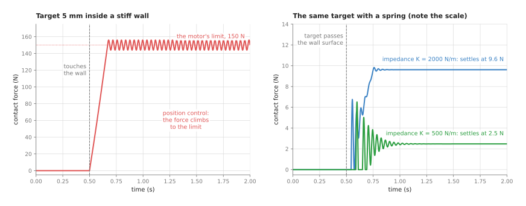
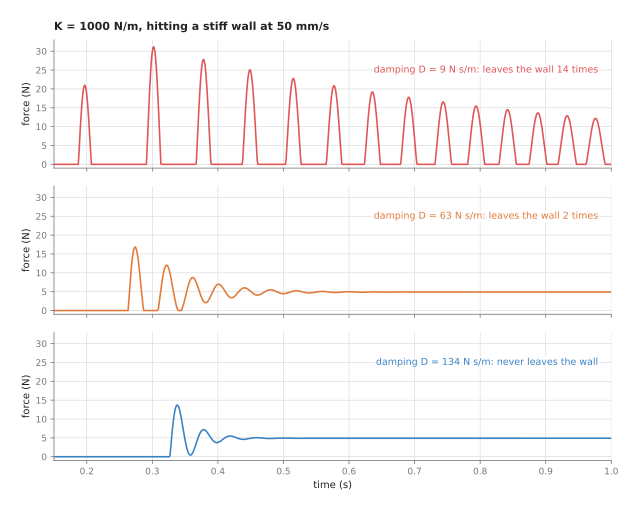
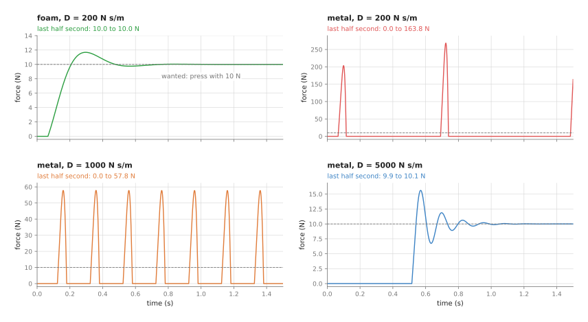
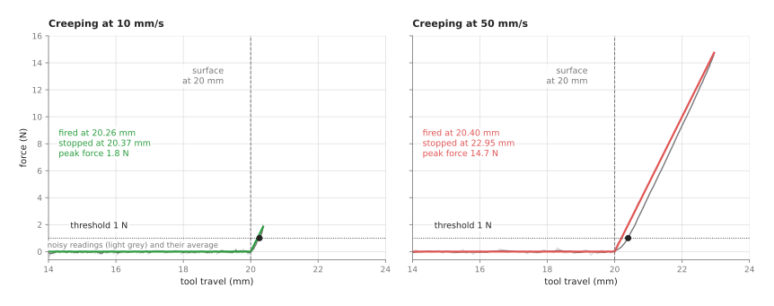

# Impedance and force control

This page explains impedance and force control, which are the techniques that decide
how an arm behaves when it touches something. It answers four questions. Why does an
ordinary position controller push so hard in contact, and how do you make an arm
behave like a spring instead? How do you find a surface safely by touch, and why does
a compliant arm sometimes bounce or buzz against a hard surface?

It is written for a reader who has read the [overview](../01_overview.md) of this
chapter and the [PID control](../02_most-used/01_pid-control.md) page. You also need
to know what a force in newtons (N) is, and that a spring pushes back harder the
further it is squeezed. Every number on this page comes from a real run of the diagram
script, `docs/diagrams/control_and_motion.py`, which simulates a tool pressing on a
surface.

Contact is where most hard arm tasks are decided. Examples are inserting a peg,
pressing a connector home, putting a part down on a table whose height is not quite
known, and wiping a surface. A good plan and a good trajectory do not help with any of
those, because what helps is choosing what the arm does when it meets resistance.

## Contents

1. [What this page answers](#1-what-this-page-answers)
2. [The idea in one sentence](#2-the-idea-in-one-sentence)
3. [How it works, step by step](#3-how-it-works-step-by-step)
   · [The tool and the wall in the examples](#the-tool-and-the-wall-in-the-examples)
   · [Why a position controller pushes too hard](#why-a-position-controller-pushes-too-hard)
   · [The impedance law: a spring and a damper](#the-impedance-law-a-spring-and-a-damper)
   · [Choosing the damping](#choosing-the-damping)
   · [Impedance and admittance: two ways to build it](#impedance-and-admittance-two-ways-to-build-it)
   · [Guarded moves: stop when you feel it](#guarded-moves-stop-when-you-feel-it)
   · [Force limits, and direct force control](#force-limits-and-direct-force-control)
   · [The steps as pseudocode](#the-steps-as-pseudocode)
4. [Where it is used on a robot arm](#4-where-it-is-used-on-a-robot-arm)
5. [Where it is useful, and where it is not](#5-where-it-is-useful-and-where-it-is-not)
6. [Libraries that provide it](#6-libraries-that-provide-it)
7. [Why impedance and force control, and what it costs](#7-why-impedance-and-force-control-and-what-it-costs)
8. [The learned alternative](#8-the-learned-alternative)
9. [Where to read next](#9-where-to-read-next)
10. [Using it in Python](#10-using-it-in-python)

---

## 1. What this page answers

The [PID control](../02_most-used/01_pid-control.md) page builds a loop that drives a
joint to a target angle and holds it there. That loop is excellent in free space, but
in contact it has a serious fault.

Suppose the target is one millimetre inside a table. The table does not move, so the
controller sees an error it cannot remove. Its integral term therefore keeps growing,
so it pushes harder and harder, until the motor reaches its limit or something breaks.
This is not a bug, because it is exactly what a position controller is for. The Book 3
page
[controlling the move](../../../03_frameworks/03_arm-movement/04_controlling-the-move.md#4-position-stiffness-and-force)
calls it the most important single idea in the whole area.

So the fix is to stop commanding only a position, and to command how the arm should
respond to force instead. This page shows three ways of doing that:

- **impedance control**, which makes the arm behave like a spring and a damper with
  a stiffness you choose
- **admittance control**, which gives the same behaviour on an arm that only accepts
  position commands, by reading a force sensor
- **guarded moves**, which move until a force is felt and then stop

It also shows the two ways these go wrong, which are bouncing off a hard surface and
buzzing against it.

---

## 2. The idea in one sentence

Since the fix is to command a response to force, here is the main technique in one
sentence. Impedance control sets the force the arm applies to be a stiffness times the
distance from where it was told to be, minus a damping times its speed, so that
unexpected contact produces a small, chosen force instead of an ever-growing one.

Here is an everyday example of the same idea, putting a plate into a dish rack without
looking. You do not hold your arm rigid and drive the plate to where you think the
slot is. If you did, and you were a few millimetres out, you would push the plate hard
into a prong. Instead you hold your wrist loosely. Then when the plate
touches a prong, it pushes your hand a little to one side, and the plate slides into
the slot. In other words, your arm is acting as a soft spring around the place you
aimed for. So a stiff arm needs perfect aim, while a soft one only needs to be
close.

---

## 3. How it works, step by step

### The tool and the wall in the examples

Because the effects are easiest to see on one example, the simulations on this page
all use a single straight line of motion, with a tool moving towards a wall.
Everything below happens along that one line.

- The tool, together with the part of the arm that moves with it, has a mass of
  2 kg.
- The wall is stiff: it pushes back with 50 N for every millimetre the tool presses
  into it. That is 50,000 newtons per metre (N/m). Real metal is stiffer still, but the
  arm, the sensor and the gripper all bend a little, and together they behave like a
  spring about this stiff.
- The tool starts 10 mm in front of the wall. Its target moves towards the wall at
  20 mm/s and stops 5 mm inside it. So the target asks for something impossible, as
  it would if the wall were 5 mm closer than the camera thought.

### Why a position controller pushes too hard

The first thing to see is what goes wrong without any of these techniques. The left
panel of the picture below uses a stiff PID position loop, running 1,000 times a
second, like the one inside an ordinary joint drive. Here the motor can push with at
most 150 N.



The tool touches the wall at 0.5 s. Then the force rises steeply, passes 140 N at
0.66 s, and stays at the motor's limit of 150 N, ringing a little. If the motor had no
limit at all, the integral term would keep pushing until the tool was 5 mm into the
wall, which for this wall means 250 N.

The right panel uses impedance control on the same task, with two stiffness settings,
and note that its scale is ten times smaller. With a stiffness of 2,000 N/m the force
settles at 9.6 N, while with 500 N/m it settles at 2.5 N. The target is just as
impossible as before, so the difference is that the force no longer depends on how
hard the motor can push. Instead it depends on a number you chose.

There is still a first spike in each impedance run, up to 6.5 N with 500 N/m. That is
the impact, because the tool arrives at 20 mm/s and has to stop. But a slower approach
makes it smaller, as the guarded move section shows.

### The impedance law: a spring and a damper

The law behind that right panel is short, because the impedance controller computes
the force to apply from only two terms:

```
force = K × (target_position − position) − D × speed
```

**K** is the **stiffness**, in newtons per metre. It says how hard the arm pushes back
for each metre it is away from its target, so a high K is a stiff arm and a low K is a
soft one.

**D** is the **damping**, in newton seconds per metre (N s/m). It is a force against
the speed, in the way that moving through thick oil resists you, and it is what stops
the spring from bouncing.

This looks like a PD controller from the [PID page](../02_most-used/01_pid-control.md),
and in form it is. But the difference is in purpose and in size. A position PD loop
uses the largest gains that stay stable, so that the arm reaches its target whatever
resists it. An impedance controller, in contrast, chooses K and D to be a particular
spring, often a soft one. It also has no integral term, because the whole point is
that it does not insist on reaching the target.

Here is one tick of that law worked by hand, with K = 500 N/m and D = 44.3 N s/m. The
tool is 2 mm short of its target and moving towards it at 10 mm/s.

- The spring term is 500 × 0.002 = 1.0 N, towards the target.
- The damping term is 44.3 × 0.010 = 0.443 N, against the motion.
- The force to apply is 1.0 − 0.443 = 0.557 N.

Where does the final force in the simulation come from? At rest the arm's spring and
the wall form two springs in a line, and the arm is set 5 mm too far. So the force
is

```
force = (K × wall_stiffness) ÷ (K + wall_stiffness) × 5 mm
```

For K = 500 N/m that is (500 × 50,000) ÷ 50,500 × 0.005 = 2.48 N, and the tool sits
0.05 mm into the wall, while for K = 2,000 N/m it is 9.62 N. When the wall is much
stiffer than the arm's spring, the answer is close to K times the error, which is
500 × 0.005 = 2.5 N. So you can choose the largest force a given position error will
cause, just by choosing K.

On a real arm the law is usually written for the tool in all six directions, three
along the axes and three around them. Each direction then gets its own stiffness and
damping, so the arm can be stiff sideways and soft along the tool, for example. The
force at the tool is turned into joint torques using the **Jacobian**, which is the
table of numbers that relates small joint movements to small tool movements. The
[numerical inverse kinematics](../../06_planning-and-search/02_most-used/02_numerical-inverse-kinematics.md)
page explains it. The controller also adds the torque needed to hold the arm up
against gravity, taken from a model of the arm. So if that model is wrong, the arm
drifts as soon as it is made soft.

### Choosing the damping

Choosing K sets the force, but D still has to be chosen, because a spring with too
little damping bounces. On an arm that means the tool hits the surface, bounces off,
hits it again, and so on.

So a common rule sets the damping from the stiffness and the mass:

```
D = 2 × ζ × √(K × mass)
```

Here the number ζ (the Greek letter zeta) is the **damping ratio**. At ζ = 1 the spring
returns to rest as fast as it can without swinging past, which is called **critical
damping**, while below 1 it swings and above 1 it creeps.

The picture below shows the tool hitting the stiff wall at 50 mm/s under impedance
control with K = 1,000 N/m and three different damping values.



With D = 9 N s/m (ζ = 0.1) the tool leaves the wall 14 times in the first second, and
the force peaks at 31 N each time it hits. With D = 63 N s/m (ζ = 0.7) it leaves the
wall twice, while with D = 134 N s/m (ζ = 1.5) it never leaves at all. But all three
end at the same steady force of 4.9 N, because the damping only acts while the tool is
moving.

The middle case is worth a closer look. A damping ratio of 0.7 is a common choice for
free motion, and it is well damped for the arm's own spring of 1,000 N/m. But once the
tool touches the wall, it is sitting on the wall's spring, which is 50 times stiffer,
and for that much stiffer spring the same damping is far too little. So a damping that
is right in free space is too small in contact with something hard. This means that on
a real arm the damping is set with the stiffest surface in mind, or else raised when
contact is detected.

### Impedance and admittance: two ways to build it

The law and its two numbers are the same whatever the hardware, but there are two ways
to build the behaviour, and they need different hardware. Book 3's
[holding on](../../../03_frameworks/02_gripping/05_holding-on.md#3-compliance-impedance-and-admittance)
compares them in a table, and in short they work like this.

**Impedance control** measures the arm's position and commands a force. It is the law
above, sent as joint torques. So it needs an arm whose joints accept torque commands,
which in practice means an arm with torque sensing in every joint or very good motor
current control. But it behaves well against stiff surfaces, because the torque loop
is fast.

**Admittance control** goes the other way, measuring a force and commanding a position.
A force-torque sensor at the wrist reads the contact force. Then the controller works
out how a virtual mass, spring and damper would move under that force, and it sends the
result as a position target to an ordinary position-controlled arm. This means it
works on nearly any industrial arm with a sensor bolted on, which is why the
open-source ROS 2 stack ships an admittance controller and not an impedance one.

But admittance has a known weakness, which the simulation below reproduces. The loop
through the force sensor and the arm's position controller has delay in it. Here the
sensor is read 500 times a second with a delay of 8 milliseconds, while the arm's own
position loop takes a few tens of milliseconds to follow a new target. The task is
to press on a surface with 10 N.



On foam, which gives 2 N per millimetre, a damping of 200 N s/m works well, because
the force settles at 10 N within about 0.2 s of touching. But on metal, which is 100
times stiffer, the same setting hits the surface with 268 N and bounces off. A damping
of 1,000 N s/m still bounces on and off the surface about five times a second, with
peaks of 58 N, so only 5,000 N s/m settles, at 10 N.

The reason for all of that is the delay. Against a stiff surface a tiny movement makes
a large change in force. So by the time the controller reads that force and the arm
responds, the tool has already moved further, which makes each correction too large
and too late. More damping makes each correction smaller and slower, which is why it cures
the problem. This agrees with Book 3, because the fix for an admittance controller that
chatters against metal is more damping, not more force resolution.

But the cure has a price, and the same simulation shows it. With 5,000 N s/m of damping
the arm approaches the surface at only 2 mm/s, because the push of 10 N divided by the
damping gives that speed. On foam, the same setting has reached only 1.8 N after one
second, 4.5 N after two, and 6.3 N after three. So a setting that is safe on a hard
surface is slow on a soft one.

### Guarded moves: stop when you feel it

Impedance and admittance both shape a whole response, but the simplest force technique
of all is a **guarded move**. The arm moves slowly in one direction and stops as soon
as a sensor reading passes a threshold, so it is how an arm finds a surface whose
position it does not know exactly.

The picture below simulates one. The arm creeps towards a surface 20 mm away, and that
surface gives 5 N per millimetre, like a plastic part. The force sensor is read 500
times a second, with some noise, and the last 5 readings are averaged. Then when the
average passes 1 N, the arm waits one tick and brakes at 0.5 m/s².



At 10 mm/s the sensor fires at 20.26 mm, the arm stops at 20.37 mm, and the largest
force is 1.8 N. At 50 mm/s it fires at 20.40 mm, but the arm needs 2.5 mm to brake from
that speed and stops at 22.95 mm. So the largest force is 14.7 N, eight times as
much.
This happens because the braking distance grows with the square of the speed, so going
five times faster costs 25 times the braking distance.

So three rules follow from that, and Book 3's section on
[guarded moves](../../../03_frameworks/03_arm-movement/04_controlling-the-move.md#5-guarded-moves-and-what-the-sensor-can-actually-observe)
states them in full.

- The measurement comes from the joint encoders, not from the force sensor. The sensor
  only says when. The position at that moment says where.
- The threshold must be lower than the force that moves or damages the object. The
  sibling project that pushes drinking glasses,
  [plan, feel, look again](https://github.com/RobinNagpal/robot-arm-projects/blob/main/v5-pick-glasses/docs/problem-3/solutions/03-plan-feel-look-again.md),
  creeps at 10 mm/s and stops at 0.1 N, because the lightest glass starts to slide at
  about a quarter of a newton. Its fingers found one glass after 19.4 mm of creeping,
  a number no camera had predicted.
- Always set a travel limit. If nothing is there, the sensor never fires, and without a
  limit the arm keeps going. In the simulation, with no surface at all, the arm stops at
  the 50 mm travel limit.

### Force limits, and direct force control

Impedance control makes the force predictable, but a large position error can still
make a large force, so two more tools keep the force inside a safe range.

So a **force limit** clips the force the controller will ever command, just as the PID
page clips torque. With impedance control you can also limit the distance between the target
and the actual position. So with K = 500 N/m and at most 20 mm of difference allowed,
the spring can never push harder than 500 × 0.020 = 10 N, however wrong the target is.

**Direct force control** commands a force instead of a position along some directions,
and the usual example is "press down with 20 N while following this path across the
surface". Along the pressing direction a PI loop acts on the force error, while along
the other directions an ordinary position or impedance loop follows the path. This mix
is called **hybrid force-position control**, and it is what wiping, sanding and
polishing need.

But one thing is not force control at all. A collaborative arm's safety function,
which stops the arm when it detects an unexpected force, is a monitor with a threshold.
It acts by stopping rather than by giving way, and it can fire in the middle of a
planned insertion. Book
3's [holding on](../../../03_frameworks/02_gripping/05_holding-on.md#3-compliance-impedance-and-admittance)
makes this point, and it is easy to confuse the two.

### The steps as pseudocode

Once all three techniques are clear, each of them fits in a few lines. The pseudocode
below shows one tick of each, for one direction of motion, and it works in any
language. On a real arm each quantity has six parts, one per direction, and the
impedance force is turned into joint torques with the Jacobian.

```
# impedance control: needs an arm that accepts torque or force commands
every tick:
    x = measured tool position
    v = measured tool speed
    force = K * (target - x) - D * v
    force = clip(force, -force_limit, force_limit)
    send force (as joint torques, plus gravity compensation)

# admittance control: needs a force sensor and a position-controlled arm
set x_cmd = current position, v_cmd = 0
every tick:
    f = measured contact force            # pushing back on the tool
    push = wanted_force - f               # or K * (target - x_cmd) - f
    accel = (push - D * v_cmd) / M        # a virtual mass M and damper D
    v_cmd = v_cmd + accel * tick_length
    x_cmd = x_cmd + v_cmd * tick_length
    send x_cmd to the arm's position controller

# guarded move
set start = current position
command a slow, steady speed in the search direction
every tick:
    f = average of the last few force readings
    if f > threshold:
        stop the arm
        return "contact", position at this tick
    if distance from start > travel_limit:
        stop the arm
        return "nothing found"
```

---

## 4. Where it is used on a robot arm

Because contact is where the position of things stops being known exactly, these
techniques turn up wherever an arm touches its work, and the list below gives the main
places.

**Inserting a part.** A peg that must go into a hole with less clearance than the arm's
accuracy is the classic case. The arm is made soft sideways and moderately stiff along
the peg, so when the peg meets the edge of the hole, the side force pushes it towards
the centre and it slides in. Book 3's
[controlling the move](../../../03_frameworks/03_arm-movement/04_controlling-the-move.md#4-position-stiffness-and-force)
lists the jobs compliance suits.

**Putting something down.** The height of the table under a part is never known
exactly. So a guarded move lowers the part until the force rises, and then the arm
stops and opens the gripper. With impedance control the part is placed gently even if the table
is a few millimetres higher than expected.

**Finding things by touch.** A guarded move measures a height, finds the edge of a
part, or confirms that a part is present. So the glass-pushing project above uses it
for every contact.

**Pressing a connector home.** The force during the last millimetre tells you whether it
seated, because a sharp rise and then a drop is a click. A force limit then stops the
arm pushing on if it jammed instead.

**Wiping, sanding and polishing.** Hybrid force-position control holds a set force on a
surface the arm cannot model exactly. But for fast work the force loop often lives in a
spring-loaded flange between the arm and the tool rather than in the arm, as
[controlling the move](../../../03_frameworks/03_arm-movement/04_controlling-the-move.md#4-position-stiffness-and-force)
explains, because a heavy arm cannot correct fast enough.

**Hand guiding.** A person pushes the arm to show it a pose, so the arm is made very
soft, with gravity compensation so that it does not sag, and it follows the push.

**Gripping.** A gripper's squeeze is a crude kind of force control, because the fingers
close until the motor current reaches a limit. Book 3's
[holding on](../../../03_frameworks/02_gripping/05_holding-on.md#2-what-force-control-a-gripper-actually-gives-you)
explains why that limit is not the same as a force.

---

## 5. Where it is useful, and where it is not

The uses above all share one condition, because these techniques are useful whenever
the arm touches something whose position is not known precisely. But they do not help
in free space, and they cannot make up for missing hardware.

The table below lists the common problems. Read each row as one situation, giving the
sign you would see and what people use instead or add to fix it.

| Situation | The sign you would see | What people use instead or add |
| --- | --- | --- |
| Admittance control against a stiff surface | the tool bounces or buzzes on the surface, often loudly | more damping; a softer tool or pad; impedance control on a torque-controlled arm |
| Too little damping for the contact | the force trace shows repeated peaks with zero force between them | set the damping for the stiffest surface, or raise it on contact |
| A soft arm holding a heavy tool | the tool sags below its target | accurate gravity compensation; stiffer settings in the vertical direction |
| A wrong mass model | the arm drifts or creeps as soon as it is made soft | identify the arm's masses; a [learned arm model](../../../07_learned-models/09_touch-and-body-models/03_also-used/02_learned-arm-models.md) for the leftover error |
| A guarded move that is too fast | a large force spike and a stop well past the surface | slow down near the expected surface; lower the braking latency |
| A threshold above the force that moves the object | the object slides away and the move never fires | lower the threshold, above the sensor noise; average the readings |
| A contact on an axis the sensor does not measure | the guarded move never fires, and never reports an error | watch every axis the contact could appear on; always set a travel limit |
| Needing both accuracy and softness at once | a stiff arm that pushes too hard, or a soft one that misses | stiff in some directions and soft in others; switch settings between phases |
| No force sensor and no torque-controlled joints | there is nothing to measure force with | motor current as a rough force estimate; a compliant pad or flange on the tool |

The row about the axis the sensor does not measure is the most dangerous one, because
nothing looks wrong when it happens. Book 3's
[section on guarded moves](../../../03_frameworks/03_arm-movement/04_controlling-the-move.md#5-guarded-moves-and-what-the-sensor-can-actually-observe)
gives three concrete cases.

---

## 6. Libraries that provide it

The open-source choice is narrower here than for the other techniques in this chapter,
because contact control needs hardware support. The table below lists the well-known
options. Read each row as one library, giving the languages it is used from, the
controller or class, and a note on what it offers. Book 3's
[holding on](../../../03_frameworks/02_gripping/05_holding-on.md#31-what-ros-2-actually-ships)
gives the licences and how active each project is.

| Library | Languages | Controller or class | Note |
| --- | --- | --- | --- |
| ros2_controllers | C++, configured from YAML | `admittance_controller`, `force_torque_sensor_broadcaster` | admittance control for a position-controlled arm with a wrist sensor; there is no impedance controller in upstream ros2_controllers |
| FZI cartesian_controllers | C++, configured from YAML | `cartesian_compliance_controller`, `cartesian_force_controller`, `cartesian_motion_controller` | Cartesian compliance and force control as ros2_control plugins |
| crisp_controllers | C++, configured from YAML | Cartesian impedance and operational-space controllers | for any arm with an effort (torque) interface |
| franka_ros2 and libfranka | C++ | example impedance controllers; `franka::Robot::control` with a torque callback | joint and Cartesian impedance on Franka arms, which sense torque in every joint |
| Pinocchio | C++, Python | `computeGeneralizedGravity`, `computeJointJacobians`, `getFrameJacobian` | the gravity torque and the Jacobian that an impedance controller needs |
| MoveIt 2 | C++, Python | none | plans collision-free motion only; it has no force control |

A guarded move needs no special library at all. It is only a loop over the force
sensor's topic, such as the one published by `force_torque_sensor_broadcaster`, with a
stop command and a travel limit.

Simulators, however, deserve a warning. In a simulator the stiffness of a contact is a
solver setting that nobody measured, so a compliance controller tuned against a
simulated contact has been tuned against an invented number. Book 3's section on
[compliance and contact stiffness in simulation](../../../03_frameworks/02_gripping/05_holding-on.md#103-compliance-and-contact-stiffness-whose-numbers-are-invented)
explains this, and it applies to every simulation on this page too: the wall
stiffnesses here were chosen to show the effects clearly, not measured.

---

## 7. Why impedance and force control, and what it costs

To put all of the above together, impedance control makes the arm apply a force equal
to a chosen stiffness times its distance from the target, minus a chosen damping times
its speed. Admittance control gives the same behaviour through a force sensor and a
position-controlled arm, while a guarded move simply stops when a force threshold is
passed. Together they let an arm touch things without knowing exactly where they are,
with forces you chose in advance.

The obvious alternative is to make the positions accurate enough that contact is never
a surprise, by calibrating the camera better, measuring the table and building a precise
fixture. That works, and in a factory with fixed parts it is often the right answer. But
it moves the cost into calibration and fixtures, and a 5 mm error, as the simulation
shows, turns a position controller into a 150 N press. So compliance is chosen because
being close and soft is cheaper than being exact and stiff.

The second alternative is a stiff position controller with a force limit, so that it
cannot push past a set force. That is simple, and a gripper does exactly this. But the
limit acts only at the extreme, because below it the arm is as stiff as ever, and a
sideways error still jams a peg rather than guiding it in. Impedance control, in
contrast, shapes the whole response rather than only its maximum.

The costs are these. You need the right hardware, meaning a wrist force sensor for
admittance or torque-controlled joints for impedance. You also need an accurate model of
the arm's masses, or the arm drifts when it is made soft. A soft arm is in any case an
inaccurate arm, because any load pushes it off target. Stiffness and damping must be
tuned for the stiffest surface the arm will meet, so a setting that is safe on metal is
slow on foam. And outside ROS 2's admittance controller, much of this is code you write
yourself or buy from the arm's maker, as Book 3 warns.

---

## 8. The learned alternative

Because the right reaction to a force can be hard to write down, the learned
alternative for contact is a
[reinforcement learning policy](../../../07_learned-models/06_movement-models/03_also-used/01_reinforcement-learning-policies.md),
which learns by trying, usually in simulation, how to react to the force it
feels; Book 6's worked example pushes a peg into a tight hole. It wins when the
right reaction depends on forces too complicated to write rules for, the task is
easy to score, and the contact can be simulated. Impedance control with a
hand-written search pattern still wins when it is good enough, which is often,
because it is easy to understand and check and needs no simulator, reward or
training; it also wins when the contact cannot be simulated. A policy does not
replace the force limits either, because nothing inside it stops it pushing too
hard, so a programmed layer under it still limits forces and speeds. Book 7's
[force and slip models](../../../07_learned-models/09_touch-and-body-models/02_most-used/01_force-and-slip-models.md)
and [collision and failure detection](../../../07_learned-models/09_touch-and-body-models/02_most-used/02_collision-and-failure-detection.md)
read the same force signals with learned models, to catch slip and unexpected
contact. For tuning the stiffness and damping of the impedance controller itself,
Book 7's
[Bayesian optimisation](../../../07_learned-models/02_classical-machine-learning/02_most-used/03_gaussian-processes-and-bayesian-optimisation.md)
chooses each next setting to try from the scores of the tries so far, so a good
setting is found in a few tens of real insertions.

---

## 9. Where to read next

- [PID control](../02_most-used/01_pid-control.md) is the position loop this page modifies, and the loop
  inside an admittance controller's arm.
- [Trajectory generation](../02_most-used/02_trajectory-generation.md) brings the arm to the start of the
  contact phase slowly and smoothly.
- [Finite state machines](../../08_decisions-and-task-logic/02_most-used/01_finite-state-machines.md)
  are the usual way to switch between free motion, a guarded move, and pressing.
- Book 3's [controlling the move](../../../03_frameworks/03_arm-movement/04_controlling-the-move.md)
  and [holding on](../../../03_frameworks/02_gripping/05_holding-on.md) cover the same ideas
  with the ROS 2 packages, licences and hardware.

---

## 10. Using it in Python

Section 3 wrote the impedance law as a spring and a damper, explained how to choose the
damping, and separated impedance from admittance. Section 6 then showed that the
ready-made controllers are C++ plugins configured from YAML, which means there is no
Python function called `impedance_control` to call. This section shows what the law
itself looks like in Python, so that after reading it you can see which parts a library
provides and which parts are the two lines of algebra that stay yours.

The example uses Pinocchio for the geometry, because the impedance law needs the tool's
position and the Jacobian, which is the matrix that relates joint speeds to tool speeds.

```python
import numpy as np, pinocchio as pin

model = pin.buildModelFromUrdf("arm.urdf")
data = model.createData()
tip = model.getFrameId("tool0")           # the frame the stiffness is measured at

K = np.diag([800.0, 800.0, 300.0])        # stiffness, newtons per metre, per axis
D = np.diag([40.0, 40.0, 25.0])           # damping, newton seconds per metre

while running:
    q, v = read_joint_angles(), read_joint_speeds()
    pin.forwardKinematics(model, data, q, v)
    pin.updateFramePlacements(model, data)
    x = data.oMf[tip].translation                    # where the tool really is
    J = pin.computeFrameJacobian(model, data, q, tip,
                                 pin.LOCAL_WORLD_ALIGNED)[:3]   # the position rows only
    f = K @ (x_wanted(t) - x) - D @ (J @ v)          # the spring and damper of section 3
    tau = J.T @ f + pin.computeGeneralizedGravity(model, data, q)
    send_joint_torques(tau)
```

What the library does for you is the geometry. `forwardKinematics` with
`updateFramePlacements` works out where every frame of the arm is for the current joint
angles, `computeFrameJacobian` gives the matrix that turns a force at the tool into
joint torques when you transpose it, and `computeGeneralizedGravity` gives the torque
that holds the arm up so that the spring does not have to. Writing any of those three
by hand for a six-joint arm is a long job and an easy one to get wrong.

What you write is the law in the middle, and it really is only the two lines that
compute `f` and `tau`. You also write `x_wanted`, which is the position the spring
pulls towards and which normally comes from the trajectory generator, and you write
the reading and the sending. Guarded moves,
as section 3 describes them, need no library at all: they are a loop over the force
reading with a stop command and a travel limit.

There is one hard requirement behind all of this. The arm has to accept joint torques,
because impedance control works by commanding torque. On a position-controlled arm you
cannot run this code, and you write admittance instead, which means reading a wrist
force sensor and moving the position target. For that case `ros2_controllers` ships
`admittance_controller`, but it is a C++ plugin whose stiffness and damping you set in
a YAML file, so your Python only publishes the target and reads the state.

What you have to decide or measure is the list of numbers in `K` and `D`, and the frame
they are written in. Section 3 explains that each direction gets its own stiffness, so
that the direction pressing into a surface can be soft while the others stay stiff, and
that the damping then follows from the stiffness and the mass through
`D = 2 × ζ × √(K × mass)`. It also warns that a damping which is right in free space is
too small the moment the tool touches something hard, so you set it with the stiffest
surface in mind. Both matrices are expressed in the frame that
`pin.LOCAL_WORLD_ALIGNED` gives, which is the world's orientation at the tool, so if you
want stiffness along the tool's own axis you must either rotate `K` or ask for a
different frame convention. One more measurement is easy to forget: a wrist force
sensor reads the weight of the tool bolted to it, so you measure that reading with the
tool hanging in free air and subtract it, or every force you compute will be wrong by
the tool's weight.
