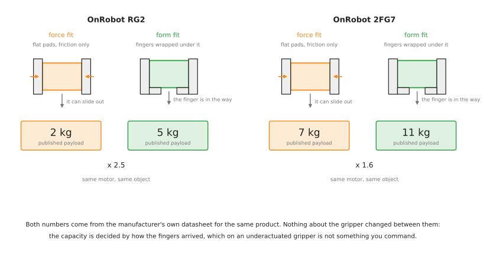

# Gripping: holding an object so that it can be moved

Perception has finished. You know where the object is, roughly how big it is, and
which way it is turned. The arm has not moved yet. Between those two facts sits a
question with its own hardware, its own arithmetic and its own failure modes:
**what, physically, is going to hold this thing, and will it still be holding it
when the arm stops.**

This area is that question, in six documents. This one is the map: the six ways a
robot can hold something, what your task actually needs, what a grip has to
survive, and the three facts that decide everything downstream — that a rated
payload is a static number, that the force you command is not the force the
object gets, and that the sensor which says "holding" cannot say "holding the way
you planned".

## Who this is for, and what it is for

This is written for someone who has read the [object perception
area](../06_object-perception/01_overview.md) or knows the equivalent, and now
has to choose a gripper and a gripping strategy for a real project. You do not
need to have used a force sensor. Every term is explained where it first appears.

Three boundaries keep this area from swallowing its neighbours.

**Finding the object is not here.** Everything about cameras, depth sensors,
masks, poses and what they cost in millimetres belongs to [object
perception](../06_object-perception/01_overview.md). This area starts with a
measurement already in hand and asks what to do with it.

**Moving the arm is not here either.** Planning a path to the grasp pose,
avoiding the table on the way in, and carrying the object afterwards belong to
[arm movement](../08_arm-movement/01_overview.md). Where the two meet — a grasp
that is geometrically perfect and kinematically unreachable — is called out in
[section 7](#7-the-three-things-every-tutorial-leaves-out) and again in
[choosing a grip](03_choosing-a-grip.md).

**What is here is the interval between them.** The fingers approach, they close,
the object is held, the weight transfers to the wrist, and the grip survives
everything the move does to it. That interval is where most pick-and-place
failures actually happen, and it is the least written-about part of the pipeline.

Everything below carries the same three commitments the perception area makes.
Every technique and every model family has five jobs it suits and five it cannot
do, because almost everything in this field works on the demonstration its
authors chose. Every licence was read from the project's own licence file, which
in this area catches out more people than in any other, for reasons
[section 1 of licences and platforms](07_licences-and-platforms.md#1-licences-and-the-four-traps-in-this-area)
sets out. And everything says whether it runs on an Apple Silicon Mac without an
NVIDIA graphics card, because a large part of the grasp-model literature quietly
assumes one.

## Contents

1. [Where gripping starts and where it stops](#1-where-gripping-starts-and-where-it-stops)
2. [The six ways to hold something](#2-the-six-ways-to-hold-something)
3. [What your task actually needs](#3-what-your-task-actually-needs)
4. [What a grip has to survive](#4-what-a-grip-has-to-survive)
5. [Two payloads for one gripper](#5-two-payloads-for-one-gripper)
6. [What you know before you close the fingers](#6-what-you-know-before-you-close-the-fingers)
7. [The three things every tutorial leaves out](#7-the-three-things-every-tutorial-leaves-out)
8. [Knowing how much force was applied](#8-knowing-how-much-force-was-applied)
9. [The six documents that follow](#9-the-six-documents-that-follow)

---

## 1. Where gripping starts and where it stops

A pick-and-place cycle is usually drawn as a straight line: look, plan, move,
close, lift, move, open. The line hides the fact that "close" is not one event
and "lift" is not a separate one.

Written out at the level the hardware actually works at, a pick is seven steps.

1. The fingers are opened to a width chosen in advance, because opening them
   after the arm has arrived costs time and sometimes collides with the table.
2. The arm approaches along a direction chosen so that the fingers pass either
   side of the object rather than into it.
3. The fingers close, and stop either at a commanded position or on contact.
4. The gripper reports whether it stopped because it found something.
5. The arm lifts, and the wrist takes the weight.
6. The grip is checked against what was expected, because step 4 answers a
   weaker question than it appears to.
7. The arm moves, and the grip has to survive the acceleration.

Steps 1, 3, 4, 6 and 7 belong to this area. Step 2 and the second half of step 7
belong to [arm movement](../08_arm-movement/01_overview.md). The measurement that decided the
width in step 1 came from [object
perception](../06_object-perception/01_overview.md).

The reason to draw the boundary here rather than anywhere else is that steps 3 to
7 share one instrument — the force the gripper applies and the force the wrist
feels — and one arithmetic, which is the friction arithmetic in
[choosing a grip](03_choosing-a-grip.md). Nothing before step 3 uses either.

## 2. The six ways to hold something

There are six mechanisms in industrial use, and they are not variations on each
other. Each exploits a different physical principle, and the principle decides
what the object has to be like.

**Parallel jaw and adaptive fingers** hold by squeezing. Two or three fingers
close on the object and friction between the pads and the surface resists gravity.
This is the default, it works on almost anything rigid, and it needs two roughly
opposed surfaces that the fingers can reach.

**Suction** holds by pressure difference. A cup is sealed against the object, the
air inside is removed, and the atmosphere outside pushes the object onto the cup.
It needs one reachable patch that is flat enough, smooth enough and airtight
enough to seal against. It needs no access to the sides at all, which is why it
dominates palletising and warehouse picking.

**Magnetic** holds by magnetic attraction. It needs the object to be
ferromagnetic, which in practice means steel or iron and not aluminium, copper,
brass or stainless steel of the austenitic grades. Where it applies it is
extremely strong for its size and needs no seal and no fingers.

**Soft and compliant grippers** hold by wrapping. A pneumatic or elastomeric
finger inflates around the object and conforms to whatever shape it meets. The
contact pressure is low and spread out, which is why these handle food and
fragile goods. They are slow compared with a jaw, and their grip strength is
modest.

**Multi-finger hands** hold by arranging several independently controlled fingers
around the object. They can do things no two-finger gripper can — hold a tool and
then use it, change the grasp without putting the object down — and they cost an
order of magnitude more, need far more control software, and are still rare
outside research.

**Custom tooling** holds by being shaped like the thing. A hook, a mandrel that
goes inside a bore, a shaped nest, a clamp that fits one part and nothing else.
This is the cheapest and most reliable option when the part mix is fixed, and it
is what a large fraction of working automation actually uses. It is also the one
nobody writes tutorials about.

The table below is those six against the property of the object that decides
whether each one can be used at all. Read the last column as the disqualifying
condition: if it is true of your object, that row is out, whatever else is
attractive about it.

| Mechanism | Holds by | Needs the object to have | Ruled out when |
| --- | --- | --- | --- |
| parallel jaw | friction between pads | two opposed reachable faces | the object is flush against a wall or its neighbours |
| suction | atmospheric pressure | one flat, smooth, airtight patch | the surface is porous, ribbed, oily or curved tightly |
| magnetic | magnetic attraction | ferromagnetic material | it is aluminium, plastic, glass or most stainless |
| soft | conforming wrap | a shape a finger can curl round | the object is heavy, or must be located precisely |
| multi-finger | several contacts at once | nothing in particular | the budget, or the control software, is not there |
| custom tooling | its own shape | being always the same part | the part mix changes |

## 3. What your task actually needs

People choose a gripper by reading gripper reviews, which sorts them by how
impressive the gripper is. Real cells choose the other way round: the task
dictates a mechanism, usually within about a minute, and the interesting question
is what that mechanism then costs you elsewhere.

The table is real task types against what they genuinely use. Read the last
column carefully — it is where the effort usually goes that need not have.

| Task | What it uses | What it skips, and why |
| --- | --- | --- |
| **palletising boxes** | a suction array on a large plate | no grasp planning, no force control. A carton has one enormous flat top and nothing grippable on the sides |
| **warehouse picking from totes** | suction first, two fingers as a fallback | no pose, no force closure reasoning. Suction needs one reachable patch, where fingers need two opposed ones and room between them |
| **machine tending** | two parallel grippers, often on one wrist | no grasp search at all. The part is in a fixture, so the grip is taught once and repeated |
| **press and sheet-metal tending** | magnetic, or suction | fingers entirely. A flat sheet has no sides to get round |
| **electronics and connector assembly** | small parallel jaws with custom fingertips | no grasp model. The pick is trivial and the whole difficulty is the insertion, which is force control |
| **food and produce handling** | soft grippers, or food-grade suction cups | metal fingers, and usually force sensing. The binding constraints are the wash-down rating and the bruising limit |
| **fruit picking in the field** | soft or suction, with a separate stem cutter | force closure on the fruit itself. You detach it rather than pull it |
| **[the glass case study](../10_one-arm-training/07_case-study/01_place-glass.md)** | two fingers, with a squeeze cap per kind of glass | no learned grasp model. The grip is a sentence about the shape |
| **laboratory and mixed research work** | a two-finger gripper and a wrist force sensor | suction, because the objects are too varied to seal against |

Three things follow from that table, and each of them saves work.

**Most working cells do not plan a grasp.** They repeat one. When the part is
fixtured, or the same carton arrives every time, the grip was decided by a person
at commissioning and the robot only executes it. Grasp planning is what you reach
for when fixturing has lost the argument, in exactly the way perception is what
you reach for when the same has happened to the part's position.

**The gripper choice decides the perception requirement, not the other way
round.** A suction cup needs to know where one flat patch is and its surface
normal, which a depth image gives directly and cheaply. Two fingers need to know
the object's width, its orientation and where its neighbours are, which is a much
harder perception problem. Choosing suction can delete a week of perception work,
and choosing fingers can create one. This is worth deciding in that order.

**Changing the fingertip is cheaper than changing anything else.** Almost every
two-finger gripper takes custom fingertips, and a shaped fingertip turns a hard
grasp problem into an easy one — a V-groove holds a cylinder without needing to
know its diameter, a nest holds one part in one orientation. Before buying a
better gripper or training a grasp model, work out what a machined piece of
aluminium would do.

One last thing worth saying, because it cuts against the instinct. **Task
difficulty does not track gripper sophistication.** The genuinely hard tasks —
seating a connector, folding cloth, balancing a stone — are hard in force control
and contact reasoning, and several of them are done with the plainest possible
two-finger gripper. A task that needs a multi-finger hand is usually one where
the object has to be *re-oriented while held*, which is a narrow and specific
requirement rather than a general measure of difficulty.

### 3.1 When a grasp model makes things worse

The instinct, when the object set is not fixed, is to reach for a grasp network.
The perception area makes the general form of this argument in [its own section
2.1](../06_object-perception/01_overview.md#21-when-a-model-makes-things-worse),
and gripping has a sharper version of it, because what a grasp network predicts
is narrower than what people assume.

**A grasp network predicts one thing: will the object slip out.** It is trained
on simulated or recorded attempts labelled by whether the object stayed in the
hand. That is one of your constraints. It is almost never the only one. It has no
way to know that a wine glass must be held by the stem, that a grip above half
the object's height cannot be inverted afterwards, that the handle is where the
fingers must not land, or that this part has to arrive at the next station the
same way up every time. Those are task constraints and there is nowhere to type
them in.

**A rule can be argued with and a score cannot.** When a grip fails, a rule tells
you which sentence was wrong and you change the sentence. A network gives you a
number that was high for a grip that did not work, and the only available
response is more training data.

**A grasp model is a candidate generator, and that is a real job.** Used to
propose fifty poses that something else then filters against reachability, task
constraints and the gripper's own geometry, it earns its place immediately. Used
as the decider, it silently drops every constraint you did not train it on.
[Models that grasp](04_models-that-grasp.md) is written around that distinction.

## 4. What a grip has to survive

A grip is usually judged by whether it lifts the object. That is the easiest of
the four things it has to do, and the one the other three are measured against.

**Gravity, while standing still.** The friction at the pads has to exceed the
weight. This is the calculation every datasheet quotes and it is the least
demanding case.

**Acceleration, while moving.** The arm accelerates, and the object's inertia
adds to the load on the pads. Robotiq's own manual for the 2F-85 works this
through and the result is worth reproducing exactly, because it is more brutal
than people expect. Their formula for the weight a friction grasp can hold is

    W = (2 x F x Cf) / Sf

where `F` is the force the gripper applies, `Cf` is the coefficient of friction
between pad and object, and `Sf` is a safety factor the integrator chooses. With
200 N of grip, a measured coefficient of 0.3 for silicone against lubricated
steel, and a safety factor of 2.4, that gives 50 N — about 5 kg **standing
still**. Their next sentence is the one that matters: at an acceleration of 2 g,
that same 5 kg object exerts 98 N of inertial force on its own, and it is
dropped. The rated payload was never a payload; it was a static holding capacity,
and every move you make spends some of it.

**The placement.** Putting the object down loads the grip in a direction the pick
never did. The object stops, the arm does not, and the resulting force is
transmitted through the fingers. This is where objects get pushed out of the
grasp, cracked, or wedged.

**Disturbance.** Something brushes the object, or it catches on the lip of a
fixture, or the next item in a tote shifts against it. A grip that survives the
first three and not the fourth looks completely reliable until the day the cell
gets busy.

A useful consequence: **the acceleration limit is often a better thing to tune
than the grip force.** Increasing the squeeze risks damaging the object, and
increasing it is bounded by what the object can take. Slowing the move down costs
cycle time and nothing else. If a grip fails only during transport, the first
experiment is a slower move, not a harder squeeze.

## 5. Two payloads for one gripper

The single most useful idea in this whole area is that the same gripper holding
the same object has two different capacities, and which one applies is decided by
how the fingers ended up around the object rather than by anything in the
datasheet's headline.

**Force fit**, also called a friction grasp, holds the object only by squeezing
it. Nothing stops it sliding out except friction. **Form fit**, also called a
form-closure or encompassing grasp, has the fingers wrapped around or under the
object so that sliding out would require the object to pass through the finger.
Friction becomes a secondary concern.

OnRobot publish both numbers for the same product, which makes the point without
any interpretation. On the RG2 the force-fit payload is 2 kg and the form-fit
payload is 5 kg. On the 2FG7 they are 7 kg and 11 kg. Same motor, same fingers,
same object — two and a half times the capacity, or half as much again, purely
from the geometry of how the fingers arrived.

This is the argument for two things that otherwise look like fussiness. It is why
[choosing a grip](03_choosing-a-grip.md) spends a whole section on form closure
rather than treating friction as the whole story, and it is why custom fingertips
are usually the cheapest upgrade available: a fingertip with a V-groove or a lip
converts a force fit into a form fit for the cost of a machined part.

It has a trap attached, and it is the best single example of the register this
area is written in. Robotiq's 2-finger grippers are *underactuated*: one motor
drives both fingers, and each finger folds at a knuckle. Whether the gripper
produces a parallel fingertip grip or curls round into an encompassing one is
**not commanded**. It is decided by where the object first touches the finger.
Robotiq's manual names the boundary the *equilibrium line* and says plainly that
grasping an object on that line is not recommended, because small variations in
position will switch the grasp from parallel to encompassing and back. A cell
that grips near the line gets 5 kg of capacity most of the time and 2 kg of it
occasionally, with nothing in the robot program different between the two.

## 6. What you know before you close the fingers

The best predictor of which approach you need is not how awkward the object
looks. It is how much you know about it in advance, in the same way it is for
perception — but the questions are different ones, because a gripper cares about
different properties than a camera does.

The rows below go from knowing the most to knowing the least, and the work goes
up as you go down.

| What you know | What that lets you do | What it costs |
| --- | --- | --- |
| it is always the same part, the same way up | a taught grip, or shaped tooling | designing the tooling once |
| the same part, any orientation | a rule from the measured pose, and one taught squeeze | a pose estimate from perception |
| a family of shapes with a describable rule | a geometric rule on the measured profile | writing the rule and testing it on a generated family |
| a fixed catalogue with known weights | a lookup of squeeze force per item | maintaining the catalogue |
| anything opaque, and it need only not slip | a grasp model on the point cloud | a graphics card, and a licence you can live with |
| anything at all, including glass and chrome | touch, and a cautious sequence | seconds per object, and a system that can decline |

Most projects that get into trouble here have reached for the fifth row when they
were in the third. The fifth row is what papers are written about, so it is what
people read about first.

## 7. The three things every tutorial leaves out

Each of these is a case where the naive implementation appears to work, and keeps
appearing to work until a specific condition arrives. They are the reason this
area exists as more than a hardware catalogue, and each is covered properly
later.

**The force you command is not the force the object gets, and the difference
depends on the object.** Robotiq publish measured forces for the 2F-85 against
payloads of six different hardnesses. Gripping a steel part it reaches 220 N.
Gripping a 10 A durometer neoprene part — soft rubber — the same gripper at the
same setting tops out at 115 N, barely half. The force setting on an
underactuated gripper is a motor torque request, and how much of it arrives at
the object is decided by how much the object gives way. Any threshold you
calibrate on a metal part is wrong for a soft one, in the direction that makes a
soft object look as though it was never gripped.
[Grippers and hardware, section 2](02_grippers-and-hardware.md#2-two-finger-parallel-and-adaptive-grippers)
has the whole table.

**"Object detected" is a weaker statement than it sounds.** A two-finger gripper
reports a successful grasp when the fingers stopped before their commanded
position. That is true of a good grip, and it is equally true of a grip on the
wrong part of the object, a grip on two objects at once, a grip on the edge of a
fixture, and a finger that jammed. The gripper knows its fingers stopped. It does
not know what stopped them. The check that distinguishes these is the wrist
taking the weight, which is a different sensor answering a different question —
the same pattern the perception area describes for [the guarded
move](../06_object-perception/02_sensors.md#21-what-you-can-actually-do-with-it).

**A grasp that is geometrically perfect can be kinematically impossible.** A
grasp pose is a full six-degree-of-freedom pose for the gripper, and the arm has
to reach it with the whole gripper body clear of the table, the tote wall and the
object's neighbours. A grasp search that scores candidates on quality alone and
hands the best one to the planner will, for objects lying near a wall, propose
excellent grasps the arm cannot make — and it will do so silently, because
nothing in the quality score knows about the arm. The fix is to bound the search
by the gripper's own body *before* scoring, which
[choosing a grip, section 7](03_choosing-a-grip.md#7-bounding-the-search-by-the-grippers-own-body)
works through. Putting the constraint at the end instead of the start is the
single most common structural mistake in a grasp pipeline.

## 8. Knowing how much force was applied

A question worth answering early, because the answer shapes what you can build.

ROS 2 defines the interface cleanly. `control_msgs/GripperCommand` carries a
`max_effort` in its goal and an `effort` in its result, and the message's own
comment specifies the units: **"The current effort exerted (in Newtons)"**. So
there is a standard, unambiguous way to ask for a force and read one back.

Whether anything fills that field in is a separate question, and for the most
common gripper in the world the answer is no. The official Robotiq ROS 2 driver
exports exactly two state interfaces, position and velocity; there is no effort
interface, so nothing downstream can report the force being applied, and the
maximum force is a static parameter read from the URDF rather than something you
set per grasp. That is a reasonable decision — the hardware reports motor
current, and converting that to fingertip force depends on which grasp mode the
linkage settled into — but it means a great deal of published example code reads
a number that was never measured.

The five routes that do work, and the one worth reaching for first, are set out
in [the two-finger gripper document](06_two-finger-gripper.md#3-knowing-how-much-force-was-applied).
The short version is that you usually do not need the grip force itself. You need
to know whether the object is held, and the wrist force sensor answers that
directly.

## 9. The six documents that follow

| | What it answers |
| --- | --- |
| [Grippers and hardware](02_grippers-and-hardware.md) | every gripper family with real vendors and real numbers, the sensors that go on a gripper, and the ROS 2 driver and licence for each |
| [Choosing a grip](03_choosing-a-grip.md) | the methods you write yourself: friction cones, antipodal grasps, force and form closure, centre-of-mass reasoning, quality metrics you can compute |
| [Models that grasp](04_models-that-grasp.md) | the models you download: GPD, Dex-Net, GraspNet, Contact-GraspNet, AnyGrasp, GraspGen, what each predicts, and the licences |
| [Holding on](05_holding-on.md) | force control, how hard to squeeze, slip and its detection, compliance, regrasping, and letting go safely |
| [The two-finger gripper](06_two-finger-gripper.md) | the whole area worked through on one gripper, with the ROS 2 calls and pseudo code |
| [Licences and platforms](07_licences-and-platforms.md) | what you may ship, what runs on a Mac, ROS 2 packages, and every approach side by side |

If you are starting a project rather than reading through, the order that wastes
least time is: this document, then
[grippers and hardware](02_grippers-and-hardware.md) to fix the mechanism, then
[choosing a grip](03_choosing-a-grip.md). Reach for
[models that grasp](04_models-that-grasp.md) when the first three have run out,
which for a table-top arm with a describable object family is later than most
people expect.
