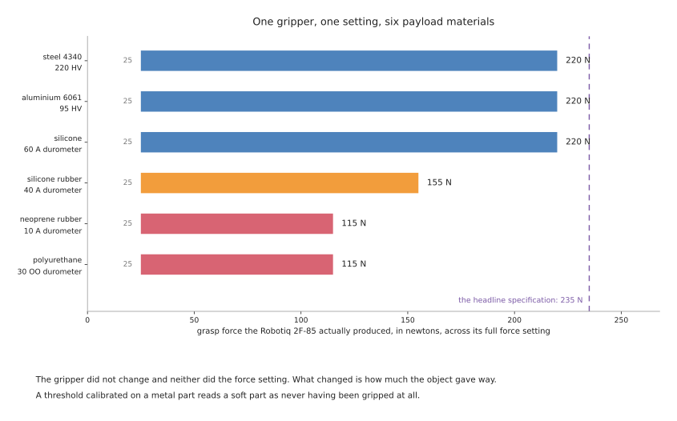
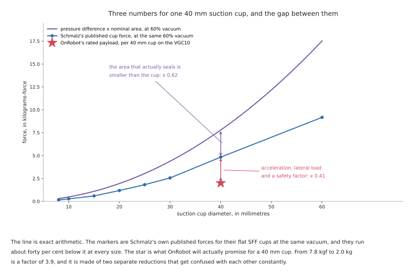

# Grippers and the hardware around them

Every gripper family, with real products and real numbers: what each one can
hold, how fast, how accurately, what it costs you, and which ROS 2 driver talks
to it under which licence. It also covers the things that bolt on around the
gripper — tool changers, and the sensors that tell you what the gripper is
doing.

Every figure below was taken from a manufacturer's datasheet or product page
fetched in September 2026, and the URL is given so you can check it. Where the
manufacturer states the conditions a figure was measured under, those conditions
are repeated here, because in this subject they matter more than the figure.
Where a figure could not be verified, the document says so rather than guessing.

## Who this is for

Someone choosing a gripper, or trying to work out why the one they have is not
performing as advertised. [The overview](01_overview.md) introduces the six
mechanisms; this document is the hardware itself. If you are trying to decide
*where the fingers should go* rather than *what the fingers should be*, that is
[choosing a grip](03_choosing-a-grip.md).

## Contents

1. [How to read a gripper datasheet](#1-how-to-read-a-gripper-datasheet)
2. [Two-finger parallel and adaptive grippers](#2-two-finger-parallel-and-adaptive-grippers)
3. [Suction](#3-suction)
4. [Magnetic grippers](#4-magnetic-grippers)
5. [Soft and compliant grippers](#5-soft-and-compliant-grippers)
6. [Multi-finger hands](#6-multi-finger-hands)
7. [Tool changers, and custom tooling](#7-tool-changers-and-custom-tooling)
8. [The sensors that go on a gripper](#8-the-sensors-that-go-on-a-gripper)
9. [Drivers, ROS 2 packages and licences](#9-drivers-ros-2-packages-and-licences)

---

## 1. How to read a gripper datasheet

Four numbers appear on every gripper datasheet and three of them mean less than
they appear to. It is worth knowing which before reading any of the tables below.

**Payload is a static number.** It is what the gripper holds standing still.
OnRobot say this explicitly for their tool changers — "the values for a situation
with an acceleration of 2g are half of the static values" — and Robotiq work it
through for the 2F-85 in the arithmetic reproduced in [the
overview](01_overview.md#4-what-a-grip-has-to-survive). The rated payload is a
ceiling you spend some of on every move.

**Grip force depends on the object as well as the gripper.**
[Section 2.2](#22-the-force-you-command-is-not-the-force-you-get) has the
measured evidence. A single number on a datasheet is the best case, on a hard
object, with a particular fingertip.

**Stroke is quoted with the manufacturer's own fingertips.** Fit anything else
and both the maximum and the minimum opening move. Robotiq's manual allows
custom fingertips up to 100 mm in height and width from the base, and says they
remain subject to the equilibrium line rule, which means a custom fingertip can
change the *kind* of grasp the gripper makes as well as its size.

**Repeatability is not accuracy.** It is how consistently the fingers return to
the same commanded position, not how close that position is to the number you
asked for. Robotiq quote 0.05 mm of position repeatability on the 2F-85 and
separately a position resolution of 0.4 mm, which is the smallest change a
one-count command produces. The second number is the one that bounds what you
can ask for.

One more thing that is not on any datasheet and decides a great deal: **whether
the gripper is underactuated**. An underactuated gripper has fewer motors than
joints, so the fingers fold to fit the object rather than moving rigidly. That is
why a Robotiq 2-finger gripper can curl around a cylinder, and it is also why it
can do so when you did not ask. A rigid parallel gripper such as the OnRobot 2FG7
always produces the same finger motion, which is less adaptable and much more
predictable. Neither is better; they fail differently, and the underactuated one
fails more interestingly.

## 2. Two-finger parallel and adaptive grippers

The default choice, and the one most cells use. Two fingers, one or two motors, a
commanded position and a commanded force.

### 2.1 The products, and their published numbers

Read the table as: what it opens to, what it holds, how hard it can squeeze, and
how fast. Every figure is from the manufacturer's own datasheet, linked in the
first column.

| Gripper | Stroke | Payload | Grip force | Speed | Weight |
| --- | --- | --- | --- | --- | --- |
| [Robotiq 2F-85](https://assets.robotiq.com/website-assets/support_documents/document/2F-85_2F-140_Instruction_Manual_e-Series_PDF_20190206.pdf) | 85 mm, minimum encompassing diameter 43 mm | 5 kg, friction or form fit | 20 to 235 N | 20 to 150 mm/s | 925 g |
| [Robotiq 2F-140](https://assets.robotiq.com/website-assets/support_documents/document/2F-85_2F-140_Instruction_Manual_e-Series_PDF_20190206.pdf) | 140 mm, minimum encompassing diameter 90 mm | 2.5 kg | 10 to 125 N | 30 to 250 mm/s | 1,025 g |
| [Robotiq 3-Finger](https://assets.robotiq.com/website-assets/support_documents/document/3-Finger_PDF_20190221.pdf) | 0 to 167 mm, maximum encompassing diameter 155 mm | 10 kg encompassing, 2.5 kg fingertip | 70 N maximum at the fingertips | 110 mm/s closing | 2.3 kg |
| [OnRobot RG2](https://onrobot.com/storage/datasheets/rg2/datasheet_rg2_v1.8_en.pdf) | 0 to 110 mm, adjustable | **2 kg force fit, 5 kg form fit** | 3 to 40 N | 38 to 127 mm/s | — |
| [OnRobot 2FG7](https://onrobot.com/storage/datasheets/2fg7/datasheet_2fg7_v2.0_en.pdf) | 38 mm total; grip width 1 to 39 mm fingers inwards, 35 to 73 mm outwards | **7 kg force fit, 11 kg form fit** | 20 to 140 N | 16 to 450 mm/s | — |

Four things in that table repay a second look.

**Opening wider costs you force and payload.** The 2F-140 opens to 140 mm and
holds half what the 2F-85 does, at half the grip force. This is a lever-arm
consequence and it applies to every adaptive gripper: a longer finger applies
less force at its tip for the same motor. Choosing the widest gripper that fits
your budget is the wrong instinct.

**Three fingers cost you force too.** The Robotiq 3-Finger weighs two and a half
times the 2F-85 and produces 70 N at the fingertips against the 2F-85's 235 N. It
buys you an encompassing payload of 10 kg and the ability to change grasp mode
deliberately, and it pays for those in raw squeeze.

**OnRobot publish two payloads and Robotiq publish one.** Robotiq's manual lists
5 kg for both a friction grasp and a form-fit grasp on the 2F-85, which reads as
though the distinction does not matter. OnRobot's two figures — 2 kg and 5 kg on
the RG2 — say that it matters by a factor of two and a half. Both are honest
presentations of the same physics, and the second is much more useful. See
[the overview's section 5](01_overview.md#5-two-payloads-for-one-gripper).

**The precision figures differ by an order of magnitude.** Robotiq specify
position repeatability of 0.05 mm on the 2F-85 and a force repeatability of ±10
per cent. OnRobot specify a repetition accuracy of 0.1 to 0.2 mm on the RG2 and a
**gripping force deviation of ±25 per cent**, with 0.1 to 0.3 mm of reversing
backlash. If you are calculating a squeeze force and then relying on it, a
quarter is a large error to absorb into your safety factor.

A word about the Robotiq product pages, because it will save you time. As of
September 2026 the specification tables on Robotiq's redesigned website are
placeholder text — the visible table on the adaptive gripper pages reads "Morem
ipsum dolor sit amet" and repeats "Stroke 50 mm" for every row. The real numbers
are in the instruction-manual PDFs linked above, which are complete and precise.
Do not take a Robotiq number from the website.

### 2.2 The force you command is not the force you get

Robotiq's manual publishes something most manufacturers do not: measured forces
against payloads of six different hardnesses, using the same fingertips and the
same firmware, tested with a load cell.

| Finger pad | Payload | Measured force, 2F-85 | Measured force, 2F-140 |
| --- | --- | --- | --- |
| steel 4340, 220 HV | steel 4340, 220 HV | 25 to 220 N | 15 to 120 N |
| aluminium 6061, 95 HV | aluminium 6061, 95 HV | 25 to 220 N | 15 to 120 N |
| aluminium 6061 | silicone, 60 A durometer | 25 to 220 N | 15 to 120 N |
| aluminium 6061 | silicone rubber, 40 A durometer | 25 to 155 N | 15 to 100 N |
| aluminium 6061 | neoprene rubber, 10 A durometer | 25 to 115 N | 15 to 75 N |
| aluminium 6061 | polyurethane rubber, 30 OO durometer | 25 to 115 N | 15 to 75 N |

The gripper's maximum force is nearly halved by the object being soft. The reason
is in the mechanism: the force setting is a motor current limit, and an
underactuated linkage converts motor torque into fingertip force at a ratio that
depends on the finger angle. A soft object lets the fingers travel further before
the force builds, and at that angle the linkage is less effective.

The practical consequences are two.

**A force threshold calibrated on a hard object is wrong for a soft one**, and
wrong in the direction that reads a successful grip as a failure. If your
grip-verification logic checks that the commanded force was reached, it will
reject soft objects.

**Do not read a headline force figure as achievable.** Robotiq's own mechanical
specification says 20 to 235 N for the 2F-85 with their flat silicone fingertip.
Their measured table, with the same fingertip, says 25 to 220 N. The gap is
small and it tells you which kind of number each one is.

### 2.3 The equilibrium line, and grasps you did not command

Robotiq's 2-finger grippers choose between a parallel fingertip grasp and an
encompassing grasp on their own. Their manual is explicit: "whether the fingers
close to produce an encompassing or fingertip grasp is decided at the Gripper
level automatically", depending on the object's geometry and its position
relative to the gripper.

The boundary between the two regions on the finger is called the **equilibrium
line**. Contact above it gives a parallel grasp; contact below it, nearer the
palm, gives an encompassing one. Robotiq's own guidance is worth quoting because
it is a warning rather than a feature description: "Grasping an object that could
be grasped by an encompassing grasp (a cylinder for example) on the equilibrium
line is not recommended, as slight variations on the position will switch the
grasp from parallel to encompassing and vice versa. Robot programming should be
done so that the grasping mode will be predetermined."

This is the most important sentence on this page. A cell that grips near the line
gets a form-fit grasp most of the time and a force-fit grasp occasionally,
against the same object, with the same program, and no signal anywhere that the
mode changed. The payload capacity halves when it does. If you are using an
adaptive gripper, decide the grasp mode deliberately and grip well clear of the
line.

### 2.4 The limits that are not the grip force

Robotiq publish a separate set of limits for forces the *arm* applies through the
gripper, which are much lower than the grip force and are about damaging the
gripper rather than dropping the object.

| | 2F-85 | 2F-140 |
| --- | --- | --- |
| force in any direction, Fx, Fy, Fz | 50 N | 25 N |
| moment about x and y | 5 Nm | 5 Nm |
| moment about z | 3 Nm | 3 Nm |

Their own example makes the use clear: after picking its normal payload, the arm
may push with up to 50 N in any direction, and the gripper can hold a screwdriver
and apply 3 Nm of torque to drive a screw. Exceeding these damages the gripper or
loses the payload. Any force-controlled task — insertion, wiping, pressing — has
to respect them, and they are lower than most people assume.

Maintenance is also worth planning for. Robotiq specify a periodic inspection
semi-annually or every million cycles, finger pad replacement annually or every
two million cycles, and a factory overhaul recommended after two million cycles,
done by Robotiq at the user's expense. At a ten-second cycle running one shift,
two million cycles is about four years; at three seconds running two shifts it is
under a year. A gripper is a consumable on a fast line.

Five jobs a two-finger gripper suits:

- picking rigid objects with two opposed faces, which is most of a table top
- anything needing a known, repeatable grip geometry for a downstream insertion
- cells where custom fingertips can convert a hard problem into an easy one
- tasks needing the object held precisely, where suction permits rotation
- small parts, where suction cups become fiddly and magnetic grippers too coarse

Five jobs it cannot do:

- pick an object flush against a wall or its neighbours, with no room for fingers
- pick a large flat sheet or a carton, which has no gettable sides
- handle anything porous, soft and heavy at once
- apply more than its published external force limits, which are far below its
  grip force
- guarantee its grasp mode, if it is underactuated — see section 2.3

## 3. Suction

A cup is sealed against the object, air is removed, and the atmosphere pushes the
object onto the cup. It is the most-used gripper in logistics by a wide margin,
because a carton has one large flat face and nothing else.

### 3.1 The arithmetic, and the three numbers it turns into

The force is the pressure difference multiplied by the sealed area:

    F = pressure difference x area

That is exact and it is the number people compute. It is also the largest of
three numbers you will meet for the same cup, and confusing them is the usual
cause of an undersized vacuum gripper.

For a 40 mm cup at 60 per cent vacuum, the arithmetic gives 76.4 N, which is
7.8 kilograms-force. [Schmalz's own datasheet for their flat SFF
cups](https://media.schmalz.com/MAM_Library/Dokumente/Datenblatt_Produktfamilie/0_/056/05690/7028ef0a30e5_Datasheet_Suction%20Cups%20SFF%20%20SFB1_en-EN.pdf)
gives 47.4 N for the 40 mm size at the same −0.6 bar, which is 4.8
kilograms-force. And [OnRobot's VGC10
datasheet](https://onrobot.com/storage/datasheets/vgc10/datasheet_vgc10_v1.7_en.pdf)
rates a payload of 6 kg using three 40 mm cups, which is 2.0 kg per cup.

Two separate reductions, which get blamed on each other:

**The area that seals is smaller than the cup.** Schmalz's published forces run
at about 0.5 to 0.6 of the nominal-diameter arithmetic at every size in their
range, because the sealing lip and the cup's own geometry take up part of the
diameter. This is a property of the cup, not a safety margin, and it applies
before you have done any engineering.

**The rating then absorbs acceleration, lateral load and a safety factor.**
Schmalz state that their catalogue forces are "theoretical values at a vacuum of
-0.6 bar and with a smooth, dry workpiece surface" and "do not include a safety
factor".

Their published full range of flat cup forces at −0.6 bar, which is a useful
ready-reckoner:

| Cup | 8 mm | 10 mm | 15 mm | 20 mm | 25 mm | 30 mm | 40 mm | 60 mm |
| --- | --- | --- | --- | --- | --- | --- | --- | --- |
| flat, SFF | 1.5 N | 2.7 N | 5.8 N | 11.6 N | 17.9 N | 25.1 N | 47.4 N | 90.0 N |

**A bellows cup of the same diameter is far weaker.** Schmalz's SFB1 bellows cup
at 40 mm gives 8.81 N against the flat SFF's 47.4 N — a fifth of the force. A
bellows cup exists to reach down onto an uneven surface and to lift gently, and
it pays for that in holding force. Choosing cup shape by appearance rather than
by the datasheet is a five-fold error.

### 3.2 Safety factors, and the direction they must be applied

[Schmalz publish the design
calculation](https://www.schmalz.com/en/support/know-how/vacuum-knowledge/the-vacuum-system-and-its-components/system-design-calculation-example/theoretical-holding-force-of-a-suction-cup)
in three load cases, and the difference between them is larger than the safety
factor. Read this as: where the cup is, where the force points, and what that
does to the required force.

| Load case | Formula | What it means |
| --- | --- | --- |
| cup horizontal, force vertical | `F = m x (g + a) x S` | lifting straight up off a table; the simple case |
| cup horizontal, force horizontal | `F = m x (g + a / mu) x S` | the object is being accelerated sideways and friction at the cup has to resist it |
| cup vertical, force vertical | `F = (m / mu) x (g + a) x S` | the cup is on the side of the object and friction alone carries the whole weight |

Their worked example uses a 61.33 kg steel sheet at 5 m/s² and gives 1,363 N,
1,822 N and 3,633 N for the three cases. **The same object needs two and a half
times the suction when the cup is on its side rather than on its top**, and the
difference is entirely friction. If your cup is not on the top face, this is the
first calculation to redo.

Their guidance on the safety factor is specific: a minimum of 1.5 for smooth,
dense workpieces, and "2.0 or greater must be used for critical, heterogeneous,
porous, rough or oiled workpieces". Elsewhere they note that the German accident
prevention regulation UVV prescribes a binding factor of 1.5, that they themselves
recommend at least 2, and that swivelling a workpiece during handling requires 2.5
or higher.

The friction coefficients they publish for the cup against the workpiece are
worth having beside the ones in [choosing a
grip](03_choosing-a-grip.md#31-the-cone): 0.2 to 0.3 for wet surfaces, 0.5 for
wood, metal, glass and stone, 0.6 for rough surfaces, and 0.1 to 0.3 for oiled
ones.

**On porous materials nobody will give you a number.** Schmalz's published
guidance is to raise the safety factor and to "conduct a corresponding suction
trial with the original workpiece". That is the honest answer and it means a
porous-material vacuum gripper cannot be designed from a datasheet. Budget for a
test.

### 3.3 Venturi ejector against electric pump

Two ways to make the vacuum, and the choice is not close once you know the
application.

A **Venturi ejector** blows compressed air through a nozzle, which entrains air
from the cup. It has no moving parts, it is light enough to sit on the wrist, and
it makes vacuum almost instantly. It consumes compressed air continuously while
running, which is expensive. [Schmalz's SCPi and SMPi compact
ejectors](https://media.schmalz.com/MAM_Library/Dokumente/Datenblatt_Produktfamilie/0_/040/04081/65e42e5bc20c_Datasheet_Compact%20Ejectors%20SCPi%20%20SMPi_en-EN.pdf)
publish the numbers, all at their optimal operating pressure of 4.5 bar:

| Ejector | Nozzle | Evacuation | Suction rate | Air consumption | Weight |
| --- | --- | --- | --- | --- | --- |
| SCPi 15 | 1.5 mm | 85% | 75 l/min | 115 l/min | 0.6 kg |
| SCPi 20 | 2.0 mm | 85% | 140 l/min | 180 l/min | 0.6 kg |
| SCPi 25 | 2.5 mm | 85% | 195 l/min | 290 l/min | 0.6 kg |

Notice that the air consumed exceeds the air moved, at every size. That is
inherent to the principle and it is why compact ejectors include an air-saving
control that stops generating vacuum once a safe level is reached, and only
restarts if it falls. On an airtight workpiece that runs the pump for a fraction
of the cycle; on a leaking one it runs continuously, which is the case that
surprises people.

An **electric pump** — the OnRobot VGC10 has one built in, a brushless DC unit —
needs only electrical power, so it works on a robot with no air supply at all.
Its published figures are 5 to 80 per cent vacuum, an air flow of 0 to 12 l/min,
0.35 s to grip and 0.20 s to release, and a warranty of three years or three
million cycles.

Schmalz's own selection guidance is one line and it is the right heuristic:
short cycle times favour an ejector, long transport distances favour a pump or a
blower.

**Piab publish their cup forces as a function of vacuum level**, which is more
useful than a single figure. Their [B75P bellows
cup](https://www.piab.com/suction-cups-and-soft-grippers/round-suction-cups/bellows-suction-cups/0111603)
gives 121 N parallel and 83 N vertical at 20 kPa of vacuum, 229 N and 196 N at
60 kPa, and 298 N and 255 N at 90 kPa. The parallel and vertical split is the
same friction question as Schmalz's three load cases, quantified per product.

One warning that is printed on OnRobot's own datasheet and is easy to skip past:
"Do not use vacuum grippers in wet or damp conditions, particularly in CNC
applications with moisture or cutting fluids. It can damage the gripper." A
vacuum gripper pulls whatever is on the workpiece into itself.

Five jobs suction suits:

- cartons, bags, books, sheets, panels and anything with one large flat face
- objects with no accessible sides, which is most things in a full tote
- high-rate picking, where a 0.35 s grip is faster than a finger closure
- objects too large or too heavy for fingers to get around
- cells that need the perception requirement to stay cheap, since a plane fit and
  a surface normal is all a cup needs

Five jobs it cannot do:

- porous, permeable or fabric surfaces, where no seal forms and no datasheet will
  help you
- ribbed, corrugated or tightly curved surfaces
- oily, dusty or wet parts, which foul the cup and void the warranty
- hold an object against rotation about the cup's own axis
- work where the only reachable surface is a thin edge

## 4. Magnetic grippers

Strong, simple, and applicable to a narrow and well-defined set of objects:
ferromagnetic ones. Steel and iron yes; aluminium, copper, brass, plastic, glass
and the austenitic stainless grades no.

Two technologies matter. A **pneumatic** or **electropermanent** gripper moves or
switches a permanent magnet, so it holds with no power at all and needs energy
only to change state. An **electromagnet** needs continuous current and drops its
load when power fails, which is usually disqualifying.

The published numbers, from three manufacturers:

| Gripper | Holding force | Conditions the manufacturer states |
| --- | --- | --- |
| [Schmalz SGM-HP 20](https://media.schmalz.com/MAM_Library/Dokumente/Datenblatt_Produktfamilie/0_/054/05408/9f3b7669e77e_Datasheet_Magnetic%20Grippers%20SGM-HP-HT_en-EN.pdf) | 28 N, or 19 N with a friction ring | optimum sheet thickness 1 mm; apply a safety factor of 3 |
| Schmalz SGM-HP 30 | 130 N, or 90 N with a friction ring | optimum sheet thickness 2 mm |
| Schmalz SGM-HP 40 | 320 N, or 235 N with a friction ring | optimum sheet thickness 4 mm |
| Schmalz SGM-HP 50 | 560 N, or 385 N with a friction ring | optimum sheet thickness 6 mm |
| [Goudsmit electropermanent, 71 mm](https://www.goudsmitmagnetics.com/en-us/products/electronic-magnetic-gripper-70-mm/ehsq070000) | advised working load 330 N; maximum tear-off 990 N | safety factor 3 per EN 13155; minimum material thickness 8 mm |
| [OnRobot MG10](https://onrobot.com/storage/datasheets/mg10/datasheet_mg10_v1.5_en.pdf) | 10 kg parallel to the ground, pulling force 300 N | at 3 g; pure steel, no surface treatment; all four fingers in contact on a 65.4 by 65.4 mm workpiece |

Four things here are worth knowing before you specify one.

**The derating is severe and the manufacturer publishes it.** OnRobot state that
the MG10's maximum payload falls to 30 per cent of the maximum with their own
delivered protective pads fitted, 41 per cent on cylindrical workpieces, and **28
per cent when gripping perpendicular to the ground**. So the headline 10 kg is
2.8 kg in the orientation a great many cells actually use.

**Sheet thickness decides the force, and thin sheet is the hard case.** Schmalz
quote an optimum thickness per gripper size, from 1 mm on the smallest to 6 mm on
the largest. Goudsmit's 71 mm electropermanent gripper wants at least 8 mm. Below
the optimum the magnetic circuit is not filled and the force drops.

**Thin sheet also brings the double-pick problem.** Steel sheets stick together,
especially oiled ones, and a magnet strong enough to lift one will lift two. The
industry answer is a separate device: [Goudsmit's neodymium sheet
separators](https://www.goudsmitmagnetics.com/en-us/products/gripping-handling-and-moving/sheet-separators-neodymium)
sit beside the stack and force the sheets apart magnetically, and they publish a
range of 1.4 to 3.5 mm thickness and 45 to 370 mm stack height. If you are
picking sheet, budget for the separator as well as the gripper.

**Residual magnetism is real and is published.** Schmalz quote a "remaining
holding force" of 0.3 N for every size in the SGM-HP range. That is small, and it
is not zero, which matters for a light part: a 20 g stamping weighs 0.2 N and
will stay attached. If your part is light, plan an ejector pin or a blow-off, and
do not rely on gravity to separate it.

Two more figures worth noting. Goudsmit's electropermanent gripper draws 5 A at
24 V during switching but only 0.2 A for its logic, and publishes a duty cycle of
twelve on and twelve off per minute — magnetic switching is not free and not
unlimited. Schmalz note that a workpiece up to 350 °C can be handled, and that
temperature can reduce holding force by up to 30 per cent.

Five jobs a magnetic gripper suits:

- steel plate, blanks and stampings, where there is nothing to get fingers round
- press and machine tending on ferrous parts
- parts too hot or too dirty for a suction cup
- parts with holes or openings that would defeat a seal
- picking from a stack, given a sheet separator

Five jobs it cannot do:

- anything non-ferrous, which rules out aluminium, most stainless and everything
  non-metallic
- hold a part precisely, since a flat magnet permits sliding and rotation
- release a light part cleanly, because of residual magnetism
- work near anything a stray field would damage, such as magnetic media or some
  sensors
- deliver its rated force on thin sheet, or through a coating that adds a gap

## 5. Soft and compliant grippers

Fingers that conform to the object. The contact pressure is low and spread out,
which is why these dominate food handling and fragile goods.

**The market changed recently and it is worth stating plainly.** Soft Robotics
Inc, which was the best-known name in this category, [announced on 6 August 2024
the divestiture of its gripper business to the Schmalz
Group](https://softroboticsinc.com) and now trades as Oxipital AI, working on
vision inspection. Its mGrip product line is [now sold by
Schmalz](https://www.schmalz.com/en/products/automation-743270/other-gripping-technologies-746237/finger-grippers-312388/finger-grippers-mgrip-405170).
If you find a tutorial or a comparison that lists Soft Robotics as a gripper
vendor, it predates that.

The published numbers for the two products you would actually consider:

| Gripper | Payload | Configuration | Food rating | Cycle rate |
| --- | --- | --- | --- | --- |
| [Schmalz mGrip](https://www.schmalz.com/en/products/automation-743270/other-gripping-technologies-746237/finger-grippers-312388/finger-grippers-mgrip-405170) | up to 10 kg | 2 to 6 silicone fingers, parallel or circular; gripping distance 20 to 245 mm; workpiece width to 300 mm | optional FDA-compliant silicone; finger module IP69K | up to 120 picks per minute |
| [OnRobot Soft Gripper](https://onrobot.com/storage/datasheets/soft/datasheet_sg_base_part_and_sg_silicone_tools_v1.5_en.pdf) | 2.2 kg with the stiffer cup, 1.5 kg with the softer | spindle stroke 11 to 40 mm, spindle force to 380 N; IP67; 0.77 kg base | FDA 21 CFR 177.2600 and EC 1935/2004, tested and approved for **non-fatty** food only | 0 to 32 grips per minute |

OnRobot publish something unusually useful here: **payload by workpiece shape**,
all measured on 65 mm objects with the same grip width and surface, so the only
variable is the shape.

| Workpiece | Payload |
| --- | --- |
| cylinder, 65 by 30 mm | 2.2 kg |
| hexagon | 1.8 kg |
| cylinder standing on end, 30 by 65 mm | 1.6 kg |
| ellipse | 1.0 kg |
| equilateral triangle | 0.7 kg |
| sphere, 65 mm | 0.5 kg |
| square | not applicable |

A sphere is held at less than a quarter of the payload of a cylinder, and a
square is not held at all. That is the whole character of a soft gripper: it wraps
what it can wrap and it has very little to say about anything else. If your object
set includes both cylinders and cubes, one soft gripper will not cover it.

Two limits are also worth reading off. The stated cycle rate of the OnRobot unit
is up to 32 grips per minute against the mGrip's 120 — soft grippers vary by a
factor of four in speed. And the food approval is narrower than it looks: the
OnRobot silicone is approved for non-fatty food objects, which excludes a large
part of what a food line handles.

**Festo's adaptive grippers could not be verified for this document.** Every
automated request to festo.com returned HTTP 403, including with full browser
headers, and their regional mirrors serve an empty JavaScript shell. Their DHAS
and DHEF grippers and the MultiChoiceGripper are genuinely interesting hardware
and no payload or stroke figure for them is quoted here, because none could be
obtained from a source that resolves.

Five jobs a soft gripper suits:

- food, produce and anything that bruises
- fragile packaging, blister packs and thin-walled containers
- an object set that varies in size but is consistently roundish
- wash-down environments, where the IP69K rating is the binding requirement
- cells where the cost of damaging a product exceeds the cost of a slow cycle

Five jobs it cannot do:

- hold a flat or square object, which OnRobot mark as not applicable
- hold anything heavy — the ceiling is a couple of kilograms on a small unit
- locate the object precisely, since the finger conforms rather than positioning
- run fast, at 32 grips a minute on the slower products
- handle fatty foods on the food-approved silicone, which is rated for non-fatty
  only

## 6. Multi-finger hands

Several independently controlled fingers. They can do what nothing else can —
hold a tool and use it, reorient an object without putting it down — and they are
expensive, complicated and rare outside research.

The two you would actually meet, with their published specifications:

| | [Allegro Hand V5](https://www.allegrohand.com/sub/product/p.php?idx=3) and V5 Plus | [Shadow Dexterous Hand](https://shadowrobot.com/wp-content/uploads/2025/09/shadow_dexterous_hand_e_technical_specification.pdf) |
| --- | --- | --- |
| degrees of freedom | 16 active on the V5 Plus, 9 on the V5 | 20 actuated, plus 4 under-actuated movements across 24 joints |
| weight | 1,024 g | 4.3 kg including the forearm |
| payload | "15 kg, depending on the measurement method" | "up to 4 kg" in a power grasp |
| actuation | direct drive, stall torque 0.92 to 1.84 Nm | 20 DC motors driving tendons |
| sensing | joint resolution 0.088 degrees | 40 tendon load sensors, over 100 sensors in total |
| control rate | CAN at 500 Hz | 1 kHz over EtherCAT, with a 5 kHz torque loop inside each motor unit |

**Neither manufacturer publishes a price.** Shadow's page says to contact them to
discuss pricing; Allegro's pages carry no price at all. That is the norm in this
category and it is a useful signal in itself about who these are sold to.

Two things in the table deserve comment. Allegro's payload figure carries the
manufacturer's own hedge — "depending on the measurement method" — which for a
multi-finger hand is an honest admission rather than evasion, because a hand's
capacity genuinely depends on which grasp it is making. And Shadow's own technical
specification is admirably plain about its force sensors: they "have a resolution
of about 30 mN. They are zeroed but not calibrated." A sensor you have to
calibrate yourself is not a defect, but it is a week of work nobody budgets for.

Shadow also publish a figure that quietly bounds what these hands can do:
"typical parameters allow a full-range joint movement in free space to operate at
a frequency of 1.0 Hz". One full finger movement per second is not fast.

Five jobs a multi-finger hand suits:

- research into in-hand manipulation, which is what they exist for
- tool use, where the grasp must permit the tool's function
- teleoperation from a human hand, where matching the kinematics matters
- tasks needing several distinct grasp types from one end effector
- collecting demonstration data for dexterous policies

Five jobs it cannot do:

- justify itself against a two-finger gripper for ordinary pick and place
- be bought at a published price, or quickly
- run fast, at roughly 1 Hz of joint movement on the Shadow hand
- deliver a supported, maintained software stack comparable to an industrial
  gripper's
- be used without calibrating its own sensors, on the Shadow hand at least

## 7. Tool changers, and custom tooling

### 7.1 Tool changers

A tool changer is a coupling between the wrist and the gripper so that a cell can
use several end effectors. The two you would meet are quite different products.

| | [ATI QC-11](https://www.ati-ia.com/products/toolchanger/QC.aspx?ID=QC-11) | [OnRobot Quick Changer](https://onrobot.com/storage/datasheets/quick-changers/datasheet_quick_changers_v2.0_en.pdf) |
| --- | --- | --- |
| suggested payload | 35 lb, about 16 kg | 25 kg |
| locking force | 240 lb at 80 psi | — |
| static moment | 180 lbf-in about x and y, 110 about z | 40 Nm |
| repeatability | 0.0004 in, about 0.010 mm | ±0.02 mm |
| weight coupled | 0.54 lb, about 245 g | 60 g |
| operating life | — | **5,000 tool changes** |

ATI publish [a full model table](https://www.ati-ia.com/products/toolchanger/tool_changer_models.aspx)
running from the QC-1 at a 3 lb payload to the QC-40Q at 110 lb, in imperial
units only. Their QC-11 also has a useful mechanical property they call No-Touch
locking, which allows up to 1.5 mm of plate separation at the moment of locking —
that is the tolerance your approach has to hit, rather than a perfect seat.

The two rows worth comparing are repeatability and operating life. ATI's changer
repeats to a hundredth of a millimetre with a pneumatic lock; OnRobot's repeats to
two hundredths and states an operating life of 5,000 tool changes. Five thousand
is not many. At one change per hour on a single shift it is about three years; on
a cell that changes tools every few minutes it is weeks. Check that number against
your cycle before designing a multi-tool cell around a light changer.

OnRobot also state the acceleration derating explicitly — "the values for a
situation with an acceleration of 2g are half of the static values" — which is
the same lesson as [section 1](#1-how-to-read-a-gripper-datasheet) applied to the
coupling instead of the fingers.

**Schunk's SWS quick-change range could not be verified for this document.**
Their product pages return HTTP 200 but are entirely rendered in the browser, so
no payload, repeatability or model identifier is present in the served page, and
SWS models are absent from their product sitemap. Schunk make well-regarded
changers; no number for them is quoted here because none could be obtained.

Five jobs a tool changer suits:

- a cell that genuinely needs two or more end effectors, such as suction for
  cartons and fingers for loose items
- swapping a gripper for a sensor, a screwdriver or a dispensing head
- maintenance, since a changer makes swapping a failed gripper a one-minute job
- machine tending where a dual gripper halves the cycle
- development, where you are still deciding which gripper to use

Five jobs it cannot do:

- add itself for free: it costs payload, reach, mass and stiffness at the wrist
- survive an unlimited number of changes on the lighter products
- hold position better than its repeatability, which adds to every downstream
  error
- pass every signal through, since each model supports a fixed set of pneumatic
  and electrical pass-throughs
- replace designing one gripper that handles the whole part mix, which is nearly
  always better when it is possible

### 7.2 Custom tooling

The option nobody writes about and a great deal of working automation uses. A
shaped nest, a mandrel that enters a bore, a hook, a pair of machined fingertips
that fit one part in one orientation.

It deserves a place in a document about grippers because of what it deletes. A
shaped fingertip converts a force fit into a form fit, which is the factor of two
in [the overview](01_overview.md#5-two-payloads-for-one-gripper). A V-groove
fingertip holds a cylinder without the system needing to know the cylinder's
diameter, which deletes a measurement. A nest that admits one orientation deletes
a pose estimate. Each of those is a piece of perception you no longer have to
build, test and maintain.

The trade is that it fits one part. When the part mix is fixed, that is not a
cost. When it is not, it is fatal.

## 8. The sensors that go on a gripper

Three kinds, answering three different questions. The [perception area's touch
section](../06_object-perception/02_sensors.md#2-measuring-by-touch) covers what
you do with them; this is what you can buy.

### 8.1 Force and torque at the wrist

The workhorse. It reads the whole load below it, so it tells you the weight of
what you are holding, when contact happened, and how the object is loading the
grip.

[Robotiq's FT 300-S product
sheet](https://robotiq.com/hubfs/Product-sheets/FT%20300/ur/Product_sheet-FT300S_FC_EN.pdf)
publishes the figures that actually matter, which are the noise ones rather than
the range:

| | forces, Fx, Fy, Fz | torques |
| --- | --- | --- |
| measuring range | ±300 N | ±30 Nm |
| overload capacity | 500% | 500% |
| signal noise | 0.1 N | 0.005 Nm about x and y, 0.003 Nm about z |
| recommended threshold for contact detection | 1 N | 0.02 Nm about x and y, 0.01 Nm about z |
| tool deflection at maximum load | 0.01 mm | 0.17 and 0.09 degrees |

It outputs at 100 Hz over Modbus RTU and weighs 440 g.

The row to plan around is the recommended contact-detection threshold of 1 N, ten
times the noise floor. A guarded move cannot reliably detect a contact gentler
than that, which for a 100 g object is the whole weight. If you need to feel
something lighter, this sensor is the wrong instrument and the answer is a
gentler approach speed, not a lower threshold.

The 0.01 mm of tool deflection at maximum load matters for a different reason: the
sensor is a spring, so it sits between the arm's encoders and the tool, and its
deflection is added to every position the arm thinks it has achieved.

### 8.2 Tactile sensing at the contact

A camera watching a gel, or an array of pressure elements, reporting what is
happening in the contact patch itself.

[GelSight Mini](https://www.gelsight.com/wp-content/uploads/productsheet/Mini/GS_Mini_4.3.24.pdf)
is a camera behind a soft silicone gel: when the gel presses on something the
camera sees it deform. Its published specification is an 8-megapixel camera at 25
frames per second over a field of view of 18.6 by 14.3 mm, with a 4.25 mm gel. Two
things it does not publish are worth noticing: there is no micrometres-per-pixel
figure anywhere on the sheet despite the marketing language about superhuman
resolution, and the gel's stated durability is **1,000 coin presses**, which is a
consumable rather than a sensor. Replacement gels are $57 and the sensor itself is
$510, or $560 for the robotics package, from [their own
store](https://www.gelsight.com/online-store/) — which makes GelSight the only
manufacturer anywhere in this document that publishes a price.

[Contactile's PapillArray](https://contactile.com/wp-content/uploads/2021/12/PTS_2.0_SPEC_DEC21.pdf)
takes a different approach: a three-by-three array of silicone pillars, each
reporting three-dimensional displacement and force. Per element the displacement
range is ±1 mm sideways and +2.5 mm into the surface, with a resolution better
than 0.01 mm; the force range is ±4 N sideways and 15 N normal, with a resolution
better than 0.05 N. Each pillar is sampled at 1,000 Hz at 16 bits, and the
controller computes slip onset and a friction estimate from the raw readings.

Their specification sheet is unusually honest about two limitations, both of which
you should plan for: "temperature variations can cause drift in sensor readings…
bias removal in software prior to operation is necessary", and the v2.0 sensor
"does not yet have ingress protection".

**No manufacturer in this category publishes a slip-detection latency.** It is
the number you would most want, it is not in Contactile's specification sheet and
it is not in their gripper manual. The nearest defensible statement is the
1,000 Hz per-pillar sampling rate, which bounds it from below and is not the same
thing.

### 8.3 The cheap sensors that are enough

Worth a paragraph because they are usually the right answer.

A **contact switch** costs pennies and answers one bit. For a guarded move, that
bit plus the arm's joint encoders gives you the same positional accuracy as any
tactile array, because [the measurement comes from the
encoders](../06_object-perception/02_sensors.md#2-measuring-by-touch) and the
sensor only says when.

A **one-point infrared range sensor** between the fingers reports that an object
is arriving a centimetre before contact, for a few pounds, which is a cheap check
on a camera measurement that might be wrong.

The **gripper's own finger position** is free and already published by every
electric gripper. It is worth knowing exactly what it can and cannot see, which is
[section 4.1 of holding on](05_holding-on.md#41-the-finger-gap-check-and-what-it-cannot-see).

Five jobs a gripper-mounted sensor suits:

- weighing what is held, which no camera can do
- detecting contact, so the arm can stop on touch rather than on position
- finding the true height of a surface before placing something on it
- detecting slip, given shear or high-frequency sensing
- verifying that a release actually happened, by watching the load leave

Five jobs it cannot do:

- detect a contact below its noise floor, which on a wrist sensor is around 1 N
- survive indefinitely, in the case of a consumable gel rated for 1,000 presses
- report in the world frame without being rotated into it first, which is a trap
  the [perception area documents](../06_object-perception/02_sensors.md#21-what-you-can-actually-do-with-it)
- work through temperature drift without a zeroing step
- give you a published slip-detection latency, because nobody publishes one

## 9. Drivers, ROS 2 packages and licences

Read this as: the software you talk to the hardware with, its licence read from
the project's own licence file in September 2026, and its state. The licence
column is doing real work — one major vendor ships its ROS 2 drivers under the
GPL.

| Hardware | ROS 2 package | Licence | State |
| --- | --- | --- | --- |
| Robotiq 2F-85 | [PickNikRobotics/ros2_robotiq_gripper](https://github.com/PickNikRobotics/ros2_robotiq_gripper) | BSD-3-Clause | active, pushed September 2026; the de facto choice, and see the note below |
| Robotiq EPick vacuum gripper | [PickNikRobotics/ros2_epick_gripper](https://github.com/PickNikRobotics/ros2_epick_gripper) | BSD-3-Clause | its companion |
| Robotiq, vendor packages | [robotiq/ros](https://github.com/robotiq/ros) | BSD-3-Clause | the vendor's own, ROS 1 lineage |
| Schunk mechatronic grippers | [SCHUNK-SE-Co-KG/schunk_mechatronic_gripper](https://github.com/SCHUNK-SE-Co-KG/schunk_mechatronic_gripper) | **GPL-3.0** | active, pushed September 2026 |
| Schunk SVH five-finger hand | [SCHUNK-SE-Co-KG/schunk_svh_ros_driver](https://github.com/SCHUNK-SE-Co-KG/schunk_svh_ros_driver) | **GPL-3.0** | active |
| OnRobot grippers | [OnRobot/onrobot-ros2](https://github.com/OnRobot/onrobot-ros2) | BSD-3-Clause | the vendor's own, pushed September 2026 |
| OnRobot, without ROS | [OnRobot/onrobot-tool-api](https://github.com/OnRobot/onrobot-tool-api) | BSD-3-Clause | a C++17 Modbus library |
| Franka Hand | [frankarobotics/franka_ros2](https://github.com/frankarobotics/franka_ros2) | Apache-2.0 | active; also the Cartesian impedance examples |
| Allegro Hand | [simlabrobotics/allegro_hand_ros_v4](https://github.com/simlabrobotics/allegro_hand_ros_v4) | BSD-2-Clause | the vendor-adjacent driver |
| Shadow Dexterous Hand | [shadow-robot/sr_interface](https://github.com/shadow-robot/sr_interface) | BSD-3-Clause | the vendor's own |
| LEAP Hand | [leap-hand/LEAP_Hand_API](https://github.com/leap-hand/LEAP_Hand_API) | **CC BY-NC 4.0** | non-commercial — see below |
| any gripper, generically | [ros-controls/ros2_controllers](https://github.com/ros-controls/ros2_controllers) | Apache-2.0 | `parallel_gripper_controller`, active |
| GelSight | [gelsightinc/gsrobotics](https://github.com/gelsightinc/gsrobotics) | **GPL-3.0** | the vendor's SDK |
| DIGIT tactile sensor | [facebookresearch/digit-interface](https://github.com/facebookresearch/digit-interface) | **CC BY-NC 4.0** | **archived**, last pushed 2021 |
| AnySkin magnetic skin | [raunaqbhirangi/anyskin](https://github.com/raunaqbhirangi/anyskin) | MIT | active enough |

Two things about the Robotiq row that its stars do not tell you. Its own README
says "this is not sponsored or maintained by Robotiq", so the most widely used
driver for the most widely used collaborative gripper is a community project. And
the same README says the repository "initially supported only the 2f-85"; its
released-package table covers Humble, Iron and Rolling, and **Jazzy is not among
them**. Since Jazzy is the long-term release most cells are on today, that is
worth checking before you plan around it.

Four licence traps in that table, each verified from the file rather than a badge.

**Schunk's own ROS 2 drivers are GPL-3.0.** This is unusual for a vendor driver
and it is a real consideration: linking a GPL library into a product obliges you
to publish the source of the result. Their force-torque sensor driver is the same.
Robotiq, OnRobot and Franka all use permissive licences, so this is a Schunk
decision rather than an industry norm.

**GelSight's SDK is GPL-3.0 too**, and it is the largest piece of tactile
software that exists. If you build a product around a GelSight sensor, plan for
that.

**Meta's DIGIT driver is CC BY-NC 4.0.** That is a non-commercial licence, on a
hardware driver, from a company selling nothing — and a Creative Commons licence
is a poor fit for software, since it addresses neither patents nor source
distribution. The repository is also archived. The sensor is sold and the driver
is not usable in a product.

**The LEAP Hand has two different licences depending on which artefact you
take.** Its driver API is CC BY-NC 4.0, so you may not use the real hand
commercially. Its MuJoCo simulation model, in
[mujoco_menagerie](https://github.com/google-deepmind/mujoco_menagerie), is MIT.
You may simulate it commercially and not drive it.

One further thing about `mujoco_menagerie`, because it is the easiest place to
get a gripper model and it is easy to get wrong. **Its root licence file is a
machine-generated concatenation of per-model licences and GitHub reports it as
unclassified.** The individual models differ: the Robotiq 2F-85 model is
BSD-2-Clause from ROS-Industrial, the Wonik Allegro model is BSD-2-Clause from
SimLab, the Shadow Hand model is Apache-2.0, and the LEAP Hand and UMI gripper
models are MIT. Read the per-model file, never the root one.

Two notes on simulation that are not about licences.

**Gazebo Harmonic has no vacuum or suction gripper system.** Its full system list
contains `contact`, `detachable_joint`, `force_torque`, `optical_tactile_plugin`
and `touch_plugin`, and no gripper of any kind. A suction gripper in Harmonic is
something you build from `detachable_joint` plus `contact`. Every "Gazebo vacuum
gripper" repository on GitHub is either for Gazebo Classic or is an unlicensed
personal fork, and none is usable as a dependency.

**MuJoCo and its model collection run natively on Apple Silicon**, which makes
them the practical route for developing gripping logic on a Mac. The full picture
is in [licences and platforms](07_licences-and-platforms.md#2-what-runs-on-an-apple-silicon-mac).
