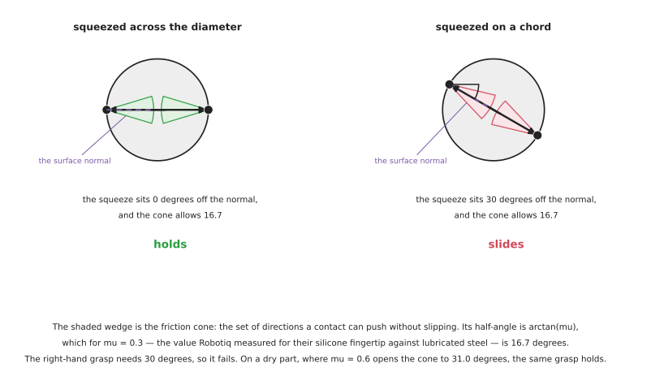

# Choosing a grip: the methods you write yourself

Perception has given you a shape — a mask, a point cloud, an outline, a set of
measured dimensions. This document is everything you can do with that shape and
no trained model at all: work out where the fingers should go, how wide they
should open, how hard they should squeeze, and whether the answer is one you can
trust.

It is the other half of [models that grasp](04_models-that-grasp.md). Reach for
this half first. When the object has a describable shape, a rule written as a
sentence beats a network, for reasons [section 8](#8-why-a-rule-beats-a-network)
sets out properly and the [perception
overview](../06_object-perception/01_overview.md#21-when-a-model-makes-things-worse)
argues in its general form.

Every number below is either computed from a formula shown on the page, so you
can check it, or taken from a manufacturer's published figure with the source
named. The friction coefficients in particular are Robotiq's own measured values
rather than textbook ones, because textbook friction coefficients are the single
largest source of confident wrong answers in this subject.

## Who this is for

Someone who has a measurement in hand and now has to turn it into a gripper pose
and a squeeze force. You do not need any mechanics beyond forces and torques, and
every term is explained where it first appears. If you have not read [the
overview](01_overview.md), the distinction between a force fit and a form fit
introduced there runs through everything here.

## Contents

1. [The question a grip planner actually answers](#1-the-question-a-grip-planner-actually-answers)
2. [Force closure and form closure](#2-force-closure-and-form-closure)
3. [Friction cones and the antipodal test](#3-friction-cones-and-the-antipodal-test)
4. [How hard to squeeze, from first principles](#4-how-hard-to-squeeze-from-first-principles)
5. [The centre of mass, and the torque nobody budgets for](#5-the-centre-of-mass-and-the-torque-nobody-budgets-for)
6. [Rules from a measured profile](#6-rules-from-a-measured-profile)
7. [Bounding the search by the gripper's own body](#7-bounding-the-search-by-the-grippers-own-body)
8. [Grasp quality metrics you can compute](#8-grasp-quality-metrics-you-can-compute)
9. [Why a rule beats a network](#9-why-a-rule-beats-a-network)
10. [Testing a grip rule](#10-testing-a-grip-rule)

---

## 1. The question a grip planner actually answers

A grasp, for a two-finger gripper, is five numbers and one decision. The five
numbers are a position in space, an approach direction, a rotation about that
direction, a finger opening, and a squeeze force. The decision is whether to
attempt it at all.

That last item is not decoration. A grip planner that always returns its best
candidate is a planner that will happily recommend an impossible grasp on a bad
measurement, and the whole of [section 10](#10-testing-a-grip-rule) is about
making refusal a mechanism rather than an intention — the same argument the
perception area makes about [declining as a
mechanism](../06_object-perception/07_making-it-work.md#6-declining-as-a-mechanism-rather-than-an-intention).

The five numbers split into two groups that are worth keeping separate in your
code, because they fail differently.

**Where the fingers go** is geometry. It comes from the shape, it is checkable
against the shape, and when it is wrong you can usually see that it is wrong by
drawing it. Sections 2 to 7 are about this.

**How hard the fingers squeeze** is mechanics. It comes from the mass, the
friction and the acceleration, none of which are in the picture, and when it is
wrong nothing is visibly wrong until the object slips or breaks. Section 4 is
about this, and [holding on](05_holding-on.md) is about what happens next.

Mixing the two is the commonest structural mistake here. A grasp search that
scores candidates on geometry alone and then applies a single global squeeze
force has, in effect, assumed every object weighs the same.

## 2. Force closure and form closure

These two terms are used loosely and they mean different things. Getting them
apart is worth the paragraph, because the difference is the difference between
the two payload numbers in [the overview](01_overview.md#5-two-payloads-for-one-gripper).

**Form closure** means the object cannot move at all, no matter what forces are
applied to it, because the contacts physically block every direction. Friction
plays no part. A peg in a matching hole has form closure. A part sitting in a
shaped nest has form closure.

**Force closure** means the object cannot move *given the forces the fingers can
apply*, which for a squeeze means *given friction*. A block held between two flat
pads has force closure and not form closure: nothing geometrically prevents it
sliding out sideways, and only friction stops it.

The practical difference is what happens when the assumption behind friction
fails. Oil on the part, a dusty surface, a sudden acceleration — all of these
attack force closure and none of them touch form closure. This is why form
closure is worth engineering for even though it is harder to achieve.

**True form closure needs more fingers than you have.** Here is the reasoning,
which is worth following rather than memorising. A frictionless contact can only
push, never pull, so it removes the object's freedom to move in one direction and
does nothing about the opposite direction. A rigid body in three dimensions has
six degrees of freedom. To block all six in both directions you need the contact
normals to positively span a six-dimensional space, and the smallest number of
vectors that can positively span a `d`-dimensional space is `d + 1`. So form
closure of a solid object needs at least **seven** frictionless contacts, and in
the plane it needs four.

A two-finger gripper has two contacts. It therefore never achieves form closure
in the strict sense, and everything anyone calls "form fit" in a product
catalogue is really *partial* form closure: the geometry blocks the directions
that matter — usually downward, along gravity — and friction handles the rest.
That is a perfectly good engineering answer and it is not the textbook property,
and knowing the difference stops you looking for a guarantee that is not there.

This is why an encompassing grip is stronger. When a Robotiq 2-finger gripper
curls around a cylinder, the fingers are no longer two flat pads pushing inward.
They form a cradle, and the object would have to deform or lift out of the cradle
to escape. OnRobot quote the two capacities separately for exactly this reason:
2 kg force fit and 5 kg form fit on the RG2, 7 kg and 11 kg on the 2FG7.

Five jobs form closure thinking suits:

- designing a fingertip, where a groove or a lip is nearly free to add
- deciding whether a part needs a nest rather than a gripper at all
- handling anything where the friction coefficient is unreliable, such as oily
  machined parts or dusty castings
- high-acceleration moves, where friction is the first thing to run out
- anything the robot will invert, where gravity changes direction relative to the
  fingers

Five jobs it cannot do:

- handle an object whose shape gives the fingers nothing to get behind — a flat
  plate, a sphere, a smooth block
- work when the object's size varies, since the shaped feature fits one size
- be achieved by two fingers in the strict sense, as above
- help with suction, magnetic or soft grippers, which have no equivalent
- be verified by a sensor, since nothing on the gripper reports which kind of
  closure it achieved

## 3. Friction cones and the antipodal test

This is the one calculation underneath every two-finger grasp, and it is simple
enough to do in your head once you have seen it.

### 3.1 The cone

Push a finger against a surface. The surface pushes back along its normal, which
is the direction perpendicular to the surface at that point. Friction adds a
sideways force, and the largest sideways force friction can supply is the normal
force multiplied by the coefficient of friction, written as the Greek letter mu.

So the total force the contact can transmit lies inside a cone around the normal,
and the half-angle of that cone is

    half-angle = arctan(mu)

That is the whole of it. The cone is the set of directions in which the contact
can push or pull the object without slipping.

The half-angle for the values that actually turn up:

| Coefficient of friction | Half-angle of the friction cone | Where this value comes from |
| --- | --- | --- |
| 0.1 | 5.7 degrees | polished metal on polished metal, or anything wet |
| 0.3 | 16.7 degrees | Robotiq's measured value for their silicone fingertip against **lubricated** steel |
| 0.6 | 31.0 degrees | Robotiq's stated value for silicone against steel in their 3-Finger manual |
| 1.0 | 45.0 degrees | soft rubber against a clean dry surface |

**The two Robotiq values are the same fingertip on the same material, and they
differ by a factor of two.** The only difference is cutting oil. This is the
first trap in this document and it is a large one: the coefficient you looked up
is a property of the *pair of surfaces in the condition they are in*, not of the
gripper, and a machine-tending cell acquires a film of coolant on every part
somewhere between commissioning and the second week of production. Halving mu
doubles the squeeze force needed for the same object. If you have one number to
measure on real hardware rather than assume, this is it.

### 3.2 The antipodal test

Two fingers squeezing an object apply forces roughly along the line joining the
two contact points. That squeeze holds the object without it sliding out if and
only if the line lies inside the friction cone at **both** contacts. A pair of
contacts with that property is called an *antipodal* pair, and finding antipodal
pairs is what almost every geometric grasp search actually does.

Written out, for each candidate pair of surface points:

1. Take the two points and the surface normal at each.
2. Form the line joining them.
3. Measure the angle between that line and each normal.
4. Accept the pair if both angles are less than `arctan(mu)`.

On a mask or a point cloud this is a few lines of code, it runs in milliseconds
over thousands of candidate pairs, and it needs no training, no graphics card and
no licence.

A worked case, because the numbers are unintuitive. A cylinder lying on a table,
gripped across its diameter, gives two contacts whose normals point exactly along
the line between them, so both angles are zero and the grasp passes at any mu.
The same cylinder gripped along a chord 30 degrees off the diameter gives angles
of 30 degrees at both contacts: it passes at mu = 0.6 and **fails** at mu = 0.3.
The grasp that works dry fails with oil on it, and the failure is a slide rather
than a drop, so the object arrives at the next station in the wrong place rather
than on the floor.

### 3.3 Three ways the antipodal test quietly lies

**The test on a silhouette is not the test on the surface.** If your normals come
from the outline of a mask rather than from a point cloud, they are the normals
of the *silhouette*, which are all perpendicular to the viewing direction by
construction. For an object whose gripped faces genuinely are perpendicular to
the camera — a bottle seen from the side — that is correct. For a domed or
tapered object it is not, and the test passes on a pair of points whose real
surfaces slope away from each other. The symptom is a grasp that squeezes the
object out of the fingers like a pip, upward and away, and it looks like a
squeeze force problem.

**The linearised cone is not the cone.** Nobody computes with a real cone; they
approximate it with a pyramid of six or eight faces, because that turns the test
into linear algebra. A pyramid *inscribed* in the cone is conservative and
rejects some valid grasps. A pyramid *circumscribed* about it is optimistic and
accepts some invalid ones. Both appear in published code, neither is usually
documented, and the difference is a few per cent of grasps — which is invisible
in a benchmark and visible in a cell running ten thousand picks a day.

**A symmetric object returns a plateau, not a maximum.** Scoring antipodal pairs
along a cylinder gives an identical score everywhere along the parallel section.
Code that takes the first index of the best score puts every grasp at one end of
the plateau, which is the end nearest whichever way you happened to iterate. On a
tapered object this is invisible, because there is a genuine maximum. On a
parallel one it biases every grasp towards one end of the object, and the
resulting torque about the grasp is section 5's problem. Take the middle of the
plateau, and test on an object family that includes a parallel section — this is
exactly the class of bug that [property testing
finds](../06_object-perception/07_making-it-work.md#14-testing-a-rule-is-not-testing-a-model).

Five jobs the antipodal test suits:

- any rigid object with two roughly opposed reachable faces
- searching thousands of candidate grasps in milliseconds, on a laptop
- bin picking where you have a point cloud and no model of the objects
- filtering the output of a grasp network down to the ones that also make
  geometric sense
- explaining, after a failure, exactly which condition was violated

Five jobs it cannot do:

- tell you which of two valid grasps is better, since it is a pass-or-fail test
- account for the object's weight, its centre of mass or the acceleration
- handle a deformable object, whose normals change as you squeeze
- work from a silhouette alone without the error in 3.3
- say anything about whether the gripper can physically get there, which is
  [section 7](#7-bounding-the-search-by-the-grippers-own-body)

## 4. How hard to squeeze, from first principles

Two flat pads hold a mass `m` against gravity by friction alone. Each pad presses
with normal force `F`. The friction available is `mu * F` at each of the two
contacts. Divide by a safety factor `S` chosen by you. So the condition is

    2 * mu * F / S  >=  m * g

and rearranging gives the squeeze you need:

    F  =  m * g * S / (2 * mu)

Robotiq's manual writes the same relation the other way round, as the weight a
given grip can hold, `W = (2 * F * Cf) / Sf`, and works an example: 200 N of
grip, a coefficient of 0.3, a safety factor of 2.4, giving 50 N, which is about
5 kg.

Worked the way you would actually use it, for a safety factor of 2:

| Object | Friction coefficient | Squeeze needed per pad |
| --- | --- | --- |
| 200 g | 0.3 | 6.5 N |
| 500 g | 0.3 | 16.4 N |
| 500 g | 0.6 | 8.2 N |
| 1 kg | 0.3 | 32.7 N |

Two things fall out of that table that are worth carrying.

**The forces are small.** A Robotiq 2F-85 goes up to 235 N. Half a kilogram on a
dry silicone pad needs 8 N. Almost every failure to hold a light object is a
friction problem or a geometry problem, not a force problem, and turning the
squeeze up is the wrong first move — it damages the object and does not fix
either cause.

**Doubling the friction halves the force.** Which means the cheapest way to hold
something more securely is almost always a better pad, not a harder squeeze.
This is the argument for silicone and for textured fingertips, and it is why
[grippers and hardware](02_grippers-and-hardware.md) treats the fingertip as a
first-class design decision rather than an accessory.

### 4.1 The safety factor is where the physics stops and the judgement starts

The formula above is exact and the answer it gives is only as good as `S`. What
`S` is really absorbing is everything the formula left out: the acceleration of
the move, the uncertainty in the mass, the uncertainty in mu, and the fact that
the contact patch is not a point.

Robotiq's own worked example uses 2.4 and their 3-Finger manual uses 2. Those are
sensible numbers for a slow move. They are not sensible for a fast one, and the
manual says so in the next paragraph: at 2 g of acceleration the 5 kg object in
their example produces 98 N of inertial force on its own, against a 50 N holding
capacity, and it is dropped.

The honest way to handle this is to stop hiding the acceleration inside `S`. Put
it in the formula:

    F  =  m * (g + a) * S / (2 * mu)

and let the motion planner tell you `a`. Then `S` covers only the uncertainties,
and a number like 1.5 to 2 is defensible. If you cannot get `a` from the planner,
measure the worst acceleration the arm actually produces and use that — for most
collaborative arms on a normal trajectory it is well under 1 g, and for an
emergency stop it is very much not.

### 4.2 The other bound, which is the one that actually bites

Everything above is a *lower* bound on the squeeze. There is an upper bound too,
and it has nothing to do with friction: the force at which the object is damaged.

For anything fragile this bound is the binding one, and it should be recorded per
kind of object, not per object. The perception area's [glass case
study](../10_one-arm-training/07_case-study/01_place-glass.md) does exactly this
and treats exceeding the cap as a *refusal* rather than something to clamp to and
continue with. That is the right structure, and the reason is worth stating
plainly. If the force needed to hold an object exceeds the force its walls can
take, that object cannot be safely held by this gripper, and the useful output is
a line in a report saying so. Clamping to the cap and lifting anyway converts a
clean refusal into a crack.

There is a third bound that is easy to forget. **The gripper itself has force and
moment limits that are separate from its grip force.** A Robotiq 2F-85 grips at
up to 235 N but its fingers may only carry 50 N of external force in any
direction and 3 Nm about the tool axis. Those limits are about what the *arm*
does to the object once it is held, not about the squeeze, and exceeding them
damages the gripper.

## 5. The centre of mass, and the torque nobody budgets for

The friction calculation in section 4 assumes the object hangs straight down from
the grasp. If the centre of mass is not under the line between the fingers, the
object also tries to rotate, and the grasp has to resist a torque as well as a
force.

The torque is the weight multiplied by the horizontal offset:

    torque = m * g * d

For a 500 g object whose centre of mass is 30 mm to one side of the grasp, that
is 0.147 Nm. Against a gripper's published moment limit — 3 Nm about the tool
axis on a 2F-85 — that looks like nothing, and this is where the trap is. **The
limit that matters is not the gripper's moment rating. It is the torque the
friction patch can resist before the object rotates in the fingers.**

A flat pad resists rotation only through friction acting at a small radius. For a
pad 20 mm across gripping with 20 N, the resisting torque is roughly the friction
force multiplied by an effective radius of a few millimetres — of the order of
0.05 Nm. The 0.147 Nm above exceeds it, and the object rotates in the fingers,
slowly, while the gripper's finger-position reading does not change at all.

Three consequences, each of which is a design rule:

**Grasp near the centre of mass, not near the centroid of the mask.** These are
different, and for common objects they are noticeably different. A mug's handle
puts the centroid of the silhouette off to one side of the mass. A bottle with
liquid in the bottom has its mass low and its silhouette centroid high. Anything
with a metal insert in a plastic body is worse. If perception gives you an
outline, you have the centroid, and using it as the centre of mass is an
assumption you should write down rather than one you should make silently.

**Grasping above the centre of mass is stable; grasping below it is not.** An
object gripped above its centre of mass hangs and self-centres. An object gripped
below its centre of mass is an inverted pendulum in the fingers, and any
disturbance grows. For tall objects this decides the grasp height on its own,
before any quality metric is consulted.

**When you cannot find the centre of mass, measure it.** A wrist force-torque
sensor reading both force and torque gives you the offset directly: divide the
measured torque by the measured weight. That is a real measurement, available the
moment the object leaves the table, and it costs one deliberate pause. The
perception area covers [weighing the object at the
wrist](../06_object-perception/02_sensors.md#21-what-you-can-actually-do-with-it),
including the trap that a force sensor reports in the tool's frame, so a
side-on grasp reads zero weight unless you rotate the wrench into the world
frame first.

Five jobs centre-of-mass reasoning suits:

- tall or long objects, where grasp height decides stability
- objects with a handle, a spout or any mass that is not where it looks
- anything that will be inverted or tilted after the pick
- deciding between two antipodal pairs that are otherwise equally good
- explaining a failure where the object rotated rather than fell

Five jobs it cannot do:

- find the centre of mass from a picture, which no vision method does
- help with a symmetric uniform object, where it is where you expect
- account for liquid that moves while the arm does
- substitute for a weighing step, since it needs the mass it cannot see
- apply to suction, where the equivalent question is torque about the cup and is
  answered differently

## 6. Rules from a measured profile

The sections above take a shape and find grasps that will not slip. A rule does
something different: it takes a shape and finds the grasp that is *correct for
this kind of object*, which is usually a much stronger constraint.

A rule is a sentence about the geometry. *Hold the narrowest part below the
widest.* *Take the flattest band in the lower third.* *Never let a finger land
within 5 mm of the rim.* Each of these is checkable against a measured profile,
each of them encodes something a network has no way to learn from slip labels,
and each extends to a new object by writing another sentence.

### 6.1 What a profile gives you

A side-on silhouette of an object, converted to a width at each height, is one
array. Almost every useful rule is a query on that array.

- the widest point, and its height
- the narrowest point below the widest, which is the stem of a glass or the neck
  of a bottle
- the longest run of nearly constant width, which is where parallel pads sit best
- the height at which the width first exceeds the gripper's opening, which bounds
  the grasp from above
- the fraction of the total height below the grasp, which decides whether the
  object can be inverted afterwards

The [perception area's silhouette
section](../06_object-perception/03_programmed-methods.md#27-silhouettes-of-a-solid-of-revolution)
produces exactly this array for objects that are solids of revolution, which
covers a large share of the things a table-top arm handles.

### 6.2 The properties a good rule has

**It refuses.** A rule that cannot find a grip on this object should raise rather
than return its least bad answer. This is the single most valuable property and
the one most often missing.

**It is expressed in millimetres the gripper understands.** *The narrowest part
below the widest* becomes *a band of at least 12 mm of height whose width lies
between 4 and 40 mm*, where 4 and 40 come from the gripper's own stroke and its
minimum useful closure. A rule whose thresholds come from the geometry rather
than from the hardware will quietly refuse a whole class of shape and you will
not know which.

**It states the assumption it is making about the object.** *This assumes the
object is a solid of revolution.* *This assumes the mass is evenly distributed.*
Written down, those become the first two things you check when the rule fails.

**It is tested on a generated family, not on one object.** See
[section 10](#10-testing-a-grip-rule).

Five jobs a geometric rule suits:

- an object family that varies in proportion rather than in appearance —
  glassware, bottles, tools, machined parts
- anything where a part of the object must not be touched
- anything where the grip has to permit a specific later action, such as pouring
  or inverting
- projects that need to add a new object kind without collecting data
- anything fragile, because a rule can be made to refuse

Five jobs it cannot do:

- an open-ended object set with no shared structure, which is the honest case for
  a grasp model
- objects that differ in appearance rather than shape, such as by a label
- transparent or mirrored objects, where the profile itself is unreliable and the
  [depth hole](../06_object-perception/03_programmed-methods.md#17-the-depth-hole-for-glass-and-chrome)
  is the only signal
- clutter, where the profile is of several objects at once
- anything where the rule would need more exceptions than it has clauses, which
  is the signal to stop writing rules

## 7. Bounding the search by the gripper's own body

This section exists because of a mistake that is nearly universal and almost
never named.

A grasp is not a pair of contact points. It is a pose for a physical object —
the gripper — that is typically 150 mm long, 100 mm wide and open to 85 mm, and
which must arrive at the contact points without any part of it occupying space
that is already occupied. The fingers must pass either side of the object. The
palm must clear the top of it. The body must clear the neighbours, the tote wall
and the table.

Which of those is binding is a question the arm answers rather than the gripper,
and the [reachability document](../08_arm-movement/02_reaching-and-reachability.md)
is where the workspace holes, the joint limits and the eight configurations that
reach the same pose are set out.

**The mistake is to score candidates first and check collisions afterwards.**
It is a natural way to write it: generate antipodal pairs, rank them by quality,
hand the best one to the motion planner, and let the planner reject it if it does
not fit. The pipeline then behaves correctly on isolated objects and fails in a
specific and confusing way on objects near a wall — the planner rejects
candidate after candidate, latency goes up by a factor of ten, and eventually a
poor grasp is accepted because it was the only one left. Nothing errors. The
symptom is that the cell is fine in testing and slow and unreliable in a full
tote.

The constraint should bound the *search*, not the *answer*. Concretely, before
scoring anything:

1. Reject any candidate whose required opening exceeds the gripper's stroke minus
   twice the fingertip thickness. A Robotiq 2F-85 opens to 85 mm, and with, say,
   6 mm pads on each finger the largest object it can take is 73 mm, not 85.
2. Reject any candidate below the gripper's minimum encompassing diameter if you
   wanted an encompassing grip. Robotiq publish 43 mm for the 2F-85 and 90 mm for
   the 2F-140 — an object narrower than that cannot be wrapped, whatever the
   grasp score says.
3. Reject any approach direction along which a swept volume of the open gripper
   intersects the table, the tote wall, or another object's point cloud. This is a
   cheap test against a voxel grid and it removes most candidates in clutter.
4. Reject any candidate whose finger contact points fall on a region marked as
   not-to-be-touched.
5. Only now, score what is left.

The reordering costs nothing and changes the failure mode from "slow and
occasionally bad" to "returns fewer candidates, and says so".

**A second, smaller version of the same mistake.** A gripper's stroke is quoted
with the manufacturer's own fingertips. Custom fingertips change it in both
directions: a thick pad reduces the maximum opening, and a fingertip that extends
below the finger reduces the minimum. Robotiq's manual states that custom
fingertips must not exceed 100 mm in height or width from the base, and that they
are still subject to the equilibrium line rule. If your gripper model in software
carries the catalogue stroke while the hardware carries your fingertips, every
bound above is wrong by a few millimetres in the unsafe direction.

## 8. Grasp quality metrics you can compute

The antipodal test answers yes or no. When several candidates pass, you need a
score. There is a substantial literature on grasp quality measures — Roa and
Suárez's review in [Autonomous
Robots](https://link.springer.com/article/10.1007/s10514-014-9402-3) surveys
them — and for a two-finger gripper on a table you need very few of them.

### 8.1 The ones worth computing

**Distance from the grasp line to the centre of mass.** Smaller is better,
directly, for the reasons in section 5. This is one subtraction and it is the
most useful single score available.

**Margin inside the friction cone.** Not just whether the angles are less than
`arctan(mu)`, but by how much. A grasp passing with 5 degrees to spare survives a
worse-than-expected friction coefficient; a grasp passing with 0.5 degrees does
not. Reporting the margin rather than the boolean is nearly free and turns a
pass into a ranking.

**Contact patch flatness.** How much the surface deviates from flat over the area
the pad covers. A pad on a curved surface makes a line contact instead of an area
contact, which reduces both the friction and the resistance to rotation. Fitting
a plane to the points under each pad and taking the residual is enough.

**Alignment with a preferred approach.** Most cells have one — straight down, or
along the tote's long axis. Scoring the angle between the candidate approach and
the preferred one is a task constraint expressed as a number, which is exactly
the kind of thing a grasp network cannot be told.

**The epsilon metric, if you have the wrench space.** The classical measure, from
[Ferrari and Canny's 1992
paper](https://people.eecs.berkeley.edu/~jfc/papers/92/FCicra92.pdf), builds the
set of all wrenches — force-and-torque pairs — the grasp can resist, takes its
convex hull, and reports the radius of the largest ball centred on the origin
that fits inside. In plain terms: the worst-case disturbance the grasp can take,
whichever direction it comes from. It is the standard, it is what Dex-Net was
trained against, and [Murray, Li and Sastry's *A Mathematical Introduction to
Robotic Manipulation*](https://www.cds.caltech.edu/~murray/books/MLS/pdf/mls94-complete.pdf)
is the textbook treatment of the wrench algebra underneath it.

### 8.2 The trap in the epsilon metric

The epsilon metric mixes forces, measured in newtons, with torques, measured in
newton-metres. Those are different units, so taking the radius of a ball in the
combined six-dimensional space requires choosing how many newton-metres are worth
one newton. That choice is a length — usually the object's radius, or the
distance from the contacts to some reference point — and **the metric's value and
even its ranking of two grasps depend on it**.

The consequence is concrete. Two implementations of the epsilon metric,
both correct, can rank the same two grasps in opposite orders because one
normalised torques by the object's bounding radius and the other by the distance
to the object's centroid. Neither documents the choice. A published quality
number with no stated torque scale is not comparable with anything.

For a two-finger gripper picking table-top objects, the simpler scores in 8.1 are
more informative and much harder to get wrong. Reach for the epsilon metric when
you have more than two contacts and genuinely need a single number.

Five jobs a computed quality score suits:

- ranking the survivors of a hard geometric filter
- comparing two fingertip designs on the same object set, offline
- producing a number that can be logged and argued about after a failure
- setting a threshold below which the system declines rather than attempts
- generating labels for a model you are training yourself

Five jobs it cannot do:

- rank grasps the gripper cannot reach, which is section 7's job and comes first
- capture a task constraint you did not encode as a term
- be compared against a number from another paper, for the unit reason above
- account for the object's deformation under the squeeze
- predict whether the grasp survives the placement, which loads it differently

## 9. Why a rule beats a network

The [perception overview makes the general
argument](../06_object-perception/01_overview.md#21-when-a-model-makes-things-worse).
Here is the version specific to grasping, which is stronger, because what a grasp
network is trained to predict is narrower than it looks.

**A grasp network predicts one property: the object did not fall out.** Every
label in every grasp dataset is a slip outcome, in simulation or on a real
gripper. Nothing else is in the loss function. So the model learns to avoid
slipping and is blind, by construction, to:

- which part of the object must not be touched
- whether the grasp permits the next operation — pouring, inserting, inverting
- whether the object arrives at the next station in a known orientation
- how much force the object can take before it is damaged
- whether the grasp is reachable by *your* arm with *your* gripper

Each of those is a sentence you can write in an afternoon and none of them can be
added to a pretrained network without retraining it on data you would have to
generate.

**A rule extends by editing; a network extends by retraining.** Adding a new kind
of glass to a rule means writing another clause and checking it against a few
dozen generated examples, which takes minutes and no hardware. Adding it to a
network means collecting attempts, labelling them, and retraining. If your
objects vary in proportion rather than in appearance, the rule generalises
further and it generalises immediately.

**A rule can refuse and a network cannot.** A network always returns its
best-scoring pose. There is no output that means *I do not understand this
object*. Where the cost of being wrong exceeds the cost of doing nothing —
glassware, anything fragile, anything near a person — you need a step that
declines, and that means a threshold you chose.

**A rule keeps the test loop fast.** A rule over plain arrays is tested in a
second with no simulator, no weights and no graphics card, which is why trying a
new rule is free. A network in the same position needs a download, a device and a
minute. The ability to iterate quickly is caused by the architecture, not
separate from it.

None of this says grasp models are wrong. It says they are wrong *as the
decider*. They belong where the alternative is genuinely worse:

- the object set is open-ended and shares no structure you can write down, which
  is the honest description of a mixed warehouse tote
- you want fifty candidates quickly, for something else to filter
- the object is a shape nobody has a sentence for, such as a handful of crushed
  packaging
- you are generating labels for a small fast model of your own

## 10. Testing a grip rule

A grip rule is not a model, so dataset metrics are the wrong instrument. The
right one is property testing, and the perception area describes the method in
[testing a rule is not testing a
model](../06_object-perception/07_making-it-work.md#14-testing-a-rule-is-not-testing-a-model).
What follows is the gripping-specific version: which properties to assert.

**Generate a family, not an example.** Forty objects drawn across the plausible
range of proportions, with the generator seeded so any failure reproduces
exactly. Include the degenerate cases on purpose: an object with a long parallel
section, one at the very edge of the gripper's stroke, one whose widest point is
at the very bottom, one that is almost a sphere.

**Assert properties the gripper cares about, not labels.**

- every object either gets a grip the gripper can physically make, or is refused
  with a reason
- no returned grip requires an opening outside the gripper's usable stroke
- no returned grip puts a finger on a forbidden region
- the grasp line passes within a stated distance of the object's centre of mass,
  which the generator knows and the rule does not
- the squeeze force returned is below the object's damage cap and above the
  friction requirement for its generated mass

**Do not assert the classification.** A tempting test is that each generated
object is identified as the kind it was generated as. It is the wrong test, and
it fails for a good reason: a very shallow cone is physically a nearly straight
object, and the straight-object rule holds it perfectly well. Asserting the
generated label forces the rule to preserve a distinction the gripper does not
care about.

**Use the simulator's ground truth for scoring and never for acting.** The
generator knows every object's true mass, centre of mass and dimensions. The
report may read them. The robot may not. Keep the boundary visible in the
directory layout, because the moment a code path the robot runs reads that file,
every number the report produces afterwards means nothing.

The faults this actually catches, in this specific subject, are the ones in
section 3.3 and section 5: a plateau search that biases every grasp to one end, a
centre-of-mass assumption that holds for the object the author pictured, a
tolerance derived from geometry rather than from the gripper's stroke. None of
them is a crash. Each is a rule that is true of one object, and the family is
what reveals which object that was.
