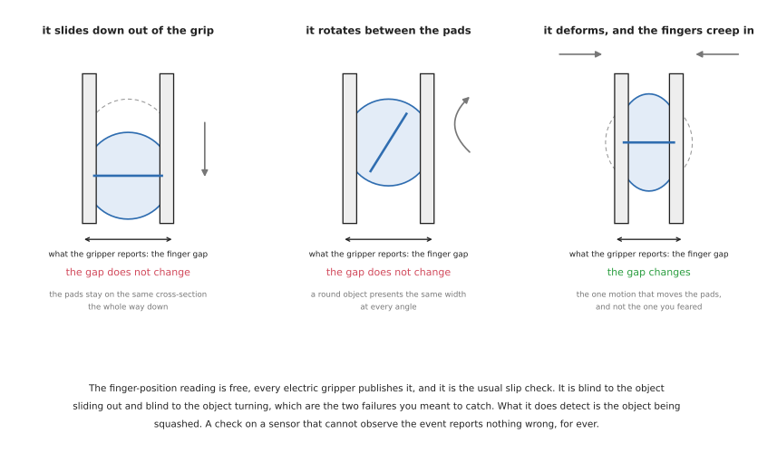

# Holding on: force, slip, compliance and letting go

The fingers have closed. Everything up to this point has been a prediction, and
from here on there is a real object in a real gripper and a sensor that can tell
you something about it. This document is that half: how hard to squeeze, how to
find out whether the squeeze was right, what to do when the object moves in the
fingers, and how to put it down without dropping it.

It is the part of gripping with the most silent failures, because almost
everything here can go wrong without producing an error. A grip that is 30 per
cent too loose looks identical to a good one until an acceleration arrives. A
slip check watching a sensor that cannot observe slipping reports "no slip"
forever. A release that has not actually released looks like a successful place
until the arm moves away.

## Who this is for

Someone whose robot picks things up and sometimes drops them, or crushes them, or
puts them down in the wrong place. It assumes [choosing a
grip](03_choosing-a-grip.md) for the friction arithmetic and the
[overview](01_overview.md) for the distinction between a force fit and a form
fit. The force-sensing hardware itself is in
[grippers and hardware, section 8](02_grippers-and-hardware.md#8-the-sensors-that-go-on-a-gripper),
and the perception area covers [measuring by
touch](../06_object-perception/02_sensors.md#2-measuring-by-touch), which this
document builds on rather than repeats.

## Contents

1. [The squeeze sequence](#1-the-squeeze-sequence)
2. [What force control a gripper actually gives you](#2-what-force-control-a-gripper-actually-gives-you)
3. [Compliance: impedance and admittance](#3-compliance-impedance-and-admittance)
4. [Slip, and the checks that cannot fire](#4-slip-and-the-checks-that-cannot-fire)
5. [When the object moves in the fingers](#5-when-the-object-moves-in-the-fingers)
6. [Regrasping](#6-regrasping)
7. [In-hand manipulation](#7-in-hand-manipulation)
8. [Letting go](#8-letting-go)

---

## 1. The squeeze sequence

The force you need depends on the mass, and you cannot weigh the object until you
are holding it. That circularity is the whole structure of this section, and it
resolves into a five-step sequence that is worth following in order.

**Estimate.** Before touching anything, produce a mass estimate from the measured
geometry. For a hollow object the right model is a shell rather than a solid:
take the outline, multiply the swept wall area by a wall thickness and a density,
and add the base as a disc. The [perception
area](../06_object-perception/02_sensors.md#22-estimating-a-mass-before-you-can-weigh-it)
works this through. Expect to be about a third out in either direction, and
design for that rather than trying to improve it.

**Grip gently.** Apply the force the estimate demands, using
[the friction formula](03_choosing-a-grip.md#4-how-hard-to-squeeze-from-first-principles),
and no more. Being too gentle costs you a slip you will detect; being too firm
costs you an object you cannot un-break.

**Lift a little.** Ten millimetres is enough. The point is to transfer the weight
to the wrist without committing to a move.

**Weigh.** Read the wrist force sensor with the arm held still, take the median
of a few dozen samples rather than a single reading, and rotate the measured
wrench into the world frame before taking the vertical component. Both of those
are traps the perception area documents in detail, and both produce confidently
wrong numbers rather than errors.

**Correct.** Recompute the required force from the measured mass and apply it. If
the measured mass exceeds what the object's damage cap allows you to hold,
**refuse** rather than clamping to the cap and lifting anyway.

The reason to have all five steps rather than three is that each one fails in a
way the next catches. If the estimate were reliable you would not need the wrist
sensor. If it were absent you would not know where to start. The sequence is a
cheap guess checked by an expensive measurement, which is a pattern worth
recognising because it appears throughout robotics.

### 1.1 What this costs in cycle time

The pause to weigh is the expensive part, and it is worth knowing how expensive
before deciding to skip it. A median over 32 samples at 100 Hz is a third of a
second. The settling time before those samples are worth taking is comparable.
Against a pick-and-place cycle of eight to twelve seconds, the whole weighing
step is well under ten per cent, which for anything fragile is the cheapest
insurance available.

For comparison, the gripper's own motion is faster than most people assume.
Robotiq specify finger speeds of 20 to 150 mm/s on the 2F-85 and 30 to 250 mm/s
on the 2F-140. OnRobot quote a gripping time of 200 ms for the 2FG7, including
brake activation, and 0.35 s to grip and 0.20 s to release for the VGC10 vacuum
gripper. Closing the fingers is rarely the bottleneck.

## 2. What force control a gripper actually gives you

"Force control" on a gripper means much less than it does on an arm, and the gap
between the two is a common source of disappointment.

### 2.1 The command is a torque request, not a force

On an electric two-finger gripper you send a position, a speed and a force
setting. The force setting is a current limit on the motor. The gripper drives
the fingers closed until it reaches the commanded position or until the motor
current reaches the limit, and then it stops and holds.

What that means in practice:

**You cannot command a force directly.** You command a position the fingers will
not reach and a current limit they will. The force that arrives at the object is
whatever the mechanism produces at that current, in the configuration it happens
to be in.

**The force that arrives depends on the object.** Robotiq publish measured forces
for the 2F-85 against payloads of different hardness. Against a steel part the
range is 25 to 220 N. Against a 40 A durometer silicone rubber part it is 25 to
155 N. Against a 10 A durometer neoprene part it is 25 to 115 N. Same gripper,
same setting, half the force, because a soft object gives way and the mechanism
reaches its geometry before it reaches its current limit.

**The gripper's own specification is not internally consistent.** Robotiq's
headline mechanical specification for the 2F-85 gives a grasp force of 20 to
235 N with their standard silicone fingertip. Their measured table, taken with
the same fingertip, gives 25 to 220 N. The difference is small and it is a useful
reminder that a headline figure is a design target and a measured table is a
measurement.

**The accuracy varies enormously between products.** Robotiq specify force
repeatability of ±10 per cent on the 2F-85. OnRobot specify a gripping force
deviation of **±25 per cent** on the RG2 and a tolerance of ±5 N on the 2FG7.
A quarter is a lot when your calculated requirement is 8 N, and it has to go into
your safety factor.

### 2.2 The things a gripper does automatically

Two behaviours are built into most industrial grippers and they surprise people
because they are not commanded.

**Self-locking.** Robotiq state that the 2-finger gripper is self-locking, and
OnRobot state that the RG2 holds the workpiece in the event of power loss. The
mechanism holds without motor torque. This is a safety property and it is a good
one, and it also means that "the gripper is holding" tells you nothing about
whether the motor is still commanding anything.

**Automatic regrasp.** Robotiq's 2-finger grippers re-squeeze on their own if the
object creeps. The behaviour is tied to the force setting, and the coupling is
one of the sharpest traps in this document:

| Force setting | Behaviour | Regrasp |
| --- | --- | --- |
| 0 | very fragile and deformable objects, lowest force | **off** |
| 1 to 127 | solid and fragile objects, low torque | on |
| 128 to 255 | solid and strong objects, high torque | on |

**The one setting you would choose for a fragile object is the one setting with
no automatic slip recovery.** That is a defensible design — you would not want a
gripper squeezing harder on its own around a wine glass — and it is not what
anyone expects. If you set the force to zero for glassware, the entire burden of
detecting and responding to slip moves to your software, and nothing tells you
that it has.

### 2.3 The grasp-detected signal answers a weaker question than it appears to

Every two-finger gripper reports whether it stopped because it hit something.
Robotiq expose four states: the fingers are moving, they stopped on contact while
opening, they stopped on contact while closing, or they reached the requested
position with nothing detected. The third state is what people read as "grasp
successful".

It means the fingers stopped early. It does not distinguish between:

- a good grip on the object
- a grip on the wrong part of the object
- a grip on two objects at once
- a grip on the edge of a fixture or the tote wall
- a finger fouled on something else entirely
- an object gripped but about to rotate out, because the grasp missed the centre
  of mass

**The check that distinguishes these is the wrist taking the weight**, which is a
different sensor answering a different question. The pattern — watch the sensor
that observes the event you care about, not the one nearest to it — is the same
one the perception area sets out for [the guarded
move](../06_object-perception/02_sensors.md#21-what-you-can-actually-do-with-it),
and it recurs so often in contact work that it is worth treating as a rule.

Robotiq's object-detection state does contain one genuinely useful transition:
if the state was "stopped on contact while closing" and becomes "reached the
requested position", the object has left the fingers. That is a real loss
detector and it is free. It fires when the object has gone completely, which is
later than you want but better than nothing.

## 3. Compliance: impedance and admittance

Compliance means the robot yields when something pushes on it, rather than
insisting on its commanded position. It is what lets an arm slide a part into a
hole it is slightly misaligned with, and it is how anything is assembled by a
robot.

There are two ways to achieve it and they are not interchangeable.

**Impedance control** commands *forces* and lets the position follow. The
controller decides what force to apply based on how far the arm is from where it
was asked to be, exactly like a spring. It needs an arm that can be commanded in
torque, which means an arm with torque sensing or very good motor-current
control.

**Admittance control** commands *positions* and lets the force decide them. The
controller reads a force sensor, works out how the arm should move in response,
and commands that motion. It needs a force sensor and a position-controlled arm,
which is the common industrial case.

The practical difference is which hardware you have:

| | Impedance | Admittance |
| --- | --- | --- |
| what the controller commands | torque | position |
| what it needs from the arm | torque control | position control, which every arm has |
| what it needs in sensors | joint torque sensing, ideally | a wrist force-torque sensor |
| behaves well against | stiff environments | soft environments |
| behaves badly against | very soft environments, where it feels sluggish | **stiff environments, where it can go unstable** |
| typical arms | Franka, KUKA iiwa, anything with joint torque sensors | a UR or an industrial arm with a wrist sensor bolted on |

**The instability in the bottom-right cell is the one to know about.** An
admittance controller on a stiff arm pressing against a stiff surface is a loop
with high gain and real delay in it, and it oscillates — the arm buzzes against
the surface, which is loud, alarming and occasionally destructive. Reducing the
apparent mass and damping to make the arm feel responsive is exactly the change
that makes this worse. If your compliant insertion works against foam and
chatters against metal, this is why, and the fix is more damping rather than more
force resolution.

**One thing that is not compliance control.** A collaborative arm's safety
function, which stops the arm when it detects an unexpected force, is not
compliance. It is a monitor with a threshold, it acts by stopping rather than by
yielding, and it will happily trigger in the middle of an insertion you intended.
The two are configured separately and confusing them is common.

### 3.1 What ROS 2 actually ships

This is worth stating precisely, because the gap between the literature and the
packages is wide.

[ros2_controllers](https://github.com/ros-controls/ros2_controllers) (Apache-2.0,
actively developed) contains exactly four things relevant here:
`parallel_gripper_controller`, `admittance_controller`,
`force_torque_sensor_broadcaster` and `pid_controller`. **There is no impedance
controller in upstream ros2_controllers.** If you want impedance control you are
going outside the core packages.

| Package | Licence | State in September 2026 | What it gives you |
| --- | --- | --- | --- |
| [ros2_controllers](https://github.com/ros-controls/ros2_controllers) | Apache-2.0 | very active | admittance control, gripper control, the force-torque broadcaster |
| [cartesian_controllers](https://github.com/fzi-forschungszentrum-informatik/cartesian_controllers) | BSD-3-Clause | **last pushed October 2024** | FZI's Cartesian force and compliance controllers; the best-known option and going stale |
| [crisp_controllers](https://github.com/learnsyslab/crisp_controllers) | MIT | pushed August 2026 | Cartesian **impedance** and operational-space control for any arm with an effort interface; the maintained permissive option |
| [franka_ros2](https://github.com/frankarobotics/franka_ros2) | Apache-2.0 | pushed September 2026 | Cartesian and joint impedance, as *example* controllers rather than a supported product |
| [moveit2](https://github.com/moveit/moveit2) | BSD-3-Clause | very active | **nothing here at all** — see below |

**MoveIt 2 has no force control and no grasping.** It plans collision-free arm
motion to a pose you supply. There is no compliance package and no grasp package
anywhere in the repository. The two add-ons that filled the gap are separate:
[moveit_grasps](https://github.com/moveit/moveit_grasps) was last pushed in
November 2022 and should be treated as unmaintained, and
[moveit_task_constructor](https://github.com/moveit/moveit_task_constructor) is
actively maintained and is the live route for sequencing a pick and place. This
surprises people because MoveIt is what the tutorials use for pick and place; the
pick in those tutorials is a taught grip and a fixed squeeze.

Five jobs compliant control suits:

- inserting a part into a hole with a tolerance tighter than the arm's accuracy
- sliding along a surface — polishing, deburring, wiping
- placing an object on a surface whose exact height you do not know
- any contact where the alternative is to position perfectly, which is more
  expensive than to comply
- hand-guiding, where a person moves the arm directly

Five jobs it cannot do:

- make a bad grasp good; it operates on the arm, not on the fingers
- replace a safety function, which is separate certified equipment
- work without a force sensor or torque-capable joints
- stay stable against a stiff surface if it is admittance-based and badly tuned
- help at all during free motion, where there is nothing to comply with

## 4. Slip, and the checks that cannot fire

Slip is the object moving relative to the fingers. It is the characteristic
failure of a force fit, it is almost always caused by too little friction rather
than too little force, and detecting it is harder than it looks for one specific
reason.

### 4.1 The finger-gap check, and what it cannot see

The cheapest slip detector watches the gripper's own finger position. If the
fingers creep closed, the object is being squeezed out or is deforming, and
something is wrong. Every electric gripper reports finger position, so this check
is free.

It detects exactly one of the three ways an object moves in the fingers, and it
is not the common one.

**Sliding down out of the grip** is what people mean by slip, and the finger gap
does not change while it happens. The pads stay pressed against the same
cross-section of the object the whole way. The gap changes only at the moment the
object has left entirely, at which point the fingers snap shut on nothing. The
gripper's own loss detector — Robotiq's transition from "stopped on contact" to
"reached the requested position" — fires exactly then, which is to say after the
object is on the floor.

**Rotating between the pads** is what [an off-centre centre of
mass](03_choosing-a-grip.md#5-the-centre-of-mass-and-the-torque-nobody-budgets-for)
produces, and for a round or symmetric object it changes nothing about the gap at
all. The object ends up at an angle, arrives at the next station in an
orientation nobody planned, and the gripper reports a perfect grip throughout.

**The fingers creeping closed** is the one case the gap does see. It happens when
the object is deforming under the squeeze, or when a tapered object is being
drawn into a narrower section. Both are real and neither is what you were
worried about.

So the free check misses the two failures you care about and catches the one you
did not ask about. This is the clearest example in these documents of
a check on a sensor that cannot observe the event, which the perception area
raises as [a diagnosis-ladder
rung](../06_object-perception/07_making-it-work.md#3-when-it-does-not-work-a-diagnosis-ladder)
and which keeps turning out to be the actual cause.

### 4.2 What does see slip

**A tactile sensor reading shear.** A sensor that measures the sideways force at
the contact patch, rather than just the normal force, sees the object beginning
to move before it has visibly moved. This is the right instrument and it is the
expensive one.

**High-frequency vibration.** Slipping surfaces produce a characteristic
micro-vibration, and an accelerometer or a tactile sensor sampled fast enough
picks it up. This detects incipient slip, which is the useful moment, because the
response — squeeze a little harder — still works.

**A second look.** A wrist camera checking the object's pose after the lift costs
one picture and catches all three motions. It is slow, it only works once the
motion has finished, and it needs the object to be visible, but it requires no
extra hardware at all and it is what most working cells actually do.

**The wrist force sensor.** The weight reading changes if the object's position
relative to the wrist changes, because the torque changes even when the force
does not. Watching the *torque* rather than the force is a sensitive test for
rotation in the fingers, and it uses a sensor you probably already have for the
weighing step.

### 4.3 The state of the open-source software, which is worth saying plainly

There is essentially none. A search of GitHub in September 2026 for maintained
slip-detection software returns nothing above single-digit star counts: the
largest result in the entire category has eight stars and no licence file. The
tactile field as a whole is quiet — GelSight's own SDK,
[gsrobotics](https://github.com/gelsightinc/gsrobotics), is the largest real
piece of software in the area at around 200 stars, and it is **GPL-3.0**, which
is a copyleft obligation if you link it into a product. Meta's
[digit-interface](https://github.com/facebookresearch/digit-interface) driver is
**CC BY-NC 4.0**, which is both non-commercial and an odd choice of licence for a
device driver, and the repository is archived. Its sibling simulator
[tacto](https://github.com/facebookresearch/tacto) is MIT and also archived.

So if a tutorial implies you can install slip detection, it is wrong. What exists
is research code, mostly unlicensed, mostly one-off. Plan to write the check
yourself against whatever sensor you have, and plan for it to be one of the four
things in 4.2 rather than a library.

Five jobs slip detection suits:

- objects whose mass you could not estimate well, where the first grip is a guess
- anything that may be wet, oily or dusty, where the friction coefficient moves
- long carries, where a slow creep accumulates
- verifying a grasp before a delicate placement
- collecting evidence about why a cell drops things, which is often not what the
  team assumes

Five jobs it cannot do:

- see sliding or rotation, if it is a finger-gap check — section 4.1
- act fast enough to help if it only fires once the object has moved
- work on a suction gripper, which has no equivalent signal short of a vacuum
  pressure drop
- be bought as a maintained library, as above
- substitute for getting the grasp geometry right, which is where slip is
  actually prevented

## 5. When the object moves in the fingers

Detecting slip is only useful if there is a response, and there are four, in
increasing order of cost.

**Squeeze harder.** The obvious one, and it is right only when the slip was
caused by too little force and the object can take more. Check it against the
damage cap before doing it. If the required force now exceeds the cap, this
object cannot be held and the correct response is to put it down carefully and
report, not to squeeze to the cap and hope.

**Slow down.** If the slip started when the move started, the cause is
acceleration, and reducing the acceleration costs cycle time and nothing else.
This is almost always the right first experiment, and it is almost never the one
people try first.

**Put it down and grip again.** Section 6.

**Give up on this object.** The most underrated response. An object that has
slipped twice is telling you something about its surface, its mass or its shape,
and a cell that records that and moves on is more useful than one that retries
indefinitely.

There is a fifth response that is worth naming because people reach for it and it
is usually wrong: **changing the grasp point on the fly**. Once the object has
moved in the fingers, you no longer know where it is, so a corrected grasp point
computed from the original measurement is computed from stale data. Re-measure
first or do not correct.

## 6. Regrasping

Regrasping is putting the object down and picking it up again differently. It
sounds like a failure recovery and it is more often a deliberate step in a plan.

Three situations need it:

**The grasp that was reachable is not the grasp that is useful.** The only way to
pick an object off a table may be from above, and the only way to insert it may
be from the side. Neither is wrong; they are different grasps and something has
to convert one into the other.

**The object needs to be turned over.** Nothing about a two-finger grasp lets you
invert an object you gripped from above without releasing it.

**The first grip was wrong.** The object rotated, or is held too near its end, or
the fingers landed on the region you wanted to avoid.

The mechanics are straightforward and the planning is not. You need a place to
put the object down where it will be stable, and an assurance that it will land
in a known pose. **The second of those is the hard part**, and it is the reason
regrasping is less common in industry than in papers: an object set down on a
table settles into whichever of its stable poses it was nearest to, and predicting
which one requires knowing its centre of mass and its friction. The industrial
answer is a fixture — a shaped nest that admits exactly one pose — which converts
an unpredictable settle into a known one for the price of a machined part.

Five jobs regrasping suits:

- converting a pick grasp into an insertion grasp
- turning an object over, which no two-finger grasp does in the hand
- recovering from a grip that is geometrically valid and functionally wrong
- reducing the requirement on the first grasp, which can then be the easy one
- any cell that already has a fixture, where the second pose is free

Five jobs it cannot do:

- work without somewhere to put the object down
- guarantee the intermediate pose, unless a fixture provides it
- fit in a tight cycle time, since it costs a full extra pick and place
- handle anything that cannot be set down — a liquid, something hot, something
  that must not touch a surface
- replace in-hand manipulation for continuous reorientation

## 7. In-hand manipulation

Moving the object relative to the hand without putting it down. It is the thing
multi-finger hands exist for, and it is worth being accurate about how available
it is.

Three kinds, in increasing difficulty.

**Controlled sliding**, where you deliberately reduce the grip until the object
slides under gravity to a new position, then grip again. This works with two
fingers, it needs only force control, and it is genuinely used — letting a
screwdriver slide through the fingers until the shaft is where you want it is a
real technique.

**Pivoting**, where you loosen the grip and let the object rotate about the grasp
axis under gravity, then re-tighten. Also achievable with two fingers. Also
genuinely used, and the same physics as the [unwanted rotation in section
4.1](#41-the-finger-gap-check-and-what-it-cannot-see), deliberately.

**Finger gaiting**, where fingers release and re-place one at a time so the
object is continuously held while being reoriented. This needs a multi-finger
hand and it is the hard research problem. The literature is large and the
deployed systems are approximately none.

The practical reading is that the first two are available to you today with the
gripper you have, and are underused; the third is not available and you should
plan around regrasping instead.

Five jobs in-hand manipulation suits:

- adjusting how far a long object protrudes from the fingers
- correcting a small rotation without a full regrasp
- tool use, where the tool must be held in a specific way to function
- reducing cycle time against regrasping, when it works
- research on multi-finger hands, which is where the third kind lives

Five jobs it cannot do:

- be planned reliably, since it depends on friction you do not know precisely
- work on anything fragile, since it involves deliberately allowing slip
- reorient an object through a large angle with two fingers
- be done without either gravity or a surface to push against
- be bought as a working capability in 2026

## 8. Letting go

The last step, and the one with the most failures per line of code.

**Opening the fingers is not releasing.** Three mechanisms keep an object
attached after the command:

- A soft or tacky surface sticks to the pad, and the object comes away with one
  finger and then falls.
- A form-fit grip needs the fingers to open past the object's widest point before
  the object is free, which is further than they opened to grip it.
- Suction does not stop when the pump does. Residual vacuum in the cup and the
  line persists for a noticeable time, which is exactly why vacuum grippers have
  a blow-off function that pushes air back through the cup. A release sequence
  that turns the pump off and moves away will drag the object with it.

Magnetic grippers have the same problem in a different form: residual magnetism
in the part keeps it attached after the magnet is switched, and some grippers
include a demagnetising pulse for this.

**Contact is not support.** Having lowered the object until something touched,
you have not established that the object is being held up. An object whose rim
has caught on the lip of a fixture registers a perfectly good contact while still
hanging entirely from the gripper, and opening the fingers then drops it. Before
releasing anything, confirm the weight has actually gone: the wrist should be
back to reading the gripper alone. The perception area covers this and [the
related trap that a pad sensor cannot feel a held object's base touching
down](../06_object-perception/02_sensors.md#21-what-you-can-actually-do-with-it),
because the sensor that observes the event is the load leaving the wrist rather
than anything on the fingers.

**Retract along the direction that does not disturb what you placed.** Lifting
straight up from a placed object is usually safe. Moving sideways at the moment
the fingers open is how placed objects get knocked over, and it is a common
consequence of blending the release into the next move for cycle time.

A release sequence that works, in order:

1. Move down until the weight leaves the wrist, not until something touches.
2. Confirm the wrist reads the gripper alone.
3. Open the fingers past the object's widest point, not merely to the width you
   gripped at.
4. For suction, apply blow-off and wait for it; for magnetic, switch and allow
   the demagnetising pulse.
5. Retract straight along the approach direction before any other motion.
6. Confirm the object is where you put it, if the cost of it not being there is
   higher than the cost of a picture.

Step 6 is optional in the sense that most cells skip it, and it is the difference
between a cell that reports a failed placement and one that carries on stacking
onto a gap.
