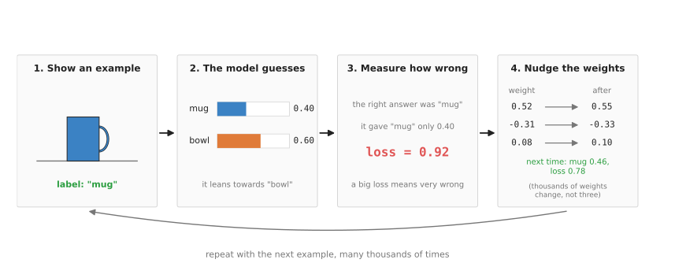
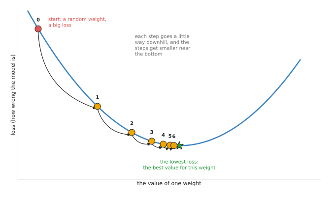
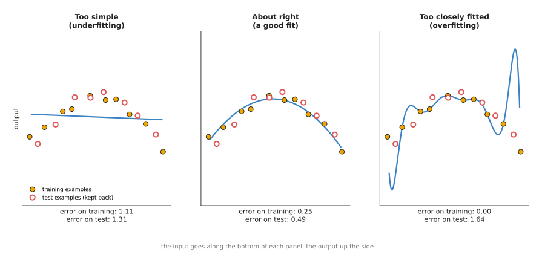

# How a model learns

The [previous page](01_what-a-model-is.md) said that a model is a function
learned from examples, and that a neural network is a model made of weights.
This page answers the next question: how does a computer program find the
right weights?

It is for a reader who has read the previous page and nothing else about
machine learning. So it follows one small example, a model that tells a mug
from a bowl in a photo, through every step of training. Because that example
is a small one, it uses no maths beyond adding, multiplying and reading a
graph.

By the end you will know the words that every later page uses: example,
label, loss, gradient descent, learning rate, epoch, training set, test set,
overfitting, underfitting and checkpoint.

> Before this page, it helps to have read [least-squares fitting](../../06_programming-techniques/04_fitting-and-estimation/02_most-used/01_least-squares-fitting.md), which finds the two numbers of a line by making the sum of squared errors as small as possible. Training a model does the same job for many more numbers.

## Contents

1. [Examples and labels](#1-examples-and-labels)
2. [The first guess is random](#2-the-first-guess-is-random)
3. [Measuring how wrong a guess is: the loss](#3-measuring-how-wrong-a-guess-is-the-loss)
4. [Changing the weights a little: gradient descent](#4-changing-the-weights-a-little-gradient-descent)
5. [Doing it many times: batches and epochs](#5-doing-it-many-times-batches-and-epochs)
6. [Keeping some examples back: the test set](#6-keeping-some-examples-back-the-test-set)
7. [Too simple and too close: underfitting and overfitting](#7-too-simple-and-too-close-underfitting-and-overfitting)
8. [What a trained model file is](#8-what-a-trained-model-file-is)
9. [Why train this way, and what it costs](#9-why-train-this-way-and-what-it-costs)
10. [Where to read next](#10-where-to-read-next)
11. [Using it in Python](#11-using-it-in-python)

---

## 1. Examples and labels

Training starts with a pile of examples, and for the mug-or-bowl model one
example is one photo from the arm's camera.

Each example needs the right answer written next to it, and that right answer
is called the **label**. For a photo of a mug the label is "mug", and for a
photo of a bowl the label is "bowl". Usually a person looks at each photo and
types the label, so this work is called **labelling**, and it is often the
slowest part of the whole job.

A pile of examples with their labels is called a **dataset**. A small dataset
for a job like this might have a few hundred photos, while a large public
dataset can have millions. For example, ImageNet, a dataset that many seeing
models learned from, has about 1.2 million training photos sorted into 1,000
kinds of object.

The label must match what you want the model to output. So if you want the
model to draw a box around the mug, each label must be a box drawn by a
person. In the same way, if you want the model to move the arm, each label
must be the arm movement that a person made. The [data
page](05_where-the-data-comes-from.md) covers how robot labels are collected.

Learning from examples that have labels is called **supervised learning**,
because the labels supervise the model in the sense that they tell it the
right answer every time. Most models in this book are trained this way, while
the [reinforcement learning
page](../06_movement-models/03_also-used/01_reinforcement-learning-policies.md)
describes the main other way.

---

## 2. The first guess is random

The weights are what the model has to get right, so training has to start them
somewhere. Before training, the model's weights are set to small random
numbers. A model with random weights still gives an output for every photo,
because it is still a fixed calculation, but the output has nothing to do with
the photo. It might, for example, give "mug" a score of 0.40 and "bowl" a
score of 0.60 for a photo of a mug.

Training is the process of changing the weights until the outputs are right,
and it repeats the same four steps, shown in the picture below:

1. Show the model one example.
2. Let the model make its guess.
3. Measure how wrong the guess is.
4. Change the weights a little, so that the guess would be a little less wrong.



The model gives the mug only 0.40, the loss measures how wrong that is as 0.92, and after each weight is changed a little the same photo would score 0.46 for "mug", with a smaller loss of 0.78.

Steps 1 and 2 are only the model doing its normal calculation, so the next two
sections explain steps 3 and 4.

---

## 3. Measuring how wrong a guess is: the loss

To improve a guess, the program first needs to know how wrong the guess is,
and it needs that as a single number. That number is called the **loss**, and
a loss of 0 means the guess was exactly right, while a bigger loss means the
guess was more wrong.

There are several ways to calculate a loss, and the right one depends on what
the model outputs.

When the model gives a score for each kind of object, a common loss looks only
at the score the model gave to the right answer. If that score is 1 the loss
is 0, and as that score gets smaller the loss gets bigger, faster and faster.
The table below shows a few values, so read each row as one guess for a photo
of a mug.

| Score the model gave "mug" | Loss |
| --- | --- |
| 0.93 | 0.07 |
| 0.46 | 0.78 |
| 0.40 | 0.92 |
| 0.01 | 4.61 |

The loss in each row is minus the natural logarithm of the score, but you do
not need to know what a logarithm is to follow this book. The only thing that
matters is the shape, which is that a confident right answer gives a loss near
0, while a confident wrong answer gives a big loss. This loss is called the
**cross-entropy loss**.

When the model outputs a measurement instead, such as how far to open the
gripper, the loss is usually simpler. It is just the difference between the
model's number and the label's number, squared so that it is never negative.
This is called the **squared error**.

So the loss turns "how wrong is this guess?" into a single number that a
program can make smaller.

---

## 4. Changing the weights a little: gradient descent

Now that the loss gives one number to work with, the program must change the
weights so that this number goes down. It cannot try every possible set of
weights, because even a small network has thousands of them.

Instead it asks one question about each weight: "if this weight were a tiny
bit bigger, would the loss go up or down, and by how much?" The answer for one
weight is called its **slope**, and the list of slopes for all the weights
together is called the **gradient**.

Once it knows the slope, the program changes the weight a small amount in the
direction that makes the loss go down. So if making the weight bigger raises
the loss, the program makes that weight a bit smaller, and if making it bigger
lowers the loss, the program makes it a bit bigger. It does this for every
weight at the same time.

This method is called **gradient descent**, because "descent" means going
down, and the thing going down here is the loss.

The picture below shows gradient descent for a model that has only one weight,
so that the curve can show the loss for every value of that weight.



Starting from a random weight with a big loss, each step moves the weight a little way down the curve, and the steps get shorter as the curve flattens near the lowest point.

The numbers behind the picture are these. The weight starts at -1.50, where
the loss is 7.65, and after the first step the weight is -0.03 and the loss is
2.77. After six steps the weight is 1.87 and the loss is 0.31, which is close
to the lowest possible loss on this curve, 0.30 at a weight of 2.0.

Two things in the picture are worth noticing before going on.

- Each step is a fixed fraction of the slope, so where the curve is steep the
  step is long, and near the bottom, where the curve is almost flat, the steps
  are short. That fraction is called the **learning rate**, and in this
  picture it is 0.35.
- The program never sees the whole curve, because it only knows the slope at
  the point where it is, but that is enough to know which way is down.

The learning rate is therefore something you have to choose with care. If it
is too small, training takes a very long time, while if it is too big, each
step jumps right over the lowest point and the loss can get worse instead of
better.

A real network has millions of weights, not one, so the curve becomes a
surface in millions of directions that nobody can draw. But the rule for each
weight is the same: find its slope, and move it a little in the downhill
direction.

The slopes for all the weights of a neural network can be worked out in one
pass backwards through the layers, from the output to the input. This method
is called **backpropagation**, and you will see the word often. In other
words, backpropagation is the way the slopes are calculated, and gradient
descent is what is done with them.

---

## 5. Doing it many times: batches and epochs

One step of gradient descent changes the weights only a little, so training
needs a great many steps.

In practice the program does not take one step per example. Instead it takes a
small group of examples, for example 32 photos, works out the average loss
over the group, and then takes one step for the whole group. This group is
called a **batch**, and using a batch makes each step less affected by one
unusual photo, while a graphics card can work on all 32 photos at the same
time.

One pass through every example in the dataset is called an **epoch**. So if
the dataset has 3,200 photos and each batch has 32, one epoch is 100 steps.
Training usually runs for many epochs, which means the model sees each photo
many times, and each time the weights change a little more.

While training runs, the program prints the average loss after each epoch, and
that loss should go down quickly at first and then more and more slowly. When
it stops going down, training has done most of what it can.

---

## 6. Keeping some examples back: the test set

Training drives the loss down on the examples it is given, but a low loss on
those examples does not prove that the model is good. The model might have
learned those exact photos instead of learning what makes a mug a mug, so the
only way to find out is to try it on photos it has never seen.

So before training starts, the examples are split into separate piles:

- The **training set** is the pile that gradient descent uses to change the
  weights, and it is usually the biggest pile, for example 80% of the
  examples.
- The **validation set** is a smaller pile, for example 10%, and the model
  never trains on it. Instead people check the loss on it during training, to
  decide things such as when to stop.
- The **test set** is the last pile, for example the other 10%, and nobody
  looks at it until training is completely finished. This is the pile that
  gives the final, honest score.

The test set must be truly new to the model, because if the same mug on the
same table appears in both the training set and the test set, the test score
will be too good. For a robot, a fair test set therefore uses objects, rooms
or lighting that the training set did not have.

---

## 7. Too simple and too close: underfitting and overfitting

Once you have a test set, it shows two common ways for a model to go wrong.
The picture below shows both, using a model with one input number and one
output number, so that it can be drawn as a curve.



The filled dots are the training examples and the hollow dots are test examples that were kept back; the error under each panel is the average distance from the curve to the dots.

Read the three panels from left to right, from a model that is too simple to a
model that follows its examples too closely.

- On the left, the model is a straight line, which is too simple to follow the
  shape of the points. Its error is high on the training examples, 1.11, and
  high on the test examples, 1.31. This is called **underfitting**, and it
  means the model has not learned the pattern at all.
- In the middle, the model is a smooth curve, and its error is low on both
  piles, 0.25 on training and 0.49 on test. This is the result you want.
- On the right, the model is a wavy curve that passes exactly through every
  training point. Its training error is 0.00, but between the training points
  it swings far away, and its test error, 1.64, is the worst of the three.
  This is called **overfitting**, because the model has learned the exact
  training examples, including their small random errors, instead of the
  general pattern.

Overfitting is the more common problem with neural networks, because they have
so many weights that they can learn the training set exactly. The sign is
always the same: the training loss keeps going down while the validation loss
stops going down or starts going up.

Because overfitting is so common, people do four main things about it:

- Collect more examples, because this is the most reliable fix of the four.
- Make more examples from the ones they have, since a photo can be turned
  slightly, cropped, made darker or made lighter and still show a mug. This is
  called **data augmentation**.
- Stop training when the validation loss stops going down, which is called
  **early stopping**.
- Use a smaller model, or start from a model that was already trained on a
  much larger dataset. The [data page](05_where-the-data-comes-from.md)
  explains this second idea, which is called fine-tuning.

Underfitting has the opposite fixes: a bigger model, or more training.

---

## 8. What a trained model file is

When training finishes, the program saves the weights to a file, and this file
is what people mean by "a trained model" or "the model weights". It is also
called a **checkpoint**, because it is a saved state that you can load and
continue from.

The file is mostly a very long list of numbers, with one number for every
weight in the network. It does not contain the training photos, and it does
not contain any rules written in words, so nobody can open it and read how the
model tells a mug from a bowl.

The file on its own is not enough to use the model, because you also need the
program code that describes the network: how many layers there are, how big
each one is, and how they connect. In other words, the code says which
calculation to do, and the file says which numbers to use in it. When you
download a model you usually get both, or you get the weights and install the
code from a library.

A few file types are common, and you will see their names on model download
pages.

- `.pt` or `.pth` files are saved by PyTorch, which is the most widely used
  library for training neural networks.
- `.safetensors` files hold the same kind of weights in a format that is safe
  to load from a stranger, because loading it cannot run any hidden program.
- `.onnx` files use the Open Neural Network Exchange (ONNX) format, which
  stores both the network's layout and its weights, so that other programs can
  run the model without PyTorch.

The size of the file follows from the number of weights, because each weight
is usually stored in 4 bytes. For example, ResNet-50, a well-known network for
photos, has about 25 million weights, so its file is about 100 megabytes. The
largest models in this book have billions of weights, which means their files
are many gigabytes.

Using a trained model to get an answer is called **inference**, and inference
only does the forward calculation, from input to output. Because it does not
change the weights, it needs far less computing power than training. The
[running-a-model
page](../10_making-models-work-on-an-arm/02_most-used/02_running-a-model-on-a-robot.md)
covers inference on a real robot arm.

---

## 9. Why train this way, and what it costs

Gradient descent has now turned up at every stage of training, so this section
answers why it is used rather than the obvious alternative.

The obvious alternative is to try random changes, so you would change a weight
at random, keep the change if the loss went down, and undo it if not. This
works for a model with a handful of weights, but with millions of weights it
is hopeless, because almost every random change makes things slightly worse
and you learn nothing about which way to go. Gradient descent instead uses the
slope of every weight, so every step moves every weight in a useful direction.
That is why it is used to train nearly every neural network in this book.

Gradient descent costs you three things in return for that speed.

- It needs a lot of arithmetic, because every step runs the whole network
  forwards and then works out the slopes backwards. So a large model needs a
  graphics card, or many of them, for hours or days.
- It needs settings that you choose by hand, such as the learning rate, the
  batch size and the number of epochs. These are called **hyperparameters**,
  to tell them apart from the weights that training finds. Bad choices can
  make training fail, so finding good ones often takes several attempts.
- It only finds weights that fit the examples you gave it, so if the training
  set has no photos in dim light, no amount of training teaches the model
  about dim light. In other words, the quality of a model is limited by the
  quality of its data.

---

## 10. Where to read next

- [Inside a neural network](03_inside-a-neural-network.md) is the next page,
  and it shows what a single neuron calculates, and the layers used for
  pictures and sentences.
- [Where the data comes from](05_where-the-data-comes-from.md) explains how
  labelled examples for a robot arm are collected, and how fine-tuning reuses
  a model trained on other data.
- [The glossary in Book
  3](../../03_frameworks/04_one-arm-training/06_glossary.md#learning) defines
  the robot-learning words, such as demonstration and checkpoint, in one
  place.
- [Data and
  demonstration](../../03_frameworks/08_frontier/03_data-and-demonstration.md)
  in Book 3 goes further into how much data robot models need today.

---

## 11. Using it in Python

Sections 3 to 5 described training as a loop that repeats four steps: guess,
measure the loss, work out the gradient, and move every weight one small step.
This section shows that loop as the Python it really is, so that the words on
this page have something concrete to point at. This is the shape of the idea
rather than a finished program, because a real training script also loads data
from disk and saves checkpoints.

```python
import torch
from torch import nn
from torch.utils.data import TensorDataset, DataLoader

# X holds one example per row, y holds 1.0 for a mug and 0.0 for a bowl.
loader = DataLoader(TensorDataset(X, y), batch_size=32, shuffle=True)

model = nn.Sequential(nn.Linear(n_inputs, 16), nn.ReLU(), nn.Linear(16, 1))
loss_fn = nn.BCEWithLogitsLoss()                          # section 3's loss
optimiser = torch.optim.SGD(model.parameters(), lr=0.01)  # lr is section 4's step size

for epoch in range(100):                # section 5's epochs
    for inputs, labels in loader:       # section 5's batches
        loss = loss_fn(model(inputs), labels)
        optimiser.zero_grad()           # drop the previous batch's gradients
        loss.backward()                 # work out every weight's gradient
        optimiser.step()                # move every weight one small step

torch.save(model.state_dict(), "checkpoint.pt")   # section 8's model file
```

The three lines in the middle of the loop are the whole of gradient descent.
`loss.backward()` is section 4's gradient, and PyTorch works it out for every
weight at once without you writing a single derivative. `optimiser.step()` is
the step itself, and its size comes from the `lr` you chose. `zero_grad()` is
there because PyTorch adds each new gradient to whatever is already stored, so
you have to clear the store before each batch or the steps come out wrong.

The library gives you the gradients, the update rule, a choice of ready-made
losses, and the batching and shuffling of section 5. It also gives you
`state_dict()`, which is the dictionary of weights that section 8 called the
model file.

What you collect yourself is `X` and `y`, which is the examples and their
labels, and that is where nearly all the effort goes. You also decide how to
split them, because nothing in the code above keeps any examples back, and
without the test set of section 6 you cannot tell whether the model has learned
or memorised.

What you have to decide is the size of the network, the learning rate, the batch
size, and how many epochs to run before stopping. Section 7 explained why those
choices matter: too small a network underfits, too long a run overfits, and too
large a learning rate makes the loss jump about instead of falling. The network
above is a plain stack of `Linear` layers, which suits a short list of measured
numbers. A photograph needs the convolutional layers of the
[next page](03_inside-a-neural-network.md) instead.
