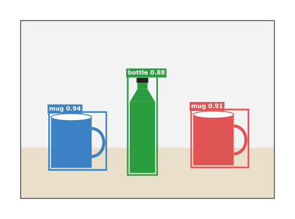
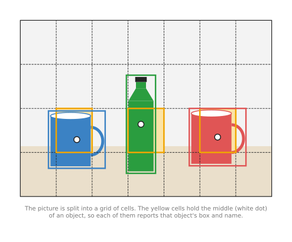
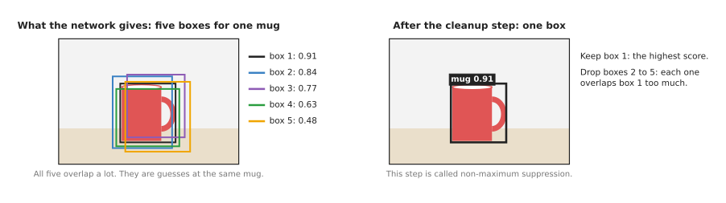

# Object detection

This page explains object detection, which means models that find each object in a
picture, draw a box around it and then name it. It answers five questions: what a
detector does, what goes in and what comes out, how it works inside, how it is
trained, and how a robot arm uses its boxes to pick something up.

It is written for a reader who has already read the page on [image
classification](../03_also-used/01_image-classification.md), because that page
explains pixels, scores, layers, the backbone and fine-tuning, and this page
uses those words without explaining them again.

Object detection is the most used seeing model on robot arms, and it is often the
first model a robot project tries, because good detectors are free to download and
fast enough for a live camera.

## Contents

1. [What it is](#1-what-it-is)
2. [What goes in and what comes out](#2-what-goes-in-and-what-comes-out)
3. [How it works inside](#3-how-it-works-inside)
   · [Two stages: first guess the places, then check each one](#two-stages-first-guess-the-places-then-check-each-one)
   · [One stage: look once, answer for every cell](#one-stage-look-once-answer-for-every-cell)
   · [Cleaning up the extra boxes](#cleaning-up-the-extra-boxes)
   · [Transformers: a fixed set of answers](#transformers-a-fixed-set-of-answers)
4. [How it is trained](#4-how-it-is-trained)
5. [Well-known models](#5-well-known-models)
6. [Where it is used on a robot arm](#6-where-it-is-used-on-a-robot-arm)
7. [What goes wrong](#7-what-goes-wrong)
8. [Why detection, and what it costs](#8-why-detection-and-what-it-costs)
9. [The written alternative](#9-the-written-alternative)
10. [Where to read next](#10-where-to-read-next)
11. [Using it in Python](#11-using-it-in-python)

---

## 1. What it is

An **object detector** is a model that finds every object it knows in a picture,
and for each one it gives a box around the object, the object's class and a score.

The box is called a **bounding box**, because it is the smallest upright
rectangle that holds the whole object. The class is a name from a fixed list,
just as it is for a classifier. Then the score says how sure the model is, on a
scale from 0 to 1. On a detector that score is usually called the
**confidence**.

Here is an everyday example: think of a person counting cars in a car park from a
photo, who looks over the photo, points at each car in turn, and says "car, car,
van, car". A detector does the same thing, because it points at each object with a
box and then gives each box a name.

The difference from a classifier is that a classifier gives one name for the whole
picture, while a detector gives one answer per object and says where each object
is. So a detector can tell the robot that there are three cups, and also which one
of them is nearest.

---

## 2. What goes in and what comes out

Now that you know what question a detector answers, here is the exact form of its
input and its output. The input is one camera picture, which on a robot arm is
usually a picture of the table or bin in front of the arm, taken from a camera on a
stand or on the arm's wrist.

The output is a list, in which each item describes one object with four numbers, a
name and a confidence:

- four numbers for the box, in pixels, which are usually the left and top edges
  together with the right and bottom edges. Some models give the middle of the box,
  its width and its height instead.
- the class, such as "mug" or "bottle".
- the confidence, such as 0.94.

The picture below shows the answer a detector gives for a photo of two mugs and a
bottle.



Each box has a tag with the class and the confidence, and those confidence numbers
are examples rather than real output.

The list can be empty, which means the model found nothing it knows, and it can
also hold objects the model is not at all sure about. So every program that uses
a detector sets a **confidence threshold**, and throws away every box whose
confidence is lower than that number. A threshold of 0.25 to 0.5 is a common
start. Book 2 discusses this choice in [confidence, and the
threshold](../../../02_perception/01_camera/02_finding-objects.md#53-confidence-and-the-threshold).

---

## 3. How it works inside

That list of boxes has to come from somewhere, and a detector begins the work just
as a classifier does. So a backbone turns the picture into grids of numbers that
describe edges, parts and objects, and then a detection **head** turns those grids
into boxes. There are three main ways to build that head, and this section takes
them in turn.

### Two stages: first guess the places, then check each one

The oldest way of building the head splits the work into two separate steps.

1. The first step looks over the backbone's grids and suggests a few hundred places
   that might hold an object, where each suggestion is a rough box. These
   suggestions are called **region proposals**.
2. The second step then looks at each proposal on its own, and gives that proposal
   a class and a confidence, as a classifier would. It also moves the edges of the
   box a little, so that the box fits the object better.

This way is accurate, but it is slower, because the second step runs once for each
proposal. The best-known model of this kind is Faster R-CNN, described in
[section 5](#5-well-known-models).

### One stage: look once, answer for every cell

A faster way does all of that in one step. So the name of the best-known model of
this kind says it directly: YOLO, short for "you only look once".

1. The picture is split into a grid of cells. A real model uses several grids at
   once, with small cells for small objects and large cells for large ones.
2. For each cell, the head asks: is the middle of an object inside this cell?
3. If the answer is yes, that cell gives the object's box, its class and a
   confidence.

The picture below shows the idea with one coarse grid.



The white dot marks the middle of each object, and the yellow cell around each dot
is the cell that reports that object. Its box can be larger than the cell itself,
because the backbone's numbers for each cell already carry information about the
area around it.

The whole picture goes through the network only once, which is why one-stage
detectors are fast enough to run on every frame of a live camera.

### Cleaning up the extra boxes

Both of the ways described so far share one side effect, because a one-stage or
two-stage detector usually gives several boxes for the same object. Nearby cells,
or nearby proposals, all see the same mug, and each one of them reports it
separately.

So the detector runs a cleanup step after the network, and that step is called
**non-maximum suppression**, or NMS, which works like this.

1. Sort all the boxes of one class by confidence, highest first.
2. Keep the box with the highest confidence.
3. Remove every other box that overlaps the kept box by more than a set amount.
4. Repeat with the next highest box that is still left.

The overlap is measured as the area the two boxes share, divided by the area they
cover together, and this number is called **intersection over union (IoU)**. It is
1 when the two boxes are the same and 0 when they do not touch at all, so a common
setting removes boxes with an IoU above 0.5 or so.

The picture below shows five boxes for one mug, and the one box that is left after
the cleanup.



The cleanup has one weakness, because two real objects that stand very close
together have boxes that overlap a lot, so the cleanup may then remove one of those
boxes by mistake.

### Transformers: a fixed set of answers

A newer way avoids that cleanup step altogether by using a transformer, the kind
of network that the [classification
page](../03_also-used/01_image-classification.md#3-how-it-works-inside)
mentioned. The first model of this kind was DETR, short for "detection
transformer".

1. The model starts with a fixed number of empty answer slots, for example 100.
   These slots are called **queries**.
2. Each query looks at all of the backbone's grids through the attention step, and
   gathers from them whatever it needs to describe one object.
3. Each query then gives one box and one class, and a query that found nothing can
   give the class "no object" instead.

During training, each real object is matched to exactly one query, so the model
learns to give one box per object and needs no cleanup step at all. This is also
simpler for the program after the network, and it avoids the weakness with close
objects described above.

---

## 4. How it is trained

Whichever of those three heads a detector uses, it learns in the same way, from
pictures where a person has drawn a box around every object and written its class.
This work is called **labelling**, or **annotation**, and drawing boxes is quick
compared with tracing outlines, but it is still slower than writing one name per
picture.

The most used collection is **COCO**, short for "Common Objects in Context", which
has about 120,000 labelled photos for training, with 80 classes. Those classes
include "cup", "bottle", "bowl", "scissors" and "person", and most detectors you
can download were trained on COCO.

Training a detector works in the same way as training a classifier. The network
makes its guesses for a batch of pictures. Then a program compares each guess
with the drawn boxes and measures three kinds of error: the box is in the wrong
place, the class is wrong, or an object was missed. It then nudges the network's
numbers to reduce those errors, and repeats.

A robot project almost always fine-tunes rather than training from nothing. So
it starts from a detector trained on COCO and trains it further on its own
pictures with its own classes. A few hundred labelled pictures is a common
starting point, and Book 2 walks through a complete example with 80 pictures in
[training a model of your
own](../../../02_perception/01_camera/02_finding-objects.md#6-training-a-model-of-your-own).

Some projects make their training pictures in a simulator instead. This is
because the simulator draws the objects itself and already knows exactly where
every box is, so nobody has to label anything by hand. The page [where the data
comes from](../../01_what-models-are/05_where-the-data-comes-from.md) explains
this.

---

## 5. Well-known models

It helps to see the models named so far side by side, and these are all real
detectors that you can download. Three of them have already been described above,
one for each of the three ways of building a detector: Faster R-CNN is the two-stage
example, YOLO is the one-stage example, and DETR is the transformer example.

- **Faster R-CNN** is the best-known two-stage detector, from 2015, and its name
  comes from "region-based convolutional neural network". It is accurate and well
  understood, and it is part of the PyTorch library, so it is easy to try.
- **YOLO** is a family of one-stage detectors whose first version came out in 2015.
  Many groups have made newer versions since then, and the Ultralytics versions are
  the easiest to use, because they are fast enough for a live camera on an ordinary
  computer.
- **SSD**, short for "single shot detector", is another early one-stage detector,
  and it found objects of different sizes by using grids of several sizes at once.
- **RetinaNet** is a one-stage detector that changed how training counts errors,
  because it pays less attention to the many easy empty cells and more to the hard
  cases. This change made one-stage detectors as accurate as two-stage ones.
- **DETR** is the first detection transformer, from Facebook AI Research in 2020.
  It needs no cleanup step, but it was slow to train.
- **RT-DETR**, short for "real-time DETR", is a later detection transformer built
  to be fast, and it keeps DETR's advantage of needing no cleanup step.

Book 2's [models that find
objects](../../../02_perception/02_object-perception/04_models-that-find.md#11-box-detectors)
lists these and newer ones, with their licences. The licence matters, because
some popular detectors carry a licence that affects how you can share your own
code.

---

## 6. Where it is used on a robot arm

The clearest way to see where a detector fits on a robot arm is a worked example,
so here is one: picking a cup from a table.

1. A camera above the table takes a picture. The camera is a depth camera, so every
   pixel also has a distance.
2. The detector finds three boxes: two with the class "cup", and one with the class
   "bottle".
3. The program throws away boxes below its threshold and keeps only the class
   "cup", and then picks the cup with the highest confidence.
4. It takes the middle pixel of that box.
5. It reads the distance at that pixel from the depth picture. With the camera's
   known lens settings, it turns the pixel and the distance into a point in 3D, in
   metres. Book 2 explains this step in
   [adding depth: from a pixel to metres](../../../02_perception/01_camera/02_finding-objects.md#4-adding-depth-from-a-pixel-to-metres).
6. It turns that point from the camera's frame into the arm's frame, using the
   camera's known position.
7. The arm moves its gripper above the point, lowers it, and closes it.

This works well for round cups standing apart, because the middle of the box is
also the middle of the cup. However, it works less well for a mug with its handle
to one side, since the middle of the box is then a little off the middle of the
mug. The [segmentation](02_segmentation.md) page shows how an outline fixes this.

Other common uses on an arm:

- Counting objects, or checking that every part is in its tray.
- Telling the robot which object to pick first, for example the nearest.
- Giving a rough box to another model, so that a segmentation model can turn the
  box into an outline, and a grasp model can look for grasps only inside the box.
- Following objects on a moving belt, by detecting them in each picture. The page
  [tracking and motion](../03_also-used/03_tracking-and-motion.md) covers this.

---

## 7. What goes wrong

Even a well-trained detector fails in a few common ways, and each one of them has a
usual fix.

First, it misses objects it was not trained on, so a COCO detector knows "cup"
but not "brake disc". Instead of merely being worse on unknown objects, it
usually finds nothing at all. Book 2 shows this in [a model only knows what it
was trained
on](../../../02_perception/01_camera/02_finding-objects.md#54-a-model-only-knows-what-it-was-trained-on).
The fix is fine-tuning on your own objects, or an [open-vocabulary
model](03_open-vocabulary-models.md) that finds objects from a word.

Second, it misses objects that are partly hidden or that touch each other,
because when cups stand in a tight group the cleanup step may merge two of them
into one box. So the fix is to include such crowded scenes in the training
pictures, or to use a detector without the cleanup step.

Third, it misses small objects, because a screw that covers 10 by 10 pixels gives
the network very little to work with. The fix is to move the camera closer, or to
use a higher resolution picture.

Fourth, it struggles with see-through and shiny objects, because a glass or a
polished metal part looks different from every angle. The fix is more training
pictures of such objects, taken from many angles and in varied light.

Finally, its boxes do not fit tilted or long objects, so a pen lying at an angle
gets a large box that is mostly table. That box then says very little about which
way the pen points. Some detectors can give turned boxes instead, while others use
[segmentation](02_segmentation.md) or [keypoints](04_keypoints-and-object-pose.md).

---

## 8. Why detection, and what it costs

Now that you have seen what a detector does and where it fails, this section
answers the four questions for it: what it is, what it does for you, why it rather
than the obvious alternative, and what it costs.

It is a network that gives a box, a name and a confidence for every object it
knows. So it tells the robot what is on the table, how many of each there are, and
roughly where each one stands.

The first obvious alternative is a hand-written colour rule, and Book 2 shows
one in [finding it by
colour](../../../02_perception/01_camera/02_finding-objects.md#3-finding-it-by-colour).
A colour rule needs no training and runs very fast. However, it only works when
each object has one known colour that nothing else shares. A detector, for
example, can tell a white mug from a white bowl, which a colour rule cannot do
at all.

The second obvious alternative is [segmentation](02_segmentation.md), which
gives the exact outline instead of a box. An outline tells the robot more, but
labelling outlines takes much longer than drawing boxes, and segmentation models
are usually slower. So choose a detector when a box is enough to pick the
object, for example round or boxy objects that stand apart, and choose
segmentation when the shape matters.

The costs are these. You need labelled pictures of your own objects, with a box
drawn around every one of them. Then you also need a computer that can run the
network on each camera picture. A small detector runs on an ordinary processor,
while a large one wants a graphics card. Then you need to choose a threshold, and
to accept that some objects will be missed and some boxes will be wrong. Finally,
you need to check the licence of the model and its trained weights before you ship
your robot.

---

## 9. The written alternative

A trained network is not the only way to find an object, because Book 5 finds
objects with written rules instead. First, [thresholding and colour
masks](../../../06_programming-techniques/05_image-and-point-cloud-processing/02_most-used/01_thresholding-and-colour-masks.md)
marks the pixels that have a chosen colour, or the points that stand above the
table in a depth picture. Then
[clustering](../../../06_programming-techniques/05_image-and-point-cloud-processing/02_most-used/03_clustering.md)
splits those pixels or points into separate objects, and gives each one a box
and a centre. For one known object with printing on it, such as a boxed product,
[image features and
matching](../../../06_programming-techniques/03_searching-and-matching/03_also-used/01_image-features-and-matching.md)
finds it by matching small spots against a stored picture. The written way wins
in a cell you control, for example parts in colours nothing else shares,
standing apart on a plain table, because it needs no labelled pictures and gives
the same answer every time. The detector wins when there are many kinds of
object, when colours are shared or the light changes, and when the robot must
say what each object is, which a threshold cannot do.

---

## 10. Where to read next

- The next page is [segmentation](02_segmentation.md), which replaces the box with
  the exact outline of each object.
- [Image classification](../03_also-used/01_image-classification.md) explains the backbone and
  the fine-tuning that every detector uses.
- [Open-vocabulary models](03_open-vocabulary-models.md) find objects from a word,
  without training on them first.
- [Tracking and motion](../03_also-used/03_tracking-and-motion.md) follows detected objects from
  one picture to the next.
- [Running a model on a robot](../../10_making-models-work-on-an-arm/02_most-used/02_running-a-model-on-a-robot.md)
  explains how fast a model must be, and where it runs.
- Book 2 goes deeper in
  [finding an object in a picture](../../../02_perception/01_camera/02_finding-objects.md),
  which runs a real YOLO detector, and in
  [models that find objects](../../../02_perception/02_object-perception/04_models-that-find.md).

---

## 11. Using it in Python

The page has said what a detector gives back, which models are worth knowing, and
where its answers fall short. This section shows the Python that produces that
list of boxes. It does so twice, once with YOLO and once with DETR, so that you can
see that two very different networks hand you the same three things: a box, a class
and a confidence. After reading it you will be able to run either one on a photo of
your table.

The shortest version uses Ultralytics, which is the Python package that holds the
YOLO family of detectors.

```python
from ultralytics import YOLO

model = YOLO("yolo11n.pt")               # downloads about 5 MB the first time
result = model("table.jpg", conf=0.25)[0]

for box in result.boxes:
    name = result.names[int(box.cls)]
    # xywh is the box as its middle and its size; xyxy would be its two corners.
    middle_u, middle_v, width, height = box.xywh[0].tolist()
    print(f"{name} {float(box.conf):.2f} at pixel ({middle_u:.0f}, {middle_v:.0f})")
```

DETR needs a few more lines, because Hugging Face `transformers` keeps the three
steps apart on purpose: a processor prepares the picture, the model runs, and a
second processor call turns the network's raw output into boxes on the original
picture's scale.

```python
import torch
from PIL import Image
from transformers import AutoImageProcessor, AutoModelForObjectDetection

processor = AutoImageProcessor.from_pretrained("facebook/detr-resnet-50")
model = AutoModelForObjectDetection.from_pretrained("facebook/detr-resnet-50")

image = Image.open("table.jpg")
inputs = processor(images=image, return_tensors="pt")
with torch.no_grad():
    outputs = model(**inputs)

# target_sizes wants the height first, and image.size gives width first.
results = processor.post_process_object_detection(
    outputs, target_sizes=torch.tensor([image.size[::-1]]), threshold=0.3
)
for score, label, box in zip(results[0]["scores"], results[0]["labels"],
                             results[0]["boxes"]):
    print(model.config.id2label[label.item()], round(score.item(), 2), box.tolist())
```

What the pretrained models give you out of the box is the same in both cases,
because both were trained on COCO and both know its 80 classes. The libraries also
do the parts that are easy to get wrong: Ultralytics runs the non-maximum
suppression of [section 3](#3-how-it-works-inside) for you, and DETR needs none, so
in neither case do you write that cleanup yourself. For cups, bottles and bowls
this is genuinely most of the work.

What you still have to write yourself is the step from a box to something an arm
can use, which is the whole of [section 6](#6-where-it-is-used-on-a-robot-arm). The
model gives you pixels, so you read the depth at the box's middle pixel, turn that
pixel and that distance into a point in metres, move the point into the arm's
frame, and choose a way for the gripper to approach. You also write the choice of
which box matters, such as the nearest cup rather than the most confident one.

What you have to decide is the threshold, which is `conf=0.25` for YOLO and
`threshold=0.3` for DETR above, and which of the two models suits you. YOLO is fast
enough to run on every frame from a live camera on an ordinary processor, while DETR
is heavier but avoids the cleanup step and its weakness with objects that stand
close together. Above all you decide whether the 80 classes are your objects. If
they are not, the model will find nothing rather than something slightly wrong, and
the only fix is to fine-tune it on your own labelled pictures.
