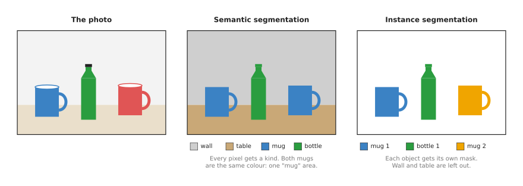
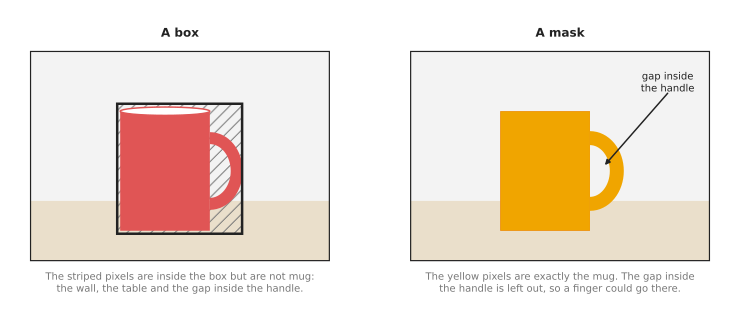
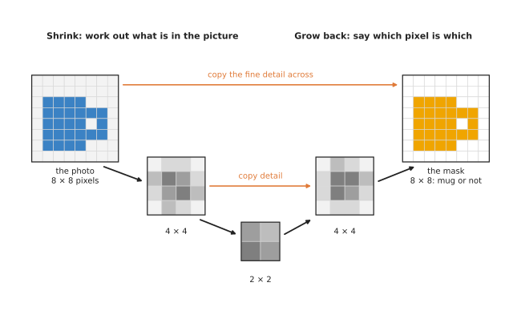

# Segmentation

This page explains segmentation, which means models that mark the exact pixels of
each object in a picture instead of drawing a box around it. It answers five
questions: what a segmentation model does, what the difference is between its two
main kinds, how it works inside, how it is trained, and why a robot arm often needs
an outline rather than a box.

It is written for a reader who has already read the pages on
[image classification](../03_also-used/01_image-classification.md) and
[object detection](01_object-detection.md), because those pages explain pixels,
scores, the backbone, fine-tuning, boxes and confidence, and this page uses those
words without explaining them again.

## Contents

1. [What it is](#1-what-it-is)
2. [What goes in and what comes out](#2-what-goes-in-and-what-comes-out)
3. [How it works inside](#3-how-it-works-inside)
4. [How it is trained](#4-how-it-is-trained)
5. [Well-known models](#5-well-known-models)
   · [5.1 SAM 2](#51-sam-2)
   · [5.2 SAM 3](#52-sam-3)
   · [5.3 Ultralytics YOLO26-seg](#53-ultralytics-yolo26-seg)
   · [5.4 RF-DETR-Seg](#54-rf-detr-seg)
   · [5.5 Mask R-CNN](#55-mask-r-cnn)
   · [5.6 Mask2Former](#56-mask2former)
   · [5.7 How to choose](#57-how-to-choose)
6. [Where to read next](#6-where-to-read-next)

---

## 1. What it is

A **segmentation model** is a model that gives an answer for every single pixel of
a picture, because for each pixel it says what that pixel belongs to.

The answer for a whole picture is called a **mask**, and a mask is a second picture
of the same size as the photo. In the mask, each pixel holds a class or an object
number instead of a colour. So you can think of it as the photo with every object
painted in its own flat colour.

Here is an everyday example: imagine a colouring book page, and a child who colours
every mug blue, every bottle green and the table brown, staying inside the lines.
Once they finish, every part of the page has one colour, and that colour says what
the part is. A segmentation model produces the same kind of result from a photo.

The difference from a detector is the level of detail, because a detector says
"there is a mug inside this rectangle", while a segmentation model says "these
exact pixels are the mug". So the pixels outside the mug's edge are not mug, even
when they lie inside the rectangle.

---

## 2. What goes in and what comes out

The input is one camera picture, exactly as it is for a detector, but the output is
one or more masks rather than boxes. There are two main kinds of segmentation, and
they give different outputs.

### Semantic and instance segmentation

**Semantic segmentation** gives every pixel a class, so it says "this pixel is
mug", "this pixel is table" and "this pixel is wall". However, it does not tell one
mug from another, which means two mugs standing side by side become a single "mug"
area.

Instead, **instance segmentation** gives each separate object its own mask, so it
says "these pixels are mug 1" and "these pixels are mug 2". Each object is called
an **instance**, and the background, such as the wall and the table, is usually
left out.

The picture below shows the same photo with both kinds of answer.



In the middle panel, both mugs share one colour, because they are the same class.
In the right panel, each mug has its own colour, because each of them is a separate
object.

A third kind, **panoptic segmentation**, does both at once, since it gives every
pixel a class and also separates the objects, and the word "panoptic" itself means
"seeing everything".

A robot arm that picks objects usually needs instance segmentation, because it has
to pick one particular mug rather than "the mug area". Semantic segmentation is
more useful for questions about places, such as which part of the picture is table,
where the free space is, or which pixels are a person who has walked into the cell.

An instance segmentation model gives a list with one item per object, and each item
has the object's class, a confidence and a mask. Most models also give the object's
box, since the box is easy to work out from the mask.

### Why an outline and not a box

A box holds the object, but it also holds whatever happens to be around the object.
The picture below compares a box and a mask for one mug.



In the left panel, the striped pixels are inside the box but are not part of the
mug, and for a mug with a handle that is a large part of the box. In the right
panel the mask covers only the mug, and it also shows the gap inside the handle,
which a box cannot show at all.

For a robot arm, this matters in three ways.

- The middle of the mask is the middle of the mug, while the middle of the box is
  pulled towards the handle.
- The depth pixels inside the mask all belong to the mug, whereas the depth pixels
  inside a box include the table behind it. So a mask gives much cleaner 3D points
  for the object.
- The mask shows the shape, so the program can find the handle, the rim or the
  narrowest part, and then choose where the fingers go.

---

## 3. How it works inside

Those kinds of output are produced in different ways, so there are three main ways
to build a segmentation model. The first is usual for semantic segmentation, and the
second is usual for instance segmentation. The third asks the user for the object
instead of learning a list of classes, and it is how the two models the shortlist in
[section 5](#5-well-known-models) puts first are built. Each way below names the
shortlisted models that belong to it.

### Shrink, then grow back

A classifier's backbone makes the grid of numbers smaller and smaller, because that
is how it learns what is in the picture. But a mask must be as big as the photo,
with one answer per pixel, so a semantic segmentation model adds a second half that
makes the grid big again.

1. The first half is a normal backbone, which shrinks the picture step by step. At
   each step the grid gets smaller, and each number carries more meaning, so this
   half is called the **encoder**.
2. The second half grows the grid back, step by step, until it is the size of the
   photo again, and this half is called the **decoder**.
3. At each step of the decoder, the model copies in the grid of the same size from
   the encoder. The small grids know what is in the picture, while the large grids
   from the encoder still know exactly where the edges are, so joining them gives
   an answer that is both right about the class and sharp at the edges. These
   copies are called **skip connections**.
4. At the end, each pixel gets one score per class, and the pixel takes the class
   with the highest score, just as a classifier does for a whole picture.

The picture below shows the idea on a tiny 8 by 8 picture.



The left grid is the photo, the small grey grids in the middle are the encoder's
and decoder's numbers, and the right grid is the mask, where each pixel is either
mug or not mug. The orange arrows are the skip connections. Once the model is drawn
this way, it looks like a letter U, which is where the U-Net model got its name.

U-Net is in this section to explain the idea rather than to be used. Of the models
the shortlist recommends, Mask2Former in [section 5.6](#56-mask2former) is the one
that answers semantic questions, and [section 5.7](#57-how-to-choose) names the
plainer alternatives to it.

### A detector with a mask added

For instance segmentation, the most common way is to start from a detector and then
add a mask to each box.

1. A detector finds the boxes, as on the [object detection](01_object-detection.md)
   page.
2. For each box, the model cuts out the matching part of the backbone's grids.
3. A small extra network, called the **mask head**, looks at that cut-out part, and
   gives a small mask, often 28 by 28, that says which pixels inside the box are
   the object.
4. The small mask is then stretched to the size of the box in the photo.

Because each box gets its own mask, two mugs that touch still get two separate
masks, and this is exactly how Mask R-CNN works. [Section 5.5](#55-mask-r-cnn)
recommends Mask R-CNN for fine-tuning in plain PyTorch, and Ultralytics YOLO26-seg
in [section 5.3](#53-ultralytics-yolo26-seg) is the same design built on a one-stage
detector, which is why it keeps up with a live camera.

Newer models use a transformer instead, in the same way as the detection
transformers on the object detection page. So each query gives one object, and each
object comes with a mask rather than only a box, which is how Mask2Former works.
This means one such model can do semantic, instance and panoptic segmentation.
Mask2Former itself is in [section 5.6](#56-mask2former), and RF-DETR-Seg in
[section 5.4](#54-rf-detr-seg) is the newer transformer of this kind that the
shortlist recommends for work on a robot.

### A prompt instead of a class list

Both ways so far need the list of classes before training, because the model learns
a fixed set of names. The third way drops that list and asks the user for the object
instead, and a model built this way is called **promptable**.

1. The picture goes through a backbone once, as it does in the other two ways.
2. The prompt goes through a second, much smaller network. A prompt is a point, a
   box, a rough region or, in the newest models, a short phrase.
3. A third small network reads the picture's numbers and the prompt's numbers
   together, and gives one mask for whatever the prompt pointed at.

Because the backbone runs only once, a second prompt on the same picture costs only
the two small steps, so clicking around one picture feels immediate. The price is
that the model gives no name, since a click produces a mask and nothing else, so
something else has to decide where to click.

SAM 2 in [section 5.1](#51-sam-2) is built this way and takes a point or a box, and
SAM 3 in [section 5.2](#52-sam-3) takes a phrase and returns every object in the
picture that matches it. The [open-vocabulary
models](03_open-vocabulary-models.md) page covers that family in full.

---

## 4. How it is trained

A model built in either of the first two ways learns from pictures where a
person has marked the exact outline of every object. However, that is much
slower than drawing boxes. For each object, the person clicks many points around
its edge to trace a shape, and that shape is called a **polygon**. So a picture
with ten objects can take several minutes to label, where boxes would take less
than one.

Two public collections of labelled pictures are used most often.

- **COCO**, the same collection used for detectors, also has an outline for every
  labelled object. So most instance segmentation models you can download were
  trained on it, with its 80 classes.
- **ADE20K** is used for semantic segmentation instead, because it labels whole
  scenes, such as kitchens and offices, with 150 classes of things and places,
  including "wall", "floor" and "table".

Training works in the same way as it does for a detector. Then the model gives
its masks for a batch of pictures, and a program compares every pixel of each
mask with the traced outline. It counts how many pixels are wrong, and nudges
the network's numbers to reduce that count. While doing so, it also checks the
classes and the boxes, as for a detector.

A robot project usually fine-tunes, so it starts from a model trained on COCO
and trains it on a few hundred of its own pictures. To save labelling time, most
labelling tools now use a model to trace the outline. So the person clicks once
on the object, a promptable model such as SAM draws the outline, and the person
only fixes its mistakes. SAM itself is covered on the [open-vocabulary
models](03_open-vocabulary-models.md) page, and Book 2 lists such tools in
[labelling
tools](../../../02_perception/02_object-perception/04_models-that-find.md#5-labelling-tools).

Pictures from a simulator help even more for segmentation than they do for
detection, because the simulator knows which object each pixel belongs to, so it
produces perfect masks for free.

---

## 5. Well-known models

This section is the shortlist a real project chooses from. For each model it says
what the model is, why you would pick it rather than the obvious alternative, what
it costs you, and what to type to run it.

The first thing to decide is not which model but which question you are asking.
Three of the models below need a list of classes and give one mask per object in
that list. Two need no class list at all, and instead outline whatever you point at
or name in words. One answers all three kinds of question from a single design.

Read the table as a shortlist and not as a ranking. The left column names the model
and says how current it is. The right column holds everything else about it: how it
is built, the job it is best at, its size, its licence, and when to pick it. A size
is given as the number of parameters, which is the count of numbers the network
learned during training, written in millions. Every number was read from the
project's own published table or model card, and each sub-section names which. Two
projects measure on different machines, so treat the sizes as a rough guide to
scale.

| Model | What decides it |
| --- | --- |
| **SAM 2**, most used in 2026 | It is a promptable model, and its four sizes hold 38.9 to 224.4 million parameters, with Apache-2.0 on both the code and the weights. It gives the exact outline of anything you click on or draw a box around. Pick it when you cannot list your objects, or when you already have a box. |
| **SAM 3**, worth betting on | It is a promptable model of 859.9 million parameters, under a bespoke licence called the SAM License, and its weights need a request you have had approved. It returns every instance that matches a short phrase. Pick it when words have to replace the class list, and when you have read the licence. |
| **Ultralytics YOLO26-seg**, most used in 2026 | It is a detector with a mask head, and its five sizes hold 2.7 to 62.8 million parameters under AGPL-3.0 or under a paid Enterprise licence. It gives masks on every frame of a live camera. Pick it when you can publish your own source code, or when you pay for the other licence. |
| **RF-DETR-Seg**, worth betting on | It is a transformer, and its six sizes hold 33.6 to 38.6 million parameters under Apache-2.0. It gives the best permissive masks available at a given speed. Pick it when the licence must stay permissive and the outlines must be good. |
| **Mask R-CNN**, most used in 2026 for one job | It is a detector with a mask head, and `maskrcnn_resnet50_fpn_v2` holds 46.4 million parameters under BSD-3-Clause. It is best at fine-tuning in plain PyTorch with no new dependency. Pick it when you already use torchvision, and a picture a second is enough. |
| **Mask2Former**, historical | It is a transformer, and its Swin-Large COCO instance checkpoint holds 216.0 million parameters. Its repository is MIT but archived, and its weights card says "other". It answers semantic, instance and panoptic questions from one design. Pick it when you need all three kinds of answer from one model. |

### 5.1 SAM 2

**Most used in 2026**, because it gives a better outline than any class-trained
model and it works on objects nobody trained it on.

SAM 2 is the second version of Meta's Segment Anything Model, released in 2024, and
the page [open-vocabulary models](03_open-vocabulary-models.md) covers the family in
full. You give it a point, a box or a rough region, and it returns the exact mask
that contains what you pointed at. It does not name anything. SAM 2 also added
video, so it can keep the same outline across the frames of a recording, and the
Hugging Face [SAM 2 page](https://huggingface.co/docs/transformers/en/model_doc/sam2)
quotes its paper as more accurate and six times faster than the first SAM on images.

The obvious alternative is an instance segmentation model such as Mask R-CNN or
YOLO26-seg. Pick SAM 2 when you cannot write down the list of objects in advance,
which in a robot cell is the difference between handling your own five parts and
handling whatever a customer puts on the table. Pick it also when a detector already
gives you a box, because turning that box into a clean outline is the standard
pairing, and SAM 2's edges are better than a detector's own mask head.

The costs are speed and a missing name. Its
[repository](https://github.com/facebookresearch/sam2) publishes four sizes, from
38.9 to 224.4 million parameters, which its own table measures at 91.2 down to 39.5
frames a second on video on an NVIDIA A100 graphics card, so the large one is a
graphics card model. The real cost is that SAM 2 decides nothing: something else
must choose where to point, and it will outline a shadow as happily as an object.
Both the code and the weights are Apache-2.0, read from the repository and the
[model card](https://huggingface.co/facebook/sam2.1-hiera-large), which makes it the
safest licence in this section.

The library is `transformers`, and the code below gives a mask for one box.

```python
import torch
from PIL import Image
from transformers import Sam2Model, Sam2Processor

processor = Sam2Processor.from_pretrained("facebook/sam2.1-hiera-large")
model = Sam2Model.from_pretrained("facebook/sam2.1-hiera-large")

image = Image.open("table.jpg").convert("RGB")
# One box per object, as left, top, right, bottom in pixels. A detector gives you this.
input_boxes = [[[75, 275, 1725, 850]]]
inputs = processor(images=image, input_boxes=input_boxes, return_tensors="pt")
with torch.no_grad():
    outputs = model(**inputs)

# post_process_masks stretches the model's small mask back to the photo's size.
masks = processor.post_process_masks(outputs.pred_masks, inputs["original_sizes"])[0]
print(masks.shape)        # one mask per box, each the height and width of the photo
```

You supply the box, which means you supply a detector. The library prepares the
picture, runs the network and stretches the mask back to your photo's size. What you
still have to write is the step from the mask to a place in the room, which is
section 6.

### 5.2 SAM 3

**Worth betting on**, because it removes the step that SAM 2 cannot do: it takes a
short phrase instead of a click, and it returns every object in the picture that
matches the phrase.

SAM 3 came from Meta in November 2025, in the paper "SAM 3: Segment Anything with
Concepts" ([arXiv:2511.16719](https://arxiv.org/abs/2511.16719)). Its
[repository](https://github.com/facebookresearch/sam3) calls the new ability
promptable concept segmentation, and reports 75 to 80 per cent of human performance
on SA-CO, a new benchmark of 270,000 different concepts. Improved checkpoints called
[SAM 3.1](https://huggingface.co/facebook/sam3.1) followed.

The obvious alternative is Grounding DINO followed by SAM 2, which is the usual way
to turn words into masks and which the [open-vocabulary
models](03_open-vocabulary-models.md) page describes. Pick SAM 3 when you want one
model instead of two, and when you need every matching object rather than the one
best match, for example every bolt on a tray rather than the clearest bolt. Pick the
older pairing when the licence matters, which is the next paragraph.

The costs are size and licence. The checkpoint holds 859.9 million parameters, read
from its [model card](https://huggingface.co/facebook/sam3), so it needs a graphics
card and is no candidate for a small computer on the robot. The licence is a bespoke
agreement called the SAM License, stated in the repository's
[licence file](https://github.com/facebookresearch/sam3/blob/main/LICENSE), and the
Hugging Face card gives the weights' licence as "other" and gates them behind a
request you have to make and have approved. Open weights are not the same thing as
open source: read this agreement rather than assuming Apache-2.0 because SAM 2 was.

The library is `transformers`, which has the model from version 5.0.0 with no
compiled parts, so it runs on an ordinary Mac as well as on a graphics card.

```python
from PIL import Image
from transformers import AutoModel, AutoProcessor

# Both lines need an approved access request and a Hugging Face login.
model = AutoModel.from_pretrained("facebook/sam3")
processor = AutoProcessor.from_pretrained("facebook/sam3")

image = Image.open("table.jpg").convert("RGB")
inputs = processor(images=image, text="mug", return_tensors="pt")
outputs = model(**inputs)

# One mask and one box per matching object, rather than one answer for the picture.
print(outputs.pred_masks.shape, outputs.pred_boxes.shape)
```

You supply the picture and the phrase. The model supplies a mask, a box and a score
for each matching object, and the library's own page explains how to combine its
`pred_logits` and `presence_logits` into that score. What you still have to find is
the phrase that works, because two wordings of one request can give different
answers, and that is the part a factory cannot easily make repeatable.

### 5.3 Ultralytics YOLO26-seg

**Most used in 2026**, because it is the fastest way to get one mask per object on
every frame of a live camera, and because the same package also trains it on your
own pictures.

Ultralytics publishes a segmentation version of each of its detection models, and
the file name carries a `-seg` ending, so `yolo26n-seg.pt` is the smallest of five
sizes. It is the detector of [section 3](#3-how-it-works-inside) with a mask head
added, so each box comes back with an outline, and the
[instance segmentation documentation](https://docs.ultralytics.com/tasks/segment/)
describes the whole family.

The obvious alternative is Mask R-CNN in torchvision. Pick Ultralytics when the
camera runs at speed and the computer is small, because its own table gives
`yolo26n-seg` 2.7 million parameters and 2.1 milliseconds on an NVIDIA T4 graphics
card with TensorRT, against 46.4 million parameters and no stated speed for
`maskrcnn_resnet50_fpn_v2`. Pick Mask R-CNN when the AGPL licence is a problem.

The costs are the licence and the edges. Ultralytics is AGPL-3.0, which obliges you
to publish the source of anything you combine it with, including software you only
run as a service, and the weights carry the same terms. A paid Enterprise licence
removes that obligation, and Book 2 explains the trap in [licences, and the one that
will catch you
out](../../../02_perception/02_object-perception/06_licences-and-platforms.md#1-licences-and-the-one-that-will-catch-you-out).
The accuracy cost is real as well. The same table gives `yolo26n-seg` 33.9 mask mAP
on COCO, where mAP is short for mean average precision and a higher number is
better, against 47.0 for the largest `yolo26x-seg` at 12.9 milliseconds. Thin parts
such as a handle or a cable are where a small model loses pixels first.

The library is `ultralytics`, which you install with `pip install ultralytics`.

```python
from ultralytics import YOLO

model = YOLO("yolo26n-seg.pt")           # the "-seg" file adds the mask head
result = model("table.jpg", conf=0.25)[0]

# masks.xy holds one outline per object, as an array of points in picture pixels.
for box, outline in zip(result.boxes, result.masks.xy):
    name = result.names[int(box.cls)]
    centre_u, centre_v = outline.mean(axis=0)
    print(f"{name}: {len(outline)} outline points, "
          f"centre of the outline at ({centre_u:.0f}, {centre_v:.0f})")
```

The same result also holds `result.masks.data`, which is the mask as a grid of true
and false values, one grid per object. That is the form you want for picking out the
depth pixels of one object, because you can select from the depth picture with it
directly. What you supply is the picture, the threshold, and everything after the
mask.

### 5.4 RF-DETR-Seg

**Worth betting on**, because it is the direction the field is going: a transformer
with a permissive licence that reports better masks than the YOLO family at the same
latency.

RF-DETR comes from Roboflow, with co-authors at Carnegie Mellon University, and its
paper is from November 2025
([arXiv:2511.09554](https://arxiv.org/abs/2511.09554)). Segmentation is one of three
jobs the one package does, and its
[repository](https://github.com/roboflow/rf-detr) publishes six segmentation sizes,
from Nano to 2XLarge.

The obvious alternative is YOLO26-seg, which is about equally easy to install. Pick
RF-DETR-Seg when you want the permissive licence and the better outlines together.
Its README reports every row measured in one harness on the 5,000 pictures of the
COCO validation split, with latency on an NVIDIA T4 graphics card using TensorRT:
RF-DETR-Seg-Nano reaches 40.3 average precision at 3.4 milliseconds, where
YOLO26-N-Seg reaches 34.7 at 2.31 milliseconds. Those are the authors' own
measurements of their model against a competitor, so read them as a claim with a
method attached.

The costs are size and youth. RF-DETR-Seg-Nano holds 33.6 million parameters against
2.7 million for the smallest YOLO26-seg, because its backbone is a DINOv2 vision
transformer, so there is no very small version for a tiny computer. The project is
also young, so its API still changes between releases.

The library is `rfdetr`, which you install with `pip install rfdetr`. It returns a
`Detections` object from the `supervision` library.

```python
from rfdetr import RFDETRSegMedium
from rfdetr.assets.coco_classes import COCO_CLASSES

model = RFDETRSegMedium()                 # replace with RFDETRSegNano for the small one
detections = model.predict("table.jpg", threshold=0.5)

# detections.mask holds one true-or-false grid per object, the size of the photo.
for class_id, mask in zip(detections.class_id, detections.mask):
    print(COCO_CLASSES[class_id], "covers", int(mask.sum()), "pixels")
```

You supply the picture and the threshold. The package downloads the weights and
gives you masks in your photo's pixels. The `COCO_CLASSES` list applies only to the
COCO-trained weights, and the README says to read `detections.data["class_name"]`
once you have fine-tuned the model on your own classes.

### 5.5 Mask R-CNN

**Most used in 2026** for one particular job, which is fine-tuning an instance
segmentation model on your own objects without adding a dependency to a PyTorch
project.

Mask R-CNN came from Facebook AI Research in 2017, and it is the design [section
3](#3-how-it-works-inside) describes as a detector with a mask head added. It ships
inside torchvision, the image half of PyTorch, and the newer of its two versions is
`maskrcnn_resnet50_fpn_v2`.

The obvious alternative is YOLO26-seg, which is faster and easier to train. Pick
Mask R-CNN when the licence has to be permissive, when you want to read every line
of the training code, and when the camera gives you a picture a second rather than
thirty. Its BSD-3-Clause licence covers the code and the weights together, which is
not true of every model here.

The costs are speed and age. The torchvision
[model page](https://pytorch.org/vision/stable/models/generated/torchvision.models.detection.maskrcnn_resnet50_fpn_v2.html)
gives this version 46.4 million parameters, 47.4 box mAP and 41.8 mask mAP on the
COCO validation split. It states no speed, and the mask head runs once per box, so a
crowded picture is slower than an empty one. The mask is predicted small and then
stretched, so its edges are softer than SAM 2's. What goes wrong most often is the
preparation of the picture, because the weights expect exactly what
`weights.transforms()` applies.

The library is `torchvision`, which arrives with PyTorch.

```python
import torch
from torchvision.io import decode_image
from torchvision.models.detection import (maskrcnn_resnet50_fpn_v2,
                                          MaskRCNN_ResNet50_FPN_V2_Weights)

weights = MaskRCNN_ResNet50_FPN_V2_Weights.DEFAULT
model = maskrcnn_resnet50_fpn_v2(weights=weights).eval()

image = decode_image("table.jpg")
batch = [weights.transforms()(image)]     # the preparation these weights were trained with
with torch.no_grad():
    prediction = model(batch)[0]

for label, score, mask in zip(prediction["labels"], prediction["scores"],
                              prediction["masks"]):
    if score > 0.5:                       # torchvision applies no threshold for you
        # Each mask holds one number per pixel, between 0 and 1, so choose a cut.
        print(weights.meta["categories"][label], int((mask[0] > 0.5).sum()), "pixels")
```

You supply the picture, the threshold on the score, and the cut that turns the soft
mask into a true-or-false mask. The two comparisons in the code are those two
choices. Torchvision gives you the network and the matching preparation, and nothing
else.

### 5.6 Mask2Former

**Historical**, kept because it explains how one transformer answers all three
segmentation questions, and because its successors use the same idea.

Mask2Former came from Meta in December 2021, in the paper "Masked-attention Mask
Transformer for Universal Image Segmentation". Each of its queries gives one mask
and one class, exactly as a detection transformer's queries give one box, which is
why one trained model can give semantic, instance or panoptic answers depending on
how you read its output. Its paper reports 57.8 panoptic quality on COCO, 50.1
average precision for instance segmentation on COCO and 57.7 mean intersection over
union on ADE20K, quoted on the Hugging Face
[Mask2Former page](https://huggingface.co/docs/transformers/en/model_doc/mask2former).

The obvious alternative today is RF-DETR-Seg or YOLO26-seg, both of which are faster
at instance masks. Pick Mask2Former only when you need more than instance masks from
one model, for example instance masks of the parts and a semantic mask of the table
in the same pass. If that is your case, compare it with
[OneFormer](https://github.com/SHI-Labs/OneFormer), which is MIT licensed and trains
once for all three tasks.

The costs start with maintenance. The original
[repository](https://github.com/facebookresearch/Mask2Former) is archived, which
means no fixes and no support for newer dependencies, although the `transformers`
port is maintained and is the version to use. The licence is also split in the way
this book keeps warning about: the repository's licence file is MIT, while the
weights card for `facebook/mask2former-swin-large-coco-instance` gives its licence
as "other". The code licence does not tell you the weights licence. That checkpoint
holds 216.0 million parameters, read from the same card.

The library is `transformers`, and the post-processing call is what selects the kind
of answer you want.

```python
from PIL import Image
from transformers import AutoImageProcessor, Mask2FormerForUniversalSegmentation

name = "facebook/mask2former-swin-large-coco-instance"
processor = AutoImageProcessor.from_pretrained(name)
model = Mask2FormerForUniversalSegmentation.from_pretrained(name)

inputs = processor(images=Image.open("table.jpg"), return_tensors="pt")
outputs = model(**inputs)

# The same outputs also feed post_process_semantic_segmentation and
# post_process_panoptic_segmentation, which is the point of this model.
result = processor.post_process_instance_segmentation(outputs, target_sizes=[(480, 640)])[0]
print(result["segmentation"].shape, len(result["segments_info"]))
```

You supply the picture and the size you want the answer at. The library gives back
one grid of object numbers plus a list saying which class each number is. That is a
different shape of answer from the one-mask-per-object list the models above return,
and the code after it has to expect that.

### 5.7 How to choose

Start with SAM 2 if you have a detector already, and with YOLO26-seg if you do not,
because between them those two cover almost every robot cell: one turns a box into
a good outline, and the other gives boxes and outlines together at camera speed.

Five things change that answer.

- **You are selling a product, or running a service, and will not publish your
  source.** Then the AGPL licence rules Ultralytics out, and you take RF-DETR-Seg for
  the best permissive masks or Mask R-CNN for the plainest permissive code. SAM 2
  stays available either way, because it is Apache-2.0.
- **You cannot write down your list of objects.** Then no closed-set model will do,
  and the choice is SAM 2 driven by a detector or a click, or SAM 3 driven by a
  phrase. Read SAM 3's licence first, and read [open-vocabulary
  models](03_open-vocabulary-models.md) for the whole family.
- **You want to know which pixels are table, floor or person, not which object is
  which.** That is semantic segmentation, and none of the instance models above is
  the right tool. Torchvision's
  [DeepLabV3](https://pytorch.org/vision/stable/models/deeplabv3.html) is the
  permissive and easy answer, and Mask2Former or OneFormer the stronger one. Do not
  reach for SegFormer in a commercial product, because Book 2 records its licence as
  the NVIDIA Source Code License, which is non-commercial.
- **The masks have to run on the robot's own small computer.** Then take the
  smallest Ultralytics size, or one of the small SAM variants such as MobileSAM or
  EdgeTAM, and measure before you promise anything. [Running a model on a
  robot](../../10_making-models-work-on-an-arm/02_most-used/02_running-a-model-on-a-robot.md)
  explains what the numbers have to be.
- **Your objects are not among the 80 COCO classes.** Then the model matters less
  than the labelling, because you will fine-tune whichever one you pick. Let SAM 2
  trace the outlines in your labelling tool, as [section 4](#4-how-it-is-trained)
  describes, because that is what makes outline labelling affordable.

Book 2's [mask models](../../../02_perception/02_object-perception/04_models-that-find.md#12-mask-models)
lists more of these, each with the licence read from its own licence file.

---

## 6. Where to read next

- The next page is [keypoints and object pose](04_keypoints-and-object-pose.md),
  which finds named points on an object and which way the object faces.
- [Open-vocabulary models](03_open-vocabulary-models.md) covers SAM fully, and models
  that find objects from words.
- [Object detection](01_object-detection.md) explains the detector that Mask R-CNN
  builds on.
- [Grasp models](../../05_grasp-models/01_overview.md) use masks to decide where to hold an
  object.
- [The seeing models overview](../01_overview.md) compares all seven kinds of seeing
  model.
- Book 2 goes deeper in
  [models that find objects](../../../02_perception/02_object-perception/04_models-that-find.md),
  which covers mask models and the SAM family with their licences, and in
  [finding an object in a picture](../../../02_perception/01_camera/02_finding-objects.md),
  which builds a colour mask by hand.
