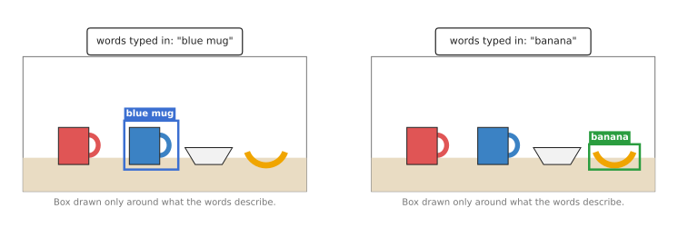
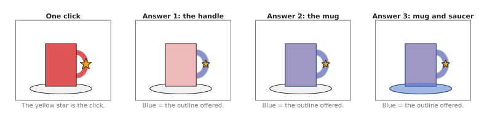
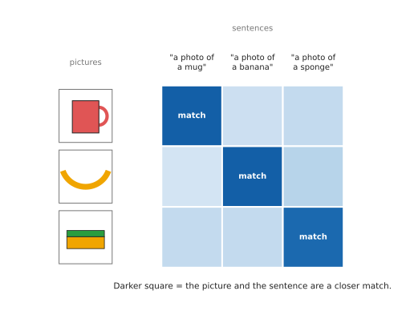

# Open-vocabulary models

This page answers one question: how can a robot find an object it was never trained
on, just because someone typed its name or clicked on it? The models on the earlier
pages of this chapter can only find the kinds of object in their training list,
whereas the models on this page do not have a fixed list at all.

It is written for a reader who has already read the earlier pages of this chapter,
especially [object detection](01_object-detection.md) and
[segmentation](02_segmentation.md), so you should know what a detection box and a
segmentation outline are. This page covers four ideas: matching pictures to
sentences, finding boxes from words, finding outlines from a click, and
general-purpose picture features.

## Contents

1. [What it is](#1-what-it-is)
2. [What goes in and what comes out](#2-what-goes-in-and-what-comes-out)
3. [How it works inside](#3-how-it-works-inside)
4. [How it is trained](#4-how-it-is-trained)
5. [Well-known models](#5-well-known-models)
   · [5.1 CLIP, the model the others are built on](#51-clip-the-model-the-others-are-built-on)
   · [5.2 OWL-ViT and OWLv2](#52-owl-vit-and-owlv2)
   · [5.3 Grounding DINO](#53-grounding-dino)
   · [5.4 YOLOE](#54-yoloe)
   · [5.5 SAM 2](#55-sam-2)
   · [5.6 SAM 3](#56-sam-3)
   · [5.7 How to choose](#57-how-to-choose)
6. [Where this is going](#6-where-this-is-going)
7. [Where to read next](#7-where-to-read-next)

---

## 1. What it is

The one-sentence idea is this: an open-vocabulary model finds things in a picture
from a prompt you give it at the time, such as a few words or a click, instead of
from a fixed list learned during training.

A **vocabulary** is a set of words, and an ordinary detector has a **closed
vocabulary**, because it is trained on a list of classes such as "mug", "bowl" and
"banana". So it can find those three things and nothing else, which means that if
you want it to find a sponge, you must collect labelled photos of sponges and train
it again.

An open-vocabulary model has no fixed list, so you type "sponge" and it looks for a
sponge, or you type "the blue mug on the left" and it looks for that. This works
because the model learned from a very large number of pictures that came with text,
so it has seen almost every common word next to pictures of that thing.

Here is an everyday example: imagine two new helpers in a kitchen, where the first
has learned to recognise only ten kinds of object, one at a time, from flash cards,
while the second has read many illustrated books. Ask the first to fetch a "whisk",
and it cannot, because whisk was not on its cards. Ask the second, and it can,
because it has seen whisks and the word "whisk" together many times before.

There is a second kind of prompt too, because a **promptable segmentation** model
takes a click or a box instead of words. You click on a mug, and it returns the
exact outline of the mug. However, it does not know that the thing is a mug, since
it only knows where the object you pointed at begins and ends.

A **prompt** is simply what you give the model to tell it what you want, whether
that is a few words, a click, or a rough box.

---

## 2. What goes in and what comes out

Those prompts and answers differ from one model to the next, so the table below
lists the four kinds of model on this page. Read each row as: what you give it, and
what it gives back.

| Kind | What goes in | What comes out | Example model |
| --- | --- | --- | --- |
| Picture and text matching | a picture and some sentences | a score for how well each sentence fits the picture | CLIP |
| Detection from words | a picture and a few words | a box around each thing the words describe, with a confidence number | Grounding DINO, OWL-ViT |
| Segmentation from a click | a picture and a click or a box | the outline of the thing you pointed at | Segment Anything (SAM), SAM 2 |
| General picture features | a picture | a list of numbers for each small patch of the picture | DINOv2 |

Detection from words is the most direct use for a robot arm, because you give it a
photo of the table and the words "blue mug", and it draws a box only around the
blue mug.



The picture is the same in both panels, and only the typed words change which
object gets a box.

Segmentation from a click gives outlines instead, but a single click can be
unclear, since a click on a mug's handle might mean "the handle" or "the whole
mug". So Segment Anything returns three possible outlines, each with a score,
and either the software or a person then picks one.



A click on the handle is unclear, so the model offers the handle, the whole mug,
and the mug with its saucer.

---

## 3. How it works inside

This section takes the four kinds of model listed in
[section 2](#2-what-goes-in-and-what-comes-out) in turn, and each one ends by naming
the models that [section 5](#5-well-known-models) recommends for that kind.

### Turning pictures and words into numbers

To match words against pictures at all, both have to become the same kind of thing,
and that thing is a list of numbers. Such a list is called an **embedding**, which
is a list of a few hundred numbers that describes the meaning of a picture or a
sentence.

A model like CLIP does this with two networks.

1. The **image encoder** turns a picture into an embedding.
2. The **text encoder** turns a sentence into an embedding of the same length.
3. The model then compares the two lists of numbers, and if they point in the same
   direction, the picture and the sentence mean the same thing, so the model gives
   them a high score.



Each picture is scored against each sentence, and the matching pairs get the
darkest squares.

CLIP is in [section 5.1](#51-clip-the-model-the-others-are-built-on). It is kept
there because the rest of this page is built on the idea it introduced, rather than
because you would call it often yourself.

### Finding boxes from words

A detector like Grounding DINO or OWL-ViT uses that same idea, but it applies it to
parts of a picture rather than to the whole picture.

1. The image encoder makes an embedding for many small regions of the photo.
2. The text encoder makes an embedding for the words, such as "blue mug".
3. The model then compares each region with the words.
4. Regions that match well become candidate boxes, and the model tightens each box
   around the object.
5. Finally it outputs the boxes whose scores are above a set threshold, together
   with their scores.

The shortlist recommends both of the models named above. OWL-ViT's newer version
OWLv2 is in [section 5.2](#52-owl-vit-and-owlv2), and Grounding DINO is in
[section 5.3](#53-grounding-dino).

There is a faster variant of the same five steps. Grounding DINO and OWLv2 run a
large network over the picture and the words together, whereas the faster variant
turns your words into numbers once and then compares those numbers against the
regions found by an ordinary fast detector head. That is how YOLOE works, in
[section 5.4](#54-yoloe), and it is what lets a model of this kind answer every
frame of a live camera.

### Finding outlines from a click

Segment Anything works in a different way, because its prompt is a click rather
than a word.

1. A large image encoder looks at the photo once and turns it into a grid of
   embeddings, and this is the slow step.
2. A small prompt encoder turns the click, or the box, into numbers.
3. A small, fast decoder then combines the two and draws the outline.

Because only step 3 repeats for each new click, the model can answer a new click
very quickly once the photo has been encoded. SAM 2 adds a memory, so it can follow
the same outline through the frames of a video, and the page
[tracking and motion](../03_also-used/03_tracking-and-motion.md) covers that. SAM 2
is the version of this design to use, in [section 5.5](#55-sam-2).

The newest model of this kind replaces the click with words. Its prompt encoder
takes a short phrase rather than a point, and it returns an outline for every object
in the picture that matches the phrase, so one model answers both "find the thing I
described" and "give me its outline". That is SAM 3, in
[section 5.6](#56-sam-3).

### General picture features

DINOv2 is only an image encoder, so it has no text and draws no boxes, and instead
it turns each small patch of a picture into an embedding. Patches that show the
same kind of thing get similar embeddings, even across different photos, so the
handle of one mug gets numbers close to the handle of another mug. Other models are
often built on top of DINOv2, because its features are good and free to use.

DINOv2 is here to complete the picture rather than as something to call from a robot
program, and it is the one kind in this section with no entry in
[section 5](#5-well-known-models). The paragraph after that section's table says
why.

---

## 4. How it is trained

All four of those models are trained on far more pictures than an ordinary detector
ever sees.

CLIP learned from about 400 million pairs of a picture and its caption, collected
from the internet, and nobody labelled them for CLIP, because the captions were
written by the people who put the pictures online. In training, CLIP is shown a
batch of pictures and a batch of captions, and it must work out which caption
belongs to which picture. Each time it pairs them correctly, it has learned a
little more about how words and pictures relate.

Grounding DINO and OWL-ViT learn instead from pictures with boxes and matching
phrases, for example a box around a dog with the phrase "a brown dog". Some of
these come from detection datasets, while others come from caption datasets, where
a program matched phrases in a caption to boxes in the picture.

Segment Anything was trained on a dataset called SA-1B, which has about 11 million
photos and over one billion outlines. People did not draw all of them, because the
team started with outlines drawn by people with the model's help, and then the
model drew more outlines itself, people checked them, and the model was trained
again. In the last round the model drew outlines on its own.

DINOv2 was trained on about 142 million pictures with no labels at all, which is
called **self-supervised learning**. The model is shown two different crops of the
same picture and learns to give them similar embeddings, and it also learns to fill
in the embedding of a hidden patch from its neighbours, so no human ever has to say
what anything is.

The page [where the data comes
from](../../01_what-models-are/05_where-the-data-comes-from.md) explains these
kinds of data in general.

---

## 5. Well-known models

This section names the models you would actually download, and says which of them
answers "find the thing I described in words" well enough to put on a robot.

Read the table like this. The left column is the model, with a word on how current
it is. The right column holds everything else: what the model is, what it is best
at, how large it is, the licence of its code and the licence of its weights, and
when to pick it. A **parameter** is one number inside the model that training
chooses, so a model with more parameters is a larger download and a slower answer.
The counts come from each model's own page on Hugging Face, except for YOLOE, whose
counts come from the Ultralytics documentation. The two licences are given apart
because they often differ, and it is the one on the weights that decides whether you
may ship the robot.

| Model | What decides it |
| --- | --- |
| **CLIP**, historical | It is a picture encoder and a text encoder together, and `openai/clip-vit-large-patch14` holds 428 M parameters. Its code is MIT, and the model card for its weights states no licence. It is best at scoring one picture against several sentences. Pick it when you already have a cropped picture and only have to choose between words. |
| **OWLv2**, most used in 2026 | It is a detector driven by words, and `google/owlv2-base-patch16-ensemble` holds 155 M parameters, with Apache-2.0 on both the code and the weights. It gives boxes from short names with the least setup of any model here. Pick it when your objects have ordinary names and you want one install and one call. |
| **Grounding DINO**, most used in 2026 | It is a detector driven by words, and it holds 172 M parameters in its tiny model and 233 M in its base model, with Apache-2.0 on both the code and the weights. It is best at boxes from a longer phrase. Pick it when the prompt is a description, such as "the blue mug on the left". |
| **YOLOE**, worth betting on | It is a fast detector that takes words as its prompt, and its sizes hold 3.9 M to 55.2 M parameters, with AGPL-3.0 on both the code and the weights. It gives open-vocabulary boxes and outlines at camera speed. Pick it when the model has to keep up with a live camera on the robot. |
| **SAM 2**, most used in 2026 | It is a promptable segmentation model, and it holds 39 M parameters in its tiny model and 224 M in its large one, with Apache-2.0 on both the code and the weights. It gives exact outlines from a click or a box. Pick it when something else has already decided where the object is. |
| **SAM 3**, worth betting on | It is a promptable segmentation model driven by a phrase, and it holds 860 M parameters. One bespoke licence, the SAM License, covers both its code and its weights, and the download is gated. It finds every object that matches a phrase and outlines each one. Pick it when you want words to outlines in one model and can accept that licence. |

DINOv2, from section 3, is not in the table. It answers no prompt, so it cannot be
compared with the models here, and [3D feature
maps](../../04_3d-models/03_also-used/02_3d-feature-maps.md) is the page that uses
it.

### 5.1 CLIP, the model the others are built on

**Historical**: you rarely call it yourself now, but the open-vocabulary idea comes
from it, and OWLv2 below has CLIP inside it.

Size m, a laptop, MIT for the code and no licence stated for the weights.

CLIP (Contrastive Language-Image Pre-training) was published by OpenAI in 2021. It
has one network for pictures and one for sentences, and it scores how well a
picture and a sentence go together. It draws no boxes and finds nothing, because
it looks at the whole picture at once.

The one idea CLIP is built on is that a picture and the words written under it
should come out as nearly the same list of numbers. Both networks write into one
shared space of a few hundred numbers, and training pulls a picture and its own
caption together in that space while pushing it away from the other captions it was
shown alongside.

That idea changes what the end of the model is. An ordinary classifier finishes with
a layer that has one output per class, and the number of outputs is decided before
training starts, so the list of classes is built into the shape of the model. CLIP
has no such layer. Comparing a picture with a sentence is one piece of arithmetic:
the sentence goes through the text encoder and comes out as a list of numbers, the
picture goes through the image encoder and comes out as a list of the same length,
and the two lists are multiplied together one position at a time and the products
are added up. The single number that falls out is the score. Nothing in that
arithmetic depends on which words you chose, so the class list is no longer part of
the model. It is an argument you pass when you call it, and that is the whole of
what "open vocabulary" means.

What the idea buys is any words you can type. What it costs is place. The image
encoder pools the whole picture into one list, so the output keeps no record of
which part of the picture produced which number, and no rewording will make CLIP
point at anything. Every model below it keeps the picture in pieces for exactly
this reason.

On a robot arm the difference shows up after a grasp rather than before it. The
wrist camera looks at what the gripper is holding, the crop contains one object and
nothing else, and the question is only whether it is the part the program asked
for. CLIP answers that from two sentences and one pass. Ask it instead where the
part is on the table and it has nothing to say, because the answer it gives has no
place in it.

You would pick CLIP rather than OWLv2, the obvious alternative, only when the
picture is already cropped to one object and the question is which of several
words fits it best. A detector has returned three candidate boxes, and you want to
know which one is the blue mug. For "where is the blue mug on this table", OWLv2
or Grounding DINO is the right model, because CLIP cannot point at anything.

Two costs here are about this model rather than about its size. Weights published
with no licence grant you no rights by default, so read the model card before you
ship anything that contains them. And CLIP always picks a winner, because the
scores are scaled to add up to one across the sentences you gave it, so it will
report a sponge as a blue mug with some confidence if mug and bowl were the only
words you offered.

The library is Hugging Face `transformers`, and this follows its [CLIP
documentation page](https://huggingface.co/docs/transformers/en/model_doc/clip).

```python
from PIL import Image
from transformers import AutoModel, AutoProcessor

model = AutoModel.from_pretrained("openai/clip-vit-base-patch32")
processor = AutoProcessor.from_pretrained("openai/clip-vit-base-patch32")

image = Image.open("mug_crop.jpg")      # one object, already cut out of the photo
labels = ["a photo of a blue mug", "a photo of a red mug", "a photo of a bowl"]

inputs = processor(text=labels, images=image, return_tensors="pt", padding=True)
outputs = model(**inputs)

# One number per sentence. They are scaled so that they add up to one.
probs = outputs.logits_per_image.softmax(dim=1)
print(labels[probs.argmax().item()], round(probs.max().item(), 3))
```

The library resizes the picture, turns the sentences into numbers and runs both
networks. You supply the crop, the sentences, and a rule for refusing an answer:
refuse when the best two probabilities are close, because the model is then
choosing between words rather than recognising the object.

### 5.2 OWL-ViT and OWLv2

**Most used in 2026**, because it is the shortest path from a name to a box, and
its code and its weights are both Apache-2.0.

Size m, a small card, Apache-2.0 for the code and the weights.

OWL-ViT came from Google Research in 2022 and OWLv2 followed in 2023. OWL-ViT
takes CLIP, removes the layer that pools the picture into one embedding, and
attaches a small box head to each patch, so the CLIP idea is applied to parts of
the picture. OWLv2 is the same design trained on far more data that it labelled
itself, by letting an existing detector draw boxes on picture-and-text pairs from
the internet.

The one idea is to run CLIP's comparison on every patch of the picture instead of
on the picture as a whole, and to change as little else as possible.

Inside, that is one deletion and two additions. The paper removes the final token
pooling layer, which was the step that squashed all the patches into the single
list CLIP compares, and it attaches a lightweight classification head and a box
head to each transformer output token instead. A token is what the network has to
say about one patch of the picture, so every patch now carries its own list of
numbers and its own box. The classification head is where your words arrive,
because the paper replaces that layer's fixed weights with the embeddings of the
class names, worked out by the text model. The comparison is therefore the same
multiply-and-add as in CLIP, run once for each patch against each of your queries,
and the thing that moved is where in the model it happens. Training uses a
bipartite matching loss, which means that each of the model's guesses is paired
one-to-one with one real box in the training picture, so the model is taught not to
report the same object twice and needs no cleanup step afterwards. A query may also
be a patch of another picture rather than words, which the paper calls one-shot
detection, and it is the way to look for a part that has no name.

What the idea buys, besides the short path from a name to a box, is that the
picture and the words never meet until that final multiplication. The numbers for
your names therefore depend on the words alone, so they can be worked out once when
the program starts and reused on every frame, and the way the picture is read never
changes with what you typed. That last part is also the cost. The words cannot
reach into the picture network, so they cannot be used to decide where to look, and
a prompt is in practice a list of names, with extra words such as "on the left"
mostly wasted. Grounding DINO below spends a great deal of arithmetic undoing
exactly this.

On a robot arm the choice shows up in where the prompt comes from. A cell with a
fixed set of five part names, written into the program, is OWLv2's case: one
install, one call, and the name embeddings never have to change. A cell where a
person types or speaks the instruction, so that the prompt arrives as "the blue mug
on the left", is Grounding DINO's case, because OWLv2 will box both mugs with
similar confidence and leave your program to guess which one was meant.

You would pick OWLv2 rather than Grounding DINO, the obvious alternative, when
your objects have ordinary one-word or two-word names. It is the smaller of the
two, and you pass your names as a plain list. Grounding DINO is better when the
prompt is a description rather than a name, because it reads the phrase as a
phrase.

It expects one query per kind of object, written in the style "a photo of a blue
mug", and short names work better than long sentences. It is not fast enough for a
live camera on a small computer, so you run it once and then track. The mistake
that catches people is reading the raw box numbers out of the model: the processor
pads the picture to a square, so those numbers belong to the padded picture, and
`post_process_grounded_object_detection` with `target_sizes` is what brings them
back to your photo.

The library is Hugging Face `transformers`, and this follows its [OWLv2
documentation page](https://huggingface.co/docs/transformers/en/model_doc/owlv2).

```python
import torch
from PIL import Image
from transformers import Owlv2ForObjectDetection, Owlv2Processor

model_id = "google/owlv2-base-patch16-ensemble"
processor = Owlv2Processor.from_pretrained(model_id)
model = Owlv2ForObjectDetection.from_pretrained(model_id)

image = Image.open("table.jpg")
text_labels = [["a photo of a blue mug", "a photo of a bottle"]]  # one list per picture

inputs = processor(text=text_labels, images=image, return_tensors="pt")
with torch.no_grad():
    outputs = model(**inputs)

results = processor.post_process_grounded_object_detection(
    outputs=outputs,
    target_sizes=torch.tensor([(image.height, image.width)]),  # back to your own pixels
    threshold=0.1,            # how sure the model must be to report a box
    text_labels=text_labels,
)[0]

for box, score, label in zip(results["boxes"], results["scores"],
                             results["text_labels"]):
    print(label, round(score.item(), 3), [round(v, 1) for v in box.tolist()])
```

The library does the padding, the scaling back, and the matching of each box to
the query it came from. You supply the wording of the queries, the threshold, and
the rule for the case where two boxes come back for one query. When their scores
are close, the safe answer on a robot is to stop and ask.

### 5.3 Grounding DINO

**Most used in 2026**, because it is the model people reach for when the prompt is
a phrase rather than a name.

Size m, a big card, Apache-2.0 for the code and the weights.

Grounding DINO was published by IDEA Research in 2023. It takes a picture and a
text prompt, and returns a box for each thing the prompt describes, together with
the words that matched that box.

The one idea is the opposite of OWLv2's. Rather than compare the picture with the
words at the end, Grounding DINO mixes the words into the picture early and keeps
mixing them in, so that what you typed changes where the model looks.

The authors describe a plain detector as having three phases, and they add that
mixing to all three. First comes a feature enhancer, in which the picture's
features and the words' features attend to each other in both directions, so each
word is rewritten in the light of the picture and each part of the picture is
rewritten in the light of the words. Then comes language-guided query selection,
which picks the regions of the picture that look most like the words and hands them
to the next stage as its starting guesses, so the words have already chosen where
the search begins. Last comes a cross-modality decoder, in which each guess looks
at the picture and at the words again before it becomes a box. Underneath all three
sits a transformer detector called DINO, which carries a fixed number of guesses and
refines them into boxes, and every finished box keeps a score against each word of
the prompt. Those per-word scores are why this model has two thresholds where OWLv2
has one.

What the mixing buys is a prompt that can be a phrase rather than a name. Words
such as "blue" or "on the left" have somewhere to act, because they can change the
features of the picture before any box exists. The costs follow from the same
design. Nothing about the words can be prepared in advance, since the words are
read again with each new picture, so a new prompt or a new frame means another run
of the whole network, and one answer costs more than OWLv2's and far more than
YOLOE's. And the answers move with the wording, which is the trap described further
down, because here the wording is genuinely part of how the picture is read.

On a robot arm the difference shows up the moment the instruction contains a word
that is not a name. Two identical mugs stand on the table, one to the left and one
to the right, and the operator asks for the left one. OWLv2 returns two boxes of
similar confidence, and your program has to work out what "left" means in pixels.
Grounding DINO can take the phrase whole. What you pay for that is the frame rate:
you run it once, start a tracker, and accept that the model is not watching every
frame.

You would pick it rather than OWLv2, the obvious alternative, because it handles a
prompt with extra words in it, such as "the blue mug on the left" or "a screw with
a flat head". It also has a second threshold, for how well the words matched,
which lets you tune the two kinds of mistake apart. Pick OWLv2 instead when your
prompts are plain names, since it is smaller and simpler.

The original repository has had no commit since August 2024, so install the model
from `transformers`, whose implementation is maintained. One trap is worth knowing
before you plan around it: **Grounding DINO 1.5, 1.6 and
DINO-X have no downloadable weights.** Those repositories hold client code for a
paid hosted service, and only the original Grounding DINO runs on your own
machine. The answers also move with the wording, so "mug", "cup" and "coffee mug"
can give three different results on one photo.

The library is Hugging Face `transformers`, and this follows its [Grounding DINO
documentation
page](https://huggingface.co/docs/transformers/en/model_doc/grounding-dino).

```python
import torch
from PIL import Image
from transformers import AutoModelForZeroShotObjectDetection, AutoProcessor

model_id = "IDEA-Research/grounding-dino-tiny"
processor = AutoProcessor.from_pretrained(model_id)
model = AutoModelForZeroShotObjectDetection.from_pretrained(model_id)

image = Image.open("table.jpg")
text_labels = [["a blue mug", "a bottle"]]   # one list of phrases per picture

inputs = processor(images=image, text=text_labels, return_tensors="pt")
with torch.no_grad():
    outputs = model(**inputs)

result = processor.post_process_grounded_object_detection(
    outputs,
    inputs.input_ids,
    threshold=0.4,          # how sure the model must be that an object is there
    text_threshold=0.3,     # how well the words must match
    target_sizes=[image.size[::-1]],   # (height, width) of your photo
)[0]

for box, score, label in zip(result["boxes"], result["scores"], result["labels"]):
    print(label, round(score.item(), 3), [round(v, 1) for v in box.tolist()])
```

The library joins the phrases into the one text string the model wants and maps
each box back to the words it matched. You supply the phrase and the two
thresholds, which you tune separately: `threshold` controls how sure the model must
be that an object is there, and `text_threshold` how well the words have to match.
Something in your program also has to turn the instruction "pick up the blue mug"
into the prompt "a blue mug".

### 5.4 YOLOE

**Worth betting on**, because it puts open-vocabulary detection inside a fast
detector instead of a large transformer, which is how this kind of model will run
at camera speed on a robot. Its licence is why it is not the default.

Size xs for the smallest checkpoint and s for the largest, a laptop, AGPL-3.0 for
the code and the weights.

YOLOE, from Ultralytics, is an open-vocabulary detector that also returns outlines.
You give it the names you want when you run it, or an example picture of the
object, or no prompt at all, in which case it reports names from a built-in list of
4,585 words. It was inspired by YOLO-World, which did the same job earlier and
whose repository has had no commit since February 2025.

The one idea is to do the picture-and-words comparison while the model is being
trained, so that none of it is left by the time you ask a question. What runs when
you call YOLOE is an ordinary fast detector whose last layer happens to hold your
words.

The part that makes this possible is called re-parameterizable region-text
alignment. While the model trains, a small extra network sharpens the published
text embeddings so that they line up better with the picture features, and
afterwards that network is re-parameterized, which means its layers are multiplied
together into the weights they sit next to, once their numbers have stopped
changing. The sharpening survives and the extra work disappears. So `set_classes`
runs a text encoder over your names once, and the lists of numbers that come out
are installed as the weights of the detector's classification layer, exactly as the
text embeddings are installed in OWLv2, except that here it happens before any
picture is seen. Two further parts cover the other two prompts. A separate visual
prompt encoder, with one branch for what a region means and one for where it is,
turns an example region of a picture into the same kind of numbers. And for no
prompt at all there is lazy region-prompt contrast, which carries a built-in
vocabulary and looks a name up only for the regions that appear to hold an object,
which is where the word lazy comes from.

What the idea buys is an answer on every frame, from a download small enough for
the robot's own computer, and Ultralytics' own table puts it above Grounding DINO's
tiny model on a benchmark of rare classes while being a fraction of the size. What
it costs is that the picture pass knows nothing about language. Grounding DINO lets
your words change how the picture is read, and YOLOE cannot, because by then the
words are frozen into a layer of weights, so a description buys you nothing here
and the prompt has to be a name. The frozen layer also explains the timing
measurement reported below: your names are the weights of the classification layer,
so prompting with thousands of names means every region is compared against
thousands of lists, and the time grows with the length of the list you prompted
with.

On a robot arm the difference shows up when the object is moving. A part travels
down a conveyor, and the arm has to see it, decide and reach while the part is
still in the picture. YOLOE answers each frame as it arrives. Grounding DINO forces
the other design, in which you detect once, start a tracker, and hope the part has
not turned over since, and that is a second piece of software to get right.

You would pick YOLOE rather than Grounding DINO, the obvious alternative, when
speed decides the design. Grounding DINO runs a vision-language transformer for
every picture, while YOLOE turns your prompts into numbers once and then compares
those numbers against regions inside an ordinary convolutional head. Pick Grounding
DINO instead when the prompt is a phrase rather than a name, because that is the
one thing this design gives up.

AGPL-3.0 covers both the Ultralytics package and the original YOLOE repository, so
a product built on it must publish its own source or buy a commercial licence from
Ultralytics. Text prompting needs a text encoder that is fetched on first use
rather than at install time, about 254 MB for the YOLOE-26 checkpoints, into the
directory you ran from, so a machine with no network cannot start. The time one
prediction takes also grows with the number of names you prompt with, by about 19 %
going from 80 names to 1,203 and about 89 % at the full 4,585-name list, as
Ultralytics measured, and the reported arithmetic cost does not move at all, so a
profile will not warn you.

The library is `ultralytics`, and this follows its [YOLOE documentation
page](https://docs.ultralytics.com/models/yoloe/).

```python
from ultralytics import YOLOE

model = YOLOE("yoloe-26s-seg.pt")      # boxes and outlines in one checkpoint

# The first call downloads a text encoder into the current directory.
model.set_classes(["blue mug", "bottle"])

result = model.predict("table.jpg")[0]
print(result.boxes.xyxy)               # one row per object: left, top, right, bottom
print(result.boxes.conf)               # one confidence number per object
print(result.masks.xy[0].shape)        # the first object's outline, as points
```

The library downloads the checkpoint, installs and runs the text encoder, and
gives you boxes and outlines together. You supply the list of names, and the
knowledge that a freshly loaded checkpoint reports numeric class names until
`set_classes` has been called.

### 5.5 SAM 2

**Most used in 2026** for turning a box into an exact outline, and the newest
member of the Segment Anything family whose code and weights are both plainly
Apache-2.0.

Size s for the tiny checkpoint and m for the large one, a laptop for the tiny one
and a small card for the large one, Apache-2.0 for the code and the weights.

Segment Anything (SAM) came from Meta in 2023 and SAM 2 followed in 2024. You give
it a click, a box or a rough region, and it returns the outline of the thing you
pointed at. SAM 2 adds a memory for video, so it can keep the same outline from
frame to frame.

The one idea is to put all the expensive work in the part that looks at the
picture, and to make the part that answers a prompt as small as possible.

So the model is split into three pieces of very unequal size. A large picture
encoder runs over the photo and leaves behind a grid of embeddings, and the library
lets you fetch that grid once and hand it back for every later prompt. A small
prompt encoder turns a click, a box or a rough outline into a few numbers. A mask
decoder of two layers then attends between those few numbers and the grid, and
produces three candidate outlines with a score for each, which is the three answers
[section 2](#2-what-goes-in-and-what-comes-out) describes. SAM 2 adds two more
pieces for video, a memory encoder and a memory attention step, so that the current
frame is read in the light of a bank of earlier frames. The piece to notice is the
one that is absent. There is no text encoder anywhere in SAM 2, and no comparison
against a sentence, so the openness here is openness about which thing you point
at, not about what you can call it.

What that buys is speed per prompt rather than speed per picture, because ten boxes
from one detector pass cost one encoding of the photo and ten runs of a very small
decoder. It also buys exact edges, which is what the depth step after it needs. The
cost is that the model recognises nothing at all. It outlines whatever lies under
the prompt, and a shadow or a reflection has edges like anything else, so SAM 2
will outline those too and never tell you it has. Something else must decide where
to point.

On a robot arm the difference shows up in a bin of parts lying across one another.
A detector gives a box for each part, but a box of a flat part seen at an angle is
mostly other parts, so reading depth inside the box gives you a cloud belonging to
three objects. SAM 2 turns each box into the pixels of one part, and it does it for
every box in the bin from a single reading of the photo. SAM 3 below would answer
the same question from a word instead, but its work for each new prompt is a whole
fusion stage and a decoder, not the two layers SAM 2 runs.

You would pick SAM 2 rather than the original SAM, the obvious alternative,
because it is faster, it works on video, and it carries the same permissive
licence. You would pick it rather than SAM 3 when you need a standard open licence
and a download nobody has to approve.

The real cost in a system is that SAM 2 decides nothing by itself, so one of the
detectors above has to say where to point.

The library is Hugging Face `transformers`, and this follows its [SAM 2
documentation page](https://huggingface.co/docs/transformers/en/model_doc/sam2).
The box in the example is the one Grounding DINO returned in
[section 5.3](#53-grounding-dino), which is the Grounded-SAM pairing in full.

```python
import torch
from transformers import Sam2Model, Sam2Processor

model_id = "facebook/sam2.1-hiera-large"
model = Sam2Model.from_pretrained(model_id)
processor = Sam2Processor.from_pretrained(model_id)

box = result["boxes"][0].tolist()      # left, top, right, bottom, from Grounding DINO
inputs = processor(images=image, input_boxes=[[box]], return_tensors="pt")
with torch.no_grad():
    outputs = model(**inputs)

masks = processor.post_process_masks(outputs.pred_masks.cpu(),
                                     inputs["original_sizes"])[0]
best = outputs.iou_scores.squeeze().argmax()   # the model offers several outlines
outline = masks[0, best] > 0        # one true-or-false value per pixel of the photo
```

The library encodes the picture, prompts the model with your box, and scales the
outlines back to your photo's size. You supply the box and the choice between the
candidate outlines, and then the step after the outline, which is reading the depth
pixels inside it and turning them into a point cloud.

### 5.6 SAM 3

**Worth betting on**, because it does in one model what the Grounding DINO and SAM
pairing does in two, and returns every object matching the phrase rather than the
best one. Its licence is why it is not yet the default.

Size m, a big card, and one bespoke licence, the SAM License, for both the code and
the weights.

SAM 3 came from Meta, with an updated set of checkpoints called SAM 3.1. You give
it a short phrase, and it returns an outline, a box and a score for every object in
the picture that matches the phrase. Meta calls this promptable concept
segmentation, and its repository reports that the model reaches 75 to 80 % of human
performance on a benchmark of its own, SA-CO, which contains 270,000 concepts.

The one idea is that the prompt should be a concept rather than a place, so the
answer is every instance of that concept and not the one thing you pointed at.

Inside, SAM 3 is a detector and a tracker that share one picture encoder. The
detector follows the pattern set by the Detection Transformer, or DETR: the picture
and the phrase are each encoded, a fusion encoder then conditions the picture's
embeddings on the phrase by attending to it, and a decoder's learned queries read
those conditioned embeddings, each query turning into one outline, one box and one
score. That conditioning is the same move Grounding DINO makes, so SAM 3 is nearer
to Grounding DINO than to SAM 2 in how it treats words. The tracker is SAM 2's
memory machinery carried over unchanged, which is why one model covers pictures and
video. The genuinely new part is a presence head, which Meta describes as
separating recognition from localisation: one output says whether the concept is in
the picture at all, and the queries are then left to answer only where it is. Meta
gives "a player in white" against "a player in red" as the case it helps with, and
those are the prompts a single score has most trouble with, because one number has
to express both whether a player is there and whether the colour is right.

What that buys is every match rather than the best one, outlines and boxes from the
same call, and a model that can be asked a question to which the honest answer is
none. What it costs is a model larger than the two it replaces put together, and
two things that no amount of hardware fixes: the licence is Meta's own, and the
weights are gated. It also moves a decision to you, because a phrase
slightly broader than you meant now returns several outlines rather than one wrong
box.

On a robot arm the difference shows up on a tray that holds two things a short
phrase can barely separate, say blue caps and black caps under warm light, and the
job is to clear only the blue ones. Grounding DINO and SAM 2 give you the
best-scoring cap, and that one score mixes up "a cap is there" with "the cap is
blue". SAM 3 answers those two questions in different places and returns every blue
cap it believes in, which is also what lets your program notice that the tray is
empty.

You would pick it rather than the Grounding DINO and SAM 2 pairing, the obvious
alternative, when one model is simpler than two, or when you need every matching
object rather than one. Counting the screws on a tray is the clearest case, because
the pairing gives you the best box while SAM 3 gives you every screw. Stay with the
pairing when a standard open licence matters.

The SAM License is not a standard open licence, so it has to be read rather than
assumed. The weights are also gated: you request access on Hugging Face, wait for
it to be granted, and sign in from the machine that downloads them, so a build
machine with no credentials cannot fetch them at all.

The library is Hugging Face `transformers`, and this follows its [SAM 3
documentation page](https://huggingface.co/docs/transformers/en/model_doc/sam3).

```python
import torch
from PIL import Image
from transformers import Sam3Model, Sam3Processor

# Works once your access request on huggingface.co/facebook/sam3 is granted
# and you have signed in on this machine with `hf auth login`.
model = Sam3Model.from_pretrained("facebook/sam3")
processor = Sam3Processor.from_pretrained("facebook/sam3")

image = Image.open("table.jpg")
inputs = processor(images=image, text="blue mug", return_tensors="pt")
with torch.no_grad():
    outputs = model(**inputs)

results = processor.post_process_instance_segmentation(
    outputs,
    threshold=0.5,        # how sure the model must be about an object
    mask_threshold=0.5,   # where the edge of the outline is drawn
    target_sizes=inputs.get("original_sizes").tolist(),
)[0]

print(len(results["masks"]))   # one outline for every blue mug on the table
```

The library handles the access token, the phrase and the scaling of the outlines.
You supply the phrase, the two thresholds, and a decision about how many objects
your robot will accept, because a phrase that is slightly too broad now returns
several outlines rather than one wrong box.

### 5.7 How to choose

Start with Grounding DINO for the box and SAM 2 for the outline, both run from
`transformers`. That pair answers "find the thing I described in words" accurately,
and the code and weights of both are Apache-2.0, so no licence stops you shipping
it.

Five things change that choice.

- Your objects have plain names and you want the smallest setup. Use OWLv2, which
  is one model, one call and a shorter download.
- The model has to keep up with a live camera on the robot. Use YOLOE, and accept
  that AGPL-3.0 means publishing your source or buying a licence from Ultralytics.
- You need every object that matches the words, not the best one. Use SAM 3, and
  accept its bespoke licence and the gated download.
- You already have crops and only need to choose between words. Use CLIP, and
  refuse the answer when the best two scores are close.
- Your objects have no name a person would use, such as two valve bodies that
  differ by one hole. None of these models is the answer, and
  [object detection](01_object-detection.md) trained on your own photos is.

Whatever you choose, the check after the answer is yours to write, because none of
these models knows when it is wrong.

---

## 6. Where this is going

Everything above describes models you can download today. This section is about
the direction, and it was written on 4 October 2026. Every company, product and
number in it was checked against the page linked beside it on that day.

It also uses [the frontier chapter's four kinds of
claim](../../../03_frameworks/08_frontier/06_what-is-coming.md#1-four-kinds-of-claim-and-why-the-difference-decides-everything),
which carry very different weight. A demonstration is a recording of something
working once. A product announcement is checkable, which makes it the most useful.
A research result is a measured number on a stated task. A projection is a
statement about a date that has not arrived, and it is the weakest. Every claim
below says which one it rests on, and where I give my own opinion the sentence says
so.

### How it got here

The shape of the change is that the list of classes walked out of the model and
became an argument you pass when you call it. CLIP showed in 2021 that a picture
encoder and a text encoder can be trained to agree, which removed the final layer
whose width was the number of classes. OWL-ViT ran that comparison on each patch
instead of on the whole picture, which turned the idea into a detector. Grounding
DINO let the words reach into the picture network, so a phrase could be read as a
phrase. The Segment Anything Model did the same for outlines, first from a click
and then, in SAM 3, from a phrase. All of them now install from one library.

### Where it is used in industry today

The largest industrial use of these models is not on a robot, and this is the part
most summaries get wrong. It is in building the training set for the ordinary
closed-vocabulary detector that does run on the robot. Roboflow sells that as
[Auto Label](https://roboflow.com/blog/launch-auto-label), published on 6 March
2024, which labels a batch of images from a text prompt using Grounding DINO for
boxes and GroundingSAM for outlines. The same idea is free and open as
[autodistill](https://github.com/autodistill/autodistill), which Roboflow also
maintains. Both are product announcements, because you can open the page, sign in
or install, and use the thing today. So the research idea of 2021 is now the normal
first step in a 2026 data pipeline: a person writes the words, an open-vocabulary
model draws the boxes, and a person corrects them instead of drawing them.

The engineering is production grade, and the clearest evidence comes from outside
robotics. Meta's engineering post says that [Cutouts in the Instagram Edits app
runs SAM 2.1](https://ai.meta.com/blog/instagram-edits-cutouts-segment-anything/),
so a click on an object in a video returns a mask for every frame. The post states a
1.8 times increase in model throughput, a 3 times reduction in first-frame preview
latency on NVIDIA H100 hardware, and that Cutouts was used hundreds of thousands of
times in the first 24 hours after the app launched. Those are Meta's own figures
about Meta's own product, and they describe a data centre rather than a robot.

On robots the use is thinner, and it is honest to say so plainly. What exists today
is edge ports and preview access. NVIDIA publishes
[nanoowl](https://github.com/NVIDIA-AI-IOT/nanoowl), which is OWL-ViT rebuilt with
TensorRT for Jetson Orin, together with
[ROS2-NanoOWL](https://github.com/NVIDIA-AI-IOT/ROS2-NanoOWL), a ROS 2 node that
takes a prompt on a topic, with a [tutorial for running
it](https://www.jetson-ai-lab.com/tutorials/nanoowl). Those are downloadable, so
they are product announcements. Google's embodied reasoning model answers to the
identifier `gemini-robotics-er-2-preview`, and its [spatial reasoning
documentation](https://ai.google.dev/gemini-api/docs/robotics-spatial) shows it
returning points, boxes and movement trajectories from a prompt; the name says
preview, so that is access rather than general availability. What I could not find
is a named production robot cell in which an open-vocabulary model decides what the
arm picks, and that absence is the most useful fact here.

### What is being worked on right now

The first front is the output format. A box is a poor answer for an arm, because a
gripper needs a place and a box has to be converted into one. Two groups are making
the model point instead. Google's documentation defines pointing as normalised
`[y, x]` coordinates, beside boxes and trajectories. The Allen Institute for AI
announced [MolmoAct 2 and a backbone called
Molmo2-ER](https://allenai.org/blog/molmoact2) in May 2026, and reports an average
of 63.8 out of 100 across 13 embodied reasoning benchmarks, which it says beats both
GPT-5 and Gemini Robotics ER 1.5 Thinking. That is a research result from the people
who built the model, and the weights and the training data are released, so somebody
else can check it. Its [weights card](https://huggingface.co/allenai/MolmoAct2)
declares no licence at all, which is the thing to read before building on it.

The second front is getting these models onto the computer on the robot, and there
is now a measured answer rather than an opinion. A paper in Frontiers in Robotics
and AI on 21 October 2025 by Jongyoon Park, Pileun Kim and Daeil Ko, [Real-time
open-vocabulary perception for mobile robots on edge
devices](https://www.frontiersin.org/journals/robotics-and-ai/articles/10.3389/frobt.2025.1693988/full),
timed NanoOWL against YOLO-World on a Jetson AGX Orin with 64 GB of memory. It
reports NanoOWL with patch32 at half precision at 9.81 milliseconds per detection
against 26.07 milliseconds for YOLO-World-S, and a best pipeline of 47.51 frames
per second at 84.64 per cent mean intersection over union. It also names the
trade-off the fast number hides: NanoOWL handles short noun phrases, while
YOLO-World parses relational sentences better.

The third front is what the prompt buys you. Meta's [SAM 3
repository](https://github.com/facebookresearch/sam3) is pushing on the presence
head of [section 5.6](#56-sam-3), which is the part that lets the honest answer be
none, and
[Grounded-SAM](https://github.com/IDEA-Research/Grounded-Segment-Anything) from
IDEA Research is the Apache-2.0 pipeline most people still use instead. Meta also
published [SAM 3D Objects](https://huggingface.co/facebook/sam-3d-objects) on 19
November 2025, which takes a masked object in one photograph and returns a textured
3D model with a pose, under the bespoke SAM License and with a gated download. The
direction is the point: the same prompt that used to buy you a box is being made to
buy you geometry, which is the subject of [keypoints and object
pose](04_keypoints-and-object-pose.md).

### What is still unsolved

The confidence number is still not trustworthy, and five years of better models
have not fixed it. One score has to express two things at once: whether an object
of that kind is present, and whether this box is the right one. [Section
5.1](#51-clip-the-model-the-others-are-built-on) describes the same failure in CLIP,
which always picks a winner among the words you offered. SAM 3's presence head is the first serious attempt to separate the two,
and it arrives in the one model here whose weights are gated. I could find no
open-vocabulary detector published with a stated false-positive rate on a named
robot task, so the rule for refusing an answer is still yours to write and yours to
measure.

Objects that words cannot separate remain outside what any of these models can do.
Two valve bodies that differ by one hole have no short phrase that tells them apart,
and more training data does not change that, because the limit is in the interface
rather than in the model. [Section 5.7](#57-how-to-choose) sends you to a trained
detector for this case, and I expect that advice to stay correct for the whole
period this section covers.

The last unsolved thing decides projects and is not technical. The best model for
words to outlines carries a licence written by one company and a gated download that
a build machine cannot fetch, and the fastest model on a live camera is AGPL-3.0.
There is also no standard for reporting how much a reworded prompt changes the
answer, so two teams reporting results on the same model may not be measuring the
same thing.

### The next two to three years

**I expect the open-vocabulary model to stay off the robot and stay in the data
pipeline, and this is the prediction I would bet on first.** Every force points the
same way. The product that already exists works like this, as Auto Label shows. A
small closed-vocabulary detector distilled from an open-vocabulary one is a smaller
download, a faster answer and a cleaner licence. And a factory cell needs the same
five part names every day, so paying for an open vocabulary on every frame buys
nothing. This is my expectation rather than an announcement, but it rests on a
product you can use today.

**I expect pointing to replace the box as the normal output when a model is asked
to find something for an arm.** Two independent groups already ship it: Google
documents a point format in its interface, and the Allen Institute for AI has
released weights that produce points. A point is also what the next step in the
program wants, because grasping, placing and pushing all begin from a place rather
than from a rectangle. This is my expectation, not an announcement, and what would
falsify it is pointing staying a feature of large closed models while the
downloadable detectors keep returning boxes.

**I expect a permissively licensed model to take the default slot for words to
outlines, and to win on its licence rather than on its accuracy.** The reason is
visible in [section 5.7](#57-how-to-choose): the recommendation there is the
Grounding DINO and SAM 2 pair, and the only reason it is not SAM 3 is the licence. Teams choose
what they may ship. If a model with Apache-2.0 on both code and weights matches SAM
3's phrase-to-mask behaviour, it takes the default slot immediately, and none of
that depends on it being better. This is a judgement about how people choose, not a
claim about a model that exists.

**I expect the edge port to stop being a side project and become how these models
are normally run on a robot.** One reason is measured and one is announced. The
measured one is the Frontiers paper above, because 47.51 frames per second already
fits inside a camera loop on hardware you can buy. The announced one is that NVIDIA
[stated physical Jetson Thor hardware for the first quarter of
2027](../../../03_frameworks/08_frontier/06_what-is-coming.md#22-nvidias-edge-computers-with-hardware-stated-for-the-first-quarter-of-2027),
which is a projection from an organisation with a good recent record of shipping
what it announces. My own part is the expectation that ROS 2 packages like
ROS2-NanoOWL become ordinary rather than experimental.

**I expect open-vocabulary perception to become a call inside a larger model rather
than a step you assemble yourself, and this is the change with the largest cost
attached.** The models that answer "where is the blue mug" best are the ones that
also answer "what should I do next", and Google's robotics endpoint already puts
detection, pointing and trajectories behind one interface. The cost is that you lose
what this chapter has been teaching you to use: a separate box, with a separate
score, that your own code can check and reject. A model that goes from a sentence
straight to a movement gives your program nothing to disagree with. That is my
judgement, and it is why I would keep a small detector in the loop even when a
larger model could replace it.

Here is the thing to check in a year. If a company publishes a cell in which an
open-vocabulary model decides what the arm picks, and publishes how often it is
wrong, then the first prediction above was wrong and the shape of this page
changes.

---

## 7. Where to read next

- [Tracking and motion](../03_also-used/03_tracking-and-motion.md) is the next page, and it shows
  how SAM 2 and other models follow an object through a video.
- [Object detection](01_object-detection.md) and [segmentation](02_segmentation.md)
  explain the closed-vocabulary models these are compared with.
- [3D feature maps](../../04_3d-models/03_also-used/02_3d-feature-maps.md) put CLIP and DINOv2
  features into a 3D map of a room, so the robot can search the room by words.
- [Vision-language models](../../07_language-models/02_most-used/02_vision-language-models.md) go
  further, because they answer full questions about a picture, not only "where is
  it".
- For downloadable models and their licences, read
  [models that find](../../../02_perception/02_object-perception/04_models-that-find.md).
- For how these models fit with larger robot models, read
  [foundation models](../../../03_frameworks/08_frontier/02_foundation-models.md).
