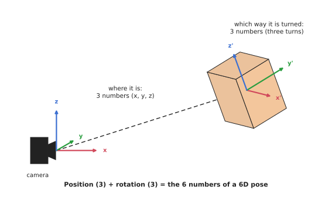
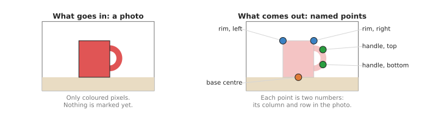
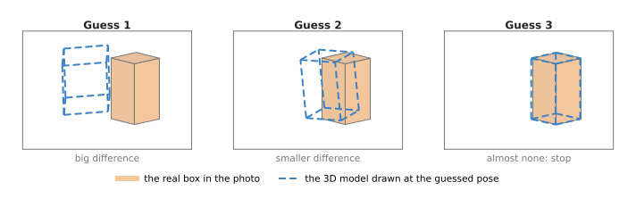
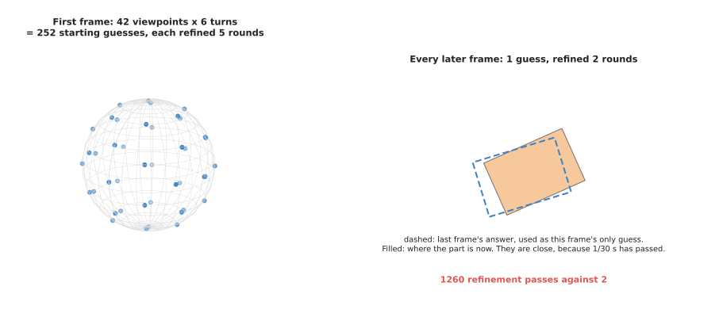
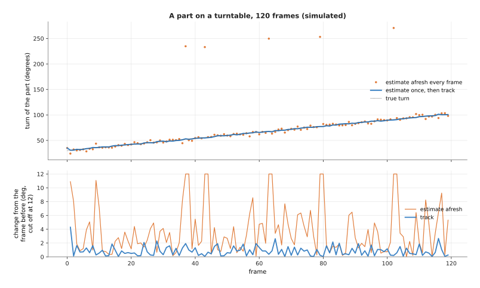
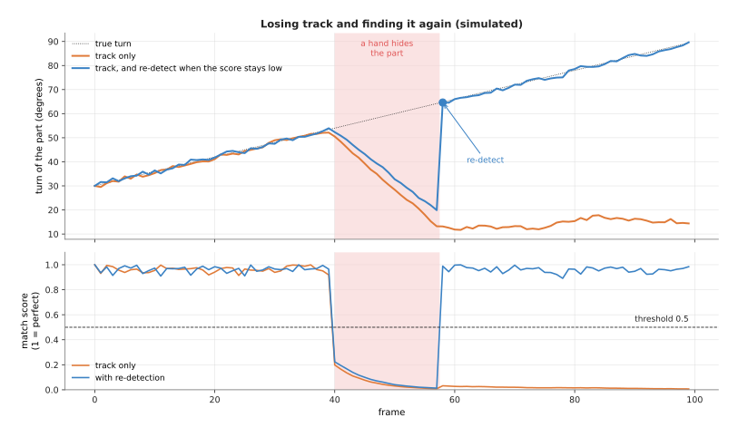

# Keypoints and object pose

This page answers one question: how does a model look at a photo of an object and
work out exactly where the object is and which way it is turned? A robot arm needs
both of these facts before it can pick up a mug by its handle or push a peg into a
hole.

It is written for a reader who has already read the earlier pages of this chapter,
so you should know what a model is and how it learns from examples, from
[what a model is](../../01_what-models-are/01_what-a-model-is.md) and
[how a model learns](../../01_what-models-are/02_how-a-model-learns.md). You should
also know what a detection box and a segmentation outline are, from
[object detection](01_object-detection.md) and [segmentation](02_segmentation.md).
This page goes one step further than those two, because a box says only roughly
where an object is, and an outline says only which pixels belong to it, so neither
of them says which way the object is turned. That is the job of the models on this
page.

> Before this page, it helps to have read [pose from points](../../../06_programming-techniques/02_geometry-and-cameras/02_most-used/04_pose-from-points.md), which explains Perspective-n-Point (PnP), the geometry that section 3 uses to turn keypoints into a pose.

## Contents

1. [What it is](#1-what-it-is)
2. [What goes in and what comes out](#2-what-goes-in-and-what-comes-out)
3. [How it works inside](#3-how-it-works-inside)
4. [How it is trained](#4-how-it-is-trained)
5. [Well-known models](#5-well-known-models)
6. [A worked example: hanging a mug on a rack](#6-a-worked-example-hanging-a-mug-on-a-rack)
7. [Following a pose over time: 6D pose tracking](#7-following-a-pose-over-time-6d-pose-tracking)
8. [What goes wrong](#8-what-goes-wrong)
9. [Why this kind, and what it costs](#9-why-this-kind-and-what-it-costs)
10. [The written alternative](#10-the-written-alternative)
11. [Where to read next](#11-where-to-read-next)
12. [Using it in Python](#12-using-it-in-python)

---

## 1. What it is

The one-sentence idea is this: a keypoint model marks a few named points on an
object in a photo, while a pose model works out where the whole object sits in 3D
space and which way it faces.

Two of the words in that sentence need explaining before the rest.

A **keypoint** is one named point on an object, so the left end of a mug's rim is a
keypoint, and so is the top of its handle. A person does this without thinking,
because if you look at a photo of a mug you can put your finger on the handle
straight away. A keypoint model does the same thing, and it gives each point a
name.

A **pose** is the place of an object and the direction it faces, taken together.
Think of a book lying on a desk, which you can slide to a new place on the desk,
and which you can also turn so that the spine faces you. Both of those changes,
the sliding and the turning, change its pose.

In 3D space, a pose comes to exactly six numbers. Three of them say where the
object is: how far to the right, how far forward and how high. Three more
numbers say how it is turned: how much it is turned left or right, tipped
forward or back, and rolled onto its side. People call this a **6D pose**, where
6D means "six numbers", and you will also see **6-DoF pose**, where DoF stands
for degrees of freedom, which means the same thing. [Joints and degrees of
freedom](../../../01_robotics-intro/05_arm-types/01_joints-and-degrees-of-freedom.md#6-degrees-of-freedom)
in Book 1 explains why six numbers are enough.



The dashed line gives the first three numbers, the box's position seen from the
camera, and the turned arrows on the box give the other three.

Keypoints and pose are linked, because if a model finds enough keypoints on an
object, and the robot knows where those points sit on the real object, then the
robot can work out the object's pose from them, and many pose models work exactly
this way.

---

## 2. What goes in and what comes out

Since keypoints and poses are different answers, the two kinds of model also take
and give different things. For a keypoint model, the input is one colour photo from
the robot's camera, and the output is a list of points. Each point has a name, such
as "handle, top", and two numbers, which are its column and its row in the photo.
Many models also give a confidence number for each point, which says how sure the
model is.



The left photo has only coloured pixels, and the right side shows the five points a
keypoint model would mark on it.

For a pose model, the input is usually a colour photo, and often a **depth
image** as well. This is a picture in which each pixel holds a distance instead
of a colour, rather than the three colour numbers of an ordinary photo. Many
pose models also need a **CAD
model** of the object, where CAD stands for computer-aided design. A CAD model
is a 3D drawing of the object's exact shape, of the kind an engineer makes
before a part is built.

The output of a pose model is the six numbers for each object it finds. Then the
robot software usually stores these as one **transform**, which is a way of writing
a position and a rotation together. Book 1 uses the same idea for the arm's own
joints.

The table below compares the two kinds of output, and you should read each row of
it across.

| | Keypoint model | Pose model |
| --- | --- | --- |
| What it gives | a few named points in the photo | where the object is and how it is turned, in 3D |
| Numbers per object | two per point, so ten for five points | six |
| Is the answer in the photo or in the room? | in the photo, in pixels | in the room, in metres and angles |
| Does it need a 3D drawing of the object? | no | often yes |

---

## 3. How it works inside

### Finding keypoints

Most keypoint models use a **convolutional neural network (CNN)**, which is a
network that slides small pattern detectors across the picture. So the early layers
find edges and corners, while later layers combine these into larger shapes, such
as a curved handle.

The last layer does not output the points directly, because it outputs one
**heatmap** per keypoint instead. A heatmap is a grey picture of the same shape as
the photo, and it is bright where the model thinks the point is and dark
everywhere else. So there is one heatmap for "handle, top", another for "base
centre", and so on. Then the software picks the brightest pixel in each heatmap,
and that pixel is the keypoint.

### From keypoints to pose

Once the robot has those keypoints in the photo, it can work out the pose, and the
steps are these.

1. The robot already knows where each keypoint sits on the real object, in
   millimetres. For example, it knows the handle top is 40 mm to the right of the
   mug's centre and 70 mm above its base.
2. The model has found where each keypoint appears in the photo.
3. The robot also knows how its camera turns a point in the room into a pixel in
   the photo, and [Camera basics](../../../02_perception/01_camera/01_basics.md)
   explains this.
4. A short, ordinary program then searches for the one pose that would make all the
   known points land on the pixels the model found. This program is called
   **Perspective-n-Point (PnP)**, and it is not a neural network at all, because it
   is a few lines of geometry that libraries such as OpenCV already include.

So the neural network does the hard part, which is finding the points in a messy
photo, while plain geometry does the easy part, which is turning those points into
six numbers.

### Render and compare

Newer pose models add a second method on top of that, and it is called **render
and compare**. To **render** means to draw a 3D model as a picture, the way a
video game draws a scene.

1. The model makes a first guess at the pose.
2. It renders the CAD model of the object at that guessed pose, which gives a
   picture of what the camera would see if the guess were right.
3. A network then compares that rendered picture with the real photo, and outputs a
   small correction to the pose.
4. The model applies the correction and goes back to step 2.
5. After a few rounds the rendered picture and the real photo match, so the model
   stops.



Each round the dashed drawing of the 3D model moves closer to the real box, and the
model stops when the two line up.

Render and compare is slower than one pass of a network, because it runs the
network several times. However, it is also more accurate, because every round is
checked against the real photo.

---

## 4. How it is trained

A pose model learns from photos where the right answer is already known, which
means that for each training photo someone must know the exact pose of every object
in it. This is hard to get by hand, because a person cannot look at a photo and
type in a rotation to the nearest degree.

So most pose models learn from pictures made in a computer instead. A program
places CAD models of objects in a virtual scene, at poses it chooses itself, and
then renders a photo. Because the program chose the poses, it knows the right
answer for every object with no human effort, and these pictures are called
**synthetic data**. The page [where the data comes
from](../../01_what-models-are/05_where-the-data-comes-from.md) explains
synthetic data in general.

However, a model trained only on clean computer pictures often fails on real
photos, because real photos have messy light, shadows and camera noise. People fix
this in two ways: the first is to render very realistic pictures, while the second
is to change the lighting, colours, backgrounds and textures at random in every
picture, so that the model learns to ignore them. That second trick has a name of
its own: **domain randomisation**.

However, real photos with known poses do exist, and they are used mainly for
testing. The best-known collection is YCB-Video, which contains videos of
everyday objects from the YCB object set, such as a cracker box, a mustard
bottle and a mug, with the pose of each object marked in every frame.

Keypoint models are easier to label than pose models, because a person can simply
click on the handle of a mug in a photo. So a few hundred to a few thousand clicked
photos are often enough to train a keypoint model for one kind of object.

---

## 5. Well-known models

It helps to see the ideas described so far in real models, and these are models
that people use or cite, each of which shows a different idea.

- **PoseCNN** was one of the first neural networks to predict a full 6D pose from a
  photo, because it finds each object's centre in the photo, guesses its distance,
  and predicts its rotation separately. Its authors also released the YCB-Video
  dataset.
- **DOPE** (Deep Object Pose Estimation), from NVIDIA, finds the eight corners of a
  box drawn around the object, plus its centre, as keypoints, and PnP then turns
  those points into a pose. It was trained only on synthetic pictures, and you
  train one DOPE network for each object.
- **kPAM** (keypoint affordances for category-level manipulation), from MIT, uses
  keypoints that work for a whole kind of object rather than one exact object, so
  the same "handle" and "bottom centre" points work for any mug. Its authors used
  it to hang mugs of different shapes on a rack.
- **NOCS** (normalised object coordinate space) also works for a whole kind of
  object, because for every pixel of, say, a mug, it guesses where that pixel would
  sit on a standard mug of a standard size. Comparing the guess with the depth image
  then gives the pose and the size.
- **MegaPose** works on objects it has never seen in training, as long as you give
  it a CAD model, and it uses render and compare to do so. It was trained on
  synthetic pictures of a very large number of different 3D models, so it learned to
  compare shapes in general.
- **FoundationPose**, from NVIDIA, also works on new objects, and it takes either a
  CAD model or a few photos of the object from different sides. It uses render and
  compare, and it can also follow the pose from frame to frame in a video, as
  [section 7](#7-following-a-pose-over-time-6d-pose-tracking) explains.

The deeper document [models that
measure](../../../02_perception/02_object-perception/05_models-that-measure.md#3-pose-estimation-when-you-have-a-model)
lists more of these models with their licences. Several of them, including
FoundationPose and DOPE, may be used only for research.

---

## 6. A worked example: hanging a mug on a rack

Those pieces fit together differently for each job, so here is one job in full: the
robot must pick up a mug from a table and hang it on a hook by its handle.

1. The wrist camera takes a colour photo and a depth image of the table.
2. An [object detection](01_object-detection.md) model draws a box around the mug.
3. A keypoint model looks inside that box, and marks the handle top, the handle
   bottom, the rim and the base centre.
4. The robot looks up each keypoint's distance in the depth image, so that each
   point is now a position in 3D rather than only a pixel.
5. From these 3D points the robot works out the mug's pose, because the line from
   the base centre to the rim centre gives the direction the mug is standing, and
   the handle points give the direction the handle faces.
6. The robot plans a grasp on the side of the mug away from the handle, and the
   [grasp models chapter](../../05_grasp-models/01_overview.md) covers how.
7. It lifts the mug, moves the arm so that the handle's opening lines up with the
   hook, and lowers the mug onto the hook.

Notice that step 5 never needed an exact CAD model of this mug, because the
keypoints were enough on their own. That is why keypoints are popular for jobs with
many slightly different objects of one kind, such as mugs, shoes or bottles.

If the job were putting one exact machined part into one exact hole, the robot
would use a CAD-based pose model instead, because that gives a more precise answer
for that one part.

## 7. Following a pose over time: 6D pose tracking

So far this page has worked out a pose from one photo, but a robot arm often needs
the pose many times a second, because the part may be on a moving conveyor, a
person may be holding it out, or the arm itself may be moving the camera. This
section explains how pose models follow an object's six numbers through a video.

### The idea

The one-sentence idea is this: work out the pose carefully once, on the first
frame, and then on every later frame start from the last answer and correct it a
little. The first step is called **pose estimation**, while the later steps are
called **pose tracking**, and a **frame** is one picture from a video.

Here is an everyday example: when you first look for your keys on a cluttered
desk, you search the whole desk. However, once you have found them and are watching
someone slide them across the desk, you do not search again, because you keep your
eyes on the keys and simply follow them.

Tracking here is not the same as the object trackers on the [tracking and motion
page](../03_also-used/03_tracking-and-motion.md), because those follow boxes or
points in the picture. A pose tracker follows the full six numbers in the room
instead: where the object is and which way it is turned.

### How it works, step by step

[FoundationPose](https://github.com/NVlabs/FoundationPose) has both modes, and its
demo script shows the steps clearly.

1. **First frame: estimate.** The program needs the object's CAD model, a colour
   photo, a depth image and a mask of the object, often from a
   [segmentation](02_segmentation.md) model. It makes many starting guesses of the
   rotation, spread evenly all round the object, and places each guess at the
   object's centre, found from the mask and the depth. Then it refines every guess
   with [render and compare](#render-and-compare), and a second network scores the
   refined guesses, so that the best score wins.
2. **Every later frame: track.** The program takes the answer from the frame before
   as its only guess, and runs render and compare on that one guess for a couple of
   rounds. The result is this frame's answer, and there is no scoring step, because
   there is only one guess to score.
3. **Repeat** step 2 on every new frame.

In FoundationPose's code, the first step is a function called `register` and the
second is `track_one`, and the numbers below come from that code.



On the first frame, the guesses cover every direction. On later frames, the last
answer is already close, because the object has moved only a little in a
thirtieth of a second.

The starting guesses come from 42 viewpoints spread evenly on a sphere round the
object, and 6 turns of the camera about each viewpoint, 60 degrees apart. The
program then merges guesses that are nearly the same, so the count can end up a
little lower. The worked count is:

```
first frame:  42 viewpoints x 6 turns = 252 guesses
              252 guesses x 5 rounds of refinement = 1,260 refinement passes
later frame:  1 guess x 2 rounds of refinement = 2 refinement passes
```

The FoundationPose paper reports the effect on speed, because estimation on the
first frame takes about 1.3 seconds, while tracking runs at about 32 frames a
second.

### Why tracking is smoother

Tracking is not only faster, because it is also steadier. When a model estimates
the pose afresh on every frame, each answer has its own small error, so the
answers jitter from frame to frame. Worse, some objects look almost the same
from two directions, such as a box turned 180 degrees, so fresh estimation can
pick the wrong one of the two on some frames. Tracking starts next to the last
answer, so it only ever makes a small correction, which means it cannot jump to
the far side.



The top panel shows the estimated turn of the part over 120 frames, while the
bottom panel shows how much the answer changed from one frame to the next.

This picture is a simulation made in the diagram script, not the output of a
real model, so it uses made-up errors to show the pattern. The part turns 0.6
degrees each frame, while fresh estimation has a random error of a few degrees
on each frame, and on 6 % of frames it picks the 180-degree look-alike. The
tracker starts from the last answer and makes two corrections, each of which
moves 60 % of the way to the truth, with a little error. In this run the results
were:

| Way | Median change between frames | Median error | 180-degree flips |
| --- | --- | --- | --- |
| Estimate afresh every frame | 2.69 degrees | 1.74 degrees | 5 |
| Estimate once, then track | 0.68 degrees | 0.47 degrees | 0 |

Read the table by comparing the first column with the true change, 0.60 degrees a
frame. The tracked answer changes by about the true amount, while the fresh answer
changes by several times as much, because of its jitter.

### Losing track, and finding it again

Tracking has one serious weakness, because each answer is built on the last one, so
if one frame goes badly then every frame after it starts from a bad guess, and
this is called **drift**, or **losing track**.

It happens when a hand or another object covers the part, when the part moves too
fast for a small correction to catch up, or when the part leaves the picture.
Render and compare only corrects small errors, so once the guess is far off, the
correction no longer pulls it back.

The fix is to watch a **match score**, which is a number that says how well the
object, drawn at the current answer, matches the real photo. One way to get it is
to run a scoring network, like the one FoundationPose uses on its first frame, on
the tracked answer, while a simpler check is to count how many of the object's
depth pixels agree with the drawn model. When the score stays low for a few frames,
the program throws the track away and runs full estimation again, which is called
**re-detection**, or **re-initialisation**.



In the shaded frames a hand hides the part, and the tracked answer wanders off,
while the lower panel shows the match score.

This is also a simulation from the diagram script, and the rule is to re-detect
when the score has been below 0.5 for 3 frames in a row and the part is visible
again. The tracker that re-detects is back on the true line at frame 58, and
ends 0.2 degrees from the truth, while the tracker that never re-detects ends 75
degrees off, and its score tells you so.

### Where it is used on a robot arm

- **Picking from a moving conveyor.** The arm needs the part's pose at the moment the
  gripper arrives, so it tracks the part as it comes.
- **Taking an object from a person's hand.** The person's hand moves, so the pose must
  be updated all the time.
- **Checking an insertion.** A camera watches a peg as the arm pushes it towards a
  hole, and the tracked pose shows whether it is still lined up.
- **Watching an object in the gripper.** The pose of the object relative to the
  gripper shows whether it has slipped or turned.

### Where it does not work well

Tracking needs a steady frame rate and fairly slow motion between frames, so it
fails with fast motion, with long periods hidden from view, and with motion blur.
For symmetric objects, tracking avoids flips, but it can slowly slide round the
symmetry, and that drift is hard to see. If you need the pose only once, before a
single grasp, then tracking gives you nothing, because estimation alone is enough.

### Models and libraries

- **[FoundationPose](https://github.com/NVlabs/FoundationPose)** estimates on the
  first frame and then tracks, as described above, and it needs a CAD model, or a
  few photos of the object from different sides. It needs an NVIDIA graphics card,
  and its licence allows research use only. NVIDIA's Isaac ROS also packages it for
  ROS 2.
- **[BundleSDF](https://github.com/NVlabs/BundleSDF)** tracks the pose of an object
  it has never seen, with no CAD model, from a colour and depth video, and it needs
  a mask of the object in the first frame only. While it tracks, it also builds a 3D
  model of the object. Its authors describe it as "near real-time", and its licence
  also allows research use only.
- A **[Kalman filter](../../../06_programming-techniques/04_fitting-and-estimation/02_most-used/03_kalman-filter.md)**, a small program that blends a prediction of where the object
  should be with each new measurement, is often put after a pose tracker, because it
  smooths the six numbers further and bridges a frame or two of bad readings.
  [Tracking and motion](../03_also-used/03_tracking-and-motion.md) describes the same
  idea for boxes.

---

## 8. What goes wrong

Whether the pose is worked out once or tracked, pose models fail in a few common
ways, and each of them has a usual fix.

- **Symmetric objects.** A plain round bowl looks the same after any turn about its
  centre, so the model cannot tell those turns apart and its answer can jump
  around. People fix this by telling the model which turns do not matter, so that
  it stops trying to tell them apart. For a grasp, a bowl's turn about its centre
  usually does not matter anyway.
- **Hidden parts.** If a hand or another object covers the handle, the handle
  keypoints cannot be found, and some models guess them anyway, often wrongly. The
  fix is to look at the confidence numbers, and to move the camera and look again
  when they are low.
- **Shiny and clear objects.** Glass and polished metal look different from every
  angle, because they show reflections of the room, and their depth readings are
  also poor. The page [depth from pictures](../03_also-used/02_depth-from-pictures.md)
  covers ways around this.
- **The wrong CAD model.** A CAD-based model assumes the real object matches the
  drawing, which a mug with a chipped handle, or a bag of crisps that has changed
  shape, does not. The model will still output a confident pose, and it will be
  wrong.
- **Small errors in rotation.** A pose that is off by a few degrees can look fine
  in a picture, but it can still make a peg miss its hole. So people often finish
  with a second, slower step, such as render and compare, or a touch-based check
  with the gripper.

---

## 9. Why this kind, and what it costs

Now that you have seen what pose models do and where they fail, this section
answers four questions about them: what they are, what they do for you, why you
would choose one over the obvious alternative, and what they cost.

A pose model is a network that turns a photo into named points on an object, or
into the object's six-number pose. So it tells the arm which way an object is
turned, which a box or an outline cannot do, and many jobs need exactly that:
hanging a mug, inserting a part, or putting a box down the right way up.

The obvious alternative is ordinary geometry on a depth image, with no neural
network at all, because you can fit a known shape, such as a cylinder or a box,
to the 3D points. The document [programmed
methods](../../../02_perception/02_object-perception/03_programmed-methods.md)
shows how. For simple shapes on a clean table, geometry is often more accurate
and needs no training. However, it breaks down in clutter, where points from
several objects mix together, and it also breaks down for shapes that are not
simple, such as a mug with a handle. A pose model has seen thousands of
cluttered pictures in training, so it copes with both, and that is the reason to
choose it.

The costs are real ones. You need either a CAD model of each object, or labelled
photos for a keypoint model, and most good pose models need a graphics
processing unit (GPU), the chip that also draws pictures in a computer game.
Render and compare takes several rounds, so it is slower than a single
detection, and many of the strongest models have research-only licences.
Finally, a pose model gives no warning when it is wrong, so the robot needs some
other check before it does anything risky.

---

## 10. The written alternative

Book 5 finds poses with written geometry instead, and section 9 above says when
that is enough. [Pose from
points](../../../06_programming-techniques/02_geometry-and-cameras/02_most-used/04_pose-from-points.md)
is the same PnP step that section 3 uses, so when the points come from a printed
marker, or from spots matched against a stored picture, no network is needed at
all. [Iterative closest
point](../../../06_programming-techniques/03_searching-and-matching/02_most-used/02_iterative-closest-point.md),
or ICP, lines up a CAD model with a depth scan and turns a rough pose into one
that is often right to within a millimetre, but it needs a good first guess.
[RANSAC](../../../06_programming-techniques/04_fitting-and-estimation/02_most-used/02_ransac.md),
a method that fits a shape when some of the points belong to something else,
fits a plane, a circle or a cylinder to depth points, which is enough for simple
shapes. The written way wins for one known part, a fixture with a marker, or a
simple shape on a clean table, while the model wins in clutter, for shapes that
are not simple, and for many different objects of one kind.

---

## 11. Where to read next

- [Depth from pictures](../03_also-used/02_depth-from-pictures.md) is the next page, and
  most pose methods need good depth, so that page explains where depth comes from.
- [Tracking and motion](../03_also-used/03_tracking-and-motion.md) explains how to follow
  boxes and points from one video frame to the next, while section 7 of this page
  does the same for a full pose.
- [Segmentation](02_segmentation.md) is the page before this one, and a mask often
  feeds a pose model.
- [3D models](../../04_3d-models/01_overview.md) work on 3D points directly, instead
  of on flat photos.
- [Six-DoF grasps](../../05_grasp-models/02_most-used/01_six-dof-grasps.md) uses the same six
  numbers for the gripper instead of the object.
- For more depth, with licences and a list of methods, read
  [models that measure](../../../02_perception/02_object-perception/05_models-that-measure.md).

---

## 12. Using it in Python

The page has separated two answers: a keypoint model gives named points in the
photo, while a pose model gives six numbers in the room. Step 5 of
[section 6](#6-a-worked-example-hanging-a-mug-on-a-rack) turned the first into the
second. This section shows both halves in Python. After reading it you will know
which part of a pose pipeline is a download and which part you build, and the
honest answer here is less flattering than on the detection page.

Ultralytics ships a keypoint model, and OpenCV does the step from points to a pose
with the PnP solver that [section 3](#3-how-it-works-inside) described.

```python
import cv2
import numpy as np
from ultralytics import YOLO

# The downloaded weights find 17 human joints. For your own object you fine-tune
# this same model on your own photos with your own points marked.
model = YOLO("yolo11n-pose.pt")
result = model("photo.jpg")[0]

# One row per point: its column and its row in the picture, in pixels.
image_points = result.keypoints.xy[0].cpu().numpy().astype(np.float64)

# Where those same points sit on the object itself, in metres. You measure these
# once, from the part's drawing, and they never change.
object_points = np.array([[0.00, 0.00, 0.00],
                          [0.06, 0.00, 0.00],
                          [0.06, 0.09, 0.00],
                          [0.00, 0.09, 0.00]])

# The camera's lens numbers, from calibrating it once.
camera_matrix = np.array([[615.0,   0.0, 320.0],
                          [  0.0, 615.0, 240.0],
                          [  0.0,   0.0,   1.0]])

# The first four found points stand in here; a model fine-tuned on your own
# object would give exactly the points you marked, in the order you marked them.
ok, rvec, tvec = cv2.solvePnP(object_points, image_points[:4], camera_matrix, None)
rotation = cv2.Rodrigues(rvec)[0]   # the 3 by 3 rotation matrix
print(ok, tvec.ravel())             # tvec is the object's position, in metres
```

What the pretrained model gives you out of the box is less than on the other pages
of this chapter, and it is important not to pretend otherwise. The downloaded pose
weights were trained on people, so they find shoulders, elbows and knees, not the
top of a mug handle. For your own object those weights give you a sensible starting
point for fine-tuning and nothing more, so the labelled pictures of
[section 4](#4-how-it-is-trained) are work you will actually do. The part that is
genuinely free is `cv2.solvePnP`, which is a solved piece of geometry that nobody
should write again.

What you still have to write yourself is the list of points and their meanings.
Nothing in the library knows that your part has a handle top and a base centre, so
you choose the points, mark them in your training pictures, and measure where they
sit on the real object in metres. You also write the check that the answer is
sensible, for example by projecting the object points back into the picture with
`cv2.projectPoints` and refusing the pose when they land far from the points the
model found.

What you have to decide is how many keypoints to use and where to put them, because
PnP needs at least four points that do not all lie on one line, and points on flat
featureless surfaces are hard for a model to place. You also decide whether
keypoints are the right route at all, since for one exact machined part a CAD-based
pose model is more precise. The models named in
[section 5](#5-well-known-models) are the ones to look at then, but they come as
research repositories rather than packaged libraries, so there is no
`pip install foundationpose`; you clone the repository and follow its own
instructions. The nearest thing to a packaged option is HappyPose, which gathers
CosyPose and MegaPose behind one `happypose` module, and you install even that from
its Git repository rather than from the Python package index. Several of these
models are licensed for research only, as [section 5](#5-well-known-models) says,
so check before you ship.
