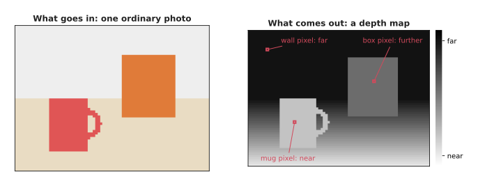
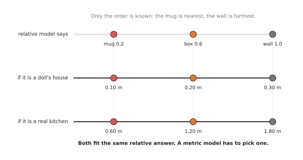
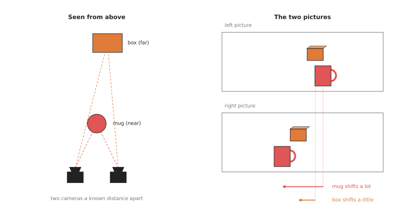
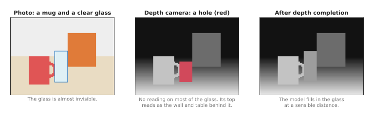

# Depth from pictures

This page answers one question: how can a model tell how far away things are, when
all it has is ordinary photos? A robot arm needs distances before it can reach for
anything, but a photo alone does not contain them, so this is a harder problem than
it first looks.

It is written for a reader who has already read the earlier pages of this
chapter, and who knows what a model is from [what a model
is](../../01_what-models-are/01_what-a-model-is.md). It covers three kinds of
model: the first guesses depth from one photo, the second measures depth from
two photos taken side by side, and the third repairs the holes that a depth
camera leaves on shiny and clear objects.

> Before this page, it helps to have read [multi-view geometry](../../../06_programming-techniques/02_geometry-and-cameras/03_also-used/01_multi-view-geometry.md), which explains how the shift of a point between two pictures gives its depth. The stereo models on this page learn the matching and keep that geometry.

## Contents

1. [What it is](#1-what-it-is)
2. [What goes in and what comes out](#2-what-goes-in-and-what-comes-out)
3. [How it works inside](#3-how-it-works-inside)
4. [How it is trained](#4-how-it-is-trained)
5. [Well-known models](#5-well-known-models)
6. [Where to read next](#6-where-to-read-next)

---

## 1. What it is

The one-sentence idea is this: a depth model looks at one or two photos and gives
every pixel a distance from the camera.

You already do this with your own eyes, because if you close one eye and look at
a room, you still know that the chair is nearer than the wall. You know it
because the chair covers part of the wall, because the chair looks big, and
because you know how big chairs usually are. Nobody measured anything, so you
used clues you have learned over your life, and a depth model learns the same
kinds of clues from millions of photos.

Now open both eyes, because each eye sees the scene from a slightly different
place. Near things shift a lot between the two views, while far things shift only a
little. So your brain uses that shift to judge distance more precisely. A stereo
depth model does the same thing with two cameras.

There are three kinds of model on this page.

- A **monocular depth** model uses one photo, and monocular means "one eye".
- A **stereo** model uses two photos taken at the same moment by two cameras a
  known distance apart.
- A **depth completion** model takes a depth image that has holes or wrong values
  in it and fills them in, using the colour photo as a guide.

---

## 2. What goes in and what comes out

Different as those three kinds are, the output of all of them is a **depth map**,
which is a picture the same size as the photo where each pixel holds a distance
instead of a colour. People usually show it in grey, with near things light and far
things dark.



The mug is near, so its pixels are light, and the wall is far, so its pixels are
dark.

The inputs differ, however, so the table below shows what each kind of model takes
in and what its output means, and you should read each row of it across.

| Kind | What goes in | What comes out | Are the distances in metres? |
| --- | --- | --- | --- |
| Monocular | one colour photo | one distance per pixel | only for some models, and only roughly |
| Stereo | two colour photos, taken side by side | one distance per pixel | yes, if the cameras are measured carefully |
| Depth completion | a colour photo and a depth image with holes | the depth image with the holes filled | yes, because it starts from real measurements |

That last column matters a great deal, because many monocular models give only
**relative depth**. Relative depth tells you the order of things, so the mug is
nearer than the box and the box is nearer than the wall. However, it does not tell
you how many metres away anything is. A model that gives real distances in metres
gives **metric depth** instead.



The same relative answer fits a doll's house and a real kitchen, so relative depth
alone cannot tell the arm how far to reach.

For a robot arm, the depth map is rarely the final answer, because the robot
turns it into a **point cloud**. This is a list of 3D points, one for each
pixel, worked out from the pixel's position and its distance. The [3D models
chapter](../../04_3d-models/01_overview.md) works with point clouds.

---

## 3. How it works inside

### One photo

A monocular model is usually built from two parts, and the first part is an
**encoder**, which is a network that turns the photo into a large set of numbers
describing what is where in the picture. Many recent models use a **vision
transformer (ViT)** as that encoder, because a vision transformer cuts the picture
into small square patches and lets every patch compare itself with every other
patch. This is what helps it use clues from the whole picture at once, such as
where the floor meets the wall.

Then the second part is a **decoder**, which turns those numbers back into a
picture of the original size, with one distance per pixel. Depth Anything V2, which
section 5.1 recommends, is an encoder and a decoder in exactly this arrangement.

The model works from clues it learned in training. For example, things higher in
the picture are often further away, a thing that covers another thing is nearer,
and parallel lines, such as the edges of a table, get closer together as they go
away. Known objects, such as mugs and doors, also have typical sizes.

The shortlist in section 5 holds two variations on this shape, and both change what
goes in rather than how the network is built. Prompt Depth Anything, in section
5.3, takes the coarse depth image from a depth camera as a second input, and those
real measurements steer the model to an answer in metres instead of an order. Depth
Anything 3, in section 5.2, passes several photos of the same scene through one
encoder together, so it gives depth for all of them and also works out where each
photo was taken from. One photo on its own still works, and the further photos only
add to what the model has to go on.

### Two photos

A stereo model follows the shift idea from section 1, and the shift of a thing
between the left and the right photo is called **disparity**.



The near mug moves a long way between the two pictures and the far box moves only
a little, so the size of the shift tells the distance.

The steps of a stereo model are these four.

1. Both photos go through the same encoder, which turns small patches into lists of
   numbers that describe them.
2. For each patch in the left photo, the model compares it with patches along the
   same row in the right photo, and the one that matches best shows how far that
   patch shifted.
3. A learned network then cleans up the matches, because it smooths flat areas and
   keeps sharp edges between objects.
4. Finally, simple geometry turns each shift into a distance, since distance equals
   a fixed number divided by the shift. That fixed number comes from the distance
   between the two cameras and the camera's lens, so a big shift means near and a
   small shift means far.

Step 4 is why stereo gives real metres, because the model does not guess the scale
at all: the scale comes from the measured gap between the cameras.

RAFT-Stereo, which section 5.4 recommends, is built from these four steps, and it
repeats step 3 in many small rounds rather than doing it once. FoundationStereo, in
section 5.5, follows the same four steps, and what sets it apart is the breadth of
its training rather than a different recipe.

### Filling holes

Instead of guessing or matching, a depth completion model gets two inputs: the
colour photo, and the real depth image from a depth camera. The depth image is
good in most places, but on a clear glass or a shiny spoon it is empty or wrong,
because the camera's light passes through the glass or bounces off the metal.

So the model learns to use the good depth around the hole, plus the shape it can
see in the colour photo, to fill that hole. For example, it sees the outline and
the highlights of a glass in the colour photo, and it sees the table depth all
around the glass, so it fills in the glass as a surface standing on that table.



The depth camera returns nothing on most of the glass (red), and the completion
model fills that area with a sensible distance.

ReMake, which section 5.6 recommends, is the completion model on this page, and it
needs one more input than the two described here, because you also give it an
outline of the object. The transparent variant of Prompt Depth Anything does a
similar job from the colour photo and the sensor's depth alone.

---

## 4. How it is trained

Whichever of those three kinds you use, a depth model learns from photos paired
with the correct depth, and getting that correct depth is the hard part, so
different models use different sources.

- **Depth cameras indoors.** A depth camera records a colour photo and a depth image
  together, and the pairs then become training examples. This gives real distances,
  but the depth has holes on shiny and dark things.
- **Laser scanners outdoors.** Self-driving car datasets drive a car with cameras
  and a laser scanner, which measures distance with light, so the scanner gives
  correct distances for part of each photo.
- **3D films.** Films shot for 3D cinema have a left and a right picture for every
  frame, and the shift between them gives relative depth. MiDaS was trained partly
  on pictures like these.
- **Computer-made scenes.** A program renders a 3D scene and knows the exact depth
  of every pixel. This is the main source for stereo models and for clear-object
  models, because real clear objects are so hard to measure.
- **Pictures labelled by another model.** Depth Anything used a large model, trained
  first on labelled pictures, to label millions of unlabelled internet photos, and a
  student model then learned from all of them. This is called **pseudo-labelling**,
  because the labels come from a model rather than from a measurement.

Relative-depth models are trained to get the order right and to ignore the scale,
which lets them learn from many datasets whose units do not agree. That is also why
their output is not in metres.

---

## 5. Well-known models

This section names the depth models a developer actually reaches for in 2026, and
it helps you decide which one belongs on your arm. The decision it has to settle
is the one from section 2: whether to guess depth from one photo, to measure it
from two photos, or to let a depth camera measure it and use a model only to
repair what the camera missed.

Two older names still appear in tutorials and should not be your starting point.
MiDaS, from Intel in 2019, proved that one network could give relative depth for
almost any photo, and ZoeDepth was its metric follow-up. Both repositories now
carry the "Public archive" label on GitHub, so nobody is fixing them.

The table compares the six models below. The left column names the model and says
how current it is. The right column holds everything you weigh up: what the model
gives you, how large it is, the licence of the weights rather than of the code, and
when to pick it. A **parameter** is one of the numbers inside the network, and the
counts come from the files Hugging Face serves and from the Depth Anything 3 model
card. Where a model ships in several sizes under different licences, the right
column says so, because that is the detail people get wrong most often.

| Model | What decides it |
| --- | --- |
| **Depth Anything V2**, most used in 2026 | Relative depth from one photo, with 24.8 million parameters in the small size and 97.5 million in the base size. The small weights are Apache-2.0, while the base and larger weights are CC BY-NC 4.0. Pick it when you have one colour camera and need order, not metres. |
| **Depth Anything 3**, worth betting on | Relative or metric depth, from one photo or several, in sizes from 0.08 to 1.4 billion parameters. Small, Base, `DA3METRIC-LARGE` and `DA3MONO-LARGE` are Apache-2.0, while Large, Giant and Nested are CC BY-NC 4.0. Pick it when you need metric depth and you have to ship it. |
| **Prompt Depth Anything**, worth betting on | Metric depth from one photo plus a coarse depth image, with 25.1 million parameters, under Apache-2.0. Pick it when you already have a depth sensor and want its reading sharpened. |
| **RAFT-Stereo**, most used in 2026 | Metric depth from two photos, under the MIT licence. Its size is `not stated`. Pick it when you can mount two cameras and measure the gap between them. |
| **FoundationStereo**, worth betting on | Metric depth from two photos, including scenes it never saw, under an NVIDIA licence that is non-commercial. Its size is `not stated`. Pick it when you are doing research, not shipping. |
| **ReMake**, worth betting on | Depth for clear and shiny objects a sensor cannot see, under the MIT licence. Its size is `not stated`. Pick it when your objects are glass or chrome. |

### 5.1 Depth Anything V2

Depth Anything V2 is **most used in 2026** for relative depth from one photo, and
it is where most robot projects start. It was published in June 2024 as [Depth
Anything V2](https://arxiv.org/abs/2406.09414), and section 4 described how it was
trained. Its small size has about 24.8 million parameters, little enough to run
without a graphics card.

The obvious alternative among the monocular models is Marigold, which starts from
an image-generating model. Depth Anything V2 is the one to pick because it is far
smaller, far faster, and carried by `transformers`, so one line loads it. Pick it
when you have one colour camera and you need to know which thing is in front, not
how many millimetres away it is.

What it costs you is the units. The output is relative, so a value of 8 means
"nearer than 4" and nothing more. The licence costs you something too: the small
weights are Apache-2.0, but the base and larger weights are CC BY-NC 4.0, a
Creative Commons licence that forbids commercial use, and the Apache-2.0 badge on
the GitHub repository covers the code rather than those weights. The other thing
that goes wrong often is trusting the depth at the edge of an object, which is
where a gripper closes and where these models are least accurate.

The library is `transformers`, which has a pipeline for depth.

```python
from PIL import Image
from transformers import pipeline

# The "-Small-hf" checkpoint is the Apache-2.0 one.
pipe = pipeline("depth-estimation",
                model="depth-anything/Depth-Anything-V2-Small-hf")

prediction = pipe(Image.open("table.jpg"))

depth = prediction["predicted_depth"].numpy()   # one number per pixel
picture = prediction["depth"]                   # the same thing as a grey image
print(depth.shape, float(depth.min()), float(depth.max()))
```

What the library gives you is a number for every pixel of any ordinary photo, with
no camera calibration, no second camera and no training. What you still have to
supply is the scale: either fit the output against a few real distances, such as
the known height of the table, or use one of the metric models below.

### 5.2 Depth Anything 3

Depth Anything 3 is **worth betting on**, because it is where this family is
going: one network that handles one photo or many, and that comes in a metric size
whose weights you are allowed to ship. ByteDance published it in November 2025, as
[Depth Anything 3: Recovering the Visual Space from Any
Views](https://arxiv.org/abs/2511.10647). The checkpoint to know about is
`DA3METRIC-LARGE`, which is about 0.35 billion parameters, gives metric depth, and
is Apache-2.0 according to the project's own model card.

The obvious alternative for permissive metric depth is MoGe-2, from Microsoft,
which is MIT for both code and weights. This repository's survey in [models that
measure](../../../02_perception/02_object-perception/05_models-that-measure.md#12-the-models-and-their-licences)
names those two as the strongest metric models with genuinely permissive weights.
Pick Depth Anything 3 when you also want the multi-view ability, because the same
model estimates camera positions from several photos.

What it costs you starts with the split licence, which is the trap in this family.
Small, Base, `DA3METRIC-LARGE` and `DA3MONO-LARGE` are Apache-2.0, while Large,
Giant and the Nested models are CC BY-NC 4.0 and therefore not shippable. It also
costs you a graphics card, since the metric model is about thirteen times the size
of Depth Anything V2 Small, and it is not in `transformers`, so you install the
project's own package. The thing that most often goes wrong is the metric output
itself, because it is not in metres until you scale it. The project's own answers
page gives the conversion, `metric_depth = focal * net_output / 300`, where
`focal` is the focal length in pixels.

The library is the project's own `depth_anything_3` package, from its [GitHub
repository](https://github.com/ByteDance-Seed/Depth-Anything-3).

```python
import torch
from depth_anything_3.api import DepthAnything3

# DA3METRIC-LARGE is the Apache-2.0 metric checkpoint.
model = DepthAnything3.from_pretrained("depth-anything/DA3METRIC-LARGE")
model = model.to(device=torch.device("cuda"))

# inference takes a list of image paths, even when the list has one entry.
prediction = model.inference(["table.jpg"])

print(prediction.depth.shape)   # [1, height, width], float32
print(prediction.conf.shape)    # how sure the model is, per pixel
```

What the library gives you is the depth, a confidence number per pixel, and, when
you pass several photos, the camera positions as well. That confidence is worth
having, because most depth models give you no way to
tell a good pixel from a bad one. What you supply is the focal length in pixels,
from your camera calibration, and the conversion above.

### 5.3 Prompt Depth Anything

Prompt Depth Anything is **worth betting on**, because it settles the argument
between a learned model and a depth sensor by using both, and that is the shape
the problem has on a real arm. The paper is [Prompting Depth Anything for 4K
Resolution Accurate Metric Depth Estimation](https://arxiv.org/abs/2412.14015),
from December 2024, and its abstract reports that the result helps "generalized
robotic grasping". You give the model a colour photo and a coarse depth image, and
the sensor's reading steers the model to a sharp depth map in metres. The small
checkpoint has about 25.1 million parameters and is Apache-2.0.

The obvious alternative is the monocular route of section 5.1, followed by fitting
the result to a few measured points. That fitting is one correction for the whole
picture, so it cannot repair a scale that drifts across the scene. Prompt Depth
Anything uses the sensor's measurements everywhere at once, so pick it whenever you
already own a depth camera. Against the camera alone, it gives you the camera's
metres with the model's sharp object edges.

What it costs you is the sensor, because with no depth image to hand the model
falls back to relative monocular depth and you are back in section 5.1. It also
costs you a graphics card to run at a useful frame rate. The thing that most often
goes wrong is the units in your own code, because the model returns metres and
depth cameras usually report millimetres, so a factor of a thousand is easy to
lose.

The library is `transformers`, and the call differs from section 5.1 by one
argument.

```python
import torch
from PIL import Image
from transformers import AutoImageProcessor, AutoModelForDepthEstimation

name = "depth-anything/prompt-depth-anything-vits-hf"
processor = AutoImageProcessor.from_pretrained(name)
model = AutoModelForDepthEstimation.from_pretrained(name)

image = Image.open("glass.jpg")
coarse = Image.open("sensor_depth.png")   # the depth camera's own image

# prompt_depth is what makes the answer metric. Pass None and you get
# relative depth instead.
inputs = processor(images=image, prompt_depth=coarse, return_tensors="pt")
with torch.no_grad():
    outputs = model(**inputs)

result = processor.post_process_depth_estimation(
    outputs, target_sizes=[(image.height, image.width)])
metres = result[0]["predicted_depth"]
```

What you still have to supply is the coarse depth image, in the same view as the
colour photo, which means your camera's colour and depth streams must already be
aligned. There is also a variant trained for transparent objects,
`prompt-depth-anything-vits-transparent-hf`, which is worth trying before you
reach for section 5.6.

### 5.4 RAFT-Stereo

RAFT-Stereo is **most used in 2026** as the first stereo model to try, and this
repository's survey calls it the sensible default. It came from Princeton
University in September 2021, as [RAFT-Stereo: Multilevel Recurrent Field
Transforms for Stereo Matching](https://arxiv.org/abs/2109.07547), and it works
the way section 3 described, improving its guess of the shift for every pixel over
many small rounds. Its licence is MIT.

The obvious alternative is OpenCV's `StereoSGBM`, which matches the two pictures
with a written algorithm and needs no model and no graphics card. That function is
the baseline every stereo paper is measured against, and on a textured scene in
good light it is often enough. Pick RAFT-Stereo when it leaves holes, which happens
on weakly textured surfaces and at the edges of objects, because the learned
matcher fills those in. The [multi-view
geometry](../../../06_programming-techniques/02_geometry-and-cameras/03_also-used/01_multi-view-geometry.md)
page shows that written route in full.

What it costs you is the rig, because stereo needs two cameras held rigidly apart
and calibrated carefully, and the depth gets worse as soon as they shift. Its
custom CUDA kernel is optional, so the model runs without one. The thing that most
often goes wrong is the conversion from shift to distance, because the
repository's own note warns that the focal length in that formula is in pixels and
not in millimetres.

There is no package to install. You clone the
[repository](https://github.com/princeton-vl/RAFT-Stereo), download the weights
with its script, and run its demo on your own pair of pictures.

```bash
# Downloads the pretrained weights into models/
bash download_models.sh

# --save_numpy writes the shift for every pixel as a .npy file.
python demo.py \
    --restore_ckpt models/raftstereo-middlebury.pth \
    -l=left.png -r=right.png \
    --save_numpy
```

The repository recommends those Middlebury weights for everyday pictures. What you
still have to supply is the geometry, because the model gives you the shift per
pixel and you turn that into metres yourself, from the focal length in pixels and
the measured gap between the two cameras.

### 5.5 FoundationStereo

FoundationStereo is **worth betting on**, because it brings to stereo what Depth
Anything brought to one photo: a model trained so broadly that it works on scenes
unlike anything in its training set, with no retraining from you. NVIDIA published
it in January 2025, as [FoundationStereo: Zero-Shot Stereo
Matching](https://arxiv.org/abs/2501.09898), and its repository records a best
paper nomination at the 2025 Computer Vision and Pattern Recognition conference
and first place on the Middlebury and ETH3D leaderboards. It was trained on the
project's own computer-made scenes, about a million of them.

The obvious alternative is RAFT-Stereo from section 5.4. FoundationStereo is
stronger on scenes it has never seen, and its repository reports that it works on
the monochrome and infrared pictures an Intel RealSense D4-series camera produces,
which turns a depth camera you already own into a stereo pair for a better model.
Pick RAFT-Stereo anyway if your work will be sold, for the reason below.

What it costs you is the licence, and that cost is absolute. The weights come
under an NVIDIA research licence whose own words limit use to research purposes
only, so this model cannot go into a product, although the repository says a
commercial model is available from NVIDIA on request. It also needs an NVIDIA
graphics card, and this repository's page on [working without a
GPU](../../../03_frameworks/03_arm-movement/10_working-without-a-gpu.md) lists it
among the models with no route at all on other hardware.

There is no package. You clone the
[repository](https://github.com/NVlabs/FoundationStereo), download its checkpoint,
and run its demo script.

```bash
python scripts/run_demo.py \
    --left_file ./assets/left.png \
    --right_file ./assets/right.png \
    --ckpt_dir ./pretrained_models/23-51-11/model_best_bp2.pth \
    --out_dir ./test_outputs/
```

What you still have to supply, to get a point cloud rather than a picture of
shifts, is an intrinsics file. The repository states its format exactly: the first
line holds the nine numbers of the camera matrix, and the second line holds the
distance between the two cameras in metres.

### 5.6 ReMake

ReMake is **worth betting on** for clear and shiny objects, because it is the
first recent depth completion model with a licence you can use, and because it
follows the same recipe as the worked example in section 6. It accompanies a 2026
paper in *IEEE Robotics and Automation Letters*, "Rethinking Transparent Object
Grasping: Depth Completion With Monocular Depth Estimation and Instance Mask", and
its [repository](https://github.com/ChengYaofeng/ReMake) carries an MIT licence
file. It takes a monocular depth estimate and a mask of the object, and fills the
camera's missing depth inside that mask.

The obvious alternative is ClearGrasp, which is still the paper everyone cites for
this problem and which was built from computer-made pictures of glass, in the way
section 4 described. It was abandoned in 2021. The other alternative, TransCG, has
the largest real dataset of clear objects and a CC BY-NC-SA 4.0 licence, so it
cannot be sold. Pick ReMake because it is
maintained, permissive and recent, and this repository's survey of [transparent and
shiny
objects](../../../02_perception/02_object-perception/04_models-that-find.md#17-transparent-and-shiny-objects)
reaches the same conclusion.

What it costs you is the segmentation step, because you supply the mask yourself
from a model such as the ones on the
[segmentation](../02_most-used/02_segmentation.md) page. It costs you a graphics
card, and the project's checkpoint comes from a file-sharing link rather than
Hugging Face, so your build cannot simply download it. The thing that most often
goes wrong is this: the filled surface is invented, so a glass
lying on its side can be filled in as a glass standing up.

There is no package and no Python entry point. You clone the repository, place
its checkpoint, and run its scripts.

```bash
# Fill the depth for one set of pictures.
bash ./scripts/inference.sh

# The same thing on a live Intel RealSense D435 camera.
bash ./scripts/realworld_inference.sh
```

What you still have to supply is the configuration file those scripts read, the
mask, and the camera's own depth image. If that is more work than you want, try the
transparent variant of Prompt Depth Anything first, because it needs only
`transformers`.

### 5.7 How to choose

Start from the sensor, not from the model. If the robot has a depth camera and the
objects are ordinary, use the camera's own depth and add no model at all, because a depth camera is more accurate than any monocular model.

Six things change that.

- The camera's depth is coarse or noisy, and you want sharp edges in metres. Then
  add Prompt Depth Anything from section 5.3, which keeps the camera's scale.
- The objects are glass or chrome, so the camera returns holes. Then segment the
  object and fill the holes with ReMake from section 5.6, or try the transparent
  variant of Prompt Depth Anything first.
- There is no depth camera, but you can mount two cameras and measure the gap
  between them. Then use RAFT-Stereo from section 5.4, or OpenCV's `StereoSGBM` if
  your scene is well textured.
- You need the strongest stereo result and you are not selling the product. Then
  use FoundationStereo from section 5.5, and read its licence first.
- There is one colour camera and you need metres. Then use `DA3METRIC-LARGE` from
  section 5.2, or MoGe-2, and expect to check the numbers against something real.
- There is one colour camera and you only need to know what is in front of what.
  Then use Depth Anything V2 Small from section 5.1, which is the cheapest answer
  on this page.

Whichever you choose, do not let a learned depth value be the last word before the
gripper closes. ---

## 6. Where to read next

- [Keypoints and object pose](../02_most-used/04_keypoints-and-object-pose.md) is the page before
  this one, and most pose models need good depth.
- [Open-vocabulary models](../02_most-used/03_open-vocabulary-models.md) is the next page, and it
  shows how to find an object from words before you measure it.
- [Point cloud models](../../04_3d-models/02_most-used/01_point-cloud-models.md) and
  [shape completion](../../04_3d-models/03_also-used/01_shape-completion.md) work on the 3D points a
  depth map turns into.
- [Running a model on a robot](../../10_making-models-work-on-an-arm/02_most-used/02_running-a-model-on-a-robot.md)
  explains why a GPU matters and how fast a model must be.
- For the sensors themselves, read
  [the sensors, and the software for each](../../../02_perception/02_object-perception/02_sensors.md).
- For measured accuracy and licences, read
  [models that measure](../../../02_perception/02_object-perception/05_models-that-measure.md).
