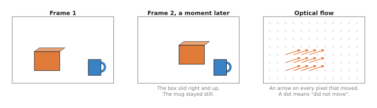
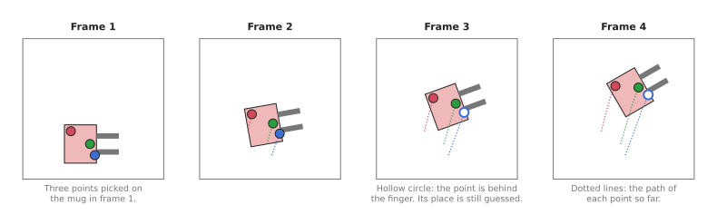
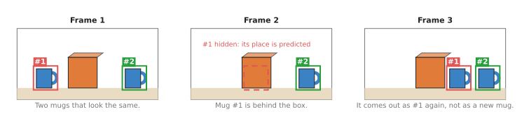

# Tracking and motion

This page answers one question: how does a model follow things from one video frame
to the next? A robot arm often needs to know not only where something is, but also
how it is moving, and whether the thing it sees now is the same thing it saw a
moment ago.

It is written for a reader who has already read the earlier pages of this
chapter, so you should know what a detection box and a segmentation outline are,
from [object detection](../02_most-used/01_object-detection.md) and
[segmentation](../02_most-used/02_segmentation.md). Every other page in this
chapter looks at one photo at a time, whereas this page looks at a video, which
is a series of photos, called **frames**, taken one after another. It covers
three kinds of model: optical flow, point tracking and object tracking.

> Before this page, it helps to have read the [Kalman filter](../../../06_programming-techniques/04_fitting-and-estimation/02_most-used/03_kalman-filter.md) and [assignment and matching](../../../06_programming-techniques/03_searching-and-matching/02_most-used/03_assignment-and-matching.md). The object trackers in section 3 are built from both: the filter predicts where each object will be, and assignment pairs each new box with an object.

## Contents

1. [What it is](#1-what-it-is)
2. [What goes in and what comes out](#2-what-goes-in-and-what-comes-out)
3. [How it works inside](#3-how-it-works-inside)
4. [How it is trained](#4-how-it-is-trained)
5. [Well-known models](#5-well-known-models)
6. [Where to read next](#6-where-to-read-next)

---

## 1. What it is

The one-sentence idea is this: a tracking model compares frames of a video and says
where each pixel, point or object from one frame has gone in the next.

Here is an everyday example: watch a ball roll across a floor, and you do not
see a new ball in every moment, because you see one ball that moves. You also
know which way it is going and roughly how fast. So a tracking model gives a
robot those same two things: the same identity over time, and the motion.

There are three kinds, from the finest to the coarsest.

- **Optical flow** says, for every pixel in one frame, where that pixel moved to in
  the next frame, and it works on two frames at a time.
- **Point tracking** follows a chosen set of points, such as a few dots on a mug,
  through many frames, and it keeps following them even when they are hidden for a
  while.
- **Object tracking** follows whole objects, as boxes or outlines, through many
  frames, and it gives each object a number that stays the same while the object is
  in view.

---

## 2. What goes in and what comes out

Because those three kinds work at different levels of detail, they also take and
give different things, so the table below compares them. Read each row as: what
goes in, what comes out, and what a robot arm uses it for.

| Kind | What goes in | What comes out | A typical use on an arm |
| --- | --- | --- | --- |
| Optical flow | two frames next to each other | an arrow for every pixel: how far it moved and which way | spotting what moved, for example a person's hand entering the scene |
| Point tracking | a video and some starting points | each point's position in every frame, and whether it is visible | following parts of a cloth, or the corner of a lid, while the arm moves it |
| Object tracking | a video, and boxes or outlines from a detector or a click | each object's box or outline in every frame, with the same number each time | picking an object off a moving belt, or keeping count of objects in a bin |

For optical flow, the output is often drawn as arrows on a grid, where each arrow
starts where a pixel was and points to where it went.



Only the box moved, so only its pixels get arrows, and the still mug and wall get
dots.

For point tracking, the output is a path for each point, plus a yes or no for
whether the point can be seen in each frame.



The gripper lifts and turns the mug, and the model keeps following the blue point
even while a finger hides it.

For object tracking, the output is a box or an outline per object per frame,
together with a number for each object that stays the same.



Mug 1 goes behind the box and comes out again, and the tracker still calls it
mug 1, not a new mug.

---

## 3. How it works inside

### Optical flow

A modern optical flow model, such as RAFT, works in these steps. RAFT is also the
flow model [section 5.6](#56-raft-for-motion-at-every-pixel) recommends, so the
steps below describe a model you would actually install.

1. An encoder turns each of the two frames into a grid of small embeddings, where an
   **embedding** is a list of numbers that describes a small patch of the picture.
2. The model then compares every patch in frame 1 with every patch in frame 2, and
   stores how alike each pair is, because patches that look alike are likely to be
   the same bit of the world.
3. It starts with a guess that nothing moved at all.
4. It improves that guess in many small rounds, and in each round it looks at how
   well the current guess matches the stored comparisons, and adjusts each arrow a
   little.
5. After enough rounds, it outputs the final arrow for every pixel.

The small rounds in step 4 are what made RAFT accurate, and the same idea is
used by RAFT-Stereo on the [depth from pictures](02_depth-from-pictures.md)
page, because finding the shift between two stereo photos is the same problem as
finding motion between two frames.

### Point tracking

However, a point tracker must follow a point over many frames rather than only
two, and it must also keep going when the point is hidden.

1. For each starting point, the model records what the picture looks like around
   it.
2. In each new frame, it then searches for the patch that looks most like that
   record.
3. It does not decide each frame alone, because it looks at a window of frames
   together, so that the path stays smooth and makes sense over time.
4. When a point is hidden, the model marks it as not visible, but it still guesses
   where the point is, from the path so far and from the other points around it.

CoTracker makes that last idea stronger, because it tracks many points together, so
if one point on a mug is hidden, the other points on the same mug help place it.
CoTracker3, which [section 5.5](#55-cotracker3-for-points-on-something-that-bends)
recommends, is the current version of that model.

### Object tracking

Most object trackers for robots use a method called **tracking by detection**.

1. A detector finds boxes in every frame, but it does not know which box in this
   frame matches which box in the last frame.
2. So a **predictor** guesses where each known object should be now, from where it
   was and how fast it was moving. A common predictor is the **Kalman filter**, an
   ordinary program that keeps a best guess of position and speed and updates it
   with each new measurement, and it is not a neural network.
3. The tracker then matches each new box to the nearest predicted position, and this
   step is called **association**.
4. A matched box keeps its object's number, while a box with no match becomes a new
   object. A known object with no box is kept for a few frames as "hidden", with its
   predicted position, in case it comes back.

Those four steps are the whole of SORT, which
[section 5.2](#52-sort-the-one-that-explains-the-others) keeps as the clearest way
to read the method, and almost the whole of ByteTrack, which
[section 5.1](#51-bytetrack-for-several-objects-at-once) recommends. Neither of
those two holds any learned weights, so the only network in this route is the
detector in step 1. Some trackers also compare how the objects look, using an
embedding for each box, so that they can tell apart two objects that pass close to
each other.

The other two object trackers in section 5 do not follow this route at all. SAM 2,
from [section 5.3](#53-sam-2-for-following-one-object-you-pointed-at), needs no
detector, because you click once on an object in one frame, and it then keeps a
memory of what the object looked like and draws the outline in every later frame.
SAM 3, from
[section 5.4](#54-sam-3-one-model-that-detects-and-follows-what-you-name), needs
neither a detector nor a click, because you give it a short phrase and one model
finds every object the phrase describes, numbers them itself, and then follows them
with the memory that SAM 2 uses.

---

## 4. How it is trained

Training data for motion is hard to get from real videos, because no person can
label where every pixel moved between two frames, and even labelling a few points
through a long video is slow.

So most of these models start with computer-made videos instead. A program moves 3D
objects around a scene and renders the frames, and because the program moved the
objects, it knows exactly where every pixel went.

- **Flying Chairs** is a well-known example for optical flow, and it is made of
  pictures of chairs pasted onto background photos and moved around. It looks
  nothing like a real room, yet flow models trained on it work on real videos.
- **Kubric** is a program from Google that renders scenes of objects falling and
  bouncing, and point trackers such as TAPIR learned from videos made with it.
- Some newer point trackers, such as CoTracker3, add real videos later, because a
  trained model labels the real videos itself and the new model then learns from
  those labels. This is the same pseudo-labelling idea described in
  [depth from pictures](02_depth-from-pictures.md#4-how-it-is-trained).

Instead, object trackers mostly reuse a trained detector, and the tracking step
on top is often plain code, so it needs no training at all. Trackers that
compare how objects look are trained on videos where people have drawn boxes and
numbered the objects in every frame.

---

## 5. Well-known models

This section names the trackers a developer would install today, and it keeps the
three kinds of this page apart, because picking the wrong kind costs much more than
picking the wrong model inside a kind. Two of the best known names below are not
learned models at all.

The table compares them. The left column names the model and says how current it
is. The right column begins with which of the three kinds the model belongs to,
because that is the choice that matters most, and then gives what it is best at,
how big it is, what licence it carries, and the case that should make you pick it.
The right column says `not stated` where the project that made the model publishes
no number.

| Model | What decides it |
| --- | --- |
| **ByteTrack**, most used in 2026 | Object tracking, many at once. It is best at keeping one number on each of several objects that your detector already finds. It has no weights of its own, and its original code is MIT. Pick it when a detector already works and several objects move at once. |
| **SORT**, historical | Object tracking, many at once. It is best at showing in a few hundred lines what tracking by detection is. It has no weights of its own, and its original code is GPL-3.0. Pick it when you want to read the method rather than ship it. |
| **SAM 2**, most used in 2026 | Object tracking, one object at a time. It is best at following the outline of one object somebody pointed at, through hidden spells and changes of shape. It comes in sizes from 38.9 million to 224.4 million parameters, and both its code and its weights are Apache-2.0. Pick it when something can point at the object once and the camera films without a break. |
| **SAM 3**, worth betting on | Object tracking, from a written phrase. It is best at finding and then following every object that matches a short phrase, with no detector of your own. It has 848 million parameters, it carries a bespoke SAM License, and its weights need an access request. Pick it when you cannot train a detector and you can say in words what to follow. |
| **CoTracker3**, worth betting on | Point tracking. It is best at following points you chose on something that bends, such as cloth. Its size is `not stated`, and most of its code is CC-BY-NC. Pick it when the thing you follow has no fixed shape. |
| **RAFT**, most used in 2026 | Optical flow. It is best at measuring how far every pixel moved between two frames. It has 5.3 million parameters for `raft_large` and 1.0 million for `raft_small`, under the BSD-3-Clause licence. Pick it when you need motion everywhere and no identity. |

Every size above is the number its own project publishes. ByteTrack and SORT have
no size because they hold no learned weights at all, as the next two sub-sections
explain.

### 5.1 ByteTrack, for several objects at once

ByteTrack is the box tracker **most used in 2026**, because nearly every tracking
library ships it and it needs nothing from you except detections. Yifu Zhang and
eight colleagues published it in October 2021, and its one idea is in the title of
the paper, [Multi-Object Tracking by Associating Every Detection
Box](https://arxiv.org/abs/2110.06864). Earlier trackers threw away the boxes a
detector was unsure about. ByteTrack instead matches the confident boxes to its
existing tracks first, and then offers the unsure boxes a second chance against
the tracks that found no match. A partly hidden object usually produces exactly
such an unsure box, so that second pass is what keeps its number.

It is worth being plain about what ByteTrack is. It is not a learned model. It is
one Kalman filter per track, a measure of overlap between two boxes, and an
assignment step, which is the tracking-by-detection recipe of
[section 3](#3-how-it-works-inside) written out in a few hundred lines of ordinary
code. All of the learning happens in the detector you hand to it.

The obvious alternative is BoT-SORT, which adds two things to the same recipe: it
corrects for a camera that moves, and it compares an appearance embedding for each
box so that two similar objects crossing are less likely to swap numbers.
Ultralytics ships both, and also TrackTrack, which became its
[default tracker](https://docs.ultralytics.com/modes/track/) in version 8.4.63.
Pick ByteTrack when the camera is fixed in place and the scene holds a handful of
objects, which is the usual table or conveyor belt. It runs no extra network, so
it adds almost no time to a frame, and it has fewer settings to get wrong. Move to
BoT-SORT or TrackTrack when objects crowd together and swap numbers anyway, or
when the camera itself moves.

ByteTrack costs almost no computing time, and its costs appear as behaviour
instead. It adds no GPU work of its own, so it runs on a small computer next to the
arm. It inherits every mistake the detector makes, because a frame with no
detection is a frame with no track. It tracks boxes that line up with the edges of
the picture, and that is the thing which most often goes wrong on an arm: on a
wrist camera every box moves when the arm moves, so the overlap between one frame
and the next falls to nothing even though the objects stood still, as
[tracking and association](../../../02_perception/02_object-perception/10_tracking-and-association.md#72-why-most-of-that-table-does-not-fit-a-robot-arm)
explains. The original code is MIT, which places no condition on your own program,
but the easiest route to it, Ultralytics, is AGPL-3.0, and that licence applies
even to a program you only offer over a network.

The library to use is [trackers](https://github.com/roboflow/trackers), which is
Apache-2.0, installs with `pip install trackers`, and takes detections from any
detector in the `supervision` format.

```python
from trackers import ByteTrackTracker, frames_from_source

# lost_track_buffer is how many frames a vanished object keeps its number.
tracker = ByteTrackTracker(frame_rate=30.0, lost_track_buffer=15)

for frame_index, frame in frames_from_source("belt.mp4"):
    detections = detect(frame)                 # your detector, as an sv.Detections
    tracked = tracker.update(detections)
    for box, track_id in zip(tracked.xyxy, tracked.tracker_id):
        if track_id == -1:                     # seen, but not a confirmed track yet
            continue
        print(frame_index, int(track_id), [round(v) for v in box])
```

The library gives you the filter, the two-pass matching, the numbering and the
buffer that holds a number for a few frames after the object disappears. You still
have to supply `detect`, which is any detector from the
[object detection](../02_most-used/01_object-detection.md) page wrapped so that it
returns an `sv.Detections`, the detection format of the `supervision` package. You
also have to turn pixel movement into metres per second with your camera
calibration, and to write the rule for what happens when a number disappears,
because an arm that reaches for an object that has left the picture will hit the
belt.

### 5.2 SORT, the one that explains the others

SORT is **historical**, and it is here because reading it is the fastest way to
understand every tracker above. Alex Bewley and four colleagues published
[Simple Online and Realtime Tracking](https://arxiv.org/abs/1602.00763) in 2016,
and it is a Kalman filter for each track, overlap as the cost between a predicted
box and a new one, and the Hungarian algorithm to choose the assignment. That is
the whole method, and it holds no learned weights either.

You would not pick SORT over ByteTrack for a working robot, because ByteTrack is
the same program with the second pass added and it keeps numbers through brief
hiding, where SORT deletes a track almost as soon as the detector misses it. Pick SORT
when you are learning, or when you want the smallest amount of tracking code you
can read in one sitting.

The cost that matters here is not speed but the licence. The original repository,
[abewley/sort](https://github.com/abewley/sort), is GPL-3.0, and much of the tracking
code copied from it no longer carries that notice. The same `trackers` package
holds an Apache-2.0 rewrite of the algorithm, so you can use the method without
accepting the copyleft licence.

```python
from trackers import SORTTracker

# minimum_iou_threshold is the overlap below which a box is not the same object.
tracker = SORTTracker(minimum_iou_threshold=0.3, lost_track_buffer=15)
tracked = tracker.update(detections)           # one frame of sv.Detections
```

The call has the same shape as ByteTrack's, which is the point: both are matching
layers over your detector, so one changed line compares them on your own
recording. What you supply is the detector and the thresholds, because an overlap
threshold that suits boxes the size of a mug does not suit boxes the size of a
screw.

### 5.3 SAM 2, for following one object you pointed at

SAM 2 is **most used in 2026** whenever a person or a program can point at the
object once instead of training a detector for it. Meta released it in July 2024,
with the paper [SAM 2: Segment Anything in Images and
Videos](https://arxiv.org/abs/2408.00714). You give it a click, a box or a mask on
one frame, and it carries a memory of that object through the rest of the video,
returning the outline in every later frame, through partial hiding and through
changes of shape.

The obvious alternative is a detector with ByteTrack on top. SAM 2 wins in two
cases. The first is an object your detector was never trained on, because a single
click replaces the training. The second is an object with no fixed shape, such as a
cloth or a piece of food, where a box has nothing steady to follow and an outline
does. Choose the detector and ByteTrack instead when many objects come and go on
their own, because something still has to tell SAM 2 which objects exist.

What it costs you is a GPU and a continuous recording. The
[repository](https://github.com/facebookresearch/sam2) publishes four sizes, from
38.9M parameters at 91.2 frames per second to 224.4M parameters at 39.5 frames per
second, with the speeds measured on an NVIDIA A100, so a small computer on a robot
will be much slower than that. Its memory grows as the video runs. The thing that
most often goes wrong is feeding it pictures that are not a video: an arm that
photographs a shelf, travels 200 mm and photographs again has given SAM 2 no frames
for the part in between, and its memory has nothing to follow, which
[tracking and association](../../../02_perception/02_object-perception/10_tracking-and-association.md#36-mask-propagation-in-video-and-where-sam-2-actually-fits)
sets out in full. The licence is the easy part, because the code and the weights are
both Apache-2.0.

The library is `sam2`, from that repository, and the `transformers` library carries
the same model for a machine with no NVIDIA card.

```python
import numpy as np
import torch
from sam2.build_sam import build_sam2_video_predictor

predictor = build_sam2_video_predictor(
    "configs/sam2.1/sam2.1_hiera_l.yaml", "./checkpoints/sam2.1_hiera_large.pt")

with torch.inference_mode():
    state = predictor.init_state("frames/")        # a folder of frames, or an MP4 file
    predictor.add_new_points_or_box(
        state, frame_idx=0, obj_id=1,              # obj_id is the number you choose
        points=np.array([[420, 300]], dtype=np.float32),
        labels=np.array([1], dtype=np.int32))      # 1 means "the object is here"
    for frame_idx, obj_ids, masks in predictor.propagate_in_video(state):
        outline = (masks[0] > 0).cpu().numpy()[0]  # True for every pixel of object 1
```

The library gives you the memory, the propagation and the outline at the
resolution of your video. What you have to supply is the click. In a real cell that
click comes from somewhere else: a detector on the first frame, a point a person
touched on a screen, or the place the arm is about to grasp. You also have to turn
the outline into something the arm can use, because SAM 2 returns pixels and not a
position in the robot's frame, and it attaches no confidence to the outline, so
there is nothing in its output to refuse a bad frame with.

### 5.4 SAM 3, one model that detects and follows what you name

SAM 3 is **worth betting on**, because it does detection, segmentation and
tracking in one model that you prompt with a short phrase, so you need no detector
of your own at all. Meta released it in November 2025, and the
[repository](https://github.com/facebookresearch/sam3) states that it is a detector
and a tracker sharing one vision encoder, 848M parameters in total, where the
tracker is the SAM 2 design. You give it a phrase such as `cardboard box`, and it
returns an outline, a box and a number for every object in every frame that matches
the phrase, keeping each number as the object moves. A newer set of weights, SAM
3.1, arrived on 27 March 2026 with a faster way of tracking several objects
together.

The obvious alternative is SAM 2 with a detector in front of it. SAM 3 replaces
both with a phrase, so nothing has to be trained and nobody has to click, and
objects that enter the picture later are found without a new prompt. Keep SAM 2
when the object you want cannot be named in words, or when the licence described
below is not acceptable.

What it costs you is the largest model on this page and the most conditions. The
weights sit behind an access request on Hugging Face, so a build cannot simply
download them. The licence is not Apache-2.0 but a bespoke SAM License dated 19
November 2025, and you have to read it before you ship anything. People get this
wrong because SAM 2, in the same family, is permissive. The repository's own
install instructions ask for PyTorch built for CUDA, although the `transformers`
version of the model avoids the parts that must be compiled.

The shortest route is `transformers`, which has the video model built in.

```python
from transformers import Sam3VideoModel, Sam3VideoProcessor

model = Sam3VideoModel.from_pretrained("facebook/sam3", device_map="auto")
processor = Sam3VideoProcessor.from_pretrained("facebook/sam3")

session = processor.init_video_session(video=video_frames, inference_device="cuda")
processor.add_text_prompt(session, "cardboard box")   # the whole instruction

for outputs in model.propagate_in_video_iterator(session):
    result = processor.postprocess_outputs(session, outputs)
    # object_ids stay the same from frame to frame; boxes are in pixels.
    print(outputs.frame_idx, result["object_ids"].tolist(), result["boxes"].shape)
```

The library gives you the frames, the text encoding, the detection, the matching
and the numbering, which is every step this page has described, in one loop. What
you supply is the phrase, and choosing it is now the work: `box` and `cardboard
box` do not return the same objects, and a phrase that matches too much gives
numbers to things you never wanted. You also have to decide what to do with the
score on each object, because a phrase model answers even when nothing in the
picture matches.

### 5.5 CoTracker3, for points on something that bends

CoTracker3 is **worth betting on** for point tracking, because it reached the
accuracy of the earlier point trackers with much less training data, which is the
direction that makes these models practical to retrain. Meta published it in
October 2024 as
[CoTracker3: Simpler and Better Point Tracking by Pseudo-Labelling Real
Videos](https://arxiv.org/abs/2410.11831). You give it a video and the points you
care about, and it returns each point's position in every frame together with a
yes or no for whether that point can be seen. It tracks the points jointly, so a
point that goes behind a finger is placed from the points around it.

The obvious alternative is to run optical flow between every pair of frames and
add the arrows up. That drifts, because each step adds its own small error, and it
loses a point permanently once the point is hidden for a frame. CoTracker3 keeps the
identity of each point over many frames and tells you when it cannot see one, which
is exactly what folding a towel needs. Use flow instead when you want motion
everywhere rather than a few points you chose.

What it costs you is a GPU, and a licence that stops many projects. Most of
CoTracker is CC-BY-NC, which forbids commercial use, and the
[repository](https://github.com/facebookresearch/co-tracker) says so plainly. If
your work is commercial, use TAPIR instead, from the Apache-2.0
[tapnet](https://github.com/google-deepmind/tapnet) repository. The project states
no parameter count, which is why the table above leaves that cell empty. The
offline mode reads the whole video at once and is the more accurate one, and it
needs the most memory; the online mode works through a stream in windows.

The model loads straight from `torch.hub`, with no repository to clone.

```python
import torch

# The video is (batch, frames, 3, height, width), with values from 0 to 255.
video = torch.from_numpy(frames).permute(0, 3, 1, 2)[None].float().cuda()
# Each query is (t, x, y): the frame to start on, then the pixel in that frame.
queries = torch.tensor([[[0, 412.0, 215.0], [0, 455.0, 260.0]]]).cuda()

cotracker = torch.hub.load("facebookresearch/co-tracker", "cotracker3_offline").cuda()
tracks, visible = cotracker(video, queries=queries)   # (B,T,N,2) and (B,T,N,1)
print(tracks[0, :, 0])            # where the first point was in every frame
```

The library gives you the weights, the joint tracking and the visibility flag.
What you supply is the points, and choosing them is the part that decides whether
this works: a point on a printed logo is followed well, and a point on a plain
white fold is not. You also have to decide what to do with a point marked as not
visible, because the model still reports a position for it, and that position is a
guess.

### 5.6 RAFT, for motion at every pixel

RAFT is the optical flow model **most used in 2026**, mostly because it is the one
you can install without cloning anything: torchvision ships it with trained
weights. Zachary Teed and Jia Deng published it at ECCV 2020 as
[RAFT: Recurrent All-Pairs Field Transforms for Optical
Flow](https://arxiv.org/abs/2003.12039), and
[section 3](#3-how-it-works-inside) describes how it refines its arrows in many
small rounds. It takes two frames and returns, for every pixel, how far that pixel
moved and in which direction.

The obvious alternative is a point tracker such as CoTracker3. RAFT answers a
different question: it tells you about every pixel without you choosing anything,
which is what you want for "did something move in this picture at all", and for
subtracting the movement the arm's own camera caused. Pick the point tracker when
you care about particular places on an object over a long time.
[SEA-RAFT](https://github.com/princeton-vl/SEA-RAFT), from 2024 and also
BSD-3-Clause, is the faster and more accurate successor from the same laboratory,
and it is the one to try if you are willing to install a repository rather than
use torchvision.

What it costs you is a GPU for a model of only 5.3M parameters, because the
comparison of every patch with every patch is the expensive part rather than the
weights. It sees two frames, so it reports no identity and no path. The thing that
most often goes wrong is the picture size: the model needs a height and a width
that divide by eight, and the second most common fault is using flow from a wrist
camera without first removing the motion the arm itself caused.

The library is torchvision, and the weights download on first use.

```python
import torch
from torchvision.models.optical_flow import raft_large, Raft_Large_Weights

weights = Raft_Large_Weights.DEFAULT
model = raft_large(weights=weights).eval().cuda()

# The transform only rescales the pixel values; you resize the frames yourself.
img1, img2 = weights.transforms()(frame1_batch, frame2_batch)
with torch.no_grad():
    flows = model(img1.cuda(), img2.cuda())

flow = flows[-1]        # the model returns one field per round; the last is the best
sideways, up_down = flow[0, 0], flow[0, 1]      # movement in pixels, per pixel
```

The library gives you the architecture, the trained weights and the rescaling. What
you supply is the pair of frames, as `(N, 3, H, W)` batches whose height and width
divide by eight, and a way to summarise the field, because a field of arrows is not
an answer on its own. Two summaries cover most robot uses: the average arrow inside
a detection box, which is that object's movement, and the number of pixels whose
arrow is longer than a threshold, which tells you that something entered the
scene.

### 5.7 How to choose

Start with a detector and ByteTrack through the `trackers` package. It covers the
common robot job, which is several objects moving in front of a camera that stays
still, it needs no GPU of its own, and its licence puts no condition on your
program.

Four things change that choice.

If nothing in the scene has to be told apart from anything else, and you only want
to know whether something moved, use RAFT and ignore identity. If you
cannot train a detector for your objects, point at them once and use SAM 2, or name
them in a phrase and use SAM 3, accepting its bespoke licence and its access
request. If the thing you follow bends or folds, so that neither a box nor an
outline describes it for long, follow chosen points with CoTracker3, and use TAPIR
instead if your work is commercial. If you have exactly one object, no detector and no GPU,
`cv2.TrackerCSRT_create()` in OpenCV follows a box you draw once, using no neural
network at all, and it is enough for a single object that moves smoothly in front
of a fixed camera.

Two cases need something other than a model from this page. A wrist camera moving
with the arm breaks the box trackers, because every box moves when the arm does, so
read
[tracking and association](../../../02_perception/02_object-perception/10_tracking-and-association.md)
and track positions in the robot's frame instead of boxes in the picture. And if
what you need is the full position and rotation of a known object over time rather
than its number,
[FoundationPose](../02_most-used/04_keypoints-and-object-pose.md#6-well-known-models)
follows an object's six-number pose from frame to frame.

---

## 6. Where to read next

- [Open-vocabulary models](../02_most-used/03_open-vocabulary-models.md) is the page before this
  one, and it shows where SAM 2 comes from, and how to choose the object to follow.
- [Keypoints and object pose](../02_most-used/04_keypoints-and-object-pose.md) explains the
  six-number pose that some trackers follow.
- [Video prediction models](../../08_world-models/03_also-used/01_video-prediction-models.md) go
  one step further, because they predict future frames rather than only following
  the current ones.
- [Movement models](../../06_movement-models/01_overview.md) use tracked motion to
  choose what the arm does next.
- For the matching problem in full detail, read
  [tracking and association](../../../02_perception/02_object-perception/10_tracking-and-association.md).
