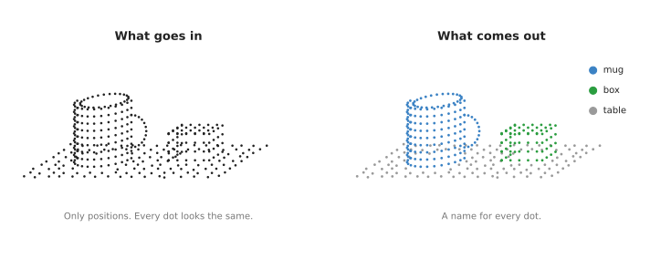
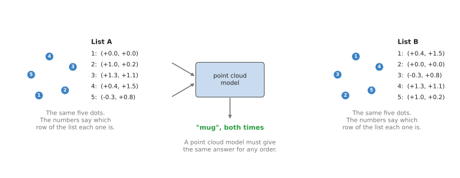
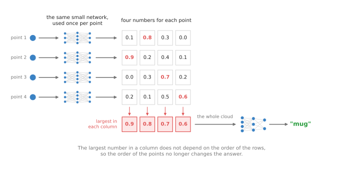
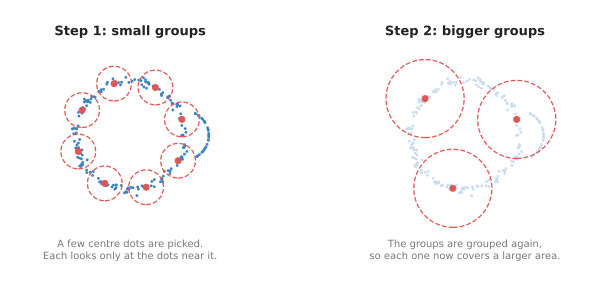

# Point cloud models

This page is about neural networks that read a point cloud directly, so it answers
three questions. How can a model take in a list of 3D points that has no order, and
what does it give back to a robot arm? And when is it better than turning the points
into a picture and using an ordinary image model?

It is for a reader who has read the [chapter overview](../01_overview.md), which
explains what a point cloud is. You should also know, from
[inside a neural network](../../01_what-models-are/03_inside-a-neural-network.md),
that a network is made of layers that turn a list of numbers into another list of
numbers.

> Before this page, it helps to have read [clustering](../../../06_programming-techniques/05_image-and-point-cloud-processing/02_most-used/03_clustering.md), which splits a point cloud into objects with written rules and thins it onto small cubes called voxels. This page shows what a trained model adds.

## Contents

1. [What it is](#1-what-it-is)
2. [What goes in and what comes out](#2-what-goes-in-and-what-comes-out)
3. [How it works inside](#3-how-it-works-inside)
   · [The problem of order](#the-problem-of-order)
   · [One small network for every point, then the largest number](#one-small-network-for-every-point-then-the-largest-number)
   · [Looking at neighbours](#looking-at-neighbours)
   · [Two other ways in](#two-other-ways-in)
4. [How it is trained](#4-how-it-is-trained)
5. [Well-known models](#5-well-known-models)
6. [A worked example: picking a mug from a cluttered table](#6-a-worked-example-picking-a-mug-from-a-cluttered-table)
7. [What goes wrong](#7-what-goes-wrong)
8. [Why this rather than an image model, and what it costs](#8-why-this-rather-than-an-image-model-and-what-it-costs)
9. [The written alternative](#9-the-written-alternative)
10. [Where to read next](#10-where-to-read-next)
11. [Using it in Python](#11-using-it-in-python)

---

## 1. What it is

Since the overview explained what a point cloud is, this section says what a model
does with one. A point cloud model is a neural network that takes a list of 3D
points and says what they are.

For example, imagine someone gives you a sheet of paper with 1,000 rows. Each row
has three numbers, which are the `x`, `y` and `z` of one spot on some object.
The rows are in a random order, and your job is to say whether the object is a mug,
a bottle or a book. A person would plot the dots first and then look at the shape.
But a point cloud model has to do the same job without plotting anything, because it
only has the numbers.

---

## 2. What goes in and what comes out

The sheet of paper in the last section is close to what the model really gets. A
point cloud model takes in one point cloud, and each point in it has at least three
numbers, which are `x`, `y` and `z`. Some models also take the colour of each
point, as three more numbers for red, green and blue.

Before the cloud goes in, the software usually cuts it down to a fixed number of
points, such as 1,024 or a few thousand. It does this by picking points spread
evenly over the cloud, because a full depth camera shot has far more points than a
model needs.

What comes out depends on the job, and there are two common jobs.

- **Classification** gives one name for the whole cloud, such as "mug", together
    with a number between 0 and 1 that says how sure the model is.
- **Segmentation** gives a name to every single point, so on a table scene each
    point is marked "mug", "box" or "table". On a single object, each point can be
    marked with a part name instead, such as "handle" or "body", and that is called
    **part segmentation**.

The picture below shows segmentation on a small table scene.



On the left the model sees only positions, so every dot looks the same. On the right
every dot has a name, shown here as its colour.

For a robot arm, segmentation is usually the more useful of the two jobs. Once the
arm knows which points are the mug, it can work out where the mug is, how big it is,
and where to put its fingers.

---

## 3. How it works inside

The random order of those rows is the first thing the design has to deal with, so
this section starts there.

### The problem of order

An image model can rely on order, because pixel number 5 in a row is always next to
pixel number 4 and pixel number 6. A point cloud has no such order, since the camera
driver can list the points in any order it likes and it is still the same scene.



List A and list B hold the same five dots in a different order, and a point cloud
model must give the same answer for both.

An ordinary network cannot do that, because it treats the first number in its input
list differently from the second. So if you fed it list A and then list B, it would
see two different inputs and could give two different answers. That means a point
cloud model needs a design that ignores order altogether.

### One small network for every point, then the largest number

The first model that solved this well is called **PointNet**, and researchers at
Stanford University published it in 2017. It works in four steps.

1. Take one point, as its three numbers.
2. Pass it through a small network, which turns those three numbers into a longer
    list of numbers. In the real PointNet this list has 1,024 numbers, while the
    picture uses four so that you can read them.
3. Do the same for every other point, with **the same** small network, so that every
    point now has its own list of numbers.
4. Look along each position in those lists and keep only the largest number, which
    is called **max pooling**. The result is one list for the whole cloud.

A last small network then turns that one list into the answer, such as "mug".



Each row is one point's list of numbers, and the red numbers are the largest in each
column, which become the list for the whole cloud.

Step 4 is the step that removes order, because the largest number in a column is the
same whichever row it sits in. So if you shuffle the points, the rows move but the
red numbers stay the same.

Each number in the lists comes to stand for some small feature of shape. One number
might come out large for points on a curved surface, while another might come out
large for points far from the middle. Nobody chooses these features, because the
network learns them during training. The largest value in a column then says that
somewhere in this cloud there is a point with this feature.

For segmentation, PointNet goes one step further and sticks the list for the whole
cloud onto each point's own list. Each point then knows about itself and about the
whole shape, so a last small network can give each point its name.

### Looking at neighbours

PointNet has one weakness, which is that each point goes through the small network
alone and never looks at the points right next to it. So PointNet is poor at small
details, such as the thin gap between a handle and the side of a mug.

Instead, **PointNet++**, from the same group later in 2017, fixes this by looking at
small groups of points first.



On the left, each red centre looks only at the dots inside its small circle, while on
the right the groups are grouped again to cover a larger area.

It works in rounds, and in each round it does three things.

1. Pick a number of centre points, spread out over the cloud.
2. For each centre, collect the points within a small distance of it.
3. Run a small PointNet on just that group, which gives one list of numbers for the
    whole group.

The next round then uses the centres of those groups as its points, with a bigger
distance. So the model first learns the shape of small patches, then of larger parts,
and then of the whole object. This is the same pattern that image models use when
they look at small patches of pixels first. The
[seeing models chapter](../../03_seeing-models/03_also-used/01_image-classification.md)
describes that pattern for pictures.

### Two other ways in

Besides PointNet and its neighbour groups, two other designs are common today.

The first cuts space into small cubes called **voxels**, where a voxel is simply a 3D
pixel. The model marks each cube that has a point in it and then works on the grid of
cubes. Most cubes in a room are empty air, so the model only computes on the cubes
that hold points. That trick is called **sparse convolution**, and it is fast on
large scenes.

The second design uses **attention**, which is a way for each point to look at other
points and decide which of them matter to it most. It is the same idea that language
models use to decide which words in a sentence matter to each other. Point
Transformer models use it on groups of nearby points.

---

## 4. How it is trained

Whichever of those designs a model uses, it learns from point clouds that people
have already labelled. For classification, each example is a whole cloud with one
name, while for segmentation each example is a cloud with a name on every point. Most
of that data comes from one of three places.

- **Collections of 3D shapes made on a computer**, such as ModelNet40 and ShapeNet,
    where ModelNet40 has about 12,000 shapes in 40 kinds such as chairs, cups and
    aeroplanes. Software then samples points from the surface of each shape to make a
    cloud.
- **Scans of real rooms**, such as ScanNet, which has more than a thousand scans of
    indoor rooms made with a depth camera, and people marked each part of each scan
    by hand.
- **Simulation**, where a robot team places 3D models of its own objects in a
    simulated bin and makes a simulated depth camera look at them. The simulator
    knows which object every point came from, so the labels cost nothing.

Training itself works as in
[how a model learns](../../01_what-models-are/02_how-a-model-learns.md). The model
guesses the names first. Then the training program compares them with the right
names and adjusts the network a little so that the next guess is closer. This whole loop
repeats many thousands of times before the model is any good.

One more step in training makes a large difference to the result. The program turns
each cloud
by a random angle, moves it a little, and shakes each point by a small random amount.
This teaches the model that a mug turned sideways is still a mug, and it also
prepares the model for the noise a real depth camera adds.

---

## 5. Well-known models

All of those designs appear in real models, and these are the ones you will see
named in robot papers and code.

- **PointNet** (2017) was the first widely used network that reads points directly,
    and it uses one shared small network and max pooling, as described above.
- **PointNet++** (2017) adds groups of neighbouring points at several sizes, so it is
    still a common part inside robot grasp models. Contact-GraspNet, from the
    [six-DOF grasps page](../../05_grasp-models/02_most-used/01_six-dof-grasps.md),
    is built on it.
- **DGCNN**, short for dynamic graph convolutional neural network (2019), links each
    point to its nearest neighbours and learns from the differences between them, and
    it finds new neighbours at each layer based on what that layer has learned.
- **MinkowskiEngine** (2019) is a library for sparse convolution on voxels, and many
    models for large indoor scenes are built with it.
- **Point Transformer** (2021) and **Point Transformer V3** (2024) use attention on
    groups of nearby points, which makes them among the strongest models on scans of
    rooms.

---

## 6. A worked example: picking a mug from a cluttered table

Those models are easier to judge once one of them runs in a real job. An arm has a
depth camera on its wrist, and a mug, a box and a few other things stand on a table.
The job is to pick up the mug.

1. The arm moves its camera above the table and takes one depth shot, and the
    software turns that shot into a point cloud of about 300,000 points.
2. The software cuts the cloud down to the region over the table and picks about
    20,000 points spread evenly over it.
3. A segmentation model gives every point a name, and about 1,500 points come back
    as "mug".
4. The software takes only the mug points, whose average position is roughly the
    middle of the mug, while the highest mug point gives the height of the rim.
5. A part segmentation model, or a second pass of the same model, marks which mug
    points are the handle, so the arm now knows which way the handle points.
6. The mug points go to a grasp model, which picks a place for the fingers, and the
    [grasp models chapter](../../05_grasp-models/01_overview.md) takes over from
    there.

The numbers in this example are only there to make the steps concrete, because the
real counts depend on the camera and on how far away it is.

---

## 7. What goes wrong

That example assumed the points were there to be named, and four things go wrong when
they are not.

**Missing points.** A depth camera often gets no reading on shiny, dark or
see-through surfaces, so a glass has almost no points and the model has almost
nothing to name. People fix this in two ways. They predict depth for those pixels with a model from
[depth from pictures](../../03_seeing-models/03_also-used/02_depth-from-pictures.md),
or they build the scene from many photos, as on the
[scene reconstruction page](02_scene-reconstruction.md).

**The back is missing.** The camera only sees one side, so the mug points are a half
shell rather than a whole mug. That means the average of those points is nearer the
camera than the real middle of the mug, and the
[shape completion page](../03_also-used/01_shape-completion.md) is about this problem.

**A different sensor.** A model trained on clean shapes made on a computer can do
badly on real, noisy clouds. A model trained on one depth camera can also do badly on
another, because each camera has its own kind of noise. The usual fix is to train
with added noise and then to fine-tune on a few hundred labelled clouds from the real
camera. Here **fine-tuning** means training an already trained model a little more on
new data.

**Objects it has never seen.** A model trained on 40 kinds of object only knows
those 40 names, so a new kind of object gets one of the old names. The
[3D feature maps page](../03_also-used/02_3d-feature-maps.md) describes one way around
this, which is borrowing names from an image model that has learned many thousands of
words.

---

## 8. Why this rather than an image model, and what it costs

Since those limits are real, it is worth saying plainly what this kind buys you. A
point cloud model **is** a network that names a cloud of 3D points, or names every
point in it. It **does** give a robot arm the object's points directly in 3D, in the
same metres the arm moves in.

The obvious alternative is to leave the depth camera's output as a picture. This is
because a depth camera gives a grid of distances that looks just like a photo with
one number per pixel. You can feed that grid, together with the colour photo, to an ordinary
image model such as a
[segmentation model](../../03_seeing-models/02_most-used/02_segmentation.md), and
then turn the chosen pixels into points afterwards.

So why choose a point cloud model instead? There are three reasons, and they all
come from working in metres rather than in pixels.

- A point cloud does not depend on where the camera is in the same way, because a
    mug seen from close up covers many pixels while the same mug seen from far away
    covers only a few. In a point cloud it is the same size in metres in both cases.
- You can merge several point clouds into one, since two cameras, or one camera at
    two places, give two clouds that fit together in the same room. Two pictures
    taken from different places cannot simply be added together like that.
- Many grasp models expect points, so giving them points from a point cloud model
    saves one conversion step.

What it costs you comes in three parts, and the first of them is the biggest.

- There is far less labelled 3D data than labelled photo data, because image models
    learn from hundreds of millions of photos while the biggest 3D sets are much
    smaller. So an image model often knows many more kinds of object.
- It depends completely on the depth camera, so where the depth camera fails the
    point cloud model has nothing to work with.
- It needs a graphics card for large clouds, and a step that cuts the cloud down
    first.

So in practice many robot systems do both of these. They run an image model on the
colour photo
to find and name the object, and then they use the depth points inside its outline.
So a point cloud model is the better choice when shape matters more than colour or
printed labels, for example when parts in a bin all look alike.

---

## 9. The written alternative

Book 5 finds objects in a point cloud with a written recipe instead, the one that
Book 2's section 1.6 describes.
[RANSAC](../../../06_programming-techniques/04_fitting-and-estimation/02_most-used/02_ransac.md),
a method that fits a shape when many of the points belong to something else, finds
the table plane so that it can be removed. Then
[clustering](../../../06_programming-techniques/05_image-and-point-cloud-processing/02_most-used/03_clustering.md)
groups the points that are left into one cluster per object. The recipe needs no
labelled clouds, and it works on objects the robot has never seen. The point cloud
model wins when objects touch, as they do in a full bin, because clustering merges
touching objects and nothing in it can fix that. It also wins when the robot must
name the parts of an object, such as a handle.

---

## 10. Where to read next

- [Shape completion](../03_also-used/01_shape-completion.md) is the next page, and it
    deals with the missing back of the object.
- [Six-DOF grasps](../../05_grasp-models/02_most-used/01_six-dof-grasps.md) shows
    grasp models that are built on point cloud models.
- [Programmed methods, section 1.6](../../../02_perception/02_object-perception/03_programmed-methods.md#16-point-clouds-remove-the-plane-then-cluster)
    in Book 2 finds objects in a point cloud without any learning, so read it to see
    what a point cloud model has to beat.
- [The one-box project](../../../02_perception/01_camera/03_one-box-intro.md) makes a
    real point cloud from a depth camera.

---

## 11. Using it in Python

The page has explained that these models read points directly, and that the
software usually cuts the cloud down to a fixed number of points spread evenly over
it before the network sees it. This section shows that preparation in Python, and
then it says plainly what you will find when you look for the network itself.
After reading it you will know which half of this pipeline is a download and which
half is a research repository you have to clone.

Open3D loads and thins the cloud, and PyTorch3D does the even spreading, which is
called farthest point sampling.

```python
import numpy as np
import open3d as o3d
import torch
from pytorch3d.ops import sample_farthest_points

cloud = o3d.io.read_point_cloud("table_scene.ply")
cloud = cloud.voxel_down_sample(voxel_size=0.005)

# A batch of one cloud, shaped (1, N, 3), which is what the model expects.
batch = torch.from_numpy(np.asarray(cloud.points)).float().unsqueeze(0)

# K points spread evenly over the cloud, rather than the first K in the file.
sampled, indices = sample_farthest_points(batch, K=1024)
print(sampled.shape)        # (1, 1024, 3)
```

What is packaged for you out of the box is exactly what you see above, and nothing
past it. Open3D and PyTorch3D are proper installable libraries, so the reading,
thinning and sampling are solved. The networks themselves are not packaged in the
same way. PointNet++, DGCNN and Point Transformer are released as research
repositories, so there is no `pip install pointnet2` and no import you can write,
and there are no widely shared trained weights for the objects on your table
either. If you want to build one of these networks rather than clone it, PyTorch
Geometric supplies the layer as `torch_geometric.nn.PointNetConv`, and you assemble
and train the network around it yourself.

What you still have to write yourself, or rather what you usually avoid writing, is
worth saying clearly. Most robot projects never call a point cloud network
directly, because they use one inside something else: a grasp model such as
Contact-GraspNet takes your point cloud and gives back grasps, with a PointNet++
hidden inside it that you never touch. That is the realistic route, and the code
above is still the code you write, because a grasp model expects the cloud prepared
in just this way.

What you have to decide is the number of points and the voxel size, and they trade
against each other. A model trained on 1,024 points will not read 20,000, and the
points you throw away are gone, so a thin mug handle can disappear before the
network ever sees it. You also decide whether you need a point cloud model at all,
which [section 8](#8-why-this-rather-than-an-image-model-and-what-it-costs)
discusses, because a detector on the colour picture plus the depth at those pixels
is easier to get working and often enough.
