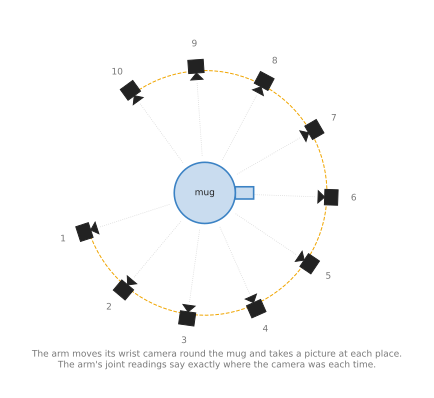
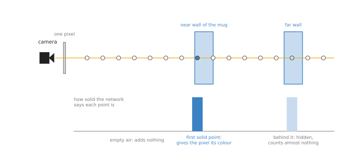
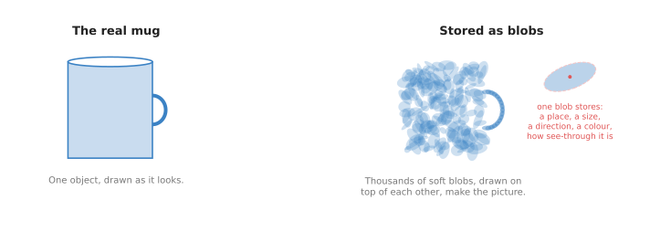

# Scene reconstruction: NeRF and Gaussian splatting

This page is about building a whole 3D scene from many ordinary photos. The two
best-known methods for it are called NeRF and Gaussian splatting. So the page answers
four questions. What do these methods build, and how do they turn flat photos into
3D? Why must they be fitted again for every new scene? And when is this worth doing
on a robot arm that already has a depth camera?

It is for a reader who has read the [chapter overview](../01_overview.md), and who
knows what a point cloud is. You should also know, from
[how a model learns](../../01_what-models-are/02_how-a-model-learns.md), that training
means adjusting a model a little at a time until its answers match the examples.

> Before this page, it helps to have read [multi-view geometry](../../../06_programming-techniques/02_geometry-and-cameras/03_also-used/01_multi-view-geometry.md), which explains how lines of sight from known camera places cross at a point. NeRF and Gaussian splatting use the same idea with many photos.

## Contents

1. [What it is](#1-what-it-is)
2. [What goes in and what comes out](#2-what-goes-in-and-what-comes-out)
3. [How it works inside](#3-how-it-works-inside)
4. [How it is trained](#4-how-it-is-trained)
5. [Well-known models](#5-well-known-models)
   · [5.1 The NeRF line: the original and Instant-NGP](#51-the-nerf-line-the-original-and-instant-ngp)
   · [5.2 3D Gaussian Splatting](#52-3d-gaussian-splatting)
   · [5.3 Nerfstudio](#53-nerfstudio)
   · [5.4 NeuS](#54-neus)
   · [5.5 VGGT and the DUSt3R family](#55-vggt-and-the-dust3r-family)
   · [5.6 How to choose](#56-how-to-choose)
6. [Where this is going](#6-where-this-is-going)
7. [Where to read next](#7-where-to-read-next)

---

## 1. What it is

The introduction named two methods, so this section says what they both build. Scene
reconstruction builds one 3D description of a scene from many photos taken from
different places, so that you can draw the scene from any point of view.

For example, think of walking round a statue with a phone and taking a photo every
few steps. Each photo on its own is flat, but together the photos hold enough to work
out the whole shape of the statue. A spot on the statue's nose shows up in many
photos, each time from a different direction, and where those directions cross is
where the nose is.

A NeRF or a Gaussian splat stores the result in a form that can draw a new photo from
any place, even a place where no photo was taken. It can also draw a depth picture
from that place, which says how far away each surface is.

---

## 2. What goes in and what comes out

Because the scene is built from photos rather than measured directly, what goes in is
two things.

- **Many photos of the same scene**, taken from different places, and tens of photos
    is common. The photos can come from an ordinary colour camera, so no depth camera
    is needed.
- **Where the camera was for each photo**, and which way it pointed. This is the
    camera's **pose**, which is three numbers for its position and three for its
    direction.



The arm carries its camera round the mug and takes ten photos. Its joint readings say
exactly where the camera was for each one.

What comes out is one stored scene, and it will give you:

- a new colour photo from any camera pose you choose,
- a depth picture from any camera pose, which turns into a point cloud in the usual way,
- a surface, if you run one more program to pull a surface out of it.

---

## 3. How it works inside

### Step 1: know where each photo was taken

Everything depends on knowing the camera pose for each photo, and there are two ways
to get it.

A robot arm has the easier of the two ways. If the camera sits on the wrist, then the
arm's joint
readings say where the wrist was, and so where the camera was, with no extra work.
Book 2 points this out in
[models that measure](../../../02_perception/02_object-perception/05_models-that-measure.md#4-reconstruction-when-you-do-not).
It also means the scene comes out at its real size, in metres.

Without an arm, a program such as COLMAP works out the poses from the photos alone.
It finds the same small spots in many photos and works back to where each camera must
have been. This takes time, and the result has no real size until you
measure something in the scene. COLMAP is not one of the models in
[section 5](#5-well-known-models), but it is the step in front of most of them, and
[section 5.3](#53-nerfstudio) recommends the toolkit that runs it for you.

### Step 2 with NeRF: a network that answers questions about any spot

**NeRF** stands for **neural radiance field**, where "radiance" means the light and
colour that comes from a spot. So a NeRF is one neural network that answers a
question about any spot in the scene.

- You give it the `x`, `y` and `z` of a spot, and the direction you are looking from.
- It gives back two things: how solid that spot is, and what colour it looks from that
  direction.

How solid a spot is comes back as a number, where zero means empty air and a large
number means the spot is inside something that blocks light. The direction matters
for the colour, because a shiny surface looks different from different sides.

To draw one pixel of a photo, NeRF then follows the line of sight from the camera
through that pixel and out into the scene.



The network is asked about each point along the line. The first solid point gives the
pixel its colour, and the points hidden behind it count for almost nothing.

The steps for one pixel are the four below.

1. Pick points along the line, from near the camera to far away.
2. Ask the network about each point, which means how solid it is and what colour it
    is.
3. Walk along the line from the camera, where points in empty air add nothing and the
    first solid point adds most of the colour. Points behind it add very little,
    because the solid point blocks the view.
4. Add all those contributions together, and the total is the colour of the pixel.

That same walk also gives the depth of the pixel, which is the distance to where the
line first becomes solid.

The original NeRF is described here because it is the clearest version of this idea,
and not because you should run it.
[Section 5.1](#51-the-nerf-line-the-original-and-instant-ngp) calls it historical and
names the models to use instead. One variation on it is worth knowing now, because the
shortlist recommends it. Instead of asking the network how solid a point is, you can
ask how far that point is from the nearest surface, and the surface is then exactly the
set of points where that distance is zero. That is NeuS, in
[section 5.4](#54-neus), and it is how this design gives back a surface you can
measure.

### Step 2 with Gaussian splatting: many soft blobs

Instead of a network, **Gaussian splatting** stores the scene as a long list of small
soft blobs, and it uses no network at all to draw. The word "Gaussian" is the name of
the smooth bell shape that each blob's edge fades with. The word "splatting" is the
name for drawing each blob flat onto the picture, one after another.



Each blob stores a place, a size, a direction, a colour and how see-through it is.
Thousands of them drawn over each other make the picture.

To draw a photo, the program sorts the blobs from near to far and paints them onto
the picture, so that near blobs cover far ones. This is much faster than asking a
network about many points along every line of sight, which means a splat can be drawn
many times a second.

Gaussian splatting is therefore not a neural network at all. It belongs in this book
because it is fitted in the same way, from the same inputs, and because robot teams
use it for the same jobs as NeRF. It is also the method the shortlist points you at
first. [Section 5.2](#52-3d-gaussian-splatting) covers the paper that everybody means
by "splatting", and [section 5.3](#53-nerfstudio) recommends the toolkit to run it
with on a real job.

### Step 3: fit it to the photos

Whichever of the two you use, both methods start with a scene that is wrong. A NeRF
starts with random numbers inside its network, while a splat starts with blobs in
rough places. Then the program repeats these steps many thousands of times.

1. Pick one of the real photos and its camera pose.
2. Draw the scene from that same pose.
3. Compare the drawing with the real photo, pixel by pixel.
4. Adjust the network, or the blobs, a little so the drawing gets closer to the photo.

When the drawings match all the photos, the scene is finished, because it must now be
right from every direction that had a photo. Since the photos came from all round,
the only way to match them all is to have the shape in the right place.

One entry in the shortlist does none of this. VGGT, in
[section 5.5](#55-vggt-and-the-dust3r-family), is trained once on many scenes
beforehand, so you hand it a few photos and it answers straight away, with no fitting
and no camera poses of your own. [Section 4](#4-how-it-is-trained) explains the
difference between the two ways of training.

---

## 4. How it is trained

The word "trained" means something different here from the other pages in this book.
Most models are trained once, on a large collection of examples, and then used on new
inputs. Instead, a NeRF or a splat is fitted to **one** scene and knows only that
scene. So if the arm moves a cup, the old fit is out of date and a new one is needed.

The data is just the photos and the poses, and nobody labels anything, because the
photos are the right answers and the drawings are the guesses.

The first NeRF took hours or days of computing on a graphics card to fit one scene,
and later methods cut that sharply. Instant-NGP and Gaussian splatting can fit a
small scene in minutes on a good graphics card.

There is also a newer kind of model that is trained once, in the ordinary way, from
many thousands of scenes. Then, given a few photos of a new scene, it gives the 3D
points straight away with no fitting at all. DUSt3R, in the next section, is one of
these.

---

## 5. Well-known models

Both methods above exist as code you can download, and this section is the shortlist.
It says what each one is best at, what it costs you, and what to type to run it, and
it answers the question the two methods raise: which of them is ready for a work cell
and which is still a research result.

Read the table as a first pass, then read the sub-section for the one or two you are
considering. The left column names the project and says how current it is. The right
column holds everything that decides between them: what the project is best at, how
big the download is, what its licence allows, and when to pick it. The download part
means different things in different rows, because a fitted scene is not a trained
model. Most of these projects ship code and no weights, so what you download is a
program that then needs a graphics card and hours of your time, while the last row
ships a trained model in the ordinary sense. Every licence below was read from the
project's own licence file.

| Model | What decides it |
| --- | --- |
| [NeRF](https://github.com/bmild/nerf) and [Instant-NGP](https://github.com/NVlabs/instant-ngp), historical | They give you a field you can ask about any point in space. The download is code only, with no weights, and the licence is MIT for NeRF and NVIDIA's research-and-evaluation-only terms for Instant-NGP. Pick them when the scene is transparent or shiny and pictures are not enough. |
| [3D Gaussian Splatting](https://github.com/graphdeco-inria/gaussian-splatting), most used in 2026 | It is best at new views of a still scene, drawn fast. The download is code only, although the authors' set of fitted scenes is a separate 14 GB download, and the Inria and Max Planck licence is research only. Pick it when you are reproducing the paper's results. |
| [Nerfstudio](https://github.com/nerfstudio-project/nerfstudio), most used in 2026 | It runs either method on your own photos. It installs with `pip install` under Apache-2.0, and fitting needs about 6 GB of graphics memory, or 12 GB for the larger setting. Pick it when this is a real job in a real work cell. |
| [NeuS](https://github.com/Totoro97/NeuS), most used in 2026 | It gives you a measured surface you can ship. The download is code only, with no weights, and the licence is MIT. Pick it when you need a surface in millimetres rather than a picture. |
| [VGGT](https://github.com/facebookresearch/vggt), worth betting on | It gives you 3D from a few photos with no fitting at all. The download is 5.0 GB, with about 1.26 billion learned numbers, and the code allows commercial use while the open checkpoint does not. Pick it when you cannot wait minutes for a fit. |

### 5.1 The NeRF line: the original and Instant-NGP

Both of these are **historical**. They are here because the original is the design
that [section 3](#step-2-with-nerf-a-network-that-answers-questions-about-any-spot)
explains, and because together they show why the field then moved on.

Size xs for the network in both, a big card, MIT for NeRF and NVIDIA's
research-and-evaluation-only terms for Instant-NGP.

Ben Mildenhall and five colleagues published NeRF at the 2020 European Conference on
Computer Vision. NVIDIA's Instant-NGP followed in the ACM Transactions on Graphics in
July 2022.

The one idea NeRF is built on is that the scene can live in the weights of one small
network, and that the picture need not be drawn at all: it can be worked out from a
rule about light. Walk along the line of sight for one pixel, ask the network how
solid and what colour each spot along it is, and add those up in the order a ray of
light would meet them. Every step of that rule is ordinary arithmetic, so the
difference between the pixel it produces and the pixel in the photograph can be traced
back through the rule to the weights, and the weights can be nudged. The scene is
never built. It is the leftover of making that rule agree with every photograph.

Inside, the consequence is that the network is tiny and has nothing picture-shaped in
it. It is a plain stack of about eight fully connected layers, a few hundred numbers
wide, and it is asked about one spot at a time; a scene of a room and a scene of a mug
use the same network with different weights in it. Two parts that
[section 3](#step-2-with-nerf-a-network-that-answers-questions-about-any-spot) left
out are what make it work in practice. The first is that the three coordinates are not
handed to the network raw. They are turned into a long list of sine and cosine values
at many different frequencies first, because a small network fed three plain numbers
can only produce something smooth, and the high frequencies in that list are what let
it hold a sharp edge. The second is that the points along the line are chosen in two
passes: a first, thin pass finds roughly where the line stops being empty air, and a
second pass spends most of its points there, because almost all of any line of sight
is nothing at all. The viewing direction also enters late, after the solidity has been
decided, so that how solid a spot is cannot change with where you happen to stand,
while its colour can.

Instant-NGP keeps all of that and changes where the scene is kept. Most of what the
network knew moves out of its weights and into tables of learned numbers that are
looked up by position, at several grid resolutions at once, and the network shrinks to
a few layers whose only job is to turn the looked-up numbers into a colour and a
solidity. Looking a number up is far cheaper than pushing a position through eight
layers, which is the whole saving. Two distant places can land on the same table slot,
which the authors call a collision, and the several resolutions together are what let
the model tell the two apart, since places that collide at one resolution do not
collide at the next. The authors also wrote the whole thing as one fused program on
the graphics card. Together that is what cut fitting from the original's hours or days
per scene, as [section 4](#4-how-it-is-trained) says, down to minutes or less.

On a robot arm the difference between the two is whether this method can be used at
all in a working cell. A fit that takes a day happens once, for a demonstration; a fit
that takes a minute can happen after the cell is reloaded. And the difference between
either of them and the splat of the next sub-section is what they leave behind. A
fitted NeRF is still a network you can ask about a spot nobody photographed, which is
what [Dex-NeRF](https://arxiv.org/abs/2110.14217), by Jeffrey Ichnowski and colleagues
at the 2021 Conference on Robot Learning, uses to find a glass object that a depth
camera cannot see.

The obvious alternative is 3D Gaussian Splatting in section 5.2, and for a new job
that is what to choose. A NeRF still wins in one case. It keeps a real radiance field,
which means a network you can ask about any point in space, and the Dex-NeRF trick
just described depends on exactly that. A splat has no network to ask, so what it
gives you is pictures and a depth picture worked out from the blobs.

What they cost you is time, and the code. The original asks for TensorFlow 1.15, so
you will use somebody's reimplementation rather than the authors' code, and it is
still the one worth reading, because at about 1,100 lines across two files it is the
only version of this idea you can read end to end in an afternoon. Instant-NGP has the
opposite problem: its code is fast, but you cannot put it in a product, and because it
is CUDA it needs an NVIDIA card. Book 2 records the same restriction for Neuralangelo,
which is the most accurate radiance-field method in
[its table](../../../02_perception/02_object-perception/05_models-that-measure.md#4-reconstruction-when-you-do-not)
and also NVIDIA's. That pattern is the thing to notice about this corner of the
field.

There is no short Python call for either of them, because fitting is the run. If you
want this design without the licence problem, nerfstudio reimplements it, so the
command is `ns-train instant-ngp` and section 5.3 covers that toolkit. Its
[Instant-NGP page](https://docs.nerf.studio/nerfology/methods/instant_ngp.html) is
honest that the reimplementation covers the main ideas rather than every detail.

### 5.2 3D Gaussian Splatting

Three-dimensional Gaussian splatting is **most used in 2026**, and when people say
"splatting" today they mean this paper.

Size not stated, because a splat has no learned network at all and what you keep is
the blobs themselves, a workstation, and the Inria and Max Planck licence, which is
research only.

Bernhard Kerbl, Georgios Kopanas, Thomas Leimkühler and George Drettakis published it
in 2023, at Inria in France and the Max Planck Institute for Informatics in Germany.
It is the soft blobs described in
[section 3](#step-2-with-gaussian-splatting-many-soft-blobs), with no network
anywhere in the drawing step.

The one idea is that a picture should be made by drawing things, rather than by asking
questions about empty space. So the queried field of section 5.1 is replaced by a long
list of small things that a graphics card already knows how to draw, and each of them
is given a soft, fading edge rather than a hard one. The soft edge is not for looks.
It is what makes the drawing step ordinary arithmetic again, so that comparing the
drawing with the photograph still tells you which way to nudge each blob, exactly as
it told a NeRF which way to nudge its weights.

Inside, that means the scene is a table of numbers you could print out. Each blob
holds where it is, how big it is in each of three directions and which way those
directions point, how see-through it is, and a handful of colour numbers that are
combined differently depending on the direction you look from, which is this method's
answer to the viewing direction that NeRF fed into its network, and the reason a splat
can still show a highlight moving across a shiny surface. Because the size has a
direction, one blob can be a flat disc lying on a table top or a thin needle along a
cable, which is how a few blobs can cover a smooth surface that would otherwise need
many round ones. Drawing is then three steps with no network in them: turn every blob
into an ellipse on the picture, sort the ellipses from near to far, and paint them in
that order, each one letting through as much of what is behind it as its opacity
allows. Nothing is ever evaluated in empty air, which is where a NeRF spends most of
its effort. And unlike a NeRF, whose scene is spread across the weights of a network
and cannot be pointed at, this scene is a list: you can delete the blobs of one object
from it, or move them, because they are the object.

The fitting has one part that a NeRF's fitting does not need, which is that the number
of blobs is not decided in advance. It starts from the sparse points COLMAP already
produced while working out the camera poses, and then, as the fit goes on, the program
adds blobs where the picture is still wrong, by splitting a blob that has grown too
large and by copying one that sits in an area with too little, and it deletes blobs
that have faded to almost transparent. The authors call this density control, and it
is why you cannot say in advance how large a finished scene will be: the size is a
result of the fit rather than a setting. That is also where the method's weaknesses
come from. A blob is placed to make the pictures come out right, so it is under no
obligation to sit on the surface of anything, and there is no network left to ask
about a spot nobody photographed.

On a robot arm the gain shows up when something wants many views in a hurry. A planner
that checks what the wrist camera would see from each of fifty candidate positions
gets fifty pictures at video rate from a splat, where the original NeRF would take
the better part of an hour. The
loss shows up in the two jobs the rest of this page is about: measuring a part to the
millimetre, which section 5.4 does instead, and seeing a glass bottle, which needs the
field that section 5.1 keeps and this method threw away.

The obvious alternative is a NeRF, and this is the comparison the whole page turns on.
The paper's own claim is the reason splatting won: 30 frames a second or more at
1080p picture size, which no NeRF method reached for whole scenes, while also matching
the best NeRF quality. Drawing a blob is rasterisation, the same operation a graphics
card does for triangles in a game, so it is not a saving of a few percent: it is a
different kind of work from asking a network about points along a line.

What it costs you is accuracy, and that is the fault people miss.
[Book 2's reconstruction table](../../../02_perception/02_object-perception/05_models-that-measure.md#4-reconstruction-when-you-do-not)
measures plain Gaussian splatting at 1.96 mm of error on a laboratory object about
25 cm across, the worst of every method in it. The licence is the other cost, and the
same table shows almost the whole family of surface-oriented variants inheriting it.

There is no Python call, because fitting is the run, and these are the repository's
own commands.

```bash
# Work out where each photo was taken, with COLMAP, and undistort the photos.
# Your photos go in <scene>/input/ first.
python convert.py -s <scene>

# Fit the blobs to the photos. This is the long step.
python train.py -s <scene>

# Draw the scene again from every photo's pose, into images on disk.
python render.py -m <path to the trained model>
```

The repository gives you the fitting, the fast drawing and a viewer. You supply the
photos and the 24 GB graphics card. You also supply the real size, because COLMAP
recovers the camera poses only up to an unknown scale, and
[section 4.2 of Book 2's page](../../../02_perception/02_object-perception/05_models-that-measure.md#42-and-none-of-it-has-a-scale)
explains the fix: give the fitting your arm's own camera poses, which are already in
metres. For a real job, use section 5.3 rather than these commands, because the
licence there is one you can keep.

### 5.3 Nerfstudio

Nerfstudio is **most used in 2026** for actual work, and it is the answer to "which of
these is practical in a work cell".

Size not stated, because this is a toolkit and not a model, a small card for
splatfacto and a big card for splatfacto-big, Apache-2.0.

It is an open-source toolkit that fits both NeRFs and splats behind one set of
commands. Its splatting model is called splatfacto and its NeRF model is called
nerfacto, and the drawing is done by
[gsplat](https://github.com/nerfstudio-project/gsplat), a separate Apache-2.0 library
that reimplements the splatting rasteriser.

The one idea is that the methods above differ in fewer places than they appear to.
Reading a folder of photos, working out what each pixel can see, comparing the drawing
with the photograph and writing the result out are the same jobs whether the scene is
a network or a pile of blobs. Only the middle part differs. So nerfstudio is written as
a set of interchangeable parts with one pipeline running through them, and a method is
not a program here: it is a name for one arrangement of those parts.

Inside, that is why the two names exist. A data parser turns your folder, or COLMAP's
output, into photos with a pose each. A data manager decides which pixels are
compared on each step of the fit. A model holds whatever the scene is kept in, and for
splatfacto the
drawing inside that model is gsplat's. An exporter turns the finished scene into a
point cloud or a mesh. Because arrangements are cheap and programs are not, each name
is a mixture rather than one paper: nerfacto's own documentation lists its parts as a
hash encoding, proposal sampling, scene contraction, camera pose refinement and
per-image appearance conditioning, which come from several different papers, and
splatfacto's documentation says in as many words that it "will be a blend of different
gaussian splatting methodologies" and will drift away from the original as features
are added. That is the real difference from section 5.2, where the program is one
paper and the paper is the program.

What the arrangement buys is that two of the hardest things on this page become easy.
Trying a NeRF and a splat on the same photographs is one word on the command line,
rather than two installs with different licences. And the awkward step in front, which
is working out where each photo was taken, is run for you. What it costs is that you
are no longer running what was measured. A published figure belongs to the paper, and
you are running an arrangement that has drifted from it, so a number from the paper is
a hope rather than a specification. You also gain a layer between you and whatever
breaks, and the common break is in the part nerfstudio did not write.

On a robot arm the difference from the code in section 5.2 shows up in two places. The
first is the day the cell belongs to a customer, because that code does the same job
and cannot be shipped, so the choice is not between two qualities of reconstruction
but between having one and having none. The second is the arm's own advantage: because
the data parser takes poses as its input, you can hand it the poses from the joint
readings and skip COLMAP altogether, and COLMAP is both the step that fails most often
and the step that loses the real size.

The obvious alternative is the original code in section 5.2. Nerfstudio wins for one
reason that outranks every technical argument: its licence permits commercial use and
the Inria licence does not, so this is the version you can put in a product. Two
practical reasons follow. Switching between a NeRF and a splat becomes one word on the
command line, and the toolkit does the whole preparation step, including running
COLMAP for you.

What it costs you, apart from splatfacto not being the paper, is the step in front of
it. The most common failure is upstream of nerfstudio entirely: COLMAP fails on blurry
photos or photos that barely overlap, and then nothing after it works.

The toolkit is driven from the command line, and these are its
[documented commands](https://docs.nerf.studio/quickstart/first_nerf.html).

```bash
# Recover the camera poses from the photos, and write a dataset nerfstudio reads.
ns-process-data images --data photos/ --output-dir processed/

# Fit a splat. Use `ns-train nerfacto` here instead to fit a NeRF.
ns-train splatfacto --data processed/

# Write the result out as a point cloud that Open3D and PCL can read.
ns-export pointcloud --load-config outputs/processed/splatfacto/<run>/config.yml \
    --output-dir exports/pcd/
```

The toolkit gives you the pose recovery, the fitting, a viewer in the browser and the
export. You supply the photos, which means a program of your own that moves the arm to
tens of viewpoints and saves a picture at each one, and you supply everything after
the export, where the result is an ordinary point cloud and the
[point cloud models page](01_point-cloud-models.md) applies. One detail decides
whether the numbers mean anything: a splat fitted from COLMAP poses is in the scene's
own units, so feed nerfstudio the poses from your arm's joint readings, or measure one
known distance in the export and scale by what you find.

### 5.4 NeuS

NeuS is **most used in 2026** for the one job that splats are bad at, which is giving
back a surface you can measure and then ship.

Size xs for the network, a big card, MIT for the code, and there are no weights to
license because every scene is fitted from scratch.

Peng Wang and colleagues published it in 2021.

The one idea is to change the question the network is asked. A NeRF is asked how solid
a spot is, which is a useful thing to know for drawing a picture and a poor thing to
know for finding a surface, because a middling solidity is neither inside nor outside
anything in particular. NeuS asks instead how far the spot is from the nearest
surface, with a minus sign when the spot is inside the object. The surface is then
not something you look for: it is exactly the set of spots where that number is zero.

Inside, the walk along the line of sight is the same walk as in section 5.1, and one
step in the middle of it is different. A NeRF's network produces the solidity that the
walk needs directly. NeuS's network produces a distance, and a fixed formula turns
that distance into the solidity the walk needs, so the network never sees how its
answers will be drawn. That formula is the paper's real contribution, and it is more
delicate than it sounds. The obvious way of converting a distance into a solidity puts
the heaviest weight of the walk slightly off the true surface, a bias which leaves the
reconstructed surface bent away from the object, and the paper gives a conversion that
has no such bias to the first order of approximation. Having a distance rather than a
solidity also changes how the surface comes out at the end. From a solidity field you
have to choose a cut-off, and the surface moves when you choose a different one. From
a distance field you walk a grid and look for where the sign flips, and there is
nothing to choose.

What the idea buys is a surface with no arbitrary decisions in it, which is what makes
a measurement possible at all, and one awkward requirement disappears with it: the
earlier surface-fitting methods the paper compares against, named DVR and IDR, needed
a mask drawn round the object in every photograph to keep their fit from collapsing,
and NeuS, the paper shows, does not. What
it costs is the field's usual price for a network you query: NeuS is a NeRF underneath
with none of Instant-NGP's lookup tables, so it is back to the hours that
[section 4](#4-how-it-is-trained) describes. A signed distance also assumes there is an
inside and an outside, and the paper's results are on single objects photographed from
all round, so a scene the camera can only see one face of is a harder case than the
one the method was measured on.

On a robot arm the difference shows up when the arm has to act on a number rather than
on a picture. Closing a two-finger gripper on the two parallel faces of a bracket
means knowing where those faces are to tighter than the clearance the gripper has, and
a splat's surface is out by more than that, as the comparison below shows. The difference also
runs the other way, and it is worth saying: if nobody is going to measure the result,
NeuS has cost you hours of fitting for an accuracy nothing in the cell uses.

The obvious alternative is Gaussian splatting, and the reason to leave it is that a
blob centre is placed to make pictures look right, so it is not a point on the object,
while NeuS has a surface by construction and writes it out as a mesh. Book 2's table
measures NeuS at 0.84 mm against 1.96 mm for plain Gaussian splatting on the same
laboratory objects, and NeuS is MIT licensed while that whole splatting family is not.
Accuracy together with a licence you can keep is an unusual combination in this field,
and it is why this sub-section exists.

What it costs you besides the fitting time is the preparation. The camera poses have
to be supplied in a specific file format, and the quality improves if you also supply
a mask marking the object in each photo. The repository was written for PyTorch 1.8,
so expect to pin old versions or to port it.

NeuS is run from the command line, and these are the repository's own commands.

```bash
# Fit the scene. womask.conf is the setting for photos with no object masks.
python exp_runner.py --mode train --conf ./confs/womask.conf --case <case_name>

# Pull the surface out of the fitted network, as a mesh file.
python exp_runner.py --mode validate_mesh --conf ./confs/womask.conf \
    --case <case_name> --is_continue
```

The repository gives you the fitting and the step that turns the fitted network into a
mesh in `exp/<case_name>/<exp_name>/meshes/`. You supply the photos, the camera poses
in the file format its README describes, and the masks if you want the better result.
You also supply the scale, for the same reason as every other row here.

### 5.5 VGGT and the DUSt3R family

VGGT is **worth betting on**, because it removes the step that makes everything above
awkward for a robot: there is no fitting.

Size l, a big card, and a licence in two halves: the code permits commercial use apart
from military use, while the open checkpoint does not, and the commercial checkpoint is
handed out through an application form.

The Visual Geometry Group at the University of Oxford and Meta published it at CVPR
2025, where it won the best paper award. It follows DUSt3R and MASt3R, from Naver,
which did the same thing for two photos at a time; VGGT takes one photo, a few, or
hundreds, and returns the camera poses, a depth picture per photo and 3D points, all
at once.

The one idea is to treat 3D as something a network can be taught to produce, in the
same ordinary way that a network is taught to name an object in a photograph, rather
than as something you solve again for each new scene. Everything else on this page
learns one scene from your photographs. VGGT learned, once and in advance, what scenes
look like, from many thousands of them whose 3D was already known, and your
photographs are then only its input.

Inside, there is no geometry program anywhere. Each photo is cut into small squares
and each square becomes a short list of numbers, called a token, by an existing image
model. Then the tokens pass through twenty-four pairs of attention layers which take
turns at two jobs: in one, a photo's tokens may look only at the tokens of their own
photo, and in the other, every token may look at every token of every photo at once.
That alternation is where the matching happens. The square covering the mug's handle
in the third photo finds the square covering the same handle in the twentieth photo
because the second kind of layer lets it look there, and the weights that decide what
is worth looking at were learned rather than written. A few extra tokens are attached
to each photo to carry the per-photo answers out, one for the camera and four spare
ones, and small heads at the end read the tokens: a handful of attention layers and
one plain layer produce the camera numbers, while another head folds the tokens back
into picture shape and produces the depth picture, the 3D points and the features used
for tracking. Nothing in that description repeats, and nothing in it is a camera pose
you supplied.

What the idea buys is that two whole steps of
[section 3](#3-how-it-works-inside) disappear: there is no pose recovery in front and
no fitting loop behind. What it costs comes from the same place. The layers that let
every token see every other token grow expensive as photos are added, because the
number of pairs of tokens grows faster than the number of photos, so the practical
limit is memory rather than patience. And a single pass answers out of what the model
learned about scenes in general, while a fit answers out of your photographs in
particular, which is why a reconstruction fitted for minutes is still the more
accurate of the two.

On a robot arm the difference shows up whenever looking and acting are the same
movement. An arm that takes three pictures while travelling to the bin and must grasp
when it arrives has under a second, not minutes, so every other method on this page is
simply unavailable and the question is only whether VGGT's answer is good enough.
Against DUSt3R the difference is narrower but still practical: DUSt3R reads two photos
at a time and a separate program afterwards has to line all the pairs up with each
other, so thirty wrist photographs become hundreds of pairs and a stitching step that
can fail, while VGGT reads the thirty in one pass.

The obvious alternative is everything above, and the comparison is not about quality.
It is that fitting a scene costs minutes while this answers, in the paper's own words,
in under a second, and that it needs no camera poses as input, because it works them
out itself. For an arm that must look and then act, that difference decides whether
the method can be used at all. Against DUSt3R and MASt3R specifically, pick VGGT
because it takes many photos in one pass rather than pairs that then have to be
stitched together, and because its licence is better, as the next paragraph
explains.

What it costs you is the licence, read carefully, and this is exactly the trap this
book exists to point out. The code licence has permitted commercial use since July
2025, and the two checkpoints are the trap: the open `VGGT-1B` one is
non-commercial, and `VGGT-1B-Commercial`, which you may use commercially, has to be
asked for. DUSt3R and MASt3R are simpler and stricter, because both are Creative
Commons Attribution-NonCommercial-ShareAlike 4.0, so neither is shippable in any form.

The package downloads the checkpoint from Hugging Face.

```python
import torch
from vggt.models.vggt import VGGT
from vggt.utils.load_fn import load_and_preprocess_images

model = VGGT.from_pretrained("facebook/VGGT-1B").cuda()   # 5.0 GB on first run

images = load_and_preprocess_images(["view0.png", "view1.png", "view2.png"]).cuda()

with torch.no_grad():
    # bfloat16 halves the memory on recent cards and costs little accuracy.
    with torch.cuda.amp.autocast(dtype=torch.bfloat16):
        out = model(images)   # camera poses, depth per photo and 3D point maps
```

The model gives you the poses, the depth and the points, so it replaces both
[step 1](#step-1-know-where-each-photo-was-taken) and the fitting of
[step 3](#step-3-fit-it-to-the-photos). You supply the photos and the scale, which is
unknown here as everywhere else on this page. One route is worth knowing: the
repository ships a script that writes VGGT's answer in COLMAP's format, which
nerfstudio and gsplat read directly, so you can use VGGT to skip COLMAP and still fit
a splat afterwards.

### 5.6 How to choose

For a real job, fit a splat with nerfstudio. Its licence lets you ship, it runs both
methods, and it does the pose recovery for you.

Four things change that choice.

- **You need a measurement rather than a picture.** Use NeuS, and expect hours
  instead of minutes. A splat is accurate enough to look at and not accurate enough
  to grasp from, which is the 0.84 mm against 1.96 mm in Book 2's table.
- **The arm cannot wait.** Use VGGT, which answers in under a second instead of
  fitting for minutes, and check the checkpoint licence before it reaches a product.
- **You are reproducing a published result.** Use the original code of whichever
  paper it is, and accept its licence, because a reimplementation drifts away from
  the paper it started from, which is what nerfstudio's documentation says about
  splatfacto.
- **You want a splat with a clean licence and no CUDA.**
  [Brush](https://github.com/ArthurBrussee/brush) is an Apache-2.0 splat trainer that
  runs on other makes of graphics card, and Book 2 lists it among the few shippable
  options in this family.

One point about all of them, because it is the mistake that wastes the most time.
None of these methods knows the real size of anything, since photographs measure
directions and not distances. On an arm you already have the answer, because the
joint readings say where the camera was in metres for each photo, so feed those poses
in rather than letting COLMAP guess them. Nothing you build on top of a reconstruction
is worth anything until that is done.

---

## 6. Where this is going

The sections above describe what you would run today. This one is about the
direction, and it uses the
[four kinds of claim](../../../03_frameworks/08_frontier/06_what-is-coming.md#1-four-kinds-of-claim-and-why-the-difference-decides-everything)
from Book 3's frontier chapter. A demonstration is a recording of something working
once, under conditions its publisher chose. A product announcement says a thing can be
downloaded or bought today, which you can check yourself, so it is the strongest kind
here. A research result is a measured number on a stated task. A projection is a
statement about a date that has not arrived, and it is the weakest. Where a sentence
below is my own expectation rather than somebody's published claim, it says so.

This is the fastest-moving corner of the chapter, and the change has one shape rather
than a sequence. NeRF showed that a fitted field could hold a scene, and it was far
too slow to use. Instant-NGP made the same idea minutes instead of days. Then Gaussian
splatting threw out the network and left a pile of blobs that a graphics card draws
directly, and because drawing blobs is an old, well-understood job, the method went
from a paper to shipping software unusually quickly. The live question is no longer
how to represent a scene but what the representation is good for.

You can buy or download reconstruction today in two quite different markets, and the
first is consumer and professional capture. Niantic Spatial's
[Scaniverse](https://scaniverse.com/) is a free phone application that scans a space
and fits a splat on the phone itself. Niantic also publishes the splat transport
format [SPZ](https://github.com/nianticlabs/spz) under the MIT licence, which its
README says is "typically around 10x smaller than the corresponding .ply files".
[Polycam](https://poly.cam/gaussian-splatting) sells splat reconstruction from a
phone, a drone or a browser upload, taking "between 20 and 200 images", and it offers
a downloadable mesh for any splat, which is a detail worth remembering for later in
this section. Jawset's
[Postshot](https://www.jawset.com/) is a Windows desktop fitter for an NVIDIA card,
and PlayCanvas publishes [SuperSplat](https://github.com/playcanvas/supersplat), an
open-source browser editor, with a
[compressed .sog format](https://developer.playcanvas.com/user-manual/gaussian-splatting/formats/)
for web delivery. Those are all product announcements, checkable this afternoon with a
phone and a browser.

The second market is the one that matters for an arm, and it is simulation rather
than perception. On 11 August 2025 NVIDIA
[announced Omniverse NuRec](https://nvidianews.nvidia.com/news/nvidia-opens-portals-to-world-of-robotics-with-new-omniverse-libraries-cosmos-physical-ai-models-and-ai-computing-infrastructure),
a set of Gaussian splatting libraries that, in the
[product page's words](https://developer.nvidia.com/omniverse/nurec), "ingest real
sensor data to reconstruct and render interactive simulation in OpenUSD". That release
says NuRec rendering is integrated in the open driving simulator
[CARLA](https://carla.org/), that [Foretellix](https://www.foretellix.com/) is
integrating NuRec into its synthetic data generation, and that
[Voxel51](https://voxel51.com/)'s FiftyOne data engine supports NuRec, naming Ford
and Porsche as FiftyOne customers. Two pieces of it are downloadable rather than
announced: the renderer [3DGRUT](https://github.com/nv-tlabs/3dgrut) is Apache-2.0,
and it builds on [gsplat](https://github.com/nerfstudio-project/gsplat), the
Apache-2.0 renderer from the same project as nerfstudio in
[section 5.3](#53-nerfstudio).

What NVIDIA ships alongside that is the most useful single artefact here. The
[PhysicalAI-Robotics-NuRec](https://huggingface.co/datasets/nvidia/PhysicalAI-Robotics-NuRec)
dataset on the Hugging Face Hub is nine reconstructed environments, 77 gigabytes,
under a Creative Commons Attribution 4.0 licence, three of them captured by a Nova
Carter robot and the rest by hand-held cameras. Its own description says that "the
Mesh components are used for collision detection while the 3DGUT components provide
realistic rendering". That is a company with every reason to sell you one
representation telling you that it ships two. NVIDIA's own tutorial on
[reconstructing a scene from a smartphone](https://developer.nvidia.com/blog/reconstruct-a-scene-in-nvidia-isaac-sim-using-only-a-smartphone/),
published on 23 October 2025, says the same thing from the other side: your
reconstructed scene "is simply visual geometry ... with no inherent collision
properties", and you add a ground plane and a proxy mesh yourself.

The research has four clear fronts. The first is removing the fit, which
[section 5.5](#55-vggt-and-the-dust3r-family) already describes for VGGT, and the work
since has pushed on two of that method's weaknesses: its answer has no real scale, and
what it returns is points rather than a scene a renderer can draw.
[MapAnything](https://arxiv.org/abs/2509.13414), from Meta and Carnegie Mellon in
September 2025, produces metric geometry rather than geometry up to an unknown scale,
covers more than twelve reconstruction tasks in one model, and has an Apache-2.0
checkpoint at
[facebook/map-anything-apache](https://huggingface.co/facebook/map-anything-apache),
which makes it a research result and a product announcement at once. The metric part
is what an arm cares about, for the reason [section 5.6](#56-how-to-choose) gives. In
July 2026 NVIDIA published [Instant NuRec](https://arxiv.org/abs/2607.14203), which
makes a splat scene in a single forward pass in about 1.5 seconds and reports 2.01
decibels of peak signal-to-noise ratio above the strongest baseline it evaluated on
the Waymo Open Dataset. That is a research result, measured on driving footage rather
than in a work cell, and the paper does not state a code release.

The second front is turning a splat into a surface, which is the unsolved problem
below. The published attempts change what the blobs are allowed to be:
[2D Gaussian Splatting](https://github.com/hbb1/2d-gaussian-splatting) flattens each
blob onto a surface patch, and [PGSR](https://github.com/zju3dv/PGSR) adds terms that
reward geometric agreement between views. Book 2's table of
[methods that measure](../../../02_perception/02_object-perception/05_models-that-measure.md)
records what they buy and what they cost: those variants reach 0.47 to 0.80 mm of
error against plain splatting's 1.96 mm on the DTU benchmark, and all of them are
non-commercial.

The third front is reconstruction as a way to train a policy rather than a way to see.
[SplatSim](https://arxiv.org/abs/2409.10161), from Carnegie Mellon, replaces a
simulator's meshes with splats, trains an image-based manipulation policy inside that,
and reports 86.25 per cent average success on the real robot with no real training
data, against 97.5 per cent for the same policy trained on real data. Book 3's
frontier chapter collects the
[rest of this family](../../../03_frameworks/08_frontier/04_simulation-and-evaluation.md#53-real-to-sim-rebuilding-the-room-instead-of-modelling-it)
and notes that release practice in that corner is poor. These are research results;
the shipped version of the same idea is the NuRec dataset above.

The fourth front is reconstructing while the robot moves.
[MonoGS](https://github.com/muskie82/MonoGS) and
[SplaTAM](https://github.com/spla-tam/SplaTAM) fit a splat and track the camera at the
same time, which is simultaneous localisation and mapping with blobs instead of a grid
of cubes. Beside it sits the plumbing that decides whether any of this is usable: the
compressed formats above, and the move to a standard container. 3DGRUT's own
documentation says Isaac Sim 6.0 reads both the standard OpenUSD `ParticleField`
schema and NVIDIA's own NuRec file type, and that the private one is being phased out
in favour of the standard one.

The unsolved problems start with one that no amount of engineering will remove,
because it is a mismatch of objectives. Every method on this page is trained by
comparing its rendered pictures against your photographs, so it is rewarded for
pictures that look right. A gripper needs a surface in the right place, which is a
different thing. The blob centres are not points on the object; they are wherever the
fit put them to make the picture come out, which is why plain splatting measures 1.96
mm on a 25 cm laboratory object in Book 2's table while NeuS, which fits a surface,
measures 0.84 mm. The metric the field reports makes this worse rather than better.
Peak signal-to-noise ratio, the number Instant NuRec improves by 2.01 decibels, is a
measure of pictures. Nobody has published a benchmark that measures whether a grasp
computed from a reconstruction succeeds, so the quantity you care about is not the
quantity anybody competes on.

The second unsolved problem is physics, and it is the same gap seen from further back.
A reconstruction has no mass, no friction and no articulation, and Book 3's frontier
chapter states plainly that
[nothing published in 2026 claims to have closed the contact gap](../../../03_frameworks/08_frontier/04_simulation-and-evaluation.md#54-what-still-does-not-transfer).
A drawer in a splat does not open unless somebody says it is a drawer. That is why
NVIDIA's dataset ships a mesh beside the splat and why its tutorial tells you to add a
collision plane: the practical answer today is to keep two descriptions of the same
room and use each for what it is good at.

The third is licensing, which has resisted years of work because it is inherited
rather than chosen. The original splatting code and almost every accurate surface
variant carry Inria's research-only terms, so the most accurate methods in Book 2's
table are the ones you may not ship. The permissive exceptions are nerfstudio, gsplat,
[Brush](https://github.com/ArthurBrussee/brush), 3DGRUT and
[fVDB Reality Capture](https://github.com/openvdb/fvdb-reality-capture), an Apache-2.0
toolbox that began at NVIDIA, is now developed under OpenVDB, and extracts meshes and
point clouds from the field it fits.

The rest of this section is what I expect over the next two to three years, with the
reason in each case. None of it is an announcement by anybody.

I expect feed-forward reconstruction to become the normal choice for anything that
happens while a robot is working, and per-scene fitting to survive for assets built
once and reused. The reason is a gap in time of about two orders of magnitude, now
measured rather than claimed: under a second for VGGT and about 1.5 seconds for
Instant NuRec, against minutes for a good splat fit. An arm that photographs a bin on
the way to it has no minutes, so the only question left is whether the fast answer is
accurate enough, and MapAnything's metric output removes the other objection.

I expect every shipped reconstruction to carry two representations, one for appearance
and one for contact, rather than one representation that tries to be both. The reason
is that this has already happened in a product: NVIDIA ships mesh collision geometry
beside the splat, Polycam offers a mesh download beside the splat, and fVDB Reality
Capture extracts meshes from the field. The alternative would require the appearance
objective to start rewarding correct surfaces, and nothing in how these methods are
trained makes that happen.

I expect the main robotics use of reconstruction to be building training and
evaluation environments rather than perceiving at run time, and this is my expectation
rather than anybody's roadmap. Two reasons point the same way. The simulation route
already has shipped tooling and a measured transfer number, in NuRec and SplatSim,
while run-time reconstruction on an arm has neither. And at run time the arm usually
has a depth camera, which answers where the surface is directly, in millimetres, in
one frame.

I expect splats to become a boring interchange asset, in the way triangle meshes and
point clouds already are. The reason is two things that have already happened rather
than any prediction: the representation landed in a standard schema, which Isaac Sim
reads in preference to NVIDIA's own, and it acquired compressed
transport formats in SPZ and .sog, with viewers in browsers and game engines. A
representation with a standard container and a wire format has stopped being a
research project.

I expect the licence, rather than the accuracy, to keep deciding which of these
methods reach products. The reason is visible in what already happened: NVIDIA built
a commercial simulation feature on Apache-2.0 renderers rather than on code that
scores better on surfaces. So I expect the permissive projects to keep absorbing the
research ideas a year or two late, and that to be the version most readers of this
page actually run.

What I do not expect, in this window, is a reconstruction replacing a depth camera for
grasping. The objective mismatch above is unaddressed, no published benchmark connects
reconstruction quality to grasp success, and the cheap sensor keeps getting better. I
would change that expectation the day somebody publishes grasp success rates measured
against reconstruction error.

---

## 7. Where to read next

- [3D feature maps](../03_also-used/02_3d-feature-maps.md) is the next page, and it
    adds meaning to a reconstructed scene so that the arm can find things in it by
    name.
- [Depth from pictures](../../03_seeing-models/03_also-used/02_depth-from-pictures.md)
    guesses depth from one or two photos with no fitting, so it is faster and less
    accurate.
- [Models that measure](../../../02_perception/02_object-perception/05_models-that-measure.md)
    in Book 2 compares the accuracy and licences of many reconstruction methods.
- [Simulation and evaluation, section 5.3](../../../03_frameworks/08_frontier/04_simulation-and-evaluation.md#53-real-to-sim-rebuilding-the-room-instead-of-modelling-it)
    in Book 3 uses Gaussian splats to rebuild a real room inside a simulator.
