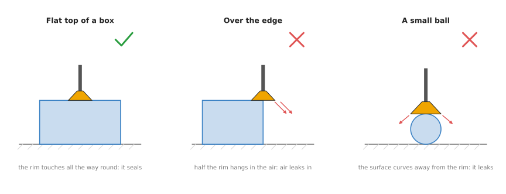
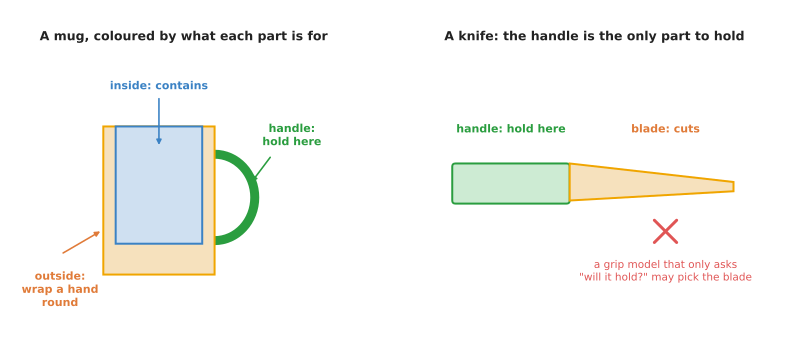
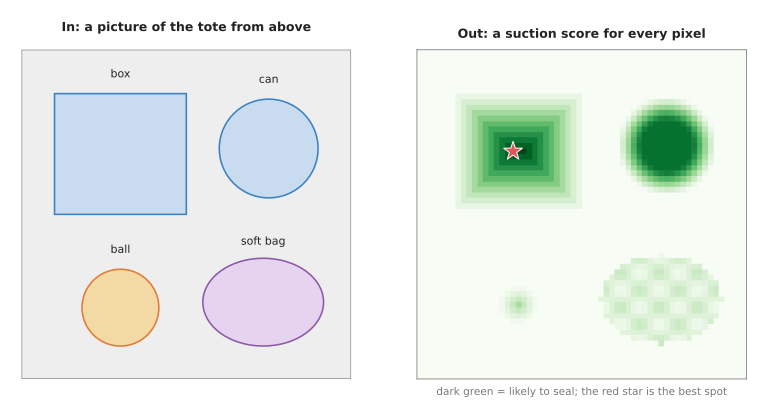

# Suction and affordance

This page is about grasp models that paint a score onto every part of a picture.
There are two kinds of them, and they share one design. A **suction model** paints
where a suction cup would seal. An **affordance model** instead paints what each
part of an object is for, such as "hold here" or "this part cuts".

So the page answers these questions, one section at a time. What is a suction
grasp, and why is it easier to predict than a finger grasp? What is an affordance,
and what do these models take in and give back? How do they work inside, and how
are they trained? Which real models do this, and when are they the right choice?

It is for a reader who has read the [grasp models overview](../01_overview.md) and
[top-down grasp detection](../03_also-used/01_top-down-grasp-detection.md), because
the per-pixel maps on that page are the same idea used here. It also helps to have
read [segmentation](../../03_seeing-models/02_most-used/02_segmentation.md), since
an affordance model is a kind of segmentation model.

## Contents

1. [What it is](#1-what-it-is)
2. [What goes in and what comes out](#2-what-goes-in-and-what-comes-out)
3. [How it works inside](#3-how-it-works-inside)
4. [How it is trained](#4-how-it-is-trained)
5. [Well-known models](#5-well-known-models)
6. [A worked example: a tote and a kitchen drawer](#6-a-worked-example-a-tote-and-a-kitchen-drawer)
7. [What goes wrong](#7-what-goes-wrong)
8. [Why this kind, and what it costs](#8-why-this-kind-and-what-it-costs)
9. [The written alternative](#9-the-written-alternative)
10. [Where to read next](#10-where-to-read-next)

---

## 1. What it is

The two kinds named in the introduction have more in common than their names
suggest. Both of them paint a map over the picture that says, for each pixel, how
well a certain action would work there.

### Suction

A **suction gripper** holds an object with a soft rubber cup, and a pump sucks the
air out from under that cup. The air outside then pushes the object against the cup
and holds it there, which is the same thing that happens when a suction hook sticks
to a bathroom tile.

The cup only holds if its rim touches the surface all the way round, and that
contact is called a **seal**. So if any part of the rim hangs in the air, air leaks
in and the object drops.



On the flat top of a box, the rim touches all the way round and the cup seals. Over
the edge, or on a small ball, part of the rim does not touch, so air leaks in.

That makes a suction grasp a simpler question than a finger grasp. This is because
there is only one contact instead of two, and the cup always pushes straight into
the surface. The only question left is whether a cup touching a given spot would seal
and would hold the weight. So a suction model answers that for every pixel.

### Affordance

An **affordance** is what a part of an object lets you do with it. For example, a
mug's handle affords holding, the inside of the mug affords containing liquid, and
a knife's blade affords cutting. The word comes from the study of how people and
animals see the world, and robotics borrowed it.

An affordance model paints each pixel of an object with the job that part is for.
That means a robot can then hold a knife by the handle, or hand a mug to a person
with the handle towards them.



The mug's handle is for holding, its inside is for containing and its outside is
for wrapping a hand round. The knife's handle is the only safe part to hold, so a
grasp model that only asks whether a grip will hold might choose the blade
instead.

---

## 2. What goes in and what comes out

Because the two kinds answer different questions, their inputs and outputs differ
as well. For a **suction model**:

- The input is a colour picture, a depth picture, or both, taken from above.
- The output is a **suction map**, which holds one score between 0 and 1 for every
    pixel. A high score means a cup placed there, pressing straight into the
    surface, is likely to seal and hold.
- Code then picks the pixel with the best score, and it works out from the depth
    picture which direction the surface faces at that pixel. The cup comes in along
    that direction.



On the left is a tote with a box, a can, a ball and a soft bag. On the right is the
suction score for every pixel. The flat middle of the box and the can's lid score
high, while the edges, the ball and the lumpy bag score low. The red star marks the
best spot of all.

For an **affordance model**:

- The input is a colour picture, sometimes with depth.
- The output is a **label map**, which gives for every pixel the name of the job
    that part of the object is for, such as "grasp", "cut" or "contain". Some
    models also draw a box around each object first, and paint the labels inside
    the box.
- Code then keeps only the grasps that land on a part labelled "grasp", and those
    grasps can come from any grasp model in this chapter.

---

## 3. How it works inside

Although the two kinds paint different maps, both use the same shape of network,
which is the same shape used for
[segmentation](../../03_seeing-models/02_most-used/02_segmentation.md).

1. **An encoder shrinks the picture.** A convolutional neural network (CNN) reads
    the picture and turns it into a smaller grid of numbers, where each number
    describes a patch of the picture such as "flat surface" or "curved edge".
2. **A decoder grows it back.** A second part of the network turns the small grid
    back into a picture the same size as the input.
3. **Each pixel gets an answer.** For a suction model each pixel gets one score,
    while for an affordance model each pixel gets one score per job and the job
    with the highest score wins.

A network whose output is a picture the same size as its input is called a **fully
convolutional network**. The
[encoders and decoders](../../01_what-models-are/03_inside-a-neural-network.md#7-encoders-and-decoders)
section of the inside a neural network page explains its two halves.

Systems that paint a finger-grasp map next to the suction map need one extra step
for angles. This is because a finger grasp needs an angle while a suction cup does
not. So they turn the input picture by several angles, run the network on each
turned copy, and keep the best answer. That means a network which only learned one
jaw direction can find grasps at any angle.

Suction models often split the score into two parts rather than one. A **seal
score** says whether the cup will seal on the surface. A **wrench score** then says
whether that seal is strong enough to hold the object's weight, given where the cup
sits compared with the object's centre of mass. A cup at the very edge of a heavy box may seal and still
tear off, because the box's weight twists it.

---

## 4. How it is trained

### Suction models

Those networks cannot paint anything until they are shown examples, and suction
labels come from the same three sources as other grasp labels.

- People can mark pictures by hand, so a person colours the pixels where a cup
    would seal. This is quick to start with, but a person cannot label millions of
    pictures.
- A computer can use physics on 3D models, so it places a virtual cup on a 3D model
    of an object and checks whether the rim touches all the way round and whether
    the seal can hold the object's weight. It then draws a depth picture of the
    scene, which means millions of labelled examples can be made with no robot.
- A real robot can try, so it places the cup, turns the pump on and lifts, and a
    pressure sensor in the tube says whether the cup sealed. This gives true
    labels, but each one takes several seconds of robot time.

### Affordance models

Affordance labels mostly come from people instead, because a person has to colour
each part of an object in a picture with the name of its job. This is slow, so
affordance datasets are small. The **UMD part affordance dataset** from the
University of Maryland is a well-known example. It labels kitchen, garden and
workshop tools with seven jobs, which are grasp, cut, scoop, contain, pound,
support and wrap-grasp.

Because hand labels are slow, newer work learns affordances in other ways. One way
is to watch videos of people using objects, since the spot where a person's hand
touches a drawer is probably the handle. Another way is to let a robot poke and
pull objects in a simulator and record which spots made something move.

---

## 5. Well-known models

Sections 1 to 4 explained the two kinds of model. This section names the ones you
can download, says what cup or gripper each one assumes, and shows the shortest
real code for each. Fewer models exist here than for finger grasps, and for both
kinds the best answer often involves no model at all, so read
[section 5.7](#57-how-to-choose) before you start installing anything.

Every licence below was read from the project's own licence file, and Book 3's
[suction models](../../../03_frameworks/02_gripping/04_models-that-grasp.md#6-suction-models)
section covers the suction half in more detail. Read the table as one row per
model, in the order the sub-sections cover them. The "how big it is" column gives
the download size of the weights, where the file is published somewhere its size
can be read, because none of these projects publishes a parameter count.

| Model | How current | Best at | How big it is | Licence of the code | Pick it when |
| --- | --- | --- | --- | --- | --- |
| Dex-Net 3.0 and 4.0 | historical | a packaged suction policy you can call in five lines | not stated | University of California: education, research and not-for-profit only | you want a working suction policy today and can run it under an old Python |
| SuctionNet-1Billion | most used in 2026 | a current suction model, and the benchmark others report on | not stated | no licence file at all | you are measuring a suction model against published numbers |
| GraspGen's suction model | worth betting on | a suction cup whose radius you know | weights 907 megabytes plus 166 megabytes | NVIDIA License: non-commercial | your cup is not 30 millimetres and you can rescale for it |
| AffordanceNet | historical | finding objects and painting their parts in one pass | not stated; 150 milliseconds per picture | only the licences of the code it was built from | you are reading the paper, not shipping the model |
| Where2Act | historical | where to push or pull a door, a drawer or a lid | not stated | no licence file at all | your objects have moving parts and you work in simulation |
| CLIPSeg, used for parts | most used in 2026 | asking for "the handle" in words, with no training | weights 603 megabytes; output 352 by 352 pixels | Apache-2.0, on the model card and on `transformers` | you need part labels now, for objects nobody listed |

One warning before the sub-sections. A suction model's score answers the question
"would the cup I was trained on seal here", and that cup is fixed in the weights. A
model trained on a 30 millimetre cup scores a flat patch 25 millimetres wide as
good, because that cup fits there, while a 50 millimetre cup does not. Each
sub-section below therefore names the cup its model assumes.

### 5.1 The Dex-Net suction models, 3.0 and 4.0

**Both are historical**, because they were published in 2018 and 2019 and the
library that runs them has not followed the rest of Python. They come from Ken
Goldberg's laboratory at the University of California, Berkeley.
[Dex-Net 3.0](https://arxiv.org/abs/1709.06670) learned suction grasps from
millions of simulated depth pictures labelled by a physics model of how a rubber
cup bends and seals. Dex-Net 4.0 then trained one system for a suction cup and a
two-finger gripper together, so that for each object it chooses which of the two
to use; the [Dex-Net project page](https://berkeleyautomation.github.io/dex-net/)
collects both.

You would pick Dex-Net rather than SuctionNet-1Billion for one reason, which is
that Dex-Net is the only suction model in this section that ships as a library
with a policy object you can call. SuctionNet publishes training and benchmark
scripts and expects you to write the rest. If what you want is a suction score on
your own depth picture this afternoon, Dex-Net is the shortest path there.

What it costs you is the age of the code and a licence you cannot sell under. The
[gqcnn](https://github.com/BerkeleyAutomation/gqcnn) repository was last changed
in April 2024 and pins TensorFlow to version 1.15 or below, so it will not install
beside a current PyTorch or TensorFlow, and people run it in a container with an
old Python. Its licence is a University of California grant for education,
research and not-for-profit use only, with a named contact for anything else. The
thing that most often goes wrong is the segmentation mask, because the fully
convolutional policy refuses to run without one and the repository does not
provide a way to make it.

```python
import numpy as np
from autolab_core import (BinaryImage, CameraIntrinsics, ColorImage, DepthImage,
                          RgbdImage, YamlConfig)
from gqcnn.grasping import FullyConvolutionalGraspingPolicySuction, RgbdImageState

config = YamlConfig("cfg/examples/fc_gqcnn_suction.yaml")   # names the weights
policy = FullyConvolutionalGraspingPolicySuction(config["policy"])

camera_intr = CameraIntrinsics.load("primesense.intr")
# inpaint fills the holes a depth camera leaves; the network cannot read a hole.
depth_im = DepthImage(np.load("depth_0.npy"), frame=camera_intr.frame).inpaint()
color_im = ColorImage(np.zeros([depth_im.height, depth_im.width, 3], np.uint8),
                      frame=camera_intr.frame)
segmask = BinaryImage.open("segmask_0.png")   # which pixels are objects: yours

state = RgbdImageState(RgbdImage.from_color_and_depth(color_im, depth_im),
                       camera_intr, segmask=segmask)
action = policy(state)
# q_value is the estimated chance the seal holds; center is the pixel to press on
print(action.q_value, action.grasp.center, action.grasp.axis, action.grasp.depth)
```

The library slides the network over the whole picture, picks the best pixel, and
hands back a `SuctionPoint2D` whose `center` is where to put the cup, whose `axis`
is the direction to come in along, and whose `depth` is how far away that pixel
is. What you supply is the segmentation mask, the camera's intrinsic parameters in
Berkeley's own `.intr` file format, and the weights, which are downloaded
separately from the code. The cup in those weights is one particular rubber cup of
one diameter and one stiffness, and nothing in the answer tells you how far your
own cup differs from it.

### 5.2 SuctionNet-1Billion, the current suction benchmark

**SuctionNet-1Billion is the most used of these models in 2026 for measurement.**
Hanwen Cao and others at Shanghai Jiao Tong University published it in 2021, in
the [SuctionNet-1Billion paper](https://arxiv.org/abs/2103.12311), with a
[baseline repository](https://github.com/graspnet/suctionnet-baseline) of code. It
comes from the same group as the GraspNet-1Billion dataset that
[section 4](#4-how-it-is-trained) described, and its labels are made the same way,
on real camera pictures of real cluttered scenes rather than on simulated ones.
Its physics model scores two things separately, which are whether the cup seals
and whether the seal resists the twisting force the object's weight applies, and
the [dataset page](https://graspnet.net/suction) publishes the labels.

You would pick it rather than Dex-Net because its scenes are real camera pictures
of real clutter, while Dex-Net's are simulated pictures. That is the difference
that shows up when a cup has to find a flat patch among other objects rather than
on an object standing by itself.

Its baseline model is worth understanding because it makes the two-score split
from [section 3](#3-how-it-works-inside) concrete. The network is DeepLabV3+, an
ordinary segmentation network of the encoder and decoder shape described above,
with exactly two output channels, and the inference script
multiplies them to get the final heatmap, then blurs the product with a 15 by 15
box filter before picking the highest pixels. So a pixel needs a good seal score
and a good wrench score together, and a single high pixel surrounded by low ones
is averaged away.

What it costs you is the licence and the environment. The repository has **no
licence file at all**, which means default copyright and no permission to use it,
and its README states it was tested with CUDA 10.1 and PyTorch 1.4.0 on Ubuntu
16.04. The thing that most often goes wrong is the preparation, because training
needs extra labels that you generate yourself with two of its scripts before you
can start.

```bash
# Run the published suction model over the benchmark's test scenes.
# --num_classes 2 is the seal score and the wrench score, not two object classes.
python inference.py --model deeplabv3plus_resnet101 --num_classes 2 \
  --checkpoint_path checkpoints/checkpoint_30 --camera realsense \
  --split test_seen --dataset_root /path/to/suctionnet --save_dir results
```

What you supply is the dataset on disk, the compiled environment, and your own
program if you want the model on a live camera, because this script reads the
benchmark's files. The cup behind these labels is the one SuctionNet's physics
model used, and the repository does not offer a way to change it.

### 5.3 GraspGen's suction model, the one that tells you the cup radius

**GraspGen's suction model is worth betting on**, because it is the only suction
model here that states the radius of the cup it was trained for and then tells you
what to do about a different one.
[GraspGen](https://github.com/NVlabs/GraspGen) is NVIDIA's 2025 grasp generator,
and alongside its two finger grippers it publishes a checkpoint for a
single-contact suction gripper with a 30 millimetre radius, trained on part of the
57 million grasps it released for 8,515 objects from the Objaverse XL object
collection.

You would pick it rather than SuctionNet-1Billion because of the cup. SuctionNet
and Dex-Net both hide their cup inside the weights, so you cannot tell whether
their score applies to your hardware. GraspGen names its cup and its README gives
a correction: scale the object's points by your radius divided by 0.030 before
running inference, so a 45 millimetre cup means scaling by 1.5. That is a rough
correction rather than a retrained model, but it is the only one on offer.

What it costs you is the licence, the hardware and an admission in the README.
The code is under NVIDIA's own licence, whose section 3.3 limits use to research
or evaluation while permitting NVIDIA itself to use the work commercially, and the
weights are under the NVIDIA Open Model License. It needs `spconv-cu120`, for
which no processor-only build exists, so an NVIDIA card is required. The README
also says the suction checkpoint was released without the on-generator training
the finger models received, so its scores may be worse than its own method allows.
The thing that most often goes wrong is giving it a whole scene, because these
models expect one segmented object's points.

The published suction checkpoint is about 907 megabytes for the diffusion model
and 166 megabytes for the scorer. GraspGen runs from its own scripts rather than
from an importable function.

```bash
# GraspGen runs from its own demo scripts, inside its container.
# --gripper_config is what picks suction rather than a two-finger gripper.
python scripts/demo_object_pc.py \
  --sample_data_dir /models/sample_data/real_object_pc \
  --gripper_config /models/checkpoints/graspgen_single_suction_cup_30mm.yml
```

The scripts give you the diffusion sampler, the scorer and a viewer. What you
supply is the segmentation that cuts one object out of the scene, the rescaling
above if your cup is not 30 millimetres, and the move from the camera's frame into
the robot's. The name of the configuration file is itself the point here. The two
finger checkpoints beside it are called `graspgen_franka_panda.yml` and
`graspgen_robotiq_2f_140.yml`, so you can always read off which gripper a GraspGen
answer was computed for.

### 5.4 AffordanceNet, the one the affordance papers measure against

**AffordanceNet is historical.** Thanh-Toan Do, Anh Nguyen and Ian Reid published
it in 2017, in the
[AffordanceNet paper](https://arxiv.org/abs/1709.07326). It has two branches that
run together: one finds each object and draws a box around it, and the other gives
every pixel inside that box its most likely affordance label. The paper reports
150 milliseconds per picture, which was fast enough for a robot at the time.

You would read it rather than install it, and the alternative that explains why is
CLIPSeg in [section 5.6](#56-clipseg-asking-for-a-part-in-words). AffordanceNet can
only ever answer with the affordances it was trained on, because the last layer of
the network has one channel for each of them, and adding one costs new labelled
pictures. CLIPSeg takes the affordance as a phrase you type, so adding one costs
nothing. Once that is available, a list somebody fixed in 2017 is hard to
justify.

What it costs you is unrunnable code and an empty licence. It is built on Caffe
and on the 2015 Faster R-CNN code, and its
[repository](https://github.com/nqanh/affordance-net) was last changed in
September 2021. Its `LICENSE` file is worth opening, because it contains
Microsoft's MIT grant for Faster R-CNN and Berkeley's BSD grant for Caffe, and
nothing at all from the AffordanceNet authors. GitHub therefore reports the
repository as unclassified. You have permission to use the code it was built from
and no stated permission for the part that does the affordances, which is the only
part you wanted.

There is no code example here, because there is no call to show. The repository
offers a Caffe build and a demo script, and getting Caffe to compile in 2026 is a
larger job than the model is worth. What this sub-section gives you instead is the
reason the papers you read still cite it and the reason you should not start from
it.

### 5.5 Where2Act, affordances for things that move

**Where2Act is historical**, in the useful sense that it defined the problem
rather than that it has been replaced. Kaichun Mo and others published it in 2021,
in the [Where2Act paper](https://arxiv.org/abs/2101.02692). It asks a different
question from every other model on this page: not "will a grip hold" and not "what
is this part for", but "if I push or pull here, will anything move". It learned
the answer by poking simulated doors, drawers, lids and switches and recording
which pokes moved something.

You would pick it rather than an affordance model such as AffordanceNet when your
objects have moving parts. AffordanceNet labels a cupboard door "grasp" and stops
there, which does not tell a robot which way the door opens. Where2Act predicts,
for every pixel and for a given action such as pushing or pulling, how likely that
action is to work there, and it predicts the direction too.

What it costs you is that there is nothing packaged to install. Its
[repository](https://github.com/daerduoCarey/where2act) was last changed in August
2023 and has **no licence file at all**, so default copyright applies and you have
no permission to use it. It is training code plus the simulator the authors used,
and its results are results in simulation. The thing that most often goes wrong is
expecting it to transfer to a real kitchen, because a real drawer has friction, a
catch and a handle that the simulated one does not.

There is no short code example for Where2Act either, for the same reason as
AffordanceNet. Read the paper, and expect to train your own version on your own
objects, which is what the work building on it does.

### 5.6 CLIPSeg, asking for a part in words

**CLIPSeg is the most used in 2026 of the models in this section that will give
you part labels.** Timo Lüddecke and Alexander Ecker published it in 2021, in
[Image Segmentation Using Text and Image Prompts](https://arxiv.org/abs/2112.10003).
It is not an affordance model and it was not trained on affordances. You give it a
picture and a phrase, and it paints the pixels that match the phrase, so "the
handle of the knife" is a question you can simply ask.

You would pick it rather than AffordanceNet because the list of jobs stops being
fixed. AffordanceNet's list of affordances was decided in 2017, and extending it
costs new labelled pictures. CLIPSeg's jobs are whatever you type, and you can
change them between one picture and the next. The
[open-vocabulary models](../../03_seeing-models/02_most-used/03_open-vocabulary-models.md)
page explains how models of this kind work.

What it costs you is accuracy on parts, and this is a real cost rather than a
caution. CLIPSeg was trained on whole objects far more than on parts, so "the
handle" works better than "the blade", and much better than "the part that is safe
to hold". It also returns a confident-looking map when nothing matches, and the map
alone does not tell you that. The thing that most often goes wrong is the output
size, because the model answers at 352 by 352 pixels whatever size you gave it, so
a mask resized up from that is rough at the edges.

It is in Hugging Face `transformers`, which is the package that holds most
published research models behind one set of class names.

```python
import torch
from transformers import AutoProcessor, CLIPSegForImageSegmentation

model_id = "CIDAS/clipseg-rd64-refined"
processor = AutoProcessor.from_pretrained(model_id)
model = CLIPSegForImageSegmentation.from_pretrained(model_id)

# One phrase per part you want. The same picture is repeated once per phrase.
texts = ["the handle of the knife", "the blade of the knife"]
inputs = processor(text=texts, images=[image] * len(texts),
                   padding=True, return_tensors="pt")

with torch.inference_mode():
    logits = model(**inputs).logits        # shape (2, 352, 352), one map per phrase

handle = torch.sigmoid(logits[0]) > 0.5    # turn scores into a true-or-false mask
```

The library gives you the model, the weights and the text encoder, and nothing had
to be trained. What you supply is the phrases, the resize from 352 by 352 back to
your picture's size, and a check that the answer means anything. The cheapest such
check is to compare the best phrase's score with the next best and refuse when
they are close. Then you use the mask the way
[section 6](#6-a-worked-example-a-tote-and-a-kitchen-drawer) uses it, by keeping
only the grasps whose finger contacts land inside it.

### 5.7 How to choose

For suction, do not start with a model at all. Fit flat patches to the depth
picture, reject the patches that are too curved or too small for your cup, and
rank what is left by area and by distance from the nearest edge.
[Section 9](#9-the-written-alternative) names the pages that build this, and Book
3's
[suction models](../../../03_frameworks/02_gripping/04_models-that-grasp.md#6-suction-models)
section reports that it takes about a dozen lines of code and performs about as
well as a model. It also runs on a laptop and raises no licence question.

For affordances, start with CLIPSeg, because it is the only model in this section
that installs cleanly, carries a clear licence, and is not limited to a list
somebody decided years ago. Use it to make a mask, then filter a grasp model's
candidates with that mask, rather than expecting CLIPSeg to choose a grasp.

Three things change those two answers.

If the suction geometry keeps choosing badly on lumpy bags, on tight clutter, or
on surfaces that look flat and leak, add a suction model. Use Dex-Net if you want
a policy you can call and can accept an old Python and research-only terms. Use
GraspGen's suction checkpoint if your cup is not 30 millimetres and you can
rescale for it. Use SuctionNet-1Billion if you are publishing a number.

If your objects have moving parts, no model here is ready to install, and
Where2Act is the paper to read before you build what you need.

If you have a small, known set of tools, write the rule instead of using any model
here, as [section 8](#8-why-this-kind-and-what-it-costs) argues. "Hold a knife by
the handle" is cheaper and more reliable written down than learned.

---

## 6. A worked example: a tote and a kitchen drawer

### Suction: a tote of parcels

Those models are easier to follow once they run in order, so here an arm with a
suction cup must empty a tote of boxes, cans and soft bags.

1. A camera above the tote takes a colour and a depth picture.
2. The suction model paints a score on every pixel, so the middles of the flat box
    tops score high while the edges, the bags and anything round score low.
3. Code picks the best pixel, measures from the depth picture which way the surface
    faces there, and sends the cup in along that direction.
4. The arm presses the cup on and the pump starts, and a pressure sensor checks
    that the cup sealed before the arm lifts.
5. If the seal fails, the pixel is marked as bad for this round, and the arm tries
    the next best one.

### Affordance: a knife in a drawer

The affordance side runs in the same shape, so here a kitchen robot must take a
knife out of a drawer and hand it to a person.

1. An affordance model colours the knife, marking the handle as "grasp" and the
    blade as "cut".
2. A [six-degree-of-freedom grasp model](01_six-dof-grasps.md) proposes many grasps
    on the knife.
3. Code keeps only the grasps whose finger contacts land on pixels labelled
    "grasp", so the blade grasps are thrown away.
4. The arm takes the knife by the handle, and then it turns so that the handle
    points at the person before handing it over.

---

## 7. What goes wrong

Both examples above went smoothly, but each kind fails in its own way. For suction
models:

- Some surfaces cannot seal, because porous, textured, ribbed, dusty or oily
    surfaces leak and the model may not see the difference in a picture. A
    cardboard box with a mesh window may look flat but leak through the mesh.
- Heavy objects can tear off when held off centre, so a cup near the edge of a
    heavy box can seal and still tear off. Models with a wrench score handle this
    better.
- Soft bags change shape when the cup presses on them, which means the picture
    taken before the press does not show the shape after it.
- Shiny and see-through objects leave holes in the depth picture, so the direction
    the surface faces is unknown there.

For affordance models:

- Objects it has not seen may be labelled wrongly, because the model learned its
    jobs from a small set of labelled objects. A tool with an unusual shape is the
    usual case.
- Some parts do two jobs, since the rim of a cup is for drinking from and is also a
    fine place to hold an empty cup. The label map can give only one answer per
    pixel.
- The list of jobs is fixed, so each new job needs new labelled pictures. The
    [open-vocabulary models](../../03_seeing-models/02_most-used/03_open-vocabulary-models.md)
    page covers models that can be asked about a part in words instead, which
    removes the fixed list.

---

## 8. Why this kind, and what it costs

Since those failures are real, it is worth setting out what each kind buys you. A
suction model takes a picture and gives a score for every pixel that says where a
cup would seal. An affordance model instead takes a picture and says what each part
of an object is for.

### Suction

So what a suction model does for you is pick many kinds of object fast. Boxes, books,
bottles and bags can all be held by one cup, and the arm does not need to get its
fingers round anything.

The obvious alternative is not a finger-grasp model but plain geometry. Code can
fit small flat patches to the depth picture and reject the patches that are too
curved or too small. It then ranks what is left by size and by distance from the
edge. Book 3's
[suction models](../../../03_frameworks/02_gripping/04_models-that-grasp.md#6-suction-models)
section says this takes a dozen lines of code and is hard to beat, so try it first.

So a suction model is worth its cost only when that geometry keeps choosing badly.
That happens with lumpy bags, tight clutter where edges are hard to find, and
objects whose surface looks flat but leaks. The model can learn those cases from
examples, which is what you are paying for.

What it costs you is labelled data, a graphics card for training, and a model that
still cannot tell a porous surface from a smooth one in some pictures.

### Affordance

What an affordance model does for you is add the one thing grasp models lack, which
is knowing which part of the object is meant for holding.

The obvious alternative is to write that down by hand, because "hold a knife by the
handle" is already a rule. For a small set of known tools a rule is cheaper and
more reliable, and Book 3's
[choosing a grip](../../../03_frameworks/02_gripping/03_choosing-a-grip.md#10-why-a-rule-beats-a-network)
makes exactly this case. So an affordance model is for many tools at once, or for
tools you have not listed.

What it costs you is hand-labelled pictures, which are slow to make, and a fixed
list of jobs.

---

## 9. The written alternative

For suction, the plain geometry that section 8 describes is built from Book 5
pages.
[RANSAC](../../../06_programming-techniques/04_fitting-and-estimation/02_most-used/02_ransac.md)
fits flat patches to the depth points. Then the [distance
transform](../../../06_programming-techniques/05_image-and-point-cloud-processing/02_most-used/02_morphology-and-distance-transform.md)
finds the point of a part's mask that is furthest from every edge, and says whether
the cup fits there. For affordances, the written way is instead a rule for each kind
of object, such as "hold a knife by the handle", written as Book 3's [rules from a
measured
profile](../../../03_frameworks/02_gripping/03_choosing-a-grip.md#6-rules-from-a-measured-profile)
describes. The written methods win on boxes and on tools you have listed. Instead,
the models win on lumpy bags, tight clutter, surfaces that look flat but leak, and
tools nobody has listed.

---

## 10. Where to read next

- [Grasp quality models](../03_also-used/02_grasp-quality-models.md) scores one
    grasp at a time, including suction grasps.
- [Segmentation](../../03_seeing-models/02_most-used/02_segmentation.md) explains
    the per-pixel networks these models are built from.
- [Open-vocabulary models](../../03_seeing-models/02_most-used/03_open-vocabulary-models.md)
    can find a part of an object from words such as "the handle".
- Book 3's [grippers and hardware](../../../03_frameworks/02_gripping/02_grippers-and-hardware.md)
    explains suction cups and how much they can lift.
- Book 3's [holding on](../../../03_frameworks/02_gripping/05_holding-on.md) covers
    what to do once the cup or fingers are on the object.
