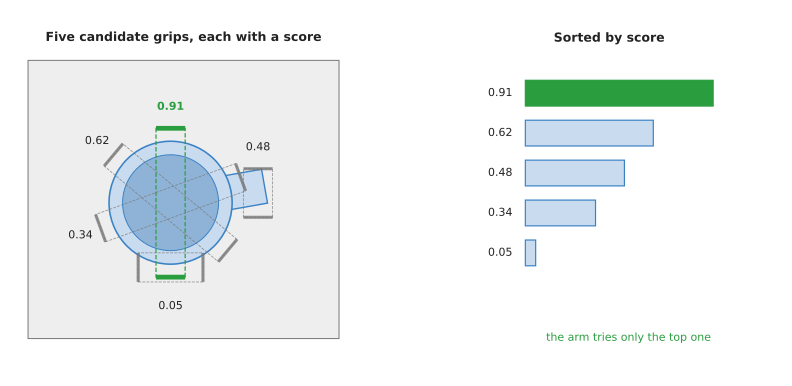
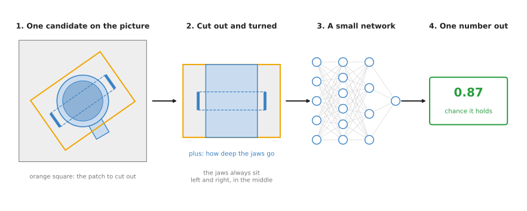
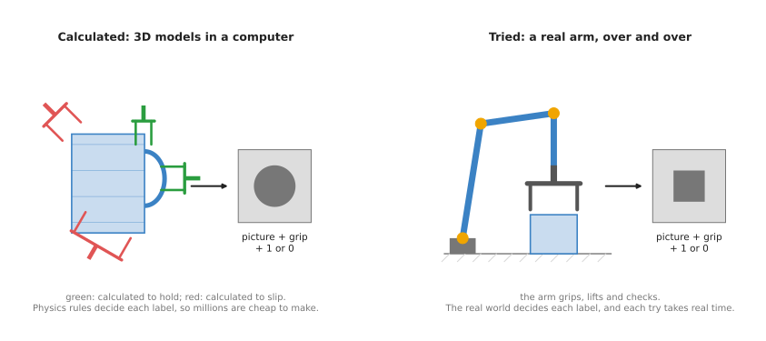

# Grasp quality models

This page is about grasp models that do not propose grasps at all, because
something else proposes the grasp and the model only judges it. A grasp quality
model looks at one proposed grasp and gives back a single number, which is how
likely that grasp is to hold. The robot therefore tries many possible grasps this
way and keeps the one with the best number.

So the page answers these questions, one section at a time. Why would you split
proposing a grasp from scoring it, and what does a quality model take in and give
back? How does it work inside, and where do its millions of training examples come
from? And which real models do this, which of them can you actually run, and which
should you pick?

It is for a reader who has already read the
[grasp models overview](../01_overview.md). Because the grasps a quality model
scores usually come from them, the [top-down](01_top-down-grasp-detection.md) and
[six-degree-of-freedom](../02_most-used/01_six-dof-grasps.md) pages help as well.
The [how a model learns](../../01_what-models-are/02_how-a-model-learns.md) page
explains the training loop that this page relies on.

## Contents

1. [What it is](#1-what-it-is)
2. [What goes in and what comes out](#2-what-goes-in-and-what-comes-out)
3. [How it works inside](#3-how-it-works-inside)
4. [How it is trained](#4-how-it-is-trained)
5. [Well-known models](#5-well-known-models)
6. [Where this is going](#6-where-this-is-going)
7. [Where to read next](#7-where-to-read-next)

---

## 1. What it is

Since the introduction said only that this kind of model judges grasps, this
section says what the judging actually is. A grasp quality model takes one proposed
grasp and gives back the chance that the grasp will hold.

Think of choosing a melon at a market, where you do not know in advance which melon
is the best one. You pick one up, press it, smell it and give it a mental mark.
Then you pick up the next one and do the same. After six melons you buy the one
with the best mark. A grasp quality model does the marking, while ordinary code
does the picking up. That is because the code proposes grasp after grasp and asks
the model to mark each one.

Each half of this split has a name of its own. The code that proposes grasps is the
**sampler**, and the grasps it makes are **candidates**, which are possible grasps
that nobody has checked yet. The quality model is the **scorer**, and it is
sometimes called an **evaluator** or a **critic** instead.



On the left are five candidate grasps on a mug seen from above, each with a score
from the model. On the right, the same five scores are sorted from best to worst,
so the ordering is easy to see. The arm tries only the top one, which closes across
the mug's body. The scores are made up for this drawing, so only their order means
anything.

---

## 2. What goes in and what comes out

Because the sampler and the scorer are separate, the scorer has to be told what the
sampler already knows, so its input has two parts.

- What the camera sees, usually a depth picture or a point cloud of the scene.
- One candidate grasp, such as a position, an angle and how deep the jaws go.

The output is a single number between 0 and 1. In other words, that number is the
model's guess at the chance that this grasp will hold the object when the arm lifts
it. A number used in this way is called a **probability**. So 0 means "certainly
not", 1 means "certainly", and 0.87 means "87 times out of 100".

Because the model is run once for each candidate, a sampler that proposes 200
grasps makes the model run 200 times. Those 200 runs can happen one after another,
or on all 200 together in one batch.

---

## 3. How it works inside

Since the last section described the scorer only from the outside, this section
opens it up. The best-known design is Dex-Net's **grasp quality convolutional
neural network (GQ-CNN)**, and it works in four steps.
[Section 5.1](#51-dex-nets-gq-cnn-the-design-everything-else-argues-with) describes
GQ-CNN as a model and marks it historical, because it is the clearest way to see the
design and not the one to run today.

1. **Cut out a patch.** Code cuts a small square out of the depth picture, centred
    on the candidate grasp's centre.
2. **Turn the patch.** Code turns the square so that the grasp's jaws sit at its
    left and right edges, which means every patch the network sees is lined up the
    same way. The network therefore never has to learn what a grasp at 30 degrees
    looks like as a separate case.
3. **Run the network.** A small convolutional neural network reads the turned
    patch, and it is given one further number as well, which is how deep the
    gripper would go. The
    [inside a neural network](../../01_what-models-are/03_inside-a-neural-network.md#4-convolutional-layers-small-pattern-detectors)
    page explains how such a network reads a picture.
4. **Give one number.** The network ends with a single output, which is the chance
    that the grasp holds.



A candidate on the depth picture, and the patch cut out around it and turned so the
jaws sit left and right. Then a small network reads that patch and gives one number
out.

Step 2 is the clever part, because turning each patch removes the angle from the
problem altogether. The network then only has to learn one thing, which is whether
the shape lying between two jaws, lined up left and right, can be held.

Quality models for 6-DoF grasps work the same way, except that they start from a
point cloud rather than a depth picture. Code takes the points that lie between the
gripper's fingers, turns them into the gripper's own frame, and passes them to a
point cloud network. The
[point cloud models](../../04_3d-models/02_most-used/01_point-cloud-models.md) page
explains those networks in detail. There are two ways to finish that step, and
section 5 recommends one model of each. GPD draws those points as a small picture
first and scores the picture, which
[section 5.2](#52-gpd-the-scorer-you-are-allowed-to-sell) covers, while PointNetGPD
passes the points themselves to the network, which
[section 5.3](#53-pointnetgpd-scoring-the-raw-points-instead-of-a-picture-of-them)
covers.

The newest scorers cut nothing out at all. GraspGen's discriminator, in
[section 5.4](#54-graspgens-discriminator-the-modern-scorer-inside-a-generator),
reads the whole point cloud of one object and is told the grasp separately, as the
gripper's own shape moved into position. So the question that separates the models in
section 5 is not how clever their networks are. It is what each one is allowed to
look at: a small depth patch cut out around the grasp, the points that lie inside the
gripper's closing region, or the whole object with the grasp drawn into it. A scorer
can only judge what it was shown, and whatever was cut away is something it cannot
notice.

One model in section 5 scores something else again. QT-Opt, in
[section 5.5](#55-qt-opt-what-real-robot-labels-cost), scores a small movement of the
arm rather than a finished grasp, so its number says how good it would be to move
the gripper a little in one direction. It is in the list for what its training data
cost rather than as a design to copy.

### Where the candidates come from

Because a quality model is only as good as the candidates it is given, the sampler
matters as much as the scorer does. Three kinds of sampler are common, and any of
them can feed the same scorer.

- The simplest sampler picks at random and then checks the geometry, because code
    can pick pairs of points on the object's edge that face each other so that both
    jaws would press straight in. Book 3's
    [antipodal test](../../../03_frameworks/02_gripping/03_choosing-a-grip.md#3-friction-cones-and-the-antipodal-test)
    explains this check. GPD carries a sampler of this kind in the same program as
    its scorer, which is why section 5 recommends it to anybody who has no sampler
    of their own.
- A better sampler refines the best candidates instead of stopping after one round,
    so code samples some candidates and scores them, and then samples new
    candidates near the best ones and scores those as well. After a few rounds the
    candidates gather around the best grasp, and this way of searching is called the
    **cross-entropy method**.
- The candidates can also come from another model, so that a
    [6-DoF grasp model](../02_most-used/01_six-dof-grasps.md) proposes the
    candidates and the quality model then re-scores them. The newest scorers are
    trained in that arrangement from the start, beside the model that proposes the
    candidates rather than on their own, and GraspGen's discriminator in
    [section 5.4](#54-graspgens-discriminator-the-modern-scorer-inside-a-generator)
    is the example to take apart.

---

## 4. How it is trained

Because the network described above has to learn its scores, it needs examples.
Every example is a picture, a grasp and a label, where the label is 1 if the grasp
held and 0 if it did not. There are two ways to get those labels, and they cost
very different amounts.



On the left, physics formulas judge grasps on a 3D model, and the computer draws a
depth picture. On the right, a real arm tries each grasp, lifts it and checks what
happened. Both routes give the same kind of example, which is a picture, a grasp
and a 1 or a 0.

### Calculated on 3D models

This is how Dex-Net was trained, and it is the cheaper of the two routes because it
never touches a robot at all.

1. Collect thousands of 3D models of objects.
2. On each model, place many candidate grasps.
3. For each grasp, compute a **quality metric**, which is a number from physics
    formulas that says how much push or twist the grasp can resist before the
    object slips. Book 3's
    [grasp quality metrics](../../../03_frameworks/02_gripping/03_choosing-a-grip.md#9-grasp-quality-metrics-you-can-compute)
    explains these formulas.
4. Repeat the calculation many times with small random changes, such as the object
    moved a little, the gripper a little off and the friction a little lower, and
    then average the results. A grasp that still holds after all these small
    changes is called **robust**, so the label is 1 when the average is high enough.
5. Draw a depth picture of the object from a virtual camera, as a real camera would
    see it, with added noise.

This way is cheap and fast, because a computer can make examples far quicker than
an arm can try them. Dex-Net 2.0 was trained on 6.7 million examples made like
this, with no robot involved at any point.

### Tried on a real arm

Instead of that speed, the other route buys real results by letting real arms try
grasps for weeks.

1. The arm looks at a bin, picks a grasp, often at random at first, and tries it.
2. It lifts and checks whether anything is held, and a camera or the gripper's
    finger position tells it the answer.
3. The picture, the grasp and the result are saved.
4. The arm drops the object back in the bin and tries again, day and night.

Google's arm farm used this route, and between 6 and 14 arms made more than 800,000
grasp attempts to train one quality model. Its labels are real, so there is no gap
between simulation and reality, but collecting them is very slow and very
expensive.

---

## 5. Well-known models

Both training routes above have produced working models, and this section names
them. It also answers the question a developer actually has about this family, which
is whether a grasp quality model is something you run or something you understand.
Two of these five are something you run on their own, one is something you run
inside a bigger model, and two are something you only read about.

Read the table one row at a time. The left column names the model, the year it was
published and how current it is, and the two rows marked historical are the two you
only read about. The right column holds everything else: what the model is given and
what it gives back, how big it is and what hardware it needs, the licence on its
code, and the one condition that should make you choose that row. What a model is
given comes first in that column, because it differs more here than in any other
family. Each licence is the licence on the code, and Book 3's
[models that grasp](../../../03_frameworks/02_gripping/04_models-that-grasp.md)
read every one of them from the project's own licence file in September 2026.

| Model | What decides it |
| --- | --- |
| [**GQ-CNN**](https://github.com/BerkeleyAutomation/gqcnn), from Dex-Net 2.0 (2017), historical | It scores one top-down grasp, from a 96 by 96 depth patch. It is four convolutional layers of 16 filters and two fully connected layers of 128, and it needs TensorFlow 1.15 or below. Its code licence is a University of California Regents grant for education, research and not-for-profit use only. Pick it when you are reproducing Dex-Net, or learning the design it started. |
| [**GPD**](https://github.com/atenpas/gpd) (2017), most used in 2026 | It scores one six-degree-of-freedom candidate, from the points between the jaws. It is a small network in C++, and it requires no graphics card. Its code licence is BSD-2-Clause. Pick it when you need a scorer you can sell, on a machine with no NVIDIA card. |
| [**PointNetGPD**](https://github.com/lianghongzhuo/PointNetGPD) (2019), worth betting on | It scores one candidate, from 500 raw points between the jaws. It is a small point cloud network in PyTorch. Its code licence is MIT. Pick it when your point cloud is sparse, or when you want to retrain the scorer yourself. |
| [**GraspGen**](https://github.com/NVlabs/GraspGen)'s discriminator (2025), worth betting on | It scores many six-degree-of-freedom grasps against one object's point cloud. Its size is `not stated`, and it needs an NVIDIA graphics card. The code is under the non-commercial NVIDIA License, and the weights are under the NVIDIA Open Model License. Pick it when you already run GraspGen and want it to rank candidates of your own. |
| **QT-Opt** (2018), historical | It scores a small movement of the arm, rather than a finished grasp. Its size is `xs`, and no code or weights were published, so its licence is `not stated` as well. Never pick it, and read it instead to see what labels from real robots cost. |

### 5.1 Dex-Net's GQ-CNN, the design everything else argues with

**Historical.** It is the model this whole page is describing, and it is the one to
understand, but its code needs TensorFlow 1 and its licence forbids commercial use,
so it is not the one to run.

Size xs, a laptop, and a University of California Regents licence for education,
research and not-for-profit use only.

GQ-CNN is the grasp quality convolutional neural network, published in 2017 by Jeff
Mahler and others in the AUTOLAB group at the University of California, Berkeley, in
[Dex-Net 2.0](https://arxiv.org/abs/1703.09312). It is the four-step design in
section 3: cut a patch, turn it so the jaws are level, run a small network on that
patch together with the gripper's height, and give one number out. Its configuration
file shows how small that network is. It takes a 96 by 96 patch, and it has four
convolutional layers of 16 filters each, then two fully connected layers of 128.

The one idea GQ-CNN is built on is that a grasp can be judged from a small window
around it, once that window has been turned so that every grasp looks the same way
up. Nothing outside the window reaches the network, and nothing about the object's
name, its full shape or the rest of the scene reaches it either.

Inside, the network has two inputs rather than one, and the project's own
configuration calls them streams. The patch goes through the convolutional layers,
which is the picture stream. The gripper's height, which is one number saying how
far down the jaws would go, goes through a very small stream of its own. The two
streams are joined late, in a fully connected layer near the end, and the layer
after the join gives the score. The height needs an input of its own because it is
not something the patch can show: the same cut-out patch of a mug
means "holds" at one height and "closes on nothing" at another, so without the
height beside the picture the question has no answer.

What the turning buys is the angle. Because code rotates every patch so that the
jaws lie at its left and right edges, the network never meets a grasp at thirty
degrees as a different case from a grasp at zero, so it learns one question about
shape instead of many. What the window costs is everything around it. The patch is
cut at a fixed size, so an object wider than the patch is judged on the part that
fitted inside, and whatever the gripper's body would collide with on the way in was
cropped away before the network looked. A score of 0.9 therefore means that the
shape between the jaws can be held, and not that the grasp can be reached.

On a robot arm the difference from GPD in the next sub-section shows up as soon as
the grasp is not straight down. GQ-CNN's patch is a window on a depth picture, so
the grasp it scores is a pixel, an angle in the plane of that picture and a height,
and nothing in that description can say that the gripper comes in from the side. GPD
scores the points between its jaws in three dimensions, so a sideways grasp is an
ordinary case for it. If your camera looks straight down into a shallow tray, the
patch is enough and GPD's extra machinery buys you nothing; if anything has to come
off a shelf, the patch cannot describe the grasp at all.

The obvious alternative is to compute the quality metric from physics instead, with
the formulas in Book 3's
[grasp quality metrics](../../../03_frameworks/02_gripping/03_choosing-a-grip.md#9-grasp-quality-metrics-you-can-compute).
Choose GQ-CNN when you do not have a 3D model of the object and do not know exactly
where it is, which is the whole point of it. Dex-Net 2.0 used those formulas once, in
simulation, to make 6.7 million training examples, and the network then reproduces
their judgement from a single noisy depth picture of an object it has never seen.

What it costs you is the install and the meaning of the number. The code pins
TensorFlow at 1.15 or below and names Python 3.5 to 3.7, so it needs an environment
of its own, and the project has had no commits since January 2022. Its own installer
looks for an NVIDIA card and falls back to the processor-only TensorFlow when it
finds none, which is why a laptop is enough to run it. The thing that most often
goes wrong is not the code at all, and it is this: the score is calibrated against
the way the labels were made, which was a simulation with an assumed friction and an
assumed gripper, so a score of 0.8 does not mean that this grasp succeeds eight
times in ten on your arm.

The library is [gqcnn](https://github.com/BerkeleyAutomation/gqcnn), which you clone
rather than install. The class below is the scorer alone, without the sampling and
the searching that the full Dex-Net policy wraps around it.

```python
import numpy as np
from autolab_core import Point, YamlConfig
from gqcnn.grasping import GQCnnQualityFunction, Grasp2D

config = YamlConfig("cfg/examples/gqcnn_pj.yaml")           # names the weights folder
quality_fn = GQCnnQualityFunction(config["policy"]["metric"])

candidates = [
    Grasp2D(Point(np.array([u, v]), frame=camera_intr.frame),
            angle=angle,        # radians, anticlockwise from the picture's x axis
            depth=depth,        # metres from the camera to the grasp centre
            width=0.05,         # how far my gripper opens, in metres
            camera_intr=camera_intr)
    for (u, v, angle, depth) in my_own_candidates
]
scores = quality_fn(state, candidates)   # one float per candidate, between 0 and 1
```

The library gives you the trained network and the cropping that feeds it, and the
cropping matters more than it looks. `quality_fn` cuts a patch out of your picture
around each candidate and turns it so the grasp is level, which is how the network
was trained; feed it a whole picture instead and the numbers mean nothing. What you
have to supply is the `state`, which is an `RgbdImageState` built from a depth
picture, the camera's intrinsic parameters and a mask of the objects, and the
candidates themselves with a `width` in metres on each, which is your gripper's
number and not the model's. If you have no sampler,
`AntipodalDepthImageGraspSampler` in the same repository is one, and
`CrossEntropyRobustGraspingPolicy` is the full search from section 3.

### 5.2 GPD, the scorer you are allowed to sell

**Most used in 2026** of the scorers that run on their own, because it is the only
one with a licence that permits commercial use and no NVIDIA graphics card in its
requirements.

Size xs, a laptop, BSD-2-Clause.

GPD stands for grasp pose detection. Andreas ten Pas, Marcus Gualtieri, Kate Saenko
and Robert Platt published it in 2017, from Northeastern University, in a paper
called [Grasp Pose Detection in Point Clouds](https://arxiv.org/abs/1706.09911). It
is a sampler and a scorer in one C++ program: it samples candidate grasps on a point
cloud, keeps the ones that pass the geometric test in Book 3's
[antipodal test](../../../03_frameworks/02_gripping/03_choosing-a-grip.md#3-friction-cones-and-the-antipodal-test),
turns the points between the jaws into a small picture, and scores that picture with
a small network.

The one idea GPD is built on is that the only thing worth looking at is the volume
the jaws are about to close on, which it calls the closing region. Everything
outside that volume is dropped, and everything inside it is described in three
dimensions rather than as a window on a picture, which is what lets one scorer judge
a grasp coming in from any direction.

Inside, the points of the closing region are turned into a small picture before the
network sees them, and that picture is not a photograph of anything. The points are
flattened onto flat planes, and each plane contributes several layers of numbers:
how high the surface stood, which way it faced, and which part of the volume was
hidden behind the surface from where the camera stood. The shipped weights read
fifteen such layers. A three-layer version is shipped as well, and the project says
it runs faster and grasps worse. There are separate weights for two depth cameras,
because a second viewpoint fills in surfaces the first could not see. The network
reading this stack is a small classifier of the LeNet kind, and the project builds
it against several frameworks so that it can run on a processor alone.

What drawing the points as a picture buys is the network. A small convolutional
classifier was, in 2017, the thing that trained reliably and ran fast, and
flattening the points is what allowed a three-dimensional question to be asked of
one. What it costs is emptiness. A plane with few points on it is mostly blank, and
a blank cell cannot be told apart from a flat surface, so a thin object, or one the
camera sees edge on, gives the network a picture with almost nothing in it.
PointNetGPD in the next sub-section exists because of exactly this.

On a robot arm the difference from GQ-CNN is the direction the gripper may come
from, and the difference from the models on the
[top-down page](01_top-down-grasp-detection.md) is how much you have to build. GPD
samples its own candidates, tests them against the gripper geometry you wrote into
its configuration file, and scores the survivors, so a bottle lying on its side on a
shelf gets grasps that come in horizontally without you writing anything about
shelves or bottles.

The obvious alternative is Dex-Net's GQ-CNN. Choose GPD instead because it answers
in three dimensions and brings its own sampler, and because of the two it is the one
you may put in a product and the one that does not ask for an NVIDIA card. Its
stated requirements are PCL, Eigen and OpenCV, with no CUDA among them.

What it costs you is its age and its language. It was last pushed in January 2022,
so treat it as finished rather than maintained, and the obstacle is the dependencies
rather than the algorithm, because it asks for OpenCV 3.4 and PCL 1.9. It is C++, so
there is no Python API, only a [ROS wrapper](https://github.com/atenpas/gpd_ros).
The thing that most often goes wrong is the configuration file, because the gripper
geometry and the search volume both live in it, and a search volume left at the
example's value finds nothing in your scene.

The library is the compiled package itself. The quickest check that your install
works is its own example, which scores the grasps in one supplied point cloud file.

```bash
cd gpd/build
./detect_grasps ../cfg/eigen_params.cfg ../tutorials/krylon.pcd
```

Once that runs, the code below is the same work from your own program.

```cpp
#include <gpd/grasp_detector.h>

// The config file holds the gripper geometry, the search volume, the number of
// samples and the path to the weights. Your gripper goes in there, not here.
gpd::GraspDetector detector("cfg/eigen_params.cfg");

// view_points is a 3 by 1 matrix holding where the camera was.
gpd::util::Cloud cloud("scene.pcd", view_points);
detector.preprocessPointCloud(cloud);

// Samples candidates, scores every one, and returns the survivors.
auto hands = detector.detectGrasps(cloud);

for (const auto &hand : hands) {
  std::cout << hand->getScore()                      // the scorer's number
            << " " << hand->getPosition().transpose()
            << " " << hand->getApproach().transpose()
            << " " << hand->getGraspWidth() << std::endl;
}
```

The library gives you the sampler as well as the scorer, which is the difference
from every other row in the table. What you have to supply is a point cloud, the
camera position so that GPD knows which side of each surface was seen, and your
gripper's geometry in the configuration file. `filterGraspsDirection` throws away
every candidate whose approach is more than a given angle from a direction you
choose, which is how you make GPD answer the top-down question that the
[top-down page](01_top-down-grasp-detection.md) asks.

### 5.3 PointNetGPD, scoring the raw points instead of a picture of them

**Worth betting on**, because scoring the points between the fingers directly is
what the newest models do as well, and this is the smallest and most permissive
example of it.

Size xs, a laptop, MIT.

PointNetGPD was published in 2019 by Hongzhuo Liang and others at the University of
Hamburg, in a paper called
[PointNetGPD: Detecting Grasp Configurations from Point Sets](https://arxiv.org/abs/1809.06267).
It keeps GPD's sampler and replaces GPD's scorer. Instead of turning the points
between the jaws into a small picture, it passes the points themselves to a point
cloud network, which the
[point cloud models](../../04_3d-models/02_most-used/01_point-cloud-models.md) page
explains. The released model reads 500 points.

The one idea PointNetGPD is built on is that the points inside the closing region
should be handed to the network as points. GPD's flattening throws away which point
sat behind which, and it fills a grid of cells whether or not there is anything to
put in them. A network that reads points as points has no grid to fill.

Inside, the points go to a network of the PointNet family, which the
[point cloud models](../../04_3d-models/02_most-used/01_point-cloud-models.md) page
describes. Such a network looks at every point on its own, with the same small set
of weights for all of them, and then combines all those per-point results in a way
that does not depend on the order the points arrived in. That last property is what
makes a list of points readable at all, because a list of points has no natural
order and a convolution needs one. The released model is handed 500 points,
expressed in the gripper's own frame, and it ends in three outputs rather than one,
so its answer is a choice between bad, fair and good rather than a single
probability.

What the points buy is sparse data. A handful of points scattered through the
closing region is a handful of inputs to this network, while the same handful drawn
on flat planes is a picture that is almost entirely blank, and that is the case its
own paper puts forward. What it costs is everything GPD was doing around its scorer.
It keeps GPD's sampler, so the candidates are no better than they were, and cutting
out the points inside the jaws and moving them into the gripper's frame become your
code's job as soon as you are not running GPD itself.

On a robot arm the difference shows up on thin and edge-on things: a spatula flat on
a table, a plate standing in a rack, a cable. The camera returns a thin band of
points between the jaws, and GPD's flattened picture of that band is a few marks in
a blank field, while this network reads the band as what it is. For a mug or a box
in a bin, where the closing region is full of points, the two scorers are asking the
same question of the same data, and the flattening costs nothing.

The obvious alternative is GPD, whose sampler it borrows. Choose PointNetGPD instead
when the points between the jaws are few, because drawing a sparse set of points as
a picture leaves most of that picture empty, and a point cloud network does not care
how many points there are. It was also last pushed in May 2025, so of the two it is
the one that still installs, with its own instructions setting up a Python 3.10
environment.

What it costs you is the rest of the repository. The clone carries modified copies of
Berkeley's `meshpy` and `dex-net` packages, which you install from source, and the
instructions warn you not to have packages of those names already. The thing that
most often goes wrong is the frame, because the network wants the points expressed in
the gripper's own frame and nothing will tell you that you forgot to transform
them.

The library is the cloned repository, and the code below is the shortest path through
its own `main_test.py`.

```python
import numpy as np
import torch

# The released file holds the whole saved model, so nothing rebuilds the network.
model = torch.load("../data/pointnetgpd_3class.model", map_location="cpu")
model.eval()
torch.set_grad_enabled(False)

# local_pc holds the points that lie between the fingers for one candidate,
# already transformed into the gripper's own frame. Shape (500, 3), in metres.
x = torch.FloatTensor(local_pc.T[np.newaxis, ...])     # becomes (1, 3, 500)

out, _ = model(x)                 # log probabilities, one per class
scores = out.softmax(1)           # three classes: bad, fair and good
print(scores)
```

The library gives you the network and the code that trained it, on 350,000 point
clouds and grasps built from the YCB object set. What you have to supply is the
candidate sampling, the transform into the gripper's frame, and the cropping to the
points inside the jaws, all three of which GPD does for you. The released model gives
three classes rather than one probability, so you also have to turn three numbers
into one ordering, and taking the "good" class on its own is the usual choice.

### 5.4 GraspGen's discriminator, the modern scorer inside a generator

**Worth betting on**, because the field has stopped shipping standalone scorers and
started shipping a generator with its own scorer attached, and this is the clearest
example you can take apart.

Size not stated, a graphics card to run it and a cluster to train it, with the code
under NVIDIA's own non-commercial licence and the weights under the NVIDIA Open
Model License.

GraspGen is NVIDIA's 2025 grasp generator, published in a paper called
[GraspGen](https://arxiv.org/abs/2507.13097). A diffusion model proposes
six-degree-of-freedom grasps and a second network, which the project calls the
**discriminator**, scores and ranks them. A discriminator here is exactly the grasp
quality model this page describes, trained alongside the generator rather than on
its own. The project names as its own contribution a training recipe in which the
discriminator learns on the generator's output rather than on a fixed set of
candidates.

The one idea this discriminator is built on is that nothing needs to be cut out. It
is given the whole point cloud of one object and the grasp, and it works out for
itself which part of the object the grasp concerns.

Inside, there are two encoders and a small stack of layers that joins them. One
encoder reads the object's point cloud and turns it into a single list of numbers
summarising that object, and the code offers either a PointNet-style encoder for
this or a point transformer, which is a network in which points read one another
rather than only being pooled together. The other encoder reads the grasp, and in
the version the project recommends the grasp is not given as six numbers at all. The
gripper's own outline is stored as a handful of points, those points are moved by
the grasp's pose so that they sit where the gripper would sit, and that small cloud
is what the second encoder reads. The two summaries are then joined end to end, and
three narrowing layers turn them into one number. A further variant drops the second
encoder and puts the gripper's points into the object's own cloud, with one extra
number on every point saying whether it belongs to the object or to the gripper, so
that a single encoder reads the object with the grasp drawn into it.

What that shape buys is a low price for each extra candidate. The object's summary
depends on the object alone, so it is computed once and reused for every grasp being
scored, and each extra grasp costs only its own small encoder and the three joining
layers.
GQ-CNN and GPD have to cut out and prepare a fresh input for every candidate, so
their work grows with the number of candidates in a way this does not. What it costs
is a harder input. The cloud has to be one object and not a scene, so a segmentation
model must run first, and the cloud has to be moved so that its own average sits at
the origin, because that is how the model was trained.

The other difference is in the training, and it is the one the project puts forward
as its contribution. A scorer is normally trained on candidates from a sampler and
then asked, when it runs, about candidates from something else, so the grasps it
meets in service are not the grasps it was taught on, and some of its confidence is
misplaced. Here the candidates it trains on come from the generator it will be
paired with, while that generator is itself being trained, so it spends its training
looking at exactly the mistakes it will later be asked to catch. Two things follow
for you. The scores you get from the released weights are the scores of a model
matched to that generator, and if you retrain the discriminator yourself you will
not reproduce them, because the repository says plainly that on-generator training
is not released yet and that it is what the best scoring depends on.

The obvious alternative is to keep the scorer separate, as GQ-CNN and GPD do. Prefer
this shape when you are already running the generator, because the scorer inside it
was trained against that generator's candidates. You can still use it on its own,
because the function that runs the discriminator alone is a public part of the code.

What it costs you, beyond the line at the top of this sub-section, is one dependency
and one trap in the licensing. Book 3's
[what runs without CUDA](../../../03_frameworks/02_gripping/04_models-that-grasp.md#8-what-runs-without-cuda)
section records that it depends on `spconv-cu120`, for which no processor-only build
exists, so it needs an NVIDIA card and will not run on an Apple Silicon Mac. The
trap is that the successor repository
[GraspGenX](https://github.com/NVlabs/GraspGenX) is Apache-2.0, which does not make
a deployment permissive, because the weights you would actually run carry their own
terms and the training dataset carries a third set again.

The library is `grasp_gen`, inside the cloned repository and its Docker image. The
whole pipeline is one call, and so is the scorer on its own.

```python
from grasp_gen.grasp_server import (GraspGenSampler, load_grasp_cfg,
                                    score_grasps_with_discriminator)

cfg = load_grasp_cfg("/models/checkpoints/graspgen_robotiq_2f_140.yml")
sampler = GraspGenSampler(cfg)          # loads the generator and the discriminator

# object_pc is (N, 3) points on one object, in metres. Generate and rank in one call.
grasps, conf = GraspGenSampler.run_inference(object_pc, sampler,
                                             grasp_threshold=0.8, num_grasps=200)

# Or score candidates of your own. Both inputs must be moved so that the point
# cloud's own mean sits at the origin, because that is how the model was trained.
centre = object_pc.mean(dim=0)
my_grasps[:, :3, 3] -= centre           # my_grasps is (M, 4, 4) gripper poses
scores = score_grasps_with_discriminator(sampler.model,
                                         object_pc - centre, my_grasps)
```

The library gives you a working scorer for two named grippers, a Franka Hand and a
Robotiq two-finger, and a suction model. What you have to supply is a point cloud of
one object rather than of the whole scene, so you need a segmentation model first,
and the centring shown above, which the one-call path does for you and the
discriminator path does not. If your gripper is neither of the two, the project's own
advice is to reuse the nearer model and shift the grasp along the approach direction,
which is a guess rather than a calibration. The threshold is yours:
`grasp_threshold=0.8` keeps only grasps the discriminator is sure about, and `-1.0`
returns the best 100 whatever their scores.

### 5.5 QT-Opt, what real robot labels cost

**Historical.** No code or weights were published, so this is a result to know
rather than a model to use, and the result is about the price of training data.

Size xs, nothing to run, and no licence, because neither the code nor the weights
were published. The size comes from the paper's own description of the network, since
nothing was released for anybody else to measure.

QT-Opt was published in 2018 by Dmitry Kalashnikov and others at Google, in a paper
called [QT-Opt](https://arxiv.org/abs/1806.10293). It scored a small movement of the
arm rather than a finished grasp, so the robot asks how good it would be to move the
gripper a centimetre in some direction, and then makes the best movement, over and
over. It learned by trial and error, which the
[reinforcement learning policies](../../06_movement-models/03_also-used/01_reinforcement-learning-policies.md)
page covers, from more than 580,000 real grasp attempts.

The one idea QT-Opt is built on is that there is no such thing as a finished grasp to
score. The robot is somewhere, the object is somewhere, and the only question is
which small movement to make next. So the thing being scored is a movement, and the
number is not the chance that this movement holds the object. It is the chance that
the attempt ends with the object held, supposing the robot carries on sensibly after
this movement.

Inside, the network is given the camera's picture of the whole scene and one
proposed movement of the gripper, and it gives one number back. Nothing is cut out
and nothing is turned: the picture is the ordinary colour view from over the robot's
shoulder, and the movement is a few numbers saying where to go next and whether to
close the fingers. Because a movement is not a grasp, no geometry can be checked in
advance, so the search for the best movement is done by pushing many movements
through the network at every step and keeping the best one. That search runs again
on every step of every attempt, which is why this design needs a scorer that can be
run very many times.

What looking ahead buys is behaviour that no other model on this page can produce.
Because the number refers to the end of the attempt rather than to this grasp, the
robot is free to do things that are not grasps at all: nudge an object into a better
position, push two apart, or let go and try again. GQ-CNN and GPD cannot, because
each of them scores one finished grasp and the arm then carries it out blind. What it
costs is the labels. A label saying how good a movement was can only be found out by
carrying on to the end of the attempt and seeing, which is why the figure above is
more than half a million real attempts rather than a simulator run.

The obvious alternative is Dex-Net's route, which bought its labels from a physics
simulation. QT-Opt measures what the other route costs: it removes the gap between
simulation and reality completely, and the bill is more than half a million attempts
and months of robot time. That is the number to quote when somebody proposes
collecting their own grasp data instead. Nothing was released, so there is no code.

### 5.6 How to choose

If you want a grasp quality model running this week, use GPD. It brings its own
sampler, its BSD-2-Clause licence lets you sell what you build, and it is the only
one here that does not ask for an NVIDIA graphics card. Budget your time for its
2022-era C++ dependencies rather than for the model.

Three things change that choice.

- If you already run a six-degree-of-freedom generator, do not add a separate
    scorer. Use the one inside it, which for GraspGen means
    `score_grasps_with_discriminator` on your own candidates. A scorer trained
    beside the generator matches the generator's mistakes better than any scorer
    added afterwards.
- If your points between the jaws are few, because the object is thin or the camera
    sees it edge on, use PointNetGPD. It reads the points as points rather than
    drawing them as a picture, and it is MIT and still installs.
- If you have a full 3D model of the object and know where it is, do not use a
    learned scorer at all. Compute the quality metric from the physics formulas in
    Book 3's
    [grasp quality metrics](../../../03_frameworks/02_gripping/03_choosing-a-grip.md#9-grasp-quality-metrics-you-can-compute),
    which is exact and needs no training data. 

Whichever you pick, the sampler decides more than the scorer does, and the reason is
that a good scorer cannot choose a grasp nobody proposed. Spend your effort on the
candidates before you spend it comparing scorers.

---

## 6. Where this is going

The models in section 5 span 2017 to 2025, and the interesting thing about that span is
not that the networks got better. It is that the scorer stopped being a thing of its
own. This section says where that leaves the family. It was written on 4 October 2026,
every link in it answered on that day, and the repository dates and star counts were
read from GitHub's own application programming interface on that day.

Book 3's frontier chapter sorts forward-looking statements into
[four kinds of claim](../../../03_frameworks/08_frontier/06_what-is-coming.md#1-four-kinds-of-claim-and-why-the-difference-decides-everything),
and this section uses those words. A demonstration is a recording of something working
once under conditions the publisher chose. A product announcement says something can be
bought or downloaded, so you can check it. A research result is a measured number on a
stated task. A projection is a statement about a date that has not arrived, and it is
the weakest. Where a sentence below is my own judgement, it says so.

The shape of the change is one step repeated, and each step moved the scorer closer to
whatever proposes the grasps. GQ-CNN was handed a 96 by 96 depth patch that ordinary
code had cut out and rotated. GPD was handed the points between the jaws, which is less
preparation and more information, and it brought its own sampler. PointNetGPD read those
points as points instead of drawing them as a picture. GraspGen then removed the last
gap by training the scorer beside the generator that would feed it. Read in that order,
the family did not improve so much as dissolve into the thing above it.

Where these models are used in industry is largely unpublished. A vendor selling a
picking cell publishes picks per hour and the kinds of item it handles, not whether a
learned scorer sits in its pipeline, and I found no vendor saying either way.

The clearest documented line from section 5 to something you can buy runs through Ambi
Robotics. The University of California, Berkeley's own licensing office
[states](https://ipira.berkeley.edu/node/171) that the company "grew from the Dexterity
Network (Dex-Net) project at UC Berkeley", and names Ken Goldberg and Jeff Mahler among
its founders, which are the names on GQ-CNN. Its own
[site](https://www.ambirobotics.com/) today sells AmbiSort and AmbiStack, which sort
parcels from a bulk input flow and stack them. Those are product announcements, but the
site does not say what is in the model now.

Two facts about tooling are checkable. The first is that the supported path from a Robot
Operating System application to a learned grasp scorer has lost its maintainer. [PickNik
Robotics](https://picknik.ai/) published
[deep_grasp_demo](https://github.com/PickNikRobotics/deep_grasp_demo), which wrapped
both GPD's point-cloud scorer and Dex-Net's depth-picture scorer as grasp generators
inside the
[MoveIt Task Constructor](https://github.com/moveit/moveit_task_constructor), and GitHub
reports it as archived with its last push on 12 August 2026 and 146 stars. Archived
means read-only. The second is that what you
can obtain today is a scorer inside a generator rather than one on its own.
[AnyGrasp's software development kit](https://github.com/graspnet/anygrasp_sdk) is the
strongest and the least free: its readme states that "due to the IP issue, currently we
can only release the SDK library file of AnyGrasp in a licensed manner", and you apply
with your machine's feature identifier. The
[six-degree-of-freedom](../02_most-used/01_six-dof-grasps.md) page covers it.

One named industry claim is worth reading carefully, because it shows how far a
demonstration can travel. On 6 May 2024 NVIDIA
[published a post](https://blogs.nvidia.com/blog/alphabet-intrinsic-robotics-isaac-manipulator/)
about its collaboration with [Intrinsic](https://intrinsic.ai/), the robotics software
company owned by Alphabet, saying the work "demonstrates the potential for a universally
applicable
robotic-grasping skill to work across grippers, environments and objects", and quoting
Intrinsic's chief executive Wendy Tan White. Nothing in that post was for sale or for
download, and the sentence contains the word "potential". My own reading, two and a half
years later, is that the thing which did ship across grippers came from NVIDIA Research
rather than from that collaboration, and it is two paragraphs below.

What is being worked on right now has four live threads, and the first is the centre of
the other three: the scorer as a discriminator trained beside a generator. GraspGen
states that recipe as its own contribution in the
[paper](https://arxiv.org/abs/2507.13097), and
[section 5.4](#54-graspgens-discriminator-the-modern-scorer-inside-a-generator)
describes how it works. The part to watch is that the recipe is published and the code
is not. Its [readme](https://github.com/NVlabs/GraspGen) says plainly that "on-generator
training is not released for the discriminator training (yet)", and that it will arrive
with the data generation repository. So the idea this family is currently organised
around is a research result you can read and cannot run, and whether that changes is
checkable by reading one line of one readme.

The second live thread is scoring that takes the gripper as an input.
[GraspGenX](https://github.com/NVlabs/GraspGenX) is the released attempt: its readme
states that the published model was "trained with a large-scale simulated grasp dataset,
spanning over 2 billion grasps computed across 32 procedurally generated grippers", and
claims it generalises to real grippers it never saw. That claim is a research result and
I have not measured it. It matters more for a scorer than for a generator, because a
score is a probability about one specific pair of jaws closing on one specific shape, so
a scorer trained for a Franka Hand answers a different question from the one you asked
when your gripper is a Robotiq. GQ-CNN could not be told, and GraspGen's readme says it
supports three grippers.

The third is a quieter change in what the scorer is for. GraspGenX's documentation
describes its candidates as grasps sampled by diffusion combined with grasps from
oriented bounding boxes, "all scored by the discriminator". The generator is no longer
the only source of candidates, and the discriminator is what makes a mixed set
comparable, because a geometric candidate and a diffusion candidate have no common score
until one model gives them one. My reading is that this gives the scorer back an
independent job: not a package you install, but the component that lets a system combine
a learned sampler with a geometric one. The warning in
[section 5.6](#56-how-to-choose) that the sampler decides more than the scorer is why
that job is worth having.

The fourth is happening outside grasping and is the one I would watch hardest. Book 3's
frontier chapter records that
[LeRobot 0.6.0](../../../03_frameworks/08_frontier/06_what-is-coming.md#23-lerobot-which-now-releases-on-a-predictable-rhythm),
on 6 July 2026, added two reward models as downloadable policies. A reward model scores
whether an attempt is going well, and a grasp quality model scores whether one grasp will
hold, so the second is the first with a horizon of one step. I could find no released
model that does both jobs from one set of weights, and that absence is the interesting
part.

Three things are still unsolved, and the first will affect you on your first day. A
score is not calibrated. A 0.8 from any model on this page is not a claim that eight in
ten such grasps hold, and I found no published curve relating a learned grasp score to
measured success across a stated object set. That is why every interface here makes you
choose a threshold yourself, including GraspGen's `grasp_threshold`, and why the only
honest way to set one is to try grasps on your own objects and count.

The second is that labels made in simulation depend on a contact model nobody has fixed.
Section 4 describes the cheap route to labels, and Book 3's frontier chapter is blunt
about what that physics rests on: the friction coefficient, the surface compliance and
the stiffness of a rubber pad are
[still numbers somebody typed in](../../../03_frameworks/08_frontier/04_simulation-and-evaluation.md#54-what-still-does-not-transfer),
and the same chapter concludes that simulation tells you whether your reasoning is right
rather than whether your grasp will hold. So the limit on the cheap route is the
simulator rather than the network or the amount of data.
[Section 5.5](#55-qt-opt-what-real-robot-labels-cost) measured what avoiding it costs,
and nobody has repeated that measurement.

The third is that no released scorer takes a constraint. You cannot ask whether a grasp
leaves the handle free, or whether it suits pouring rather than lifting. The argument
this page makes for scorers over map painters is that you may hand them your own
candidates, which is a weaker version of the same need: you choose where to look, but
not what for.

Now for the next two to three years. Everything below is my expectation rather than an
announcement, and each one gives its reason, because a prediction without a reason is
noise.

I expect standalone scorers to stop being released, and scoring to ship as a component
of something larger. The reason is the record. The last new standalone scorer in section
5 is PointNetGPD from 2019, last pushed on 30 May 2025; GPD's last push was 31 January
2022; the one integration that packaged either of them for application developers is
archived; and the two most recent releases in this area, GraspGen and GraspGenX, are
both generators with a discriminator inside. A new standalone scorer with a permissive
licence and a maintainer would show me wrong.

I expect on-generator training to become the default recipe for any scorer that is
trained at all, because it fixes a defect no amount of extra data can fix. A scorer
trained on a sampler's candidates and then asked about a generator's candidates is
answering about grasps it never studied, and that mismatch is structural rather than a
shortage. Training the scorer on the generator's own output removes it by construction.
The mechanism is a research result in GraspGen's paper. The timing is a projection, and
a weak one, because NVIDIA has said the code is coming and has given no date.

I expect a scorer that does not take the gripper as an input to start looking obsolete,
in the way a network with a hard-coded image size looks obsolete now. The alternative has
become expensive to maintain: one checkpoint per gripper means a new training run for
every customer's hardware, GraspGen's readme already redirects you to GraspGenX for any
gripper beyond its three, and the advice this page records for a mismatched gripper,
which is to reuse the nearest model and shift the grasp along the approach direction, is
a guess rather than a calibration.

I expect the grasp scorer and the reward model used for policy learning to converge, and
this is the prediction I am least sure of. Both answer "will this go well", both are
trained in simulation at large scale, and a policy that can judge its own attempt is the
missing piece in every method that learns by practising, which is the reading Book 3's
frontier chapter gives of reward models arriving in LeRobot. The reason to doubt it is
that a grasp score is about one closing of two jaws while a reward model is about a
sequence. The checkable sign would be a released checkpoint used both to rank grasp
candidates and to score policy rollouts.

I expect the physics formulas not to go away, which is the least exciting prediction here
and the most reliable. When you have the object's mesh and its pose, Book 3's
[computable quality metrics](../../../03_frameworks/02_gripping/03_choosing-a-grip.md#9-grasp-quality-metrics-you-can-compute)
are exact and cost nothing, and a learned scorer trained on simulated labels is at best
an approximation of them seen through a camera. What I do not expect is a calibrated
score, because calibrating one means real attempts at the scale section 5.5 priced, and
nobody has an incentive to publish a curve that turns their 0.9 into a 0.6.

---

## 7. Where to read next

- [Six-degree-of-freedom grasps](../02_most-used/01_six-dof-grasps.md) covers the
    generators that most quality models are paired with today.
- [Reinforcement learning policies](../../06_movement-models/03_also-used/01_reinforcement-learning-policies.md)
    covers learning by trial and error, which QT-Opt used.
- [Force and slip models](../../09_touch-and-body-models/02_most-used/01_force-and-slip-models.md)
    covers checking, after the fingers close, whether the grasp is really holding.
- Book 3's [choosing a grip](../../../03_frameworks/02_gripping/03_choosing-a-grip.md)
    explains the physics formulas behind calculated labels.
- Book 3's [models that grasp](../../../03_frameworks/02_gripping/04_models-that-grasp.md)
    lists the code and licences for Dex-Net and GPD.
